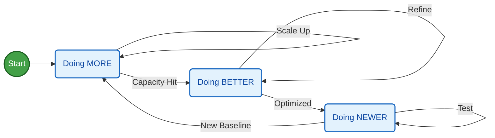

**TL;DR**

Building around what every business needs: *finding clients*

**Intro**

We are coming from the latest apify / sales / leads related post.

So if you are a pro sales person, you can drop here.

You already know everything and got nothing to learn.

For the rest of you: *here we go with a new [agency business idea](#the-how-behind-this-idea)*.

The question is: can someone like a *Lead Architect* use this to find clients that...need this kind of service?

If this doesnt work, it means that it would be of no value for any 3rd person.

Or that I gave up too quickly :)

* https://www.firecrawl.dev/use-cases/lead-enrichment

| Feature | Marketing Ops (MOPs) | Revenue Ops (RevOps) |
| --- | --- | --- |
| **Primary Goal** | Generate & Nurture Leads | Maximize Total Revenue |
| **Focus Area** | The "Top" of the funnel | The **Entire** funnel (Sales + Marketing + Support) |
| **Key Metric** | Cost Per Lead (CPL) | Customer Lifetime Value (LTV) / Revenue |
| **Success looks like...** | A database full of "Hot" leads. | A predictable, growing bank account. |

---

## Conclusions

> The Related: BRD, tech stack, dev phases, sales, more sales and landing psyc

Are you applying already **the 100 rule** withing your [4w-launchpad](#the-4-weeks-launchpad)?

MORE (more and more), better, new.

Just go there and look for clients: 100 min a day or 100 calls a day, for 100 days.

If you got no clients: refine what you offer.

You cant travel back in time.

But you can bring knowledge from the future to the present, simplifying and accelerating your journey.


  
  


Remember: *We pay in the currency you value the least* ;)

---

## FAQ

### The HOW behind this idea

Starting with my latest [business skeleton here](https://jalcocert.github.io/JAlcocerT/ideas-and-opportunities-health-check/).

| Element | Decision |
| :--- | :--- |
| **One Avatar** | |
| **One Product** | |
| **One Channel** | One of the ,Core-4': Warm OutReach / Free Content / Cold OutReach / Paid Ads |
| The Lead Magnet | Strategy Type: , Delivery Method: |

The Matrix: *Strategy vs. Medium for leads*

| Strategy (The 3 Types) | Software Delivery | Information Delivery | Service Delivery | Physical Delivery |
| --- | --- | --- | --- | --- |
| **1. Reveal the Problem** | A "Profit Leak" Calculator. | A "Red Flag" PDF Checklist. | A Free 5-Min Security Audit. | A "Water Hardness" Testing Kit. |
| **2. Give a Sample** | 7-Day Trial of a CRM. | A Free Masterclass Lesson. | A 15-Min Mini-Consult. | A Trial-Sized Supplement. |
| **3. Step 1 of N** | A template pre-loaded in an app. | A "How to Set Up Your LLC" Guide. | A "Done-for-you" Website Header. | A "Starter Tool" (e.g., a free brush for a paint kit). |

The **Tier of Service**: DFY *because The value ladder is a thing*

The **fundamental nature of the business model** and its primary bottleneck

| Feature | **Guest Photo WebApp** | **Educational Model** | **The Lead Architect Agency** |
| --- | --- | --- | --- |
| **Business Archetype** | B2C Indie Hacker (SaaS-Lite) | Info-Product / Course |  |
| **Primary Lever** | **Volume** | **Volume** | **Price** |
| **Strategic Tag** | **[GROWTH BET]** | **[GROWTH BET]** | |
| **Customer Intent** | Emotional (Memories) | Aspirational (Success) |  |
| **Execution Risk** | Technical/Server Downtime | Content Obsolescence |  |
| **Main Constraint** | **Demand (Marketing, ads)** | **Demand (Attention)** | **Supply (Expert Hours)** |
| **Macro Winner** | Low-cost luxury (Recession) | Upskilling (Recession) |  |

The **GTM strategy** is a cross-functional roadmap that answers the question: *How will we bring this new product to market successfully?* 

It aligns all key business functions, including:

* **Product:** What are we selling? What problem does it solve?
* **Pricing:** How much will we charge?
* **Distribution/Sales:** How will we get the product into the hands of customers? (e.g., direct sales team, e-commerce, third-party distributors).
* **Marketing:** How will we generate awareness and demand?
* **Customer Success/Support:** How will we onboard and support customers after they buy?

#### The 4 Weeks LaunchPad

#### Why are we doing this?

This makes perfect sense and hits on the "secret sauce" of Hormozi’s philosophy: **shifting from a volume-based mindset (contacts) to a quality-based mindset (intent).**

Most marketers fail because they treat a "Lead" as a row on a spreadsheet. 

You’ve correctly identified that Hormozi treats a "Lead" as a **social contract.**

Here is the breakdown of why your synthesis is accurate and how it bridges the two books:

1. The "Contact" vs. "Permission" Distinction

You’ve nailed the most important distinction. In the *$100M Leads* framework:

* **The "Lead" (Raw):** This is just data. Having a phone number doesn't mean you have a business.
* **The "Engaged Lead" (Permission):** This is the **Active Hand-Raise**.

Hormozi argues that the "Raw Lead" has no value because there is no **Goodwill**. 

Until they consume your Lead Magnet and get a "win," they are just an entry in your database.

2. The Relationship Between "Cold" and "Scale"

Your point about the **Psychology of the Stranger** is vital.

* Many businesses survive on "Warm Audiences" (referrals).
* **Scaling to $100M** requires mastering "Cold Audiences" (Extraños).

The only way to bridge the gap between a stranger and a sale is through **The Value Gap**.

You must provide so much value upfront that the stranger feels a psychological debt (Reciprocity). 

This is why the Lead Magnet isn't just a "gift"; it’s a **trust-building weapon**.

3. Integrating the Concepts

You’ve linked the "Core Four" (the ways you get leads) with the "Attraction Offer" perfectly.

| Concept | The Hormozi Definition | The Strategic Function |
| --- | --- | --- |
| **The Lead** | Someone you can contact. | The raw material for the engine. |
| **The Engaged Lead** | Someone who *wants* you to contact them. | The "Fuel" that is ready to ignite. |
| **The Lead Magnet** | A solution to a narrow problem. | The filter that turns Raw Leads into Engaged Leads. |
| **The Attraction Offer** | The entry-level "Yes." | The mechanism that converts the stranger into a customer. |

4. The "Big Fast Value" (BFV) Principle

You mentioned "Blowing their minds in 30 seconds." This is a key metric in *$100M Leads*.
Hormozi says the **Time to Value (TTV)** determines the conversion rate of a stranger.

* **High TTV:** "Read my 100-page book." (Stranger leaves).
* **Low TTV:** "Enter your URL and see 5 mistakes you're making right now." (Stranger becomes Engaged Lead).

You are correctly identifying that **Lead Generation is actually "Trust Generation" at scale.**

You don't buy leads; you earn the right to talk to them.

Which is exactly what this person does in the first seconds of each call:

