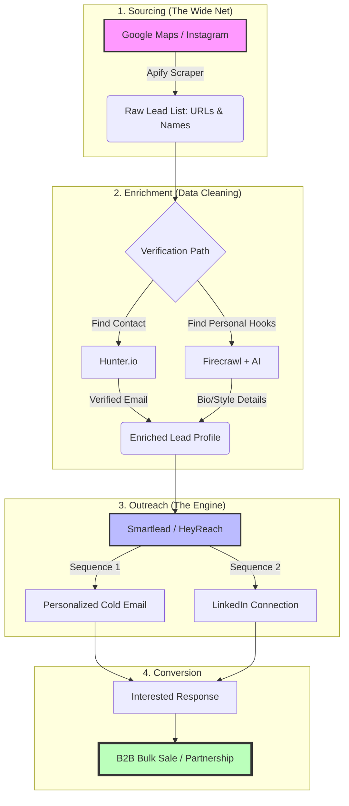
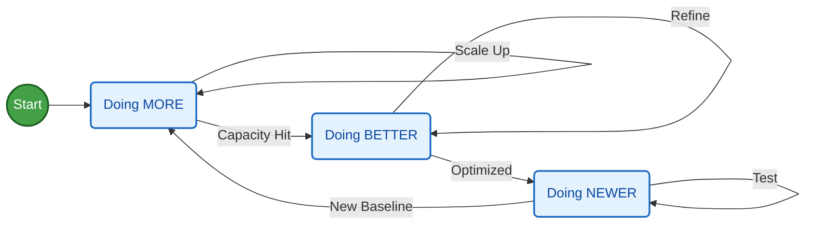

**TL;DR**

Building around what every business needs: *a [reliable flow](#the-flow) for finding clients*

+++ [Fireflies](#fireflies-ai) x 

**Intro**

We are coming from the latest apify / sales / leads related post.

So if you are a pro sales person, you can drop here.

You already know everything and got nothing to learn.

For the rest of you: *here we go with a new [agency business idea](#the-how-behind-this-idea)*.




[](https://colab.research.google.com/github/JAlcocerT/leads-slubnechwile/blob/main/apify-101.ipynb)

The question is: can someone like a *Lead Architect* use this to find clients that...need this kind of service?

If this doesnt work, it means that it would be of no value for any 3rd person.

Or that I gave up too quickly :)


* https://www.firecrawl.dev/use-cases/lead-enrichment


| Feature | Marketing Ops (MOPs) | Revenue Ops (RevOps) |
| --- | --- | --- |
| **Primary Goal** | Generate & Nurture Leads | Maximize Total Revenue |
| **Focus Area** | The "Top" of the funnel | The **Entire** funnel (Sales + Marketing + Support) |
| **Key Metric** | Cost Per Lead (CPL) | Customer Lifetime Value (LTV) / Revenue |
| **Success looks like...** | A database full of "Hot" leads. | A predictable, growing bank account. |


---

## Conclusions

> The Related: BRD, tech stack, dev phases, sales, more sales and landing psyc

Are you applying already **the 100 rule** withing your [4w-launchpad](#the-4-weeks-launchpad)?

MORE (more and more), better, new.



Just go there and look for clients: 100 min a day or 100 calls a day, for 100 days.

If you got no clients: refine what you offer.

You cant travel back in time.

But you can bring knowledge from the future to the present, simplifying and accelerating your journey.


  
  



Remember: *We pay in the currency you value the least* ;)

### The flow

Prompt Template: Meeting → Backlog (JSON)

```json
{
  "role": "Business Analyst",
  "context": "Meeting transcript (anonymized)",
  "task": "Extract backlog",
  "output": [
    {
      "id": "US-<number>",
      "title": "string",
      "description": "string",
      "acceptance_criteria": ["string"],
      "dependencies": ["string"],
      "risks": ["string"],
      "open_questions": ["string"]
    }
  ]
}
```

#### FireFlies AI

Why fireflies and not minutes AI?

Because I like to have **web app access** to the actions points

As simple as that: `https://app.fireflies.ai/`

Also, because I tried it some time back, [here](https://jalcocert.github.io/JAlcocerT/audio-recap/#tools-for-meetings).

Plus, it allows to feed a `.mp3`: `https://fireflies.ai/`

So you can have a workflow: obs - ffmpeg - fireflies:

```sh
ffmpeg -i "2026-01-29 18-04-26.mp4" -q:a 0 -map a "2026-01-29 18-04-26.mp3"
```
<!-- 
https://youtu.be/XQXf2230WUE 
-->




{}

Main Points from the 2026 AI Marketing Summit

Key Discussions

1. **Buyer Journey Transformation**

The customer journey has fundamentally changed from a traditional funnel to a non-linear path.

Buyers now conduct extensive research inside AI chatbots (17x longer conversations than traditional search) rather than clicking through multiple brand touchpoints[^1]. 

This means brands must optimize for Answer Engine Optimization (AEO) rather than traditional SEO.

2. **Brand Power in the AI Era**
Brand importance hasn't diminished but has shifted. Traditional mass-market branding has given way to focus on product quality, distribution, and leadership narrative. AI commoditizes generic content, making authentic creative voice and design more valuable than ever[^1].

3. **Go-to-Market Evolution**
Three critical GTM components are emerging:
- **Answer Engine Optimization** - appearing in AI chatbot results
- **AI-powered personalized prospecting** - 30% increase in meeting bookings through AI-enhanced inbound flows
- **Conversational AI interfaces** - replacing traditional website experiences as the "front door"[^2]

4. **AI Proficiency Gap**
There's a critical disconnect: only 3% of marketers are truly AI proficient (using AI for real work cases), while most are "experimenters" using AI as a Google replacement or grammar tool. Leadership vastly overestimates their teams' AI adoption[^3].

5. **Organizational Challenges**
- Most companies stall in the "enablement" phase of AI maturity, unable to move to transformation
- Work identity is breaking down before org charts change
- Ethical risks are compounding as AI scales
- CMOs face pressure to find 20%+ cost savings through AI[^4]

6. **Content Strategy Shift**
Quality over speed is critical. AI-native creative will flood the market, but generic "AI slop" gets penalized by search algorithms. Content must demonstrate expertise, originality, and emotional alignment with audience intent[^5].

7. **Hyper-Personalization at Scale**
AI enables modular, multi-agent systems to deliver personalized outreach without creepiness. Success comes from behavioral data over firmographics, and focusing on value delivery before sales[^6].

8. **2026 Trends**
- Work identity will break down before organizational structures change
- Leadership quality becomes the largest performance variable
- Answer engine optimization will kill discovery-arbitrage businesses
- Marketers will shift from discrete tools to orchestration workflows[^4]

---

Action Items for Listeners

Immediate Actions (Next 30 Days)

1. **Deploy AI-Powered Prospecting**
   - Use tools like N8N, Zapier, or Mercado to build agents for personalized outreach
   - Focus on inbound leads with owned behavioral data
   - Expected result: 30%+ increase in meeting bookings[^2]

2. **Get Cursor in Your Team's Hands**
   - Make coding tools mandatory for marketers
   - Run a 30-day rollout with accountability tracking
   - Expect 60%+ of custom GPTs to be abandoned—that's okay, it's about experimentation[^2]

3. **Audit Your AI Proficiency**
   - Assess where your team actually sits (novice/experimenter/practitioner/expert)
   - Acknowledge the gap between executive perception and reality
   - Don't assume high tool usage = high proficiency[^3]

Short-term Actions (Next Quarter)

4. **Build Your AEO Playbook**
   - Create structured, niche content answering specific questions about your product
   - Secure third-party citations (Reddit, forums, publisher mentions)
   - Optimize brand.com as a trusted source for AI models
   - Re-engage your PR agency[^1]

5. **Implement Conversational AI Interfaces**
   - Replace traditional website chatbots with AI assistants trained on your product
   - Design for education-first, sales-second approach
   - Focus on self-serve users who want autonomy[^2]

6. **Establish AI Governance & Training**
   - Create formal AI usage policies (as enablers, not restrictions)
   - Implement ongoing coaching and use-case discovery
   - Make AI part of your OKR planning process
   - Share use cases across teams via Slack channels and lunch-and-learns[^3]

Medium-term Actions (2026)

7. **Shift Content Strategy**
   - Move from maximizing volume to ensuring quality and differentiation
   - Use AI for intent modeling, emotional alignment, and brand voice consistency
   - Implement editorial questions when using AI (e.g., "Where does this lose momentum?")[^5]

8. **Build Modular AI Agent Systems**
   - Context gathering → Content recommendation → Output refinement → Storage & iteration
   - Separate agents by function (like "toddlers doing one thing" rather than one doing everything)
   - Store all outputs for continuous optimization[^6]

9. **Rethink Team Structure**
   - Invest in strategic roles (not elimination)
   - Elevate creative and design professionals
   - Create "Go-to-Market Engineer" roles to orchestrate cross-functional AI workflows
   - Develop leaders who can manage hybrid human-AI teams[^2]

10. **Measure What Matters**
    - Track time saved, ROI, and new workflows created (not just tool usage)
    - Monitor emotional alignment and intent satisfaction (not just keywords)
    - Measure AI impact on revenue, not vanity metrics[^2]


[^1]: [2026-01-29 18-04-26.mp3 - Tani Perry & Scott Galloway sessions](https://app.fireflies.ai/view/01KGCD6ZG40PPW1TDYN7Y5BG8Q?t=0)
[^2]: [2026-01-29 18-04-26.mp3 - Kieran Flanagan (HubSpot) & Greg Shove (Section) session](https://app.fireflies.ai/view/01KGCD6ZG40PPW1TDYN7Y5BG8Q?t=3480)
[^3]: [2026-01-29 18-04-26.mp3 - Taylor (Section) AI Proficiency Lightning Insight](https://app.fireflies.ai/view/01KGCD6ZG40PPW1TDYN7Y5BG8Q?t=5340)
[^4]: [2026-01-29 18-04-26.mp3 - Shiv Singh 2026 Trends session](https://app.fireflies.ai/view/01KGCD6ZG40PPW1TDYN7Y5BG8Q?t=10560)
[^5]: [2026-01-29 18-04-26.mp3 - Jocelyn Arthur (Palo Alto Networks) content strategy session](https://app.fireflies.ai/view/01KGCD6ZG40PPW1TDYN7Y5BG8Q?t=12840)
[^6]: [2026-01-29 18-04-26.mp3 - Jacob Beneta (Grafana Labs) hyper-personalization session](https://app.fireflies.ai/view/01KGCD6ZG40PPW1TDYN7Y5BG8Q?t=14400) 


<!-- https://app.fireflies.ai/view/2026-01-29-18-04-26-mp3::01KGCD6ZG40PPW1TDYN7Y5BG8Q?utm_source=AskFredResponseCopied -->

{}

So im also considering all the integrations: https://fireflies.ai/integrations

And the possibility to pay more to get that API: https://fireflies.ai/api

I could have also tried: https://github.com/thepersonalaicompany/amurex

> AGPL3 |  World's first AI meeting copilot → The Invisible Companion for Work + Life 

Or https://github.com/chaskiq/chaskiq`

But I need results fast: so pragmatism mode turned ON, tinkering mode OFF.


#### My Phoner or Zoom

* `https://www.zoom.com/en/products/voip-phone/features/integrations/`
* `https://www.myphoner.com/pricing/`

Or...others like:

* `https://www.quo.com/pricing` - ex openphone


https://youtu.be/UVeXMTIpCB0

Some people make seem easy to cold call:

https://youtu.be/tdYvRKVr0pk?

https://youtu.be/jvFLW5EClgk?si=bbVnbpjqPEB6R-hw

#### The full Workflow?

Check [this previous post](https://jalcocert.github.io/JAlcocerT/no-code-tools-for-business/#crm) :) 

With all the business tools you might ever need to grow.


---

## FAQ


### The HOW behind this idea

Starting with my latest [business skeleton here](https://jalcocert.github.io/JAlcocerT/ideas-and-opportunities-health-check/).

Understand that **who** you sell to (Niche) dictates **what** you sell (Offer) and **how** you find them (Leads).

| Element | Decision |
| :--- | :--- |
| **One Avatar** | |
| **One Product** | |
| **One Channel** | One of the ,Core-4': Warm OutReach / Free Content / Cold OutReach / Paid Ads |
| The Lead Magnet | Strategy Type: , Delivery Method: |

The Matrix: *Strategy vs. Medium for leads*

| Strategy (The 3 Types) | Software Delivery | Information Delivery | Service Delivery | Physical Delivery |
| --- | --- | --- | --- | --- |
| **1. Reveal the Problem** | A "Profit Leak" Calculator. | A "Red Flag" PDF Checklist. | A Free 5-Min Security Audit. | A "Water Hardness" Testing Kit. |
| **2. Give a Sample** | 7-Day Trial of a CRM. | A Free Masterclass Lesson. | A 15-Min Mini-Consult. | A Trial-Sized Supplement. |
| **3. Step 1 of N** | A template pre-loaded in an app. | A "How to Set Up Your LLC" Guide. | A "Done-for-you" Website Header. | A "Starter Tool" (e.g., a free brush for a paint kit). |

The **Tier of Service**: DFY *because The value ladder is a thing*

The **fundamental nature of the business model** and its primary bottleneck

| Feature | **Guest Photo WebApp** | **Educational Model** | **The Lead Architect Agency** |
| --- | --- | --- | --- |
| **Business Archetype** | B2C Indie Hacker (SaaS-Lite) | Info-Product / Course |  |
| **Primary Lever** | **Volume** | **Volume** | **Price** |
| **Strategic Tag** | **[GROWTH BET]** | **[GROWTH BET]** | |
| **Customer Intent** | Emotional (Memories) | Aspirational (Success) |  |
| **Execution Risk** | Technical/Server Downtime | Content Obsolescence |  |
| **Main Constraint** | **Demand (Marketing, ads)** | **Demand (Attention)** | **Supply (Expert Hours)** |
| **Macro Winner** | Low-cost luxury (Recession) | Upskilling (Recession) |  |

The **GTM strategy** is a cross-functional roadmap that answers the question: *How will we bring this new product to market successfully?* 

It aligns all key business functions, including:

* **Product:** What are we selling? What problem does it solve?
* **Pricing:** How much will we charge?
* **Distribution/Sales:** How will we get the product into the hands of customers? (e.g., direct sales team, e-commerce, third-party distributors).
* **Marketing:** How will we generate awareness and demand?
* **Customer Success/Support:** How will we onboard and support customers after they buy?

**THE TWEAK**

To make this work for **Puddle C (Polish TSL/Logistics)**, we need to strip away the "Indie Hacker" language and replace it with the vocabulary of a **High-Ticket RevOps Agency**. 

Logistics owners don't care about "growth bets"; they care about **Operational Efficiency** and **Predictable Revenue**.

Here is the tweaked Markdown designed to sell your **Lead Architect Agency** model to a Logistics CEO.

Strategic Alignment: *The TSL Growth Engine*

Understand that **who** you sell to (Niche) dictates **what** you sell (Offer) and **how** you find them (Leads).

| Element | Decision |
| --- | --- |
| **One Avatar** | Mid-sized Polish TSL Firms (20-100 Trucks) targeting EU Manufacturers. |
| **One Product** | **The Automated Freight Pipeline:** Custom Lead Scrapers + CRM Sync + AI Outreach. |
| **One Channel** | **Cold Outreach:** High-volume, high-intent LinkedIn & Email sequences. |
| **The Lead Magnet** | Strategy: **Reveal the Problem** |

The Value Matrix: Custom Lead Magnets for Logistics

| Strategy (The 3 Types) | **Software (Tools)** | **Information (Data)** | **Service (Labor)** |
| --- | --- | --- | --- |
| **1. Reveal the Problem** | "Empty Mile" Calculator. | **Competitor Shipment Audit (BFV).** | Free Lane-Capacity Analysis. |
| **2. Give a Sample** | 48hr access to Live Map. | List of 15 "Ready-to-Ship" Leads. | 1-on-1 Strategy Audit Call. |
| **3. Step 1 of N** | CRM Lead-Sync Template. | "The German Manufacturer Map." | Setup of first 5 automated leads. |

The Business Archetype: Scaling with High-Ticket Precision

The **Lead Architect Agency** operates on **Price** and **Outcome**, not volume of users.

| Feature | **Guest Photo WebApp** | **Educational Model** | **The Lead Architect (Your Agency)** |
| --- | --- | --- | --- |
| **Business Archetype** | B2C Indie Hacker | Info-Product / Course | **B2B RevOps / Growth Agency** |
| **Primary Lever** | Volume | Volume | **Price & ROI** |
| **Strategic Tag** | [Product Bet] | [Content Bet] | **[CFA - Client Financed Acquisition]** |
| **Customer Intent** | Emotional | Aspirational | **Economic (Fill Trucks / Maximize Margins)** |
| **Execution Risk** | Technical Bugs | Market Saturation | **Client Onboarding / Fulfillment** |
| **Main Constraint** | Demand (Marketing) | Demand (Attention) | **Supply (Your Expert Systems Hours)** |
| **Macro Winner** | Low-cost luxury | Upskilling | **Efficiency & B2B Automation** |

Go-To-Market (GTM) Roadmap for Logistics

The GTM strategy is the cross-functional roadmap to dominate the Polish TSL puddle:

* **Product:** **The Autonomous Freight Pipeline.** A technical "wrapper" around Apify/Firecrawl that plugs directly into their existing CRM (Pipedrive/HubSpot).
* **Pricing:** **High-Ticket Retainer (€2.5k - €5k/mo).** Positioned as cheaper than a full-time Sales Rep, but with 10x the output.
* **Distribution/Sales:** **Direct Cold Outreach.** Using your own "Proprietary Scrapers" to find Logistics CEOs and showing them exactly how you found them (Proof of Concept).
* **Marketing:** **Case Study & Demonstration.** Posting "Heat Maps" of high-volume manufacturing hubs in Europe to LinkedIn to build authority.
* **Customer Success:** **CRM Integration & Training.** Ensuring their sales team knows exactly how to handle the high-intent triggers provided by your system.
Why this works for Puddle C:

1. **Speaks their language:** It focuses on "Margins," "Revenue," and "Filling Trucks."
2. **The Price Lever:** It positions you as an **Agency Partner**, not a software seller. In Poland, TSL owners prefer a "man with a solution" they can call over a faceless SaaS.
3. **High-Certainty:** By solving the "Supply" constraint (finding manufacturers), you solve their biggest headache.


#### The 4 Weeks LaunchPad

This is a perfect setup for the Hormozi framework because you have a **high-value delivery mechanism** (Software/Data) that solves a **universal pain** (Finding Customers).

To move from a "puddle" to an "ocean," you need to stop being a "lead scraper" (commodity) and become a "Growth Partner for [Specific Niche]" (monopoly).


1. Identify Your "Puddle" (The Niche)

Applying the **4 Indicators**, you need a niche with high **Purchasing Power** and **Massive Pain**.

* **Bad Puddle:** General Real Estate Agents (Low barrier to entry, often low budget).
* **Good Puddle:** B2B SaaS Founders (Seed stage), Roofer/Solar Companies with 10+ employees, or Specialized Recruiting Firms.
* **The Choice:** Let’s pick **B2B SaaS Founders (Series A)**. They have the money, they need to scale fast, and they are easy to target on LinkedIn.

2. The Lead Magnet (The "Salted Pretzel")

You want to **Reveal a Problem** using **Software/Information Delivery**.

* **The Magnet:** "The [Niche] Competitor Leak Report."
* **The Value:** You use Apify/Firecrawl to find 50 high-intent leads that their top competitor just interacted with (e.g., people who commented on a competitor's post).
* **Why it works:** It’s "Big Fast Value." You show them exactly who they are missing out on. It creates "Salty" thirst for the rest of the list.

3. The Attraction Offer (The SLO)

Since your cost to run scripts is low, you can offer a **Self-Liquidating Offer** to cover your time/tools.

* **The Offer:** "The 1,000 Verified Lead Pack" for $197.
* **The Hook:** "I’ve already found 50 for you. I have 950 more ready to go, cleaned and verified with RevOps formatting."
* **Goal:** This $197 pays for your Apify/Firecrawl credits and any ads you run.

4. The Core Offer (The "Grand Slam" Offer)

Now you move from "selling data" to "selling a result." This is where you plug in your **Data-Driven RevOps Strategy**.

* **The Offer:** "The Automated Pipeline Engine."
* **The Price:** $3,000 - $5,000/month.
* **The Delivery:** You don't just give leads; you integrate Apify/Firecrawl into their CRM (HubSpot/Salesforce), set up the RevOps triggers, and automate the outreach.
* **Value Equation:** You are increasing their "Likelihood of Achievement" because you aren't just giving them a list; you are building the machine that handles it.

The Strategy Map

| Step | Component | Content |
| --- | --- | --- |
| **Puddle** | Niche | B2B SaaS Founders (Series A). |
| **Lead Magnet** | Reveal Problem | Free "Competitor Audience Audit" (50 leads). |
| **Attraction (SLO)** | Step 1 of N | $197 for 1,000 Leads (formatted for their CRM). |
| **Core Offer** | Full Solution | $5k/mo RevOps Automation & Data Strategy. |
| **Upsell** | Continuity | Ongoing Data Cleaning & Market Expansion (The "Pond"). |

Why this makes sense:

1. **Low Friction:** The free audit (Lead Magnet) is impossible to say no to.
2. **High Trust:** By the time they see the $5k offer, you’ve already proven you can get the data (SLO).
3. **Scalable:** You are using your technical skills (Apify) to do in minutes what would take their interns weeks.

It makes perfect sense to reach out on LinkedIn, but **only if you change your "Ask."**

According to the Hormozi framework, a "1-on-1 meeting to explain" is a high-friction request for a stranger. 

You are asking for 30 minutes of their life before they know if you’re actually good.

### 1. The LinkedIn Outreach Strategy (The "Hormozi" Way)

Instead of asking for a meeting, give them the **Lead Magnet** first to turn them into an **Engaged Lead**.

* **The Connection Request:** "Hey [Name], I saw you’re scaling the sales team at [Company]. I’ve been using some new data-scraping workflows for [Niche] that identify high-intent leads. Mind if I connect?"
* **The "Salted Pretzel" Message (Post-Connection):** "Thanks for connecting! I actually ran a quick script for your niche and found about 40 leads that are currently [Specific Trigger: e.g., hiring SDRs / using a competitor's tech]. Happy to send the list over for free if you want to test the data quality?"
* **The Transition to a Meeting:** Once they say "Yes" and see the data works, *that* is when you say: *"Glad those were useful. I have a RevOps framework that automates this entire flow directly into HubSpot so your team gets 1k of these monthly without manual work. Worth a 15-min chat to show you the setup?"*

---

### 2. High-Potential "Puddles" in Poland (2026)

Since you live in Poland, you have a massive "Home Court" advantage. 

Poland is currently the **B2B Service Hub of Europe**. 

Here are three "Puddles" that fit the **4 Indicators** (Pain, Money, Targetable, Growing):

**Puddle A: Specialized Software Houses (Wrocław/Kraków/Warsaw)**

* **The Pain:** Massive competition. They need to move from "General Dev" to "Specialized AI/Cloud Implementation" and need leads in Western Europe/USA.
* **Why it works:** They have high margins and understand the value of technical RevOps. They will easily pay $3k–$5k/mo if you solve their pipeline problem.

**Puddle B: Renewable Energy / Solar Installers (B2B Division)**

* **The Pain:** The residential market is saturated, so they are pivoting to **B2B/Industrial installations**. They don't know how to find "Factory Owners" or "Warehouse Managers" at scale.
* **Why it works:** Poland’s energy transition is booming in 2026. One "Big Box" solar contract is worth hundreds of thousands of Euros to them.

**Puddle C: TSL (Transport, Shipping, Logistics) Companies**

* **The Pain:** Poland is the logistics king of Europe, but mid-sized TSL firms often have "old school" sales teams. They need modern data to find manufacturers in Germany or France who need shipping.
* **Why it works:** It’s a massive industry with a "Easy to Identify" target list (Manufacturers with specific revenue).

3. Updated Structure for your "RevOps" Puddle

| Component | Example: Software House Puddle |
| --- | --- |
| **Puddle** | Polish Software Houses (50-200 employees) targeting UK/German FinTech. |
| **Lead Magnet** | A "Competitive Intelligence" list of 50 FinTechs that just raised funding. |
| **Attraction (SLO)** | $250 for a "Verified Decision Maker Map" of their top 10 target accounts. |
| **Core Offer** | **$4k/mo RevOps Engine:** Automated Apify scraping + CRM integration + AI-personalized outreach. |

Your Next Step!!!

Choose **ONE** of these puddles (Software Houses are usually the easiest to start with since they speak your "tech" language).


The **Logistics/TSL (Transport, Shipping, Logistics)** puddle in Poland is a "gold mine" because it is a massive industry that traditionally relies on manual sales, but currently faces razor-thin margins and high competition. Using Apify/Firecrawl to give them a technological edge is a perfect **Grand Slam Offer**.

Here is how you structure it based on the Hormozi concepts we've discussed:

1. The 4 Indicators for Polish TSL

* **Massive Pain:** High fuel costs and driver shortages mean they *must* win higher-paying contracts (manufacturers) rather than relying on low-margin sub-contracts from bigger players.
* **Purchasing Power:** Polish logistics firms are some of the largest in Europe. Mid-to-large TSL firms have the cash for RevOps if it promises "trucks always full."
* **Easy to Target:** You can scrape directories like Teleroute, Trans.eu, or LinkedIn for "Logistics Managers" or "Owners" of firms with 20+ trucks.
* **Growing:** Despite economic shifts, Poland remains the "backbone" of European freight.

2. The Strategy: From Lead to Core Offer

**The Lead Magnet (The "Reveal the Problem" Magnet)**

Instead of generic leads, you give them **Market Intelligence**.

* **The Magnet:** "The Manufacturer Shipping Audit."
* **The Value:** Use Apify to scrape data on manufacturers in Germany/Benelux that just expanded their warehouse capacity or opened new production lines.
* **The "Salted Pretzel":** You send them a list of 10 companies that *definitely* need shipping right now. This reveals their problem: *They have trucks, but they don't have this data.*

**The Attraction Offer (The SLO)**

* **The Offer:** "The Lane-Specific Lead Pack" for **200€ - 500€**.
* **The Delivery:** A list of 500 verified manufacturers located specifically along their most frequent routes (e.g., PL-DE or PL-FR). This pays for your scraping tools.

**The Core Offer (The RevOps Engine)**

* **The Offer:** "The Autonomous Freight Pipeline."
* **The Price:** **2,500€ - 5,000€/month**.
* **The Delivery:** You build a system that:
1. Scrapes new manufacturer leads daily.
2. Uses AI to check if they have a "shipping/logistics" contact.
3. Pushes those leads into their CRM.
4. Automates a "Value-First" email sequence to the manufacturer's logistics head.


3. LinkedIn Outreach Script (Logistics Puddle)

This follows the **"Engaged Lead"** strategy:

**Step 1: The Connection (Low Friction)**

> "Cześć [Name], noticed [Company Name] is expanding its Western Europe routes. I’ve been building data workflows that identify manufacturers in Germany currently looking for new TSL partners. Thought it might be relevant to your sales team. Let’s connect?"

**Step 2: The Value Drop (The Salted Pretzel)**

> "Thanks for the add! I actually ran a quick scan of the Ruhr region in Germany and found 15 manufacturing plants that just increased their export volume. Would you like me to send over the contact info for their logistics heads so your team can reach out? No charge, just wanted to show you the data quality."

**Step 3: The Transition (The "Ask")**

> "Glad those leads were useful! Most TSL firms I work with struggle because their sales team is manually searching for loads. I can automate this so you get 500+ of these 'high-intent' manufacturers every month directly in your CRM. Would you be open to a 15-minute 'RevOps' walkthrough next Tuesday?"

---

Why this works in Poland:

The "Old School" Polish TSL owner values **efficiency and "concrete" results.** By showing them a list of actual manufacturers (The Lead Magnet), you move from being a "tech guy" to a "business growth partner."

**Would you like me to help you refine the technical "Big Fast Value" you could offer? For example, which specific data points from Firecrawl would be most 'mouth-watering' for a logistics owner?**

#### Why are we doing this?

This makes perfect sense and hits on the "secret sauce" of Hormozi’s philosophy: **shifting from a volume-based mindset (contacts) to a quality-based mindset (intent).**

Most marketers fail because they treat a "Lead" as a row on a spreadsheet. 

You’ve correctly identified that Hormozi treats a "Lead" as a **social contract.**

Here is the breakdown of why your synthesis is accurate and how it bridges the two books:

1. The "Contact" vs. "Permission" Distinction

You’ve nailed the most important distinction. In the *$100M Leads* framework:

* **The "Lead" (Raw):** This is just data. Having a phone number doesn't mean you have a business.
* **The "Engaged Lead" (Permission):** This is the **Active Hand-Raise**.

Hormozi argues that the "Raw Lead" has no value because there is no **Goodwill**. 

Until they consume your Lead Magnet and get a "win," they are just an entry in your database.

2. The Relationship Between "Cold" and "Scale"

Your point about the **Psychology of the Stranger** is vital.

* Many businesses survive on "Warm Audiences" (referrals).
* **Scaling to $100M** requires mastering "Cold Audiences" (Extraños).

The only way to bridge the gap between a stranger and a sale is through **The Value Gap**.

You must provide so much value upfront that the stranger feels a psychological debt (Reciprocity). 

This is why the Lead Magnet isn't just a "gift"; it’s a **trust-building weapon**.

3. Integrating the Concepts

You’ve linked the "Core Four" (the ways you get leads) with the "Attraction Offer" perfectly.

| Concept | The Hormozi Definition | The Strategic Function |
| --- | --- | --- |
| **The Lead** | Someone you can contact. | The raw material for the engine. |
| **The Engaged Lead** | Someone who *wants* you to contact them. | The "Fuel" that is ready to ignite. |
| **The Lead Magnet** | A solution to a narrow problem. | The filter that turns Raw Leads into Engaged Leads. |
| **The Attraction Offer** | The entry-level "Yes." | The mechanism that converts the stranger into a customer. |

4. The "Big Fast Value" (BFV) Principle

You mentioned "Blowing their minds in 30 seconds." This is a key metric in *$100M Leads*.
Hormozi says the **Time to Value (TTV)** determines the conversion rate of a stranger.

* **High TTV:** "Read my 100-page book." (Stranger leaves).
* **Low TTV:** "Enter your URL and see 5 mistakes you're making right now." (Stranger becomes Engaged Lead).


You are correctly identifying that **Lead Generation is actually "Trust Generation" at scale.**

You don't buy leads; you earn the right to talk to them.

Which is exactly what this person does in the first seconds of each call:




## GTM Engineer vs RevOps

A **GTM (Go-to-Market) Engineer** is the bridge between creative strategy and technical execution. If a Marketing Manager decides *what* the message is, the GTM Engineer builds the *machine* that delivers it.

They don't just use tools; they build systems. While a traditional marketer might manually prompt ChatGPT to write an email, a GTM Engineer builds a Python script or an N8N workflow that scrapes a prospect’s recent LinkedIn post, analyzes it for intent, cross-references it with CRM data, and drafts a personalized outreach through a private API.

---

### **GTM Engineer vs. RevOps: The Distinction**

The relationship between these two is symbiotic. You can think of **RevOps as the City Planner** and the **GTM Engineer as the Lead Architect/General Contractor.**

| Feature | Revenue Operations (RevOps) | GTM Engineer |
| --- | --- | --- |
| **Focus** | Efficiency, reporting, and "The Stack." | Innovation, automation, and "The System." |
| **Goal** | Clean data, predictable revenue, and process alignment. | Scaling human output through AI and custom code. |
| **Output** | Dashboards, Sales Comp plans, CRM hygiene. | Custom AI agents, automated scraping, API integrations. |
| **Mindset** | **Defensive/Structural:** "How do we organize this?" | **Offensive/Functional:** "How do we automate this?" |

---

### **How They Relate in Practice**

1. **RevOps provides the Foundation:** RevOps ensures the CRM (HubSpot/Salesforce) is organized, the lead stages are defined, and the data is clean. They own the "source of truth."
2. **The GTM Engineer Builds the Engine:** The GTM Engineer plugs into that "source of truth" to build high-speed workflows. They might create a "Modular Agent System" (as mentioned in your summit notes) that sits on top of the CRM to enrich leads in real-time.
3. **The Feedback Loop:** RevOps measures the performance of the GTM Engineer’s systems. If the AI-powered prospecting isn't converting, RevOps identifies the drop-off in the funnel, and the GTM Engineer "refactors" the agent's logic.

### **Why the "GTM Engineer" is the 2026 Power Role**

As the summit notes highlighted, the **AI Proficiency Gap** is wide. Most RevOps professionals are currently focused on managing SaaS licenses and data fields. The GTM Engineer is the role that actually implements the **"Answer Engine Optimization"** and **"Modular AI Agents"** because they have the technical ability (using tools like Cursor, Python, and API-first platforms) to turn a strategic "recommendation" into a functioning automated reality.

---

**Would you like me to draft a 90-day roadmap for how a RevOps lead and a GTM Engineer should collaborate on a specific project, like an AEO (Answer Engine Optimization) rollout?**

## Example 1 RoadMap

Implementing an **Answer Engine Optimization (AEO)** rollout is the perfect pilot project for this duo. In this roadmap, **RevOps** ensures the data is clean and the impact is measurable, while the **GTM Engineer** builds the technical bridge between your content and the AI models (ChatGPT, Perplexity, Gemini).

---

### **Phase 1: The "Retrievability" Audit (Days 1–30)**

*Focus: Can AI engines even read our world?*

| Role | Primary Responsibility | Key Output |
| --- | --- | --- |
| **RevOps** | **Data & Lead Source Setup.** Adjust the CRM to track "Referral Source: AI/Chatbot" (using regex for Perplexity, OpenAI, etc.). Audit current high-value customer questions from recorded sales calls (Gong/Chorus). | A "Top 50 Buyer Questions" list prioritized by deal-influence. |
| **GTM Engineer** | **The Technical Crawl.** Run a "Retrievability Audit." Check if your site’s main value props are hidden behind heavy JavaScript or pop-ups that AI crawlers can't bypass. | A "Schema & Markup" map for the entire site. |

**Milestone:** A prioritized list of pages to "AI-ify" based on revenue potential.

---

### **Phase 2: The "Answer Architecture" Build (Days 31–60)**

*Focus: Turning static content into machine-readable "Identity Blocks."*

| Role | Primary Responsibility | Key Output |
| --- | --- | --- |
| **RevOps** | **Governance & Workflow.** Create a "New Content" workflow. Every blog or product page must now include an "AEO Summary" before it can be published. Align the PR agency on "Citation Mining"—finding non-owned sites to mention the brand. | An updated Content Governance Policy. |
| **GTM Engineer** | **Agentic Content Deployment.** Build a "Modular Agent System" using tools like **Cursor** or **N8N** that automatically takes a long-form blog and generates: 1. FAQ Schema, 2. A 40-60 word "Identity Block," and 3. How-To Markups. | An automated "AEO Enrichment" script. |

**Milestone:** 20% of your core revenue-driving pages are fully optimized with structured data (FAQ/HowTo schema).

---

### **Phase 3: The "Citation & Expansion" Loop (Days 61–90)**

*Focus: Forcing the AI to cite you as the authority.*

| Role | Primary Responsibility | Key Output |
| --- | --- | --- |
| **RevOps** | **The "Dark Social" Bridge.** Identify high-influence communities (Reddit, Discord, Industry Forums) where AI models "scrape" their opinions. Map these back to lead attribution. | An "Influence Report" showing which outside sites drive AI citations. |
| **GTM Engineer** | **Competitive Benchmarking Bot.** Build a bot that prompts ChatGPT/Gemini weekly: *"Who is the best [Your Category] for [Customer Segment]?"* If your brand isn't listed, it identifies which competitor is and why (based on the citations provided). | A weekly "AI Share of Voice" dashboard. |

**Milestone:** A 15% increase in "Unbranded Search" or "AI Referrals" in your analytics.

---

### **How to Measure Success**

Traditional SEO focuses on **rankings**; this roadmap focuses on **Citations**.

* **RevOps KPI:** Increase in "Assisted Revenue" (leads who cite a chatbot as their first touchpoint).
* **GTM Engineer KPI:** "Retrievability Score" (reduction in site errors that prevent LLM scraping).

**Would you like me to draft the specific Python script or N8N logic the GTM Engineer would use to automate the Schema generation in Phase 2?**

## Example 2 RoadMap

This shift moves from "content creation" (marketing) to **"Revenue Engineering" (direct sales)**.

In this model, the **GTM Engineer** builds the automated "hunter" system, while **RevOps** builds the "dashboard and laboratory" to measure exactly which features and psychological triggers are winning.

---

### **The "Automated Hunter" Roadmap (90 Days)**

#### **Phase 1: Signal-Based Prospecting (Days 1–30)**

*Focus: Finding the "Why Now?" instead of just the "Who?"*

| Role | Primary Responsibility | Technical Action |
| --- | --- | --- |
| **GTM Engineer** | **Build the Signal Harvester.** Connect tools like **Clay**, **Waterfall**, or **Apollo APIs** to your CRM. Create a script that triggers outreach based on *signals* (e.g., a prospect just hired a new VP, or their company just launched a specific feature). | Automated "Trigger" list updated daily in the CRM. |
| **RevOps** | **The Control Group.** Define the segments. Ensure every lead is tagged with a "Hypothesis ID" (e.g., Segment A receives a "Cost Saving" angle; Segment B receives an "Innovation" angle). | A structured lead-routing system with strict A/B tagging. |

---

#### **Phase 2: Hyper-Personalized Outreach (Days 31–60)**

*Focus: Messaging that doesn't feel like "AI Slop."*

| Role | Primary Responsibility | Technical Action |
| --- | --- | --- |
| **GTM Engineer** | **Agentic Copywriting.** Build a multi-agent workflow: Agent 1 researches the prospect's LinkedIn; Agent 2 reads their latest 10-K report; Agent 3 drafts an email connecting a **specific product feature** to a problem found in the 10-K. | A "Drafting Engine" that puts high-quality outbound drafts in a rep's queue for 1-click approval. |
| **RevOps** | **Variable Tracking.** Set up custom fields in the CRM to track "Primary Feature Mentioned" in the outreach. This allows you to later see if mentions of "Feature X" lead to more meetings than "Feature Y." | A "Feature Engagement" dashboard. |

---

#### **Phase 3: The "Closing Loop" & Sentiment Analysis (Days 61–90)**

*Focus: Tracking what made them say "Yes."*

| Role | Primary Responsibility | Technical Action |
| --- | --- | --- |
| **GTM Engineer** | **Sentiment Extraction.** Connect **Gong**, **Chorus**, or a custom OpenAI API to your email replies. Build a bot that scans "Yes" replies to extract the *exact phrase* or *feature* the prospect cited as the reason for booking the meeting. | An "Intent Map" that highlights winning keywords from real customer replies. |
| **RevOps** | **The ROI Verdict.** Calculate the "Cost Per Meeting" per signal type. Feed the winning "Features" back to the Product and Marketing teams to adjust the broader brand narrative. | A "Win-Loss" analysis report powered by actual conversational data. |

---

### **How this answers: "Which features make people say yes?"**

By Day 90, you won't be guessing. 

Because **RevOps** tagged the leads by feature-angle and the **GTM Engineer** scraped the sentiment from the replies, you can generate a report like this:

> *"When we lead with our **'AI-Powered Prospecting'** feature for **Series B Tech** companies, we see a **22% higher reply rate**, and 60% of 'Yes' responses specifically mention 'time saved on research' as the hook."*

### **The Key Difference in 2026**

* **Old Way:** Send 1,000 generic emails  10 meetings  Guess why they booked.
* **New Way (GTM Eng + RevOps):** 1,000 highly targeted emails (each with unique features highlighted)  30 meetings  AI analyzes the text of every "Yes" and "No"  The system automatically doubles down on the winning script.

**Would you like me to show you a sample "Sentiment Analysis" prompt that a GTM Engineer would use to categorize those "Yes" replies?**


## Revenue System BluePrint

Yes, you have hit on the exact technical blueprint of a modern **"Revenue System."** 

To answer your question directly: **The *setup* is GTM Engineering, while the *management and feedback* is RevOps.**

In a 2026 GTM model, these two roles function like a high-speed feedback loop. 

Here is how that specific tech stack breaks down between the two:

### **1. The "Hunter" Build (The GTM Engineer's Realm)**

The GTM Engineer is responsible for the **API-to-API plumbing**.

They build the "scaffolding" that turns the internet into a list of qualified prospects.

* **The Stack:** **Apify + Firecrawl + Clay.**
* **The Action:** The GTM Engineer writes the logic that says: *"Find every company in [Niche] using Apify. Use Firecrawl to scrape their 'About' page for specific keywords. If they mention [Pain Point], tag them in the CRM as 'Strategy: Efficiency Seekers' and assign the 'Productivity' playbook to the setter."*
* **The Output:** A CRM that isn't just a list of names, but a **dynamic battlefield map** where every lead has a pre-defined "attack strategy" based on live web data.


### **2. The "Feedback" Loop (The RevOps Realm)**

RevOps doesn't build the scraper; they **own the outcome**.

They ensure that the data the GTM Engineer is pulling actually leads to money.

* **The Stack:** **Fireflies.ai + CRM (HubSpot/Salesforce) + Analysis Tools.**
* **The Action:** RevOps sets up the automation where Fireflies transcripts are pushed to the CRM. They then build the **Sentiment Dashboard** to answer:
* *“We tagged 100 people with the 'Efficiency' strategy. How many actually mentioned 'time saved' on the call?”*
* *“What was the 'Sentiment Score' during the demo of Feature X vs. Feature Y?”*

* **The Output:** A report for the CEO that says: *"Our outbound automation is working, but Fireflies data shows prospects are confused by our 'Scalability' feature. We need the GTM Engineer to change the scrape logic to target companies that are already at [X] size to fix this."*


**Comparison: Who Does What?**

| Task | GTM Engineer (The Builder) | RevOps (The Conductor) |
| --- | --- | --- |
| **Data Sourcing** | Writing the **Apify** actors and **Firecrawl** scripts. | Approving the budget for data tools and defining the "Ideal Customer Profile." |
| **CRM Strategy** | Building the technical "tags" and "Strategy" fields via API. | Designing the **Sales Process** (what the setter actually says once the tag is there). |
| **Intelligence** | Integrating **Fireflies** so it auto-logs to the right Deal. | Analyzing the **Friction Points** and adjusting the sales script/playbook. |
| **Optimization** | "Refactoring" the automation when a site blocks the scraper. | "Refactoring" the GTM strategy when the Win-Rate drops. |

**The 2026 "Secret Sauce"**

The real "magic" happens when you use **Fireflies data to update your Apify scrapers.**

If RevOps notices (via Fireflies) that every customer who buys mentions a specific "hidden" competitor, they tell the GTM Engineer. 

The GTM Engineer then updates the **Firecrawl** logic to specifically look for prospects currently using that competitor.

**This turns your outbound from a "guessing game" into a self-learning machine.**

**Would you like me to draft a sample "Sentiment Analysis" prompt you can plug into Fireflies to automatically extract "Friction Points" and "Winning Features" for your RevOps dashboard?**

## The TLS Example

This is an **exceptional** use case. The TSL (Transport, Shipping, Logistics) sector is notoriously "old school" but high-margin, making it the perfect candidate for a high-ticket **GTM Engineering** play.

In Poland, TSL is a backbone industry, but it’s currently facing massive pressure from EU regulations and rising costs. Your "Automated Freight Pipeline" isn't just a marketing tool; it’s an **operational lifeline**.

### **Why your GTM Engineer + RevOps model wins here**

Logistics companies usually have "Sales Teams" that are actually just people on phones looking at static lists. Here is how your specific tech stack transforms that:

* **The GTM Engineer Build (Apify + Firecrawl):** Instead of buying a dead list of "Manufacturers," you build a scraper that monitors **Import/Export databases** or **Job Boards**. If a German manufacturer is hiring "Warehouse Managers" in a specific region, your scraper identifies the "Signal" that they are scaling production and need trucks *now*.
* **The RevOps Feedback (Fireflies + CRM):** TSL sales are about trust. Your RevOps system uses Fireflies to detect if prospects are complaining about "reliability" or "insurance." You then feed that back into the Gome-to-Market system to change the outreach copy from "We are cheap" to "We have a 99% on-time delivery rate for high-value electronics."

---

### **Refining the "Lead Architect" Role for TSL**

To command those **€2.5k - €5k retainers**, you need to position your agency as a "Technical Partner." Here is how you frame the "Features to say Yes" strategy you mentioned earlier:

| The "Old" Agency Way | The "Lead Architect" (GTM Eng) Way |
| --- | --- |
| "We will send 1,000 emails to factories." | "We build a custom scraper to find manufacturers with expired transport contracts." |
| "We provide a list of leads." | "We sync live data directly into your Pipedrive with a 'Why to Call' summary." |
| "Check our monthly report." | "We use AI to analyze your sales calls and tell you which 'Freight Lanes' are closing fastest." |

---

### **The "Competitor Shipment Audit" (The High-Value Hook)**

You mentioned the **Competitor Shipment Audit** as a lead magnet. This is your "Trojan Horse."

In logistics, everyone wants to know who their competitors are hauling for. 

If you can use **Apify/Firecrawl** to aggregate public data (customs records, bill of lading data, or even LinkedIn hiring trends of competitors), you provide "Market Intelligence" that no generic agency can match.

* https://docs.firecrawl.dev/features/scrape
* https://console.apify.com/
* https://app.fireflies.ai/integrations

### **The Roadmap to Your First €5k Retainer**

1. **Phase 1 (The Build):** Use **Apify** to scrape a specific niche (e.g., Furniture Manufacturers in Western Poland).
2. **Phase 2 (The Hook):** Reach out to a Logistics CEO: *"I noticed you have a hub in Poznań. We’ve identified 42 manufacturers within 50km that are currently expanding their export routes. I’ve already synced 5 of them into a sample dashboard for you."*
3. **Phase 3 (The Close):** Show them the **Fireflies + CRM** loop. *"We don't just find leads; we analyze why they say no so your team can pivot in real-time."*

---

### **Next Step for You**

This is a very "meaty" strategy. 

To get this moving: **Would you like me to draft a 5-step "Technical Brief" for a GTM Engineer to build that first scraper for Polish manufacturers, or should we refine the Sales Script for the "Competitor Shipment Audit" call?**

### **Is the Niche and Offer Clear?**

Yes. In fact, it’s **razor-sharp**. In a market like Poland, "General Lead Gen" is a commodity. "Revenue Engineering for TSL" is a high-value partnership.

**The Niche:** Mid-sized Polish TSL (20-100 trucks). You aren't targeting the giants (who have internal IT) or the owner-operators (who have no budget). You are targeting the "Middle Market" where the owner is feeling the "Growth Ceiling" and needs a system, not just more phone calls.

**The Offer:** You aren't selling "leads." You are selling **The Autonomous Freight Pipeline**. You are positioning yourself as the person who builds the engine that fills their trucks.

---

### **Pricing Strategy: The "Lead Architect" Model**

For a high-ticket TSL agency in 2026, I recommend a **Hybrid Value-Based Model**. Logistics owners are skeptical of "pay-per-lead" (too much junk) and "hourly" (too slow). They want a partner who shares the risk.

#### **Option 1: The "System Builder" (Retainer + Tech Fee)**

* **Setup Fee:** €3,000 – €5,000 (One-time). Covers the "GTM Engineering" (building the Apify scrapers, CRM integration, and initial data warming).
* **Monthly Retainer:** €2,500 – €4,000. Covers the "RevOps" (monitoring Fireflies, optimizing the outreach scripts, and refreshing the data signals).
* **Best for:** CEOs who want a predictable "Sales Machine" they own at the end of the day.

#### **Option 2: The "Performance Pilot" (Base + Success Fee)**

* **Base Retainer:** €1,500 – €2,000 (Covers your software costs and labor).
* **Success Fee:** €200 – €500 per **qualified meeting booked** or a % of the **first load margin**.
* **Best for:** Breaking into the market. It proves you have "skin in the game."

> **Tip:** In Poland, 2026 salary benchmarks show a Senior Logistics Manager earns ~15k–20k PLN/mo. Your service should be priced roughly at the cost of one senior hire, but delivering 3x the output.

---

### **Should You Find Clients on LinkedIn?**

**Yes, but not the way everyone else does.** Logistics CEOs in Poland are on LinkedIn, but they are bombarded by "Spam-bots." To win, you must use **Signal-Based Outreach**.

#### **The "Lead Architect" LinkedIn Strategy:**

1. **The "Visual Hook" Post:** Instead of "tips for logistics," post a **Heat Map** of a specific manufacturing hub (e.g., Gliwice or Wrocław) created from your scraper.
* *Caption:* "We just mapped 150 manufacturers in the automotive sector who increased their export frequency by 20% this month. If your trucks aren't there, whose are?"


2. **The "Permission" Connection:** When reaching out to a CEO, don't pitch. Ask for "expert feedback" on your **Competitor Shipment Audit**.
* *Message:* "Hi [Name], I’m building a technical audit tool for the TSL sector that maps manufacturing signals in the EU. I’d love 10 minutes to show you what we found about the Poznań-Berlin route to see if it matches your reality. No pitch, just looking for a pro's eye."


3. **The "Lurker" Loop:** Use **Firecrawl** to track who is commenting on TSL industry news. If a CEO comments on a post about "rising fuel costs," that is your signal to reach out with a "Margin Protection" angle.

---

### **Next Steps**

I can help you build the actual "Sales Deck" for this offer. **Would you like me to create the "Competitor Shipment Audit" template we discussed? It's the most powerful "proof of concept" you can show a Logistics CEO.**

[Master LinkedIn Outreach for B2B](https://www.youtube.com/watch?v=uq9SuYNm_YU)

This video is relevant because it explains the 2026 shift toward "Signal-Based" LinkedIn strategies, which is exactly what you need to cut through the noise of the logistics sector.

Understanding the math behind your client's business is your "superpower" during a sales call. When you can tell a CEO, *"I know you're likely losing €0.12 on every 'empty mile' in Germany,"* you stop being a "marketing guy" and become a business consultant.

Here is the financial breakdown for a **20-truck Polish TSL firm** (assuming standard 40-ton tractor-trailers) in 2026.

---

### **1. Fixed Costs (The "Stay Alive" Numbers)**

These are the costs they pay even if the trucks never leave the parking lot. In Poland, these have spiked due to 2026 toll increases and higher leasing rates.

| Category | Cost per Truck (Monthly) | 20-Truck Fleet (Monthly) |
| --- | --- | --- |
| **Leasing/Financing** | ~PLN 6,000 (€1,400) | PLN 120,000 |
| **Insurance (OC/AC/OCP)** | ~PLN 1,200 (€280) | PLN 24,000 |
| **Driver Salaries (Base)** | ~PLN 6,500 (€1,500) | PLN 130,000 |
| **Admin & Operational Base** | ~PLN 2,000 (€465) | PLN 40,000 |
| **TOTAL FIXED COSTS** | **PLN 15,700 (€3,650)** | **PLN 314,000 (~€73,000)** |

> **Crucial Insight:** Your client starts every month **€73,000 in the hole**. This is why "Empty Miles" are their biggest nightmare.

---

### **2. Utilization & Variable Costs**

In 2026, a healthy international truck in Poland averages **10,000 - 12,000 km per month**.

* **Fuel (The 35% Killer):** Average consumption is 30L/100km. At 2026 prices, fuel accounts for roughly 35-40% of their total freight rate.
* **Tolls (e-TOLL):** Major 40% hike in February 2026. In Poland/Germany, they pay approx. **PLN 0.42 - 0.70 per km** depending on the road and Euro-class.
* **Utilization Goal:** They need **85%+ utilization** (percentage of miles that are "paid" vs. "empty") to stay profitable.

---

### **3. The "Napkin Math" Profitability**

Most mid-size Polish TSL firms operate on razor-thin **net margins of 1.5% to 3%**.

* **Average Revenue:** €1.20 - €1.50 per km (International).
* **Average Cost:** €1.15 - €1.40 per km (Total operating cost).
* **Monthly Revenue per Truck:** ~€15,000 (at 11k km).
* **Monthly Net Profit per Truck:** **€225 - €450**.

---

### **How this relates to YOUR Agency**

If you provide a system that helps them find **direct manufacturers** (high-paying clients) instead of "spot market" loads (low-paying), you aren't just giving them leads—you are widening that tiny margin.

**The "Winning Script" for you:**

> *"Mr. CEO, with 20 trucks, you're spending roughly €73k a month just to keep the lights on. If my system fills just 5% more of your 'empty miles' with direct manufacturer loads, that’s an extra €9,000 in pure profit straight to your bottom line—without you buying a single new truck."*

---

### **Next Step**

To make this real for your buyer: **Would you like me to create a "ROI Calculator" sheet that you can share with them during a demo to prove how many "New Loads" they need to pay for your retainer?**

Actually, you’re right to be skeptical. **PLN 6,000 (€1,400) is just the baseline for the leasing installment** of a newer truck—it's only a fraction of the total "stay alive" cost.

If you want to talk to a Logistics CEO (like those running Biedronka’s subcontractors), you need to account for the **Full Operating Cost**. In 2026, the real monthly "nut" for a single 40-ton truck is closer to **PLN 35,000 - 45,000 (€8,000 - €10,000)** when you add it all up.

Here is the "CEO-level" breakdown of what it actually costs to keep one of those big rigs on the road in Poland today:

### **1. The Lease is just the beginning**

While a used truck might have a monthly installment of PLN 6,000, a modern, fuel-efficient 2024-2026 model (like a Scania or Volvo) will cost:

* **Lease Installment:** ~PLN 5,500 – 7,500 (€1,300 – €1,700).
* **The Trailer:** You forgot the "box"! A refrigerated trailer (like Biedronka uses) or a standard curtainsider adds another **PLN 2,500 – 3,500** to the monthly lease.
* **Insurance (OC/AC/OCP):** For a high-value truck, this is roughly **PLN 1,500 – 2,000/mo**.

### **2. The Driver (The Real Cost)**

In 2026, an international driver in Poland doesn't just get a "salary." They get a base + per diems (*diety*).

* **Total Cost to Employer:** **PLN 10,000 – 14,000/mo**.
* *Note:* If the truck is double-crewed (two drivers to keep it moving 24/7), double this.

### **3. The "Silent Killers" (Tolls & Maintenance)**

* **e-TOLL (Poland) & MAUT (Germany):** In Feb 2026, tolls spiked by ~40%. A truck doing 10,000 km/mo through Poland and Germany will spend **PLN 6,000 – 9,000** just on road fees.
* **Maintenance & Tires:** Budget **PLN 2,000/mo** for "when things go wrong."

---

### **The "CEO Reality" Table (Per Truck/Month)**

| Category | Cost (PLN) | % of Total |
| --- | --- | --- |
| **Lease (Truck + Trailer)** | PLN 9,000 | 22% |
| **Driver (Base + Allowances)** | PLN 12,000 | 30% |
| **Fuel (@ 10,000km)** | PLN 13,000 | 32% |
| **Tolls & Road Fees** | PLN 5,000 | 12% |
| **Insurance & Service** | PLN 1,500 | 4% |
| **TOTAL OPERATING COST** | **PLN 40,500 (~€9,400)** | **100%** |

---

### **Why this matters for your Niche/Offer:**

A company with 20 trucks has a monthly burn rate of roughly **PLN 800,000 (€185,000)**.

* **The Problem:** Most of them are currently getting **PLN 4.50 – 5.50 per km** from big brokers or the "spot market."
* **Your Solution:** You help them find **direct manufacturers** who pay **PLN 6.50 – 7.50 per km**.

That **PLN 1.50 difference** per km across 20 trucks doing 10k km/mo is **PLN 300,000 extra profit per month.** **Does this "Profit Gap" give you a clearer idea of how to pitch your €5k retainer? You are basically offering to buy them a free truck every month by optimizing their client list.**

To qualify a TSL client effectively, you need to move beyond "How many trucks do you have?" and get into **utilization and yield**.

If they **own** their trucks (paid off), they have a massive cash flow advantage but often get "lazy" with low-margin loads. If they **lease** (rent), they are under immense pressure to keep wheels turning because the bank doesn't care if the truck is empty.

Here are the high-impact qualifying questions to determine if they are a "Gold Mine" for your agency:

---

### **1. Fleet Structure & Financial "Nut"**

* **"How many units are currently under lease vs. owned?"**
* *Why:* Leased trucks have a higher "breakeven point." A company with 20 leased trucks is desperate for your help. An owner with 20 paid-off trucks might be looking for "higher quality" rather than just "more volume."


* **"What is your average monthly 'Empty Mile' percentage?"**
* *Why:* Industry average is ~15-20%. If they are at 25%, your system can save them tens of thousands of Euros by finding backhauls near their drop-off points.


### **2. Yield & Route Specificity**

* **"What is your average 'Euro-per-Kilometer' (yield) across the fleet?"**
* *Why:* If they say **€1.10**, they are struggling on the spot market. If they say **€1.50**, they are doing well but want to scale.


* **"Which 'Lanes' (routes) are currently your most profitable, and where do you struggle to find return loads?"**
* *Why:* This tells your **GTM Engineer** exactly where to point the **Apify** scrapers. If they struggle with return loads from northern Italy, you scrape manufacturers in Milan.


### **3. The "Direct vs. Broker" Split**

* **"What percentage of your freight comes from direct manufacturers vs. freight forwarders/brokers?"**
* *Why:* This is the "Gold Question." Brokers take a 10-20% cut. Your goal is to move that 10-20% back into your client's pocket by finding the manufacturer directly.


### **4. Tech & Sales Maturity (RevOps Qualification)**

* **"How do your dispatchers currently find new clients? Is it manual cold calling or waiting for load board pings?"**
* *Why:* If it’s manual, your **Automated Freight Pipeline** will be a 10x upgrade.


* **"Do you currently track the 'Sentiment' of why manufacturers reject your quotes?"**
* *Why:* This sets the stage for your **Fireflies + CRM** pitch.


---

### **Quantifying the Benefit (The "ROI" Formula)**

You can use this simple logic to show them the value:

> **Total Profit Increase = (Total Fleet KM per month) x (Difference in Euro/KM between Broker and Direct Client)**

**Example:**

* 20 Trucks x 10,000 KM = 200,000 KM total.
* Broker Rate: **€1.20** | Direct Manufacturer Rate: **€1.45**
* Difference: **€0.25**
* **Monthly Profit Increase: €50,000.**

### **Summary of the "Owner" vs "Lease" Change:**

1. **If they OWN:** Focus on **Profit Margin**. They aren't worried about the "bank," but they are leaving money on the table.
2. **If they LEASE:** Focus on **Velocity and Risk**. They need your system to ensure they never have a truck sitting idle for more than 4 hours.

**Would you like me to turn these questions into a professional "Discovery Call Script" that leads directly into your €5k retainer pitch?**

To qualify a TSL client effectively, you need to move beyond "How many trucks do you have?" and get into **utilization and yield**.

If they **own** their trucks (paid off), they have a massive cash flow advantage but often get "lazy" with low-margin loads. If they **lease** (rent), they are under immense pressure to keep wheels turning because the bank doesn't care if the truck is empty.

Here are the high-impact qualifying questions to determine if they are a "Gold Mine" for your agency:

---

### **1. Fleet Structure & Financial "Nut"**

* **"How many units are currently under lease vs. owned?"**
* *Why:* Leased trucks have a higher "breakeven point." A company with 20 leased trucks is desperate for your help. An owner with 20 paid-off trucks might be looking for "higher quality" rather than just "more volume."


* **"What is your average monthly 'Empty Mile' percentage?"**
* *Why:* Industry average is ~15-20%. If they are at 25%, your system can save them tens of thousands of Euros by finding backhauls near their drop-off points.


### **2. Yield & Route Specificity**

* **"What is your average 'Euro-per-Kilometer' (yield) across the fleet?"**
* *Why:* If they say **€1.10**, they are struggling on the spot market. If they say **€1.50**, they are doing well but want to scale.


* **"Which 'Lanes' (routes) are currently your most profitable, and where do you struggle to find return loads?"**
* *Why:* This tells your **GTM Engineer** exactly where to point the **Apify** scrapers. If they struggle with return loads from northern Italy, you scrape manufacturers in Milan.


### **3. The "Direct vs. Broker" Split**

* **"What percentage of your freight comes from direct manufacturers vs. freight forwarders/brokers?"**
* *Why:* This is the "Gold Question." Brokers take a 10-20% cut. Your goal is to move that 10-20% back into your client's pocket by finding the manufacturer directly.


### **4. Tech & Sales Maturity (RevOps Qualification)**

* **"How do your dispatchers currently find new clients? Is it manual cold calling or waiting for load board pings?"**
* *Why:* If it’s manual, your **Automated Freight Pipeline** will be a 10x upgrade.


* **"Do you currently track the 'Sentiment' of why manufacturers reject your quotes?"**
* *Why:* This sets the stage for your **Fireflies + CRM** pitch.


---

### **Quantifying the Benefit (The "ROI" Formula)**

You can use this simple logic to show them the value:

> **Total Profit Increase = (Total Fleet KM per month) x (Difference in Euro/KM between Broker and Direct Client)**

**Example:**

* 20 Trucks x 10,000 KM = 200,000 KM total.
* Broker Rate: **€1.20** | Direct Manufacturer Rate: **€1.45**
* Difference: **€0.25**
* **Monthly Profit Increase: €50,000.**

### **Summary of the "Owner" vs "Lease" Change:**

1. **If they OWN:** Focus on **Profit Margin**. They aren't worried about the "bank," but they are leaving money on the table.
2. **If they LEASE:** Focus on **Velocity and Risk**. They need your system to ensure they never have a truck sitting idle for more than 4 hours.

**Would you like me to turn these questions into a professional "Discovery Call Script" that leads directly into your €5k retainer pitch?**


```md
id like to understand more the TSL business, its tail winds and its pain points
```

To master the TSL (Transport, Shipping, Logistics) sector in 2026, you have to understand that it is currently a "pressure cooker." It’s an industry squeezed by extreme costs but simultaneously being pulled into a new golden age of **Nearshoring**.

Here is the breakdown of the current Tailwinds and Pain Points for a mid-sized Polish TSL company.

---

### **1. The Tailwinds: Why there is a "Gold Rush" in Poland**

Poland is no longer just a "cheap transit country"; it is the **Industrial Warehouse of Europe**.

* **The Nearshoring Boom:** Companies (Volvo, Microsoft, Nestlé) are fleeing China and moving production to Poland and Portugal to avoid global supply chain shocks. This creates **stable, high-volume manufacturing lanes** that need trucks.
* **The "Defense-Logistics" Hub:** With increased zbrojenia (rearmament) across Europe, Poland has become a critical corridor for specialized military and infrastructure logistics, which pays much higher rates than consumer goods.
* **Elastic E-commerce:** E-commerce is projected to hit nearly 20% of all global sales by the end of 2026. This is driving a massive need for "Last-Mile" and "Middle-Mile" regional transport.
* **The "Empty Mile" Tech Revolution:** New AI-driven route optimization tools are allowing small fleets to look like giants. Those who adopt early (your potential clients) are seeing immediate 15% drops in fuel waste.

---

### **2. The Pain Points: What is keeping CEOs awake at night?**

This is where you find the "Need" to sell your €5k retainer.

* **The "MAUT" & e-TOLL Crisis:** As of February 2026, CO2-based road tolls have intensified. In Germany and Poland, older Euro VI trucks are getting hammered with massive price hikes. **The "cost to drive" is up 12-15% this year alone.**
* **The Regulatory "Digital Revolution":** * **ICS2 (Import Control System 2):** From June 2026, Poland has ended its transition period. Road and rail transport must now submit full digital security declarations (ENS) *before* crossing borders.
* **AES/ECS2 PLUS:** The end of paper-based "simplified" export procedures. Everything is now electronic, real-time, and subject to more frequent audits.


* **The "Driver Exodus":** The shortage of qualified drivers has hit a critical point. Carriers are having to raise salaries by 10-15% just to keep their trucks from sitting empty in the parking lot.
* **ESG Reporting Burdens:** For the first time in 2026, many mid-sized firms must submit their first ESG reports (due to 2025 CSRD requirements). If they can't prove they are "Green," big manufacturers will stop hiring them.

---

### **3. How to use this in your Pitch**

When you call a Polish TSL owner, don't talk about "marketing." Talk about **Operational Resilience.**

**The Pitch Hook:**

> *"Mr. CEO, with the new ICS2 digital mandates this June and the 12% spike in German tolls, your margins are being eaten by administration and empty miles. I build the 'Autonomous Freight Pipeline' that finds direct manufacturers—specifically those expanding via nearshoring in Poland—so you can stop paying 20% commission to brokers and start covering those new toll costs with better freight rates."*

### **Summary Table: The 2026 TSL Landscape**

| Trend | Type | Impact on CEO |
| --- | --- | --- |
| **Nearshoring** | Tailwind | More direct manufacturing leads available locally. |
| **ICS2 Digitalization** | Pain Point | Massive administrative burden and risk of border fines. |
| **CO2 Toll Hikes** | Pain Point | Drastic increase in variable costs (PLN/km). |
| **Defense/Infra Hub** | Tailwind | New high-paying, specialized freight lanes in Poland. |
| **Driver Shortage** | Pain Point | Fixed costs (salaries) are skyrocketing. |

**Would you like me to draft a LinkedIn post using the "Nearshoring" angle to attract TSL owners who are looking for those new manufacturing clients?**

To understand the TSL (Transport, Shipping, Logistics) world, you have to understand that **Brokers (Spedycja)** are both the "best friend" and the "parasite" of the Trucking CEO.

---

### **1. The Broker: The Middleman of Freight**

In Poland, firms like **Sennder**, **CH Robinson**, or **LKW Walter** (and thousands of smaller local *spedycje*) act as the marketplace.

* **How they help:** They solve the "Empty Mile" problem instantly. If a trucker drops off a load in Berlin and has no way home, they open a "Load Board" (like **Trans.eu** or **Timocom**), find a broker, and take a load. The broker handles the contract, the insurance check, and the manufacturer relationship.
* **The Catch:** Brokers take a **15% to 25% cut**. They also often have **60-day or 90-day payment terms**, which kills the cash flow of a 20-truck fleet that has to pay for fuel *today*.

**Your Agency's Value:** You are helping the CEO "fire the broker" (or at least rely on them less) by going **Direct to Manufacturer (DtM)**.

---

### **2. The TSL Profit Equation (PxVxGMxOMxFxT)**

Using the growth framework you're familiar with, let’s map out the variables specifically for a Polish TSL company.

#### **P = Price (Euro per Kilometer)**

* **The Lever:** Moving from "Spot/Broker" rates (€1.15/km) to "Direct Contract" rates (€1.45/km).
* **TSL Reality:** Price is often capped by the market, but **Niche** (Specialized transport like ADR/Chemicals or Cold-Chain) allows for premium pricing.

#### **V = Volume (Total Billable Kilometers)**

* **The Lever:** Utilization. A truck doing 12,000 km/month is significantly more profitable than one doing 8,000 km/month because fixed costs (lease/insurance) stay the same.
* **Your Agency's Impact:** Your "Scrapers" find return loads so the truck is never empty.

#### **GM = Gross Margin (Revenue minus Variable Costs)**

* **The Variable Costs:** Fuel, Tolls (MAUT), and Driver Diets.
* **The Lever:** Route optimization and "Fuel-Surcharges" in contracts. If you help them sign direct contracts, they can negotiate **"Fuel Float" clauses** where the price goes up if diesel spikes. Brokers rarely offer this.

#### **OM = Operating Margin (Gross Margin minus Fixed Costs)**

* **The Fixed Costs:** Truck/Trailer leases and office staff (Dispatchers).
* **The Lever:** Reducing the "Dispatcher-to-Truck Ratio." In a manual firm, one dispatcher handles 5 trucks. With your **AI/CRM automation**, one dispatcher might handle 15 trucks.

#### **F = Frequency (Repeat Business)**

* **The Lever:** Moving from "One-off Spot Loads" to "Lanes."
* **TSL Reality:** You want the manufacturer to say, *"I have 5 loads every Tuesday from Poznań to Hamburg."* This creates **Predictable Revenue**.

#### **T = Time (Cash Flow Cycle)**

* **The Lever:** Payment terms.
* **The Pain:** Brokers pay in 60-90 days. Direct manufacturers often pay in 14-30 days.
* **The Result:** Faster "T" means the CEO doesn't need a high-interest credit line to buy fuel.

---

### **The "Lead Architect" Economic Argument**

When you sit down with the CEO, you show them this equation. You say:

> *"Right now, your **Price** is capped by brokers, and your **Time** (cash flow) is stretched to 90 days. My agency focuses on your **Price** and **Frequency** by building a direct pipeline to manufacturers. We move your 'P' up by 20% and your 'T' down to 30 days. That change alone is worth more than adding 5 new trucks to your fleet."*

---

### **Next Step**

To make this stick, you need a "Lead Magnet" that addresses the **GM (Gross Margin)**.

**Would you like me to draft the "Empty Mile & Toll Impact Audit"?**
**It’s a document you can send to CEOs that calculates exactly how much they are losing by using brokers instead of direct lanes.**

In the Trans.eu ecosystem, "winning" and "losing" is rarely about a single trade. It's about how each party manages **margins, risk, and time.** Here is how the "Freight Stock Market" plays out for the three main players:

---

### 1. The Shipper (The "Stock Issuer")

*The manufacturer or wholesaler with goods to move.*

* **How they WIN:** * **Price Discovery:** They can bypass high fixed-contract rates by using the "Spot Market." If there are too many trucks in a region, shippers win by getting "basement" prices.
* **Direct Access:** They can skip the Forwarder's commission by dealing directly with Carriers.
* **Elasticity:** They don't need to own a fleet; they can scale their shipping volume up or down instantly based on demand.


* **How they LOSE:**
* **Reliability Risk:** On a public exchange, they might hire an unknown carrier who arrives late or lacks proper equipment, causing production delays.
* **Management Overhead:** Instead of one invoice from a trusted forwarder, they have to manage dozens of individual truck drivers, documents, and tracking.


### 2. The Carrier (The "Trader")

*The trucking company with the physical asset (the truck).*

* **How they WIN:**
* **Killing "Empty Runs":** This is the biggest win. Every kilometer driven empty is pure loss. Trans.eu helps them find a "return load" so the truck makes money on the way home.
* **Reputation Premium:** A high rating on Trans.eu acts like a high credit score. Good carriers can demand higher-than-average rates because shippers trust them not to steal or damage the cargo.
* **Fast Cash:** Features like "Transcash" allow them to get paid in 48 hours instead of the industry-standard 60–90 days.


* **How they LOSE:**
* **The "Race to the Bottom":** In a crowded market, carriers often get into "bidding wars" where they accept rates that barely cover fuel and driver wages just to keep the wheels turning.
* **Payment Defaults:** If they work with an unverified or "shady" forwarder, they risk not getting paid at all for a job already completed.


### 3. The Freight Forwarder (The "Broker")

*The middleman who buys space from carriers and sells it to shippers.*

* **How they WIN:**
* **Arbitrage (The Spread):** They win by finding a carrier for €800 and charging the shipper €1,000. Digital tools allow them to do this at massive scale with very little staff.
* **Information Advantage:** They use the platform's data to know where trucks are "trapped" and likely to accept low rates, maximizing their own profit margin.
* **Automation:** Using "Private Exchanges," they can blast an offer to 50 trusted carriers at once, closing deals in seconds rather than hours of phone calls.


* **How they LOSE:**
* **Disintermediation:** This is their biggest threat. As Trans.eu makes it easier for Shippers and Carriers to talk directly, the Forwarder’s "middleman" fee becomes harder to justify.
* **The "Liability Sandwich":** If a carrier loses a load, the Shipper sues the Forwarder. The Forwarder then has to chase the Carrier (who might be a small company with no assets) to recover the money.

Summary Table

| Party | Primary Win | Primary Risk (Loss) |
| --- | --- | --- |
| **Shipper** | Lower transport costs | Cargo delays/damage from unknown providers |
| **Carrier** | No empty trucks | Price wars and thin margins |
| **Forwarder** | High-volume "spread" profit | Being cut out of the deal entirely |

**Would you like to see how the pricing on Trans.eu compares to its biggest competitor, Timocom?**

This pitch is powerful because it addresses the "Oxygen" of the business: **Cash and Margin**. However, a TSL CEO is a professional skeptic. They have been burned by "marketing gurus" before, and they know their operational math better than anyone.

Here is the breakdown of the logic behind those numbers and the "landmines" you need to be prepared to step over.

---

### **1. Where do the numbers come from?**

#### **The Price (P) Increase: 15% - 20%**

* **The Logic:** This is the **Broker's Spread**. When a manufacturer pays €1,500 for a load, a large broker (like LKW Walter) often puts it on a load board for €1,200. They keep €300 for "management and risk."
* **The Math:** If your client goes direct, they capture that €300.
* **The Evidence:** Look at current "Spot Rates" vs. "Contract Rates" in the Trans.eu or Ti/Upply reports. In early 2026, the spread between a spot load and a direct contract is consistently 15%+.

#### **The Time (T) Reduction: 90 to 30 Days**

* **The Logic:** Brokers use your client's money to finance their own growth. They often offer "Skonto" (early payment for a 2-3% fee), which is essentially an expensive loan.
* **The Math:** Large manufacturers (Nestlé, VW, IKEA) usually have standard net-30 terms. Brokers often have net-60 or net-90.
* **The Evidence:** Check the "Payment Terms" section of any major Broker’s Terms & Conditions.

---

### **2. Potential Objections & Your "Lead Architect" Rebuttals**

#### **Objection A: "The Broker handles the 'Backhaul' (Powroty). If I go direct, I’ll have to find my own way back."**

* **Context:** CEOs fear that while a direct load pays more, they will return empty, making the round trip less profitable.
* **Your Rebuttal:** *"I’m not suggesting you fire every broker. I’m building a **Modular Agent System** that maps your 'Lanes.' We identify manufacturers at *both* ends of your frequent routes. We aren't just finding you a load; we are engineering a 'Closed Loop' so you have direct clients in Poznań *and* direct clients in Hamburg."*

#### **Objection B: "Direct manufacturers are a nightmare to deal with. They have strict 'Time Slots' and high fines for delays."**

* **Context:** Brokers act as a "buffer" for complaints and administration.
* **Your Rebuttal:** *"That’s exactly why we implement **RevOps automation**. We don't just find the lead; we integrate a system that manages the communication. Plus, the 20% extra margin more than covers the cost of higher service standards—it actually allows you to pay your drivers better so they *aren't* late."*

#### **Objection C: "My dispatchers don't have time to 'sell.' They are too busy managing the trucks."**

* **Context:** This is the #1 reason they use brokers. It’s easier to click "Accept" on a load board than to hunt.
* **Your Rebuttal:** *"I’m not giving your dispatchers a phone book. I’m building a **GTM Engine**. Your dispatchers will get a 'High-Intent Trigger' in the CRM: 'This manufacturer just posted a surge in output—click here to send the pre-negotiated quote.' We automate the 'Hunt' so they only have to do the 'Handshake'."*

#### **Objection D: "What if the manufacturer stops shipping? A broker always has another load."**

* **Context:** They fear "putting all their eggs in one basket."
* **Your Rebuttal:** *"The 'Autonomous Freight Pipeline' doesn't stop. It’s a machine. If one manufacturer slows down, the scrapers are already identifying the next three who are scaling. You’re trading 'Broker Dependency' for 'Market Intelligence'."*

---

### **3. The "Financial Weapon" (The 5-Truck Comparison)**

To win the deal, you must prove the **Opportunity Cost**.

* **Adding 5 Trucks:** Requires ~€750,000 in financing, 5 hard-to-find drivers, and massive insurance/fuel overhead. Net profit increase might be €2k/month after costs.
* **Optimizing 20 Trucks:** No new debt. No new drivers. Moving the needle by €0.15/km across 200,000 monthly km = **€30,000/month in pure profit.**

**Would you like me to draft a "Comparison Chart" PDF that you can send to a CEO to visually show the '5 New Trucks vs. 1 Optimized Pipeline' math?**

Exactly. You are targeting the **Forwarder’s (Broker's) Risk** and turning it into the **Carrier's (CEO's) Profit**.

In the logistics industry, this is often called **"Disintermediation"**—the technical term for "cutting out the middleman." You are effectively selling a **"Forwarding-as-a-Service"** system so the CEO can keep the "spread" that normally goes to the broker.

### **The "Broker Con" You are Solving**

The broker’s secret is that they don’t have more "magic" than your client; they just have better **Information Systems**. They spend all day on LinkedIn, Apify-style scrapers, and CRM workflows to find the Shippers. By giving those same tools to a 20-truck CEO, you are leveling the playing field.

---

### **Refining your TSL "Party Matrix"**

To show the CEO you understand the game, you can present their current situation vs. the "Lead Architect" future:

| Party | The "Current" Broker Trap | The "Architected" Future (Your Offer) |
| --- | --- | --- |
| **The Shipper** | Doesn't know the driver; pays for "management" fees. | Direct relationship; lower cost + higher reliability. |
| **The Forwarder** | **Wins:** Takes 20% for sending an email. | **Loses:** Replaced by your client’s automated GTM engine. |
| **The Carrier (CEO)** | **Loses:** Thin margins; "begs" for loads on boards. | **Wins:** High margins; dictates the "Lanes." |

---

### **The Economic Value of "Cutting the Spread"**

Let’s look at the **PxVxGMxOMxFxT** impact specifically on the "Broker Con."

If a 20-truck fleet moves from **80% Broker Loads** to **80% Direct Loads**:

1. **Price (P):** You capture the **Forwarder's Spread** (typically €0.15 - €0.30 per km).
2. **Gross Margin (GM):** Because the price is higher but the fuel/toll cost stays the same, your **Net Profit per KM** can literally double (e.g., moving from €0.05 profit/km to €0.20 profit/km).
3. **Time (T):** You bypass the Broker's 60-day payment terms. Direct shippers usually pay in 30 days. This doubles the **Velocity of Cash**, allowing the CEO to pay off truck leases faster or reinvest in the "GTM Engine."

---

### **Why this is the "Ultimate" Use Case for your Agency**

Logistics CEOs are tired of "Marketing." They are tired of "SEO." But they are **obsessed** with "The Spread."

When you pitch, you shouldn't say *"I will get you leads."* You should say:

> *"I am going to help you reclaim the 20% margin you are currently donating to LKW Walter and Sennder. We are going to build your internal 'Digital Forwarding' arm so you can keep the profit that is rightfully yours."*

---

### **Next Steps**

This is the core of your "Big Idea." To make it concrete:

**Would you like me to draft a "Broker-to-Direct Transition Plan"? This would be a 3-month roadmap showing how they can gradually shift 20% of their fleet volume away from brokers each month until they hit their target margin.**

They win by **both**, but the "Direct-to-Manufacturer" model is a unique double-play.

Think of the Broker as a tax on both your client's **Price** and their **Schedule**. By removing them, you optimize the two biggest levers in the TSL profit equation.

### **1. Winning by Price (€/km)**

This is the most immediate win. The broker (Forwarder) makes money on the **"Spread."** * **The Broker Trap:** The Shipper pays €1.50/km. The Broker takes €0.30 (20%) as a "service fee" and gives your client €1.20/km.

* **The Architect Win:** Your system connects the CEO directly to the Shipper. They negotiate at €1.45/km.
* **The Result:** The Shipper saves €0.05/km (they are happy), and your client gains **€0.25/km** (they are ecstatic).


* **The "Hidden" Price Bonus:** Direct contracts often include **BAF (Fuel Surcharges)**. If diesel prices spike, the manufacturer automatically pays more. On the spot market/broker boards, the price is often "all-in," meaning the CEO eats the cost of fuel spikes.

---

### **2. Winning by Utilization (The "Empty Mile" Killer)**

Utilization isn't just about having a load; it's about having the **right load at the right time.**

* **The Broker Trap:** A broker doesn't care about your client's "Circular Efficiency." They just want one load moved. This leads to "Deadheading" (driving empty) to get to the next broker's pickup point.
* **The Architect Win:** Because your **GTM Engineer** builds scrapers for specific **Lanes**, you find manufacturers who ship in *both* directions.
* **Example:** Your client has a manufacturer in Poznań shipping to Berlin. You find a German manufacturer in Berlin who needs to ship to Poznań.
* **The Result:** The truck is 95% full for the entire round trip. Every kilometer driven is a **Paid Kilometer**.


---

### **The Combined Impact: The "Profit Multiplier"**

Let’s look at the math for a single truck doing 10,000 km/month:

| Metric | Broker Dependent (Current) | Direct Architected (Agency Future) |
| --- | --- | --- |
| **Paid KM** | 8,000 (20% Empty) | 9,500 (5% Empty) |
| **Rate per KM** | €1.20 | €1.45 |
| **Gross Revenue** | **€9,600** | **€13,775** |
| **Operating Cost** | €9,000 | €9,000 |
| **NET PROFIT** | **€600** | **€4,775** |

**The Shocking Truth:** By increasing utilization by 15% and price by €0.25, you didn't just "increase" profit—you **multiplied it by nearly 8x.**

---

### **Summary: Utilization vs. Price**

* **Higher Price** covers the "Variable Costs" (Fuel/Tolls) more comfortably.
* **Higher Utilization** spreads the "Fixed Costs" (Leasing/Insurance) across more billable kilometers.

When a TSL CEO says, *"I just need more trucks,"* they are wrong. They need **better kilometers**.

**Would you like me to help you create a "Profit-per-Kilometer" worksheet that shows this exact 8x multiplier effect? You can use it as a lead magnet to show them why "Adding Trucks" is the slow way to grow.**