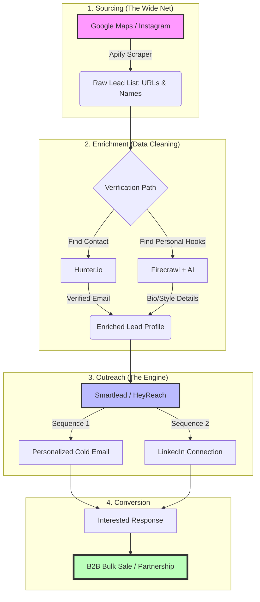
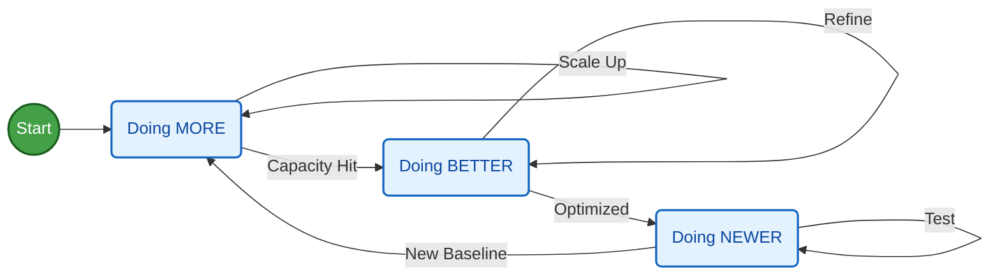

**TL;DR**

Building around what every business needs: *a [reliable flow](#the-flow) for finding clients*

+++ [Fireflies](#fireflies-ai) x 

**Intro**

We are coming from the latest apify / sales / leads related post.

So if you are a pro sales person, you can drop here.

You already know everything and got nothing to learn.

For the rest of you: *here we go with a new [agency business idea](#the-how-behind-this-idea)*.




[](https://colab.research.google.com/github/JAlcocerT/leads-slubnechwile/blob/main/apify-101.ipynb)

The question is: can someone like a *Lead Architect* use this to find clients that...need this kind of service?

If this doesnt work, it means that it would be of no value for any 3rd person.

Or that I gave up too quickly :)


* https://www.firecrawl.dev/use-cases/lead-enrichment


| Feature | Marketing Ops (MOPs) | Revenue Ops (RevOps) |
| --- | --- | --- |
| **Primary Goal** | Generate & Nurture Leads | Maximize Total Revenue |
| **Focus Area** | The "Top" of the funnel | The **Entire** funnel (Sales + Marketing + Support) |
| **Key Metric** | Cost Per Lead (CPL) | Customer Lifetime Value (LTV) / Revenue |
| **Success looks like...** | A database full of "Hot" leads. | A predictable, growing bank account. |


---

## Conclusions

> The Related: BRD, tech stack, dev phases, sales, more sales and landing psyc

Are you applying already **the 100 rule** withing your [4w-launchpad](#the-4-weeks-launchpad)?

MORE (more and more), better, new.



Just go there and look for clients: 100 min a day or 100 calls a day, for 100 days.

If you got no clients: refine what you offer.

You cant travel back in time.

But you can bring knowledge from the future to the present, simplifying and accelerating your journey.


  
  



Remember: *We pay in the currency you value the least* ;)

### The flow

Prompt Template: Meeting → Backlog (JSON)

```json
{
  "role": "Business Analyst",
  "context": "Meeting transcript (anonymized)",
  "task": "Extract backlog",
  "output": [
    {
      "id": "US-<number>",
      "title": "string",
      "description": "string",
      "acceptance_criteria": ["string"],
      "dependencies": ["string"],
      "risks": ["string"],
      "open_questions": ["string"]
    }
  ]
}
```

#### FireFlies AI

Why fireflies and not minutes AI?

Because I like to have **web app access** to the actions.

As simple as that.

Also, because I tried it some time back, [here](https://jalcocert.github.io/JAlcocerT/audio-recap/#tools-for-meetings).

Plus, it allows to feed a `.mp3`: `https://fireflies.ai/`

```sh
ffmpeg -i "2026-01-29 18-04-26.mp4" -q:a 0 -map a "2026-01-29 18-04-26.mp3"
```

So im also considering all the integrations: https://fireflies.ai/integrations


I could have also tried: https://github.com/thepersonalaicompany/amurex

> AGPL3 |  World's first AI meeting copilot → The Invisible Companion for Work + Life 

Or https://github.com/chaskiq/chaskiq`

But I need results fast: so pragmatism mode turned ON, tinkering mode OFF.


#### My Phoner or Zoom

* `https://www.zoom.com/en/products/voip-phone/features/integrations/`
* `https://www.myphoner.com/pricing/`

Or...others like:

* `https://www.quo.com/pricing` - ex openphone


https://youtu.be/UVeXMTIpCB0

Some people make seem easy to cold call:

https://youtu.be/tdYvRKVr0pk?

https://youtu.be/jvFLW5EClgk?si=bbVnbpjqPEB6R-hw


---

## FAQ


### The HOW behind this idea

Starting with my latest [business skeleton here](https://jalcocert.github.io/JAlcocerT/ideas-and-opportunities-health-check/).

Understand that **who** you sell to (Niche) dictates **what** you sell (Offer) and **how** you find them (Leads).

| Element | Decision |
| :--- | :--- |
| **One Avatar** | |
| **One Product** | |
| **One Channel** | One of the ,Core-4': Warm OutReach / Free Content / Cold OutReach / Paid Ads |
| The Lead Magnet | Strategy Type: , Delivery Method: |

The Matrix: *Strategy vs. Medium for leads*

| Strategy (The 3 Types) | Software Delivery | Information Delivery | Service Delivery | Physical Delivery |
| --- | --- | --- | --- | --- |
| **1. Reveal the Problem** | A "Profit Leak" Calculator. | A "Red Flag" PDF Checklist. | A Free 5-Min Security Audit. | A "Water Hardness" Testing Kit. |
| **2. Give a Sample** | 7-Day Trial of a CRM. | A Free Masterclass Lesson. | A 15-Min Mini-Consult. | A Trial-Sized Supplement. |
| **3. Step 1 of N** | A template pre-loaded in an app. | A "How to Set Up Your LLC" Guide. | A "Done-for-you" Website Header. | A "Starter Tool" (e.g., a free brush for a paint kit). |

The **Tier of Service**: DFY *because The value ladder is a thing*

The **fundamental nature of the business model** and its primary bottleneck

| Feature | **Guest Photo WebApp** | **Educational Model** | **The Lead Architect Agency** |
| --- | --- | --- | --- |
| **Business Archetype** | B2C Indie Hacker (SaaS-Lite) | Info-Product / Course |  |
| **Primary Lever** | **Volume** | **Volume** | **Price** |
| **Strategic Tag** | **[GROWTH BET]** | **[GROWTH BET]** | |
| **Customer Intent** | Emotional (Memories) | Aspirational (Success) |  |
| **Execution Risk** | Technical/Server Downtime | Content Obsolescence |  |
| **Main Constraint** | **Demand (Marketing, ads)** | **Demand (Attention)** | **Supply (Expert Hours)** |
| **Macro Winner** | Low-cost luxury (Recession) | Upskilling (Recession) |  |

The **GTM strategy** is a cross-functional roadmap that answers the question: *How will we bring this new product to market successfully?* 

It aligns all key business functions, including:

* **Product:** What are we selling? What problem does it solve?
* **Pricing:** How much will we charge?
* **Distribution/Sales:** How will we get the product into the hands of customers? (e.g., direct sales team, e-commerce, third-party distributors).
* **Marketing:** How will we generate awareness and demand?
* **Customer Success/Support:** How will we onboard and support customers after they buy?

**THE TWEAK**

To make this work for **Puddle C (Polish TSL/Logistics)**, we need to strip away the "Indie Hacker" language and replace it with the vocabulary of a **High-Ticket RevOps Agency**. 

Logistics owners don't care about "growth bets"; they care about **Operational Efficiency** and **Predictable Revenue**.

Here is the tweaked Markdown designed to sell your **Lead Architect Agency** model to a Logistics CEO.

Strategic Alignment: *The TSL Growth Engine*

Understand that **who** you sell to (Niche) dictates **what** you sell (Offer) and **how** you find them (Leads).

| Element | Decision |
| --- | --- |
| **One Avatar** | Mid-sized Polish TSL Firms (20-100 Trucks) targeting EU Manufacturers. |
| **One Product** | **The Automated Freight Pipeline:** Custom Lead Scrapers + CRM Sync + AI Outreach. |
| **One Channel** | **Cold Outreach:** High-volume, high-intent LinkedIn & Email sequences. |
| **The Lead Magnet** | Strategy: **Reveal the Problem** |

The Value Matrix: Custom Lead Magnets for Logistics

| Strategy (The 3 Types) | **Software (Tools)** | **Information (Data)** | **Service (Labor)** |
| --- | --- | --- | --- |
| **1. Reveal the Problem** | "Empty Mile" Calculator. | **Competitor Shipment Audit (BFV).** | Free Lane-Capacity Analysis. |
| **2. Give a Sample** | 48hr access to Live Map. | List of 15 "Ready-to-Ship" Leads. | 1-on-1 Strategy Audit Call. |
| **3. Step 1 of N** | CRM Lead-Sync Template. | "The German Manufacturer Map." | Setup of first 5 automated leads. |

The Business Archetype: Scaling with High-Ticket Precision

The **Lead Architect Agency** operates on **Price** and **Outcome**, not volume of users.

| Feature | **Guest Photo WebApp** | **Educational Model** | **The Lead Architect (Your Agency)** |
| --- | --- | --- | --- |
| **Business Archetype** | B2C Indie Hacker | Info-Product / Course | **B2B RevOps / Growth Agency** |
| **Primary Lever** | Volume | Volume | **Price & ROI** |
| **Strategic Tag** | [Product Bet] | [Content Bet] | **[CFA - Client Financed Acquisition]** |
| **Customer Intent** | Emotional | Aspirational | **Economic (Fill Trucks / Maximize Margins)** |
| **Execution Risk** | Technical Bugs | Market Saturation | **Client Onboarding / Fulfillment** |
| **Main Constraint** | Demand (Marketing) | Demand (Attention) | **Supply (Your Expert Systems Hours)** |
| **Macro Winner** | Low-cost luxury | Upskilling | **Efficiency & B2B Automation** |

Go-To-Market (GTM) Roadmap for Logistics

The GTM strategy is the cross-functional roadmap to dominate the Polish TSL puddle:

* **Product:** **The Autonomous Freight Pipeline.** A technical "wrapper" around Apify/Firecrawl that plugs directly into their existing CRM (Pipedrive/HubSpot).
* **Pricing:** **High-Ticket Retainer (€2.5k - €5k/mo).** Positioned as cheaper than a full-time Sales Rep, but with 10x the output.
* **Distribution/Sales:** **Direct Cold Outreach.** Using your own "Proprietary Scrapers" to find Logistics CEOs and showing them exactly how you found them (Proof of Concept).
* **Marketing:** **Case Study & Demonstration.** Posting "Heat Maps" of high-volume manufacturing hubs in Europe to LinkedIn to build authority.
* **Customer Success:** **CRM Integration & Training.** Ensuring their sales team knows exactly how to handle the high-intent triggers provided by your system.
Why this works for Puddle C:

1. **Speaks their language:** It focuses on "Margins," "Revenue," and "Filling Trucks."
2. **The Price Lever:** It positions you as an **Agency Partner**, not a software seller. In Poland, TSL owners prefer a "man with a solution" they can call over a faceless SaaS.
3. **High-Certainty:** By solving the "Supply" constraint (finding manufacturers), you solve their biggest headache.


#### The 4 Weeks LaunchPad

This is a perfect setup for the Hormozi framework because you have a **high-value delivery mechanism** (Software/Data) that solves a **universal pain** (Finding Customers).

To move from a "puddle" to an "ocean," you need to stop being a "lead scraper" (commodity) and become a "Growth Partner for [Specific Niche]" (monopoly).


1. Identify Your "Puddle" (The Niche)

Applying the **4 Indicators**, you need a niche with high **Purchasing Power** and **Massive Pain**.

* **Bad Puddle:** General Real Estate Agents (Low barrier to entry, often low budget).
* **Good Puddle:** B2B SaaS Founders (Seed stage), Roofer/Solar Companies with 10+ employees, or Specialized Recruiting Firms.
* **The Choice:** Let’s pick **B2B SaaS Founders (Series A)**. They have the money, they need to scale fast, and they are easy to target on LinkedIn.

2. The Lead Magnet (The "Salted Pretzel")

You want to **Reveal a Problem** using **Software/Information Delivery**.

* **The Magnet:** "The [Niche] Competitor Leak Report."
* **The Value:** You use Apify/Firecrawl to find 50 high-intent leads that their top competitor just interacted with (e.g., people who commented on a competitor's post).
* **Why it works:** It’s "Big Fast Value." You show them exactly who they are missing out on. It creates "Salty" thirst for the rest of the list.

3. The Attraction Offer (The SLO)

Since your cost to run scripts is low, you can offer a **Self-Liquidating Offer** to cover your time/tools.

* **The Offer:** "The 1,000 Verified Lead Pack" for $197.
* **The Hook:** "I’ve already found 50 for you. I have 950 more ready to go, cleaned and verified with RevOps formatting."
* **Goal:** This $197 pays for your Apify/Firecrawl credits and any ads you run.

4. The Core Offer (The "Grand Slam" Offer)

Now you move from "selling data" to "selling a result." This is where you plug in your **Data-Driven RevOps Strategy**.

* **The Offer:** "The Automated Pipeline Engine."
* **The Price:** $3,000 - $5,000/month.
* **The Delivery:** You don't just give leads; you integrate Apify/Firecrawl into their CRM (HubSpot/Salesforce), set up the RevOps triggers, and automate the outreach.
* **Value Equation:** You are increasing their "Likelihood of Achievement" because you aren't just giving them a list; you are building the machine that handles it.

The Strategy Map

| Step | Component | Content |
| --- | --- | --- |
| **Puddle** | Niche | B2B SaaS Founders (Series A). |
| **Lead Magnet** | Reveal Problem | Free "Competitor Audience Audit" (50 leads). |
| **Attraction (SLO)** | Step 1 of N | $197 for 1,000 Leads (formatted for their CRM). |
| **Core Offer** | Full Solution | $5k/mo RevOps Automation & Data Strategy. |
| **Upsell** | Continuity | Ongoing Data Cleaning & Market Expansion (The "Pond"). |

Why this makes sense:

1. **Low Friction:** The free audit (Lead Magnet) is impossible to say no to.
2. **High Trust:** By the time they see the $5k offer, you’ve already proven you can get the data (SLO).
3. **Scalable:** You are using your technical skills (Apify) to do in minutes what would take their interns weeks.

It makes perfect sense to reach out on LinkedIn, but **only if you change your "Ask."**

According to the Hormozi framework, a "1-on-1 meeting to explain" is a high-friction request for a stranger. 

You are asking for 30 minutes of their life before they know if you’re actually good.

### 1. The LinkedIn Outreach Strategy (The "Hormozi" Way)

Instead of asking for a meeting, give them the **Lead Magnet** first to turn them into an **Engaged Lead**.

* **The Connection Request:** "Hey [Name], I saw you’re scaling the sales team at [Company]. I’ve been using some new data-scraping workflows for [Niche] that identify high-intent leads. Mind if I connect?"
* **The "Salted Pretzel" Message (Post-Connection):** "Thanks for connecting! I actually ran a quick script for your niche and found about 40 leads that are currently [Specific Trigger: e.g., hiring SDRs / using a competitor's tech]. Happy to send the list over for free if you want to test the data quality?"
* **The Transition to a Meeting:** Once they say "Yes" and see the data works, *that* is when you say: *"Glad those were useful. I have a RevOps framework that automates this entire flow directly into HubSpot so your team gets 1k of these monthly without manual work. Worth a 15-min chat to show you the setup?"*

---

### 2. High-Potential "Puddles" in Poland (2026)

Since you live in Poland, you have a massive "Home Court" advantage. 

Poland is currently the **B2B Service Hub of Europe**. 

Here are three "Puddles" that fit the **4 Indicators** (Pain, Money, Targetable, Growing):

**Puddle A: Specialized Software Houses (Wrocław/Kraków/Warsaw)**

* **The Pain:** Massive competition. They need to move from "General Dev" to "Specialized AI/Cloud Implementation" and need leads in Western Europe/USA.
* **Why it works:** They have high margins and understand the value of technical RevOps. They will easily pay $3k–$5k/mo if you solve their pipeline problem.

**Puddle B: Renewable Energy / Solar Installers (B2B Division)**

* **The Pain:** The residential market is saturated, so they are pivoting to **B2B/Industrial installations**. They don't know how to find "Factory Owners" or "Warehouse Managers" at scale.
* **Why it works:** Poland’s energy transition is booming in 2026. One "Big Box" solar contract is worth hundreds of thousands of Euros to them.

**Puddle C: TSL (Transport, Shipping, Logistics) Companies**

* **The Pain:** Poland is the logistics king of Europe, but mid-sized TSL firms often have "old school" sales teams. They need modern data to find manufacturers in Germany or France who need shipping.
* **Why it works:** It’s a massive industry with a "Easy to Identify" target list (Manufacturers with specific revenue).

3. Updated Structure for your "RevOps" Puddle

| Component | Example: Software House Puddle |
| --- | --- |
| **Puddle** | Polish Software Houses (50-200 employees) targeting UK/German FinTech. |
| **Lead Magnet** | A "Competitive Intelligence" list of 50 FinTechs that just raised funding. |
| **Attraction (SLO)** | $250 for a "Verified Decision Maker Map" of their top 10 target accounts. |
| **Core Offer** | **$4k/mo RevOps Engine:** Automated Apify scraping + CRM integration + AI-personalized outreach. |

Your Next Step!!!

Choose **ONE** of these puddles (Software Houses are usually the easiest to start with since they speak your "tech" language).


The **Logistics/TSL (Transport, Shipping, Logistics)** puddle in Poland is a "gold mine" because it is a massive industry that traditionally relies on manual sales, but currently faces razor-thin margins and high competition. Using Apify/Firecrawl to give them a technological edge is a perfect **Grand Slam Offer**.

Here is how you structure it based on the Hormozi concepts we've discussed:

1. The 4 Indicators for Polish TSL

* **Massive Pain:** High fuel costs and driver shortages mean they *must* win higher-paying contracts (manufacturers) rather than relying on low-margin sub-contracts from bigger players.
* **Purchasing Power:** Polish logistics firms are some of the largest in Europe. Mid-to-large TSL firms have the cash for RevOps if it promises "trucks always full."
* **Easy to Target:** You can scrape directories like Teleroute, Trans.eu, or LinkedIn for "Logistics Managers" or "Owners" of firms with 20+ trucks.
* **Growing:** Despite economic shifts, Poland remains the "backbone" of European freight.

2. The Strategy: From Lead to Core Offer

**The Lead Magnet (The "Reveal the Problem" Magnet)**

Instead of generic leads, you give them **Market Intelligence**.

* **The Magnet:** "The Manufacturer Shipping Audit."
* **The Value:** Use Apify to scrape data on manufacturers in Germany/Benelux that just expanded their warehouse capacity or opened new production lines.
* **The "Salted Pretzel":** You send them a list of 10 companies that *definitely* need shipping right now. This reveals their problem: *They have trucks, but they don't have this data.*

**The Attraction Offer (The SLO)**

* **The Offer:** "The Lane-Specific Lead Pack" for **200€ - 500€**.
* **The Delivery:** A list of 500 verified manufacturers located specifically along their most frequent routes (e.g., PL-DE or PL-FR). This pays for your scraping tools.

**The Core Offer (The RevOps Engine)**

* **The Offer:** "The Autonomous Freight Pipeline."
* **The Price:** **2,500€ - 5,000€/month**.
* **The Delivery:** You build a system that:
1. Scrapes new manufacturer leads daily.
2. Uses AI to check if they have a "shipping/logistics" contact.
3. Pushes those leads into their CRM.
4. Automates a "Value-First" email sequence to the manufacturer's logistics head.


3. LinkedIn Outreach Script (Logistics Puddle)

This follows the **"Engaged Lead"** strategy:

**Step 1: The Connection (Low Friction)**

> "Cześć [Name], noticed [Company Name] is expanding its Western Europe routes. I’ve been building data workflows that identify manufacturers in Germany currently looking for new TSL partners. Thought it might be relevant to your sales team. Let’s connect?"

**Step 2: The Value Drop (The Salted Pretzel)**

> "Thanks for the add! I actually ran a quick scan of the Ruhr region in Germany and found 15 manufacturing plants that just increased their export volume. Would you like me to send over the contact info for their logistics heads so your team can reach out? No charge, just wanted to show you the data quality."

**Step 3: The Transition (The "Ask")**

> "Glad those leads were useful! Most TSL firms I work with struggle because their sales team is manually searching for loads. I can automate this so you get 500+ of these 'high-intent' manufacturers every month directly in your CRM. Would you be open to a 15-minute 'RevOps' walkthrough next Tuesday?"

---

Why this works in Poland:

The "Old School" Polish TSL owner values **efficiency and "concrete" results.** By showing them a list of actual manufacturers (The Lead Magnet), you move from being a "tech guy" to a "business growth partner."

**Would you like me to help you refine the technical "Big Fast Value" you could offer? For example, which specific data points from Firecrawl would be most 'mouth-watering' for a logistics owner?**

#### Why are we doing this?

This makes perfect sense and hits on the "secret sauce" of Hormozi’s philosophy: **shifting from a volume-based mindset (contacts) to a quality-based mindset (intent).**

Most marketers fail because they treat a "Lead" as a row on a spreadsheet. 

You’ve correctly identified that Hormozi treats a "Lead" as a **social contract.**

Here is the breakdown of why your synthesis is accurate and how it bridges the two books:

1. The "Contact" vs. "Permission" Distinction

You’ve nailed the most important distinction. In the *$100M Leads* framework:

* **The "Lead" (Raw):** This is just data. Having a phone number doesn't mean you have a business.
* **The "Engaged Lead" (Permission):** This is the **Active Hand-Raise**.

Hormozi argues that the "Raw Lead" has no value because there is no **Goodwill**. 

Until they consume your Lead Magnet and get a "win," they are just an entry in your database.

2. The Relationship Between "Cold" and "Scale"

Your point about the **Psychology of the Stranger** is vital.

* Many businesses survive on "Warm Audiences" (referrals).
* **Scaling to $100M** requires mastering "Cold Audiences" (Extraños).

The only way to bridge the gap between a stranger and a sale is through **The Value Gap**.

You must provide so much value upfront that the stranger feels a psychological debt (Reciprocity). 

This is why the Lead Magnet isn't just a "gift"; it’s a **trust-building weapon**.

3. Integrating the Concepts

You’ve linked the "Core Four" (the ways you get leads) with the "Attraction Offer" perfectly.

| Concept | The Hormozi Definition | The Strategic Function |
| --- | --- | --- |
| **The Lead** | Someone you can contact. | The raw material for the engine. |
| **The Engaged Lead** | Someone who *wants* you to contact them. | The "Fuel" that is ready to ignite. |
| **The Lead Magnet** | A solution to a narrow problem. | The filter that turns Raw Leads into Engaged Leads. |
| **The Attraction Offer** | The entry-level "Yes." | The mechanism that converts the stranger into a customer. |

4. The "Big Fast Value" (BFV) Principle

You mentioned "Blowing their minds in 30 seconds." This is a key metric in *$100M Leads*.
Hormozi says the **Time to Value (TTV)** determines the conversion rate of a stranger.

* **High TTV:** "Read my 100-page book." (Stranger leaves).
* **Low TTV:** "Enter your URL and see 5 mistakes you're making right now." (Stranger becomes Engaged Lead).


You are correctly identifying that **Lead Generation is actually "Trust Generation" at scale.**

You don't buy leads; you earn the right to talk to them.

Which is exactly what this person does in the first seconds of each call:



