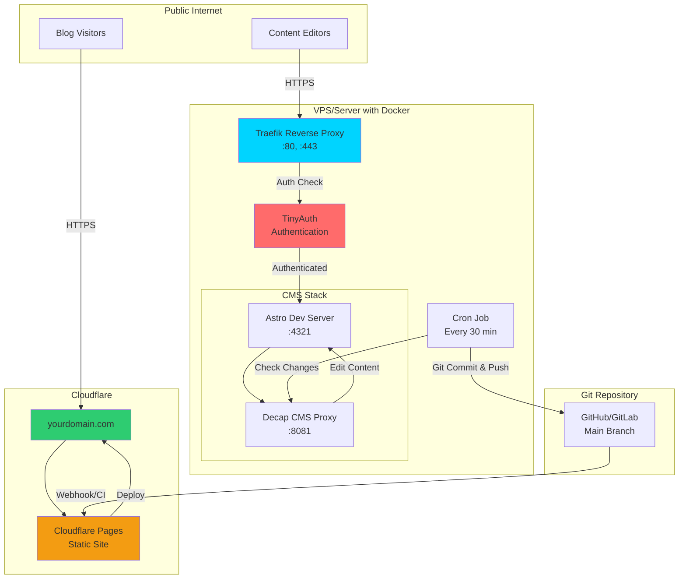

**Tl;DR**

A better [entreagujaypunto v1](https://github.com/JAlcocerT/EntreAgujayPunto) vibe coded from scratch with NextJS and potentially to be used from anyone via my PaaS offering.

+++ FREE [Web Audits!](#web-audits)

**Intro**

Lets go straight to the point: *this will be all about 2 repos*



  
  


```md
lets start the development and add the comments when each of them will be done and tested (when this is all finished, lets create a z-walkthrough.md with how to run the project)
```

```sh
git clone https://github.com/JAlcocerT/entreagujaypunto-next-gallery

lsof -ti:3000 | xargs kill -9

docker compose build
docker-compose up -d
docker-compose logs

docker-compose -f docker-compose.prod.yml build
docker-compose -f docker-compose.prod.yml up -d

#make help

#ssh jalcocert@jalcocert-x300-1
make build-portainre
make up-portainer
#docker stop $(docker ps -a -q) #stop all
#docker system df
#docker image prune -a
#docker network prune -f
#docker system prune -a --volumes -f
```


This brings the landing page with the gallery: http://localhost:3000/

And its own editor route protected by user/pwd: `http://localhost:3000/editor`


The content is controlled by a single `./data/metadata.json`

```sh
make build-portainer

cd ~/Desktop/entreagujaypunto-next-gallery

# Create .env file with required variables
cat > .env << 'EOF'
# NextAuth Configuration
NEXTAUTH_URL=http://localhost:3037

# Admin Credentials
ADMIN_USERNAME=admin
ADMIN_PASSWORD=your-secure-password-here

# Optional: Imgproxy (can leave blank for now)
IMGPROXY_KEY=
IMGPROXY_SALT=

# Image settings
IMAGES_DIR=/data/images
METADATA_FILE=/data/metadata.json
MAX_FILE_SIZE=10485760
MAX_BATCH_UPLOAD=10
ALLOWED_FORMATS=image/jpeg,image/png,image/webp,image/heic
IMAGES_PER_PAGE=12
ISR_REVALIDATE=3600
EOF

# Generate a random secret
echo "NEXTAUTH_SECRET=$(openssl rand -base64 32)" >> .env
#cat .env
# Now rebuild
make rebuild-portainer


# Generate a random secret
echo "NEXTAUTH_SECRET=$(openssl rand -base64 32)" >> .env

##RUN THE APP!
make up-portainer
# Now rebuild
make rebuild-portainer
```


**Deployed via cf tunnels** to `entreagujaypuntonextjsdec25:3000` initially mapped to `test.entreagujaypunto.com`

```sh
#sudo apt install gh
gh auth login
gh repo create entreagujaypunto-next-gallery --private --source=. --remote=origin --push

#git init && git add . && git commit -m "Initial commit: Starting NextJS photo gallery entreagujaypunto v2" && gh repo create entreagujaypunto-next-gallery --private --source=. --remote=origin --push
```

This was [the brd](https://github.com/JAlcocerT/entreagujaypunto-next-gallery/blob/master/z-brd.md), the [clarifications](https://github.com/JAlcocerT/entreagujaypunto-next-gallery/blob/master/z-clarifications.md) and the [development plan](https://github.com/JAlcocerT/entreagujaypunto-next-gallery/blob/master/z-development-plan.md).

And...the **final result** as per the walkthrough:

```sh
make up-portainer
```


---

## Conclusions

**Ive learnt** a couple of things with this one:

1. [ISR](#going-isr) caching issue - Changed homepage to dynamic rendering to prevent build-time pre-rendering errors
2. [IMGProxy](#cloudinary-vs-imgproxy)
3. [About gallery](#about-galleries) types

4. After not been happy with the result, I decided to try **Astro + PayloadCMS**

```sh
#sudo apt install gh
gh auth login
gh repo create entreagujaypunto-astro-payload --private --source=. --remote=origin --push

#git init && git add . && git commit -m "Initial commit: Starting Astro photo gallery entreagujaypunto v2b" && gh repo create entreagujaypunto-astro-payload --private --source=. --remote=origin --push
#make up-container #x3!!! #mongo payloadcms astro

npx wrangler pages project create entreagujapunto #just astro ssg
```

But the CMS part also went...side ways and ended up with: https://console.firebase.google.com/project/entreagujaypunto/apphosting

```mermaid
graph TB
    subgraph "Development Environment (Homelab)"
        Editor["👤 Content Editor<br/>(You)"]
        PayloadUI["🎨 PayloadCMS Admin UI<br/>localhost:3000"]
        PayloadAPI["⚙️ PayloadCMS API<br/>(Docker Container)"]
        MongoDB["🗄️ MongoDB<br/>(Docker Container)"]
        LocalImages["📁 Local Images<br/>/uploads"]
    end

    subgraph "Build Process"
        AstroBuild["🚀 Astro Build<br/>(Static Site Generator)"]
        FetchData["📡 Fetch from<br/>PayloadCMS API"]
    end

    subgraph "Production (Static Hosting)"
        StaticSite["🌐 Static Site<br/>(Cloudflare Pages/<br/>Netlify/Vercel)"]
        CDN["⚡ CDN<br/>(Global Edge)"]
    end

    subgraph "Future: Cloud Storage"
        R2["☁️ Cloudflare R2<br/>(Object Storage)"]
        R2CDN["⚡ R2 Public URL<br/>(CDN Delivery)"]
    end

    Editor -->|"Upload Images<br/>& Metadata"| PayloadUI
    PayloadUI --> PayloadAPI
    PayloadAPI --> MongoDB
    PayloadAPI -->|"Store Images"| LocalImages
    
    FetchData -->|"GET /api/galleries"| PayloadAPI
    PayloadAPI -->|"Return JSON<br/>+ Image Paths"| FetchData
    FetchData --> AstroBuild
    LocalImages -->|"Copy to public/"| AstroBuild
    
    AstroBuild -->|"Generate HTML<br/>+ Optimized Images"| StaticSite
    StaticSite --> CDN
    CDN -->|"Serve to Users"| Users["👥 Visitors"]

    PayloadAPI -.->|"Future: Upload"| R2
    R2 -.-> R2CDN
    R2CDN -.->|"Future: Direct Serve"| Users

    style PayloadAPI fill:#0ea5e9
    style AstroBuild fill:#ff5d01
    style R2 fill:#f6821f,stroke-dasharray: 5 5
    style R2CDN fill:#f6821f,stroke-dasharray: 5 5
```




### About the Tech Stack

Astro is an incredible framework, and for a **purely static gallery** (like a photographer's portfolio that only changes once a month), it might actually be faster than Next.js. 

However, based on your specific requirement for an **authenticated editor** and **dynamic photo management**, Next.js is the more practical choice.

Here is a breakdown of why Next.js fits your "Admin + Gallery" vision better than Astro:

1. The "Application" vs. "Website" Problem

Astro is built with a **"Content-First"** philosophy (optimized for reading). Next.js is **"Application-First"** (optimized for doing).

* **Next.js:** Has built-in **API Routes** and **Server Actions**. This makes the "Upload" and "Edit Text" parts of your `/editor` route feel like a native part of the framework. You can handle the password check and the image upload logic in a single file.
* **Astro:** While it *can* do SSR (Server-Side Rendering), its strength is shipping zero JavaScript to the user. Building a protected admin dashboard in Astro often requires more "wiring up" of external backends or complex middleware configurations compared to the "batteries-included" nature of Next.js.

2. Image Optimization: On-Demand vs. Build-Time

This is the biggest technical difference for a gallery:

* **Astro:** Its built-in image optimization usually happens at **build time**. If you upload a new photo through your `/editor` route, Astro might not "see" it or optimize it until you trigger a full rebuild of the entire site.
* **Next.js:** The `next/image` component (and `next-cloudinary`) optimizes images **on-demand**. The moment you upload an image, it is available and optimized for the next visitor without needing to rebuild the code. This is essential for an admin-driven gallery.

3. Authentication Ecosystem

Since you want "good authentication" for your `/editor` path:

* **Next.js:** Has **Auth.js (Next-Auth)**, which is arguably the most mature auth library in the JavaScript ecosystem. It makes "hardcoding" a user/pass and protecting a specific route (`/editor`) a 5-minute task.
* **Astro:** Authentication is possible (using libraries like Lucia or Auth.js for Astro), but the integration is less "plug-and-play" than it is in the React/Next.js ecosystem.

Comparison Summary

| Feature | Next.js (Recommended) | Astro |
| --- | --- | --- |
| **Admin Dashboard** | **Superior** (Built-in Server Actions) | **Moderate** (Requires SSR mode/Adapters) |
| **Image Optimization** | **On-the-fly** (No rebuild needed) | **Build-time** (Usually needs rebuild) |
| **Auth Setup** | Very Easy (Next-Auth) | Moderate (Manual setup) |
| **Speed (Public Gallery)** | Fast | **Blazing Fast** (Slight edge over Next) |


If you want to **manage** your site (uploading, deleting, changing text) without touching code or waiting for "builds" every time you add a photo, **Next.js** is the winner.

If you were building a site where you only added photos by changing the code yourself, **Astro** would be the winner.

#### Going ISR

Choosing Next.js is a smart move for this specific project. 

While Astro is faster for static content, Next.js is a **web application framework** that makes building your "Editor" and handling secure uploads much more seamless.

To answer your question: **Yes, it will be SSR** (or more accurately, a hybrid), and the authentication can be exactly as "hardcoded and top-notch" as you described.

1. Hardcoded, Top-Notch Authentication

You don't need a database for a single admin.

You can use **Next-Auth (Auth.js)** with the `CredentialsProvider`.

It is "top-notch" because it handles secure session cookies (HTTP-only), CSRF protection, and JWT encryption automatically.

* **The "Hardcoded" Part:** You store your username and a **hashed** version of your password in your `.env` file.
* **The Security Part:** Never store the plain password. Use a tool like `bcrypt` to generate a hash once, and only store that hash in your environment variables.

2. How the Editor will work

The `/editor` will be a protected page where you handle two main things:

A. Folder-Based Image Uploads

Using the `next-cloudinary` library, you can embed a "Cloudinary Upload Widget" directly in your editor.

* **Folders:** You can configure the widget to allow you to type a folder name (e.g., "Summer2025") or select from a dropdown.
* **Instant Optimization:** The moment you upload, Cloudinary generates the optimized versions.
* **Pathing:** On your gallery, you fetch images based on these folder names.

B. Editable Text

Since you only have "minimal text," you don't need a heavy CMS.

* **Storage:** Use a simple JSON file (if on a VPS) or **Vercel KV** (a tiny, fast key-value store).
* **The UI:** On `/editor`, you’ll have a simple form. When you hit "Save," it triggers a **Next.js Server Action** that updates your JSON/KV store and refreshes the site cache.

3. SSR vs. SSG (The Best of Both Worlds)

In Next.js, you don't have to choose just one. You can use **Incremental Static Regeneration (ISR)**.

* **The Public Gallery:** This stays static and lightning-fast (like Astro).
* **The Update:** When you finish uploading photos in `/editor`, you tell Next.js to "revalidate" the gallery. It then regenerates the page in the background.
* **Result:** Your users get the speed of a static site, but your content is always fresh.

Summary Table: Your Next.js Gallery

| Component | Implementation |
| --- | --- |
| **Auth** | Next-Auth + `CredentialsProvider` (Bcrypt hash in `.env`). |
| **Editor Route** | `app/editor/page.tsx` (Protected by Middleware). |
| **Uploads** | `CldUploadWidget` from `next-cloudinary` (Supports folders). |
| **Content** | Server Actions to update a JSON file or KV store. |
| **Performance** | ISR (Static speed with dynamic updates). |


### Decap x Existing Astro x LocalHost

I got to get working decap-cms with astro at [this post](https://jalcocert.github.io/JAlcocerT/open-source-minimalist-websites/#using-decap-cms):


  
  


And this was the result of the local editor: *which is totally open sourced*

<!-- https://github.com/JAlcocerT/Twilight/blob/main/z-snaps/decapcms-local.png
https://github.com/JAlcocerT/Twilight/blob/main/z-snaps/decap-post-editor.png -->

[](https://github.com/JAlcocerT/Twilight/blob/main/z-snaps/decapcms-local.png)


Which is a much better tool to leverage than trying to build your own flask based cms https://github.com/JAlcocerT/hugo-theme-gallery-flasked


### DecapCMS x VPS

**Initially**, I was thinking on this kind of setup, with some TinyAuth as middleware:

<!--  -->


  



This is the last time I try to plug an existing CMS to one of my sites





But **now** I needed to rethink that with a **simpler architecture**:

* Editing via one subdomain and the Hugo Dev container, like: `https://portfolio.jalcocertech.com/admin`
* Consuming via the CI/CD statically deployed artifacts: `https://jalcocert.github.io/Portfolio/`
  *  *This could be any other custom sub/domain or use cloudflare pages and workers if desired*
  * Or...to trigger the build of the prod container to serve the assets your way :)

```mermaid
flowchart LR
    subgraph Homelab["🏠 Your Homelab"]
        Hugo["Hugo Server<br/>Port 1313"]
        DecapCMS["Decap CMS<br/>/admin/"]
        CF["Cloudflare Tunnel<br/>to Hugo Dev Container"]
    end
    
    subgraph Internet["☁️ Internet"]
        CFEdge["Cloudflare Edge"]
        GitHub["GitHub Repo"]
        GHPages["GitHub Pages<br/>Production Site"]
    end
    
    Hugo --> DecapCMS
    CF --> Hugo
    CFEdge --> CF
    User["👤 You"] --> CFEdge
    DecapCMS --> GitHub
    GitHub --> GHPages
    
    style Homelab fill:#E8F5E9,stroke:#2E7D32
    style Internet fill:#E3F2FD,stroke:#1976D2
```



Make sure to understand how to run [hugo x decapcms pure local OR local + Github OAuth](https://github.com/JAlcocerT/Portfolio/blob/main/z-decap-local-dev.md)

1. Go to: https://github.com/settings/developers

2. Click "New OAuth App"

3. Fill in:
   - **Application name**: `Portfolio CMS Local`
   - **Homepage URL**: `http://localhost:1313` or `http://tailscaleip:1313` or `https://portfolio.jalcocertech.com`
   - **Authorization callback URL**: `https://api.netlify.com/auth/done` or `http://100.86.82.103:1313/auth/callback` or `https://portfolio.jalcocertech.com/auth/callback`

| Approach | Access | Security | GitHub OAuth | Setup |
|----------|--------|----------|--------------|-------|
| **Local only** | Single device | 🔒🔒🔒 Highest | ⚠️ Complex | ⭐ Easy |
| **Tailscale** | Your devices | 🔒🔒 High | ✅ Works | ⭐⭐ Medium |
| **Public (CF Tunnel)** | Anyone | 🔒 Medium | ✅ Works | ⭐⭐⭐⭐ Complex |

> When local_backend: true, is local only and it requires the `npx decap-server`

4. Click "Register application"

5. Note your **Client ID** and generate a **Client Secret**

```
GITHUB_CLIENT_ID=your_client_id_here
GITHUB_CLIENT_SECRET=your_client_secret_here
```

Then, just:

```sh
#npm install -g netlify-cms-proxy-server #for localhost version

#ssh jalcocert@jalcocert-x300-1
git clone https://github.com/JAlcocerT/Portfolio && cd Portfolio
#nano .env

#make hugo-dev 
hugo server --bind="0.0.0.0" --baseURL="http://localhost" --port=1313 #localhost:1313
#make hugo-dev #http://100.86.82.103:1313/
#hugo server --bind="0.0.0.0" --baseURL="http://100.86.82.103" --port=1313
npx decap-server
```

Should get running the local or local+github oauth and automatic commits.

But...how about using not netlify, but with newer decap-cms?

As its newer, makes the setup more simple: *but again, its all about decap's `./static/admin/config.yml`

```sh
git clone https://github.com/JAlcocerT/EntreAgujayPunto && cd EntreAgujayPunto

npm run dev:full #this runs hugo in dev and decapcms!

#Alternatively, within 2 terminals
# Terminal 1
#hugo server --bind="0.0.0.0" --baseURL="http://localhost" --port=1313

# Terminal 2
#npm run cms
```

Doing this, revealed the theme needed to vibe code from scratch in Astro, following my BiP procedure.

It all comes down to decap-cms dont recognizing nested media folders, which was the key of the hugo-theme-gallery used.

So...time to I though about creating sth that is going to be working without nested media folder, but will assign properly which photo gets rendered where. Like: https://astro.build/themes/details/photography-portfolio-template/


Or...put a simple web app with a `/portal` to upload photos as vibe coded here: `mama.entreagujaypunto.com`

```sh
make help

#git clone https://github.com/JAlcocerT/EntreAgujayPunto.git #http://jalcocert-x300-1:8090/
#npm install npm-run-all --save-dev
#npm run dev:full #decapcms local + hugo local dev
HUGO_BASEURL="http://jalcocert-x300-1" HUGO_PORT=1313 npm run dev:full
 
hugo server --bind="0.0.0.0" --baseURL="http://100.86.82.103" --port=1319

docker compose up -d uploader
```

> This setup was quickly superseeded by a NextJS ISR as described [here](#going-isr).

#### Cloudinary vs imgproxy

If you decide to go with the **internal open-source (imgproxy)** route, you will **not** need an API key for Cloudinary or any other third-party service.

Since you are running everything inside your own Docker environment, the only "keys" you will use are the ones you generate yourself to secure the communication between your Next.js app and your imgproxy container.

```sh
docker pull darthsim/imgproxy:latest
```

Took a while to get it working, *and you might also go with the nextjs image optimization as an alternative*.

```sh
curl "http://localhost:8080/rs:fit:400:400/q:80/plain/local:///1.jpg@webp"
#curl "http://localhost:3000/api/optimized/1.jpg?w=400&h=400&q=80&f=webp"
curl "http://localhost:3000/api/optimized/1.jpg?w=400&h=400&q=80&f=webp" -o /tmp/optimized.webp
```

---

1. How the Internal Keys Work

Instead of an API key from a company, you use two environment variables in your `docker-compose.yml`:

* **`IMGPROXY_KEY`**: A hex-encoded random string.
* **`IMGPROXY_SALT`**: Another hex-encoded random string.

Your Next.js app uses these to "sign" the image URLs. This prevents someone from maliciously changing the URL parameters (e.g., trying to resize a photo to 99999x99999 pixels to crash your server).

2. The Updated "Zero-SaaS" Architecture

* **Next.js Container**: Runs your gallery and the `/editor`.
* **imgproxy Container**: Watches your local folder. When Next.js asks for an image, imgproxy grabs the file, optimizes it, and sends it back.
* **Shared Volume**: A folder on your hard drive (e.g., `/home/user/photos`) is "mounted" into both containers so they can both see the original files.


3. Final Comparison: Cloudinary vs. Internal (imgproxy)

| Feature | Cloudinary (SaaS) | imgproxy (Open Source) |
| --- | --- | --- |
| **API Key Needed?** | Yes | **No** (You make your own) |
| **Costs** | Free tier (then $$$) | **$0** (Only your electricity) |
| **Privacy** | They have your photos | **100% Private** (Photos stay home) |
| **Setup Difficulty** | Very Easy | Medium (Needs Docker config) |
| **Internet Required?** | Always | **No** (Works offline/local network) |

---


[Self-hosting image optimization with imgproxy](https://www.youtube.com/watch?v=xpRUTasTvMo)

This video is helpful because it demonstrates how to set up a custom image loader in Next.js, which is the exact mechanism you'll use to connect your gallery to your internal imgproxy container.

#### About Galleries

To help you make the final aesthetic choice for your photography, let's compare the three main layout strategies we've discussed.

Each one sends a different "message" to your visitors.

**Layout Comparison**

| Feature | **Fixed Grid** (Instagram) | **Masonry** (Pinterest) | **Justified** (The "Bricks") |
| --- | --- | --- | --- |
| **Visual Style** | Minimalist, rigid, clean. | Creative, organic, energetic. | Cinematic, premium, balanced. |
| **Image Treatment** | **Cropped** to uniform squares. | **Original** (mostly vertical focus). | **Original** (mostly horizontal focus). |
| **Best For** | Product shots or consistent sets. | Travel blogs and mixed media. | **High-end photography portfolios.** |
| **Mobile Experience** | Familiar and easy to scroll. | Can get very long and narrow. | Very high-impact; feels "pro." |
| **Eye Fatigue** | Low (predictable pattern). | High (eye jumps up and down). | **Medium** (natural reading flow). |

1. Fixed Grid (Instagram-style)

This layout is about the **collection**, not the individual photo. By forcing everything into a square, the "grid" itself becomes the design.

* **Pros:** Extremely tidy; works well with minimal text.
* **Cons:** It "disrespects" the original composition of your photos by cropping the edges.

2. Masonry (Pinterest-style)

This layout is excellent if you have a lot of **vertical (portrait)** shots. It fills every inch of the screen but results in an uneven bottom edge.

* **Pros:** No cropping; uses vertical space efficiently.
* **Cons:** Can feel chaotic. If you have a very wide landscape photo, it will look tiny in a narrow Masonry column.

3. Justified (The "Bricks")

This is what professional sites like Flickr or Google Photos use. It treats the photos like words in a paragraph, stretching them to fit the row perfectly.

* **Pros:** **This is my recommendation.** It keeps the original aspect ratio, looks very "high-end," and fills the screen from left to right perfectly.
* **Cons:** Requires slightly more "math" (which `react-photo-album` handles for you).

Which one should you choose?

If you want the **"Top-Notch"** feel you mentioned earlier, go with **Justified (The Bricks)**. It feels the most professional and handles the mix of landscape and portrait photos better than any other layout.

Since we are using **imgproxy**, the "Bricks" layout is actually very easy to implement because we can tell the server to "give me all images at 300px height" and the browser will do the rest.

**Would you like me to create the "Site Settings" part of the JSON so you can toggle between these layouts in your `/editor` if you change your mind later?**


#### R2

I was so tired of waiting for image uploads via: https://test.entreagujaypunto.com/editor/


Upload speed....it is what it is.

So...decided to try with [CF R2, as preparation](https://github.com/JAlcocerT/entreagujaypunto-next-gallery/blob/master/z-local-vs-r2.md) at some point in the future.

---

## FAQ

I saw a couple interesting astro themes:

* With react (v1) as per astro project: https://github.com/gio-del/Astro-Theme-Astroway
* With embla - v2
    * https://www.embla-carousel.com/
    * https://github.com/davidjerleke/embla-carousel

### Web Audits

#### Lighthouse

I tested this withing this document, but ended up constructing **the audit script** for the future.


```sh
./lighthouse-audit.sh https://test.entreagujaypunto.com

# 📊 SCORES SUMMARY
# ━━━━━━━━━━━━━━━━━━━━━━━━━━━━━━━━━━━━━━━━━━━━━━━━━━━━━━━━━━

# Category             Desktop         Mobile         
# ────────────────────────────────────────────────────────────
# Performance          92/100 ✅      63/100 ⚠️  
# Accessibility        100/100 ✅     100/100 ✅    
# Best Practices       100/100 ✅     100/100 ✅    
# SEO                  100/100 ✅     100/100 ✅    
```

These were 

```sh
# On x300 (via SSH)
sudo apt update
sudo apt install -y chromium-browser
# Set Chrome path
export CHROME_PATH=/usr/bin/chromium-browser

# Install Lighthouse globally
npm install -g lighthouse

# Or use npx (no installation)
npx lighthouse --version
```


```sh
# Mobile audit
lighthouse https://test.entreagujaypunto.com \
  --output html \
  --output-path ./lighthouse-mobile.html \
  --preset=mobile \
  --chrome-flags="--headless --no-sandbox"

# Extract scores from both reports
echo "=== DESKTOP SCORES ==="
grep -oP '"performance".*?"score":\K[0-9.]+' lighthouse-desktop.html | head -1 | awk '{print "Performance: " $1*100}'
grep -oP '"accessibility".*?"score":\K[0-9.]+' lighthouse-desktop.html | head -1 | awk '{print "Accessibility: " $1*100}'
grep -oP '"best-practices".*?"score":\K[0-9.]+' lighthouse-desktop.html | head -1 | awk '{print "Best Practices: " $1*100}'
grep -oP '"seo".*?"score":\K[0-9.]+' lighthouse-desktop.html | head -1 | awk '{print "SEO: " $1*100}'
```


```sh
# Mobile audit (correct syntax)
lighthouse https://test.entreagujaypunto.com \
  --output html \
  --output-path ./lighthouse-mobile.html \
  --form-factor=mobile \
  --screenEmulation.mobile=true \
  --chrome-flags="--headless --no-sandbox"

# Extract mobile scores
echo "=== MOBILE SCORES ==="
grep -oP '"performance".*?"score":\K[0-9.]+' lighthouse-mobile.html | head -1 | awk '{print "Performance: " $1*100}'
grep -oP '"accessibility".*?"score":\K[0-9.]+' lighthouse-mobile.html | head -1 | awk '{print "Accessibility: " $1*100}'
grep -oP '"best-practices".*?"score":\K[0-9.]+' lighthouse-mobile.html | head -1 | awk '{print "Best Practices: " $1*100}'
grep -oP '"seo".*?"score":\K[0-9.]+' lighthouse-mobile.html | head -1 | awk '{print "SEO: " $1*100}
```

Thanks to this i could correct some imgproxy route to `/rt:fit/w:400/h:400/q:75/plain/local:///filename@webp` and get that image optimization right!

Before (wrong format):

Size: 1.2 MB
Dimensions: 2717x4041 (full resolution)
After (correct format):

Size: 18 KB ✅
Dimensions: 269x400 ✅
Savings: 98.5%! 🎊

#### Broken Links

With linkchecker, you can get [this check going inside your ci/cd](https://jalcocert.github.io/JAlcocerT/github-actions-use-cases/#hugo).

```sh
chmod +x linkcheck-audit.sh
./linkcheck-audit.sh https://test.entreagujaypunto.com docker

docker run --rm -it \
  ghcr.io/linkchecker/linkchecker:latest \
  https://test.entreagujaypunto.com

# docker run --rm -it \
#   --network=host \
#   ghcr.io/linkchecker/linkchecker:latest \
#   http://localhost:3000

What It Checks
✅ All internal links
✅ External links
✅ Image sources
✅ API endpoints
✅ CSS/JS files
✅ Redirects (301/302)
❌ 404 errors

# Or use system linkchecker
#sudo apt install linkchecker
#./linkcheck-audit.sh https://test.entreagujaypunto.com system
```

Statistics:

Downloaded: 74.43KB.
Content types: 13 image, 3 text, 0 video, 0 audio, 8 application, 0 mail and 6 other.
URL lengths: min=33, max=91, avg=77.

That's it. 30 links in 30 URLs checked. 0 warnings found. 0 errors found.
Stopped checking at 2025-12-25 21:02:33+000 (11 seconds)


#### Web Check xyz

* https://web-check.xyz/check/https%3A%2F%2Ftest.entreagujaypunto.com


#### Ping and HTTP

```sh
chmod +x pinghttp-audit.sh
# Run audit
./pinghttp-audit.sh test.entreagujaypunto.com

# Target:              flordeutrera.es
# Ping Average:        5.356
# HTTP Average:        2.531s
```