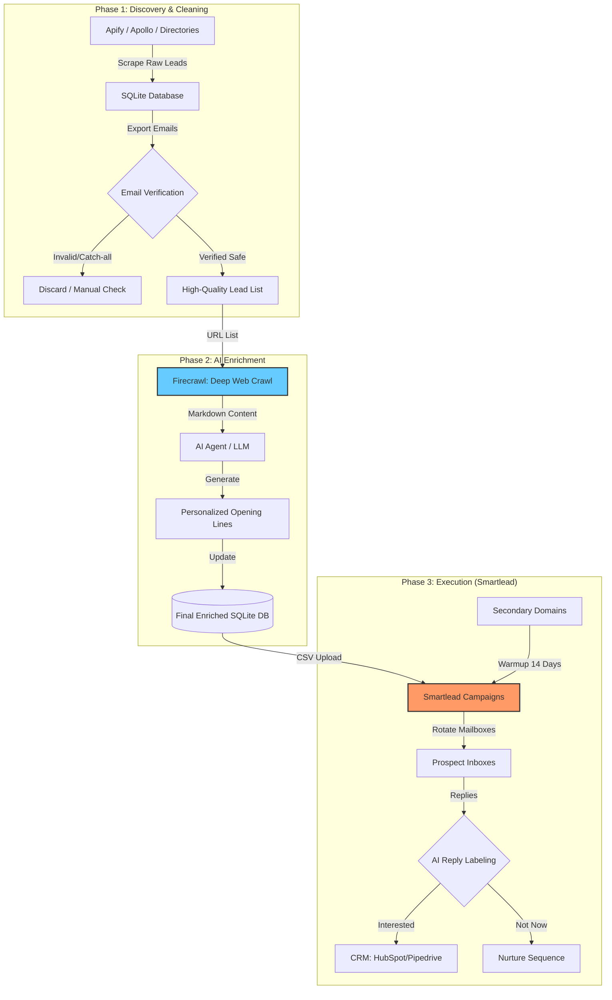
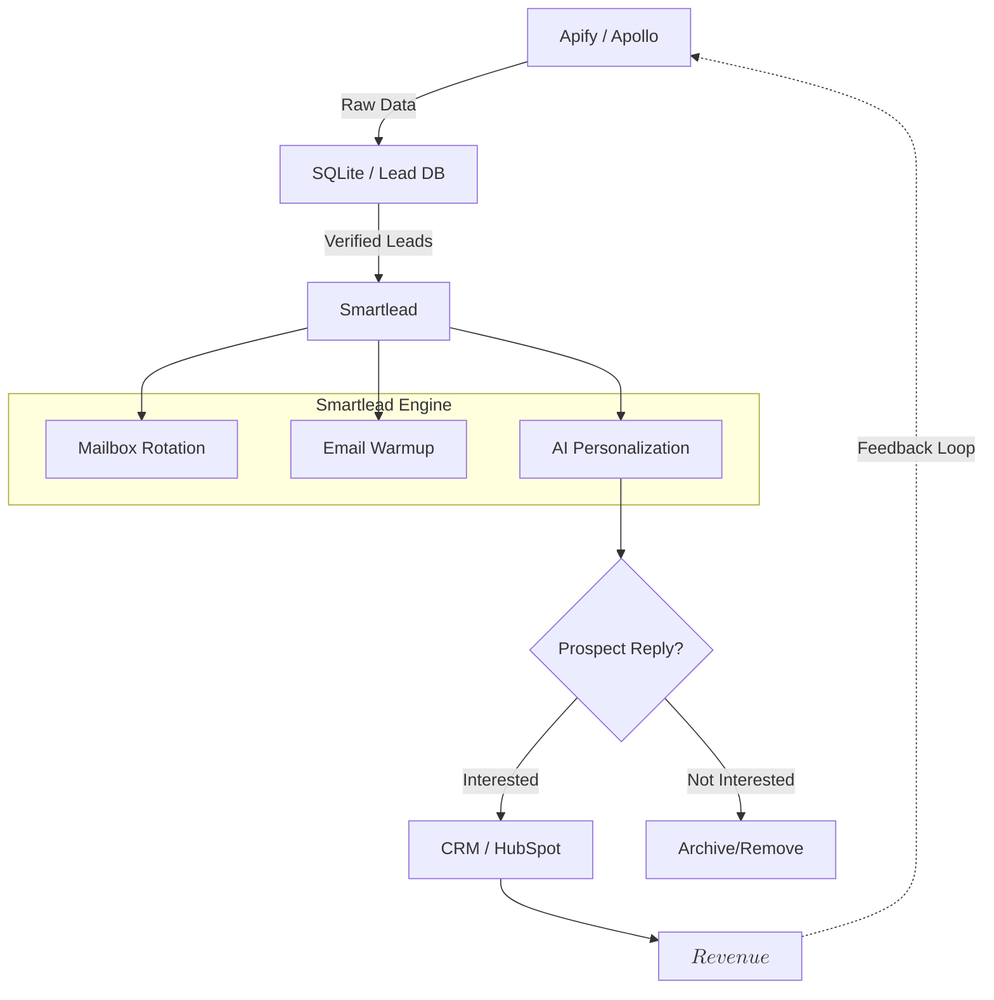

**Tl;DR**

Oil, aka `CL=F` is a commodity

Your client's money is a commodity.

Your [client is a commodity](https://youtu.be/O_tmZgs4LHU).

~~Your tinder date, is most likely a commodity~~

Your product is NOT.

**Intro**

For custom ~~products~~ services: *Im starting to let clients do their own quote*.

Shoot an unresonably low number and I already know that you are not making enough money with my solutions.

So why should we loose time?

Should we spend time discussing about building something that wont have impact? that will be used 3 times?

Im just sorry for those who underestimate other's opportunity costs.

Specially for the ones that have been pushing their assets/brands for some time already.

For the rest: **How about we find people who can potentially benefit of what you have created?**


## A UI Wrapper Around APIFY

Making UI wrapper around things is so easy this year.

We've seen that around the langchain qna to dbs.

And now, time for [more APIFY](https://jalcocert.github.io/JAlcocerT/apify/):


  
  


But, what is this for?

1. Get leads
2. Enrich them
3. Perform a [Lead Score process](#define-the-lead-scoring-strategy)




Go to whatever LLM you are using and ask: `do you think that these requirements are clear enough?`

```md
Create a sth sth sth like... a Landing Page based on NextJS with a cool and modern UI

Include a `dockerfile` and `docker-compose.yml` that will control the title, description, open-graph image, favicon location and other global website variables via environment variables.

Add also a docker-compose.portainer.yml to use assuming that the image has been built already.

Create also a makefile with the following commands:

* `make help` - Show available commands
* `make install` - Prepare the dependencies for local development
* `make dev` - Run development server
* `make container` - Build and Run in Docker container

Create the `z-development-plan.md` with independent and testable phases that can be completed sequentially.

When it is completed, create a `z-walkthrough.md` with the steps to deploy the application and what each part of the tech stack does on a high level to bring the features to life.

Consider adding a Terms of Service / **terms and conditions and privacy policy** to the website, which will be governed by two separated markdown files.

Add also a faq section, that instead of been controlled via a json, lets have it controlled as per the frontmatter and content of separated markdown files inside the folder `faq`.

The logic should read them in order as per their file name and show them in the right component of the UI.

> When these change, consider sending an email to your existing clients!

Consider adding **Umami web analytics capabilities** to the WebApp when using the container, by adding the possibility to feed the PUBLIC_UMAMI_SCRIPT_URL and PUBLIC_UMAMI_WEBSITE_ID to be used via <script defer src="" data-website-id=""></script>

If you are using Python, design proper functions with docstrings, so that the codebase is understandable, scalable and self-documenting.
```

Then go to [AntiGravity IDE](#antigravity-ide) and ask if the `brd.md` refined already with Gemini is clear enough.

If it is clear define the `z-development-plan.md` and proceed with the development phases.

As you will need to iterate across features, do it like a pro with change-requests / CRQ.

```sh
#sudo apt install gh
gh auth login
#gh repo create make-xyz --private --source=. --remote=origin --push
    
git init && git add . && git commit -m "Initial commit: simple landing website" && gh repo create make-xyz --private --source=. --remote=origin --push
###du -sh .
#docker stop $(docker ps -a -q) #stop all
#docker system df

#make help
#docker builder prune	
#sudo journalctl --vacuum-size=500M
sudo apt-get clean
sudo apt-get autoremove
```

**Technical Stack and Design Requirements**

To develop a **modern, secure, and scalable web platform** for hosting and streaming a single-user podcast.

The platform must offer a seamless, content-driven user interface and a flexible content management system supporting both web uploads and direct file system access.

| Requirement | Specification | Clarification / Decision |
| :--- | :--- | :--- |
| **Frontend Framework** | | |
| **Styling/UI Library** | | |
| **[Backend](https://jalcocert.github.io/JAlcocerT/docs/dev/fe-vs-be/)/Database** | | |
| **[Authentication](https://jalcocert.github.io/JAlcocerT/docs/dev/authentication/)** | | |

And if you need more:

| Requirement | Specification | Clarification / Decision |
| :--- | :--- | :--- |
| **Deployment** | | |
| **Content Management** | | |
| **Analytics** | | |
| **Interactivity** | | |
| **External Integrations** | | |



> The BRD, tech stack, clarifications, dev phases and walkthough. With sales and psyc plugged in!

### Use APIFY to the Max

Every business needs clients.

Building something that does precisely that: has potential demand.

Plus you can use the product...to...sell the product.

And if you are here, there are [people that has been around this idea already](https://forocoches.com/foro/showthread.php?t=10574345).

Also [here](https://forocoches.com/foro/showthread.php?p=507148447#post507148447), around a google map scrapper `https://app.quickscrape.net/google-maps-scraper/`

Apify sits in a unique middle ground: *it is more powerful than simple no-code tools but easier to use than raw developer infrastructure.*

1. Apify vs. Bright Data (Infrastructure Focus)

Bright Data is essentially a "proxy giant." While they have scraping tools, their core strength is their massive network of 72M+ IPs.

* **The Apify Advantage:** **Logic over Infrastructure.** With Bright Data, you often have to build the scraper yourself and just use their "pipes." Apify provides the **Actors** (the actual code/logic) for thousands of sites.
* **Key Win:** You can launch a full Amazon or Google Maps scraper on Apify in 2 minutes without writing a single line of code; on Bright Data, you’re more likely to be configuring proxy settings and headers.

2. Apify vs. Apollo.io (Database Focus)

Apollo is a pre-built database. You search for "Marketing Managers in London," and it gives you what it has in its records.

* **The Apify Advantage:** **Live Data vs. Stale Data.** Apollo’s data can be months old. Apify scrapes the web **right now**. If a company just updated their "About Us" page with a new contact person, Apify will find it; Apollo might not have it yet.
* **Key Win:** Customization. You can't ask Apollo to "find every plumber in Berlin who has a 4-star rating on Google Maps." With an Apify Actor, you can.

3. Apify vs. PhantomBuster (Social Media Focus)

PhantomBuster is famous for LinkedIn and Twitter automation (sending invites, liking posts).

* **The Apify Advantage:** **Scalability & Stability.** PhantomBuster often relies on your own browser session (using cookies), which is risky and slow. Apify runs on massive cloud servers with professional-grade anti-blocking.
* **Key Win:** Apify is better for **volume**. If you need 50,000 leads, PhantomBuster will likely get your account flagged; Apify's infrastructure is built to handle millions of requests via rotating proxies.

4. Apify vs. Octoparse (Visual Focus)

Octoparse uses a "point-and-click" desktop app where you click on the elements you want to scrape.

* **The Apify Advantage:** **Cloud-Native & Developer Friendly.** Octoparse can be clunky for complex sites with heavy JavaScript. Apify is built on **Crawlee** (a world-class open-source library), making it much more reliable for sites that try to block bots.
* **Key Win:** Integration. Apify has a superior API and webhooks. It’s easier to pipe Apify data directly into your CRM (like Salesforce) or an AI tool (like ChatGPT) automatically.

5. Apify vs. Clay (Workflow Focus)

Clay is an "aggregator" that pulls data from multiple sources (including Apify) to build lead lists.

* **The Apify Advantage:** **Cost Efficiency.** Clay is expensive because you pay for their "convenience" and their premium data providers.
* **Key Win:** If you know exactly where your data is (e.g., "I just want Google Maps leads"), using Apify directly is significantly cheaper than paying Clay's premium per-lead prices.

Why choose Apify?

| Feature | Apify's "Pro" |
| --- | --- |
| **Speed to Start** | 10,000+ ready-made "Actors" for almost any website. |
| **Anti-Blocking** | Sophisticated "Browser Fingerprinting" that mimics real humans better than most. |
| **Monetization** | If you write a good scraper, you can sell it on their store and earn passive income. |
| **Scalability** | Can run thousands of scrapers in parallel in the cloud. |


### Store your B2B leads

Somewhere.

You can start with a `.csv`, or a google sheet.

If the thing scales, probably you will need to think about integration to CRMs.


### Define the Lead Scoring Strategy

* **Marketing (The "Builders"):** They define the **Fit**. They use the data you scrape to say, *"A Lead must be a Director or VP at a company with 50+ employees in the SaaS sector to get +50 points."*
* **Sales (The "Validators"):** They define the **Intent**. They provide feedback like, *"Hey, the leads you sent me from that LinkedIn scrape were great, but only the ones who had 'Hiring' in their profile actually bought. Let's add +20 points for hiring signals."*
* **Marketing Ops (You):** You are the one who actually writes the logic into the database or CRM to calculate these numbers automatically.

### The OutReach Strategy


#### Choose your mailing

Regular mailing ESP like mailtrap wont serve here.

Those are for transactional ones, not for cold emails.

People are using these: 

* `https://loops.so/`
* `https://www.zoho.com/mail/`

#### Social Media Outreach

If you go the B2B route, Linkedin will be one that you want to try.


---

## Conclusions

Hopefully by now you have **your sales pipeline** full of people that are [NOT afraid of 70$/y **proton** subscriptions](https://jalcocert.github.io/JAlcocerT/selling-with-a-landing-website/#outro).

Like this one: https://pr.tn/ref/RHJ7YZE8

Your clients are NOT solving you anything.

Your products/services are solving their problems.

Like these `https://protonapps.com/` are there to help you.

Not there yet? 

Too complex reasoning?

Here is a solution to your problem: *When there is no risk **for sure** there is no opportunity*


  
  


With that you get up to speed quickly with how to use your wishes to build:


And how to do so, so that you build a product that somebody actually wants: *not what you think they want*

Not this process:


But this one:


### What works what not and whats next


Capturing leads with this workflow is great: Discovery & verification x Enrichment x Execution




You can then do:

1. Phone Call
2. Social Media Outreach: like via linkedin *enhanced with other [tools, like these](#selfhosted-outreach-tools)*
3. Cold email: similarly to the lean DRIP email automation with Mailtrap I set [here](https://jalcocert.github.io/JAlcocerT/iterating-and-improving-a-micro-saas/#mailtrap-orchestrated-via-gha)


Thinking about MOps vs RevOps has been a thing.

| Feature | Marketing Ops (Pro) | RevOps (Full Stack) |
| --- | --- | --- |
| **Tool Stack** | Apify, Firecrawl, Clay, Instantly.ai | CRM (HubSpot), Stripe/Quickbooks, Slack, BI Tools |
| **Success Metric** | Number of "Hot" Leads | Annual Recurring Revenue (ARR) |
| **The "Magic"** | High-speed, high-quality data. | Predictable, scalable money. |
| **Core Question** | "How do I get more meetings?" | "How do I grow the company's bank account?" |



And in the end: is a very clear information/**data silo problem**.

To bridge the gap between "just scraping" and "RevOps excellence," you need a **Feedback Loop**.

1. **The Loop:** When a salesperson closes a deal in the CRM, that information should travel *back* to your SQLite database.
2. **The Optimization:** You look at that deal and see: *"Ah, this person was a 'CEO' found via the Google Maps Actor."*
3. **The Scale:** You then tell Apify to run that specific Google Maps Actor 10x more often because it's the one producing the actual money.

When you are done, you can clear the mess with:

```sh
#docker stop $(docker ps -a -q) #stop all
#docker system df
#docker system prune -a --volumes -f
```

---

## FAQ


### Email Verification

Before enriching, just make sure that an email even exists.

If you dont want to complicate your live with [OSS like knockmail](https://jalcocert.github.io/JAlcocerT/emails-101/#knockmail)

You can try: MillionVerifier or NeverBounce


### SelfHosted OutReach Tools

If it does not already, Growchief should sounds to you to a lead enrichment and/or sales pipeline companion.


  
  


#### GrowChief

It emphasizes human-like automation with stealth technology and proxies, making it well-suited for lead generation, engagement, and outreach workflows. 

GrowChief **supports API triggers** and teams, targeting agencies, startups, and solopreneurs who want to automate social interactions.

- Postiz, on the other hand, is an all-in-one social media scheduling and management platform with a strong focus on content creation, scheduling, team collaboration, and analytics. 

In summary:

| Feature            | GrowChief                                         | Postiz                                                  |
|--------------------|--------------------------------------------------|---------------------------------------------------------|
| Primary Focus      | Social media outreach automation (connect, follow, message) | Comprehensive social media scheduling, content creation, and management |
| Supported Actions  | Connection requests, follow-ups, likes, visits  | Scheduling posts, content creation, analytics, team collaboration |
| Platforms          | X (Twitter), LinkedIn                            | Facebook, Instagram, TikTok, LinkedIn, YouTube, Reddit, more |
| AI Capabilities    | Limited (workflow-based automation)             | AI content & image generation, AI assistant             |
| Audience           | Agencies, startups, solopreneurs for outreach   | Agencies, businesses, marketing teams for scheduling/content management |
| Open Source        | Yes                                              | Yes                                                     |

So, while they are similar as open-source social media tools, GrowChief focuses on outreach and engagement automation, whereas Postiz offers a broader social media management and scheduling experience with strong AI-driven content creation features.

If you read the [sample.env](https://github.com/growchief/growchief/blob/main/.env.example), you might recognize:

Apollo leads!

And we are aware that [some marketers use apollo](https://jalcocert.github.io/JAlcocerT/software-for-marketing-agencies/#a-sample-marketer-workflow)...

...Combined with APIfy to lower the cost!

- OPENAI_API_KEY
- RESEND_API_KEY=""
- EMAIL_PROVIDER=""
- EMAIL_FROM_NAME=""
- EMAIL_FROM_ADDRESS=""
- NEWSLETTER_PROVIDER=""

GrowChief is primarily a **social media outreach automation tool** focused on automating actions like sending connection requests, follow-ups, liking, and profile visits on platforms like X (formerly Twitter) and LinkedIn.


It allows you to create a workflow (step-by-step) for interacting with different accounts on social media, such as sending a connection request, following up with a message, and so on.

Perfect for API/n8n automations.

* https://github.com/growchief/growchief

> apg3.0 |  The Ultimate all-in social media automation (outreach) tool 🤖 

> >  GrowChief: An alternative to: Phantom Buster, Expandi, Zopto, LinkedIn Helper, Meet Alfred, etc.

- GrowChief is primarily a social media outreach automation tool focused on automating actions like sending connection requests, follow-ups, liking, and profile visits on platforms like X (formerly Twitter) and LinkedIn.