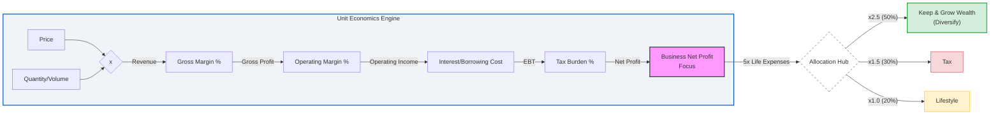

**Tl;DR**

I let go most of my ,first ten' clients saying: *from next year you put the price for the custom cool app you said you needed and deserved so much*.

Guess what happened as I didnt put the effort to find the right avatar.


  
  


+++ About [Selfishness and business](#about-been-selfish)


**Intro**

Yes, I need to find new customers :)

We come from the [sales pipeline *v1 post*](https://jalcocert.github.io/JAlcocerT/apify/), also with APIFY.

Because sometimes when you listen to [what it works for others](#how-has-this-happened) your mind explodes.

Knowing how to get clients is a must skill if you are building: *if you got more vibe coded webaps and repos in github than actual client, stay*


  
  


But also if you want to build sth that can help others: *ive met people doing $$$ ,just' by selling leads*


And...I know, you can post on social media how great ❄️ you are - Same as everybody does.

Including those that are 'all about frontend' and are LITERALLY one paycheck away from living under the bridge.

Or...expecting to be rescued from your taxes.

Like the ones you will be generating after getting leads right for your SaaS by following this post.

> Dont blame them, they deserve such lifestyle

> > PS: in their eyes, you dont :)

## How has this happened?

As always, a series of tinkering steps.

This started at [this post](https://jalcocert.github.io/JAlcocerT/software-for-marketing-agencies/), with [this 123 session](https://youtu.be/qQ13MKLfqYQ)


  
  


I Got to know that Cool marketing agencies are using: `https://apify.com/`. 

> Apify is the largest ecosystem where developers build, deploy, and **publish web scrapers**, AI agents, and automation tools.

{}


### Tested n8n automations

And APIFY has a good integration for n8n.


Check that out if you have an [automation agency](https://jalcocert.github.io/JAlcocerT/pro-agency-automation/#n8n-x-apify).

### Sales Pipeline 101

Where I was testing [APIFY fantastic API](https://jalcocert.github.io/JAlcocerT/apify/).

It was all thank to [a 123 meeting](https://jalcocert.github.io/JAlcocerT/software-for-marketing-agencies/#apify-can-do-that) with marketers


{}

## Building around APIFY

This is not going to be with n8n.

This is going to be built to last, without been fragile.

And is not going to be as custom tool for anyone: *just for me*.

So no business problem to be defined.

This is aimed to solve the attraction and conversion bottlenecks for me.

Lets get to it:

* https://apify.com
  * https://docs.apify.com/platform

> Your full‑stack platform for web scraping


--- 

## Conclusions

This is all from the start doing goal for this year: *Go all-in to find new clients*

Pros say they its all about: disqualifying, more than qualify everyone is what makes you earn money.

DOnt follow your passion.

Dont find a public for a given product.

Do reverse: detect a public (avatar, a profile) that can be segmented in an easy way and find out what they want to buy.

> We wont low friction, but SOME friction

This will potentially fill my *DWY pipeline*.

The one created [here](https://jalcocert.github.io/JAlcocerT/selling-with-a-landing-website/#conclusions).

One year *aka 12 months* is what you need to change your business and life.

Ive seen it happen: *Programming marketing and sales is all you need*

```sh
whois genkinfy.com | grep -i -E "(creation|created|registered)"
```

Want this implemented for your business?

Or prefer to keep your Ego safe vs take this bet and see if people/b2B want your services?


  
  


[Choose your ~~business~~ game](https://youtu.be/qsXxckCbci0?si=hH5rgUp3bwjTKHSy).

Focus. Win.



### What are my plans around client adquisition

I will use this mainly for two projects:

1. [The weddings](https://jalcocert.github.io/JAlcocerT/bring-eyes-to-your-saas/) B2B flow (B2C goes the ad route)
2. The [custom real estate](https://jalcocert.github.io/JAlcocerT/custom-re-rag) web/app as a *high ticker* with [custom demo emailed to potential clients](https://github.com/JAlcocerT/moi-realestate-pro-astro-bot/blob/master/z-sales-automation.md) 
3. The Gen-AIBI [on demand data analytics](https://github.com/JAlcocerT/langchain-db-ui/blob/master/Z_PGSQL-GenBI/sales.md) thats coming
4. People need clients, so an UI wrapper around this will be valuable on its own :)

Stay tuned. 

The year has just started.

### About been Selfish

Some thoughts around: "A trader is a man who earns what he gets and does not give or take the undeserved."

Many people assume Rand’s "selfishness" means being unkind. 

However, she argued that if you truly self-respect, you will naturally value other independent, productive people.

You might help a friend in need—not because it’s a "duty" to sacrifice yourself, but because that friend is a "value" to you and seeing them happy increases your own happiness.


Before moving forward: *the free -100%ROI for my time investment to learn what I do and how?*


  


#### 1. The Randian Business Model: The "Productive Achievement"

In business, Rand’s "non-sacrificial" concept manifests as **Rational Capitalism**.

* **Self-Supporting (Profitability):** A business must be profitable to exist. Rand would argue that a company relying on government subsidies or "bailouts" is not a "self-supporting" entity—it is a "moocher." True self-respect in business comes from creating a product that people *want* to buy.
* **Neither Sacrifices Others to Himself (Integrity):** This means no fraud, no lying to shareholders, and no "cronyism." You don’t get ahead by sabotaging competitors or lobbying for laws that hurt them. You get ahead by being **better**.
* **Nor Sacrifices Himself to Others (Value-Based Employment):** This applies to the boss and the employee.
* **The Boss:** Shouldn't feel guilty for being rich or "owe" a job to someone who isn't productive.
* **The Employee:** Doesn't "sacrifice" their life for the company. They trade their time and talent for a paycheck and experience. If the trade isn't fair, a Randian walks away.


**The Business Motto:** *"I don't work for you, and you don't work for me. We work with each other for our own separate benefits."*

---

#### 2. Could a Stoic be a "Trader"?

**Yes, absolutely.** In fact, a Stoic might be the most effective trader you ever meet, but for different reasons than a Randian.

While Rand values the **result** (the profit, the building), the Stoic values the **process** (doing the job correctly and ethically).

How the Stoic "Trader" Operates:

* **The Goal is "Internal":** A Randian trader is devastated if their business fails because they see it as a failure of their creative power. A Stoic trader thinks: *"I did my best to negotiate fairly and work hard. The market crashed—that was outside my control. I am still a man of character, so I am still successful."*
* **The "Preferred Indifferent":** Stoics like Epictetus taught that wealth is a "Preferred Indifferent." It is better to have it than not, but it doesn't change your worth. Therefore, a Stoic can trade aggressively and earn millions, but they won't be "possessed" by their possessions.
* **Justice as a Core Virtue:** Stoics believe in "Justice" (the duty to act fairly toward the human community). A Stoic trader wouldn't cheat a customer not because it's "irrational" (Rand's view), but because it violates the "social bond" of humanity.


| Action | Randian Executive | Stoic Executive |
| --- | --- | --- |
| **Hiring** | Hires the "best" to maximize profit. | Hires the "best" to fulfill their duty well. |
| **Losing a Client** | Frustration; loss of a "earned value." | Calm; the client was "not under my control." |
| **Competition** | A battle of competence to prove who is superior. | An opportunity to practice excellence (Arete). |

Which approach sounds more sustainable for a long-term career? 

The high-octane drive of Rand, or the "unshakable" calm of the Stoic?


---

## FAQ

* https://github.com/browser-use/browser-use

>  🌐 Make websites accessible for AI agents. Automate tasks online with ease. 

See also:

1. LangChain Web Scrapping

2. Browserless

* https://github.com/browserless/browserless

>  Deploy headless browsers in Docker. Run on our cloud or bring your own. Free for non-commercial uses. 

summary: 'Crawl4AI is an open-source web crawler and scrapper tailored for LLMs and AI applications.

It offers asynchronous crawling, data extraction, and various features for enhanced performance and scalability.'

* https://github.com/saifyxpro/HeadlessX

> MIT |  A lightweight, self-hosted headless browser automation platform. Designed as an alternative to Browserless, built for speed, privacy, and scalability. 