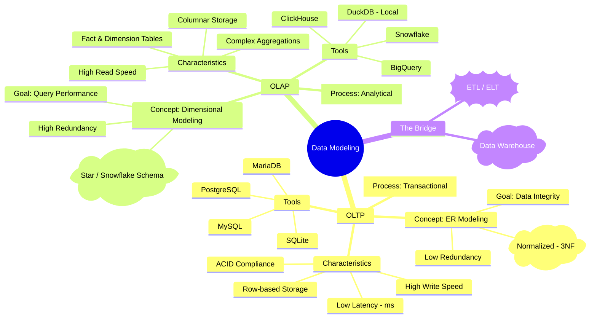
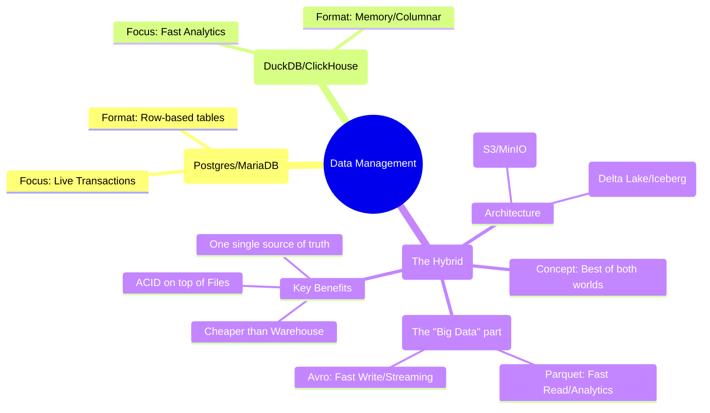

**Tl;DR**

**Intro**

This is all around:


  
  



## Enterprise Insights

We are going to simulate these with containers.

Just as demostrated here with pgsql.


  



### TSQL

### Oracle SQL

### DuckDB vs ClickHouse vs SQLite

Some people say that duckdb is the opposity of redshift.




The Data Lakehouse is essentially the "modern evolution" that tries to delete the line between your Postgres (OLTP) and your ClickHouse/DuckDB (OLAP).

If OLTP is for writing and OLAP is for reading, the Lakehouse is for unifying.



### Using BAML

I was testing BAML last year [here](https://jalcocert.github.io/JAlcocerT/ai-tools-for-cli/#baml).

And it resonated a lot with the way langchain generates the query to the databases.

So could not resist to explore how to do a custom and more controlable solution around BAML.


[](https://colab.research.google.com/github/JAlcocerT/Data-Chat/blob/main/LangChain/ChatWithDB/test_langchainChatDB.ipynb)

### UI Wrapper

To make the solution sellable to enterprises, we need a UI.

And the good news is that we already vibe coded that: here.


---

## Conclusions

From how to what and why.

Code is cheap now. Software isnt *at least for now*.

> From [this great post](https://www.chrisgregori.dev/opinion/code-is-cheap-now-software-isnt) and [video](https://www.youtube.com/watch?v=28z6OjsNsUk)

The danger is now more on not to get distracted with the daily tool or workflow that gets released.

Go with cursor, antigravity, claude code, lovable, opencode, crush...

But just go and try.

The challenge is now the **distribution / orchestration / marketing**, not the coding thing.

Do you even know the audience? is it even listening?

Are you building sth for an empty room?

Time to go from builder to **creator and finding people to care** about your thing.

### The related tech talk

```sh
git clone https://github.com/JAlcocerT/selfhosted-landing
cd y2026-tech-talks/4-baml-db-insights
```

---

## FAQ


### A Recap on D&A for Interviews

If you were to grow your Northwind project into a "Big Data" architecture:

Postgres (OLTP) handles your orders.

An ETL tool takes those orders and saves them as Avro files in a folder (Data Lake).

A "Lakehouse" tool (like Apache Iceberg or Delta Lake) converts those to Parquet.

DuckDB or ClickHouse then queries those Parquet files directly..

---

Looker was **not** an alternative to Redshift; instead, it was designed to be the **perfect companion** for Redshift. However, it was a direct and very different **alternative to Power BI**.

To understand why, you have to look at how Lloyd Tabb reimagined the "Data Stack."

### 1. Looker vs. Redshift (Partners, not Rivals)

Looker and Amazon Redshift belong to different layers of the data stack:

* **Redshift is the "Engine" (Data Warehouse):** It stores the billions of rows and does the heavy lifting of calculations.
* **Looker is the "Interface" (BI & Modeling):** It sits on top of Redshift. It doesn't store data; it translates your mouse clicks into high-performance SQL that runs directly on Redshift.

Before Looker, people had to "extract" data from Redshift into their BI tools. Lloyd Tabb’s big idea was: *"Redshift is fast enough—why move the data? Let’s leave the data in the warehouse and just send it instructions."*

---

### 2. Looker vs. Power BI (The True Alternatives)

Looker was a radical alternative to Power BI (and Tableau). While Power BI focuses on the **Visuals**, Looker focuses on the **Logic**.

| Feature | **Power BI** | **Looker** |
| --- | --- | --- |
| **Philosophy** | **Visual-First.** Drag and drop charts, then figure out the data. | **Code-First.** Define the data logic in **LookML**, then the charts build themselves. |
| **Data Storage** | **Imports** data into its own memory (usually). | **Stays in the Warehouse.** Queries the live data every time. |
| **"Source of Truth"** | Logic can be hidden in different reports, leading to different numbers. | Centralized **LookML** model ensures everyone sees the same "Revenue" number. |
| **Workflow** | Desktop-based app, feels like Excel. | Web-based, feels like software engineering (uses Git/Version Control). |

---

### Why would someone choose Looker over Power BI?

Lloyd Tabb created Looker for companies that were tired of "Data Chaos"—where two different people would bring two different "Total Sales" numbers to a meeting because they calculated the formula differently in Power BI.

**Looker’s "LookML" solved this:**

* You define "Sales" **once** in code.
* Every single chart in the company uses that same code.
* If the definition of "Sales" changes, you change it in **one place**, and every chart in the company updates instantly.

### Summary

If you wanted a tool that behaved like **software code** and worked natively with **Redshift** without moving data around, Looker was the alternative you chose over Power BI.

**Would you like me to show you a simple example of how LookML code looks compared to a Power BI formula (DAX)?**