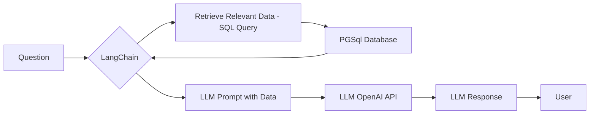

**Tl;DR**

**Intro**

It all started from trying to [talk with pandas dataframes](https://jalcocert.github.io/JAlcocerT/how-to-use-pandasAI/).

And there was some evolution around it.



  
  


This is [not a new idea](#about-rags), but a new way to approach it.

And *not yet* trying to [sell it](#offer-configuration).

## About RAGs

[RAGs frameworks and vector DBs](https://jalcocert.github.io/JAlcocerT/rag-frameworks-for-ai-projects/) have been around for few years so far.

From all the [ways to do rag](https://jalcocert.github.io/JAlcocerT/comparing-rag-and-use-cases/), Langchain is still the top 1 framework.

[](https://github.com/langchain-ai/langchain/stargazers)


With [Langchain, we can chat with our data](https://jalcocert.github.io/JAlcocerT/how-to-chat-with-your-data/) in many different ways


From the typical CSVs:


  
  


Going through PDF's:


  
  


And most importantly: [LangChain can be **connected to our databases**](https://jalcocert.github.io/JAlcocerT/langchain-chat-with-database/)


```sh
#git clone https://github.com/JAlcocerT/Data-Chat #see for yourself the previous langachain x db chat - tinkering
#git clone --depth 1 --single-branch -b main https://github.com/JAlcocerT/Data-Chat
cd LangChain/ChatWithDB
#cd realestate
#npm run build
```

That was all based on the beauty of [LangChain Community SQL database module](https://github.com/langchain-ai/langchain-community/blob/main/libs/community/langchain_community/utilities/sql_database.py).


  



[](https://colab.research.google.com/github/JAlcocerT/Data-Chat/blob/main/LangChain/ChatWithDB/test_langchainChatDB.ipynb)



  
  


So...how about leveling up [with a cool setup](#the-setup)?

## The Setup

We will need:

1. A Database to tinker with
2. A way to connect the DB (inside a container) to Langchain
3. A UI Wrapper to do QnA *outside the terminal*
4. Bonus: AI/BI to get visual insights from the data

These resources will provide context:


  
  




### Databases

We are going to push sample databases with tables already configured towards a container: *specially now that I wrote [about selfhost pg](https://jalcocert.github.io/JAlcocerT/creating-a-diy-paas-service/#selfhost-postgres)*


  
  


We can create **read only users** so that LangChain will connect to the DB safely.

Previously, I was using the Chinook artist related DB: *via MySQL*



```bash
sudo apt update
sudo apt install mysql-server -y
sudo systemctl start mysql
sudo systemctl status mysql
sudo systemctl enable mysql  # Start MySQL on boot

sudo mysql -u root -p
```

```bash
# mysql --version  # Output: mysql Ver 8.0.40-0ubuntu0.24.04.1 for Linux on x86_64 ((Ubuntu))
```

```sh
systemctl list-units --type=service #you will see mysql there
sudo systemctl stop mysql #if you stop it
lsof -i :3306 #this will be cleared
```



 

But I want to try couple new things:

1. Tt will be **PGSql this time** and looked *with Perplexity help* some new sample datasets.

```sh
git clone https://github.com/JAlcocerT/Home-Lab
cd postgresql
sudo docker compose up -d
##sudo docker compose logs
```

You should see something like:

```md
PostgreSQL init process complete; ready for start up.
postgres_container  | 
postgres_container  | 2026-01-08 11:22:32.469 UTC [1] LOG:  starting PostgreSQL 16.11 on x86_64-pc-linux-musl, compiled by gcc (Alpine 15.2.0) 15.2.0, 64-bit
postgres_container  | 2026-01-08 11:22:32.469 UTC [1] LOG:  listening on IPv4 address "0.0.0.0", port 5432
postgres_container  | 2026-01-08 11:22:32.469 UTC [1] LOG:  listening on IPv6 address "::", port 5432
postgres_container  | 2026-01-08 11:22:32.478 UTC [1] LOG:  listening on Unix socket "/var/run/postgresql/.s.PGSQL.5432"
postgres_container  | 2026-01-08 11:22:32.489 UTC [57] LOG:  database system was shut down at 2026-01-08 11:22:32 UTC
postgres_container  | 2026-01-08 11:22:32.498 UTC [1] LOG:  database system is ready to accept connections
```

2. How about **new sample tables**?

You can do the [Chinook sample with PGSql](#sample-1) anyways.

But I bring you few more:

* 
* 

#### Sample 1

```sh
curl -L -O https://github.com/lerocha/chinook-database/releases/download/v1.4.5/Chinook_PostgreSql.sql
cat Chinook_PostgreSql.sql | docker exec -i postgres_container psql -U admin -d myapp

docker exec postgres_container psql -U admin -d myapp -c "\l"

docker exec postgres_container psql -U admin -d chinook -c "\dt"

docker exec -it postgres_container psql -U admin -d chinook
#\dt
#SELECT * FROM artist LIMIT 5;
```

You can see that the data is loaded with any of:

```sh
docker exec postgres_container pg_dump -U admin -d chinook --schema-only
#docker exec -it postgres_container psql -U admin -d chinook -c "\d"
```

See how litle the workflow changes from the previoys mysql to the [container based pgostgresql](https://github.com/JAlcocerT/langchain-db-ui/blob/master/LangChain_PGsql_DB_Chat.ipynb):


[](https://colab.research.google.com/github/JAlcocerT/langchain-db-ui/blob/main/LangChain/ChatWithDB/LangChain_PGsql_DB_Chat.ipynb)


You can get the schema: *and feed it further to an agent / openAI call to get additional insights*

```sh
query = """
SELECT 
    table_name, 
    column_name, 
    data_type 
FROM 
    information_schema.columns 
WHERE 
    table_schema = 'public'
ORDER BY 
    table_name, ordinal_position;
"""
print(db.run(query))
```

Like... getting a quick [ER mermaid diagram generated](https://mermaid.live/edit#pako:eNrVVk1vozAQ_SvI5yQiJUDCdVe95LLnVSTkwCRYBZs1pmpK89_X5sOhYNPucXOK_d482zNvbBqUsBRQhID_JPjKcXGijvxhLkglnI-P9Zo1Ds7PdeFEzkmyqcCEVifU81qkpwmOkxcj7QqUg4GGBVwZJ--gmQWkBMfiVhroKVwIfVA7oGcR-spIAnEuGS2Z0CSvU0glYgwoc3zL5Rnjh74hZGAtRE3P2u_EurEMa2pSV4IVwCfcliZXSh5nhaLM2Q20qo5U1KouS8aFlazHisyh5TqCKfqnajfdqDuErIyU75CYpM6v4wN9xTzJMHcoLqCbvWup1hAmJQXYhAQROSyt_nycrNPl37BOC3y9YePWno9z8GFIG6M19xQcVkxYUbIKuEGY5NJJIO2TVnP0fBMwmqa1LDZJnJoSEZfy3zTvXYc1C7v7ZgFHDdh8lY1vSuomMgjqhvp3udjqgc-iK2PVRj5Zze01dKJBfGjoyYYHeOjMqSEEKaASuCi1QCpvv_mBz8oW9BrjNOVQVXZCQsTNjsqlltQTVlPBF-KlaQXOY_U6zF0omMTMGevuuYW0KdyWu1FqF0s2Bm2dMQ78U2MqdLr0lvUl2iyX0eTLC-HSX5_vkwHLsRVS1wGmhrxby20us6W81rIay6nBjFHD9AW_zSehwCSfp6t_gmL5uhiva_0EGVI9YLZUL6RzqQqWN6V__2LBLO15Jlxkk-Z8oBnhts79D0t4Ryt05SRFkeA1rJA0vATlELV1OiGRgcwtar--MH9RnwwqRnr4N2PFEMZZfc1QdMF5JUd1qfLTf07qWQ40Bf5DnQ5FWz9sRVDUoDcU7Q-bg3t4Ohx8_ynwwmCFbihab3fBxg38IPTD7d4L_K13X6H3dtntxgtd193tA893Q8_1dve_msRpqQ)

#### Sample 2

#### Sample 3 - Connecting to running services


  
  


##### Commento

##### Umami

### UI Wrapper

To go from a python notebook / terminal / script to something that is more non tech user friendly, **we need a UI**.

That's where the power of vibe coding kicks in, together with a new project:


  


{}

```sh
#sudo apt install gh
gh auth login
gh repo create langchain-db-ui --private --source=. --remote=origin --push

#git init && git add . && git commit -m "Initial commit: langchain x db x ui" && gh repo create langchain-db-ui --private --source=. --remote=origin --push
```

{}

As recently, I started with a BRD, some clarifications, then a development plan.

> PS: You dont need [1000h of prompt engineering](https://www.reddit.com/r/PromptEngineering/comments/1nt7x7v/after_1000_hours_of_prompt_engineering_i_found/) to do so


### AI/BI

If you are *kind of stucked* in your D&A career, shaping one of this will be good for your portfolio.


  



* https://github.com/Kanaries/graphic-walker

> Apache v2 | An open source alternative to Tableau. **Embeddable visual analytic**


---

## Conclusions

Could this be attractive to people that have some e-commerce and dont have the bugdet to hire an BI/analyst to see whats working/whats not?

[One more time](https://jalcocert.github.io/JAlcocerT/selling-with-a-landing-website/#outro), its all about *the friction to PAY versus the friction to DO*.

When you are done, you can clear up with:

```sh
#docker stop $(docker ps -a -q) #stop all
#docker system df
#docker system prune -a --volumes -f
```

### The Related Tech Talk

To unify my workflow/efforts, I've moved my tech talk creation from:


```sh
git clone --depth 1 --single-branch -b logtojseauth https://github.com/JAlcocerT/slidev-editor #just current status
#git clone https://github.com/JAlcocerT/slidev-editor
#git branch -a
#git checkout -b logtojseauth main
```

As part of my consulting repository: *the responsible for `consulting.jalcocertech.com`*

```sh
git clone https://github.com/JAlcocerT/selfhosted-landing
cd y2026-tech-talks/langchain-postgres
#npm run dev 
```

This time I used not only components and public images, but also `./pages` to keep the content modular and potentially, re-use it in the future.


Yea, [thats private](https://github.com/JAlcocerT/selfhosted-landing/tree/master/y2026-tech-talks) :)

<!-- 
You can see the video:
 -->

But you can get it done for you:


  
  



#### Next Steps


##### Offer Configuration


The **launch strategy**: *aka, focus strategy*

| Element | Decision |
| :--- | :--- |
| **One Avatar** | |
| **One Product** | |
| **One Channel** | |

The **Tier of Service**: DIY (1b - *leverages on actual tech stack Ive put together - PaaS x (WP/Ghost or SSG+CMS)*)

The **Tech Stack**:

| Requirement | Specification | Clarification / Decision |
| :--- | :--- | :--- |
| **Frontend Framework** | | |
| **Styling/UI Library** | | |
| **[Backend](https://jalcocert.github.io/JAlcocerT/docs/dev/fe-vs-be/)/Database** | | |
| **[Authentication](https://jalcocert.github.io/JAlcocerT/docs/dev/authentication/)** | | |



  
  


Whats Working
Whats not
Whats next

KPIs

* https://jalcocert.github.io/JAlcocerT/selling-ideas-in-data-analytics/#what-is-ctor


---

## FAQ

* https://lmarena.ai/leaderboard
* https://claude.ai/
* https://console.anthropic.com/workbench/
* https://console.groq.com/keys
* https://platform.openai.com/api-keys


  



### Tools to Interact with DBs