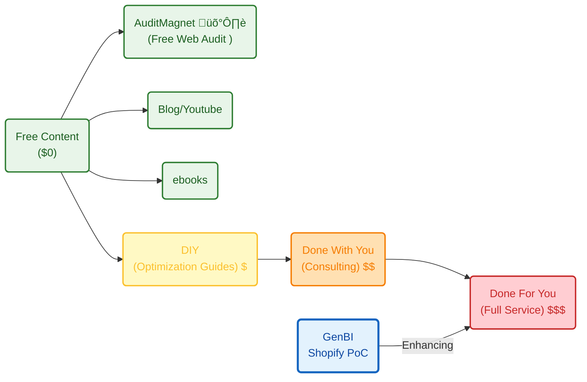

**TL;DR**


**Intro**


When I said to people to try things, is because I started with:


  
  


And then, Im working towards this: *the landing was tinkered [here](https://jalcocert.github.io/JAlcocerT/custom-analytics-for-shopify/) and ready at `.landing/`*


  


I admit it: *it was not part of a master plan*.

Im just embracing the chaos of my journey.

And as crazy as it sounds, this *(shopify*) relates with https://www.shopify.com/news/david-heinemeier-hansson-board

The same person who races, is a director and [ships omarchy](https://jalcocert.github.io/JAlcocerT/selfhosted-apps-december-2025/#omarchy).


## Connecting to Ecommerce BackEnd

### Shopify

I made here the landing before having the product and the clients.

```sh
git clone https://github.com/JAlcocerT/poc_shopify
cd poc_shopify/landing
#make help
```

<!-- https://youtu.be/Wf0uwVaNnQ4 -->



All vibe coded, [see](https://www.youtube.com/watch?v=eCvZxjSw6rE).

Crazy.

Now, lets continue with [the core analytics](https://jalcocert.github.io/JAlcocerT/custom-analytics-for-shopify/#the-core-analytics) part.

The logic initiated here: `https://github.com/JAlcocerT/langchain-db-ui/Z_PGSQL-GenBI` and waiting to be continued `here`


### OSS Selfhosted ecommerce

As covered recently [here](https://jalcocert.github.io/JAlcocerT/how-about-selfhosting-an-ecommerce), you can also run your online shop by choosing one of the selfhostable ecommerce.

Connecting with these ones is more similar to the extraction of insights from pgsql that got initiated here.

---

## Conclusions


---

## FAQ

### How is this been shaped?

This was all initiated with this BRD, around this tech stack, with this sales perspective and with this

The place in the value ladder:



The unit economics:

