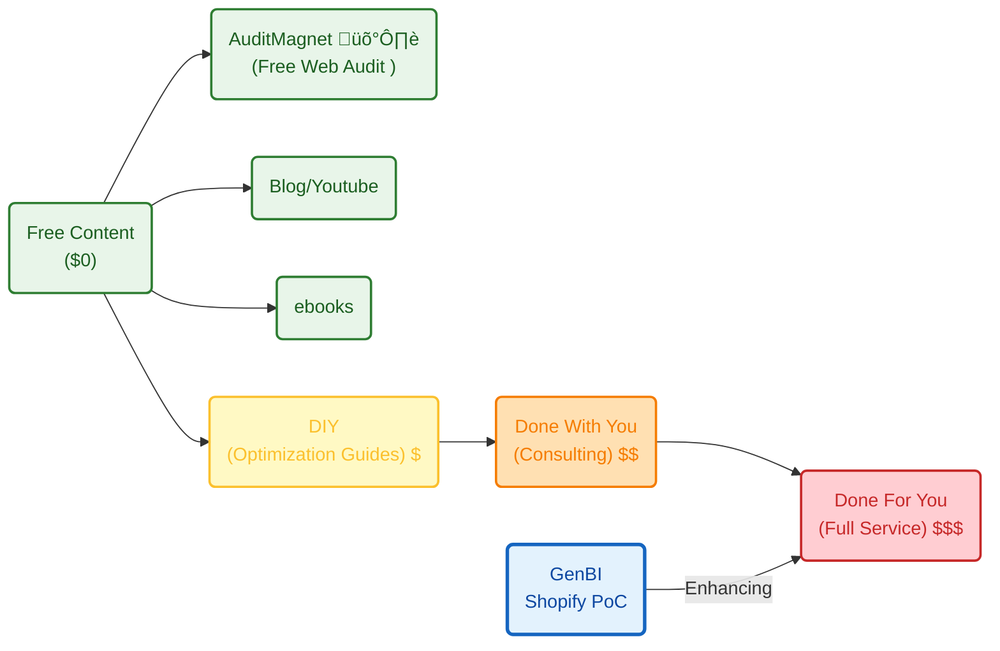

**TL;DR**


+++ Uptime [Status for my new services](#how-about-uptime)


**Intro**


When I said to people to try things, is because I started with:


  
  


And then, Im working towards this: *the landing was tinkered [here](https://jalcocert.github.io/JAlcocerT/custom-analytics-for-shopify/) and ready at `.landing/`*


  


I admit it: *it was not part of a master plan*.

Im just embracing the chaos of my journey.

And as crazy as it sounds, this *(shopify*) relates with https://www.shopify.com/news/david-heinemeier-hansson-board

The same person who races, is a director and [ships omarchy](https://jalcocert.github.io/JAlcocerT/selfhosted-apps-december-2025/#omarchy).


## Connecting to Ecommerce BackEnd

### Shopify

I made here the landing before having the product and the clients.

```sh
git clone https://github.com/JAlcocerT/poc_shopify
cd poc_shopify/landing
#make help
```

> The Related: BRD, tech stack, dev phases, sales, more sales and landing psyc.


<!-- https://youtu.be/Wf0uwVaNnQ4 -->



All vibe coded, [see](https://www.youtube.com/watch?v=eCvZxjSw6rE).

Crazy.

Now, lets continue with [the core analytics](https://jalcocert.github.io/JAlcocerT/custom-analytics-for-shopify/#the-core-analytics) part.

The logic, initiated [here](https://jalcocert.github.io/JAlcocerT/custom-analytics-for-shopify/#the-core-analytics): `https://github.com/JAlcocerT/langchain-db-ui/Z_PGSQL-GenBI` and waiting to be continued `https://github.com/JAlcocerT/poc_shopify/`


#### Shopify API

As per their docs, this is going to be an adventure with GraphQL.


* `https://www.shopify.com/`
* `https://shopify.dev/docs`
* `https://apps.shopify.com/`
* `https://shopify.dev/changelog`


### OSS Selfhosted ecommerce

As covered recently [here](https://jalcocert.github.io/JAlcocerT/how-about-selfhosting-an-ecommerce), you can also run your online shop by choosing one of the selfhostable ecommerce.

Connecting with these ones is more similar to the extraction of insights from pgsql that got initiated here.

For these, most likely, you are having some of these dbs as a companion of your container:


  
  



---

## Conclusions

People are doing similar *just not so cool* landings `https://genbi.co/home` so sth like `generativebi.pro` would not be crazy.

```sh
whois genbi.co | grep -i -E "(creation|created|registered)"
```

### The Attraction and Conversion

Conversion driven via landing:

```sh
git clone https://github.com/JAlcocerT/poc_shopify
cd poc_shopify/landing
#make help
#docker builder prune	
```

### The Delivery

A backend plugged to the landing that we have created on [this post](https://jalcocert.github.io/JAlcocerT).

It needs manual on boarding, not focusing on automated on boarding.

First finding prospects is a priority.

Same as finding people interested in a tech talk is more important than doing a tech talk to an empty room

### D&A Articles

Ive consolidated and improved the D&A tech stack around the experience and clients ive had at [these **curated articles**](https://www.jalcocertech.com/support/articles/).


They might [sound familiar](https://jalcocert.github.io/JAlcocerT/big-data-tools-for-data-analytics/#big-data-tech-stacks), but with another tone.


  



From Telecom, to FMCG, Healthcare...

...and ecommerce also coming.


---

## FAQ

### How is this been shaped?

This was all initiated with this BRD, around this tech stack, with this sales perspective, with this psyc engagement and such ~~[4weeks](https://jalcocert.github.io/JAlcocerT/ideas-and-opportunities-health-check/#the-4-week-launchpad-checklist)~~ 7-days Launchpad Checklist.

The place in the value ladder:



The unit economics:


### How about UpTime?

1. https://webaudit.jalcocertech.com/

2. https://genbi.jalcocertech.com/

3. https://realestate.jalcocertech.com/

4. https://slubnechwile.com/