**TL;DR**

Building an engine for DFY services.


  


+++ About [COO](#whats-a-coo) and [business efficiency](#about-business-efficiency)

**Intro**

There are ~2M shopify stores.

There is a common database schema for all of them.

There is a way to do Generative BI to improve a business.

You see what's this post is all about, right?

If you dont, some people do and build `https://www.onesight.ai/pricing`


  
  


PS: I didnt wake up with this idea by chance

We are coming from:

3. The [Custom GenBI Post](https://jalcocert.github.io/JAlcocerT/creating-a-generative-bi-solution/) with: WrenAI, Rill, and BAML x Vite...
2. [Querying pgsql via BAML](https://jalcocert.github.io/JAlcocerT/using-baml-to-query-a-database)
1. [PnP D&A with langchain x pgsql](https://jalcocert.github.io/JAlcocerT/plug-and-play-data-analytics/)

From Rill, I got to know the RevenueOperations RevOps concept: *they have an interesting page `https://www.brabble.io/speaking`*

<!-- 
https://www.youtube.com/watch?v=j7F6bzszITk 
-->





  
  


## PoC Shopify

So far you can do web audits to shopify owners like `https://morecaknit.com`.

Plot twist, they wont score 100, but they sell and they dont want to change the website

Get over it.

What these people might want is to do more money with their ecommerce.

Lets build around that.

### Starting with the Landing

Every project should start with a landing and capturing leads.

Yea...product and no clients does not pay bills.



```sh
#git init && git add . && git commit -m "Initial commit: Starting shopify poc from langchain baml repo" && gh repo create poc_shopify --private --source=. --remote=origin --push
```

```md
1) when i do make dev it will be exposed to the local network not just localhost?
2) We need the (good looking as per the landing UI/X) t&c and privacy policy, which have to be created from separated markown files
3) can the footer content be also controlled by the site.md copy?
4) and can we do so that when we do npm run dev, I will be able to access it not only via localhost?

5) based on a docker-compose.prod.yml with such network and also env variables context?

networks:
  cloudflared_tunnel:
    external: true

add also the make comand like make-docker-prod-up


also, what could we do so that we use to the max the above the fold section? lets brainstorm here

could we add 2 more examples of real profit covered in the landing?

also where would it make sense to put a video?

i like the concept that zoho has, where initially its an image, but when hit the video loads

should that go below the how it works?

as i dont want to hos tthe video, could we start this youtube video when hit?

I've added the Social Sharing Optimization to the plan! 📱✨

I'll update BaseLayout.astro to include Open Graph and Twitter Card meta tags. This ensures that when you share the link on WhatsApp, Telegram, or Twitter, it will automatically show:
```

Powered by Gemini 3 Flash this time :)



Guess what happened in ~45 minutes?

That I went to termix `http://192.168.1.2:8090/` and made `shopify-landing-prod:4321` go live via cloudflare tunnels.

```sh
git clone https://github.com/JAlcocerT/poc_shopify
cd poc_shopify/landing
#make help
#docker compose -f docker-compose.prod.yml up -d --build
make prod-up
```

I placed this at `genbi.jalcocertech.com` for now.

These projects wont only bring [the brd](https://github.com/JAlcocerT/poc_shopify/blob/master/z-brd.md), [clarifications](https://github.com/JAlcocerT/poc_shopify/blob/master/clarification.md) and [dev phases](https://github.com/JAlcocerT/poc_shopify/blob/master/z-development-phases.md). 

The [tech stack](https://github.com/JAlcocerT/poc_shopify/blob/master/landing/tech-stack.md) and how the amazing [UI/X forms](https://github.com/JAlcocerT/poc_shopify/blob/master/landing/z-form-tech.md) as well, with [its psyc](https://github.com/JAlcocerT/poc_shopify/blob/master/landing/z-form-psychology.md).

The [video section](https://github.com/JAlcocerT/poc_shopify/blob/master/landing/z-atf-changes.md) was so beautiful.

But also the relation with [the value ladder and **business strategy**](https://github.com/JAlcocerT/poc_shopify/blob/master/landing/business-strategy.md).

That I got a place to tweak the copy at `/src/content/landing/index.md`


| Requirement | Specification | Clarification / Decision |
| :--- | :--- | :--- |
| **Frontend Framework** | React (Astro/Vite) | Chosen for low latency and modern "Island" architecture. |
| **Styling/UI Library** | Tailwind CSS v4 + Framer Motion | Custom "Deep Night" **glassmorphism theme** for a premium look. |
| **Authentication** | Environment Secrets (`.env`) | Managed via local environment for isolated deployment. |
| **Deployment** | Docker | Containerized deployment for easy scaling and isolation. |

With a **custom modern form** and integration with a cal meeting, *for the qualified ones*:



Whether you are analyzing **Microsoft** or starting your own **Shopify store**, the logic is identical: Use **CapEx** and **OpEx** to drive **Volume and Price**, then use **Operational Discipline** to make sure that growth doesn't get "eaten" by the internal drains of the business.


<!-- 
https://youtu.be/eCvZxjSw6rE 
-->




#### Enabling Leads via Formbricks API

### The core analytics

The sauce of this comes from this [custom BI with BAMl and vite UI](https://jalcocert.github.io/JAlcocerT/creating-a-generative-bi-solution/#building).


  


### Who is this for?

How to use this PoC with some sense?

**Strategic Shift:**

Use the Web Audit for SMBs who aren't ready for data integration yet (Consulting).

Reserve **Audit Pro** for Shopify owners with >$10k revenue to feed your high-ticket **Performance Analytics DFY** model.

> [!TIP]
> **AuditPro** isn't just a landing page; it's a Dis/**Qualification Filter** that protects your time (L3/L4) by ensuring only stores with >$10k revenue (where the 20% success fee is meaningful) get through to your calendar.

---

## Conclusions

There are many efficiencies to be taken of when you run a business.



Have a small team and constrain resources is not an excuse anymore to get your operations improving.

`shopify-landing-prod:`


  
  


```sh
git clone https://github.com/JAlcocerT/poc_shopify
cd poc_shopify/landing
#make help
```

Ready to have an **agentic [COO](#whats-a-coo) working for you?


  
  


With this one, its some kind of...*productizing my services*.

```mermaid
flowchart LR
    %% --- Styles ---
    classDef free fill:#E8F5E9,stroke:#2E7D32,stroke-width:2px,color:#1B5E20;
    classDef low fill:#FFF9C4,stroke:#FBC02D,stroke-width:2px,color:#FBC02D;
    classDef mid fill:#FFE0B2,stroke:#F57C00,stroke-width:2px,color:#F57C00;
    classDef high fill:#FFCDD2,stroke:#C62828,stroke-width:2px,color:#C62828;
    classDef bridge fill:#E3F2FD,stroke:#1565C0,stroke-width:3px,color:#0D47A1;

    subgraph "Phase 1: Attraction"
        L0("Free Content (Blog/YT/eBooks)"):::free
    end

    subgraph "Phase 2: The Audit Magnets"
        L1_Web("Web/UI Audit 🛡️<br/>(Find UX Leaks)"):::free
        AP_Pro("AuditPro Landing 🚀<br/>(Find Profit Leaks)"):::bridge
    end

    subgraph "Phase 3: Service Tiers"
        L2("DIY Guides ($)"):::low
        L3("Consulting (DWY) $$<br/>(Web Optimization)"):::mid
        L4("Full Service (DFY) $$$<br/>(Data Analytics / Success Fee)"):::high
    end

    %% --- Connections ---
    L0 --> L1_Web
    L0 --> AP_Pro
    
    L1_Web --> L2
    L1_Web --> L3
    
    AP_Pro --> L4
    
    %% Cross-sell
    L3 -.-> |"Upsell"| L4
```



Are you even having a pricing strategy that works?


Ok, ok.

Thats more for SaaS.

How about this for an ecommerce?


To tie everything together, we’ll look at how different business models prioritize different parts of that formula.

I have added a **Shopify E-commerce** model (like a brand selling coffee or apparel) to show how it differs from a pure SaaS or a giant like Walmart.

### Comparison Table: Strategic Levers & Optimization

Because each game, is a different game:

| Business Model | Primary Lever | Target Metric | Key Point to Optimize |
| --- | --- | --- | --- |
| **Hermès** | **Price ()** | Gross Margin | **Scarcity & Desirability:** Keeping  low to keep  and  extremely high. |
| **P&G** | **Volume ()** | Operating Efficiency | **Marketing ROI:** Ensuring every dollar of ad spend (OpEx) generates maximum  to spread fixed factory costs. |
| **Walmart** | **Volume ()** | Asset Turnover | **Logistics Cost:** Shaving pennies off COGS through massive supply chain scale to survive on thin margins. |
| **Microsoft** | **Price & Scale** | Op. Efficiency | **Product R&D:** Spending on OpEx today to create software that can scale to millions with near-zero marginal cost. |
| **Shopify E-comm** | **Volume ()** | Gross Margin | **Return Rate & Shipping:** Optimizing "Reverse Logistics" and COGS to protect the margin from being eaten by shipping costs. |
| **1-Person SaaS** | **Efficiency ()** | Net Margin | **LTV/CAC Ratio:** Automating everything so that high marketing spend (OpEx) is the *only* major cost. |

---

### The Shopify E-commerce Example

An e-commerce brand running on Shopify (e.g., selling premium coffee beans) is a hybrid. 

Unlike SaaS, it has physical goods (high COGS), and unlike Walmart, it doesn't have its own trucks (high shipping/OpEx).

#### **The Flow ($100 Bag of Coffee Example)**

1. **Price ():** $100.
2. **Gross Margin ():** **60% ()**. After the coffee beans, packaging, and the "Shopify Fee" (which is a COGS), you have $60 left.
3. **Operating Efficiency ():** **30% ()**. Here is the struggle:
* You spend $30 on Meta Ads to get one customer (Marketing).
* You spend $12 on shipping and warehouse labor (Fulfillment).
* You have $18 left (EBITDA).
* Your  is .

4. **Interest/Tax:** Standard ratios (~0.80).

**Net Profit per Unit:** 

---

### The "Levers" in Action

If you are the COO of that Shopify store, you have three choices to grow your **Net Profit ()**:

* **Option 1 (The P Lever):** Raise the price of coffee to $110. If  stays the same, your  jumps, and almost all that extra $10 falls to the bottom line.
* **Option 2 (The GM Lever):** Find a cheaper bean supplier. This lowers COGS and increases the "survival rate" of your revenue.
* **Option 3 (The OE Lever):** Improve your email marketing so customers buy twice (Retention). This increases  without paying for a new ad (), making your **Operating Efficiency** skyrocket.

Summary: The COO's Dashboard

Every business is just a different configuration of the same formula.

* **High-margin** businesses (SaaS, Hermes) focus on **Protecting the Filter** (Price/Brand).
* **Low-margin** businesses (Walmart, Shopify) focus on **Increasing the Flow** (Volume/Speed).

Every department, is mapped to a specific variable in the fulls tack formula.


This final mapping connects the abstract math to the living, breathing departments of a company. 

It shows exactly which "lever" each team is responsible for in the master formula.

### The Master Cheat Sheet: Department vs. Variable

| Variable | Department(s) Responsible | What they do to optimize the formula |
| --- | --- | --- |
| ** (Price)** | **Product / R&D** | Build features that make the product "unmissable" (allowing for higher prices). |
|  | **Brand Marketing** | Create the "aura" of prestige so customers pay a premium (Hermès style). |
| ** (Volume)** | **Growth Marketing** | Spend on ads and SEO to bring traffic to the "top of the funnel." |
|  | **Sales** | Convert leads into paying customers to ensure the "flow" is high. |
| ** (Gross Margin)** | **Factory / Production** | Reduce scrap material and labor time per unit. |
|  | **Procurement** | Negotiate better deals with raw material suppliers to lower COGS. |
| ** (Op. Efficiency)** | **COO / Operations** | Streamline the supply chain and automate fulfillment. |
|  | **HR / Admin** | Manage "corporate bloat" (ensure headcount doesn't grow faster than revenue). |
| ** (Interest Burden)** | **Finance / CFO** | Refinance debt at lower rates or pay off loans to stop profit leakage to banks. |
| ** (Tax Burden)** | **Tax / Legal** | Use legal tax credits, R&D incentives, and global structures to keep more profit. |

---

### Where does the "Indie Hacker" fit?

The **Indie Hacker** (the 1-person SaaS or solo-founder) is a unique configuration because **one person is every department.** Their strategy is usually **"High-Margin / Low-Friction."**

#### **The Indie Hacker Strategy: Protecting the Filter**

Like Hermès or Microsoft, the Indie Hacker lives and dies by **Protecting the Filter ( and )**.

1. **Eliminating the Drains:** They have no HR or Admin costs. Because they don't have a factory, their  is naturally high (~90%).
2. **The "Leverage" Focus:** Instead of hiring people to increase **Volume ()**, they use **Code** and **Content**.
* If they want more , they build a viral feature (Product/R&D).
* If they want better , they use AI to handle customer support instead of a human.


**In the "Flow vs. Filter" world:**
The Indie Hacker is almost always a **Filter** business. They don't have the logistics power to compete with the **Flow** (Walmart). They succeed by finding a niche where they can charge a high  for a specialized product with zero production costs.

---

### Summary of the "Business Configurations"

| Strategy | Focus Variable | Primary Goal |
| --- | --- | --- |
| **High-Margin (Filter)** | **Price ()** | Make the product so good/rare that the "Filter" stays wide open. |
| **Low-Margin (Flow)** | **Volume ()** | Force so much water (Revenue) through the funnel that even a "Tight Filter" yields a lot of profit. |
| **Indie Hacker (Efficiency)** | **Op. Efficiency ()** | Keep the "Internal Drains" at zero so every dollar of revenue stays in their pocket. |

---

### Final "CEO Decision" Tip

Whenever you are faced with a business problem, ask: **"Which letter in the formula am I trying to fix?"**

* If you hire a new salesperson, you are betting on ****.
* If you buy a new robot for the factory, you are betting on ****.
* If you raise your monthly subscription price, you are betting on ****.

**Would you like me to create a "Sensitivity Table" that shows exactly how a 1% improvement in each of these variables impacts the final Net Profit?**

---

## FAQ

### Whats a COO?

There are many unknowns behind executive decisions on a business:


But just understand that the operations is part of them.

How do you plan to grow, how do you plan to optimize?


COGS Split: Includes everything "touching" the product before it is finished (Steel, factory electricity, assembly line wages).

    OpEx Split: Includes everything "selling or managing" the product (Google Ads, Sales commissions, CEO's salary, office rent).

    CapEx Split: This is the "Big Iron." It’s the money spent today to build the factory that will lower your COGS tomorrow through better efficiency.

    COGS (Cost of Goods Sold) and OpEx (Operating Expenses) are actually the "killers" of your margins.

    COGS is what eats your Revenue to leave you with Gross Margin.

    OpEx is what eats your Gross Profit to leave you with Operating Margin (EBITDA).

Where does CapEx sit?

CapEx (Capital Expenditure) is unique because it does not appear on the Income Statement immediately.

    When you spend on CapEx (e.g., buying a factory), the cash leaves the company, but it is recorded as an Asset on the Balance Sheet.

    It then "leaks" into the Income Statement slowly over years via Depreciation.

    Therefore, CapEx is the source of the Depreciation & Amortization (D&A) that sits between EBITDA and EBIT.


To add **Price** and **Volume** to our multiplication string, we have to move one step "above" the margins and look at how **Revenue** itself is constructed.

In this expanded view, we start with your "Market Potential" and multiply all the way down to the "Net Profit."

### The "Full Stack" Growth & Profit Formula

Where:

* ** (Volume):** Units sold (The "Scale" lever).
* ** (Price):** Average Selling Price (The "Value" lever).
* **GM (Gross Margin):** Survival rate after Factory/Production.
* **OE (Operating Efficiency):** Survival rate after Marketing/Admin.
* **IB (Interest Burden):** Survival rate after Debt payments.
* **TB (Tax Burden):** Survival rate after Taxes.

---

### How Price and Volume "Interact" with the Margins

This is the most nuanced part: **Price and Volume are not independent variables.** They have a "tug-of-war" effect on your margins.

#### **1. The Price () Lever**

If you increase  by 10%:

* **Revenue:** Increases 10%.
* **Gross Margin ():** Increases **more than 10%** (because your COGS per unit stayed the same while the top line grew).
* **Operating Efficiency ():** Improves (your marketing spend now looks smaller relative to the higher revenue).

#### **2. The Volume () Lever**

If you increase  by 10%:

* **Revenue:** Increases 10%.
* **Gross Margin ():** Improves slightly (due to **Fixed Cost Absorption** in the factory).
* **Operating Efficiency ():** Might **Decrease** (because you might have had to spend significantly more on marketing or sales commissions to get that extra volume).

---

### Detailed Granularity: The "Unit" Perspective

If you want to see exactly how one single unit contributes to the final net profit, the formula looks like this:

| Step | Component | Formula | Impact of Price/Volume |
| --- | --- | --- | --- |
| **1** | **Unit Revenue** |  | Higher  = higher starting point. |
| **2** | **Unit Gross Profit** |  | Higher  "shrinks" the Fixed COGS per unit. |
| **3** | **Unit Operating Profit** |  | Higher  "shrinks" the HQ/Rent cost per unit. |
| **4** | **Unit Net Profit** |  | Final amount that goes into the bank. |

---

### Real-World Example: The "P&G vs. Hermès" Strategy

* **P&G Strategy (Volume Focus):** They accept a lower  to maximize . They rely on the fact that selling 1 billion units will make their **Fixed COGS** and **OpEx** per unit almost zero through massive scale.
* **Hermès Strategy (Price Focus):** They intentionally limit  (scarcity) to maximize . They don't care about "Fixed Cost Absorption" because their  is so high it covers all costs 10 times over.

### Summary: The COO's "Golden Ratio"

A COO's ultimate goal is to find the **Price/Volume Sweet Spot** where:

1. Price is high enough to protect the **Gross Margin**.
2. Volume is high enough to "dilute" the **Fixed Operating Costs**.

**Would you like to see a "Unit Economics" breakdown for a specific product—for example, how many bars of soap P&G has to sell to pay for one $30 million Super Bowl ad?**

Exactly. You have just described the **Growth Engine** of the company.

When a COO and CEO decide to spend money on **Operating Expenses** (OpEx), they aren't just "paying bills"—they are making an investment to shift the demand curve. Here is the specific logic for how those two expenses (Marketing and Product Refinement) affect  (Price) and  (Volume):

---

### 1. Product Refinement (The "Quality" Lever)

This usually lives in **R&D** or **Product Development** costs.

* **Impact on  (Pricing Power):** By making the product better, more durable, or more unique, you make it "inelastic." This means customers are willing to pay a premium, allowing you to **raise ** without losing people.
* **Impact on  (Retention/Expansion):** A better product reduces "churn" (customers leaving) and increases word-of-mouth. This naturally **increases ** because your "leaky bucket" is fixed.
* **The Goal:** To create **Differentiation**. If your product is "best in class," you don't have to compete on price.

### 2. Marketing & Sales (The "Awareness" Lever)

This lives in **Selling & Marketing** costs.

* **Impact on  (Market Share):** This is the primary goal of marketing. By spending on ads and sales teams, you are "buying" more customers, which **drives  up**.
* **Impact on  (Brand Equity):** High-end marketing (like Apple or Hermès) creates a "brand halo." This allows the company to **maintain a high ** even when competitors are cheaper.
* **The Goal:** To create **Customer Acquisition**.

---

### The COO’s "ROI" Calculation

The COO looks at these expenses and asks: *"If I spend $1 million extra in OpEx, do I get more than $1 million back in Gross Profit from the new Price and Volume?"*

#### **Scenario A: Successful Investment**

* **Action:** You spend **$1M** on a new feature (Product Refinement).
* **Result:** You can now charge **$10 more** per unit ().
* **Math:** You sell 200,000 units. That’s **$2M** in extra Gross Profit.
* **Outcome:** Your **Operating Margin increases** because the $2M gain outpaced the $1M cost.

#### **Scenario B: The "Commodity Trap" (Unsuccessful)**

* **Action:** You spend **$1M** on generic ads.
* **Result:** You get more customers (), but you had to **discount the price** () to get them.
* **Outcome:** Your **Operating Margin stays flat or drops** because the cost of the marketing "ate" all the new profit.

---

### The Full Integrated Formula (The "CEO's Dashboard")

### Summary Table: OpEx as a Strategic Tool

| Expense Type | Primary Target | Final Goal |
| --- | --- | --- |
| **Product R&D** | **Price ()** | Higher "Unit Value" (Quality) |
| **Marketing** | **Volume ()** | Higher "Market Reach" (Awareness) |
| **COO Ops** | **Margin ()** | Higher "Process Efficiency" (Cost) |

**Would you like to see how this looks for a "SaaS" company (like Microsoft/Adobe) vs. a "Physical" company? They use these levers very differently.**

To add **Price** and **Volume** to our multiplication string, we have to move one step "above" the margins and look at how **Revenue** itself is constructed.

In this expanded view, we start with your "Market Potential" and multiply all the way down to the "Net Profit."

### The "Full Stack" Growth & Profit Formula

Where:

* ** (Volume):** Units sold (The "Scale" lever).
* ** (Price):** Average Selling Price (The "Value" lever).
* **GM (Gross Margin):** Survival rate after Factory/Production.
* **OE (Operating Efficiency):** Survival rate after Marketing/Admin.
* **IB (Interest Burden):** Survival rate after Debt payments.
* **TB (Tax Burden):** Survival rate after Taxes.

---

### How Price and Volume "Interact" with the Margins

This is the most nuanced part: **Price and Volume are not independent variables.** They have a "tug-of-war" effect on your margins.

#### **1. The Price () Lever**

If you increase  by 10%:

* **Revenue:** Increases 10%.
* **Gross Margin ():** Increases **more than 10%** (because your COGS per unit stayed the same while the top line grew).
* **Operating Efficiency ():** Improves (your marketing spend now looks smaller relative to the higher revenue).

#### **2. The Volume () Lever**

If you increase  by 10%:

* **Revenue:** Increases 10%.
* **Gross Margin ():** Improves slightly (due to **Fixed Cost Absorption** in the factory).
* **Operating Efficiency ():** Might **Decrease** (because you might have had to spend significantly more on marketing or sales commissions to get that extra volume).

---

### Detailed Granularity: The "Unit" Perspective

If you want to see exactly how one single unit contributes to the final net profit, the formula looks like this:

| Step | Component | Formula | Impact of Price/Volume |
| --- | --- | --- | --- |
| **1** | **Unit Revenue** |  | Higher  = higher starting point. |
| **2** | **Unit Gross Profit** |  | Higher  "shrinks" the Fixed COGS per unit. |
| **3** | **Unit Operating Profit** |  | Higher  "shrinks" the HQ/Rent cost per unit. |
| **4** | **Unit Net Profit** |  | Final amount that goes into the bank. |

---

### Real-World Example: The "P&G vs. Hermès" Strategy

* **P&G Strategy (Volume Focus):** They accept a lower  to maximize . They rely on the fact that selling 1 billion units will make their **Fixed COGS** and **OpEx** per unit almost zero through massive scale.
* **Hermès Strategy (Price Focus):** They intentionally limit  (scarcity) to maximize . They don't care about "Fixed Cost Absorption" because their  is so high it covers all costs 10 times over.

### Summary: The COO's "Golden Ratio"

A COO's ultimate goal is to find the **Price/Volume Sweet Spot** where:

1. Price is high enough to protect the **Gross Margin**.
2. Volume is high enough to "dilute" the **Fixed Operating Costs**.

**Would you like to see a "Unit Economics" breakdown for a specific product—for example, how many bars of soap P&G has to sell to pay for one $30 million Super Bowl ad?**

Yes, you have hit the most critical lever in business strategy. **Gross Margin** is the only margin that is directly "attacked" or "boosted" by your pricing decisions and your sales volume.

In finance, we call this the **PVM Analysis** (Price, Volume, and Mix). Here is exactly how those two forces change your Gross Margin:

### 1. The Price Effect (The "Pure" Margin Mover)

Price is the most powerful variable in the entire multiplication string because it has a **1:1 impact** on profit.

* **If you raise prices:** Every extra dollar goes straight to Gross Profit without adding any cost. Your Gross Margin % increases instantly.
* **If you discount:** Your Revenue drops, but your Costs (COGS) stay the same. This "squeezes" the margin from the top.
* **The Hermes Example:** Because Hermes has "pricing power," they can raise the price of a Birkin bag by 10% without their leather or labor costs changing much. Their Gross Margin expands purely through price.

---

### 2. The Volume Effect (The "Scale" Mover)

This is where the **COO’s factory efficiency** meets the **Sales team’s performance**. Volume affects Gross Margin through something called **Fixed Cost Absorption**.

Inside your factory (COGS), you have two types of costs:

* **Variable Costs:** (Leather, wood, hourly wages). These stay the same *per unit* regardless of volume.
* **Fixed Costs:** (Factory rent, machinery depreciation, supervisor salaries). These stay the same *in total* regardless of volume.

**The Logic:**
If your factory rent is  a month:

* If you sell **1,000 units**, each unit "carries" **** of rent.
* If you sell **10,000 units**, each unit "carries" only **** of rent.

> **Result:** By increasing **Volume**, you "dilute" your fixed costs, which lowers your cost per unit and **increases your Gross Margin %**.

---

### 3. The "Mix" Effect (The Silent Killer)

Since you asked about companies like **P&G**, "Mix" is vital. P&G sells hundreds of products.

* **High Margin:** Face creams (SK-II).
* **Low Margin:** Dish soap (Dawn).
* **The Impact:** Even if your total Sales Volume stays the same, if you sell more soap and less face cream this month, your **overall Gross Margin % will drop**.

---

### Summary: Price vs. Volume in the Formula

| Change | Impact on Gross Margin % | Why? |
| --- | --- | --- |
| **Price Increase** | **High Increase** | Pure profit; no extra cost attached. |
| **Price Discount** | **High Decrease** | Revenue falls; factory costs remain. |
| **Volume Increase** | **Moderate Increase** | Spreads fixed factory costs over more units. |
| **Volume Decrease** | **Moderate Decrease** | Each unit becomes more expensive to make. |

### The "COO's Dilemma"

A COO often has to choose:

1. **Lower the Price** to drive **Volume** (hoping the "Fixed Cost Absorption" makes up for the lower price).
2. **Hold the Price** and accept **Lower Volume** (relying on "Brand Prestige" to keep margins high).

**Would you like to see a quick calculation of how many more units a company like P&G has to sell to break even if they offer a 10% discount?**

This is where the theory gets exciting. By looking at these four companies, you can see how different "business models" prioritize different parts of the multiplication string.

I’ve used estimated data for **2024/2025** to show you the "Survival Rates" for each company.

---

### The Grand Multiplication Table (Est. 2024/2025)

| Company | Gross Margin (Factory/Product) | Op. Efficiency (Mktg/Sales/Admin) | Interest Burden (Financial) | Tax Burden (Legal) | **Final Net Margin** |
| --- | --- | --- | --- | --- | --- |
| **Hermès** | 70% | 58% | 1.04* | 71% | **~30%** |
| **P&G** | 51% | 45% | 96% | 75% | **~17%** |
| **Hess Midstream** | 78% | 85% | 73% | 77% | **~37%** |
| **Realty Income** | 90% | 20% | 45% | 98% | **~8%** |

**Note: Hermès has so much cash that their "Interest Burden" is over 1.0 because they earn more interest on their cash than they pay on debt.*

---

### Granular Breakdown by Company Strategy

#### **1. Hermès: The "Pricing Power" King**

* **Gross Margin (70%):** This is incredibly high. It means it only costs them about 30 cents (materials and "petits mains" labor) to make a dollar of product.
* **Op. Efficiency (58%):** They don't spend much on traditional marketing. Most of this goes to their beautiful stores and elite staff.
* **The Result:** Because they start so high at the "Factory" level, they can afford a luxurious HQ and still keep 30 cents of every dollar.

#### **2. P&G: The "Marketing Machine"**

* **Gross Margin (51%):** It costs a lot to make soap and diapers. This is where the **COO** focuses on factory automation.
* **Op. Efficiency (45%):** Notice this is lower than Hermès. P&G spends **billions** on ads. Only 45% of their Gross Profit "survives" the marketing and sales departments.
* **The Result:** They are a volume business. They accept a lower net margin (~17%) because they sell to billions of people.

#### **3. Hess Midstream (HESM): The "Infrastructure" Model**

* **Gross Margin (78%):** Once the pipes are in the ground, they are very cheap to run.
* **Op. Efficiency (85%):** Very high! They don't need a huge marketing team to "convince" oil to flow through a pipe.
* **Interest Burden (73%):** Here is the "leak." Infrastructure is built with debt. The bank takes 27% of their profit before it gets to the shareholders.

#### **4. Realty Income (O): The "Real Estate" Model**

* **Gross Margin (90%):** They just collect rent. There is almost no "production cost."
* **Op. Efficiency (20%):** **Wait, what?** In Real Estate, "Depreciation" is a massive non-cash expense that lives in the operating line. It looks like a "leak," but it’s actually a tax shield.
* **Interest Burden (45%):** They use massive debt to buy buildings. The bank is their biggest partner, taking 55% of the operating profit.

---

Summary: What to watch for

* If **Hermès** has a "Gross Margin Drop," it means they lost their **Brand Prestige** (they can't charge enough).
* If **P&G** has an "Op. Efficiency Drop," it means their **Marketing** isn't working anymore.
* If **Hess Midstream** has an "Interest Burden Drop," it means **Interest Rates** are rising and hurting their debt-heavy model.

**Would you like me to create a "What-If" scenario for one of these? For example, seeing how much P&G's net profit would jump if they cut marketing by just 5%?**

This comparison is fascinating because it shows three completely different "engines" of profitability. By looking at **Walmart** (High Volume), **Microsoft** (High Scalability), and a **Solopreneur SaaS** (High Efficiency), we see how the multiplication string shifts.

### The Grand Multiplication Table (Est. 2024/2025)

| Company | Gross Margin (Product/COGS) | Op. Efficiency (OpEx/EBITDA) | Interest Burden (Financial) | Tax Burden (Legal) | **Final Net Margin** |
| --- | --- | --- | --- | --- | --- |
| **Walmart** | 24% | 18% | 85% | 75% | **~3%** |
| **Microsoft** | 70% | 65% | 100%* | 81% | **~35%** |
| **SaaS (1 Person)** | 90% | 70% | 100% | 85% | **~50%** |

**Note: Microsoft has massive cash reserves, so interest expenses are often offset by interest income.*

---

### 1. Walmart: The "Pennies" Strategy

Walmart is the ultimate **Volume** player. Their strategy is to keep  (Price) as low as possible to drive  (Volume) to the moon.

* **Gross Margin (24%):** This is very low. After paying for the milk, toys, and electronics (COGS), they only have 24 cents left.
* **Op. Efficiency (18%):** Their OpEx (Store staff, electricity, logistics) eats almost everything else. Only about 4% of total revenue survives as Operating Profit.
* **The Logic:** Walmart doesn't care about a high % margin; they care about **Inventory Turnover**. If they make 3% on a dollar, but they "turn" that dollar 10 times a year, they are incredibly wealthy.

### 2. Microsoft: The "Scalability" Strategy

Microsoft is a "Software" engine. Once the code is written (CapEx/R&D), it costs almost nothing to sell it to the next billion people.

* **Gross Margin (70%):** Their COGS is mostly server costs (Azure) and some hardware. 70 cents of every dollar is "free" profit.
* **Op. Efficiency (65%):** Even with thousands of developers and massive marketing, their **Volume** is so high that they "dilute" their fixed OpEx. They keep a massive 65% of their Gross Profit as EBITDA.
* **The Logic:** High  + Extreme  = Massive Net Margin.

### 3. SaaS Agency (1 Person): The "Efficiency" Strategy

Think of a single developer running a small tool (like a PDF converter or a niche AI bot).

* **Gross Margin (90%):** The only COGS is the hosting bill (AWS/Vercel) and maybe an API fee (OpenAI). 90% of the money is theirs.
* **Op. Efficiency (70%):** This is where it gets interesting. They have no "Staff" (Admin), but they must spend on **Marketing (OpEx)** to get customers (). If they stop spending on ads, their  drops.
* **The Logic:** This model has the highest **Net Margin** (~50%), but it lacks **Scale**. Microsoft can make 35% on $250 Billion; the 1-person SaaS makes 50% on $200,000.

---

### Comparison of the "Levers"

| Component | Walmart | Microsoft | SaaS (1 Person) |
| --- | --- | --- | --- |
| **Main Lever** | **Volume ()** | **Price () & Scale** | **Efficiency (Low OpEx)** |
| **Biggest Cost** | Inventory (COGS) | R&D & Salaries (OpEx) | Marketing / Ads (OpEx) |
| **CapEx Role** | Massive (Warehouses) | High (Data Centers) | Low (A Laptop) |

### Why the 1-Person SaaS is "Fragile"

Notice that the **Solopreneur** has a huge Net Margin, but if their "Marketing Efficiency" (CAC) doubles, their profit can vanish instantly. 

**Walmart**, however, is protected by its sheer size; even if their costs go up, their "Supply Chain" (Gross Margin) is so optimized that they can survive on "thinner air" than anyone else.


### About Business Efficiency

This relates closely with a business unit economics.


### Sample Indie Hacker Flow

To visualize a **Solopreneur SaaS**, think of it as a "High-Pressure Funnel." 

Because there is only one person, the costs are extremely low, but the reliance on **Marketing (OpEx)** to drive **Volume ()** is absolute.

Here is a sample flow for a niche AI-SaaS tool that sells a monthly subscription.

1. The Numbers: "The $100k Solo-Run"

* **Price ():** $20/month
* **Volume ():** 500 active users (Monthly Revenue = $10,000)
* **Annual Revenue:** $120,000

2. The Multiplication String

| Stage | Math Factor | Value | The "Why" |
| --- | --- | --- | --- |
| **Gross Margin** | **Survival: 95%** |  | **COGS:** Hosting ($300) + AI API fees ($200). Very little "factory" cost. |
| **Op. Efficiency** | **Survival: 60%** |  | **OpEx:** Google/Meta Ads ($3k) + Software tools ($500). Marketing is the biggest "leak." |
| **EBITDA** | **Cash Flow** | **$5,700/mo** | This is what the owner actually sees in the bank before taxes. |
| **Interest Burden** | **Survival: 100%** |  | No bank loans or debt. The solopreneur owns 100%. |
| **Tax Burden** | **Survival: 80%** |  | Self-employment tax and income tax (Est. 20%). |
| **Final Net** | **Total Result** | **$4,560/mo** | **Net Profit Margin: ~45%** |

3. The Flow Diagram (Mermaid)

This diagram shows how the owner's effort in **Marketing** is the "spark" that starts the entire engine.


4. Key Takeaways for the Solopreneur

**The "Supply Chain" is Digital:**

For this agency, the "Supply Chain" isn't ships and trucks; it is the **API connectivity**. If the AI provider (like OpenAI) raises their prices, the **Gross Margin** drops immediately. The COO (the same person!) must then decide to raise the **Price ()** to compensate.

**The OpEx is the "Fuel":**

In a 1-person SaaS, the **Operating Efficiency** is almost entirely dominated by **Marketing**. 

If the "Ad Cost per Click" goes up, the margin shrinks.

This is why solopreneurs focus on "Product Refinement" (R&D)—they want a product so good it sells via word-of-mouth (organic ), which eliminates the need for paid ads and skyrockets the Operating Margin.

**The CapEx is Zero:**

Unlike Walmart or Microsoft, the solopreneur usually has zero **CapEx**.

They don't buy buildings or servers. They "rent" them (OpEx).

This makes the business very "light" but also means they don't have many assets to sell if they want to exit.

**Would you like to see what happens to this flow if the solopreneur decides to scale to 5,000 users and has to hire a Customer Support person?**

To get the most granular view, we start with the "Top Line" (Units and Price) and apply each "Survival Rate" (the margins and burdens) until we reach the "Bottom Line."

The "Full Stack" Multiplicative Formula

If we define:

    V=Volume (Units Sold)

    P=Price (Average Selling Price)

    GM=Gross Margin Ratio(RevenueGross Profit​)

    OE=Operating Efficiency Ratio(Gross ProfitEBITDA​)

    IB=Interest Burden(EBITPre-tax Income​)

    TB=Tax Burden(Pre-tax IncomeNet Income​)

The formula for Net Profit (NP) is: NP=(V×P)×GM×OE×IB×TB

---

### Breaking Down the Math (Step-by-Step)

Each multiplication represents a "filter" in your business funnel. Using the **1-person SaaS** example (, ):

1. **Revenue Generation:** *(This is your starting total.)*
2. **Product Production (Gross Margin):** *(You lost 5% to the "Factory/API/Servers".)*
3. **Business Operation (Operating Efficiency):** *(You lost 40% of the remainder to "Marketing/Sales/Admin".)*
4. **Financial Structure (Interest Burden):** *(You lost 0% because you have no debt.)*
5. **Legal/State (Tax Burden):** *(The government took 20%, leaving you with the final Net Profit.)*

The Final "Unit Economics" Formula

If you want to know how much **Net Profit** you make **per unit sold**, you simply remove the Volume () from the start:

For the SaaS agency, every new user signed up at **$20** results in **$9.12** () in the owner's pocket after everyone else has been paid.

### Why this formula is powerful

It allows you to perform **Sensitivity Analysis**. You can ask:

* "What happens to Net Profit if I double my **Volume ()** but my **Operating Efficiency ()** drops to 0.30 because ads got more expensive?"
* "If I raise my **Price ()** by 10%, how much can my **Gross Margin ()** drop before I start losing money?"

**Would you like me to calculate a "Break-Even" scenario for this formula to see at what Volume () the profit becomes zero?**