**Tl;DR**

What it should have been the Real Estate project from its conception.


**Intro**

It all started with the QnA of streamlit over sample property data on `.md` files back in 2024.

Then, the chat with a DB via LangChain.


  
  


Then, Im talking about these series of RE related posts:

* https://jalcocert.github.io/JAlcocerT/real-estate-landing/

* https://jalcocert.github.io/JAlcocerT/flask-cms-for-ssgs/#real-estate
* https://jalcocert.github.io/JAlcocerT/making-flask-cms-for-ssg/#real-estate

* https://jalcocert.github.io/JAlcocerT/tinkering-with-reflex/#real-estate-with-reflex


* https://jalcocert.github.io/JAlcocerT/streamlit-is-cool/#streamlit-calculator-and-genai-re-agent


  
  



  
  


* https://jalcocert.github.io/JAlcocerT/python-real-estate-mortage-calculator/#french-amortization-101

 


  
  


* https://jalcocert.github.io/JAlcocerT/real-estate-website/


The **launch strategy**: *aka, focus strategy* was not defined at all, neither from my side, neither my client.

| Element | Decision |
| :--- | :--- |
| **One Avatar** | Real Estate Agencies|
| **One Product** | A conversion ready Landing and property layout|
| **One Channel** | Targetting via sales pipeline|

The **Tier of Service**: A clear, custom DFY

The **customer segmentation**: SMB

* Supply - DFY, finite *on demand basis*
* Demand - constrained *targeted users via APIFY google maps scrapping + cold emails / social media reach*

But it does not apply, as the goal of this is more closing a long chapter and making the **final RE learnings** with it.

The **tech stack**: *see more [below](#conclusions)*

| Component | Technology | Details |
|-----------|-----------|---------|
| **Frontend Framework** | **Astro** | Modern web framework with hybrid SSR/SSG capabilities |
| **Styling/UI** | **Vanilla CSS** | Custom CSS with CSS variables, no framework dependencies |
| **Charts/Visualization** | **Chart.js** | Interactive pie & bar charts for mortgage calculator |
| **[Backend](https://jalcocert.github.io/JAlcocerT/docs/dev/fe-vs-be/)** | **Astro API Routes** | Server-side endpoints for chat API (`/api/chat`) |
| **Database** | **File-based** | Markdown files in `src/content/` (Git-versioned, no database needed) |
| **[Authentication](https://jalcocert.github.io/JAlcocerT/docs/dev/authentication/)** | **HTTP Basic Auth** | Simple username/password protection for `/edit` routes (bcrypt hashed) |

> We will use Hybrid rendering (SSR for `/edit` & `/api` for the [bot](#about-rag-and-bots), SSG for public pages)

> > The [dream calculator section](#dream-calculator-x-chartjs) uses SSG + CSR for the calculations to happen in browser


  
  


As the why, what was very clear, its time to put together the final HOW: *see the brd and dev plan*

```md
# Project Name: [SaaS Name]

## 1. The Why (BRD)
- **Problem:** [Describe the pain point]
- **Value Prop:** [How I solve it]
- **Monetization:** [e.g., $9/mo Subscription via Stripe]

## 2. The What (PRD)
- **Primary User Flow:** Landing -> Auth -> Core Feature -> Payment.
- **V1 Features:** - [ ] Auth (Google/Email)
  - [ ] Feature A (The core value)
  - [ ] Settings (Billing/Delete account)

## 3. The How (FRD)
- **Stack:** T3 Stack (Next.js, Prisma, TRPC)
- **DB Schema:** - User: id, email, stripe_id
  - Data: id, user_id, content, timestamp
```


  
  




  
  



* https://jalcocert.github.io/JAlcocerT/buying-house-data-analytics/


  
  


* https://jalcocert.github.io/JAlcocerT/astro-web-setup/#real-estate-web---results



  
  



## Creating a Full Stack Real Estate SaaS

IF you agree that **value is subjective** (*yea, not everyone agrees!*), then you will agree that [Price is also subjective](https://jalcocert.github.io/JAlcocerT/real-estate-website/#pricing-strategy).

When you are building this kind of projects:

1. Make sure that you are not doing: cost+margin.
2. Or add a high enough ,active income' price tag, as this is one of those custom DFY solutions that you can't scale

These projects are providing much more value than a one time fee.

And if they dont - go find better clients who would get the real potential value out of it.

Now...**lets get started** with this one.




```sh
#git init && git add . && git commit -m "Initial commit: Starting astro real estate x OpenAI Chatbot" && gh repo create moi-realestate-pro-astro-bot --private --source=. --remote=origin --push
```



And antigravity made the magic happen:


### BoilerPlate 101

It has to be known frameworks.

Using newer ones [like Reflex](https://jalcocert.github.io/JAlcocerT/tinkering-with-reflex/#conclusions) or [Nuxt](https://jalcocert.github.io/JAlcocerT/real-estate-landing/#nuxt-for-real-estate) will cause your agents too much confussion.

And a lot of time wasted for you.

---

## Conclusions

Initially I thought about NextJS SaaS x PayLoad CMS vs DecapCMS.

Then, I just...**simplified via vibe coding** with a simple http basic auth instead of git based CMS like Decap, nor API ones like Directus or StrapiCMS.

I deployed to my x300 as seen on [this section](#dream-calculator-x-chartjs).


  


The app is deployed:

```sh
#sudo apt-get install dnsutils -y #dns resolution
nslookup dm-real-estate.com 
dig dm-real-estate.com

ping dm-real-estate.com
whois dm-real-estate.com | grep -i -E "(creation|created|registered)"
```

How It All Works Together:

**Vite's Role:**
- ⚡ Fast hot module replacement (HMR) - instant updates when you save files
- 📦 Builds your code for production
- 🌐 Handles the dev server (that's why you configure `server.allowedHosts` in Vite config)
- 🎨 Bundles JavaScript, CSS, images, etc.

**Architecture:**
- ✅ **Astro** web app (framework) - Hybrid rendering (SSR for `/edit` & `/api`, SSG for public pages)
- ✅ Powered by **Vite** (build tool) - Development server & production bundler
- ✅ Running on **Node.js** (runtime) - Server-side JavaScript execution


| Component | Technology | Details |
|-----------|-----------|---------|
| **Frontend Framework** | **Astro** | Modern web framework with hybrid SSR/SSG capabilities (like Next.js or Gatsby) |
| **Build Tool** | **Vite** | Fast dev server with HMR (hot module replacement), handles bundling & optimization |
| **Runtime** | **Node.js** | JavaScript runtime environment (v20) |
| **Styling/UI** | **Vanilla CSS** | Custom CSS with CSS variables, no framework dependencies |
| **Charts/Visualization** | **Chart.js** | Interactive pie & bar charts for mortgage calculator |
| **[Backend](https://jalcocert.github.io/JAlcocerT/docs/dev/fe-vs-be/)** | **Astro API Routes** | Server-side endpoints for chat API (`/api/chat`) |
| **Database** | **File-based** | Markdown files in `src/content/` (Git-versioned, no database needed) |
| **[Authentication](https://jalcocert.github.io/JAlcocerT/docs/dev/authentication/)** | **HTTP Basic Auth** | Simple username/password protection for `/edit` routes (bcrypt hashed) |
| **AI/LLM** | **OpenAI API** | GPT-4 for chatbot with streaming responses |
| **Containerization** | **Docker** | Multi-stage builds, dev & production compose files |
| **Image Processing** | **Sharp** | Server-side image optimization |

Its crazy that one year ago it took me...a weekend to put together the streamlit/flet equivalent to this.

And now **in 2/3h** you get the cool website UI, its editor and the real estate french amortization logic working....with the chatbot and the scrapper.


Again: CRAZY.

Without the need to implement more complex [setups to chat with DBs](https://jalcocert.github.io/JAlcocerT/langchain-chat-with-database/)


Did this kind of project development is just much easier (x10) or did I get better?


### A new Tech Talk

After having [this last year](https://events.exadel.com/event/rag-powered-real-estate/).

There is a re-loaded version: *around all this vibe coding*

```sh
git clone https://github.com/JAlcocerT/selfhosted-landing
cd y2026-tech-talks/5-real-estate-pgsql-rag
#npm run dev 
```

LLMs (Large Language Models)

* **Contextual Understanding:** LLMs excel at processing and generating human-like text based on the context provided in prompts.
* **Transfer Learning:** They leverage transfer learning, where a model trained on one task can be fine-tuned for specific applications or domains.
* **Scalability:** Performance often improves with larger models and datasets, but they require significant computational resources for training and inference.

RAGs (Retrieval-Augmented Generation)

* **Hybrid Approach:** RAG combines retrieval of relevant information from a knowledge base with generative capabilities, improving accuracy and relevance of responses.
* **Dynamic Information Access:** Allows models to incorporate up-to-date information from external sources, enhancing the richness of generated content.

Vector Databases

* **Efficient Similarity Search:** Vector databases store and index high-dimensional vectors, enabling fast retrieval of similar items based on cosine similarity or other metrics.
* **Semantic Search Capabilities:** They support semantic search by mapping text to vector embeddings, allowing for more nuanced querying beyond keyword matching.


### Whats working whats not and whats next

Im telling this from the beginning of this post.

1. Whats working: the product
2. Whats not: the client acquisition - *nobody knows this exists*
3. Whats next: scale the client acquisition by building a cold marketing machine

Because selling such high ticker product is not valuable for everyone.

Fortunately, you can fill your [sales pipeline](https://jalcocert.github.io/JAlcocerT/apify/), target via mail and show on make them see on the get go **an automated demo with their listings** already there via the uploader.

Some notes around there [here](https://github.com/JAlcocerT/moi-realestate-pro-astro-bot/blob/master/z-sales.md) and [here](https://github.com/JAlcocerT/moi-realestate-pro-astro-bot/blob/master/z-sales-automation.md).


You can't get to places that you dont know they exists.

To open your mind to new possibilities, you can always try these:


  
  


PS: you can also learn how to create a sales pipeline that gets you client.

I have mine here for such projects: *because not everyone is ready to pay the value these solutions contain, but [B2B do](https://github.com/JAlcocerT/moi-realestate-pro-astro-bot/blob/master/z-sales-b2b.md)*

> If they name $100, you walk away with your code (and your pride), knowing they weren't the right partner for this level of tech.


  
  


---

## FAQ

### About RAG and BOTs

RAG has 3 years, you get asked 5y experience if you are trying to land such jobs.

But the good thing, is that you can vibe coded a cool chatwidget, which replies as per FASTApi in the backend.

I did a sample of those, without memory and much content withing [this CR of the selfhosted-landing](https://github.com/JAlcocerT/selfhosted-landing/blob/master/z-change-request-5.md).


Normally, API calls are stateless: *they wont remember what was asked before, unless some trick will be done*

* https://www.anthropic.com/news/prompt-caching

[You will need security](https://github.com/JAlcocerT/moi-realestate-pro-astro-bot/blob/master/z-api-security.md) around the `/api/chat` endpoint, at least **CORS and rate limiting**:

Which I implemented as per [this CR](https://github.com/JAlcocerT/moi-realestate-pro-astro-bot/blob/master/cr-4-api-security.md)

```sh
#npm install rate-limiter-flexible
#in 2 terminals do
npm run dev
./test-api-security.sh #see how only from CORS are allowed and 10requests/h/IP
#Blocked request from unauthorized origin: https://evil-site.com
#11:44:07 [200] POST /api/chat 1335ms
#Rate limit exceeded for IP: 127.0.0.1
```

A simple chatbot like the ones I made previously, wont have memory: *particularly in the trol consulting landing with slider*


  


But...you can get away with conversation context/memory in a very simple way.


  
  


Specially if you have tinkered with bots in python before:


  
  


I went the **custom bot route**, with OpenAI and astro component as UI: *this time no python involved*

```sh
npm install openai
```

And...this happened: *see detail diagram [here](https://github.com/JAlcocerT/moi-realestate-pro-astro-bot/blob/master/cr-chatbot-astro.md)*

```mermaid
flowchart LR
    A[👤 User<br/>Types Question] --> B[💬 Chat UI<br/>Chatbot.astro]
    B --> C[🔌 API<br/>api/chat]
    C --> D[📄 Property Data<br/>*.md files]
    C --> E[⚙️ Config<br/>config.md]
    C --> F[🤖 OpenAI<br/>GPT-4o-mini]
    F --> G[💬 Response<br/>with Links]
    G --> B
    B --> H[🏠 User Clicks<br/>Property Link]
    
    style A fill:#667eea,stroke:#333,stroke-width:2px,color:#fff
    style F fill:#10a37f,stroke:#333,stroke-width:2px,color:#fff
    style G fill:#22c55e,stroke:#333,stroke-width:2px
    style H fill:#f59e0b,stroke:#333,stroke-width:2px
```



Isnt it cooler that the initial streamlit one?


Plus, you get the links after the QnA with the Chatbot.

### Dream Calculator x ChartJS

To boost Seo, I added a [**dream calculator** component](https://github.com/JAlcocerT/moi-realestate-pro-astro-bot/blob/master/src/pages/mortgage-calculator.astro): that gets rendered at `/mortage-calculator`


See how cool the graphs regarding french amortization are rendered client side:


This is the full page look n feel:


How could i not deploy this with the x300 and cloudflare tunnels:

```sh
git clone https://github.com/JAlcocerT/moi-realestate-pro-astro-bot #http://jalcocert-x300-1:8090/
nano .env
```

Review that Vite `astro.config.mjs` allows the new url from where we are making requests:

```sh
make portainer-dev #docker compose -f docker-compose.portainer.yml up realestate-dev -d
```

Configure the cf tunnels for `realestate-astro-dev:4321` to point to `new.dm-realestate.com`

The editor could be more modern, yet it works and allow for local images or for images like [this from url](https://new.dm-real-estate.com/).


### Scrapping

This comes from a long way.

Initially i put together a separated [streamlit web app with the img parsing logic](https://github.com/JAlcocerT/moi-realestate-pb/blob/master/ScrapPhotosWebApp/OpenAI_MigrateWebInfo_v4st.py) (and download option).

I also tried with...the n8n route.

Because its cool tech, its trendy and why not.

But hey...can the custom solution solve this internally?

Like, just give me the link you want to scrap and the img urls will be directly added to the new prop.

No need to download anything!

But now, the project is not using python at all.

Chatting with Gemini, I got to know some JS alternatives to bs4: *The "best" choice depends on whether the real estate site you are scraping is **Static** (the data is in the HTML) or **Dynamic** (the data loads via JavaScript after the page opens).*

| Feature | Cheerio | Playwright | Crawlee |
| --- | --- | --- | --- |
| **Python Equivalent** | **BeautifulSoup** | **Selenium** | **Scrapy** |
| **Speed** | ⚡ Extremely Fast | 🐢 Slower (Heavy) | 🚀 Balanced |
| **JS Execution** | ❌ No | ✅ Yes | ✅ Yes (Optional) |
| **Difficulty** | Easy | Moderate | Moderate/High |
| **Use Case** | Simple data extraction | Complex interaction | Large scale crawling |


**Cheerio** is the industry standard and the closest direct equivalent to **BeautifulSoup**.

* **Why it's great:** It is incredibly fast because it does not launch a browser; it only parses the raw text of the HTML. It uses **jQuery-style selectors** (`$('.price').text()`), which makes it very intuitive for JS developers.
* **Best for:** Sites that load quickly and don't require you to click buttons or wait for "Spinners" to finish.

If you want a professional-grade scraper that handles things like **automatic retries, proxy rotation, and anti-bot bypass** (which real estate sites often have), you should use **Crawlee**.

* Crawlee It’s a framework built by the Apify team. It allows you to switch between a fast "Cheerio" mode and a "Playwright" browser mode with just one line of code. It's essentially "Scraping on Steroids."


But i just migrated [from the streamlit](https://github.com/JAlcocerT/moi-realestate-pb/blob/master/ScrapPhotosWebApp/OpenAI_MigrateWebInfo_v4st.py) to a [**fastapi** service](https://github.com/JAlcocerT/moi-realestate-pro-astro-bot/tree/master/scraper-service) to get the links as per [this cr](https://github.com/JAlcocerT/moi-realestate-pro-astro-bot/blob/master/cr-5-scraper-migration.md).

So...I kept my hands of python for this project, until this point :)

```sh
cd scraper-service
pip install -r requirements.txt
uvicorn main:app --reload --port 8000
#docker compose up scraper-service -d
```

And by adding one [sample link](https://www.viviendasylocalesgranada.com/ficha/piso/granada/recogidas/4348/27509156/es/) I got populated all the images right away, so adding new properties is as simple as it gets:


I went again to the x300 and deployed the last changes:

```sh
git pull #withing the x300 cloned repo
docker compose -f docker-compose.portainer.yml up -d #this spins the astro dev and the fastapi for the paco scrapper
```

Tried also with [this one](https://www.viviendasylocalesgranada.com/ficha/terraced-house/belicena/vial-de-la-vega/4348/27525161/en/)

The editor it is...as it is.

*Counting that i started the brd going for a decap git based cms, its not bad at all. Lesson learnt here as well, full vibe coded content editor that works via container and lets-fkng-go*.


Now its easier than ever to add the next casa paco from 1970 *now is better not to build* that is going to be sold!

And hey...much better looking than: `https://efasolution.al`


### Next steps

* Cloudflare Access
* Http auth vs cookies
* Crawlee x ApiFY: Who can be interested in such websites?

As this Real Estate is a great case study / success story, how about...letting others know about it?

* `twojmetr2.pl`


  
  


See also:

* 1https://github.com/nikolovlazar/frontend-horse-ui1
* web app ->> https://github.com/lazyfuhrer/Real-Estate-Web-App?tab=coc-ov-file#readme


Test the lighthouse metrics:

```sh
./lighthouse-audit.sh https://test.entreagujaypunto.com


Category             Desktop         Mobile         
────────────────────────────────────────────────────────────
Performance          85/100 ⚠️   72/100 ⚠️  
Accessibility        93/100 ✅      93/100 ✅     
Best Practices       100/100 ✅     100/100 ✅    
SEO                  92/100 ✅      92/100 ✅    
```