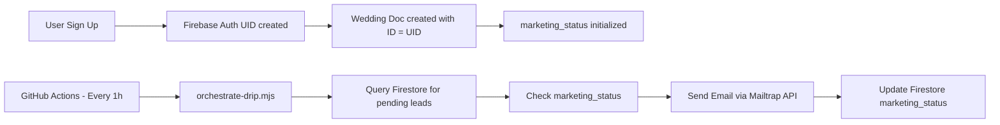

**Tl;DR**

Congratulations, you got [a micro-SaaS like this](https://jalcocert.github.io/JAlcocerT/bring-eyes-to-your-saas/) in front of people and even sold some.

You understood this is all about getting the OpEx right.

Now what?

**Intro**

Keeping in mind the level of repetitions that you need.

The number of people that is enough to try *or to say no to try* to be significative to then change something.

PROS advice to count in ~ thousands.

Im assuming for this post that you got the product delivery ready for sometime: *yes, we come from [here](https://jalcocert.github.io/JAlcocerT/bring-eyes-to-your-saas/)*

With some decent and easy to disgest [user journey workflow, like this one](https://mermaid.live/edit#pako:eNptVWFv4jgQ_Suj7O2V6qAbCJSSDyfRFuhKtMsCveouVCuTDMHbYCPHKWVL__uNnYRCtXwgtvPmefzmefLqhDJCx3dixdZLmF7PBNDv82foCa22MJJc6HxtopnSlcpAyjhB6EY-_FF3v0Rse3oKtdrfu6uEh087GI6CIRMRFzGMWIw-nAxQw78yU9BXiPB9fPKYE-63-ibmkikb8ieMUKVSsIT_YppLkYOGI7vFhMcC7tc-9LnCOUspjUwvdwcErwdcfalWb3n8warh-SrWmYY7tsKUdrxmGncwQNETMRcYDGXMQ8gnvllHRQiYJFl8lPk-Ij--QoMaMZOQwQYkmCai-_HQhy90oBBrczmv_cwENtzaS-dn4_F3RL3VHCMTtSOt6FWwz-D7GDZcL-FKZmsqwaXKdf4o53SJcNJdshO4lSssy2e5zAZ03nQZmD-rCRXIFucBI6sPbcJTGCOLtmWhDDbXbbXCiJtUuqEpzg6mmOpJyERQ5GTGqeHQ0r4rGEqYZblfJ5JFMMFkwUn4cePHVHGWBJVxAy6z8Am1D3YF6oPL06PTldiiiqlmQkMfMZoz6z3-jP9w3ATeuQsDliSotn4pV4pUbb1Ermhoti6YyyCrzYPcVCrTmx50b7pw--22dzc9Pf2g75UUz2RSOr-tdr5OgTapGx4v4avQpPuOXm83lEVAT1OI4kI0Op2a1-zAaHhXpFDgco9rxdckZBaGmKY7uBeJDJ-C_EHBLXdwCX9BvVm7ZlsotHzgIpKbj0boM55kCr_0Xrj-Tap3EorEdmAgxrAkGXkvRVVw2VADposmV1T5iLAr4g1GMtU3MjaVimNUPhkIn5Jt_hbuMqVp65LFrhmaMa4oVVR7bWbiyLelC83ZKmaBjJhA75mSLMqQC2HJ3sH2AmdksqGU68COUutFY0WmS9ryvpXIAztaH_az5NiGZoG8bipRGrGA2VBjG3OW3GGF4YKR4s_mjhyYsOB4PDytIsua7IdsiypfTrN53ocLcX_sQUGXWuKW2kn6Hmh7c_r4scMd37gjg304fj5FER2kNdHbZE-S0gTzxg8LniT-p0VnUU21kk_of_I87xBmbFWAFp1DUDGubXikl35z_XJETp2yCMP6orXAfaRbb7U780NsUfocHV7gefi-TwPbkdc4RJeFyuGuG4aLo9ydKn30eOT4WmVYdVaoyKU0dV4Ny8yhVrHCmePTMMIFyxI9c2bijcLWTPwn5aqMVDKLl46_YElKs2wdUfGvOaNKvkPQmJ5sIrTj113Pcjj-q_NC0_OLs0bTbbRbrue6bfeiVXW2jl9ru-2zjksaeO1657zuNd-qzi-7bf3sonXhXdQb7bp33vDcZrvqUF_WUt3mH3P7TX_7HwwkiCE).


  
  


1. Landing with proper loading times, above the fold, ...
2. Ads *or someway of people knowing you* working
3. The product itself right in place, working as your features promise
4. Stripe *or some way* to get the ultimate feedback that what you do is valuable

And...this is it?

Cant I get better?

Of course you can.

And its all about asking the questions:

* Whats working
* Whats not
* ~~Whats next~~: whats the biggest blocker to make it better?

## Some math first

Say your TAM is: 100k every year

Then, 1% of them get to know that you exist when they are on a **BANT state**: *that goes to...1k*

You should know your LTV, and your conversion rate.

Making the income: LTV*Conversion*1k = 100*0,001*1000 = 100$ a year

Wait...I get that little?

After all the tinkering, the building, the promotions...

Arent you even covering adquisition and operational costs?

Lets push the levers to change that.

With a very important one been the OpeX in growth, aka ads. Driven by psyc effects.

### A Video Explanation

Im assuming you have a **proper ATF** ([above the fold essentials](https://jalcocert.github.io/JAlcocerT/diy-landing-boilerplate/#the-above-the-fold-essentials) configured) to minimize the **Time to Value**.

With proper [atf instructions to Gemini](https://github.com/JAlcocerT/poc_shopify/blob/master/landing/z-atf-changes.md) you go from:


To: *Your users on high-intent mobile searches will now see the headline + interactive input + video proof all in their first view*


You can have cool videos embeded into your site, like these:

1. `https://www.okticket.es/`
2. `https://www.zoho.com/mail/`
3. `https://www.mrpresident.es/`
4. `https://flashhub.io/`


Or just friendly desins `https://kursy.ikliszcz.com/`


### A better FAQ

In general, a better copy.

You are paying ~1$ for 5 seconds of attention.

At least get the email via signup.


### Emails to show that you are still there

Pros say that every email should contain: *diversion, information, Venta*.

Sell a transformation.

Not the vehicle, but the pain removal and dream outcome destination.

But send emails...to whom?

You should be able to query the registered at Firebase/Firestore: *so I put together these scripts*

> You will need the [firebase console SDK creds](https://console.firebase.google.com/project/slubnechwile-a3fd3/settings/serviceaccounts/adminsdk) to get the `service-account.json`

This will also be useful to unsubcribe users:


```sh
git clone https://github.com/JAlcocerT/slubne-chwile-y26
#git pull
cd slubne-chwile-y26/slubnechwile
#docker compose -f docker-compose.cloudflare.yml up -d --build

# 1. Check Wedding Details (Firestore)
node --env-file=.env scripts/list-users.mjs #--csv

# 2. Check login accounts (Firebase Auth)
node --env-file=.env scripts/list-auth-users.mjs
```

│ (index) │ Email                     │ Names            │ Paid │ Storage   │ Created     │ Last Seen                │
├─────────┼───────────────────────────┼──────────────────┼──────┼───────────┼─────────────┼──────────────────────────┤
│ 0       │ '@gmail.com'      │ 'ba & do' │ '❌' │ '0.00 MB' │ '1/13/2026' │ 'Never'                  │
│ 1       │ '@gmail.com'     │ 'Test1 & test2'  │ '❌' │ '0.00 MB' │ '1/13/2026' │ '1/24/2026, 11:02:59 PM' │

> I was doing so first with the [slidev Firebase branch](https://github.com/JAlcocerT/slidev-editor/blob/firebaseauth/z-firebase-auth.md) version. Same here.

Then, get to know email DRIP.

It's a descriptive metaphor for the slow, steady "dripping" of automated email messages over time, like water from a faucet, rather than a sudden flood.

The term evokes gradual nurturing of leads through timed sequences.

#### DRIP x Mailtrap ESP

https://github.com/JAlcocerT/make-landing/tree/master/mjml-email I tested Mailtrap API x Python and some templating.

<!--
https://github.com/JAlcocerT/make-landing/blob/master/mailetrap-esp.ipynb
 -->

[](https://colab.research.google.com/github/JAlcocerT/make-landing/blob/master/mailetrap-esp.ipynb)

Taking this to the project: *I needed some orchestrator, but it wont be driven by CRON, but via GHA with hourly checks.*

```sh
#node --env-file=.env scripts/orchestrate-drip.mjs
node --env-file=.env scripts/orchestrate-drip.mjs --dry-run
```


Creating and testing the templates is simple:


```sh
node scripts/test-email.mjs --step welcome --name "JAlcocerT" --email "test@example.com" #this one creates a local html
```

But hey, make it match your web/product UI/X for consistency:


```sh
#node --env-file=.env scripts/test-email.mjs --send
node --env-file=.env scripts/test-email.mjs --step welcome --name "Jul" --email "sometestmail@gmail.com" --send
node --env-file=.env scripts/test-email.mjs --step social --name "Jul" --email "othertestemail@gmail.com" --send
```

Now just orchestrate the bulk sent, as per their current DRIP status:

```sh
#node --env-file=.env scripts/list-drip-status.mjs
node --env-file=.env scripts/orchestrate-drip.mjs
```


> And anyone trying the free tier should have opted-in for this

```sh
#node --env-file=.env scripts/test-email.mjs --step welcome --name "Jul" --email "sometestmail@gmail.com" --send
#every email contains a reference the the firebase UUID https://slubnechwile.com/unsubscribe?email=jesalctag%40gmail.com&uid=YOUR_REAL_FIREBASE_UID
node --env-file=.env scripts/test-email.mjs --step welcome --uid YOUR_REAL_FIREBASE_UID --send #this connects them to the email autom
node --env-file=.env scripts/toggle-unsubscribe.mjs --resubscribe
###docker compose -f docker-compose.cloudflare.yml up -d --build
#docker logs slubnechwile-app
```

> > No email DRIP, unsubcribed and erased from DB. Simple.

I needed to add a docker volume with the `` for the container to pull data from Firestore

```sh
cd slubnechwile/scripts
nano service-account.json
#git pull
#node --env-file=.env scripts/list-drip-status.mjs #now you can see Unsubscribed as YES
#node --env-file=.env scripts/orchestrate-drip.mjs --dry-run #and no action will be taken around email marketing for such user
```


#### MailTrap Orchestrated via GHA

So, am I going to be orchestrating who to send what?

No way.

This:

```sh
cd ./slubnechwile
node --env-file=.env ./scripts/orchestrate-drip.mjs
```

Is going to be ran by github actions: *hourly and free, with [this config](https://github.com/JAlcocerT/slubne-chwile-y26/actions/workflows/drip.yml)*

**Private Repositories**: GitHub provides **2,000 free minutes per month**.

*   This script takes about 30-45 seconds to run.
*   Running hourly (24 times/day) = ~720 runs per month.
*   720 runs * 0.75 minutes = **540 minutes per month**.
*   This is well within the 2,000-minute free allowance.


All working with this architecture around the email marketing.



One of the biggest advantages of this custom approach is that **you own the logic**. 

In traditional marketing SaaS:

- When an email doesn't send, you don't know *why* (API limit? Filter? Logic error?).
- You can't easily "dry run" how changes will affect 1,000 existing leads.

In this Lean Drip:

*   **Total Transparency**: Every decision made by the engine is logged. You can see exactly which condition was met (or not) in your GitHub Actions history.
*   **Safe Testing**: The `--dry-run` flag allows you to test logic changes against your **real database** without actually sending a single email or changing a single record.
*   **Easy Debugging**: If something breaks, you get a standard Node.js stack trace. You are debugging "code," not a proprietary UI tool.

---

## Conclusions

I hope that you understand the rules of the game that you are playing.

Talento vs perseverancia (But bee critic, dont hit the same wall 150 times *knowing the game helps*).

Got your copy right?

Did 2-3% of the people who entered the landing signed up?

Most of them wont pay right away.

But you can remember them  about your proposed value equation: 


### How can I Improve my MicroSaaS

You cant get to places that you dont know they exists.

To open your mind to new possibilities, you can always try these:


  
  


Dare to get some goodies, as I have here:


  


### FAQ


How did I came up with all this?

Just doing.


And with some inspiration.


  


Even Reqable has one: `Tools -> More QR-Code`

[](https://colab.research.google.com/github/JAlcocerT/JAlcocerT/blob/main/Z_TestingLanguages/Z_Python/QR_generation.ipynb)


Even with a [SliDev VUE Components like this one](https://github.com/JAlcocerT/slidev-editor/blob/logtojseauth/slidev/slidev-ba-tech-talk-mermaid-exadel/components/QRCode.vue) you can generate QRs!

You got the code [here](https://github.com/JAlcocerT/Home-Lab/tree/main/py-static/qr-pdf)


#### Google TAG


#### R2


#### PostHog


Matches regex: `^https://slubnechwile\.com(/.*)?$`

