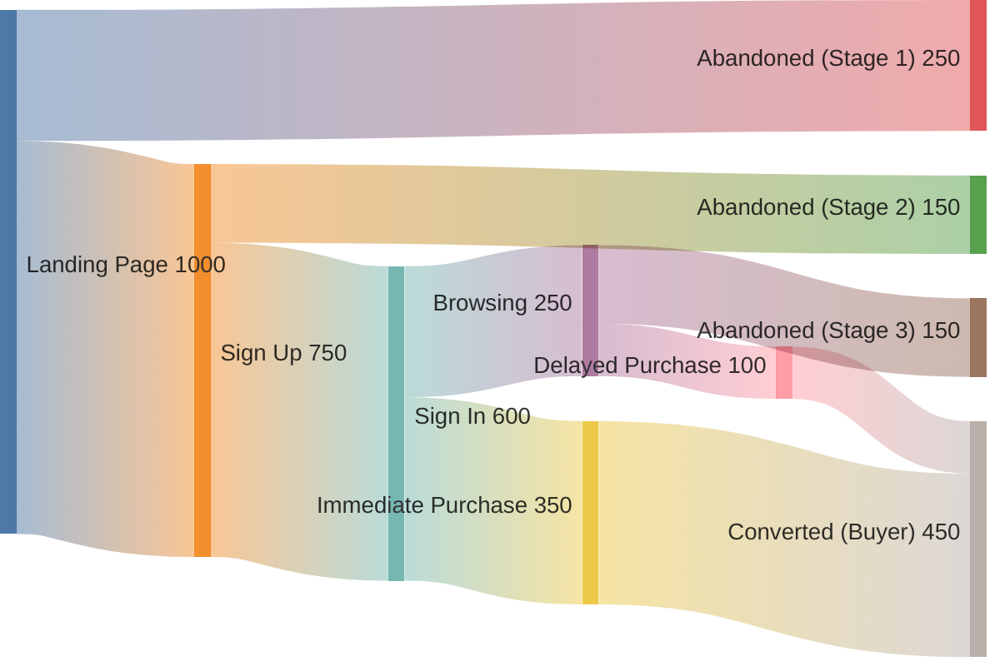

Type of offer: attraction ~~/ upsale / downsale / continuity~~

**Tl;DR**

MVP first - get those eyes going via ads towards: https://slubnechwile.com/

See what works and what not - PMF


  
  


Supply - ~ infinite (∞), scalable via [Serverless storage](https://jalcocert.github.io/JAlcocerT/docs/dev/serverless/#cloudflare-r2).
Demand - constrained, ad driven

Online marketing and an online delivery

These kind of **micro-SaaS** are so so cool:

1. https://tiiny.host/

> The simplest way to host & share your work online

2. https://github.com/uselinked/website from https://uselinked.com/

3. https://supersaas.dev/ -  The Simple, Fast & Smart Nuxt 3 Fullstack Kit.

> Starter kit / boilerplate landing with...a one time payment / Lifetime access.

4. https://github.com/anthonylan/angie - I love those arrows and the look... https://github.com/JAlcocerT/angie

> MIT |  Angie is a free, open-source portfolio template featuring a bold, brutalist design that helps you stand out and showcase your work with style. 

Why couldnt SLubnyChwile be one of those cool UIs? :)

The **launch strategy**: *aka, focus strategy*

| Element | Decision |
| :--- | :--- |
| **One Avatar** | |
| **One Product** | |
| **One Channel** | |

The **Tier of Service**: A DFY that I made [here](https://jalcocert.github.io/JAlcocerT/software-for-weddings/#what-i-learnt) and Ive transformed into DIY with the cool serverless tech stack below.

The **customer segmentation**: B2C

The expected


  


The **tech stack**:

| Requirement | Specification | Clarification / Decision |
| :--- | :--- | :--- |
| **Frontend Framework** | | |
| **Styling/UI Library** | | |
| **[Backend](https://jalcocert.github.io/JAlcocerT/docs/dev/fe-vs-be/)/Database** | | |
| **[Authentication](https://jalcocert.github.io/JAlcocerT/docs/dev/authentication/)** | | |

**Intro**

For green field AI vibe coding has been great, for brown field...not that much, despite the project docs with AI was interesting

Thats why I want to put together some boilerplates that just get the work done.

And...ship sth already this year.

The main pieces are clear already as per:


  
  


I got to know about NextJS for SSG purposes.

And themes like SaaSify can do the trick.

For SaaS, there are OSS starter kits like: https://github.com/nextacular/nextacular

https://nextacular.co/

https://docs.nextacular.co/

> MIT |  An open-source starter kit that will help you build full-stack multi-tenant SaaS platforms efficiently and help you focus on developing your core SaaS features. Built on top of popular and modern technologies such as Next JS, Tailwind, Prisma, and Stripe. 

https://developers.cloudflare.com/pages/framework-guides/nextjs/

<https://jamstack.org/generators/next/>

<https://nextjs.org/>

<https://vercel.com/templates/next.js>

<https://jamstackthemes.dev/theme/nextjs-notion-starter-kit/>
<https://transitivebullsh.it/nextjs-notion-starter-kit>

<https://transitivebullsh.it/>

## Getting Here

This has been...a series of random steps.

{}

### Tinkered with Selfhosting

### Discovered one for weddings

I tested it...and it looked cool.

All of this happened while travelling.

Yea, I took the laptop.

### DFY for a close one

But they needed something simpler.

So i made a filebrowser + custom QR setup.

How could I not tinker with QR for the sake of it...

With Python:

And with node:

### Tinkered with Serverless

And i dont mean static deploy to cloudflare pages this time

I mean about serverless s3 storage, via cf R2.

Which i got familiar with on [this post](https://jalcocert.github.io/JAlcocerT/hugo-pocketbase-and-r2/).

### 

{}

### Chatting with Gemini about the offer

{}

That is the ultimate, high-level business question.

Your entire flow is strategically built to identify, filter, and cater to the four key elements of a qualified lead—**Budget, Authority, Need, and Timing (BANT)**—which is especially important when using paid advertising.

Here is how the *Ślubne Chwile* flow addresses and converts leads based on BANT criteria:

## 🎯 Matching the Flow to the BANT Sales Criteria

### 1. **Need (The Problem Solver)**

* **Definition:** Does the prospect have a legitimate problem that your service solves? (Losing guest photos/videos).
* **Flow Mechanism:**
    * **Landing Page:** The Hero Section and the Benefits Section (Section 2) are entirely dedicated to establishing need. The headlines explicitly state the problem ("Nie Strać Żadnej Uśmiechniętej Chwili") and offer the solution.
    * **Free Test:** Allowing them to upload 5 photos and see the Admin Panel validates the need for collection and organization.
* **Verdict:** **Need is established upon Landing Page conversion.** If they register, they confirm they have this problem.

### 2. **Timing (The Time-Driven Nudge)**

* **Definition:** When does the prospect need the solution? (Tied to the wedding date).
* **Flow Mechanism:**
    * **Registration:** **Collecting the Wedding Date** is the single most critical piece of BANT data. It allows you to schedule the rest of the sales process.
    * **Email Nurturing:** Emails are scheduled to peak **3–4 months before the wedding**—the ideal time when couples are finalizing vendor lists and security details.
    * **Paid Duration:** Tiers are based on post-wedding access (1, 3, or 12 months), making the time/urgency a central conversion factor.
* **Verdict:** **Timing is acquired at registration (A4) and utilized throughout the sales cycle (Z2).**

### 3. **Authority (The Decision Maker)**

* **Definition:** Is this the person who can make the purchase decision? (The Bride and Groom).
* **Flow Mechanism:**
    * **Registration:** Requiring **both the Bride's and Groom's names** (A4) explicitly targets the decision-makers. The personalization is immediately linked to their names (e.g., `slubnechwile.pl/Anna-i-Jan`), confirming they have the authority to act.
    * **Password Security:** The **"Set Guest Password"** feature (Z4) is a core control function that only the Authority would care about, forcing their attention to the paywall.
* **Verdict:** **Authority is verified by the commitment to the customized link (A7).**

### 4. **Budget (The Price/Value Match)**

* **Definition:** Can the prospect afford your service, and do they agree with the value?
* **Flow Mechanism:**
    * **Tiered Pricing (E):** The three tiers address different budgets:
        * **Bronze (149 PLN):** Caters to the lowest budget (anchor).
        * **Silver (299 PLN):** Targets the average, high-profit budget (most popular).
        * **Premium (699 PLN):** Targets the high-value, risk-averse budget (high AOV).
    * **Feature Stacking:** The Silver and Premium features (**Live Preview, Pre-Wedding Memories, 12-Month Access**) are carefully stacked to provide disproportionately higher value than the simple price difference, forcing the customer to **choose based on value, not just cost.**
* **Verdict:** **Budget is addressed at the point of conversion (Z5) after Need, Timing, and Authority have been established, making the pricing easier to accept.**

{}

---

The entire *Ślubne Chwile* flow is designed as a **BANT qualification machine**. It uses free access to gather the necessary data (Need, Timing, Authority) before presenting the Budget, ensuring that by the time a couple sees the price, they are already highly qualified, emotionally invested, and ready to convert.

## Themes

<https://vercel.com/templates>

### My Favourite Themes

* https://nextra.site/
* https://github.com/shadcn-ui/taxonomy

https://jamstackthemes.dev/theme/nextjs-notion-starter-kit/

 ### Other F/OSS SSG's

This addition suggests other Static Site Generators (SSGs) that readers might find interesting based on their enjoyment of the Next.js post. Let me know if you need any further adjustments!

    HUGO: Lightning-fast speed.
    Astro: Built-in support for server-side rendering (SSR).
    Jekyll: Simplicity and ease of use, particularly for blogging.
    Gatsby: Rich ecosystem of plugins and a vibrant community.

If you have enjoyed the Next.js post, you might be interested to explore other SSGs like HUGO, Astro, Jekyll, and Gatsby. -->

<!-- - **Gatsby**: Gatsby is a popular static site generator within the **React** ecosystem, leveraging React for building static sites and offering a rich plugin ecosystem.
  - **Pros**:
    - Ability to pull data from various sources, including CMSs and APIs.
    - React-based, enabling component-based development and rich interactivity.
    - Extensive plugin ecosystem for adding functionality and integrating with third-party services.
  - **Cons**:
    - Longer build times for large projects due to complex data fetching and processing.
    - Steeper learning curve for developers unfamiliar with React.
    - Requires a Node.js environment for development and building.

- **Next.js**: Next.js is primarily known as a **React** framework for SSR and CSR, but it also offers SSG capabilities, providing flexibility for different project needs.
  - **Pros**:
    - Versatility to choose between SSR, CSR, or SSG based on project requirements.
    - Seamless integration with React for building dynamic user interfaces.
    - Hybrid capabilities for blending static and dynamic content in a single application.
  - **Cons**:
    - Complex configuration compared to simpler static site generators.
    - Requires familiarity with React and Node.js for effective usage.
    - Limited built-in features compared to dedicated static site generators like Hugo. -->

---

## FAQ

The FlaskCMs / NextJS CMS i tried to built were similar to these OSS for Selfhosted Blogs

* https://github.com/ddoemonn/next-blog

> **MIT** | self-hosted blog platform built with next.js 

### Adsense vs OpenAdServer

* https://github.com/seanZhang414/openadserver

>  Open Source Ad Serving Platform with ML-Powered CTR Prediction | Self-hosted alternative to Google Ad Manager | Python, FastAPI, PyTorch 