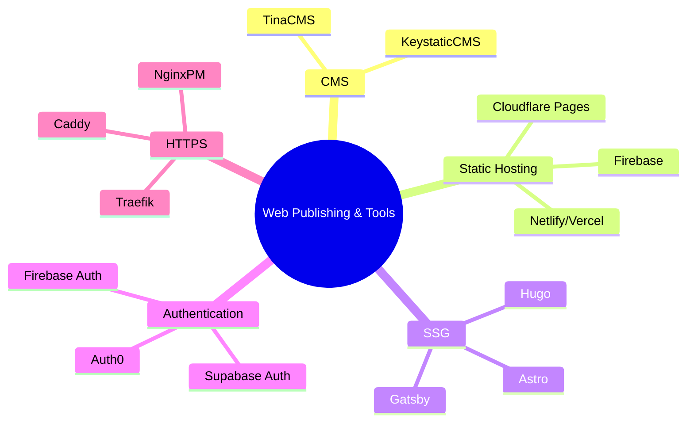

<!-- 
referencia a persuasion escrito en jan 2022

y aqui cositas de neuromarketing

the buying brain....
`brainfluence`

 -->

Its been few months since I covered [these Tools for forms/newsletters](https://jalcocert.github.io/JAlcocerT/blog/dev-forms/)

Now, how to built great [products](https://jalcocert.github.io/JAlcocerT/product-skills-for-data-analytics/)?

What it is our potential client? What does it values the most? what are their *pain points*?

Given that you have a cool website, already with web analytics.

People are reading, so...what are they interested at?

You got to know about that thanks to a [newsletter/forms](https://jalcocert.github.io/JAlcocerT/blog/dev-forms/).

> From those I enjoyed [formbricks](https://formbricks.com/) and [Mailerlite](https://accounts.mailerlite.com/login), which can be integrated with Gsheets/[cal](https://cal.com/)/webhooks as seen [here](https://jalcocert.github.io/JAlcocerT/blog/dev-forms/#formbricks)


Or maybe you had some kind of **waiting list** in place...

*You could do those with a simple flask + formbricks/mailerlite/logto...*

## Motivation

Recently I got to [read a blog](https://john.onolan.org/12/?ref=selfh.st) about the **CEO of [ghost](https://github.com/TryGhost/Ghost)**



This article celebrates Ghost's **12th anniversary**, reflecting on its journey from an idealistic open-source project to a successful business with **$8M in annual recurring revenue** and a team of 34.

The founder, who started Ghost at 24, initially aimed to provide independent publishers with a dedicated open technology stack.

This was a response to the rise of media companies like Vox and BuzzFeed, whose proprietary software gave them a significant advantage over traditional outlets.

Ghost sought to empower creators and newsrooms to compete without being beholden to closed platforms like Facebook and Medium.

Over the past 12 years, Ghost has consistently focused on building tools for web publishing, particularly helping creators build sustainable businesses through features like **paid subscriptions**. This focus has led to over **$100 million** earned by independent media businesses using Ghost.

The author expresses pride in Ghost's achievements as a **small, independent non-profit** competing with large, VC-funded platforms.

The article concludes by noting a growing appetite for independent solutions and announces the upcoming release of **Ghost 6.0**, a significant step forward for the platform. Ghost is also **hiring** for remote positions.



And **the quote** was just so resonating: 

> 'Freedom of the press is guaranteed only to those who own one'

So....why not trying something similar?

Similar as in these Selfhosted Tools:

* Bloggin Platforms https://github.com/awesome-selfhosted/awesome-selfhosted?tab=readme-ov-file#blogging-platforms
* CMS platforms https://github.com/awesome-selfhosted/awesome-selfhosted?tab=readme-ov-file#content-management-systems-cms

Or like this no code platform for landing webpages: https://www.producthunt.com/products/tilda-publishing

During early spring I [tested Dokploy](https://jalcocert.github.io/JAlcocerT/selfhosted-paas/), which does kind of that - Wrap apps into Traefik to expose them.

But that's not niche enough. Which app are you offering? all of them? none of them?

So Dokploy would more a [PaaS offering](https://jalcocert.github.io/JAlcocerT/deploying-software-with-paas-to-servers/).

And an alternative to Ghost would have to keep it simple.

Similar to Ghost in scope (just web) but:

1. Keeping OSS
2. No database required - Your flat files, your rules. Easier to migrate.
3. Even cooler themes
4. *Greener* to serve



People out there say that its all about shipping: [4/70](https://jalcocert.github.io/JAlcocerT/pareto-principle-for-data-analytics/) projects went into something - <https://twitter.com/levelsio/status/1457315274466594817>

## The Components and Idea

It's all combined on this project:


  


### The CMS




You need **markdown** for these SSGs. And there are cool **markdown tools**:

1. https://github.com/Cveinnt/LetsMarkdown.com

```sh
docker run --rm -dp 3030:3030 cveinnt/letsMarkdown
```

2. https://github.com/joemccann/dillinger

> MIT | The last Markdown editor, ever.




I first had a look to reddit:

* https://www.reddit.com/r/webdev/comments/1hdf2ey/best_headless_cms_for_freelancing_editable_by_the/
* https://www.reddit.com/r/webdev/comments/mk8vrx/looking_for_a_headless_cms_recommendation/
* https://www.reddit.com/r/webdev/comments/1ht3vyd/looking_for_a_minimalistic_opensource_cms/
* https://www.reddit.com/r/nextjs/comments/1g9ihih/what_is_the_best_headless_cms_we_can_use/
* https://www.reddit.com/r/webdev/comments/gcutf8/freelancers_which_headless_cms_with_a_generous/

And after that I consolidated the [CMS alternatives](https://jalcocert.github.io/JAlcocerT/cms-for-static-websites/), focusing on these two (for their simplicity)

[LinkStack](https://github.com/JAlcocerT/Docker/blob/main/Web/CMS/LinkStack_docker-compose.yml) was really interesting, with themes, authentication...

But it needs a server for the viewers.

So ideally, it would be server just for edition, static for users.

Which is what the [Treelink](https://github.com/JAlcocerT/treelink) project does out-of the box as we saw [on this post](https://jalcocert.github.io/JAlcocerT/cool-link-in-bios/) - The only missing piece would be the [authentication](#authentication), so that only logged in can make changes


> The only thing the theme need is [a Flask App](https://github.com/JAlcocerT/treelink/tree/main/config-generator) so that people generates its config!

#### DecapCMS

```sh
git clone https://github.com/JAlcocerT/Portfolio

#hugo server
#hugo server --bind="0.0.0.0" --baseURL="http://192.168.0.117" 
hugo server --bind="0.0.0.0" --baseURL="http://192.168.1.11" --port=1313
```

YOu might need some vibe code help:

```
can we try to implement decapCMS to work with this repo? I dont want to use any netlify service, my goal is to have a UI where the content of the hugo theme can be edited via UI and then just commit changes
```

Check that http://192.168.1.11:1313/admin/config.json 

```sh
npm install -g netlify-cms-proxy-server
npx netlify-cms-proxy-server
```

> With vibe coding - is possible.

Its just that...you will need Github OAUTh and stuff.

Do you want to give people OAUTH access to your actual github account?

Im not sure yet about that.

#### TinaCMS

* https://tina.io/



  
  


<!--  -->

* https://github.com/JAlcocerT/barebones-starter
* https://github.com/JAlcocerT/yarness-web
  * https://github.com/DBozhinovski/astro-theme-ltree


##### Astro Theme LTree

I great working sample with TinaCMS Cloud: https://app.tina.io/projects


<!--  -->



Following the original theme instructions: https://darko.io/posts/linktree-and-linkinbio-clone-with-astro-and-tinacms

* https://github.com/DBozhinovski/astro-theme-ltree





#### KeyStaticCMS

* https://jalcocert.github.io/JAlcocerT/understanding-keystatic-cms/
* https://github.com/JAlcocerT/landingpad

### Authentication

This one will require your focus: https://darko.io/posts/but-auth-is-hard

As per my [recent post](https://jalcocert.github.io/JAlcocerT/testing-tinyauth/), you have few options, like:

1. [TinaAuth](#tinyauth)
2. [LogTo](#logto)

#### TinyAuth

To get this right, first we need to have a **proper Traefik Setup**, that routes both:

1. The built website to a given sub/domain with https
2. The editor/admin panel into another sub/domain/static route - That only the website owner can access


  



The theme im using is Lynx, and you can get an avatar thanks to [Avartartion](https://github.com/wilmerterrero/Avatartion)


#### LogTo

I was playing around with [LogTo](https://logto.io/) few months ago, together with Streamlit, [here](https://jalcocert.github.io/JAlcocerT/ai-useful-yet-simple/#user-authentication).

But I did not quite manage to get where I wanted.


Just recently...I got some inspiration, while doing [**this post**](https://jalcocert.github.io/JAlcocerT/testing-tinyauth/#logto-authentication).

And I can confirm that LogTo works great with Flask Apps, [like the 3body webapp](https://github.com/JAlcocerT/ThreeBodies).

---

## Conclusion

With the CMS - giving people possibility to edit

And the authentication layer - Knowing who is going to edit what...

You will want to know how it actually works for them, aka, *where are the frictions in the app flow*

### Product First

Make sure you understand how to use funnels and [Sankey](https://apexcharts.com/apexsankey/) diagrams.

> Like this graph? Me too and its thanks to [HUGO shortcodes x ChartJS](https://jalcocert.github.io/JAlcocerT/using-hugo-as-website/#charts-in-hugo) - [funnels](https://www.npmjs.com/package/chartjs-funnel)



  


Any Web or Webapp can potentially be Combined with PostHog/OpenReplay for Product Analytics

1. [PostHog](https://posthog.com)
2. OpenReplay

[](https://star-history.com/#posthog/posthog&usefathom/fathom&openreplay/openreplay&rrweb-io/rrweb&type=Date)


#### PostHog

To see how customers interact with your product, you can try with https://eu.posthog.com/



  



[](https://star-history.com/#posthog/posthog&usefathom/fathom&openreplay/openreplay&rrweb-io/rrweb&type=Date)


### Use Cases

[HUGO](https://jalcocert.github.io/JAlcocerT/using-hugo-as-website/) Websites, via [its own container](https://jalcocert.github.io/JAlcocerT/using-hugo-as-website/#hugo-container)

Spinned with [subdomain and https](https://jalcocert.github.io/JAlcocerT/docs/selfhosting/https/) via [Traefik](https://fossengineer.com/selfhosting-traefik/)

And...for user interaction [a CMS](https://jalcocert.github.io/JAlcocerT/cms-for-static-websites/)


#### Next Steps

Who said [weddings](https://jalcocert.github.io/JAlcocerT/wedding-photo-galleries/)?

<!-- https://youtube.com/shorts/YvqRzjcR7EI -->


