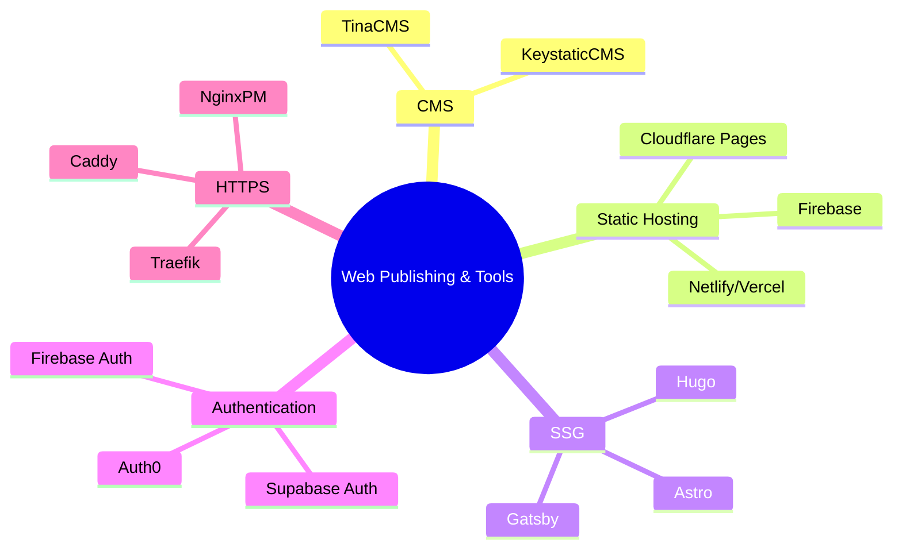

Its been few months since I covered [these Tools for forms/newsletters](https://jalcocert.github.io/JAlcocerT/blog/dev-forms/)

Now, how to built great [products](https://jalcocert.github.io/JAlcocerT/product-skills-for-data-analytics/)?

What it is our potential client? What does it values the most? what are their *pain points*?

Given that you have a cool website, already with web analytics.

People are reading, so...what are they interested at?

You got to know about that thanks to a [newsletter/forms](https://jalcocert.github.io/JAlcocerT/blog/dev-forms/).

> From those I enjoyed [formbricks](https://formbricks.com/) and [Mailerlite](https://accounts.mailerlite.com/login), which can be integrated with Gsheets/[cal](https://cal.com/)/webhooks as seen [here](https://jalcocert.github.io/JAlcocerT/blog/dev-forms/#formbricks)

Or maybe you had some kind of **waiting list** in place.

## Motivation

Recently I got to [read a blog](https://john.onolan.org/12/?ref=selfh.st) about the CEO of [ghost](https://github.com/TryGhost/Ghost)



This article celebrates Ghost's **12th anniversary**, reflecting on its journey from an idealistic open-source project to a successful business with **$8M in annual recurring revenue** and a team of 34.

The founder, who started Ghost at 24, initially aimed to provide independent publishers with a dedicated open technology stack. This was a response to the rise of media companies like Vox and BuzzFeed, whose proprietary software gave them a significant advantage over traditional outlets. Ghost sought to empower creators and newsrooms to compete without being beholden to closed platforms like Facebook and Medium.

Over the past 12 years, Ghost has consistently focused on building tools for web publishing, particularly helping creators build sustainable businesses through features like **paid subscriptions**. This focus has led to over **$100 million** earned by independent media businesses using Ghost.

The author expresses pride in Ghost's achievements as a **small, independent non-profit** competing with large, VC-funded platforms.

The article concludes by noting a growing appetite for independent solutions and announces the upcoming release of **Ghost 6.0**, a significant step forward for the platform. Ghost is also **hiring** for remote positions.


And the quote was just so resonating: 

> 'Freedom of the press is guaranteed only to those who own one'

So....why not trying something similar?

During early spring I [tested Dokploy](https://jalcocert.github.io/JAlcocerT/selfhosted-paas/), which does kind of that - Wrap apps into Traefik to expose them.

But that's not niche enough. Which app are you offering? all of them? none of them?

So Dokploy would more a [PaaS offering](https://jalcocert.github.io/JAlcocerT/deploying-software-with-paas-to-servers/).

And an alternative to Ghost would have to keep it simple.

Similar to Ghost in scope (just web) but:

1. Keeping OSS
2. No database required - Your flat files, your rules. Easier to migrate.
3. Even cooler themes
4. *Greener* to serve

People out there say that its all about shipping: [4/70](https://jalcocert.github.io/JAlcocerT/pareto-principle-for-data-analytics/) projects went into something - <https://twitter.com/levelsio/status/1457315274466594817>

## The Components and Idea


  


### Authentication

#### TinyAuth

#### LogTo

I was playing around with [LogTo](https://logto.io/) few months ago, together with Streamlit.

But I did not quite manage to get where I wanted.

Just recently...I got some inspiration, while doing [this post](https://jalcocert.github.io/JAlcocerT/testing-tinyauth/#logto-authentication).

### Product First

#### PostHog

To see how customers interact with your product, you can try with https://eu.posthog.com/

---

## Use Case

[HUGO](https://jalcocert.github.io/JAlcocerT/using-hugo-as-website/) Websites, via [its own container](https://jalcocert.github.io/JAlcocerT/using-hugo-as-website/#hugo-container)

Spinned with [subdomain and https](https://jalcocert.github.io/JAlcocerT/docs/selfhosting/https/) via [Traefik](https://fossengineer.com/selfhosting-traefik/)

And...for user interaction [a CMS](https://jalcocert.github.io/JAlcocerT/cms-for-static-websites/)