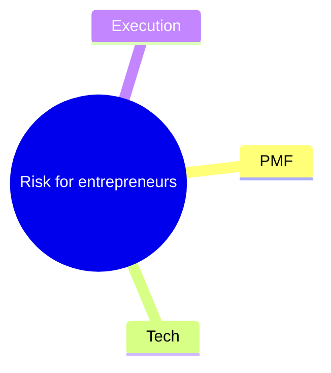

Its been a while since I was helping on [this wedding](https://jalcocert.github.io/JAlcocerT/software-for-weddings/)

Thankfully, I have a video on how cool that was:



<!-- https://youtube.com/shorts/Y0AOGLRC7h4 -->

It was all about some software setup on a VPS:

* [Hetzner](https://www.hetzner.com/cloud/)
* [Digital Ocean](https://www.digitalocean.com/pricing) 
* GCS - https://cloud.google.com/storage/pricing
* Any of the VPS covered [here](https://jalcocert.github.io/JAlcocerT/asrock-x300-home-server/#faq)

But how to bring this service to more people and [get paid for it](#stripe)?

This requires proper packaging, quite some additional tech to bring the offer to prospects:


  
  



  


And if you want to go all in into such kind of idea...be aware of the **risks for entrepreneurs**:



* PMF (Product-Market Fit) - The "What": *defines what you are offering and what problem you are solving for what audience. Without a clear "what" that resonates, everything else is building on shaky ground. The biggest risk for entrepreneurs often lies in building something nobody wants*
* Tech - The "How": software, hardware, or a proprietary process...
* Execution - The "Doing" / "Making it Happen": Actual work to make it a reality and sustain it. Risks in execution include poor team dynamics, inability to raise funds, failing to hit milestones, losing focus, or simply not having the grit to push through challenges


## The Offer

So...its very simple:

* People get married
* They like photos
* A lot of photos are *lost* in guests phones


Or not that simple. Make sure to iterate with LLMs to get feedback on your users flows and value proposition!





Let's make a guesstimate of the potential revenue for a QR and photo storage service for weddings in Poland.

This will involve making several assumptions, as exact market data for such a niche service is scarce.

1. Total Addressable Market (TAM) - Number of Weddings per Year

* **Data:** According to Notes from Poland, the number of marriages in Poland dropped to just over **140,000 in 2020** from **180,000 in 2019**, with a general decline since a high of almost 260,000 in 2008. More recent data from Poland Insight (May 2024) notes a "demographic downturn" and a shrinking base of potential newlyweds, suggesting the number might still be lower than pre-pandemic highs.

* **Assumption:** Let's take a cautious estimate for current weddings, considering the decline and potential for stabilization. We'll use **160,000 weddings per year** as a mid-point estimate between the lower pandemic number and the 2019 figure.

2. Market Penetration - Weddings that will use the service

This is highly speculative and depends on factors like marketing, ease of use, pricing, and competition.

* **Awareness:** How many couples planning a wedding will even hear about your service?
    * Let's assume an initial marketing push targets wedding fairs, online wedding planning forums, social media, and direct outreach to wedding photographers.
    * **Assumption:** **5%** of couples planning a wedding become aware of the service in the first year. (160,000 weddings * 0.05 = 8,000 couples)

* **Consideration/Interest:** Out of those aware, how many will seriously consider it?
    * The service offers clear value: centralizing guest photos, easy sharing.
    * **Assumption:** **20%** of aware couples will be interested enough to explore the service. (8,000 couples * 0.20 = 1,600 couples)

* **Conversion Rate (Paying Customers):** Out of those interested, how many will actually pay for the service?
    * This depends heavily on pricing and perceived value.
    * **Assumption:** **10%** of interested couples will ultimately purchase the service. (1,600 couples * 0.10 = 160 paying couples per year). This is a conservative start.

3. Pricing Model

You need to define your pricing. Let's consider a few options:

* **Flat Fee per Wedding:** A single price for the event.
* **Tiered Pricing:** Based on storage, duration, number of QR codes, features.
* **Per Guest/Upload:** Less common for this type of service.

Let's assume a **flat fee per wedding**. What would be a reasonable price in Poland?
* Wedding photography packages in Poland range from PLN 3,450 - PLN 4,450, with add-ons for additional photos often costing around PLN 1,000.
* A photo sharing service is a supplementary service, not a core photography package.
* **Assumption:** A reasonable price for a premium photo sharing and QR service would be around **PLN 200 - PLN 400 (approx. €45 - €90)** per wedding. Let's use **PLN 300 (€68)** as an average.

4. Revenue Guesstimate (Year 1)

* **Number of Paying Weddings:** 160
* **Average Price per Wedding:** PLN 300
* **Estimated Annual Revenue (Year 1):** 160 weddings * PLN 300/wedding = **PLN 48,000**

5. Future Growth & Optimism

This is a very conservative estimate for Year 1. A service like this could grow significantly.

* **Increased Awareness:** Word-of-mouth, social media virality, partnerships with wedding planners/photographers.
* **Higher Conversion:** Refined pricing, better marketing, more features.
* **QR Code Adoption in Poland:** Data suggests 28.6% of Poles used QR codes at the beginning of 2024, and 84% of smartphone users have scanned a QR code at least once. This indicates good receptiveness for QR-based access.
* **Average Guest Count:** Polish weddings typically have around 100 guests. This means potentially 100 people per wedding seeing the QR code and potentially uploading photos, leading to high visibility for the service among a target demographic.

**Optimistic Scenario (Year 3-5 after launch, with strong marketing and positive reviews):**

* **Awareness:** 20% of weddings (32,000 couples)
* **Interest:** 30% of aware (9,600 couples)
* **Conversion:** 20% of interested (1,920 paying couples)
* **Estimated Annual Revenue (Optimistic):** 1,920 weddings * PLN 300/wedding = **PLN 576,000**

Breakdown and Considerations for the Funnel:

**Funnel Stage 1: Total Weddings in Poland**
* **Size:** ~160,000 weddings/year

**Funnel Stage 2: Couples who see the ad/become aware**
* **Conversion Rate (Awareness):** 5% (Year 1) -> 20% (Optimistic)
* **Result (Year 1):** 8,000 couples

**Funnel Stage 3: Couples who are interested**
* **Conversion Rate (Interest):** 20% (Year 1) -> 30% (Optimistic)
* **Result (Year 1):** 1,600 couples

**Funnel Stage 4: Couples who pay for the service**
* **Conversion Rate (Purchase):** 10% (Year 1) -> 20% (Optimistic)
* **Result (Year 1):** 160 paying couples

**Revenue Calculation:**
* **Year 1 Revenue:** 160 couples * PLN 300/couple = **PLN 48,000**

**Factors that could influence these numbers:**

* **Competition:** Are there similar services in Poland? If so, what are their prices and features?
* **Marketing Effectiveness:** How well can you reach your target audience?
* **Partnerships:** Collaborations with wedding photographers, videographers, or wedding halls could significantly boost conversions.
* **Feature Set:** Does the service offer enough value beyond just QR and storage (e.g., easy sharing with specific guests, highlight reels, print options, guest engagement features)?
* **Seasonality:** Weddings are seasonal, mostly concentrated in warmer months.
* **Demographics:** The median age for marriage in Poland is around 30 for men and 28 for women, indicating a tech-savvy demographic likely to use QR codes.



The kind of idea that when you ask and people say that they'd buy it (*with other's money, for sure*)

And here we are with *the solution for that pain.*

This one is tested *in production* as seen [here](https://jalcocert.github.io/JAlcocerT/software-for-weddings)

**Whats required?**

1. https://filebrowser.org/configuration/custom-branding or [filebrowser quantum](https://github.com/gtsteffaniak/filebrowser)


2. A Landing [Page](#the-landing-page)

A little AI help on [neuromarketing](https://github.com/JAlcocerT/Streamlit-AIssistant/blob/main/Z_AIgents/OpenAI_Neuromkt.py)


3. Being clear on the **VALUE PROPOSITION**: dream outcome vs discounts

- Speed/Time: 1 minute
- Effort: Low
- % success / Chances that it will happen: Free tiers / money back...




You're asking about a crucial aspect of your business: **conversion optimization**.

Beyond a compelling lead magnet, getting more sign-ups (and later, upgrades) involves understanding human psychology.

---

Neuromarketing & Conversion Optimization for Your Wedding Website

Here are key areas and techniques to focus on to convert more sign-ups for your free tier, and ultimately, more upgrades:

1. **Reduce Friction & Cognitive Load (The Brain Hates Effort)**

The less thought required, the better.

* **Simplify the Sign-Up Form:** You've already made progress here. Only ask for essential information (email, couple's names, wedding date, desired URL). Every extra field increases abandonment.
* **Clear Call to Action (CTA):** Use action-oriented language that clearly states the benefit.
    * Instead of just "Sign Up," try: "**Get Your Free Wedding Website!**" or "**Claim Your Custom Wedding Hub!**"
    * Make the CTA button visually stand out.
* **Instant Gratification:** As soon as they sign up, give them immediate access to their website or a clear path to it. Don't make them wait for an email. The brain loves instant rewards.
* **Progressive Disclosure:** Don't overload them with all features at once. Reveal them as they naturally need them (e.g., guide them through setting up basic info, then introduce photo uploads).

2. **Leverage Social Proof (We Follow the Crowd)**

People are more likely to do something if they see others doing it or benefiting from it.

* **Testimonials/Reviews:** Showcase quotes from delighted couples who've used your service, especially those who highlight how easy it was to collect photos or how much they loved their website. Place these prominently on your landing page.
* **Success Metrics (Subtle):** If possible, mention numbers like "Trusted by X happy couples" or "Over Y photos collected." (Be cautious with specific numbers if you're just starting, but keep this in mind for the future.)
* **"As Seen In" Logos:** If you get featured by any wedding blogs or publications, display their logos.

3. **Harness Urgency & Scarcity (Don't Miss Out!)**

While your core product isn't truly scarce, you can use these principles ethically for limited-time offers or decision-making.

* **Limited-Time Offers (for Upsells):** "Upgrade to Unlimited Photo Storage within 48 hours and get a bonus photo album template!" This creates a reason to act *now*.
* **Countdown Timers:** On upsell pages, a countdown to an expiring offer can be very effective.
* **"Almost Full" Language (if applicable):** If you ever have capacity limits (unlikely for website, but maybe for a specific launch phase), subtle hints can work. For your free tier, this isn't as relevant, but keep it in mind for premium bundles.

4. **Frame Value & Benefits (What's In It For Me?)**

Focus on the *outcome* for the user, not just the features of your product.

* **Problem-Agitate-Solve (PAS):** This is the core "reveal a problem" strategy we discussed.
    1.  **Problem:** "Tired of scattered wedding photos?"
    2.  **Agitate:** "Imagine missing out on those candid moments captured by your loved ones..."
    3.  **Solve:** "Our free wedding website and QR scan photo share solves it all!"
* **Benefit-Oriented Language:**
    * Instead of "1GB storage," say "Enough space for hundreds of cherished guest photos."
    * Instead of "QR code upload," say "Effortless, instant guest photo sharing."
    * Emphasize **peace of mind**, **convenience**, **capturing every memory**, **less stress**.
* **Anchoring:** Present your free tier first, making the paid tiers seem like a natural, small step up in value. When showing upgrade options, put the most popular or mid-tier option in the middle to make it seem like the "just right" choice.

5. **Priming (Setting the Mood)**

Subtly influence their perception before they even interact with your form.

* **Visuals:** Use high-quality, aspirational images of happy couples, beautiful wedding moments, and sleek, user-friendly interfaces. Evoke positive emotions.
* **Language Tone:** Use warm, celebratory, and reassuring language throughout your site. Avoid overly technical jargon.
* **Consistency:** Ensure your messaging and visuals are consistent across all touchpoints (ads, social media, landing page).

6. **Loss Aversion (Avoiding the Pain of Missing Out)**

People are more motivated by avoiding a loss than by gaining something of equal value.

* **Frame the "Cost" of Not Using Your Service:** "Don't let those priceless candid photos disappear into your guests' phone archives forever." or "Avoid the post-wedding headache of chasing down every single photo."
* **Highlight What They'll Miss:** "Without a central hub, you risk missing important RSVPs and your guests might feel lost on the big day."

---

By thoughtfully applying these neuromarketing principles to your landing page and overall customer journey, you can create a more compelling and persuasive experience that leads to higher conversion rates for your free tier and, subsequently, for your paid offerings.



### QR Generator

This can be done in several ways

1. With Streamlit https://github.com/JAlcocerT/Streamlit-AIssistant/tree/main/QR_GenerAItor
2. With Python or several containers / tools as seen during the [initial wedding delivery](https://jalcocert.github.io/JAlcocerT/software-for-weddings/#what-i-learnt)
3. In theory, also with javascript on the client side...

And thanks to vibe coding, you can get very quick this kind of Flask App:


If everything worked:

```sh
nslookup test.jalcocertech.com
```

Should be pointing to the DNS you queried via Flask UI.

### The Landing Page



The content of a web page that is visible before scrolling is commonly called: Above the fold

This term originates from newspapers, where the most important content was placed above the physical fold of the paper.

On the web, "above the fold" refers to everything visible in the browser window before the user scrolls down.

Other ways people might refer to this:

"Initial viewport"
"First screen"
"Hero section" (if it's a prominent area at the top)



This is a great example: https://www.acquisition.com/ Which btw they do some changes into the mobile app version.

You will need some **CTAs and clear value proposition**:

* Pictures 360, from every angle
* Capture the special moments

The webpage should make easy for the prospects to say: *I want that*

Just be prepared to receive many NO's - As the sale starts when the client says no :)



* https://www.namecheap.com/domains/
* Cloudflare domains
* Google Domains / SquareSpace
* GoDaddy...



How people are doing this kind of stuff?

* https://www.gymlaunch.com/
* https://www.acquisition.com/roadmap

Using tools like [webflow](https://webflow.com/pricing)...

https://web-check.xyz/check/https%3A%2F%2Fwww.gymlaunch.com%2F

It always great to find **new astro themes**:

* https://github.com/iann-mathaiya/nikola-tesla
* Saasify...

First things first: *a catchy name*

* GaleriaSlubna
* SlubneChwile
* What else?

Some place to do [static web hosting](https://fossengineer.com/alternatives-for-hosting-static-websites/):

```sh
npx wrangler pages project create slubnechwile #this will install the wrangler CLI package
#galeriaslubna

#https://developers.cloudflare.com/pages/configuration/build-configuration/#framework-presets
npx wrangler pages deploy dist # normally will be dist/public, but whatever <BUILD_OUTPUT_DIRECTORY>
#https://slubnechwile.pages.dev/
```

#### Automated DNS Records

https://jalcocert.github.io/JAlcocerT/testing-tinyauth/#updating-dns-records

We will need these artifacts from cloudflare:

1. API Token


Just enough with edit zone dns


2. CF ZoneID:


```py
# Cloudflare DNS updater
CLOUDFLARE_API_TOKEN=your_api_token
CLOUDFLARE_ZONE_ID=your_zone_id #this is not the domain name, you can get it at the bottom right of the Cloudflare dashboard
CLOUDFLARE_DOMAIN=your_domain #this is the domain name
```

You can check that your **CF API is valid** with:

```sh
#source .env

curl "https://api.cloudflare.com/client/v4/user/tokens/verify" \
     -H "Authorization: Bearer $CLOUDFLARE_API_TOKEN" | jq .
```

And vibe code a flask app to change the CF DNS records:


#### Formbricks

Formbricks works perfectly with Astro being static:


And also with n8n to make no code stuff with our [leads](#the-leads).



To capture effective leads for your free tier, you want to ask for enough information to qualify them and personalize the experience, without creating so much friction that they abandon the form.

Here are the essential questions I'd recommend for your free tier sign-up form, along with the reasoning for each:

---

Essential Questions for Your Free Tier Sign-Up

**1. Email Address:**
* **Purpose:** This is non-negotiable. It's your primary contact method for sending login details, onboarding emails, and future upsell offers.
* **Question:** "Email Address" or "Your Email"

**2. Couple's Names:**
* **Purpose:** Allows for personalization of the wedding website (e.g., "Welcome to John & Jane's Wedding!") and all future communications.
* **Question:** "Couple's Names" (or separate fields: "Partner 1's Name", "Partner 2's Name")

**3. Wedding Date:**
* **Purpose:** Crucial for timing your upsell offers (as the date approaches and passes), understanding their usage window, and knowing when their free tier access should expire.
* **Question:** "Wedding Date"

**4. Preferred Website URL (or part of it):**
* **Purpose:** Allows them to instantly create a personalized and memorable URL (e.g., `yourdomain.com/john-and-jane`). This makes the free tier immediately tangible and valuable.
* **Question:** "Create Your Website URL (e.g., john-jane)" or "Your Desired Wedding Website Name"

---

Optional (But Recommended) Questions for Better Qualification/Personalization

Depending on how much friction you're willing to introduce for more data, consider these:

**1. How did you hear about us?**
* **Purpose:** Helps you understand your most effective marketing channels.
* **Question:** "How did you hear about us?" (Dropdown with options like "Social Media," "Friend/Referral," "Wedding Planner," "Search Engine," etc.)

**2. Number of Guests (Approximate):**
* **Purpose:** Provides an early indicator of their potential storage needs. A higher guest count suggests they'll quickly hit the 1GB limit, making them a prime upsell candidate.
* **Question:** "Approximate Number of Guests" (Dropdown ranges: "0-50," "51-150," "151-300," "300+")

---

Why I'd hold off on some questions for the *initial* free tier form:

* **Phone Number:** While useful for sales, it can be seen as intrusive for an initial free offering and might reduce sign-ups. You can ask for this later in the customer journey if needed (e.g., when they're considering a paid upgrade).
* **Full Mailing Address:** Definitely not needed for a digital free tier.

**The goal is to get them in the door quickly and show them value.** Once they're using the free website and experiencing the photo collection, you can gather more information or prompt upgrades.




### The Product

Create the svg and following the [custom branding](https://filebrowser.org/configuration/custom-branding)

```sh
convert "Desktop/JAlcocerTech xyz logo2.png" -threshold 50% -negate -transparent white -trim +repage temp.pnm && potrace temp.pnm -s -o "Desktop/JAlcocerTech-logo.svg" && rm temp.pnm
```

And dont forget to add in the UI settings the [custom location](https://github.com/filebrowser/filebrowser/tree/master/frontend/public/img/icons) `./branding`

### The VPS

Say this is going to be... [300GB for 100$/month](https://www.digitalocean.com/pricing/droplets)

If the package would be 75$ for 50GB, every 450 revenue, you got 100 VPS expenses or a 22%.

> You could also do this kind of project with a Home Server like the x300

#### Digital ocean 

Starting with something simple: https://cloud.digitalocean.com/droplets/new?i=af28ae&region=ams3&size=s-1vcpu-1gb

https://cloud.digitalocean.com/account/api/tokens
https://cloud.digitalocean.com/images/backups?i=af28ae&preserveScrollPosition=true


> With current information, id say that Digital Ocean would be the go to for now

#### Hetzner

I was also very happy with Hetzner performance and pricing thought:

* https://console.hetzner.cloud
    * https://www.hetzner.com/storage/object-storage/

## The Leads

Or in other words: *How to Get Strangers To Want To Buy Your Stuff* As i learnt [here](https://www.acquisition.com/training/leads16)

As a friend recommended me [last year](https://jalcocert.github.io/JAlcocerT/this-year-was-crazy/): *it's all about leads and offers*

### The Lead Magnet

**The trick about leads magnet**: free stuff to potential customers / qualified prospects

1. Then, get feedback from them
2. Improve the product
3. Charge $ to people like them

**How to define a potential client?**

Try with **BANT** logic:

* **B**udget
* **A**uthority
* **N**eed
* **T**imming

If those apply, you get the free thing and we are happy to get your feedback



They broadly fall into categories, and your "show a problem and solve it" concept is a fantastic underlying *strategy* that applies to many of them.

Here's a more comprehensive breakdown of lead magnet types, often categorized by what they offer or their format:

**I. Content-Based Lead Magnets (Information & Education)**

These are designed to provide valuable information, insights, or learning.

* **Ebooks/Guides/Whitepapers:** In-depth resources that delve into a specific topic, offering comprehensive information.
    * *Example:* "The Ultimate Guide to SEO for Small Businesses"
* **Checklists/Cheat Sheets:** Concise, actionable lists that simplify complex processes or provide quick reference. They're often highly consumable.
    * *Example:* "Website Launch Checklist: 50 Things to Do Before You Go Live"
* **Templates/Worksheets/Swipe Files:** Pre-designed documents or resources that save the user time and effort.
    * *Example:* "Social Media Content Calendar Template," "Email Subject Line Swipe File"
* **Webinars/Video Training:** Live or pre-recorded online sessions that teach a specific skill or provide valuable insights.
    * *Example:* "Mastering Facebook Ads: A Live Training Session"
* **Mini-Courses/Email Courses:** A series of lessons delivered over time, often via email, to teach a specific topic.
    * *Example:* "5-Day Email Marketing Bootcamp"
* **Reports/Data Studies:** Original research, industry trends, or compilations of data that offer unique insights.
    * *Example:* "2025 Digital Marketing Trends Report"
* **Resource Libraries:** A collection of various valuable resources (articles, videos, templates) behind a single opt-in.
    * *Example:* "The Freelancer's Toolkit: Access Our Exclusive Resource Library"
* **Infographics:** Visually appealing summaries of data or complex information.

**II. Tool/Utility-Based Lead Magnets (Practical Application)**

These provide a tangible tool or utility that helps the user accomplish something.

* **Free Trial:** As you mentioned, a limited-time access to a software, service, or product. Very effective for SaaS businesses.
    * *Example:* "Try Our Project Management Software Free for 14 Days"
* **Free Tool/Calculator:** A simple online tool or downloadable software that solves a specific problem.
    * *Example:* "SEO Keyword Difficulty Calculator," "Budget Planning Spreadsheet Tool"
* **Quizzes/Assessments:** Interactive tools that provide personalized results or insights based on user input, often revealing a problem or a path to a solution.
    * *Example:* "What's Your Marketing Personality Type? Take the Quiz!"
* **Samples/Demos:** A small portion of a product or a live demonstration of a service.
    * *Example:* "Get a Free Sample of Our Premium Coffee Beans"

**III. Service/Experience-Based Lead Magnets (Direct Interaction)**

These involve direct interaction or a personalized experience.

* **Free Consultation/Strategy Session:** A one-on-one call where you offer expert advice on a specific problem.
    * *Example:* "Book Your Free 30-Minute Marketing Strategy Session"
* **Audit/Analysis:** Offering to review a prospect's current situation (e.g., website, social media, SEO) and provide actionable feedback.
    * *Example:* "Get a Free Website SEO Audit"
* **Webinar/Live Q&A:** An interactive session where you provide value and answer questions.

**IV. Incentive-Based Lead Magnets (Direct Benefits)**

These offer a direct monetary or preferential benefit.

* **Coupons/Discounts:** A direct financial incentive to make a purchase.
    * *Example:* "Get 15% Off Your First Order When You Sign Up for Our Newsletter"
* **Contests/Giveaways:** Entry into a draw to win a prize.
    * *Example:* "Enter to Win Our Ultimate Home Office Makeover"
* **Free Shipping:** A common e-commerce lead magnet.

---

Let's analyze your idea for a lead magnet, considering your target audience (people getting married) and your product (photo storage for wedding guests).

Your current lead magnet idea: **"a landing page for wedding, where people can see who where are going to get married"**

This idea, while a nice gesture, isn't immediately a strong lead magnet because it doesn't offer *direct value* or solve a *problem* for someone who just lands on your page.

They see a list of couples getting married... and then what?

There's no clear incentive for *them* to sign up or engage with *your photo storage service*.

**You absolutely need to follow the "reveal a problem" approach.**

Here's how you can reframe your lead magnet, using the "reveal a problem and solve it" approach, combined with the core benefit of your service:

**The Core Problem You Solve:**
Wedding photos from guests are often scattered across many phones, difficult to collect, hard to share, and easily lost. Guests might also hesitate to share directly with the couple during the wedding itself.

**How to Adapt Your Lead Magnet ("Reveal a Problem" Approach):**

Instead of just a list of couples, your landing page (or the lead magnet you offer *on* that landing page) should immediately speak to the pain points of the *wedding couple*.

Here are a few strong lead magnet ideas that leverage the "reveal a problem and solve it" approach for your specific service:

1.  **Lead Magnet: "The Ultimate Wedding Photo Collection Checklist & Guide" (Content-Based)**
    * **Problem Revealed:** "Are you worried about missing out on precious candid photos from your wedding guests? Is the thought of chasing everyone for their phone snaps overwhelming? Do you fear those priceless moments will just disappear into their camera rolls forever?"
    * **Solution Offered:** This guide provides a step-by-step plan for couples to effortlessly collect ALL photos and videos from their guests, including tips on what to do before, during, and after the wedding.
    * **Your Product's Role:** Naturally, your QR-scan photo storage solution will be presented as the *easiest and most effective way* to implement step X or Y in the guide.

2.  **Lead Magnet: "Free Wedding Photo Sharing & Collection Toolkit" (Tool/Utility-Based)**
    * **Problem Revealed:** "Tired of begging guests for their photos after the wedding? Frustrated by incompatible file types and scattered memories? Want to make it super easy for everyone to share their best shots instantly?"
    * **Solution Offered:** Offer a small, free, *tangible* component of your service.
        * **Idea A (Mini-Trial):** "Get a FREE 24-hour demo access to your personalized wedding photo sharing portal – see how easy it is for guests to upload!" (This directly shows the *solution*).
        * **Idea B (Planner/Template):** A "Wedding Photo Collection Planner" that includes a sample QR code or a mock-up of how guests would see it, guiding them on how to plan their photo collection strategy.

3.  **Lead Magnet: "5 Wedding Photo Nightmares (and How to Avoid Them)" (Content-Based / Storytelling)**
    * **Problem Revealed:** This lead magnet focuses on common "disasters" related to guest photos (e.g., "The Case of the Missing Candid Shots," "The Blurry Phone Video that Could Have Been Gold," "The Photo Dump Disaster"). Each nightmare highlights a specific problem your service prevents.
    * **Solution Offered:** For each "nightmare," you briefly explain how your photo storage service is the perfect solution.
    * *Example:* "Nightmare #1: The Scattered Memories Mess. Your cousin has amazing candid shots, but they're stuck on their phone in another country. Solution: Our QR scan system makes it instant and effortless for all guests to upload their photos to one central, secure place."

**Why the "Reveal a Problem" approach is crucial for your business:**

* **Creates Urgency:** Couples planning a wedding are overwhelmed. You need to highlight a specific pain point they might not have even fully recognized yet (the "guest photo problem") and position your service as the simple, elegant solution.
* **Demonstrates Value:** By understanding their problem, you show empathy and position your service as truly valuable, rather than just a feature.
* **Qualifies Leads:** People who are concerned about guest photo collection are your ideal customers.

**Recommendation:**

Forget the generic "who's getting married" list as your primary lead magnet. 

Instead, focus on creating a high-value piece of content or a small, tangible experience (like a mini-trial) that directly addresses the pain points of collecting guest photos and clearly positions your service as the solution.

---

Okay, this is a **much stronger** lead magnet idea!

**A personalized wedding website with a free tier for photo hosting** directly aligns with your core service and solves multiple problems for engaged couples.

Let's break down why this is good and how to maximize the "reveal a problem and solve it" approach within this:

**Why a Personalized Wedding Website with Free Tier is a Strong Lead Magnet:**

1.  **Directly Relevant:** It's not a generic guide; it's a tangible piece of your service.
2.  **Immediate Value:** Couples immediately get a useful tool for their wedding planning.
3.  **Addresses Multiple Pain Points:**
    * **Problem:** Couples need a central hub for wedding information (RSVP, details, directions, registry).
    * **Problem:** Guests' photos are scattered and hard to collect.
    * **Problem:** Couples might not want to build a website from scratch.
    * **Solution:** Your personalized website solves the information hub problem.
    * **Solution:** The 1GB photo hosting and QR code system directly solves the guest photo collection problem.
4.  **Low Barrier to Entry:** A "free tier" allows them to try before they buy, building trust and demonstrating the value.
5.  **Foot in the Door:** Once they're using your website for general wedding info, integrating the photo storage becomes a natural extension.
6.  **"Freemium" Model:** This sets up a clear upgrade path for more storage, features, or longer access.

**How to Implement "Reveal a Problem and Solve It" with this Lead Magnet:**

Your landing page for this lead magnet needs to be expertly crafted to highlight the problems before presenting your solution.

**I. The Landing Page (Before they sign up for the free tier):**

* **Headline:** Start with a headline that speaks to their core desires and fears.
    * *Examples:*
        * "Your Dream Wedding, Effortlessly Organized. Your Guests' Best Photos, Seamlessly Collected."
        * "Stop Stressing About Wedding Details & Missing Guest Photos: Get Your Free Personalized Wedding Website Today!"
        * "Finally, One Place for ALL Your Wedding Info & Every Candid Guest Photo."

* **Problem Statement (Emotional Connection):**
    * *Visuals:* Show images of happy couples, but also subtly hint at chaos (e.g., a phone full of unorganized photos, a frustrated couple trying to coordinate info).
    * *Copy:*
        * "Planning a wedding is magical, but organizing all the details can be a nightmare. Are you juggling endless spreadsheets, countless texts, and fragmented information across different platforms?" (General website problem)
        * "And what about those priceless candid photos your guests take? Will they ever make it off their phones? Are you prepared to chase everyone for weeks after the wedding, only to get low-quality, disorganized memories?" (Photo collection problem - your core niche)
        * "Don't let valuable moments get lost or important details confuse your guests."

* **Introduce Your Solution (The Lead Magnet):**
    * "Imagine a beautiful, personalized hub for your wedding that handles everything for you. A place where guests find all the info they need, and effortlessly share their photos and videos, instantly, as they happen."
    * "Introducing Your **Free Personalized Wedding Website + 1GB Guest Photo Storage!**"

* **Highlight Benefits of the Free Tier:**
    * "**Get Started in Minutes:** Easily customize your unique wedding website."
    * "**All Your Info in One Place:** Share schedules, directions, registries, and your love story."
    * "**Effortless Guest Photo Collection:** Guests scan a QR code and instantly upload their candid moments to your private gallery." (Emphasize *easy*, *instant*, *private*)
    * "**No More Chasing Photos:** Say goodbye to scattered memories and endless requests after the big day."
    * "**Try it Free:** Enjoy 1GB of guest photo storage – enough for hundreds of cherished moments – to see how truly simple it is." (Clearly state the free offer and its limitations to manage expectations).

* **Call to Action:** Make it super clear and appealing.
    * "Claim Your Free Wedding Website & Start Collecting Memories!"
    * "Build My Free Wedding Hub"

**II. During the Free Tier Experience (Nurturing & Up-selling):**

* **On the Free Website Itself:**
    * Clearly display the storage usage (e.g., "You've used 0.5 GB of your 1 GB free storage").
    * Have prominent calls to action for upgrading when they approach the limit or want more features.
    * Showcase premium features they're *not* getting (e.g., "Want unlimited storage? Upgrade to Premium!", "Unlock video uploads with our Pro plan!").
* **Email Nurturing Sequence (After Sign-up):**
    * **Email 1 (Welcome):** "Welcome! Here's how to get the most out of your free wedding website [link to simple tutorial]." Reiterate the key benefits of the photo sharing.
    * **Email 2 (Problem/Solution Reinforcement):** "Are you making these common wedding photo mistakes? [briefly highlight 1-2 problems your service solves perfectly]." Then, "Good news! Your website's photo feature makes it easy to avoid them!"
    * **Email 3 (Success Story/Testimonial):** Share a snippet from a happy couple who used your service for photo collection.
    * **Email 4 (Upgrade Offer):** "As your big day approaches, don't let storage limits restrict your memories! Upgrade now for unlimited storage and exclusive features."

This approach leverages the immediate utility of a personalized website while strategically showcasing and demonstrating the value of your core photo storage service, all framed around solving genuine wedding planning pain points. This is a very strong lead magnet strategy for your business.



**Your examples in context:**

* **Free trial:** Falls perfectly under "Tool/Utility-Based" (specifically for SaaS/products).
* **Multistep process:** This could refer to a **mini-course/email course** (Content-Based) or a **quiz/assessment** (Tool-Based) that reveals results over time. It's more about the *delivery method* or *user journey* than a distinct "type" of magnet itself, but it's a very effective strategy.
* **Show a problem and solve it:** This is the *core principle* behind almost *every* effective lead magnet.
  * A good lead magnet identifies a pain point your target audience has and offers a valuable, quick win or solution to address it.
  * Whether it's an ebook, a checklist, a free trial, or a consultation, the best lead magnets are always problem/solution oriented.


From the options we've discussed, a **personalized wedding website with a free tier for photo hosting** is by far the most compelling lead magnet for your specific business model.




Here's a recap of why it stands out as highly effective:

1.  **High Perceived Value:** Couples immediately see tangible value. A custom wedding website is something many couples consider or actively seek out. Providing one for free, even with basic features, is a huge draw.
2.  **Direct Problem Solving:**
    * **Wedding Organization:** It solves the immediate problem of needing a central hub for wedding information (dates, times, locations, RSVPs, registries, etc.).
    * **Guest Photo Collection (Your Core Service):** It directly addresses the pain point of scattered guest photos by integrating your unique QR-scan upload feature into a product they're already using. This isn't just a *guide* about the problem; it's the *solution* itself.
3.  **"Try Before You Buy" (Freemium Model):** The 1GB free tier allows them to experience the ease and benefit of your photo storage service firsthand. This builds trust and demonstrates value far more effectively than just telling them about it. It reduces the risk for them to commit.
4.  **Natural Upsell Path:** Once they're invested in using your website for general wedding planning and seeing how easy the photo collection is, upgrading for more storage or premium features becomes a logical and easy decision. They're already integrated into your ecosystem.
5.  **Strong Qualification!!:** People who sign up for a wedding website are *actively planning a wedding*. This immediately qualifies them as ideal potential customers for your wedding-related services.
6.  **Brand Building and Loyalty:** Providing such a valuable tool for free at an emotional time (wedding planning) creates a positive association with your brand from the very beginning.

Compared to more traditional lead magnets like an eBook or checklist, which offer *information* about solving a problem, a free personalized wedding website with photo hosting offers the *actual solution* as a lead magnet. 

It solves a problem for qualified prospects/customers.

> This experiential lead magnet is far more powerful in convincing someone of your product's worth.

---

Yes, from the options we've discussed, a **personalized wedding website with a free tier for photo hosting is by far the most compelling lead magnet for your specific business model.**

Here's a recap of why it stands out as highly effective:

1.  **High Perceived Value:** Couples immediately see tangible value. A custom wedding website is something many couples consider or actively seek out. Providing one for free, even with basic features, is a huge draw.
2.  **Direct Problem Solving:**
    * **Wedding Organization:** It solves the immediate problem of needing a central hub for wedding information (dates, times, locations, RSVPs, registries, etc.).
    * **Guest Photo Collection (Your Core Service):** It directly addresses the pain point of scattered guest photos by integrating your unique QR-scan upload feature into a product they're already using. This isn't just a *guide* about the problem; it's the *solution* itself.
3.  **"Try Before You Buy" (Freemium Model):** The 1GB free tier allows them to experience the ease and benefit of your photo storage service firsthand. This builds trust and demonstrates value far more effectively than just telling them about it. It reduces the risk for them to commit.
4.  **Natural Upsell Path:** Once they're invested in using your website for general wedding planning and seeing how easy the photo collection is, upgrading for more storage or premium features becomes a logical and easy decision. They're already integrated into your ecosystem.
5.  **Strong Qualification:** People who sign up for a wedding website are *actively planning a wedding*. This immediately qualifies them as ideal potential customers for your wedding-related services.
6.  **Brand Building and Loyalty:** Providing such a valuable tool for free at an emotional time (wedding planning) creates a positive association with your brand from the very beginning.




How about some [wedding theme](https://github.com/Boston343/horizon) that people can use as online wedding information?

> **GPL 3.0** | A free and open source photography websites template by Cosmic Themes. Built with Astro and Tailwind CSS.

```sh
git clone https://github.com/JAlcocerT/horizon #make sure you keep it open as per its GPL3.0 license!
#rm -rf .git
npm install
npm run dev
```

Compared to more traditional lead magnets like an eBook or checklist, which offer *information* about solving a problem, a free personalized wedding website with photo hosting offers the *actual solution* as a lead magnet.




Focusing on **space and duration up to 2 months** for your upsell strategy, which is a smart way to encourage timely upgrades and manage long-term storage costs.

Upsell Possibilities: Space & Duration (Up to 2 Months)

With your lead magnet of a free personalized wedding website plus 1GB photo storage, the key is to offer valuable upgrades that address the inevitable needs of engaged couples as their wedding approaches and passes. Here's how you can play with space and duration for your upsell strategy, keeping the 2-month limit in mind:

---

**I. Core Upsell: Increased Storage & Extended Access**

This is where the bulk of your upsell revenue will come from. The goal is to make the free 1GB feel just right for a "taste," but quickly nudge them towards more space and slightly longer access for their actual wedding.

1.  **Tiered Storage Upgrades (Post-Wedding Focus):**
    * Your 1GB free tier covers the initial setup and perhaps some early guest uploads.
    * **Problem:** Couples will rapidly hit this limit once all guests start uploading photos and videos on the wedding day.
    * **Solution/Upsell:** Offer clear, value-packed storage tiers that directly address this.
        * **"Wedding Day Essential" Plan:** Perhaps 10GB or 20GB of storage, available for **1 month** post-wedding. This is ideal for capturing all the immediate guest photos.
        * **"Memory Vault" Plan:** Maybe 50GB or 100GB of storage, available for **2 months** post-wedding. This gives them more breathing room to collect, view, and share all content.
        * **Consider "Unlimited" for a short period:** An "Unlimited Storage for 1 month" plan could be very compelling if your infrastructure allows, especially if you set a clear cut-off date for downloading.

2.  **Video Upload & Hosting:**
    * **Problem:** Videos take up immense space, and guests will capture them.
    * **Solution/Upsell:** Make video uploads a premium feature available only in paid plans. You could even tier it (e.g., "up to 10 video uploads" in one tier, "unlimited video uploads" in a higher tier). This quickly drives demand for paid plans.

3.  **Extended Website & Gallery Access (within 2 months):**
    * **Problem:** The couple and guests will want to view and download photos for a period after the wedding.
    * **Solution/Upsell:**
        * **Free Tier:** Maybe the website and 1GB gallery are active for 1 week post-wedding, or until a certain date (e.g., up to 2 weeks after wedding).
        * **Paid Tiers:** Extend this access. For example:
            * "Wedding Day Essential": Access to website and gallery for **1 month** post-wedding.
            * "Memory Vault": Access to website and gallery for the full **2 months** post-wedding.
        * **Download Window:** Ensure a clear "download everything" window at the end of the paid period. You could even offer a one-time "extension to download" for a small fee if they miss the window.

**II. Strategic Timing for Upsells**

Timing is crucial when you're working with limited duration.

* **Pre-Wedding Prompts:**
    * As their wedding date approaches, remind them of the *current* 1GB limit and the potential for hundreds of photos.
    * Show them a progress bar for their current usage as they invite guests or start sharing your QR code.
    * "Only 30 days until your wedding! Is your photo storage ready for all those amazing guest shots? Upgrade now to capture every moment!"

* **Post-Wedding Prompts:**
    * Once the wedding has passed and photos are rolling in, they'll quickly hit the 1GB limit. This is your prime upsell window.
    * "Congratulations! Your guests are uploading incredible photos! You've used 90% of your free 1GB. Upgrade now to unlimited storage and capture every memory!"
    * Provide clear reminders of when their free access (and then paid access) will expire, prompting them to upgrade or download.


**III. Bundling & Clear Value Propositions**

Instead of just selling "more space," package it with the duration and potentially a few key website features to create compelling offers.

* **Tiered Packages (Example):**
    * **Free:** Wedding Website + 1GB Storage + Basic RSVP (active until 1 week post-wedding).
    * **"Essential Moments" (€X):** Website + 20GB Storage + Video Uploads (limited quantity) + Custom Domain + Active for **1 month** post-wedding.
    * **"Complete Chronicle" (€Y):** Website + 100GB Storage + Unlimited Video Uploads + All Website Features (advanced RSVP, premium themes) + Active for **2 months** post-wedding.

By focusing on these space and duration-based upsells, you create a clear value ladder that encourages couples to upgrade just when they need it most – around their wedding day – and then conclude the service within a defined timeframe, simplifying your long-term storage management.

---

Yes, exactly! You've hit on the two most direct and logical upsell levers for your business model: **storage space** and **duration of access**.

By starting with a free tier that has limited space (1GB) and a limited duration (e.g., active for a week or two post-wedding), you create clear incentives for couples to upgrade.

Here's a quick summary of how you'd leverage them:

1.  **Upsell #1: More Storage Space**
    * **Free Tier:** 1GB
    * **Paid Tiers:** Offer packages like 10GB, 50GB, 100GB, or even "Unlimited" (for a defined period). This is essential because guests will take far more than 1GB of photos and videos on a wedding day.

2.  **Upsell #2: Longer Duration of Access**
    * **Free Tier:** Website and gallery active for a short period post-wedding (e.g., 1 week, 2 weeks).
    * **Paid Tiers:** Extend this access to the couple for their photos. You mentioned a maximum of 2 months, so your tiers could be:
        * 1 month post-wedding
        * 2 months post-wedding
        * (You could even consider a very small one-time fee for an extra week or two if they need just a little more time to download after their plan expires).

These two upsell opportunities are perfectly aligned with the natural lifecycle of wedding photos and couple's needs, making them very compelling.




> This experiential lead magnet is far more powerful in convincing someone of your product's worth.


> Check the [lead theme quality](https://web-check.xyz/check/https%3A%2F%2Fhorizon.cosmicthemes.com%2F)

And it'd be so cool to edit it with [a proper CMS](https://jalcocert.github.io/JAlcocerT/cms-for-static-websites/)...

But id be bike shedding for years.

So you can make another **Flask App to edit a json** which affects content, as its parsed to the astro components:


The important part is to make programatics edits to the components' text you left on the `/horizon/src/pages/index.md` *which should not be too many*

Something like these can do the trick:

```js
<Hero />
<FeatureNumbers />
<Testimonials />
```


Make sure both, the wedding invitation them and the *CMS* look good on mobile version


### Interest Groups

People that are in such groups, are already *prefiltered* to like certain services

* https://www.facebook.com/groups/549014068636656

### The Ads

The other side of the coin.

Same as you can paid cents when placing google adsense on your page...

There are people paying (surprise, *much more*) to place those ads.

Thats the business model of google, facebook and pretty much all social media platform out there.




Alright, let's talk about advertising your wedding website and photo storage service! Given your target audience (engaged couples), the goal is to reach them when they're actively planning their wedding.

---

Where to Advertise Your Wedding Website & Photo Storage

Here are the prime locations and platforms where you'll find engaged couples:

1. **Online Advertising Platforms**

* **Google Ads (Search & Display Networks):**
    * **Search:** Crucial for capturing intent. Target keywords like "wedding website builder," "free wedding website," "guest photo sharing wedding," "collect wedding photos," "QR code wedding photos," "wedding planning tools."
    * **Display:** Use the display network to show visually appealing ads on wedding blogs, forums, and lifestyle sites that engaged couples frequent.
* **Meta Ads (Facebook & Instagram):**
    * **Demographic Targeting:** Incredibly powerful here. Target users with relationship statuses like "Engaged," or "Newly Engaged." You can also target interests like "wedding planning," "wedding dresses," "wedding venues," specific wedding magazines, etc.
    * **Lookalike Audiences:** Once you have some website visitors or sign-ups, create lookalike audiences based on their characteristics to find more similar potential customers.
    * **Retargeting:** Show ads to people who visited your landing page but didn't sign up, or those who signed up for the free tier but haven't upgraded yet.
* **Pinterest Ads:**
    * **Visual Appeal:** Weddings are highly visual, and Pinterest is a huge hub for wedding inspiration. Create beautiful pins showcasing your website designs and the ease of photo sharing.
    * **Keyword & Interest Targeting:** Target searches and interests related to "wedding ideas," "wedding planning checklist," "DIY wedding," "wedding day essentials," etc.

2. **Wedding-Specific Platforms & Communities**

* **Wedding Planning Websites/Portals:** Major national or regional wedding planning sites (e.g., The Knot, WeddingWire in the US, local equivalents in Poland like Wesele z Klasą, abcslubu.pl, Slubowisko). Many offer advertising slots, sponsored content, or vendor listings.
* **Wedding Blogs & Influencers:** Partner with popular wedding bloggers or Instagram influencers whose audience matches your ideal couple. They can create sponsored posts, reviews, or giveaways.
* **Online Wedding Forums & Facebook Groups:** Participate genuinely in these communities, offering helpful advice. Once you've built credibility, you can subtly introduce your service where appropriate (always follow group rules!).
* **Local Wedding Vendor Directories:** List your service where couples go to find photographers, venues, caterers, etc.

3. **Strategic Partnerships & Referrals**

* **Wedding Photographers:** This is a *huge* opportunity! Photographers often get asked about guest photo sharing. Offer them a referral fee or a free premium account to recommend your service to their clients. It's a win-win: they offer added value, and you get qualified leads.
* **Wedding Planners:** Similar to photographers, planners are trusted advisors. Build relationships and offer them incentives to recommend your platform.
* **Wedding Venues:** Some venues might be open to displaying your QR codes or brochures for their booked couples.
* **Bridal Boutiques & Jewelry Stores:** They have direct access to engaged couples. Consider cross-promotional flyers or digital partnerships.

---

How to Get Started with Advertising

1. **Define Your Budget & Goals**

* **How much can you spend initially?** Start small and scale up as you see results.
* **What are your goals?** (e.g., X number of free sign-ups per week, Y number of paid upgrades per month).

2. **Optimize Your Landing Page (Crucial for Conversion!)**

* Before spending money on ads, ensure your **free tier sign-up landing page** is incredibly compelling. Revisit our previous discussion on problem-agitate-solve and neuromarketing techniques.
* **Mobile-First:** Most couples will browse on their phones. Your site *must* be fast, beautiful, and easy to use on mobile.

3. **Start with One or Two Key Channels**

Don't try to be everywhere at once. Focus your initial efforts.

* **Recommended Start:**
    * **Meta Ads (Facebook/Instagram):** Excellent for targeting "Engaged" users and building brand awareness with visuals.
    * **Google Search Ads:** For capturing those actively searching for solutions to their wedding website/photo problems.
* **Build Your Organic Presence:** While advertising, also focus on SEO for "wedding website," "guest photo sharing," etc., and create valuable blog content on your own site that answers common wedding planning questions.

4. **Craft Compelling Ad Creatives & Copy**

* **Visually Stunning:** Use high-quality, emotive images and short videos of happy couples, beautiful wedding websites, and the easy QR code scanning process.
* **Problem-Solution Focus:** Your ad copy should immediately highlight the pain points (scattered photos, complicated planning) and present your free wedding website as the elegant solution.
* **Clear Value Proposition:** "Get Your Free Personalized Wedding Website + Effortless Guest Photo Sharing!"
* **Strong Call to Action:** "Claim Yours Now," "Start Free Today," "Design Your Dream Wedding Hub."

5. **Set Up Tracking & Analytics**

* **Google Analytics:** To track website traffic, user behavior, and conversions.
* **Meta Pixel:** To track conversions from your Facebook/Instagram ads and build custom audiences for retargeting.
* **Google Ads Conversion Tracking:** To see which keywords and ads lead to sign-ups.
* **UTM Parameters:** Use these in all your links to accurately track where your traffic is coming from.

6. **Test, Analyze, and Iterate**

* **A/B Test Everything:** Test different headlines, ad images, call-to-actions, and landing page layouts to see what converts best.
* **Monitor Performance:** Regularly review your ad performance. Which ads are getting clicks? Which are leading to sign-ups? Where are people dropping off?
* **Adjust:** Based on your data, refine your targeting, ad copy, creatives, and budget allocation.




#### FB and IG

Decide in which platform you might have better chances.

Or just try whatever.

Imo, for this kind of project a facebook or ig would be a good starting point.

For these to work you will need:

1. A facebook account with a FB Page
2. A Payment method ($$$)



Facebook (now Meta) Ads work by allowing businesses and individuals to create and display advertisements to a highly specific and targeted audience across Meta's platforms, including Facebook, Instagram, Messenger, and Audience Network.

**How Facebook Ads Work**

The process generally follows these steps:

1.  **Define Your Objective:** Before anything else, you decide what you want to achieve with your ads. Facebook offers various campaign objectives, such as:
    * **Awareness:** Reach the maximum number of people to increase brand recognition.
    * **Traffic:** Drive people to your website, app, or other destination.
    * **Engagement:** Get more likes, comments, shares, event responses, or video views.
    * **Leads:** Collect contact information from potential customers.
    * **App Promotion:** Get people to install or use your app.
    * **Sales/Conversions:** Drive purchases or other valuable actions on your website.

2.  **Choose Your Audience (Targeting):** This is one of Facebook Ads' strongest features. You can define your audience based on:
    * **Demographics:** Location (country, city, zip code), age, gender, language, education level, relationship status, job title, etc.
    * **Interests:** Hobbies, pages they like, groups they join, topics they show interest in (e.g., "fitness," "travel," "cooking").
    * **Behaviors:** Purchase behavior, device usage, travel preferences, digital activities.
    * **Connections:** People connected to your Page, app, or event.
    * **Custom Audiences:** Uploading customer lists (emails, phone numbers) or targeting people who have interacted with your website (via Facebook Pixel), app, or Facebook/Instagram content. This is great for retargeting.
    * **Lookalike Audiences:** Once you have a Custom Audience, Facebook can find new people who are similar to your existing customers or website visitors.

3.  **Select Ad Placements:** You choose where your ads will appear. Options include:
    * Facebook Feeds (mobile and desktop)
    * Instagram Feeds and Stories
    * Messenger (Inbox, Stories)
    * Facebook Marketplace
    * Facebook Audience Network (third-party apps and websites)

4.  **Set Your Budget and Schedule:**
    * **Budget Type:**
        * **Daily Budget:** An average amount you're willing to spend per day.
        * **Lifetime Budget:** The total amount you're willing to spend over the entire duration of the campaign.
    * **Schedule:** You can set a start and end date for your campaign or run it continuously.

5.  **Choose a Bidding Strategy:** Facebook operates on an auction system. You tell Facebook how you want to bid for ad space:
    * **Lowest Cost (Automatic Bidding):** Facebook bids on your behalf to get you the most results for your budget. This is the default and often recommended for beginners.
    * **Bid Cap:** You set a maximum bid per action (e.g., per click).
    * **Cost Per Result Goal (Target Cost):** You tell Facebook your desired average cost per result, and it tries to stay close to that.
    * **Value Optimization/ROAS Goal:** For conversion campaigns, you can tell Facebook to optimize for higher-value purchases or a specific return on ad spend.

6.  **Create Your Ad Creative:** This is the actual ad content your audience will see. It includes:
    * **Format:** Single image, video, carousel (multiple images/videos), collection, Instant Experience.
    * **Text:** Primary text, headline, description.
    * **Call to Action (CTA):** A button (e.g., "Shop Now," "Learn More," "Sign Up").
    * **Destination:** The URL or app link users go to after clicking.

7.  **Publish, Monitor, and Optimize:** Once your ad is live, you'll use Meta Ads Manager to track its performance (impressions, clicks, conversions, cost per result). Based on the data, you can then make adjustments to your targeting, creative, budget, or bidding to improve results.

How Payment Works

Facebook's payment system for ads is generally automated and designed to be flexible.

1.  **Payment Methods:** Meta supports various payment methods, which can vary slightly by region but commonly include:
    * Credit and Debit Cards (Visa, Mastercard, American Express, Discover)
    * PayPal
    * Online Banking / Direct Debit (in some regions)
    * Local Payment Methods (specific to certain countries, e.g., Boleto in Brazil)
    * Facebook Ad Credits (promotional coupons)

2.  **Billing Thresholds (Postpaid Accounts):**
    * When you start, Facebook typically sets a small initial **billing threshold** (e.g., $25 USD).
    * As your ads run, you accrue costs. When your ad spend reaches this threshold, Facebook automatically charges your chosen payment method for that amount.
    * As you make successful payments, Facebook may **automatically raise your billing threshold** (e.g., to $50, then $100, etc.), allowing you to accumulate more charges before being billed. This builds trust with your account.
    * You can often **manually adjust your billing threshold** in your Ads Manager settings, but only up to a certain point determined by Facebook based on your payment history. Lowering it takes effect immediately; raising it might require successful payments at lower thresholds first.

3.  **Monthly Billing Date:**
    * Regardless of billing thresholds, Facebook also has a **monthly billing date** (e.g., the 1st of every month).
    * On this date, Facebook will charge your payment method for any remaining outstanding balance that hasn't yet hit a billing threshold.
    * This means you could be charged multiple times within a month (each time you hit a threshold) and then a final time on your monthly billing date for any leftover amount.

4.  **Prepaid vs. Postpaid:**
    * Most ad accounts operate on a **postpaid** model, where you run ads and then pay for the costs incurred (based on thresholds and billing dates).
    * In some regions or for specific accounts, a **prepaid** model might be available, where you add funds to your account balance first, and then ads run against that balance until it's depleted.

5.  **Ad Costs:**
    * You typically pay for **impressions (CPM - Cost Per Mille, or 1,000 impressions)** or **clicks (CPC - Cost Per Click)**, or for specific actions like conversions (CPA - Cost Per Action), depending on your campaign objective and bidding strategy.
    * The actual cost per impression, click, or action varies widely based on factors like:
        * **Audience:** Highly competitive or niche audiences can be more expensive.
        * **Placement:** Some placements (e.g., Instagram Stories) can be more expensive than others.
        * **Ad Quality & Relevance:** Facebook rewards high-quality, relevant ads with lower costs.
        * **Competition:** How many other advertisers are targeting the same audience at the same time.
        * **Seasonality:** Costs can increase during peak shopping seasons (e.g., Black Friday, holidays).
        * **Bidding Strategy:** Manual bidding can give you more control but requires more expertise.




In summary, Facebook Ads provide a powerful, self-service platform for reaching specific audiences with flexible budgeting and a clear, automated payment system that typically charges you as your ad spend accrues or on a monthly basis.

#### Google Ads

Ive tried these...

From from the other angle, with [adsense](https://jalcocert.github.io/JAlcocerT/AB-Testing-for-data-analytics/#ab-with-adsense)



Google Ads (formerly Google AdWords) is a powerful online advertising platform developed by Google, where advertisers bid to display brief advertisements, service offerings, product listings, or videos to web users.

It's how businesses get found on Google Search, YouTube, Gmail, and millions of other websites and apps.

Here's what you typically need to get started and participate in Google Ads:

1. A Google Account

* You'll need a standard Google account (like the one you use for Gmail, Google Drive, etc.). This acts as your login credential for Google Ads.
* If you don't have one, you can create a free Google account easily.

2. A Business/Website/Product/Service to Advertise

* Google Ads is for promoting something. You need a clear offering you want to advertise.
* **A Website (Highly Recommended):** While not strictly mandatory for *all* campaign types (e.g., call-only ads), having a good quality website is essential for most campaigns (especially Search and Display) as it's where you'll direct traffic. Your website should be user-friendly, load quickly, and clearly communicate your value proposition.

3. A Clear Advertising Objective

Just like with Facebook Ads, you need to know what you want to achieve. Google Ads offers various campaign objectives that guide your setup:
* **Sales:** Drive online sales, in-app sales, phone calls, or in-store sales.
* **Leads:** Get leads and other conversions by encouraging customers to take action.
* **Website traffic:** Get people to visit your website.
* **Product and brand consideration:** Encourage people to explore your products or services.
* **Brand awareness and reach:** Reach a broad audience and build brand recognition.
* **App promotion:** Get more app installs and engagements.
* **Local store visits and promotions:** Drive customers to physical stores.
* **Create a campaign without a goal's guidance:** For experienced advertisers who want full control.

4. An Understanding of How Google Ads Works (Basics)

Google Ads operates on an auction system, but it's not just about the highest bid.

* **Keywords:** For Search ads, you bid on keywords – the words or phrases people type into Google.
* **Ad Quality & Relevance:** Google prioritizes showing ads that are highly relevant and useful to the user's search query, and that lead to a good landing page experience. This is measured by **Quality Score**. A higher Quality Score can lead to lower costs and better ad positions.
* **Ad Rank:** Determines where your ad appears on the search results page. It's based on your bid, Quality Score, the context of the search, and expected impact of your ad extensions.
* **Cost-Per-Click (CPC):** You typically pay only when someone clicks on your ad.

5. Payment Information

You'll need to set up a billing method to pay for your ads.
* **Payment Methods:** Common methods include credit/debit cards (Visa, Mastercard, American Express), bank transfers, and direct debits. Available options can vary by country and currency.
* **Payment Settings:**
    * **Automatic payments:** You're automatically charged after your ads run, either when you reach a preset amount (your billing threshold) or 30 days after your last automatic charge, whichever comes first. This is the most common method.
    * **Manual payments:** You make a payment to Google Ads *before* your ads run. Your ads will then run until that payment is used up.
    * **Monthly invoicing:** Available for large businesses that meet certain eligibility requirements, allowing them to accrue costs and receive a monthly invoice.

6. (Optional but Recommended) Google Business Profile & Google Analytics

* **Google Business Profile:** If you have a physical location, setting up and verifying a Google Business Profile (formerly Google My Business) is crucial. It helps your business appear in Google Maps, local search results, and can be linked to your Google Ads account for Local campaigns.
* **Google Analytics:** Linking your Google Analytics account to Google Ads allows you to get much deeper insights into user behavior on your website after they click your ads, helping you optimize your campaigns.

How to Get Started:

1.  **Go to the Google Ads Website:** Open your web browser and go to `ads.google.com`.
2.  **Click "Start Now" or "Sign In":** If you have a Google account, sign in. If not, you'll be prompted to create one.
3.  **Account Setup Process:** Google will guide you through an initial setup process.
    * They might ask for your business name and website.
    * They'll prompt you to choose an initial advertising goal.
    * They'll suggest campaign types (e.g., Search, Display, Video, Shopping, Performance Max).
    * You'll set your budget.
    * You'll create your first ad (or a basic version of it).
    * Finally, you'll enter your payment details.

**Important Note:** Google often tries to guide new users through a "Smart campaign" setup, which is simplified. While it's a quick way to get started, for more control and advanced features, you'll eventually want to explore creating "Expert mode" campaigns directly in the Google Ads interface.

Participating in Google Ads requires a commitment to learning and ongoing optimization, but the basic requirements are straightforward to meet.




## Financials

Recently I was reading about [Pricing strategies](https://jalcocert.github.io/JAlcocerT/real-estate-website/#pricing-strategy) and Menger's view.

> As per Menger's view: *Costs don't drive final prices*

If everything works...


Given LTV=Price, ChurnRate=100%, virality=0% - For a 75$ price and 22% spent on VPS, **you better get a CAC below ~60$**


You could build **some KPIs** to help you:

- A very Clear view of your CAC after few repetitions
- Very clear picture of your LTV: assuming that people will just buy once makes things easy
    - If there is some word of mouth and virality, better for you, just dont count on it
- Your infra costs are very well defined, a sper your selected [VPS](#the-vps)
- Some of the eyes that saw your ad and product, would hopefully buy your [pricing strategy](https://jalcocert.github.io/JAlcocerT/real-estate-website/#pricing-strategy)

**Do the math and get:**

- Some revenue metrics: EBITDA (?)
- Net profit after all the expenses and so on
    - % Gross Margin
- NRR (Net revenue retention)
    - % Revenue Retention, % Churn Rate...

Some people say that if you get LTV/CAC >3 that you should forget about [Stocks](https://jalcocert.github.io/JAlcocerT/python-stocks-webapp) or [Real Estate](https://jalcocert.github.io/JAlcocerT/real-estate-website/).

Others, look into LTGP *the life time to gross profit*

> Create your funnel and a user journey map to see where the friction is!

---

## Conclusions

If this does not give you a taste of what end to end feels like, nothing will.


  
  


---

## FAQ

### More Tech

#### Gotify

* https://docs.n8n.io/integrations/builtin/app-nodes/n8n-nodes-base.gotify/

Thanks to [magnus](https://magnus919.com/notes/gotify/)


  
    



Send a message via Gotify with:

```sh
curl -X POST \
  "http://192.168.1.11:6886/message?token=your_app_generated_token" \
  -H "Content-Type: application/json" \
  -d '{
        "message": "Hello from your server at 192.168.1.11!",
        "title": "Gotify Test Message",
        "priority": 5,
        "extras": {
          "client::display": {
            "contentType": "text/markdown",
            "url": "https://gotify.net"
          }
        }
      }'
```