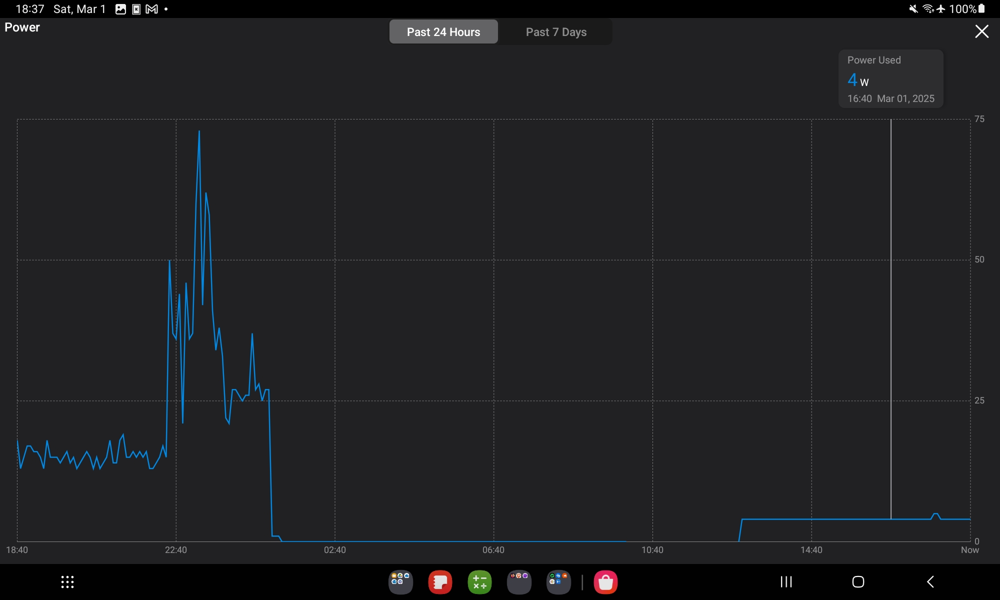

## Benchmarks

### CPU Benchmarks

The first CPU at home was an Intel P3, then an AMD Athlon 64 3200+ came (both 1 core!).

And look at them now...

Any miniPC or SBC, will bring us ~4C/4T CPU:

```sh
sysbench --test=cpu --cpu-max-prime=20000 --num-threads=4 run #4 cores
7z b -mmt4
```

* x300 7960 events/s, total 79.6k events
* x300 7zip 6.2k/24.7k

And a max power from the wall seen of [61W with the Tapo P110](#consumption)

> For now, the x300 with the 5600G is the most powerful CPU I ever had (a little bit more than the x13 and )

* cpx11 (Hetzner amd epyc x86): 12.3k events and 4.5/9k

### Memory Benchmarks

```sh
sudo apt install sysbench
sysbench memory run
```

x300 got 8099Mib/sec

the x13 8164 Mib/sec 

and the Pi 4 4GB ~175MiB/sec (x86)

cpx11 hetzner: ~5245Mib/sec

the Firebat got me 4077Mib/sec


  
  


### GPU Benchmark

Forget about 4k playback with the Pi 4's.


> Get a Pi if you want to do IoT Projects instead, they have great I/O for sensors.

But with x86 MiniPCs/old laptop you are good to go.

Also the Orange Pi 5 can handdle it (with proper configuration).


### Internet Benchmark

```sh
ip addr show
hostname -I

#sudo apt-get install net-tools
#ifconfig
#ifconfig eth0 | grep -A 10 "<global>" #check mac, and transfered packages
ifconfig eth0 | grep "inet " | awk '{ print $2 }' #if ETH Connected - SEE THE LOCAL IP
#ifconfig tailscale0 | grep "inet " | awk '{ print $2 }' #for Tailscale

ping -c 4 192.168.0.1 #gateway
ping -c 4 192.168.0.117 #ping the orange pi which is connected to same device
ping 9.9.9.9 #ping quad9 dns server
```

Ideally, do this with ethernet connection:

```sh
sudo apt-get install speedtest-cli
speedtest-cli #speedtest-cli --simple

sudo snap install fast
fast
#npm install --global fast-cli && fast
```

PCs are great, but even better with proper internet connectivity


  
    


**Local Network**

* Pi4 4GB arm64 - `192.168.0.155`
* Pi4 2GB arm43 - `192.168.0.232`
* x13 `192.168.0.124`

### Disk Benchmarks

Another very important part that affects the performance, **the drives**:

```sh
sudo lshw -C disk  # You'll need sudo and to filter for disks
sudo hdparm -I /dev/sda  # Example for /dev/sda (detailed info of the disk)
sudo apt install ntfs-3g
```




```sh
lsblk #list them again
lsblk -f /dev/sda1 /dev/sdb2 #see the format and the UUID of a couple of blocks
df -h /dev/sda1 #you will see if its mounted (it always starts with /dev)
#df -h | awk '$2 ~ /G/'
#df -h | awk '$2 ~ /T/'
df -h | grep '[GT]' #see both
```

```sh
sudo apt install ntfs-3g

sudo nano /etc/fstab #forever
UUID=some-uuid /mnt/data_ntfs_500 ntfs-3g defaults,uid=1000,gid=1000,umask=0022 0 1
UUID=some-uuid-of-your-drive /mnt/ext4_mount_point_folder ext4 defaults 0 1
```

For one time mount:

```sh
sudo mkdir -p /mnt/data_ntfs_500
sudo mount -t ntfs /dev/sda1 /mnt/data_ntfs_500/ #example with ntfs

sudo mkdir -p /mnt/data_ext_2tb
sudo mount -t ext4 /dev/sdb2 /mnt/data_ext_2tb/ #example with ext4
```

**Mounting** the Crucial 500gb (CT500MX5) - **Example 1**

```sh
sudo mkdir /mnt/crucial500
lsblk -f
sudo mount /dev/sdb1 /mnt/crucial500
```

Systematically mount:

```sh
lsblk #its sdc1
sudo blkid /dev/sdc1 # Replace /dev/sdb1 with your actual partition

#get UUID="f....."
#UUID="your-uuid-here" /mnt/crucial500 ext4 defaults 0 2
##UUID="your-uuid-here" /mnt/crucial500 ext4 defaults 0 2
##UUID="your-uuid-here" /media/jalcocert/Backup2TB ntfs-3g defaults 0 2

sudo nano /etc/fstab #save
sudo mount -a  # Test the /etc/fstab entry
df -h #check its mounted
```

> This one will be there, even after rebot!



**Format** a drive (CT1000MX):

```sh
# sudo apt install gparted  # If you don't have it
# gparted
lsblk
#sudo fdisk /dev/sda1 #partition to be created, sda1
sudo mkfs.ext4 /dev/sda1 #make sure its sda1 the partition you need to erase to EXt4!!

#then mount it
sudo nano /etc/fstab #save
###UUID="8674c809-fb02-4e46-948d-4bac1a219374" /mnt/crucial1000gb ext4 defaults 0 2
sudo mount -a  # Test the /etc/fstab entry
df -h #see it mounted
```

If you havent done it in a while, make some **clean up**:

```sh
docker builder prune
#docker system prune -a
docker volume prune
docker image prune -a
```

## Consumption

As per this [Tapo Smart Plug](https://jalcocert.github.io/JAlcocerT/tapo-p110-review/)

The x13 when in idle:


The Pi4 (4GB), is around ~8C above air temperature:


Due to the typical ~4W that consumes (together with the external SSD).

An additional SSD to the Pi accounts for ~1W, as I observed when adding an extra drive.

The x300 during ~idle, will do ~14w when using linux, or...>25w when in windows 11:



> Mr. Doors, pleaze

## Conclusions


To make the most out of your new homelab, check [the SelfHosting docs](https://jalcocert.github.io/JAlcocerT/docs/selfhosting/)



---

## FAQ


<!-- https://www.youtube.com/watch?v=4qLgpJc2Ghs -->


<!-- https://www.youtube.com/watch?v=LgljPzqAARA -->


**Powering Local AI**

* https://jalcocert.github.io/JAlcocerT/ai-with-iGPU






  
  Probably the **Ollama is the quickest way** to [get LLMs working locally](https://fossengineer.com/selfhosting-llms-ollama), specially if you already have Docker installed.


<iframe width="560" height="315" src="https://www.youtube.com/embed/4qLgpJc2Ghs" frameborder="0" allowfullscreen></iframe>
  
  
  Say Hi to your documents, locally, when you interact with them with [PrivateGPT Freely](https://fossengineer.com/selfhosting-local-llms-with-privateGPT)


<iframe width="560" height="315" src="https://www.youtube.com/embed/LgljPzqAARA" frameborder="0" allowfullscreen></iframe>
  
  
  

  Yet another way to [get LLMs running locally, and with UI](https://fossengineer.com/Generative-AI-LLMs-locally-with-cpu/).
  
  <iframe width="560" height="315" src="https://www.youtube.com/embed/-zNWDTqKF1E" frameborder="0" allowfullscreen></iframe>


  


