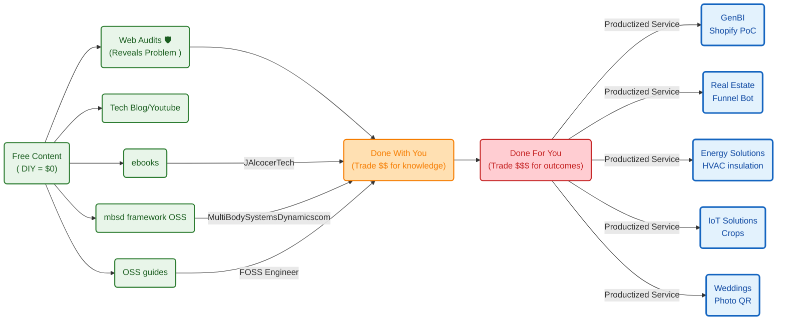

**Tl;DR**

The last piece to combince me that this is enough.


**Intro**

After the post-wedding thoughts, it was time to make this clear.

Specially that im leveraging outreach


## The services

https://github.com/JAlcocerT/jalcocertech/tree/main-site-cloudflare-hub


The flow, from the ones who prefer to trade time for knowledge:



`http://realestate-astro-dev:4321` for moi -> as landing `http://realestate-landing-prod:4321`

You bet that I needed to put something together [to find clients](#my-outreach-setup) for all those products.


### The free ones

Ive consolidating the `diy.jalcocertech` into the `ebook` one.

Particularly at: https://ebooks.jalcocertech.com/books/web-diy/

Bringing the images I had in there:


  
  



#### JAlcocerTech Ebooks 



  


While creating some more images via OpenAI to improve explainability:


Ive also improved the main `www.jalcocertech`

• Done on branch main-site-cloudflare-hub.


#### FOSSEngineer x HomeLab 

There has been several improvements in the foss workflow:


  


#### This blog

I added [agent skills to this public repository](https://github.com/JAlcocerT/JAlcocerT/tree/main/.agents/skills) to help me improve my writting: `zettel-blog-notes` and `blog-post-editor`

```sh

```

It incorporates the **concept of zettelkasten**: one post, one topic.

> A word that i got to know thanks to the files.md project `https://app.files.md/`

> > Now I have `http://localhost:1314/notes/` and skills for this :)


#### JAlcocerTech WebAudits


Ive done few web audits, to people I just met - With email report

Santi, this one goes for you to.

I mean, the new skill that i got:

```sh
make docker-build
make docker-prod-up
```


`https://cabesota.com/`


The proof that you can make money with a shitty landing: `https://genkinfy.com/#faq`

```md
make audit-full-fast URL=https://genkinfy.com/
SKIP_LINKS=false LINK_CHECK_METHOD=${LINK_CHECK_METHOD:-lychee-docker} ./audit-master.sh "https://genkinfy.com/"
╔════════════════════════════════════════════════════════════╗
║                Master Audit - Full Site Analysis           ║
╚════════════════════════════════════════════════════════════╝

Target: https://genkinfy.com/
Orchestration:
 - Lighthouse: ACTIVE
 - Link Check: ACTIVE
 - SEO Crawl:  ACTIVE
 - Security:   ACTIVE

Launching audit phases in parallel...
 → Lighthouse PID=419907
 → LinkCheck PID=419908
 → SEO PID=419909
 → Security PID=419910
 → Latency PID=419911
All phases finished in 32s

━━━━━━━━━━━━━━━━━━━━━━━━━━━━━━━━━━━━━━━━━━━━━━━━━━━━━━━━━━
                FINAL AUDIT RESULTS
━━━━━━━━━━━━━━━━━━━━━━━━━━━━━━━━━━━━━━━━━━━━━━━━━━━━━━━━━━

Performance:              31/100
SEO (Technical):          95/100
Link Integrity:           70/100
Security Headers:         0/100
──────────────────────────────────────────────────────────
OVERALL SITE GRADE:       45/100 ⭐

Master report saved to: ./master-reports/master-20260604-192953.json
```

```sh
LINK_CHECK_TIMEOUT_SECONDS=0 make audit-full URL=https://fossengineer.com
LINK_CHECK_TIMEOUT_SECONDS=0 ./linkcheck-audit.sh https://fossengineer.com docker
```

For **social previews**, use:

  - https://www.opengraph.xyz/url/https%3A%2F%2Febooks.jalcocertech.com
  - `https://cards-dev.twitter.com/validator` (after deploy)


This can be a good addition going forward:

* https://github.com/firecrawl/fireplexity

> Open Source Perplexity like AI search engine with real-time citations, streaming responses, and live data powered by Firecrawl

AI search engine with web, news, and images. You will need firecrawl and groq Apis.

##### Codex CLI WebAudit to Report

The new web audit is deployed normally at:

But hey, if all the goodies are happening within a internal CLI and there is a `.json` that consolidates it all...

cant that be passed to a one time codex prompt with a skill that generates a nice one pager branded report?

* https://platform.openai.com/usage


  



### Productized Services

From the consulting landing, which has received improvements: Committed on `landing-improvements branch`


#### GenBI - Shopify QnA

Initially this is coming from:


  
 


Now, I have:


  
 


```sh

```

### The BEST - DFY

The top of the list.

My attention caring about your problems: 


  


With some tools:

* https://why-postmortem-checks.pages.dev 
* https://pm-pdm-checks.pages.dev

#### Engineering services

Couldnt resist to cold email to the founder of diode as it resonates with me

Stay tuned

Because this resonated a lot with

#### IoT, Crops and Energy

You name it.


it all started here:


  
  


And continued:


  
  


```sh
npx wrangler pages project list
```

* https://go-solar.pages.dev/
* https://aerothermics-landing.pages.dev
* https://solar-trajectory.pages.dev  

The final boss consolidates it all:

```sh
cd ./poc/aerothermics
make dev

cd ./poc/go-solar
make ship
```

https://github.com/JAlcocerT/poc/blob/main/aerothermics/dev-plan.md

Yep, heavily inspired by my latest trip planner: `trip-planner-9lt.pages.dev`

https://jalcocert.github.io/JAlcocerT/thermodynamics/



  
  




  


```sh
make mqtt-listen MQTT_HOST=192.168.1.2 MQTT_TOPIC='pico/#'
#  make arduino-compile
# make serial-fix PORT=/dev/ttyACM0
# make flash # make flash PORT=/dev/ttyACM0
make mqtt-listen MQTT_HOST=192.168.1.2 MQTT_TOPIC='esp32/#'
```

```sh
make sqlite-start MQTT_HOST=192.168.1.2
make dev-clean
```


It ended up working on my x300 at `http://192.168.1.2:3025/`: 

```sh
MQTT_HOST=192.168.1.2 make docker-up
make docker-sqlite-last10
```


> The deepsleep mode of the esp32 has been great so far for this project!

This is coming soon:


  



#### Multi Body Systems Dynamics dot com

I took all the goodies from the github and forgejo repos: *2D/3D*


  



> I couldnt avoid to email again to Gabe Morris :)

---

## Conclusions


  
  


### My OutReach Setup

Coming from the [email outbound setup 101 post section](https://jalcocert.github.io/JAlcocerT/poc-107/#the-only-way-im-shipping-now)


https://github.com/JAlcocerT/Home-Lab/blob/main/z-dns-scripts/google_workspace_dns_check.py

```sh
python3 /home/jalcocert/Home-Lab/z-dns-scripts/google_workspace_dns_check.py getslubnechwile.com
#python3 /home/jalcocert/Home-Lab/z-dns-scripts/google_workspace_dns_check.py getleadarchitect.com
```

I checked the DNS for getslubnechwile.com.

  What’s already in place:

  - NS points to Porkbun nameservers: fortaleza, maceio, curitiba, salvador.
  - MX is set to 1 smtp.google.com., which matches Google Workspace’s current MX target.
  - SPF is present as v=spf1 include:_spf.google.com ~all, which is the Google Workspace-only SPF value. (support.google.com (https://support.google.com/a/answer/140034?hl=en))

  What is not in place yet:

  - I did not find a DKIM TXT record at google._domainkey.getslubnechwile.com or default._domainkey.getslubnechwile.com.
  - I did not find a DMARC TXT record at _dmarc.getslubnechwile.com.
  - Google’s DKIM setup expects a TXT record under a selector._domainkey host, and DMARC expects a TXT record under _dmarc.example.com. (support.google.com
    (https://support.google.com/a/answer/174124?hl=en))

  Verdict:

  - Partially ready, not fully ready yet.
  - DNS is good for Google Workspace mail routing and SPF, but you still need DKIM and DMARC before I’d call it complete.
  - Google also recommends having SPF and DKIM working before enabling DMARC, and waiting up to 48 hours after SPF/DKIM changes before turning DMARC on. (support.google.com
    (https://support.google.com/a/answer/2466580?hl=en))

  One extra note:

  - There is also a Google verification TXT record present: google-site-verification=..., which is useful for Google services but is separate from Workspace mail auth.

  If you want, I can give you the exact missing DKIM and DMARC records to add in Porkbun.

`http://192.168.1.2:3034/explore/repos`

`http://192.168.1.2:3034/jalcocert/leads-slubnechwile/src/commit/c2605d3ded7244d008b17c6ecc310ff36f50ca86/zzz-hormozi-actionplan-leadarchitect.md`

`julita@getleadarchitect.com` for `https://leadarchitect.org/`




1. Get a domain
2. Get a workspace `https://workspace.google.com/`

* `https://admin.google.com/` - from here you can manage the mail user image!

Dont forget to add the DNS and check with `https://mxtoolbox.com/` or with `https://toolbox.googleapps.com/apps/checkmx/`


`http://192.168.1.2:3034/hermesagent/email-outbound-check`

```sh
# source venv/bin/activate
# pip install -r requirements.txt
python email_check.py julita@getleadarchitect.com
python email_check.py any@other-domain.com --json
```







`https://app.smartlead.ai/sign-up`

`https://app.smartlead.ai/app/email-campaigns-v2`

https://app.smartlead.ai/app/email-accounts/emails -> `https://www.youtube.com/watch?v=jUOF5FaFbZs`

will appear at `https://admin.google.com/u/0/ac/owl/list?tab=configuredApps`

look via the given `.apps.googleusercontent.com`


https://app.smartlead.ai/app/email-accounts/emails
https://app.smartlead.ai/app/email-account/19740710/warmup?email=julita.j@getleadarchitect.com




https://www.smartlead.ai/pricing





### Inbound marketing x Branded Videos

In theory, artifacts like ebooks, this blog, fossengineer... should give you inbound traffic.

But

The openAI image gpt 2 is so great that there is really no excuse not to get this right.

Doing 3 min videos (with xyz words aka xyz tokens) and 30 second shorts...

Its just one skill away:

```sh

```

---

## FAQ

### Whats your current agentic setup?

Im using right now herdr *> tmux* to better orchestrate agents sessions and dont go crazy with deliveries waiting for my input.

```sh
herdr #go out with ctrl + b then q
```

Ive tried `https://chat.z.ai/`, Kimi, GLM, Qwen 3.6 Plus and deepseek v4 which are well positioned at `https://arena.ai/leaderboard/agent` via `https://opencode.ai/go`

```sh
choco install opencode
```


> `https://opencode.ai/workspace/wrk_01KTF9F2H7HR7DDPCB6CY0RDD6/go`


### Open Physics

Across the physics series, I have been building tinkering with this OSS stack:

Geometry / CAD / Rendering

- CadQuery - Python-first parametric CAD; your preferred agentic CAD bridge.
- OpenSCAD - simple code-based CSG CAD, good for lightweight STL-style parts.
- FreeCAD - GUI CAD, FEM workbench, STEP/IGES workflows.
- Blender - mesh-based rendering, animation, visual realism, Python scripting.
- Build123d - mentioned as a more Pythonic CadQuery-like alternative.
- Three.js - WebGL visualization / web rendering.
- Matter.js - 2D physics engine for web demos.

MBSD / Mechanics / Symbolic Math

- SymPy - deriving equations symbolically.
- NumPy / SciPy - numerical math, transforms, FFT, simulation support.
- Your own MBSD Python framework - JAlcocerT/mbsd.
- Your own related repos: Slider-Crank, mechanism, Bike_dynamic_simulator, Py_Double_Pendulum, ThreeBodies.

FEM / Structural / Multiphysics
From content/blog/eng-fem.md:167:

- FreeCAD FEM
- CalculiX
- Elmer FEM
- Code_Aster
- Salome-Meca
- FEniCS / FEniCSx
- Firedrake
- SfePy
- CALFEM for Python
- Akantu
- Gmsh
- Netgen
- PyVista
- ParaView

CFD / Fluids
From content/blog/eng-fluid-mechanics.md:330:

- OpenFOAM
- FreeCAD CfdOF
- Elmer FEM
- pySPH
- ParaView
- OpenModelica

Thermal / Thermodynamics
From content/blog/eng-heat-transfer.md:594:

- Modelica
- OpenModelica
- OMPython
- PyMarl
- HeatraPy
- PySpice was also mentioned in the broader thermal/electronics tooling context.

Electronics / Electromagnetism / IoT From content/blog/eng-electronics.md:390:

- KiCad
- Atopile
- PySpice
- OpenModelica
- Schemdraw
- Velxio
- Arduino IDE
- ESPHome
- EMQX
- MQTT
- Prometheus
- Grafana
- TimescaleDB
- Elasticsearch / Logstash as downstream telemetry/data options.

Content / Visualization

- Remotion - videos as code for physics/engineering explanations.
- Matplotlib - plots, GIFs, validation visuals.
- D3.js - mentioned as promising for data/visualization.

If I had to reduce your physics OSS stack to the “core pipeline,” it is:

SymPy / NumPy / SciPy
→ MBSD Python framework
→ CadQuery / OpenSCAD / FreeCAD
→ Gmsh / CalculiX / Elmer / OpenFOAM
→ PyVista / ParaView / Blender / Three.js / Remotion
→ MQTT / EMQX / Grafana for real-world sensor feedback

The strongest recurring pattern in your posts is: physics as code → geometry as code → simulation as code → visualization as code → sensors to ground the model.


### DNS is a thing

YOu could expect that from the [recent selfhosted post around DNS](https://jalcocert.github.io/JAlcocerT/private-dns-with-docker/#conclusions)


  
  


While you wait for Google's internal cache to catch up, it’s the perfect time to look at what you actually just built.

Think of your email domain like a digital house. Without these 5 checks, your house has no locked doors, no mailbox, and anyone can pretend to be you.

Here is exactly why each of those 5 checks matters for your domain `getslubnechwile.com`:

1. NS (Name Servers) — *The Map*

* **What it does:** Tells the entire internet exactly where your domain's DNS records are stored (in your case, Porkbun).
* **Why it matters:** If your Name Servers are broken or misconfigured, your website won't load, and your email servers can't be found. It is the absolute foundation. If NS is down, nothing else works.

2. MX (Mail Exchange) — *The Mailbox*

* **What it does:** Specifies the exact destination server that handles incoming emails for your domain (`SMTP.GOOGLE.COM`).
* **Why it matters:** Without an MX record, if someone sends an email to `you@getslubnechwile.com`, the internet looks at your domain, sees no mailbox, and bounces the email back to the sender with a "User Not Found" error. **MX is mandatory to receive email.**

3. SPF (Sender Policy Framework) — *The Guest List*

* **What it does:** A public list in your DNS that explicitly names the servers allowed to send emails on your behalf (e.g., Google Workspace).
* **Why it matters:** When you send an email to a client, their email provider (like Yahoo) checks your SPF record. If the email came from Google, and your SPF says *"Google is allowed,"* it passes. If a scammer in another country tries to send an email pretending to be you, their server won't be on your SPF guest list, and their email will be flagged as suspicious.

4. DKIM (DomainKeys Identified Mail) — *The Wax Seal*

* **What it does:** Automatically attaches an invisible, cryptographic digital signature to the header of every single email you send.
* **Why it matters:** While SPF checks *where* the email came from, DKIM checks if the email was *tampered with* mid-transit. The receiving server uses the public key you just put in your DNS to verify the signature. If the signature matches, it guarantees that no hacker intercepted your email and changed the content (like altering an invoice or a link).

5. DMARC (Domain-based Message Authentication) — *The Security Guard*

* **What it does:** Ties SPF and DKIM together. It tells receiving servers exactly what to do if an email fails the SPF or DKIM tests.
* **Why it matters:** Gmail and Yahoo recently made DMARC **mandatory** to prevent spam.
* With your current policy (`p=none`), it tells servers: *"If an email fails SPF/DKIM, let it through but log it so I can see who is trying to spoof me."*
* In the future, you can upgrade this to `p=quarantine` (send failures to spam) or `p=reject` (block them entirely), giving you total control over who can use your domain name.


Summary: The Ultimate Filter

When you send an email from Google Workspace now, the receiving server checks:

1. **SPF:** Is this IP authorized? **(Yes)**
2. **DKIM:** Is the digital signature valid and unaltered? **(Yes)**
3. **DMARC:** Do the SPF and DKIM domains match the domain in the "From" header? **(Yes)**

Because your script shows a clean sweep of **OK**, your domain now has a stellar reputation with global spam filters. Your emails are highly likely to go straight to the inbox!

https://admin.google.com/ac/apps/gmail/authenticateemail

This is excellent news! Your script is spot on. Seeing `MX: OK`, `SPF: OK`, and `NS: OK` means the absolute hardest part is over: **your domain `getslubnechwile.com` is now successfully linked to Google Workspace**, and you can actively send and receive emails.

The two remaining items (`DKIM: missing` and `DMARC: missing`) are security layers. Without them, your emails have a much higher chance of hitting the spam folder, especially when sending to other Gmail or Yahoo accounts.

Here is exactly how to knock out those last two checks:


python3 /home/jalcocert/Home-Lab/z-dns-scripts/google_workspace_dns_check.py getslubnechwile.com --selector google
Domain: getslubnechwile.com
Verdict: ready

```md
[OK] NS
  - NS records: fortaleza.ns.porkbun.com., maceio.ns.porkbun.com., curitiba.ns.porkbun.com., salvador.ns.porkbun.com.

[OK] MX
  - MX records: 1 smtp.google.com.

[OK] SPF
  - SPF record: v=spf1 include:_spf.google.com ~all

[OK] DKIM
  - google._domainkey.getslubnechwile.com: v=DKIM1; k=rsa; p=MIIBIjANBgkqhkiG9w0BAQEFAAOCAQ8AMIIBCgKCAQEAwE3hRwT3PmNcHbbDgI2gyYZYtYejxVedRw+19KIuM7YL10mHAnZ+ J4p3ezdxlSS3DQYzopoOEYOnWhy6s9nLyfBnRRu79ZaaVtJI1uL9PuqxRIMM14eWepgrRRyU55vFiVcVnaTZWZxXvz/hBqVygPn Z360ynsmRJ+0/GVact1R/dXL8pOqebh8+NPAdfljpWnIyXyjOQnqsXzn4PLbtJkdIvTg3rLbwi1oeil71/UhTQpT+ySHKMi0Os yF3AQ5yVkvUfAXV305AyfhcZNGD9ZXRbGSiWmDlM9Jy4VCWBPzlT4MiQOauUUNPsJzBIHEuSlKjRND29po5oYW/+YkbBQIDAQAB

[OK] DMARC
  - DMARC record: v=DMARC1; p=none;
  - Policy: none
```

---

### 1. Fix DKIM (DomainKeys Identified Mail)

DKIM adds a hidden cryptographic signature to your emails, proving they actually came from you and weren't tampered with.

1. Log into your [Google Admin Console](https://admin.google.com).
2. Go to **Apps** > **Google Workspace** > **Gmail** > **Authenticate email**.
3. Select your domain `getslubnechwile.com` from the dropdown.
4. Click **Generate New Record**.
* *Keep the default settings (2048-bit key length and `google` as the prefix selector).*


5. Google will output a **TXT record Name** (usually `google._domainkey`) and a very long **TXT record Value**. Copy both.
6. Log into your domain registrar (where you manage your DNS) and add a new record:
* **Type:** `TXT`
* **Host / Name:** `google._domainkey`
* **Value:** *(Paste the long string from Google)*
* **TTL:** `1 Hour` (or 3600)


7. **Crucial Step:** Go back to that same Google Admin page and click **Start Authentication**. *(Note: Google won't let you activate this until it detects the DNS change, which can take anywhere from a few minutes to an hour).*

---

### 2. Fix DMARC (Domain-based Message Authentication)

DMARC builds on top of your SPF and DKIM. It tells mailbox providers what to do if someone tries to spoof your email address.

Since you are just setting it up, you should start with a **"none"** policy. This tells servers: *"Just monitor my emails for now; don't block anything yet."*

In your domain registrar's DNS settings, add this record:

* **Type:** `TXT`
* **Host / Name:** `_dmarc` (or `_dmarc.getslubnechwile.com` depending on your registrar)
* **Value:** `v=DMARC1; p=none;`
* **TTL:** `1 Hour` (or 3600)

---

### The Final Test

Once you save those two records in your DNS manager, give it about 30–60 minutes for the servers to update. Then, run your script again. You should get a perfect clean sweep of `OK` straight down the line!

**No, you do not need to get any specific value from your Google Workspace admin console for DMARC.**

Unlike DKIM, which requires a unique, long cryptographic key generated specifically for your account by Google, DMARC is completely generic. You construct the text value yourself.

As long as you create a new **TXT record** in your domain registrar with these exact details, Google (and all other mail servers) will automatically recognize it:

* **Type:** `TXT`
* **Host/Name:** `_dmarc`
* **Value:** `v=DMARC1; p=none;`

### Why don't you need a Google value?

DMARC is an open, industry-wide standard rather than a Google-proprietary feature. By placing `_dmarc` in your DNS, you are telling the entire internet (Gmail, Yahoo, Outlook, etc.): *"Hey, look at my SPF and DKIM records to verify my emails. If they don't match, just log it (`p=none`) for now."*

Once you save that record, your script should flip to a perfect **OK** for DMARC!