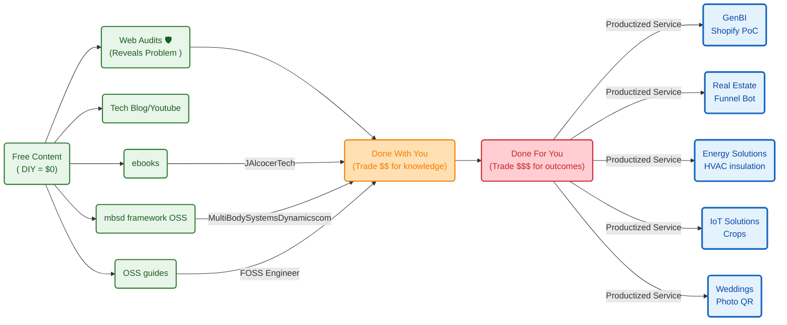

**Tl;DR**

Ive tried [t3 code](https://github.com/pingdotgg/t3code/releases) with my Pi.

**Intro**

* WHY Im writting this post: 
* What [Ive learnt](#conclusions) with it: *Ive ended*


As always i go to termix and see whats going on:

```sh
#ssh http://192.168.1.18:3034
htop #btop
```

I had an [hermes agent](https://fossengineer.com/hermes-agent-self-improving-ai-agent/) that pushed to [this repo](https://github.com/JAlcocerT/hermesagent/tree/tinker/hermesagent/electronics-101) after I reviewed the quality at my local Forgejo.


```sh
ssh -T -o BatchMode=yes forgejo-home
# gh auth status #I disabled mine to avoid conflicts while tinkering
```

* Get a repo
* Then made it available at forgejo for the agent http://192.168.1.2:3034/hermesagent/electronics-101
* Then put it back to [gh here](https://github.com/JAlcocerT/hermesagent/tree/tinker/hermesagent/electronics-101)
* And test with https://webaudit.jalcocertech.com/

{}

Forgejo Write Access Validation

Date: 2026-08-19  
Local machine user: `jalcocert`  
Forgejo SSH account validated: `hermesagent`  
Forgejo host alias: `forgejo-home`  
Forgejo SSH endpoint: `git@192.168.1.2:2235`

Summary

Write access to the local Forgejo instance was validated successfully for the configured SSH user `hermesagent`.

The validation checked:

- Local Git identity and repository remotes.
- SSH authentication to Forgejo.
- Actual repository write permission by pushing a temporary branch.
- Cleanup by deleting the temporary branch.
- Confirmation that no temporary test refs remained afterward.

HTTP/password-based remotes were not validated. The successful validation applies to the configured SSH access through `forgejo-home`.

SSH Configuration Found

The local SSH config contains:

```sshconfig
Host forgejo-home
    HostName 192.168.1.2
    Port 2235
    User git
    IdentityFile ~/.ssh/id_ed25519_forgejo
    IdentitiesOnly yes
```

The Forgejo SSH key files found locally were:

- `~/.ssh/id_ed25519_forgejo`
- `~/.ssh/id_ed25519_forgejo.pub`

Global Git Identity

The global Git config includes:

```text
user.name=hermesagent
user.email=alice@example.com
```


Authentication Check

Command run:

```bash
ssh -T -o BatchMode=yes forgejo-home
```

Result:

```text
Hi there, hermesagent! You've successfully authenticated with the key named hermesagent@pi-home, but Forgejo does not provide shell access.
If this is unexpected, please log in with password and setup Forgejo under another user.
```

Conclusion: SSH authentication to Forgejo succeeded as `hermesagent`.

Write Permission Check

A temporary branch was pushed and then deleted from each Forgejo SSH remote.

Temporary branch used:

```text
codex-write-test-20260819150805-3599
```

Test method:

```bash
git push <remote> HEAD:refs/heads/codex-write-test-20260819150805-3599
git push <remote> :refs/heads/codex-write-test-20260819150805-3599
```

This validates actual write access because Forgejo accepted creation of a new remote branch. 

The following deletion validates cleanup permission and confirms the test branch did not remain.

Repositories Validated

| Local repository | Forgejo remote | Result |
| --- | --- | --- |
| `/home/jalcocert/electronics-101` | `forgejo-home:hermesagent/electronics-101.git` | Write OK, cleaned up |
| `/home/jalcocert/email-outbound-checks` | `forgejo-home:hermesagent/email-outbound-check.git` | Write OK, cleaned up |
| `/home/jalcocert/gosolar-spain` | `forgejo-home:hermesagent/gosolar-spain.git` | Write OK, cleaned up |
| `/home/jalcocert/mbsd` | `forgejo-home:hermesagent/mbsd.git` | Write OK, cleaned up |
| `/home/jalcocert/pi-connectivity` | `forgejo-home:hermesagent/pi-connectivity.git` | Write OK, cleaned up |
| `/home/jalcocert/selfhosted-connectivity` | `forgejo-home:hermesagent/selfhosted-connectivity.git` | Write OK, cleaned up |
| `/home/jalcocert/optimum-path` | `forgejo-home:hermesagent/optimum-path.git` | Write OK, cleaned up |

Cleanup Verification

After deletion, each repository was checked with:

```bash
git ls-remote --heads <remote> codex-write-test-20260819150805-3599
```

Results:

```text
forgejo-home:hermesagent/electronics-101.git remaining_test_refs=0
forgejo-home:hermesagent/email-outbound-check.git remaining_test_refs=0
forgejo-home:hermesagent/gosolar-spain.git remaining_test_refs=0
forgejo-home:hermesagent/mbsd.git remaining_test_refs=0
forgejo-home:hermesagent/pi-connectivity.git remaining_test_refs=0
forgejo-home:hermesagent/selfhosted-connectivity.git remaining_test_refs=0
forgejo-home:hermesagent/optimum-path.git remaining_test_refs=0
```


Conclusion: the temporary validation branch was removed from all checked Forgejo repositories.

Additional Remotes Observed

The following local repositories use GitHub remotes and were not part of the Forgejo write validation:

- `/home/jalcocert/Home-Lab`
- `/home/jalcocert/RPi`
- `/home/jalcocert/poc`
- `/home/jalcocert/RPi/Z_SelfHosting/rpi-mjpg-streamer`
- `/home/jalcocert/.hermes/hermes-agent`

The following local repositories use HTTP remotes to the local Forgejo web endpoint and were not validated for HTTP/password write access:

- `/home/jalcocert/leads-slubnechwile`: `http://192.168.1.2:3034/JAlcocerT/leads-slubnechwile`
- `/home/jalcocert/optimum-path`: `http://192.168.1.2:3034/jalcocert/optimum-path`

Final Result: SSH-based Forgejo write access is confirmed for `hermesagent` on the validated repositories.

{}


{}


{}


[Herdr](https://fossengineer.com/herdr-terminal-agent-multiplexer/) was interesting on top of tmux

<!-- www.youtube.com/watch?v=ijI3iOOcEog -->



coming from the [experiment on heat pump viability](https://jalcocert.github.io/JAlcocerT/how-to-check-hot-pump-viability/#the-experiment)

and the [data driven insulation](https://jalcocert.github.io/JAlcocerT/data-driven-insulation-evaluation/)


Coming from [this post](https://jalcocert.github.io/JAlcocerT/jalcocertech-services-snapshot/).


https://github.com/JAlcocerT/jalcocertech-services/blob/master/docs/destilled-ebooks/z-read-books-notes/z-hormozi-curated.md

https://github.com/JAlcocerT/jalcocertech/tree/main-site-cloudflare-hub


## Real Engineering

Lets use [open physics](https://jalcocert.github.io/JAlcocerT/jalcocertech-services-snapshot/#open-physics) to do cool stuff

### Energy Solutions

Because this matters

1. PV optimum orientation
2. PV+Heat
3. PV+Batteries
4. PV +
5. Building x Sun rays
6. AC for my house: https://jalcocert.github.io/JAlcocerT/data-driven-insulation-evaluation/#which-ac-is-enough-for-my-house

https://jalcocert.github.io/JAlcocerT/data-driven-insulation-evaluation/


All together: 


#### Heat Pumps are so cool

If you have played with one of these BLDC pumps

Thats exactly the knowledge that you needed.

In modern residential heat pump systems, variable flow is managed by **High-Efficiency Variable Speed ECM (Electronically Commutated Motor) Circulator Pumps** controlled dynamically by the heat pump's central brain.

Instead of a basic 2-wire DC setup or wasteful valve throttling, these systems use smart circulator pumps (such as Wilo-Yonos/Para or Grundfos UPM3/Alpha) utilizing two primary control layers:

1. The Electrical / Communication Interface

Modern heating circulators receive independent power and dedicated external control signals via a multi-wire interface (typically 4–5 wires):

* **Dedicated PWM Signal (Bi-directional / Mini-PWM):** The heat pump controller outputs a low-voltage (5V/12V or 24V) high-frequency PWM signal strictly for data communication (separate from AC power). The pump reports back status and actual flow via feedback pulses.
* **0–10V Analog DC Voltage:** The heat pump outputs a variable DC voltage where 0V = Standby/Off, 1–2V = Minimum modulation (~15%), and 10V = 100% full capacity.
* **Digital Bus (LIN / CAN / Modbus):** Common in high-end inverter heat pumps for precise telemetry (RPM, flow rate in L/min, fluid temperature, error codes).

2. Control Strategies & Logic

The heat pump's micro-controller modulates the pump speed in real-time according to one of several algorithms:

* **Constant Temperature Differential ($\Delta T$ Control):**
* **How it works:** The controller monitors both the supply (flow) and return line temperature sensors. It modulates pump speed dynamically to maintain a steady temperature drop (usually **$5\text{ K}$ for radiant underfloor heating** or **$7\text{–}10\text{ K}$ for low-temp radiators**).
* **Why it matters:** As the compressor modulates up or down to match outdoor weather, the pump speeds up or slows down to keep heat transfer at peak thermodynamic efficiency ($COP$).


* **Proportional Pressure Control ($\Delta p\text{-v}$):**
* **How it works:** Used when individual room thermostatic valves (TRVs) or underfloor zone actuators open and close.
* **Why it matters:** As zones shut off, the pump senses the rising hydraulic resistance and automatically dials down its speed, eliminating pipe whistling, cavitation noise, and saving electricity.


* **Constant Pressure Control ($\Delta p\text{-c}$):**
* Maintains a constant differential pressure across the manifold regardless of how many individual loops are calling for heat.


Summary Comparison: Heat Pump vs. Basic DC Control

| Feature | Residential Heat Pump Circulator | Small 2-Wire DC Pump |
| --- | --- | --- |
| **Speed Control Method** | Dedicated low-voltage signal (PWM / 0–10V / LIN bus) | Variable DC input voltage bucking |
| **Logic Location** | Onboard heat pump firmware balancing $\Delta T$ & refrigerant cycle | External user dial or fixed resistance |
| **Power Consumption** | **3W to 45W** (Self-adjusting ECM / Permanent Magnet) | Fixed 19W unless manually stepped down |
| **Hydraulic Protection** | Integrated differential pressure sensing & anti-seize cycle | None (requires external relief/bypass valve) |

A residential air-to-water heat pump operates using **two separate, sealed fluid circuits** that interface through a specialized heat exchanger called a **condenser** (often a brazed plate heat exchanger).

---

### Circuit 1: The Refrigerant Loop (Thermodynamic Core)

* **Medium:** High-pressure chemical refrigerant (e.g., R32, R290 propane, or R410A).
* **Mover:** The high-power **compressor** (1,000W–5,000W+).
* **Role:**
1. **Evaporator (Outdoor Unit):** Liquid refrigerant boils at very low temperatures (e.g., $-20^\circ\text{C}$ to $-5^\circ\text{C}$), absorbing latent heat from outdoor air drawn across fins by a large fan.
2. **Compressor:** Squeezes the gaseous refrigerant into a high-pressure, superheated gas ($60^\circ\text{C}\text{–}85^\circ\text{C}$).
3. **Expansion Valve:** Drops the refrigerant pressure back down to restart the cycle.

---

### The Bridge: Brazed Plate Heat Exchanger (BPHE)

A compact block composed of dozens of corrugated, razor-thin stainless steel plates brazed together in alternating layers.

* Hot refrigerant gas flows down every odd channel.
* Cold return water flows up every even channel in the opposite direction (counter-flow).
* Heat passes instantly through the thin steel plates without the refrigerant and water ever physically mixing. As heat leaves the refrigerant, it condenses back into liquid.

---

### Circuit 2: The Hydronic Water Loop (Home Distribution)

* **Medium:** Pressurized water (often mixed with anti-corrosion inhibitors and glycol).
* **Mover:** The small **ECM circulator pump** (10W–50W).
* **Role:**
1. Receives the heat transferred across the plates, warming up from ~$\text{30}^\circ\text{C}$ to ~$\text{35}^\circ\text{C}$ (for underfloor heating).
2. Circulates through underfloor heating loops, radiators, or the domestic hot water (DHW) cylinder coil.
3. Returns to the heat exchanger after radiating thermal energy into the living space.

Monobloc vs. Split Architecture

Where these two circuits meet depends on the heat pump's design:

| Design | Where Circuit 1 Ends & Circuit 2 Begins | Piping Entering the House |
| --- | --- | --- |
| **Monobloc** | The heat exchanger is inside the **outdoor unit** | **Water pipes** run through the wall into the home |
| **Split System** | The heat exchanger is inside the **indoor unit** (hydrobox) | **Refrigerant copper lines** run through the wall |


Modern residential heat pump compressors use a 3-phase **Brushless DC (BLDC) motor**—specifically referred to in HVAC terminology as a **PMSM** (Permanent Magnet Synchronous Motor) or simply an **Inverter Compressor**.

The electrical setup brings the concept full circle back to your FPV drone:

---

### How the Compressor Motor is Driven

Unlike your 19W pump (which hides its tiny DC driver internally) and older legacy heat pumps (which used single-speed AC induction motors), a modern heat pump compressor is driven by an external, high-power **Inverter Drive** (essentially a giant industrial ESC).

```
Mains AC Power (230V/400V)
          │
          ▼
   [ Rectifier / PFC ]      ──> Converts AC into High-Voltage DC (~320V–600V DC)
          │
          ▼
 [ Inverter Board (ESC) ]   ──> Fast IGBT / SiC MOSFET power switches
          │
          ▼  (3 Phase Wires: U, V, W)
 [ BLDC / PMSM Compressor ] ──> Sealed twin-rotary or scroll motor inside refrigerant dome

```

---

### Connecting the Concepts: FPV Drone vs. Pump vs. Compressor

| Feature | Your FPV Drone Motor | Your 19W Watering Pump | Heat Pump Inverter Compressor |
| --- | --- | --- | --- |
| **Motor Type** | 3-Phase Sensorless BLDC | 3-Phase BLDC | 3-Phase Permanent Magnet BLDC / PMSM |
| **ESC / Inverter** | **External** (4-in-1 ESC board) | **Internal** (Epoxy-potted micro-IC) | **External** (Large aluminum heatsink Inverter Board) |
| **Operating Voltage** | Low Voltage DC (e.g., 4S–6S / 16V–25V) | Low Voltage DC (e.g., 12V / 24V) | High Voltage DC (rectified **~350V to 600V DC**) |
| **Wiring** | **3 Phase Wires** (U, V, W) | **2 DC Wires** (+ / -) | **3 Heavy Terminals** (U, V, W) sealed through glass-to-metal pins |
| **Control Logic** | Back-EMF / Zero-crossing (or FOC) | Hall-sensor / Basic commutation IC | **Field-Oriented Control (FOC)** with Space Vector PWM |

They are called **"inverters"** because the electrical circuit literally **inverts direct current (DC) back into alternating current (AC)** at an adjustable frequency to control motor speed.

In **electrical engineering** terms:

* **Rectifier:** Converts **AC $\rightarrow$ DC**
* **Inverter:** Converts **DC $\rightarrow$ AC**


> In fact, I was simulating rectifiers and inverters :)

---

The Problem with Direct Grid AC

Grid power from your wall outlet is locked at a fixed frequency and voltage (e.g., $230\text{V}$ at $50\text{Hz}$ or $120\text{V}$ at $60\text{Hz}$).

An AC motor plugged straight into the wall is forced to spin at a fixed speed governed by that frequency:

$$\text{Speed (RPM)} = \frac{120 \times \text{Frequency}}{\text{Number of Motor Poles}}$$

At a fixed $50\text{Hz}$, a standard 2-pole motor will always spin at roughly **$3000\text{ RPM}$**. It has only two states: **100% full speed** or **0% completely off**.


How the "Inverter" Solves This in 3 Stages

To make the motor run at any custom speed (e.g., 20%, 45%, or 90%), the system must create its own custom frequency on demand. It does this in three steps:

```
Step 1: Rectification        Step 2: DC Bus          Step 3: INVERSION
  Mains AC (50Hz fixed)   ──>   Raw DC Power   ──>   Synthesized AC/Pulsed Drive
     [ AC to DC ]                 [ Clean ]            [ DC to AC (Variable Hz) ]

```

1. **Rectification (AC $\rightarrow$ DC):** Diodes convert the fixed $50\text{Hz}$ grid AC power into raw DC voltage ($\sim 325\text{V} \text{ DC}$).
2. **Filtering (DC Link):** Heavy capacitors smooth the voltage into a stable DC reservoir.
3. **Inversion (DC $\rightarrow$ AC) — *Where the name comes from*:** High-power electronic switches (IGBTs or MOSFETs) switch on and off thousands of times per second. By chopping the DC voltage, the circuit **inverts** that steady DC back into a simulated 3-phase AC waveform with an **infinitely adjustable frequency** (e.g., anywhere from $10\text{Hz}$ up to $120\text{Hz}$).

Why Marketing Kept the Name

The stage that creates the variable speed is the **DC-to-AC Inverter stage**.

Manufacturers began labeling entire appliances (air conditioners, heat pumps, refrigerators, washing machines) as **"Inverter" models** to distinguish these modern, variable-speed, energy-saving units from old-fashioned, noisy "On/Off" appliances.

---

### Why Use a BLDC Inverter Instead of Basic AC?

* **Stepless Modulation (10%–100% capacity):** Instead of noisily banging on and off at full blast like older single-speed fridges/ACs, the inverter varies the driving frequency smoothly. On a mild day, it throttles down to run slowly and whisper-quiet on just 300W–500W.
* **Extreme Efficiency:** Permanent magnet BLDC rotors eliminate the rotor electrical losses ($I^2R$ copper losses) inherent in traditional AC induction motors.
* **No Massive Inrush Current:** Soft-starting the BLDC motor eliminates the huge 50A–80A starting surge (locked-rotor amps) typical of legacy compressors, preventing home lights from flickering.

### Conversion Losses in the Inverter Drive

The conversion from grid AC $\rightarrow$ DC $\rightarrow$ synthesized 3-phase AC has an overall electrical efficiency of **95% to 98%**, meaning the conversion loss is only **2% to 5%**.

```
AC Grid In (100%) ──> [Rectifier / PFC] ──> [DC Bus] ──> [Inverter / IGBTs] ──> Motor (95–98%)
                         (~1–2% loss)                       (~1–3% loss)

```

* **Where the loss goes:** Mainly switching losses and internal resistance in the power transistors (IGBTs / MOSFETs), dissipating as low-grade heat on the drive’s aluminum heatsink.
* **Why it is worth it:** Sacrificing **3%** of power in electronic conversion allows the compressor to modulate to lower speeds, saving **30% to 50%** in thermodynamic energy compared to cycling an on/off motor at full blast.

---

### Are Solar-Assisted Heat Pumps Using AC or DC Compressors?

Solar-assisted heat pumps divide into two architectures depending on their system design:

#### 1. Standard Grid-Tied PV Systems (AC Coupled)

Most residential rooftop solar installations use standard inverter heat pumps powered via the home's main AC electrical panel.

* **Flow:** Solar Panels (DC) $\rightarrow$ Solar Inverter (AC) $\rightarrow$ Heat Pump Inverter (DC $\rightarrow$ 3-Phase AC).
* **Why it's common:** Allows the heat pump to draw from the electrical grid at night and feed excess solar power back to the grid during sunny peaks without dedicated proprietary wiring.

#### 2. Direct-DC / Hybrid Solar Heat Pumps (DC Coupled)

Specialized off-grid or solar-hybrid systems (e.g., Solimpeks, Masterflux, Boyard) feed solar energy directly into the DC link:

* **Flow:** Solar PV (DC) $\rightarrow$ MPPT DC-DC Regulator $\rightarrow$ Internal Compressor Inverter $\rightarrow$ 3-Phase BLDC motor.
* **No Solar AC Inverter Needed:** Because the compressor's inverter runs internally on a high-voltage DC bus, DC solar power feeds straight into that DC stage. This eliminates the round-trip conversion penalty ($10\%\text{–}15\%$ saved).
* **Grid Backup:** If a cloud passes, the onboard rectifier seamlessly draws supplemental power from the AC grid to keep the DC bus charged.

**MPPT** and **HEMS** are two key technologies that optimize energy flow in modern solar and smart-home setups: MPPT handles **hardware-level electrical efficiency**, while HEMS handles **system-level software automation**.

---

### 1. MPPT (Maximum Power Point Tracking)

**MPPT** is an electronic algorithm and DC-DC converter circuit built inside solar inverters and charge controllers. Its job is to extract the maximum possible electrical power from your solar panels under varying sunlight and temperature conditions.

* **The Problem:** Solar panels have a non-linear relationship between voltage and current. If you draw too much current, the panel voltage collapses; if you don't draw enough, current drops. Power output ($\text{Watts} = \text{Volts} \times \text{Amps}$) peaks at only one exact combination of voltage and current, called the **Maximum Power Point ($V_{\text{mp}}, I_{\text{mp}}$)**.
* **How It Works:** As clouds pass or the panels heat up, this sweet spot constantly shifts. The MPPT controller continuously sweeps and adjusts its internal electrical resistance thousands of times a second to keep the panels operating at peak power.
* **Impact:** An MPPT controller harvests **20% to 30% more energy** than an older, direct-connection PWM controller.

---

### 2. HEMS (Home Energy Management System)

**HEMS** is the "central brain" (software and smart controller hardware) that orchestrates energy generation, storage, and consumption across the entire house.

Instead of having isolated devices operating blindly, a HEMS coordinates:

* **Solar PV Generation** (rooftop panels)
* **Home Battery Storage** (charging/discharging)
* **EV Chargers** (dynamic car charging)
* **Heat Pumps & Water Heaters** (SG-Ready / thermal storage)
* **Dynamic Grid Tariffs** (hourly electricity pricing)

---

### How They Compare & Work Together

| Feature | MPPT | HEMS |
| --- | --- | --- |
| **Primary Role** | Hardware-level power extraction | Whole-home energy scheduling & optimization |
| **Where It Lives** | Inside the solar inverter / charge controller | Dedicated gateway box or cloud/local software hub |
| **Decides...** | *"What is the best voltage to pull maximum watts from the panels right now?"* | *"Should excess solar go into the EV, the home battery, or heat the hot water tank?"* |
| **Timescale** | Milliseconds (electrical tracking) | Minutes to hours (pricing, weather, and load forecasts) |

**In practice:** The **MPPT** ensures your panels generate the absolute maximum wattage possible; the **HEMS** decides in real-time where those watts can be used to save the most money.

### IoT

https://jalcocert.github.io/JAlcocerT/data-driven-insulation-evaluation/


#### Crops


### FPV

You can [prepare to ULM/PPL](https://github.com/JAlcocerT/poc/tree/main/ulm-ppl): `https://ulm-ppl-test.pages.dev/`

Or just get ready to *DYOR* and make a DIY dron.

Before flying, make sure you are aware about licenses, permissions, insurances and limitations

#### FPV Telemetry

1. Make sure to understand the limit of your batteries: 18650 (), LiPo 1S (3.5-4.2)

| Parameter | Standard 18650 Li-ion | Standard 1S LiPo |
| --- | --- | --- |
| **Fully Charged** | **4.2V** | **4.2V** |
| **Nominal (Average)** | **3.6V – 3.7V** | **3.7V** |
| **Cut-off / Empty** | **2.8V – 3.0V** | **3.0V** |

> You can configure EdgeTX to inform you about battery level in real time

2. Get ready to perform RCA from telemetry when you'll have [a fpv crash](https://youtu.be/4opTp09Ne7A)

Then perform [damage diagnosis](https://youtube.com/shorts/OPuNbaIYuRM)


### Mechanism Design

With the release of this OSS framework for mbsd:


#### Multi Body Systems Dynamics dot com

I took all the goodies from the github and forgejo repos: *2D/3D*

not https://multibodysystemdynamics.pages.dev/ [this](https://github.com/JAlcocerT/Slider-Crank/tree/main/landing) but 
https://multibodysystemsdynamics.com/

So you can [continue where you left it](http://192.168.1.2:3034/hermesagent/mbsd/src/branch/oss-core-2d/web) `http://192.168.1.18:5173/`


  



> I couldnt avoid to email again to Gabe Morris :)

## Others

https://jalcocert.github.io/JAlcocerT/jalcocertech-services-snapshot/#productized-services

### D&A

Go ask unconfortable [questions](https://jalcocert.github.io/JAlcocerT/questions-for-engineers/): *smart or it does NOT ship*

* https://why-postmortem-checks.pages.dev
* https://pm-pdm-checks.pages.dev

### homelab


  
  


### Attract and Convert

Every business has its own delivery

But every business owner will resonate when you ask [how they are getting customers](https://jalcocert.github.io/JAlcocerT/poc-107/#the-service-to-rule-them-all)


1. With a proper website: webaudits here

2. With outbound marketing: get leads, enrich leads, reachout via email








---

## Conclusions

This is getting traction:


  



I was clearing the initial real estate and genbi independent PoCs done with gemini earlier this year and brought them/improved at the PoC repo, here and here:

```sh
http://realestate-landing-prod:4321
http://shopify-landing-prod:4321
```

For webaudits, ive done some improvements `http://auditmagnet-prod:3001`



Also, the daily notes have stopped to flow here and the cv-laitex similarly, just to be part of a personal / career folders inside my services.

---

## FAQ

### Interesting Articles

* `https://www.seangoedecke.com/llms-reward-expertise/`

### OSS Journaling

I started a repo to use logseq and do `.md` notes.

I ended up just writing `.md` via vscode

the downside? 

I can just do so in laptops that i own to get the sync via github

In case that you will work outside hardware you control, you can always go with other alternatives like silverbullet, or: https://fossengineer.com/files-md-local-first-markdown-notes/

Its an **awsome PWA** that can write local files *and `.weba` audios*: `https://app.files.md/`


Underpaid in the D&A space? Document all that you do and put together an awsome CV.


You can also do this with the forgejo setup if you are not afraid of `.md`: `https://speedtest.fossengineer.com/jalcocert/my-logseq-notes`

```sh

```


### Skills im using 

Created a Codex skill for this workflow:                    
C:/Users/j--e-/.codex/skills/weekly-work-summarizer/SKILL.md 
  It includes:
                                                                                                                
  - EOW summary workflow                                                                                        
  - director TL;DR email workflow                                                                               
  - daily ticket/hour bullet allocation workflow                                                                
  - CV/career evidence note workflow                                                                            
  - style rules for Jira/Teams/email-safe output                                                                
  - reusable templates in C:/Users/j--e-/.codex/skills/weekly-work-summarizer/references/templates.md           
  - UI metadata in agents/openai.yaml                                                                           
                                                                                                                
  Validation passed: Skill is valid!                                                                            
                                                                                                                
  Future trigger examples:                                                                                      
                                                                                                                
  - “Use weekly-work-summarizer to create this week’s EOW”                                                      
  - “Make the director TLDR from this week’s notes”                                                             
  - “Create CV bullets from this week”                                                                          
  - “Generate hours reporting bullets from Monday to Friday”                                                    
                    
#### Inbound marketing x Branded Videos

In theory, artifacts like ebooks, this blog, fossengineer... should give you inbound traffic.

But

The openAI image gpt 2 is so great that there is really no excuse not to get this right.

Doing 3 min videos (with xyz words aka xyz tokens) and 30 second shorts...

Its just one skill away:

```sh

```