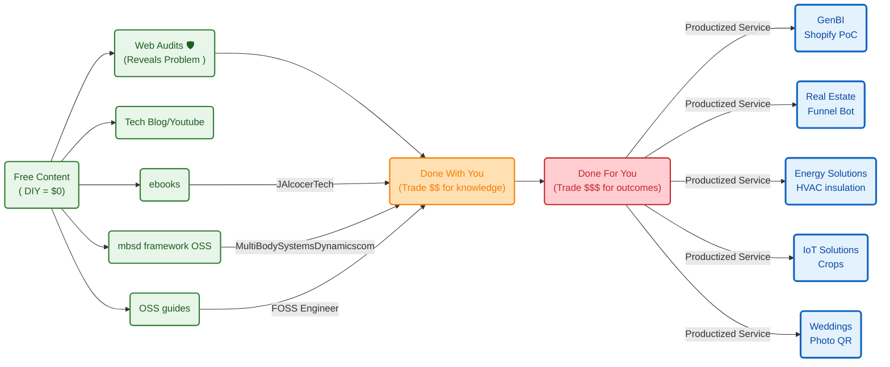

**Tl;DR**


**Intro**

* WHY Im writting this post: 
* What [Ive learnt](#conclusions) with it: *Ive ended*

Coming from [this post](https://jalcocert.github.io/JAlcocerT/jalcocertech-services-snapshot/).


https://github.com/JAlcocerT/jalcocertech-services/blob/master/docs/destilled-ebooks/z-read-books-notes/z-hormozi-curated.md

https://github.com/JAlcocerT/jalcocertech/tree/main-site-cloudflare-hub


## Real Engineering

Lets use [open physics](https://jalcocert.github.io/JAlcocerT/jalcocertech-services-snapshot/#open-physics) to do cool stuff

### Energy Solutions

Because this matters

1. PV optimum orientation
2. PV+Heat
3. PV+Batteries
4. PV +
5. Building x Sun rays
6. AC for my house: https://jalcocert.github.io/JAlcocerT/data-driven-insulation-evaluation/#which-ac-is-enough-for-my-house

https://jalcocert.github.io/JAlcocerT/data-driven-insulation-evaluation/


All together: 


#### Heat Pumps are so cool

If you have played with one of these BLDC pumps

Thats exactly the knowledge that you needed.

In modern residential heat pump systems, variable flow is managed by **High-Efficiency Variable Speed ECM (Electronically Commutated Motor) Circulator Pumps** controlled dynamically by the heat pump's central brain.

Instead of a basic 2-wire DC setup or wasteful valve throttling, these systems use smart circulator pumps (such as Wilo-Yonos/Para or Grundfos UPM3/Alpha) utilizing two primary control layers:

1. The Electrical / Communication Interface

Modern heating circulators receive independent power and dedicated external control signals via a multi-wire interface (typically 4–5 wires):

* **Dedicated PWM Signal (Bi-directional / Mini-PWM):** The heat pump controller outputs a low-voltage (5V/12V or 24V) high-frequency PWM signal strictly for data communication (separate from AC power). The pump reports back status and actual flow via feedback pulses.
* **0–10V Analog DC Voltage:** The heat pump outputs a variable DC voltage where 0V = Standby/Off, 1–2V = Minimum modulation (~15%), and 10V = 100% full capacity.
* **Digital Bus (LIN / CAN / Modbus):** Common in high-end inverter heat pumps for precise telemetry (RPM, flow rate in L/min, fluid temperature, error codes).

2. Control Strategies & Logic

The heat pump's micro-controller modulates the pump speed in real-time according to one of several algorithms:

* **Constant Temperature Differential ($\Delta T$ Control):**
* **How it works:** The controller monitors both the supply (flow) and return line temperature sensors. It modulates pump speed dynamically to maintain a steady temperature drop (usually **$5\text{ K}$ for radiant underfloor heating** or **$7\text{–}10\text{ K}$ for low-temp radiators**).
* **Why it matters:** As the compressor modulates up or down to match outdoor weather, the pump speeds up or slows down to keep heat transfer at peak thermodynamic efficiency ($COP$).


* **Proportional Pressure Control ($\Delta p\text{-v}$):**
* **How it works:** Used when individual room thermostatic valves (TRVs) or underfloor zone actuators open and close.
* **Why it matters:** As zones shut off, the pump senses the rising hydraulic resistance and automatically dials down its speed, eliminating pipe whistling, cavitation noise, and saving electricity.


* **Constant Pressure Control ($\Delta p\text{-c}$):**
* Maintains a constant differential pressure across the manifold regardless of how many individual loops are calling for heat.


Summary Comparison: Heat Pump vs. Basic DC Control

| Feature | Residential Heat Pump Circulator | Small 2-Wire DC Pump |
| --- | --- | --- |
| **Speed Control Method** | Dedicated low-voltage signal (PWM / 0–10V / LIN bus) | Variable DC input voltage bucking |
| **Logic Location** | Onboard heat pump firmware balancing $\Delta T$ & refrigerant cycle | External user dial or fixed resistance |
| **Power Consumption** | **3W to 45W** (Self-adjusting ECM / Permanent Magnet) | Fixed 19W unless manually stepped down |
| **Hydraulic Protection** | Integrated differential pressure sensing & anti-seize cycle | None (requires external relief/bypass valve) |

A residential air-to-water heat pump operates using **two separate, sealed fluid circuits** that interface through a specialized heat exchanger called a **condenser** (often a brazed plate heat exchanger).

---

### Circuit 1: The Refrigerant Loop (Thermodynamic Core)

* **Medium:** High-pressure chemical refrigerant (e.g., R32, R290 propane, or R410A).
* **Mover:** The high-power **compressor** (1,000W–5,000W+).
* **Role:**
1. **Evaporator (Outdoor Unit):** Liquid refrigerant boils at very low temperatures (e.g., $-20^\circ\text{C}$ to $-5^\circ\text{C}$), absorbing latent heat from outdoor air drawn across fins by a large fan.
2. **Compressor:** Squeezes the gaseous refrigerant into a high-pressure, superheated gas ($60^\circ\text{C}\text{–}85^\circ\text{C}$).
3. **Expansion Valve:** Drops the refrigerant pressure back down to restart the cycle.


---

### The Bridge: Brazed Plate Heat Exchanger (BPHE)

A compact block composed of dozens of corrugated, razor-thin stainless steel plates brazed together in alternating layers.

* Hot refrigerant gas flows down every odd channel.
* Cold return water flows up every even channel in the opposite direction (counter-flow).
* Heat passes instantly through the thin steel plates without the refrigerant and water ever physically mixing. As heat leaves the refrigerant, it condenses back into liquid.

---

### Circuit 2: The Hydronic Water Loop (Home Distribution)

* **Medium:** Pressurized water (often mixed with anti-corrosion inhibitors and glycol).
* **Mover:** The small **ECM circulator pump** (10W–50W).
* **Role:**
1. Receives the heat transferred across the plates, warming up from ~$\text{30}^\circ\text{C}$ to ~$\text{35}^\circ\text{C}$ (for underfloor heating).
2. Circulates through underfloor heating loops, radiators, or the domestic hot water (DHW) cylinder coil.
3. Returns to the heat exchanger after radiating thermal energy into the living space.


---

### Monobloc vs. Split Architecture

Where these two circuits meet depends on the heat pump's design:

| Design | Where Circuit 1 Ends & Circuit 2 Begins | Piping Entering the House |
| --- | --- | --- |
| **Monobloc** | The heat exchanger is inside the **outdoor unit** | **Water pipes** run through the wall into the home |
| **Split System** | The heat exchanger is inside the **indoor unit** (hydrobox) | **Refrigerant copper lines** run through the wall |

### IoT

https://jalcocert.github.io/JAlcocerT/data-driven-insulation-evaluation/


### FPV

You can prepare to ULM/PPL:

Or just get ready to DYOR and make a DIY dron:

#### FPV Telemetry


### Mechanism Design

With the release of this OSS framework for mbsd:


#### Multi Body Systems Dynamics dot com

I took all the goodies from the github and forgejo repos: *2D/3D*


  



> I couldnt avoid to email again to Gabe Morris :)

## Others

https://jalcocert.github.io/JAlcocerT/jalcocertech-services-snapshot/#productized-services

### D&A

Go ask unconfortable questions: *smart or it does NOT ship*

* https://why-postmortem-checks.pages.dev
* https://pm-pdm-checks.pages.dev

### homelab


  
  


### Attract and Convert

Every business has its own delivery

But every business owner will resonate when you ask [how they are getting customers](https://jalcocert.github.io/JAlcocerT/poc-107/#the-service-to-rule-them-all)


1. With a proper website: webaudits here

2. With outbound marketing: get leads, enrich leads, reachout via email








---

## Conclusions

This is getting traction:


  



I was clearing the initial real estate and genbi independent PoCs done with gemini earlier this year and brought them/improved at the PoC repo, here and here:

```sh
http://realestate-landing-prod:4321
http://shopify-landing-prod:4321
```

For webaudits, ive done some improvements `http://auditmagnet-prod:3001`



Also, the daily notes have stopped to flow here and the cv-laitex similarly, just to be part of a personal / career folders inside my services.

---

## FAQ

### Interesting Articles

* `https://www.seangoedecke.com/llms-reward-expertise/`

### OSS Journaling

I started a repo to use logseq and do `.md` notes.

I ended up just writing `.md` via vscode

the downside? 

I can just do so in laptops that i own to get the sync via github

In case that you will work outside hardware you control, you can always go with other alternatives like silverbullet, or: https://fossengineer.com/files-md-local-first-markdown-notes/

Its an **awsome PWA** that can write local files *and `.weba` audios*: `https://app.files.md/`


Underpaid in the D&A space? Document all that you do and put together an awsome CV.


You can also do this with the forgejo setup if you are not afraid of .md:

```sh

```

### Skills im using 

Created a Codex skill for this workflow:                    
C:/Users/j--e-/.codex/skills/weekly-work-summarizer/SKILL.md 
  It includes:
                                                                                                                
  - EOW summary workflow                                                                                        
  - director TL;DR email workflow                                                                               
  - daily ticket/hour bullet allocation workflow                                                                
  - CV/career evidence note workflow                                                                            
  - style rules for Jira/Teams/email-safe output                                                                
  - reusable templates in C:/Users/j--e-/.codex/skills/weekly-work-summarizer/references/templates.md           
  - UI metadata in agents/openai.yaml                                                                           
                                                                                                                
  Validation passed: Skill is valid!                                                                            
                                                                                                                
  Future trigger examples:                                                                                      
                                                                                                                
  - “Use weekly-work-summarizer to create this week’s EOW”                                                      
  - “Make the director TLDR from this week’s notes”                                                             
  - “Create CV bullets from this week”                                                                          
  - “Generate hours reporting bullets from Monday to Friday”                                                    
                    
#### Inbound marketing x Branded Videos

In theory, artifacts like ebooks, this blog, fossengineer... should give you inbound traffic.

But

The openAI image gpt 2 is so great that there is really no excuse not to get this right.

Doing 3 min videos (with xyz words aka xyz tokens) and 30 second shorts...

Its just one skill away:

```sh

```