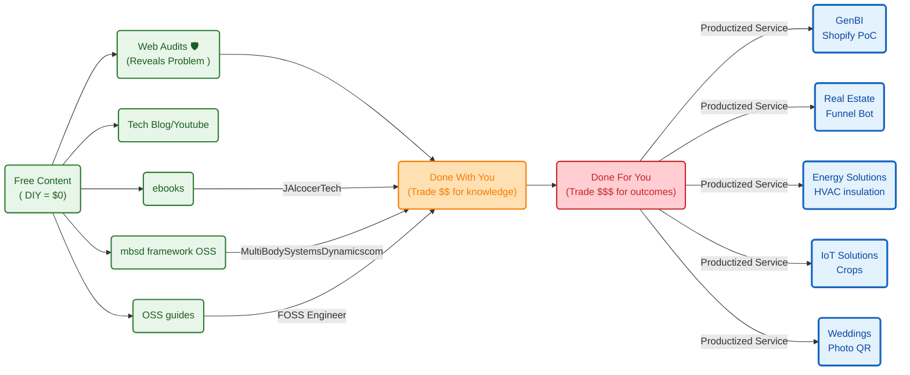

**Tl;DR**


**Intro**

Coming from [this post](https://jalcocert.github.io/JAlcocerT/jalcocertech-services-snapshot/).


https://github.com/JAlcocerT/jalcocertech-services/blob/master/docs/destilled-ebooks/z-read-books-notes/z-hormozi-curated.md

https://github.com/JAlcocerT/jalcocertech/tree/main-site-cloudflare-hub


## Real Engineering

Lets use [open physics](https://jalcocert.github.io/JAlcocerT/jalcocertech-services-snapshot/#open-physics) to do cool stuff

### Energy Solutions

Because this matters

1. PV optimum orientation
2. PV+Heat
3. PV+Batteries
4. PV +
5. Building x Sun rays
6. AC for my house: https://jalcocert.github.io/JAlcocerT/data-driven-insulation-evaluation/#which-ac-is-enough-for-my-house

https://jalcocert.github.io/JAlcocerT/data-driven-insulation-evaluation/


All together: 

### IoT

https://jalcocert.github.io/JAlcocerT/data-driven-insulation-evaluation/


### FPV

You can prepare to ULM/PPL:

Or just get ready to DYOR and make a DIY dron:

#### FPV Telemetry


### Mechanism Design

With the release of this OSS framework for mbsd:


#### Multi Body Systems Dynamics dot com

I took all the goodies from the github and forgejo repos: *2D/3D*


  



> I couldnt avoid to email again to Gabe Morris :)

## Others

https://jalcocert.github.io/JAlcocerT/jalcocertech-services-snapshot/#productized-services

### D&A

Go ask unconfortable questions: *smart or it does NOT ship*

* https://why-postmortem-checks.pages.dev
* https://pm-pdm-checks.pages.dev

### homelab


  
  


### Attract and Convert

1. With a proper website: webaudits here

2. With outbound marketing: get leads, enrich leads, reachout via email








---

## Conclusions




---

## FAQ

### Interesting Articles

* `https://www.seangoedecke.com/llms-reward-expertise/`

### Inbound marketing x Branded Videos

In theory, artifacts like ebooks, this blog, fossengineer... should give you inbound traffic.

But

The openAI image gpt 2 is so great that there is really no excuse not to get this right.

Doing 3 min videos (with xyz words aka xyz tokens) and 30 second shorts...

Its just one skill away:

```sh

```

