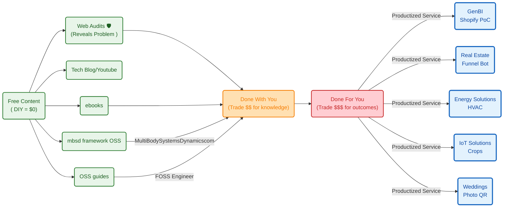
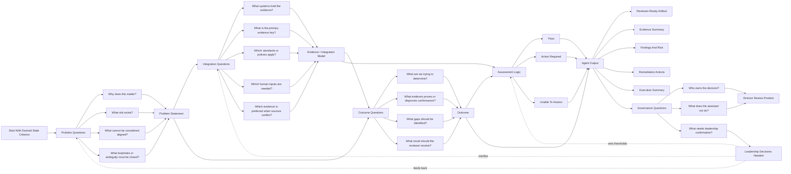

**Tl;DR**

Still thinking on headcounts to mess around with a project instead of [getting ~~shit done~~ outcomes](#choosing-my-wow)?

**Intro**

* WHY Im writting this post: *a*
* What [Ive learnt](#conclusions) with it: *Ive ended*

A friend told me once that I will do sth with energy at some point

Another, the coding is my thing

It seems that both were right.

## Updates

### MBSD

Its been few weekly releases for the multi body OSS framework: 

* https://github.com/JAlcocerT/mbsd-core
* https://ebooks.jalcocertech.com/books/mechanism-analytics/

### Energy

### Crops - Agrotech

### FPV Telemetry

#### MPU acelerometer

There are many 3-axis accelerometers that you can use with the Raspberry Pi Pico.

Some of the most popular options include:

MPU-6050: This is a popular and versatile accelerometer that is also compatible with the Raspberry Pi Pico. 

It has a wide range of features, including a built-in gyroscope.

**biblioman09**

<!-- 
<https://www.youtube.com/watch?v=JXyHuZyqjxU> 
-->



## Others

### Attract Convert Deliver

1. Have been doing changes and [additions to the ebooks](https://github.com/JAlcocerT/1ton-ebooks) (Free DIY): IoT and electronics!

> Anytime you want `https://ebooks.jalcocertech.com/`

> > The idea here is: if the quality of the free is so good, how will it be the quality of the paid consulting or DFY services?

2. 

### Leeeeads

Oh yea, the leads!

What am i doing about that?

## Case Studies

### Electronic Design

Yep, i designed and sent for manufacturing recently my first pcb.

There were 3 stages:

1. Electronic Simulation

2. Bread and protoboard testing

3. PCB Design with KiCAD

### Governance Consulting

Believe it or not, these are not clear and organizations still have severe governance problems:

* https://ebooks.jalcocertech.com/books/dna/dna-career-skills/#project-management-essentials
* https://ebooks.jalcocertech.com/books/managing-data-projects/faq-project-docs/

### HomeLab

This setup is working quite nicely thanks to skills:


  
  


---

## Conclusions

* Stop asking "Do they see it?
* Start asking "Is this priced correctly?"   


  
  


### How can we work together?

One of my favourite converging questions I got this year

The Ways of Working (WoW) of many are far from perfect

And im not even talking about using AI

As the cost and quality of replies gets better, the outcomes depend more on the quality of the questions and our learning rate, proper meta-[frameworks](#framework-comparison-matrix) adoption

Learn how to delegate the work ~~to agents~~ to anyone

just not your understanding *unless you have a team to deploy ideas*

### Choosing my WoW

The beauty of optionality is that i can choose.

As my career is no longer bottlenecked by permission but **by how well I allocate leverage**, taking care of my time and boundaries is crucial.

Having a [clear game](https://github.com/JAlcocerT/my-logseq-notes/blob/main/daily-frameworks/my-game.md) and [playbook](https://github.com/JAlcocerT/my-logseq-notes/blob/main/daily-frameworks/playbook.md) help to operate this smoothly

When [ppl asked me for collaborations](https://jalcocert.github.io/JAlcocerT/jalcocertech-services-update/#conclusions), I make sure to cross-check their proposal with a bs detection form i created as a code here and [deployed to formbricks](https://app.formbricks.com/s/cmtljp6ee1j5d01xdkqdqpdyp)

in large services / consulting / delivery orgs, especially around “innovation” 
work.

The pattern is common:

1. A POC gets attention.
2. Product/business wants MVP quickly.
3. Slides turn into implied scope.
4. Delivery dates appear before architecture.
5. Architecture/product/delivery ownership is unclear.
6. ICs/domain experts are asked whether things are “possible.”
7. “Possible” gets translated into “committed.”
8. If it works, credit diffuses upward/across teams.
9. If it fails, the people closest to the implementation absorb blame.                                   
        
What is less healthy, but still common:                                                                                                           
  Promotion evidence tied to outcomes outside your control.                                                
  Mid-level calibration while expecting senior/lead ambiguity absorption.                                  
  PM silence when boundaries should be protected.                                                          
  No clear RACI but high expectation of accountability.                                                    
  Frameworks/playbooks shared but not adopted because no owner is enforcing them.                          
                                                                                                           
  So yes, typical. But “typical” does not mean “good deal for you.”                                        
                                                                                                           
  The practical read:                                                                                      
                                                                                                           
  This is normal organizational gravity.                                                                   
  Capable ICs become the glue unless they actively refuse unmanaged ownership.                             

Now see the pattern?

The move is not to fix the whole environment. 

The move is to operate cleanly inside it:             
  deliver assigned scope;                                                                                  
  document assumptions;                                                                                    
  ask who owns product/architecture/delivery;                                                              
  separate data feasibility from MVP feasibility;                                                          
  avoid taking accountability without authority;                                                           
  use the job for cashflow and evidence;                                                                   
  save your real leverage for places where upside is explicit.      

---

## FAQ

### PIO

In software engineering, operations, and business analysis, framing PIO as **Problem, Integration, Outcome** creates a sharp model for designing architecture, automating workflows, and writing clear business requirements.

* **Problem:** The specific operational bottleneck, system defect, data silo, or manual inefficiency in the current workflow (e.g., *"Customer support manually re-keys order data across two legacy databases, causing a 24-hour fulfillment lag"*). **THE WHY** *and slightly what*
* **Integration:** The technical connection, automated workflow, API bridge, or architectural change introduced to bridge the gap (e.g., *"Deploy an event-driven webhook via an enterprise service bus (ESB) to sync order status in real time"*). **whats everything/systems that the agent needs? where is the agent going to take info from?**
* **Outcome:** The quantifiable, verifiable metric or end state defining success (e.g., *"Order processing time reduced from 24 hours to under 30 seconds; 0% manual data entry errors"*). **THE WHAT**

> Shift the conversation away from low-level implementation debates to high-level governance rules, evidence models, and risk ownership.

Strong governance framing that clearly establish:

Why the control exists.
What is being assessed.
What evidence is required.
What constitutes Pass / Action Required / Unable To Assess.
Who owns the decision.
What the assistant can and cannot do.

That separation of responsibilities is usually what directors and architects care about most.

**PIO (Problem, Integrations, Outcome)**

* **Good for:** Defining the **governance guardrails, evidence boundaries, and goal criteria for AI agents**.
* **SDLC Role:** Replaces or encapsulates heavy BRD/PRD documentation specifically for **agentic workflows and automated platforms**.
* **Key Question Answered:** *"What specific enterprise problem are we evaluating, what systems hold the truth, and what decision should the agent output?"*
* **Primary Audience:** Directors, DevSecOps leads, enterprise architects, and prompt/agent engineers.
* **Core Contents:** Problem statement, integrations/evidence sources, evaluation logic (`Pass` / `Action Required`), metadata, and authority limits.

the PIO question flow:

- Problem asks the why.
- Integrations ask what evidence and systems prove it.
- Outcome defines what the assessment determines.
- Assessment logic turns evidence into `Pass / Action Required / Unable To Assess`.
- Agent output packages the result.
- Governance questions feed back into leadership decisions and clarify future versions.

For these Director-style PIOs, Problem → Integrations → Outcome flows more naturally because it mirrors:

What issue are we solving?
What data/systems are involved?
What does the assessment produce?

The core questions we asked were:

- Problem: Why does this matter? What risk exists? What cannot be considered aligned? What ambiguity must be closed?
- Integrations: What systems hold the evidence? What is the primary evidence key? Which standards or policies apply? Which human inputs are needed?
- Outcome: What are we trying to determine? What evidence proves or disproves conformance? What gaps should be identified?
- Assessment Logic: What is a Pass? What requires Action Required? When is the assessment Unable To Assess?
- Agent Output: What artifact should the reviewer receive? What evidence, findings, risks, remediation actions, and summary should it contain?
- Governance: Who owns the decision? What does the assistant not do? What needs leadership confirmation?

HLD: PIO Question Flow

**How They Compare in the Lifecycle**

| Document | Focus Level | Primary Output | Human vs. AI Role |
| --- | --- | --- | --- |
| **BRD** | Business Strategy | Business Case & Funding | Written by business leaders for business sponsors. |
| **PRD** | Product Behavior | Features, Specs, & UI | Written by PMs for software engineers to build. |
| **PIO** | Agentic Governance | Decision Packets & Assessment Reports | Written by architects for **AI Agents** to execute and **Directors** to review. |

#### Application Across Roles

| Role | **Problem** | **Integration** | **Outcome** |
| --- | --- | --- | --- |
| **Business Analyst (BA)** | Translates user pain points and business gaps into functional specs. | Maps the process flow, data inputs/outputs, and integration requirements. | Defines Acceptance Criteria (AC) and Key Performance Indicators (KPIs). |
| **DevOps / Operations** | Identifies pipeline bottlenecks, downtime, or manual deployment risks. | Implements CI/CD pipelines, API gateways, monitoring tools, or automated scripts. | Measures MTTR (Mean Time to Recovery), deployment speed, and system uptime. |
| **Software Engineer** | pinpoints technical debt, legacy coupling, or API constraints. | Engineers middleware, database connections, webhooks, or third-party service adapters. | Tracks throughput, latency reduction, and test coverage/stability. |

---

#### Why It Works Better Than Standard User Stories

While traditional user stories (*"As a [user], I want [feature] so that [benefit]"*) focus primarily on end-user features, **Problem, Integration, Outcome** excels for system-to-system requirements, backend optimizations, and cross-platform workflows because it explicitly forces teams to define **how systems talk to each other** rather than just describing surface-level behavior.

Example: 

- Problem: “As part of our journey toward…” + concrete problems uncovered      
- Integrations: systems/standards/portals/dashboards/repos involved            
- Outcome: “As a result…” + what the agent will assess/reference/report/       
recommend

For software engineering, operations, and business analysis, several frameworks mirror PIO by structuring problem-solving, architectural choices, and requirements gathering.

### Framework Comparison Matrix

| Framework | Target Domain | Core Focus | Key Advantage |
| --- | --- | --- | --- |
| **PIO** | Sys/Ops/BA | Problem $\rightarrow$ Connection $\rightarrow$ Metric | Ideal for API, automation, & backend specs |
| **SIPOC** | Operations | High-level data flow boundaries | Exposes supply chain & pipeline gaps |
| **C4 Model** | Architecture | Visual abstraction levels | Clarifies complex system boundaries |
| **Gherkin** | Development/QA | Behavior-driven specification - **BDD** | Directly converts specs into executable tests |

#### Systems & Architecture Frameworks

* **C4 Model (Context, Containers, Components, Code)**
* **Best For:** Software architecture and system integration diagramming.
* **Focus:** Maps complex software architectures at four progressive levels of abstraction, making system connections and boundaries visually explicit.

* **Architecture Tradeoff Analysis Method (ATAM)**
* **Best For:** Evaluating software architecture before implementation.
* **Focus:** Evaluates structural choices against quality attribute requirements (performance, availability, security, modifiability) to expose risk areas and tradeoffs.

#### Operations & Business Analysis Frameworks

* **SIPOC (Suppliers, Inputs, Process, Outputs, Customers)**
* **Best For:** Process optimization and DevOps workflow mapping.
* **Focus:** A Six Sigma tool that maps high-level boundaries of an end-to-end integration or system workflow to identify where bottlenecks and dependencies occur.

* **CATWOE (Clients, Actors, Transformation, Worldview, Owner, Environmental constraints)**
* **Best For:** Business Analysis (BA) root-cause discovery.
* **Focus:** Analyzes business problems by examining the broader system ecosystem and all human or technical stakeholders impacted by a proposed change.

#### Functional Requirements & Specifications Frameworks

* **INVEST (Independent, Negotiable, Valuable, Estimable, Small, Testable)**
* **Best For:** Agile backlog refinement and user story design.
* **Focus:** A checklist used to evaluate the quality of a requirement before development starts.

* **Gherkin / BDD (Given, When, Then)**
* **Best For:** Technical BA specifications and acceptance testing.
* **Focus:** Translates functional logic into readable scenarios: **Given** a initial state, **When** an integration action occurs, **Then** verify the specific outcome.