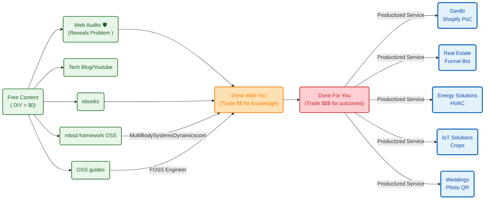
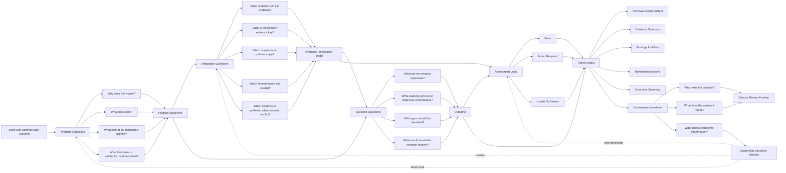

**Tl;DR**

Still thinking on headcounts to mess around with a project instead of [getting ~~shit done~~ outcomes](#choosing-my-wow)?

https://jalcocert.github.io/JAlcocerT/iot-crop-intelligence/#offer-configuration

**Intro**

* WHY Im writting this post: *To continue the Home x IoT Improvements*
* What [Ive learnt](#conclusions) with it: *Ive ended up [telling agents the WHY](#pio), not the how, via PIO fwk*

A friend told me once that I will do sth with energy at some point

Another, the coding is my thing

It seems that both were right.

## Updates



```mermaid
flowchart LR
    %% --- Styles ---
    classDef free fill:#E8F5E9,stroke:#2E7D32,stroke-width:2px,color:#1B5E20;
    classDef low fill:#FFF9C4,stroke:#FBC02D,stroke-width:2px,color:#FBC02D;
    classDef mid fill:#FFE0B2,stroke:#F57C00,stroke-width:2px,color:#F57C00;
    classDef high fill:#FFCDD2,stroke:#C62828,stroke-width:2px,color:#C62828;
    classDef bridge fill:#E3F2FD,stroke:#1565C0,stroke-width:3px,color:#0D47A1;

    %% --- Nodes ---
    L0("Free Content<br/>( DIY = $0)"):::free
    L1("Web Audits 🛡️<br/>(Reveals Problem )"):::free
    L11("Tech Blog/Youtube"):::free
    L12("ebooks"):::free
    L13("mbsd framework OSS"):::free
    L14("OSS guides"):::free

    L3("Done With You<br/>(Trade $$ for knowledge)"):::mid
    L4("Done For You<br/>(Trade $$$ for outcomes)"):::high
    L44("GenBI<br/>Shopify PoC"):::bridge
    L45("Real Estate<br/>Funnel Bot"):::bridge
    L46("Energy Solutions<br/>HVAC"):::bridge
    L47("IoT Solutions<br/>Crops"):::bridge
    L48("Weddings<br/>Photo QR"):::bridge

    %% --- Connections ---
    L0 --> L1
    L1 --> L3
    L12 --> L3
    L13 -->|MultiBodySystemsDynamicscom| L3
    L14 -->|FOSS Engineer| L3
    L0 --> L11
    L0 --> L12
    L0 --> L13
    L0 --> L14
    L3 --> L4
    L4 -->|Productized Service| L44
    L4 -->|Productized Service| L45
    L4 -->|Productized Service| L46
    L4 -->|Productized Service| L47
    L4 -->|Productized Service| L48
```

### MBSD

Its been few weekly releases for the **multi body OSS framework**: 

* https://github.com/JAlcocerT/mbsd-core
* https://ebooks.jalcocertech.com/books/mechanism-analytics/

All linked to: https://multibodysystemsdynamics.com/ for which I have the web UI repo here.

```sh
scp jalcocert@192.168.1.2:/home/jalcocert/multibody-tests/v-0-6-0-concerns.md . 
scp jalcocert@192.168.1.2:/home/jalcocert/multibody-tests/whitepaper.md . 
scp jalcocert@192.168.1.2:/home/jalcocert/multibody-tests/roadmap.md .
```

{}

```sh
cd /home/jalcocert/Desktop/mbsd-framework/mbsd-core

git switch main
git merge --ff-only v0.6.0-dev
git tag -a v0.6.0 -m "MBSD Core v0.6.0"
git push origin main
git push origin v0.6.0

awk '
  /^## v0\.6\.0 / { found=1; next }
  /^## / && found { exit }
  found { print }
' CHANGELOG.md | gh release create v0.6.0 \
  --repo JAlcocerT/mbsd-core \
  --verify-tag \
  --title "MBSD Core v0.6.0 - Experimental 3D Vocabulary" \
  --notes-file - \
  --latest
```

Then examples:

```sh
cd /home/jalcocert/Desktop/mbsd-framework/mbsd-examples

git switch main
git merge --ff-only v0.6.0-dev
git tag -a v0.6.0 -m "MBSD Examples v0.6.0"
git push origin main
git push origin v0.6.0

awk '
  /^## v0\.6\.0 / { found=1; next }
  /^## / && found { exit }
  found { print }
' CHANGELOG.md | gh release create v0.6.0 \
  --repo JAlcocerT/mbsd-examples \
  --verify-tag \
  --title "MBSD Examples v0.6.0 - Diagnostics and Validation" \
  --notes-file - \
  --latest
```

The remaining roadmap:


{}


> I couldnt avoid to email again to [Gabe Morris](https://github.com/gabemorris12/mechanism) :)

> > And email to `selfh.st`

There are other oss fwks with interesting potential to have a look:

* https://www.mbdyn.org/
  * https://github.com/zanoni-mbdyn/blendyn

MBDyn (https://www.mbdyn.org/) graphical post-processor for blender (https://www.blender.org/)

* Some people put together mbd x fem - https://mbdfem.com/ 
- Project Chrono/PyChrono
- Exudyn
- Siconos
- OpenModelica
- MBDyn
- preCICE

https://www.youtube.com/watch?v=NxZ1tf8J1oY

https://www.youtube.com/watch?v=4_Z05iMmDNU

https://www.youtube.com/watch?v=eFGkopoCTYY

### Energy

**1. Model the balcony recess in Blender — my pick.** The scene currently has no loggia at all: 21E is an extruded box with a red marker where the balcony should be. But the recess now drives **45% of the answer**, and the 40.9° profile cap is doing that work invisibly. Cutting the real 1.5 m × 2.5 m opening into the facade would let you look at a render of the sunlit patch on your own floor and say "yes, that's where it reaches" or "no, it comes further in". That's the verification the number can't give itself, and it's the same job the 21F A/B render did.

**2. The seasonal animation.** Twelve frames at 17:00 through the year, showing 21F's shadow climbing your facade and the roof shadow retreating. The counterintuitive headline — March and September are your worst months, December is among your best — is hard to believe in a table and obvious in a loop. `create_ffmpeg_concat.py` is already there.

**3. Nothing to do but keep logging, for two things.** The τ fit needs winter. And the drift test needs September–October, when the departure moves 68 min instead of 13.

**4. A window-open detector from the humidity channels** — you're already logging humidity on both sensors, and an opening shows as a step in both. That would let the winter fit exclude ventilated periods rather than being poisoned by them. Worth building, but it's an enabler with nothing to test against until winter, so I'd hold it.

Want me to start on the recess model? It's the one that makes your observations more useful rather than just prettier — if the render disagrees with what you see on the floor, that tells us the soffit or depth is off before you've spent weeks logging against a wrong cap.

> I got to know *via T3 desktop* that the flat next to me, 21F, costs me a consistent 2 h+ every clear day

> > https://github.com/JAlcocerT/poc/tree/main/building-geo-pl


A few things, and one natural stopping point worth naming first: **the most interesting question left — does the model predict the seasonal drift? — is now blocked on calendar time, not work.** September data does more for it than anything I could build.

That said, ranked by value against effort:

## 1. The three-climate comparison — cheapest, and it's the actual payoff

You now have the *same pipeline* run at three latitudes with three different dominant obstructions, and nobody has ever put them side by side:

| | Gourette | Jerez | Warsaw |
|---|---|---|---|
| December sun peaks at | 23.6° | ~30.9° | **14.2°** |
| What blocks it | **terrain** (ridges 1 km away) | **its own wall** (18× the neighbours) | **one neighbour + its own roof** |
| Direct sun/year | — | 2626 h | **652 h** |
| The counterintuitive bit | 10.7% annual loss but 38.5% in December | 5.7× between facade bearings | worst months are March/September |

Every number already exists. A single comparison doc plus one chart would make the whole family legible as one body of work rather than four folders — and the finding writes itself: *the thing that takes your sun is completely different at each site, and in every case it isn't what the resident assumes.*

## 2. Make the October re-run one command — small, high leverage

Right now, when you pull fresh data, `validate_against_sensors.py` runs but the pre-registered predictions live in markdown and the comparison is manual. 

Half an hour of work makes it emit predicted-vs-observed per day for whatever dates are present, flag the drift automatically, and say whether the 68-minute September signal showed up. Then the test you're actually waiting on costs you one command instead of a conversation.

## 3. The seasonal animation — the best artifact

Now that the loggia is properly modelled with recess and parapet, a year sweep at fixed clock time would show the roof shadow retreating and 21F's climbing.

The March/September-are-worst inversion is hard to believe in a table and obvious in a loop. ~15 minutes of render time; `create_ffmpeg_concat.py` is already there.

## 4. "Sun hours for any address" — the reusable thing

Everything's in place: geocode → OSM footprints → height grid → horizon → profile caps → hours. Generalising `site.json` so it takes an address and a floor would turn four one-off studies into a tool. This is what I'd build if you wanted something other people could use.

## Not worth doing yet

The **pooled multi-commune DVF study** (the terrain offers matched pairs, but sales cluster, so it's a sampling bet). The **energy calibration** — blocked on winter, and the ventilation problem means summer data can't fix it.

And **consolidating the drifted shared modules** into a real package: genuinely overdue now that `horizon_profile.py` exists in three forks plus this one, but boring, and nothing is currently broken by it.

---

**My pick: #1, then #2.** The comparison costs almost nothing because the numbers exist, and it's the one that makes everything else make sense. Then #2 so September arrives as a result rather than a task.


My [TP4056 setup](https://jalcocert.github.io/JAlcocerT/data-driven-insulation-evaluation/#home-solar-test-x-tp4056) with the ESP32 x DHT11 suffer recently from a full cloudy week.

I measured the 18650 voltage and it was 3.5V


After catching one sunny day (27-sept) moved the 5V solar panel south and between 10am-12pm went up to 3.6v


Surprise, energy [and geolocation matters](https://jalcocert.github.io/JAlcocerT/iot-crop-intelligence/#geo-matters) :O

```sh
sqlite3 -header -column /home/jalcocert/poc/iot-rpi-dht-insulation/ingester/data/readings.sqlite "SELECT device, metric, value, topic, received_at, received_ms FROM readings WHERE device='esp32' ORDER BY received_ms DESC LIMIT 1;"

sqlite3 -header -column /home/jalcocert/poc/iot-rpi-dht-insulation/ingester/data/readings.sqlite "WITH intervals AS (SELECT device, topic, received_ms - LAG(received_ms) OVER (PARTITION BY topic ORDER BY received_ms) AS delta_ms FROM readings WHERE device IN
  │ ('esp32','pico')), normal AS (SELECT * FROM intervals WHERE delta_ms BETWEEN 1 AND 600000), counts AS (SELECT device, topic, ROUND(delta_ms/1000.0) AS seconds, COUNT(*) AS occurrences, ROW_NUMBER() OVER (PARTITION BY device, topic ORDER BY COUNT(*) DESC,
  │ ROUND(delta_ms/1000.0)) AS rn FROM normal GROUP BY device, topic, ROUND(delta_ms/1000.0)) SELECT n.device, n.topic, COUNT(*) AS intervals, ROUND(AVG(n.delta_ms)/1000.0,2) AS avg_seconds, ROUND(MIN(n.delta_ms)/1000.0,2) AS min_seconds, ROUND(MAX(n.delta_ms)/1000.0,2) AS..............
```

- ESP32: approximately every 64 seconds (average ~67 seconds).
- Pico W: approximately every 60 seconds.

Each device sends temperature and humidity as separate MQTT messages during each cycle. Long offline gaps were excluded.

Based on the observed ~64-second cycle, I’d infer:

- ~60 seconds deep sleep
- ~4 seconds booting, reconnecting to Wi‑Fi/MQTT, reading and publishing
- ~1,350 cycles/day
- ~1.5 hours/day awake

Assuming 80–120 mA average while awake and near-ideal deep sleep:

Daily charge ≈ 120–180 mAh
Daily energy ≈ 0.40–0.60 Wh

A normal ESP32 development board’s regulator, USB chip and LEDs may raise this to roughly:

≈ 0.5–0.9 Wh/day
≈ 140–260 mAh/day from a 3.7 V battery

So my practical estimate is around 0.6 Wh/day. A 2,000 mAh Li-ion battery would likely last approximately 7–12 days after conversion losses.

The ESP32 chip itself draws about 10 µA in deep sleep, but Wi‑Fi receive uses ~95–100 mA and transmission peaks at 180–240 mA. 

> [Espressif ESP32 datasheet](https://documentation.espressif.com/esp32_datasheet_en.html)

The frequent Wi‑Fi reconnections dominate consumption. 

Extending sleep from 1 minute to 5 minutes could reduce daily usage by roughly 75–80%.


A short deepsleep is not efficient as connecting back to wifi requires an energy peak. So upgraded [this esp32 script](https://github.com/JAlcocerT/poc/blob/main/iot-rpi-dht/scripts-microcontrollers/firmware-esp32/esp32-dht11-mqtt-emqx-deepsleep.cpp) to this one that pushes every 10minutes.


The Pico W appears to remain connected to Wi‑Fi between its one-minute publications. For that setup, I’d estimate:

- Wi‑Fi power saving enabled: ~20–35 mA average
- Power saving disabled/busy loop: ~40–70 mA average
- Likely daily energy: ~2.5–6 Wh/day
- Practical midpoint: ~4 Wh/day

That is roughly 5–8× your deep-sleeping ESP32.

The Pico W’s CYW43439 radio can average below 1.3 mA in Wi‑Fi power-save mode, but active receive uses ~37–43 mA and transmission can peak above 270 mA; the RP2040 and board add their own consumption. 

A 2,000 mAh Li-ion might therefore last only around 1–3 days. 

If the Pico disconnects and enters genuine low-power sleep between readings, consumption could be reduced substantially.

If the Pico W truly deep-sleeps for 60 seconds, powers down the Wi‑Fi chip, then wakes and reconnects, I’d estimate:

Awake/reconnecting: 4–6 seconds per cycle
Daily consumption:  ~0.4–0.9 Wh
Battery usage:       ~120–240 mAh/day at 3.7 V

A practical midpoint is ~0.6 Wh/day, similar to your ESP32. A 2,000 mAh battery might last roughly 8–14 days.

Important: RP2040 deep sleep is around 180 µA, but the CYW43439 radio must also be explicitly powered down; otherwise consumption will be much higher. 

> [Raspberry Pi documentation](https://www.raspberrypi.com/documentation/microcontrollers/microcontroller-chips.html)

Increasing the sleep interval would make a large difference:

- Every 1 minute: ~0.6 Wh/day
- Every 5 minutes: ~0.15–0.25 Wh/day
- Every 15 minutes: ~0.07–0.15 Wh/day

Wi‑Fi reconnection, rather than the sensor reading or MQTT publication, dominates the energy usage.

After having these for several weeks inside and outside home, now i can do **per hour checks of T and H**:

```sh
  sqlite3 -header -column \
  /home/jalcocert/poc/iot-rpi-dht-insulation/ingester/data/readings.sqlite \
  "WITH hourly AS (
    SELECT
      device,
      metric,
      strftime('%Y-%m-%d %H:00:00', received_at) AS hour_bucket,
      AVG(value) AS avg_value
    FROM readings
    WHERE received_ms >= (strftime('%s','now') - 7*24*60*60)*1000
      AND topic IN (
        'esp32/temperature/dht11',
        'esp32/humidity/dht11',
        'pico/temperature/dht22',
        'pico/humidity/dht22'
      )
    GROUP BY device, metric, hour_bucket
  ),
  paired AS (
    SELECT
      e.hour_bucket,
      e.metric,
      e.avg_value AS esp32_value,
      p.avg_value AS pico_value
    FROM hourly e
    JOIN hourly p
      ON p.hour_bucket = e.hour_bucket
     AND p.metric = e.metric
    WHERE e.device = 'esp32'
      AND p.device = 'pico'
  )
  SELECT
    hour_bucket,
    ROUND(MAX(CASE WHEN metric='temperature'
      THEN esp32_value END), 2) AS esp32_temp,
    ROUND(MAX(CASE WHEN metric='temperature'
      THEN pico_value END), 2) AS pico_temp,
    ROUND(MAX(CASE WHEN metric='temperature'
      THEN esp32_value-pico_value END), 2) AS temp_diff,
    ROUND(MAX(CASE WHEN metric='humidity'
      THEN esp32_value END), 2) AS esp32_humidity,
    ROUND(MAX(CASE WHEN metric='humidity'
      THEN pico_value END), 2) AS pico_humidity,
    ROUND(MAX(CASE WHEN metric='humidity'
      THEN esp32_value-pico_value END), 2) AS humidity_diff
  FROM paired
  GROUP BY hour_bucket
  HAVING COUNT(DISTINCT metric) = 2
  ORDER BY hour_bucket;"
```

This generates all 168 hourly buckets, **including hours with no readings**:

```sh
  sqlite3 -header -column \
  /home/jalcocert/poc/iot-rpi-dht-insulation/ingester/data/readings.sqlite \
  "WITH RECURSIVE hours(hour_bucket) AS (
    SELECT datetime(
      strftime('%Y-%m-%d %H:00:00','now'),
      '-167 hours'
    )
    UNION ALL

    SELECT datetime(hour_bucket, '+1 hour')
    FROM hours
    WHERE hour_bucket < strftime('%Y-%m-%d %H:00:00','now')
  ),
  counts AS (
    SELECT
      strftime('%Y-%m-%d %H:00:00', received_at) AS hour_bucket,
      device,
      COUNT(*) AS row_count
    FROM readings
    WHERE received_ms >=
          (strftime('%s','now') - 7*24*60*60)*1000
      AND device IN ('esp32','pico')
    GROUP BY hour_bucket, device
  )
  SELECT
    h.hour_bucket,
    CASE WHEN COALESCE(MAX(
      CASE WHEN c.device='esp32' THEN c.row_count END
    ),0) > 0 THEN 'yes' ELSE 'no' END AS esp32_pushed,

    COALESCE(MAX(
      CASE WHEN c.device='esp32' THEN c.row_count END
    ),0) AS esp32_rows,

    CASE WHEN COALESCE(MAX(
      CASE WHEN c.device='pico' THEN c.row_count END
    ),0) > 0 THEN 'yes' ELSE 'no' END AS pico_pushed,

    COALESCE(MAX(
      CASE WHEN c.device='pico' THEN c.row_count END
    ),0) AS pico_rows

  FROM hours h
  LEFT JOIN counts c ON c.hour_bucket = h.hour_bucket
  GROUP BY h.hour_bucket
  ORDER BY h.hour_bucket;"
```


As i have the picoW with home power - No data means the script got stucked = I had a [connectivity problems](https://jalcocert.github.io/JAlcocerT/selfhosted-connectivity/) *yet again*


> Yep, im keeping that in [the original 60s picow script](https://github.com/JAlcocerT/poc/commit/4092fdb313e9d5ec3ca980171fe1f261a344e4b4#diff-07fdd9112d53f980a29d956d81694442f796e68a05403fc27616dbbcd0761613) as a feature, *which I detect with the led always ON*, not as a bug to know when my ISP is tricking me ;)

> > But I tweaked [the esp32 logic](https://jalcocert.github.io/JAlcocerT/iot-crop-intelligence/#the-esp-logic) yet [again](https://jalcocert.github.io/JAlcocerT/data-driven-insulation-evaluation/#iot-walls-sun-and-heat-transfer), but keeping [this robust deep sleep and wifi reconnections](https://github.com/JAlcocerT/poc/blob/main/iot-rpi-dht/scripts-microcontrollers/firmware-esp32/low-power-notes.md#flow-diagrams) as that one is outside home and I would not realize as quick that Id need to unplug and plug after a router connection issue

To push [the new script](https://github.com/JAlcocerT/poc/blob/main/iot-rpi-dht/scripts-microcontrollers/firmware-esp32/esp32-dht11-mqtt-emqx-deepersleep.cpp) and [learnings](https://github.com/JAlcocerT/poc/blob/main/iot-rpi-dht/scripts-microcontrollers/firmware-esp32/deeper-sleep-notes.md):

```sh
cd iot-rpi-dht
make deepersleep-upload PORT=/dev/ttyACM0 #10 min interval now
```

Use `mosquitto_sub` to watch MQTT messages live:

```sh
#mosquitto_sub -h 127.0.0.1 -p 1883 -t '#' -v
#Only monitor the ESP32:
mosquitto_sub -h 127.0.0.1 -p 1883 -t 'esp32/#' -v
#
#docker run --rm --network host eclipse-mosquitto:2 mosquitto_sub -h 192.168.1.2 -p 1883 -t 'esp32/#' -v
```

Or both devices:

```sh
mosquitto_sub -h 127.0.0.1 -p 1883 \
  -t 'esp32/#' \
  -t 'pico/#' \
  -v
```

This allow the esp32 to push sensor info [when properly connected to your wifi](https://github.com/JAlcocerT/poc/blob/main/iot-rpi-dht/scripts-microcontrollers/firmware-esp32/deeper-sleep-notes.md#temporary-credential-workflow):

```sh
make deepersleep-upload PORT=/dev/ttyACM0
```

### Crops - Agrotech

After getting the watering setup PoC working, I wanted to tinker with the [esp32 wifi connection](https://github.com/JAlcocerT/poc/tree/main/iot-esp-water/esp32-wifi): beyond [the wifimanager](https://github.com/JAlcocerT/poc/blob/main/iot-esp-water/esp32-wifi/z-learnings-1-wifimanager.md)

The goal, get all integrated in [this *user-friendly* DIY custom dashboard](https://github.com/JAlcocerT/poc/tree/main/iot-dashboard-v2):

```sh
cd ./poc/iot-dashboard-v2
#sudo docker stop qbittorrent
```

> https://github.com/JAlcocerT/poc/blob/main/iot-dashboard-v2/z-learnings-migration.md

> > https://github.com/JAlcocerT/poc/blob/main/iot-dashboard-v2/docker-compose-zigbee.yml


  
  


In the v2 dashboard, use the new “Pump control & schedule” panel to:

- Run a confirmed 0.5–5 second pulse
- Stop the pump
- Refresh its status
- Create/cancel persistent one-shot schedules
- Review recent commands and outcomes

See these CLI equivalents [in the makefile](https://github.com/JAlcocerT/poc/blob/main/iot-dashboard-v2/Makefile) to my initial verions:
`/home/jalcocert/Desktop/poc/iot-esp-water/esp32-wifi` and `/home/jalcocert/Desktop/poc/iot-esp-water/esp32-bms-prepwork/esp32-bms-mosfet`

```sh
make pump-status
make pump-pulse PULSE_MS=3000
make pump-off

# docker run --rm --network host eclipse-mosquitto:2 \
#   mosquitto_pub -h 192.168.1.2 \
#   -t esp32/pump/cmd \
#   -m 'pulse:3000'
#Or from esp32-wifi:
# make pub-off

make pump-schedule RUN_AT="2026-09-28 08:00" PULSE_MS=3000
make pump-cancel SCHEDULE_ID=1
make pump-schedules
```


> `http://192.168.1.2:3038/?range=90d`


### FPV Telemetry

fpv dron prop vortex
https://www.youtube.com/shorts/hgqM9Z0d6QU

https://www.youtube.com/@rctestflight
https://www.youtube.com/@fpv-geek
https://www.youtube.com/@JoshuaBardwell/videos
https://www.youtube.com/@opendrone


#### MPU acelerometer

There are many 3-axis accelerometers that you can use with the Raspberry Pi Pico.

Some of the most popular options include:

MPU-6050: This is a popular and versatile accelerometer that is also compatible with the Raspberry Pi Pico. 

It has a wide range of features, including a built-in gyroscope.


**biblioman09**


<!-- 
<https://www.youtube.com/watch?v=JXyHuZyqjxU> 
-->




## Others


### Attract Convert Deliver

There are changes going on in all orgs.

Some call them: `design-sell-deliver-enable`

But they come down to the same.

1. Have been doing changes and [additions to the ebooks](https://github.com/JAlcocerT/1ton-ebooks) 

> Anytime you want `https://ebooks.jalcocertech.com/` * There is Free DIY: IoT and electronics!

> > The idea here is: if the quality of the free is so good, how will it be the quality of the paid consulting or DFY services?

2. 

### Leeeeads

Oh yea, the leads!

What am i doing about that?

It's all about having a proper leads pipeline:

```sh
cd ./fossengineer/
cd ./wait #https://github.com/JAlcocerT/poc/tree/main/genbi-energy-solutions/waitlist
```

### Webs

I sunseted all custom diy websites from 2024, *as they churned anyways*

Created this thought: `https://github.com/JAlcocerT/poc/tree/main/pwa-margincms`

As a PWA that you can use offline via chrome: https://margin-cms.pages.dev/

With simple gg syncronization via PAT.

> Oh, and you also have the free web audits to show that you have a problem: https://webaudit.jalcocertech.com/


## Case Studies

### Electronic Design

Yep, i designed and sent for manufacturing recently my first pcb.

There were 3 stages:

1. Electronic Simulation
2. Bread and protoboard testing
3. PCB Design with KiCAD


### Governance Consulting

Believe it or not, these are not clear and organizations still have severe governance problems:

* https://ebooks.jalcocertech.com/books/dna/dna-career-skills/#project-management-essentials
* https://ebooks.jalcocertech.com/books/managing-data-projects/faq-project-docs/

### HomeLab

This setup is working quite nicely thanks to skills:


  
  


---

## Conclusions

Making questions is the first step.

Then its about making good questions, like:

* Stop asking "Do they see it?
* Start asking "Is this priced correctly?"

Some orgs are already asking: why do we need a person?

And that makes sense, the info is out there: *ppl are realizing that scrum doesnt work, aka is too slow*

Now...dark factories will come (even more) to the software/IT sector

If you have questions on whats going next, reach out:


  
  


Im putting together a `JAlcocerTech-Core`:


```mermaid
flowchart LR
    %% --- Styles ---
    classDef free fill:#E8F5E9,stroke:#2E7D32,stroke-width:2px,color:#1B5E20;
    classDef low fill:#FFF9C4,stroke:#FBC02D,stroke-width:2px,color:#FBC02D;
    classDef mid fill:#FFE0B2,stroke:#F57C00,stroke-width:2px,color:#F57C00;
    classDef high fill:#FFCDD2,stroke:#C62828,stroke-width:2px,color:#C62828;
    classDef bridge fill:#E3F2FD,stroke:#1565C0,stroke-width:3px,color:#0D47A1;

    %% --- Nodes ---
    L0("Free Content<br/>( DIY = $0)"):::free
    L1("Web Audits 🛡️<br/>(Reveals Problem )"):::free
    L11("Tech Blog/Youtube"):::free
    L12("ebooks"):::free
    L13("mbsd framework OSS"):::free
    L14("OSS guides"):::free

    L3("Done With You<br/>(Trade $$ for knowledge)"):::mid
    L4("Done For You<br/>(Trade $$$ for outcomes)"):::high
    L44("GenBI<br/>Shopify PoC"):::bridge
    L45("Real Estate<br/>Funnel Bot"):::bridge
    L46("Energy Solutions<br/>HVAC"):::bridge
    L47("IoT Solutions<br/>Crops"):::bridge
    L48("Weddings<br/>Photo QR"):::bridge

    %% --- Connections ---
    L0 --> L1
    L1 --> L3
    L12 --> L3
    L13 -->|MultiBodySystemsDynamicscom| L3
    L14 -->|FOSS Engineer| L3
    L0 --> L11
    L0 --> L12
    L0 --> L13
    L0 --> L14
    L3 --> L4
    L4 -->|Productized Service| L44
    L4 -->|Productized Service| L45
    L4 -->|Productized Service| L46
    L4 -->|Productized Service| L47
    L4 -->|Productized Service| L48
```

### How can we work together?

One of my favourite converging questions I got this year

The Ways of Working (WoW) of many are far from perfect

And im not even talking about using AI

As the cost and quality of replies gets better, the outcomes depend more on the quality of the questions and our learning rate, proper meta-[frameworks](#framework-comparison-matrix) adoption

Learn how to delegate the work ~~to agents~~ to anyone

just not your understanding *unless you have a team to deploy ideas*

### Choosing my WoW

The beauty of optionality is that i can choose.

As my career is no longer bottlenecked by permission but **by how well I allocate leverage**, taking care of my time and boundaries is crucial.

Having a [clear game](https://github.com/JAlcocerT/my-logseq-notes/blob/main/daily-frameworks/my-game.md) and [playbook](https://github.com/JAlcocerT/my-logseq-notes/blob/main/daily-frameworks/playbook.md) help to operate this smoothly

When [ppl asked me for collaborations](https://jalcocert.github.io/JAlcocerT/jalcocertech-services-update/#conclusions), I make sure to cross-check their proposal with a bs detection form i created as a code here and [deployed to formbricks](https://app.formbricks.com/s/cmtljp6ee1j5d01xdkqdqpdyp)

{}

The pattern is common:

1. A POC gets attention.
2. Product/business wants MVP quickly.
3. Slides turn into implied scope.
4. Delivery dates appear before architecture.
5. Architecture/product/delivery ownership is unclear.
6. ICs/domain experts are asked whether things are “possible.”
7. “Possible” gets translated into “committed.”
8. If it works, credit diffuses upward/across teams.
9. If it fails, the people closest to the implementation absorb blame.                                   
        
What is less healthy, but still common:                                              
                                                            
Promotion evidence tied to outcomes outside your control. 
Mid-level calibration while expecting senior/lead ambiguity absorption.
PM silence when boundaries should be protected.
No clear RACI but high expectation of accountability.

Frameworks/playbooks shared but not adopted because no owner is enforcing them.                                                                                                          
So yes, typical. But “typical” does not mean “good deal for you.”                                        

The practical read: This is normal organizational gravity.

Capable ICs become the glue unless they actively refuse unmanaged ownership.                             

Now see the pattern?

The move is not to fix the whole environment. 

The move is to operate cleanly inside it:

1. deliver assigned scope;
2. document assumptions;                                                     
3. ask who owns product/architecture/delivery;                        
4. separate data feasibility from MVP feasibility;                        
5. avoid taking accountability without authority;                               
6. use the job for cashflow and evidence;                
7. **save your real leverage for places where upside is explicit.**

{}

### Case Studies

#### Electronic Design

#### Clarity of Execution

Working in D&A?

Go ask unconfortable [questions](https://jalcocert.github.io/JAlcocerT/questions-for-engineers/): *smart or it does NOT ship*

* https://why-postmortem-checks.pages.dev
* https://pm-pdm-checks.pages.dev

You might not know yet, but you need **proper [governance](https://github.com/JAlcocerT/my-logseq-notes/blob/main/daily-frameworks/governance.md)**.

You cant be an AI first company before you are a data ready team.

To be a data ready team, you need proper RACI model across product, architecture and delivery.

And to even get started: you need to have some kind of logic

Example: a date is not a product definition
<!-- 
https://youtu.be/K-eXcT1XgdE -->



If you are still working in a `9-5` while working in your free time to make your business, make sure to have a **clear picture** of what [your game is](https://github.com/JAlcocerT/my-logseq-notes/blob/main/daily-frameworks/my-game.md) and a [playbook to execute](https://github.com/JAlcocerT/my-logseq-notes/blob/main/daily-frameworks/playbook.md).

---

## FAQ

### PIO

In software engineering, operations, and business analysis, framing PIO as **Problem, Integration, Outcome** creates a sharp model for designing architecture, automating workflows, and writing clear business requirements.

> See `https://www.seangoedecke.com/tell-agents-the-why/`

* **Problem:** The specific operational bottleneck, system defect, data silo, or manual inefficiency in the current workflow (e.g., *"Customer support manually re-keys order data across two legacy databases, causing a 24-hour fulfillment lag"*). **THE WHY** *and slightly what*

* **Integration:** The technical connection, automated workflow, API bridge, or architectural change introduced to bridge the gap (e.g., *"Deploy an event-driven webhook via an enterprise service bus (ESB) to sync order status in real time"*). **whats everything/systems that the agent needs? where is the agent going to take info from?**

* **Outcome:** The quantifiable, verifiable metric or end state defining success (e.g., *"Order processing time reduced from 24 hours to under 30 seconds; 0% manual data entry errors"*). **THE WHAT**

> Shift the conversation away from low-level implementation debates to high-level governance rules, evidence models, and risk ownership.

Strong governance framing that clearly establish:

* Why the control exists.
* What is being assessed.
* What evidence is required.
* What constitutes Pass / Action Required / Unable To Assess.
* Who owns the decision.
* What the assistant can and cannot do.

That separation of responsibilities is usually what directors and architects care about most.

**PIO (Problem, Integrations, Outcome)**

* **Good for:** Defining the **governance guardrails, evidence boundaries, and goal criteria for AI agents**.
* **SDLC Role:** Replaces or encapsulates heavy BRD/PRD documentation specifically for **agentic workflows and automated platforms**.
* **Key Question Answered:** *"What specific enterprise problem are we evaluating, what systems hold the truth, and what decision should the agent output?"*
* **Primary Audience:** Directors, DevSecOps leads, enterprise architects, and prompt/agent engineers.
* **Core Contents:** Problem statement, integrations/evidence sources, evaluation logic (`Pass` / `Action Required`), metadata, and authority limits.

the PIO question flow:

- Problem asks the why.
- Integrations ask what evidence and systems prove it.
- Outcome defines what the assessment determines.
- Assessment logic turns evidence into `Pass / Action Required / Unable To Assess`.
- Agent output packages the result.
- Governance questions feed back into leadership decisions and clarify future versions.

For these Director-style PIOs, `Problem → Integrations → Outcome` flows more naturally because it mirrors:

* What issue are we solving?
* What data/systems are involved?
* What does the assessment produce?



```mermaid
flowchart LR
    A[Start With Desired State Criterion] --> B[Problem Questions]

    B --> B1[Why does this matter?]
    B --> B2[What risk exists?]
    B --> B3[What cannot be considered aligned?]
    B --> B4[What loopholes or ambiguity must be closed?]

    B1 --> C[Problem Statement]
    B2 --> C
    B3 --> C
    B4 --> C

    C --> D[Integration Questions]
    D --> D1[What systems hold the evidence?]
    D --> D2[What is the primary evidence key?]
    D --> D3[Which standards or policies apply?]
    D --> D4[Which human inputs are needed?]
    D --> D5[Which evidence is preferred when sources conflict?]

    D1 --> E[Evidence / Integration Model]
    D2 --> E
    D3 --> E
    D4 --> E
    D5 --> E

    C --> F[Outcome Questions]
    E --> F

    F --> F1[What are we trying to determine?]
    F --> F2[What evidence proves or disproves conformance?]
    F --> F3[What gaps should be identified?]
    F --> F4[What result should the reviewer receive?]

    F1 --> G[Outcome]
    F2 --> G
    F3 --> G
    F4 --> G

    G --> H[Assessment Logic]
    E --> H

    H --> H1[Pass]
    H --> H2[Action Required]
    H --> H3[Unable To Assess]

    H1 --> I[Agent Output]
    H2 --> I
    H3 --> I
    G --> I

    I --> I1[Reviewer-Ready Artifact]
    I --> I2[Evidence Summary]
    I --> I3[Findings And Risk]
    I --> I4[Remediation Actions]
    I --> I5[Executive Summary]

    I --> J[Governance Questions]
    J --> J1[Who owns the decision?]
    J --> J2[What does the assistant not do?]
    J --> J3[What needs leadership confirmation?]

    J1 --> K[Director Review Position]
    J2 --> K
    J3 --> L[Leadership Decisions Needed]

    L -.feeds back.-> B
    L -.clarifies.-> D
    L -.sets thresholds.-> H
```

The core questions asked were:

- Problem: Why does this matter? What risk exists? What cannot be considered aligned? What ambiguity must be closed?
- Integrations: What systems hold the evidence? What is the primary evidence key? Which standards or policies apply? Which human inputs are needed?
- Outcome: What are we trying to determine? What evidence proves or disproves conformance? What gaps should be identified?
- Assessment Logic: What is a Pass? What requires Action Required? When is the assessment Unable To Assess?
- Agent Output: What artifact should the reviewer receive? What evidence, findings, risks, remediation actions, and summary should it contain?
- Governance: Who owns the decision? What does the assistant not do? What needs leadership confirmation?

HLD: PIO Question Flow


```mermaid
flowchart LR
    A[Start With Desired State Criterion] --> B[Problem Questions]

    B --> B1[Why does this matter?]
    B --> B2[What risk exists?]
    B --> B3[What cannot be considered aligned?]
    B --> B4[What loopholes or ambiguity must be closed?]

    B1 --> C[Problem Statement]
    B2 --> C
    B3 --> C
    B4 --> C

    C --> D[Integration Questions]
    D --> D1[What systems hold the evidence?]
    D --> D2[What is the primary evidence key?]
    D --> D3[Which standards or policies apply?]
    D --> D4[Which human inputs are needed?]
    D --> D5[Which evidence is preferred when sources conflict?]

    D1 --> E[Evidence / Integration Model]
    D2 --> E
    D3 --> E
    D4 --> E
    D5 --> E

    C --> F[Outcome Questions]
    E --> F

    F --> F1[What are we trying to determine?]
    F --> F2[What evidence proves or disproves conformance?]
    F --> F3[What gaps should be identified?]
    F --> F4[What result should the reviewer receive?]

    F1 --> G[Outcome]
    F2 --> G
    F3 --> G
    F4 --> G

    G --> H[Assessment Logic]
    E --> H

    H --> H1[Pass]
    H --> H2[Action Required]
    H --> H3[Unable To Assess]

    H1 --> I[Agent Output]
    H2 --> I
    H3 --> I
    G --> I

    I --> I1[Reviewer-Ready Artifact]
    I --> I2[Evidence Summary]
    I --> I3[Findings And Risk]
    I --> I4[Remediation Actions]
    I --> I5[Executive Summary]

    I --> J[Governance Questions]
    J --> J1[Who owns the decision?]
    J --> J2[What does the assistant not do?]
    J --> J3[What needs leadership confirmation?]

    J1 --> K[Director Review Position]
    J2 --> K
    J3 --> L[Leadership Decisions Needed]

    L -.feeds back.-> B
    L -.clarifies.-> D
    L -.sets thresholds.-> H
```


**How They Compare in the Lifecycle**

| Document | Focus Level | Primary Output | Human vs. AI Role |
| --- | --- | --- | --- |
| **BRD** | Business Strategy | Business Case & Funding | Written by business leaders for business sponsors. |
| **PRD** | Product Behavior | Features, Specs, & UI | Written by PMs for software engineers to build. |
| **PIO** | Agentic Governance | Decision Packets & Assessment Reports | Written by architects for **AI Agents** to execute and **Directors** to review. |

#### Application Across Roles

| Role | **Problem** | **Integration** | **Outcome** |
| --- | --- | --- | --- |
| **Business Analyst (BA)** | Translates user pain points and business gaps into functional specs. | Maps the process flow, data inputs/outputs, and integration requirements. | Defines Acceptance Criteria (AC) and Key Performance Indicators (KPIs). |
| **DevOps / Operations** | Identifies pipeline bottlenecks, downtime, or manual deployment risks. | Implements CI/CD pipelines, API gateways, monitoring tools, or automated scripts. | Measures MTTR (Mean Time to Recovery), deployment speed, and system uptime. |
| **Software Engineer** | pinpoints technical debt, legacy coupling, or API constraints. | Engineers middleware, database connections, webhooks, or third-party service adapters. | Tracks throughput, latency reduction, and test coverage/stability. |

---

#### Why It Works Better Than Standard User Stories

While traditional user stories (*"As a [user], I want [feature] so that [benefit]"*) focus primarily on end-user features, **Problem, Integration, Outcome** excels for system-to-system requirements, backend optimizations, and cross-platform workflows because it explicitly forces teams to define **how systems talk to each other** rather than just describing surface-level behavior.

Example: 

- Problem: “As part of our journey toward…” + concrete problems uncovered      
- Integrations: systems/standards/portals/dashboards/repos involved            
- Outcome: “As a result…” + what the agent will assess/reference/report/       
recommend


For software engineering, operations, and business analysis, several frameworks mirror PIO by structuring problem-solving, architectural choices, and requirements gathering.


### Framework Comparison Matrix

| Framework | Target Domain | Core Focus | Key Advantage |
| --- | --- | --- | --- |
| **PIO** | Sys/Ops/BA | Problem $\rightarrow$ Connection $\rightarrow$ Metric | Ideal for API, automation, & backend specs |
| **SIPOC** | Operations | High-level data flow boundaries | Exposes supply chain & pipeline gaps |
| **C4 Model** | Architecture | Visual abstraction levels | Clarifies complex system boundaries |
| **Gherkin** | Development/QA | Behavior-driven specification - **BDD** | Directly converts specs into executable tests |

#### Systems & Architecture Frameworks

* **C4 Model (Context, Containers, Components, Code)**
* **Best For:** Software architecture and system integration diagramming.
* **Focus:** Maps complex software architectures at four progressive levels of abstraction, making system connections and boundaries visually explicit.

* **Architecture Tradeoff Analysis Method (ATAM)**
* **Best For:** Evaluating software architecture before implementation.
* **Focus:** Evaluates structural choices against quality attribute requirements (performance, availability, security, modifiability) to expose risk areas and tradeoffs.

#### Operations & Business Analysis Frameworks

* **SIPOC (Suppliers, Inputs, Process, Outputs, Customers)**
* **Best For:** Process optimization and DevOps workflow mapping.
* **Focus:** A Six Sigma tool that maps high-level boundaries of an end-to-end integration or system workflow to identify where bottlenecks and dependencies occur.

* **CATWOE (Clients, Actors, Transformation, Worldview, Owner, Environmental constraints)**
* **Best For:** Business Analysis (BA) root-cause discovery.
* **Focus:** Analyzes business problems by examining the broader system ecosystem and all human or technical stakeholders impacted by a proposed change.

#### Functional Requirements & Specifications Frameworks

* **INVEST (Independent, Negotiable, Valuable, Estimable, Small, Testable)**
* **Best For:** Agile backlog refinement and user story design.
* **Focus:** A checklist used to evaluate the quality of a requirement before development starts.

* **Gherkin / BDD (Given, When, Then)**
* **Best For:** Technical BA specifications and acceptance testing.
* **Focus:** Translates functional logic into readable scenarios: **Given** a initial state, **When** an integration action occurs, **Then** verify the specific outcome.