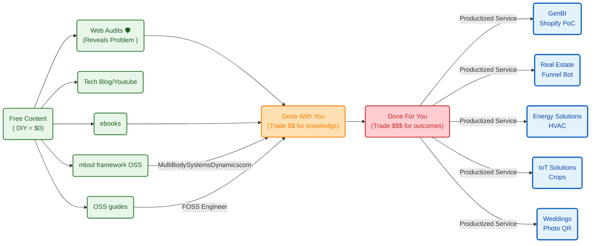
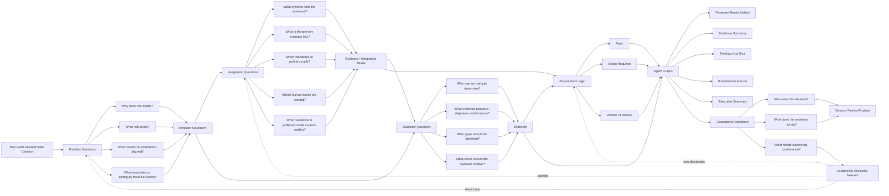

**Tl;DR**

Still thinking on headcounts to mess around with a project instead of [getting ~~shit done~~ outcomes](#choosing-my-wow)?

**Intro**

* WHY Im writting this post: *bc I wanted to continue the Home x IoT Improvements, made the [mbsd 0-7-0 release](#mbsd) and used [cloudflare KV to get leads](#leeeeads)*
* What [Ive learnt](#conclusions) with it: *Ive ended up [telling agents the WHY](#pio), not the how, via PIO fwk*

A friend told me once that I will do sth with energy at some point

Another, the coding is my thing

It seems that both were right.

## Updates



```mermaid
flowchart LR
    %% --- Styles ---
    classDef free fill:#E8F5E9,stroke:#2E7D32,stroke-width:2px,color:#1B5E20;
    classDef low fill:#FFF9C4,stroke:#FBC02D,stroke-width:2px,color:#FBC02D;
    classDef mid fill:#FFE0B2,stroke:#F57C00,stroke-width:2px,color:#F57C00;
    classDef high fill:#FFCDD2,stroke:#C62828,stroke-width:2px,color:#C62828;
    classDef bridge fill:#E3F2FD,stroke:#1565C0,stroke-width:3px,color:#0D47A1;

    %% --- Nodes ---
    L0("Free Content<br/>( DIY = $0)"):::free
    L1("Web Audits 🛡️<br/>(Reveals Problem )"):::free
    L11("Tech Blog/Youtube"):::free
    L12("ebooks"):::free
    L13("mbsd framework OSS"):::free
    L14("OSS guides"):::free

    L3("Done With You<br/>(Trade $$ for knowledge)"):::mid
    L4("Done For You<br/>(Trade $$$ for outcomes)"):::high
    L44("GenBI<br/>Shopify PoC"):::bridge
    L45("Real Estate<br/>Funnel Bot"):::bridge
    L46("Energy Solutions<br/>HVAC"):::bridge
    L47("IoT Solutions<br/>Crops"):::bridge
    L48("Weddings<br/>Photo QR"):::bridge

    %% --- Connections ---
    L0 --> L1
    L1 --> L3
    L12 --> L3
    L13 -->|MultiBodySystemsDynamicscom| L3
    L14 -->|FOSS Engineer| L3
    L0 --> L11
    L0 --> L12
    L0 --> L13
    L0 --> L14
    L3 --> L4
    L4 -->|Productized Service| L44
    L4 -->|Productized Service| L45
    L4 -->|Productized Service| L46
    L4 -->|Productized Service| L47
    L4 -->|Productized Service| L48
```

### MBSD

Its been few weekly releases for the **multi body OSS framework**: 

* https://github.com/JAlcocerT/mbsd-core
* https://ebooks.jalcocertech.com/books/mechanism-analytics/

All linked to: https://multibodysystemsdynamics.com/ for which I have the [web UI repo here](https://github.com/JAlcocerT/multi-body).


{}

```sh
scp jalcocert@192.168.1.2:/home/jalcocert/multibody-tests/v-0-6-0-concerns.md . 
#scp jalcocert@192.168.1.2:/home/jalcocert/multibody-tests/whitepaper.md . 
#scp jalcocert@192.168.1.2:/home/jalcocert/multibody-tests/roadmap.md .
```

Both repos are in good shape and I'd release tomorrow. There's one thing to fix first (the install
  instructions) and one thing to do in the right order (tagging). I didn't change any files.

  What I checked
  - mbsd-core: all 67 tests pass, ruff is clean, and the 3 bundled examples run. Constraint residuals
    are around 1e-10.
  - mbsd-examples: make check passes, covering 13 examples, the gallery and ruff. Regenerating the
    gallery gives byte-identical PNGs, so the committed images match the code.
  - New spatial code: spatial/kinematics.py looks correct. Poses compose and invert properly,
    point_velocity uses a world-frame angular velocity consistently, and the fixed-joint residual flips
    the quaternion sign to take the shortest rotation. Negative body indices are rejected when frames
    and joints are created, which I confirmed. The README is careful to say this is residual-based with
    no 3D solver, which keeps expectations right.

  Fix before tagging
  1. The install instructions still point to v0.6.0.
     - mbsd-core/readme.md:24 has git checkout v0.6.0.
     - mbsd-examples/README.md:25-26 checks out v0.6.0 for both repos. Anyone following the README
       tomorrow gets last week's release.
  2. Tag core before you push examples to main. The examples CI checks out JAlcocerT/mbsd-core@v0.7.0,
     and that tag isn't on the remote yet. Both repos are on local v0.7.0-dev branches with no
     upstream. Do it in this order: merge core into main, push, tag v0.7.0, push the tag; then do the
     same for examples. Otherwise the examples CI goes red on release day.

  Worth tidying, but not blockers
  - Private plans in public changelogs. They mention "PWA-style validation panels", "PWA/CAD consumers"
    and "Keep public browser/PWA code outside the OSS repositories". If the PWA is your private
    product (there's a private-pwa-roadmap.md next to the repos), you may not want it in OSS
    changelogs. "Week 7 release" is also internal wording.
  - Stale version notes in the core README. It says "MBSD 0.4.0 includes portable export helpers" and
    "The 0.4.0 handoff schemas". This reads fine as history, but a "since 0.4" style would date better.
  - The examples README is a stack of per-release notes (v0.4.0, v0.5.0, v0.6.0, 0.7.0). That belongs
    in the CHANGELOG; a short description of what each example shows would read better.
  - No PyPI release yet. Installing requires cloning, and examples uses uv.sources = ../mbsd-core.
    That's fine while the API changes weekly, but pip install mbsd would make it much easier to adopt.
    The packaging (hatchling, wheel smoke test in CI) is ready for it.
  - Spatial tests: joint_residual_jacobian is only checked by finite differences. An analytic Jacobian
    for the spherical joint would give you a reference to check against, and you'll need one anyway for
    a 3D solver.

  Overall
  The scope is honest: "planar is stable, spatial is experimental", and the README says when to use
  Chrono, Exudyn or Simbody instead. The validation is thorough for a project this size, with residual
  checks, finite-difference checks on derivatives, provenance in results, and versioned schemas that
  can still read v1. release-compatibility.json plus CI pinned to the paired core tag is a clean way to
  keep the two repos in step.


```sh
#claude --dangerously-skip-permissions -p "promptwhateverrrr" #yolo
cd /home/jalcocert/Desktop/mbsd-framework/mbsd-core

git switch main
git merge --ff-only v0.7.0-dev
git tag -a v0.7.0 -m "MBSD Core v0.7.0"
git push origin main
git push origin v0.7.0

awk '
  /^## v0\.7\.0 / { found=1; next }
  /^## / && found { exit }
  found { print }
' CHANGELOG.md | gh release create v0.7.0 \
  --repo JAlcocerT/mbsd-core \
  --verify-tag \
  --title "MBSD Core v0.7.0 - Spatial Kinematics Preview" \
  --notes-file - \
  --latest
```

Then examples:

```sh
cd /home/jalcocert/Desktop/mbsd-framework/mbsd-examples

git switch main
git merge --ff-only v0.7.0-dev
git tag -a v0.7.0 -m "MBSD Examples v0.7.0"
git push origin main
git push origin v0.7.0

awk '
  /^## v0\.7\.0 / { found=1; next }
  /^## / && found { exit }
  found { print }
' CHANGELOG.md | gh release create v0.7.0 \
  --repo JAlcocerT/mbsd-examples \
  --verify-tag \
  --title "MBSD Examples v0.6.0 - Spatial Kinematics Preview" \
  --notes-file - \
  --latest
```

> https://github.com/JAlcocerT/mbsd-core/releases/tag/v0.7.0

The remaining **roadmap**:

Publish only MBSD Core to PyPI:

- Package: mbsd
- Version: 0.7.0
- Artifacts:
  - mbsd-0.7.0-py3-none-any.whl
  - mbsd-0.7.0.tar.gz

- Runtime dependencies: NumPy and SciPy
- Includes planar APIs plus experimental mbsd.spatial

Do not publish mbsd-examples yet. Its wheel is only a package marker and does not include the runnable examples or gallery. Users should clone that repository.

After tagging:

```sh
cd /home/jalcocert/Desktop/mbsd-framework/mbsd-core

uv build
uvx twine check dist/*
uvx twine upload dist/mbsd-0.7.0*

Users could then install with:

pip install mbsd==0.7.0
```

GitHub releases and PyPI serve different purposes.

  PyPI advantages

  - Users install directly with pip install mbsd.
  - Dependency managers can resolve versions automatically.
  - Tools such as uv, Poetry and CI understand package constraints.
  - Easier adoption without cloning the repository.
  - Standard upgrade path: pip install --upgrade mbsd.
  - Establishes mbsd as a normal Python dependency.

  GitHub release advantages

  - Shows release notes, tags and source history.
  - Better for reviewing code and downloading examples.
  - Supports repository-specific artifacts.
  - Useful for development snapshots and experimental releases.

  The sensible model is to use both:

  1. Git tag and GitHub release remain the authoritative release record.
  2. Publish the same tested mbsd-core wheel and sdist to PyPI.
  3. Keep mbsd-examples as a GitHub/source-first repository.

The main PyPI cost is permanence: published versions generally cannot be replaced. If 0.7.0 is wrong,
you publish 0.7.1; you do not overwrite it. That encourages stricter final checks, which your current
release process already provides.

> It was time to rebump the [web](https://github.com/JAlcocerT/multi-body/tree/master/web-sleek) and [app](https://github.com/JAlcocerT/multi-body/tree/master/app): `https://github.com/JAlcocerT/multi-body`

I didn't change the live site's repo (multi-body/); its last commit is still your "cf upload". I
  only read it and copied its content into the new site. Your core, examples and mbsd/ workbench
  folders are also untouched.

  All changes are in the two repos I created, plus two notes files at the framework root:
  - multibodysystemsdynamics-site/: the first commit (d5522a0) is your original landing page,
    unchanged, so you can roll back to it. Then the Astro port (3a91022) and the content moved over
    from v1 (499247f).
  - app-mbsd/: the first commit (2f955dc) is the old prototype as it was, then the restructure
    (68ba499).
  - At the framework root: z-multibody-webs-order.md and the new z-review.md.

  Nothing is pushed or deployed.

  z-review.md covers:
  - Where I changed things: a table of every folder, saying touched or read-only.
  - Changes per repo: every commit, and every place I altered your own wording. For example, I replaced
    the broken code sample, rewrote the private-repo "Reproduce" section, fixed the swapped Grashof
    table, and rewrote the legal pages. It also lists the new copy I wrote that you haven't reviewed
    yet.
  - What works: only what I actually tested, with the numbers.
  - What doesn't work yet or is unverified:
    - Blocking launch: nothing is deployed, the legal pages still need your details, the app needs the
      v0.7.0 tag first, and the site's solver buttons 404 until the app is live.
    - Never run against the real service: the contact and ebook storage, analytics, and the app on
      Safari/iOS. The browser tests also live only in my scratch folder, not in any repo.
    - Content caveats: the case-study figures are the closest real ones, not exact matches, and I kept
      v1's performance claims without re-checking them.
  - My strategic view:
    - What works: the split between open core, free tools, site content and consulting; real numbers as
      the brand; and v1's writing as your best SEO asset.
    - What doesn't: the old "platform" story clashes with the consulting-plus-open-core story; the
      email capture is still manual; the app's first load is heavy on mobile; there's no outside proof
      like testimonials yet; and two sites plus a PWA plus weekly releases is a lot to maintain alone.


What I checked:
  - multi-body is private. An anonymous request to the GitHub API returns 404, while mbsd-core,
    mbsd-examples and mechanism are public (MIT). So the line between private product and public engine
    is already where you want it.
  - The v0.7.0 tag is on ef891e4 in core. That's exactly the commit the app's wheel was built and
    tested from, so the app's version check now passes.
  - external/ doesn't reference the OSS you just released. The two submodules point to JAlcocerT/mbsd
    (your private workbench) and mechanism, not to mbsd-core/mbsd-examples. Neither is checked out
    locally.
  - Your GitHub releases have no files attached, and the name mbsd is unclaimed on PyPI.

  Why one private repo for site and app is right:
  - They change together: tool deep-link parameters, brand, UTM conventions and the privacy policy
    (which covers both) all span the two.
  - The OSS stays clean, and only released, tagged versions cross into the private repo.
  - You stop having a third local repo with no remote; today the site and app exist only on your disk.

  Proposed layout:
  multi-body/                 (private)
    web/                      ← multibodysystemsdynamics-site (Astro + functions/)
    app/                      ← app-mbsd (Vite PWA)
    docs/                     ← z-*.md, UTM convention, decisions worth keeping from v1
    archive/web-v1/           ← or simply delete it after the DNS switch; git history keeps it
    external/                 ← dev-only references (optional)

  The real decision: how the app gets mbsd-core. Today it builds the wheel from a sibling ../mbsd-core
  checkout. That works on your laptop but not in a clean clone or a Cloudflare build. Options:

  ┌─────────────────────────────────┬────────────────────────────────────┬─────────────────────────┐
  │             Option              │                Pros                │          Cons           │
  ├─────────────────────────────────┼────────────────────────────────────┼─────────────────────────┤
  │ A. Publish mbsd to PyPI; the    │ Cleanest: no checkout needed,      │                         │
  │ app downloads the pinned        │ works in any CI; pip install mbsd  │ One more release step   │
  │ version and checks its hash     │ helps OSS adoption; claims the     │ (uv publish)            │
  │                                 │ name before someone else does      │                         │
  ├─────────────────────────────────┼────────────────────────────────────┼─────────────────────────┤
  │ B. Attach the wheel to each     │                                    │ Less discoverable;      │
  │ GitHub release; the app         │ No PyPI account needed             │ still a manual upload   │
  │ downloads it                    │                                    │ unless CI does it       │
  ├─────────────────────────────────┼────────────────────────────────────┼─────────────────────────┤
  │ C. Submodule external/mbsd-core │ Works offline; matches your        │ Submodules are fiddly;  │
  │  at the tag; build the wheel    │ current external/ habit            │ CI needs uv; easy to    │
  │ during the app build            │                                    │ forget to update        │
  └─────────────────────────────────┴────────────────────────────────────┴─────────────────────────┘

  I'd recommend A. Option C is fine as a convenience for local work, but it shouldn't be how deploys
  get core. Whichever you pick, the version check (mbsd.pin.json + hash) stays the same; only the place
  the wheel comes from changes.

  Things to settle before moving:
  1. Keep the histories? Both repos are tiny (3 and 2 commits). git subtree add --prefix=web
     ../multibodysystemsdynamics-site main keeps every commit. A plain copy is simpler. I'd keep them;
     it's free.
  2. Two Cloudflare Pages projects from one repo. Each gets a root directory (web/, app/) and build
     watch paths, so editing a glossary entry doesn't redeploy the 30 MB app. The site's functions/
     folder has to sit at its project root, which it does if the root directory is web/.
  3. What happens to web/v1/. Once DNS points at the new site, keeping v1 in the tree gives you two
     copies of the glossary and case studies to maintain. Archive or delete it, but first move out
     anything still useful (decisions/, perhaps programmatic-formbricks/ if you might bring the
     Formbricks qualifier back).
  4. What external/mbsd (the private workbench) is for. The case-study figures came from it. That's
     fine as a source, but don't make deploys depend on it: copy the assets in, as I did, so builds
     never need access to a private submodule.
  5. Shared tooling at the root: a top-level Makefile (make web, make app, make check) and one CI
     workflow running the site checks plus the app's Python/Pyodide tests on push.

  Suggested order:
  1. Publish mbsd 0.7.0 to PyPI (or attach the wheels to the GitHub release).
  2. Switch the app to download the pinned wheel.
  3. Move web/ and app/ into multi-body, keeping history.
  4. Set up the two Pages projects.
  5. Switch DNS.
  6. Archive v1.

  Tell me which way you want to fetch core, and whether to keep the history, and I'll do the move.
  Publishing to PyPI needs your account, so that step is yours. I can prepare the commands.


The app doesn't need PyPI at all. It only needs one file, the 54 KB mbsd-0.7.0-py3-none-any.whl
  built from your v0.7.0 tag, and the sync script already accepts a wheel from anywhere (MBSD_WHEEL=…).
  There are three ways to supply it without PyPI:

  1. Commit the wheel into the private repo (e.g. app/vendor/mbsd-0.7.0-py3-none-any.whl). This is the
     simplest. 54 KB per release is nothing for git, builds need no network or core checkout, and the
     hash in mbsd.pin.json still guarantees it's the exact file. Updating means build at the new tag,
     copy the file in, bump the pin.
  2. Attach the wheel to the GitHub release and have the app download it by URL and hash. It's tidier
     than committing binaries, but each release needs an upload step, which is manual unless a GitHub
     Action does it.
  3. Submodule at the tag, built during the app build. It works, but it's the most fragile in CI.

  For getting the app live, I'd do option 1 now. It removes the last dependency on your local folder
  layout.

  Is PyPI worth it before 1.0? Not necessary yet. Do it if you want people to use the library, and I'd
  lean towards doing it soon, for these reasons:

  - 0.x is normal on PyPI. By semver convention 0.x means "API may change", and your Development Status
    :: 3 - Alpha classifier says so explicitly. Plenty of widely used packages lived on 0.x for years.
    Nobody expects stability from 0.7.
  - The name is free right now. mbsd is short and unclaimed, and a single upload reserves it. If
    someone else takes it, you'd have to publish under something like mbsd-core.
  - It makes adoption easier. "Clone, check out the tag, uv sync" loses most casual users; pip install
    mbsd doesn't. Your README, site and tool pages could all show the one-liner.
  - The cost is small with GitHub Actions trusted publishing: a tag push builds and uploads
    automatically, with no API tokens. That fits your weekly release rhythm.

  The downside is a soft commitment: once it's on PyPI, people may pin it, and you can yank releases
  but not delete them cleanly. Keep mbsd.spatial clearly marked experimental (it already is), and treat
  breaking changes in 0.x minor versions as allowed but documented in the changelog.

  My suggestion: commit the wheel into the private repo now, so the app's path to launch doesn't depend
  on any of this. Then, when you're ready, add trusted publishing to mbsd-core and publish 0.7.0 to
  claim the name. After that, the app can switch to downloading from PyPI, or just keep committing the
  wheel.


......


● These are the commands, in order. Run them from mbsd-framework/. I checked the starting state:
multi-body is on master with no uncommitted changes, its .gitignore only ignores .env, and both local
repos use a main branch.

1. Branch and add the OSS repos as submodules at v0.7.0

```sh
cd ~/Desktop/mbsd-framework/multi-body
git switch -c web-sleek-and-app

git submodule add https://github.com/JAlcocerT/mbsd-core.git external/mbsd-core
git submodule add https://github.com/JAlcocerT/mbsd-examples.git external/mbsd-examples
git -C external/mbsd-core checkout v0.7.0
git -C external/mbsd-examples checkout v0.7.0
git add .gitmodules external/mbsd-core external/mbsd-examples
git commit -m "Reference mbsd-core and mbsd-examples v0.7.0 as submodules"
```

2. Bring in the new site and the app, keeping their git history

```sh
#git subtree add needs a clean working tree, so do this before building anything. ./web is left
#untouched.

git subtree add --prefix=web-sleek ../multibodysystemsdynamics-site main
git subtree add --prefix=app       ../app-mbsd main
```

3. Build the wheel from the tag and put it in the repo

```sh
mkdir -p app/vendor
(cd external/mbsd-core && uv build --wheel --out-dir ../../app/vendor)
ls -la app/vendor # expect mbsd-0.7.0-py3-none-any.whl (~54 KB)
sha256sum app/vendor/mbsd-0.7.0-py3-none-any.whl
```

4. Point paths at the new layout

Four one-line edits:
- the app uses the committed wheel by default;
- the app's version check and demo tests look in external/mbsd-core;
- the site's snippet check does the same.

```sh
# # app: use the committed wheel unless MBSD_WHEEL is overridden
# sed -i '/^CF_PAGES_BRANCH/a export MBSD_WHEEL ?= $(CURDIR)/vendor/mbsd-0.7.0-py3-none-any.whl' app/Makefile
# # app: fallback core checkout + CPython demo tests now live in external/
# sed -i 's|"\.\./mbsd-core"|"../external/mbsd-core"|' app/scripts/sync-mbsd-wheel.mjs
# sed -i 's|"test:demos": "../mbsd-core/.venv/bin/python tests/test_demos.py"|"test:demos": "uv run --project ../external/mbsd-core python tests/test_demos.py"|' app/package.json
# # web-sleek: the snippet check runs against external/mbsd-core
# sed -i 's|^MBSD_PYTHON ?= ../mbsd-core/.venv/bin/python|MBSD_PYTHON ?=../external/mbsd-core/.venv/bin/python|' web-sleek/Makefile
# sed -i 's|ROOT.parent / "mbsd-core"|ROOT.parent / "external" / "mbsd-core"|'web-sleek/scripts/verify-snippets.py
# 1. Remove the unwanted .gitignore
rm app/vendor/.gitignore

# 2. Fix path in verify-snippets.py
sed -i 's|ROOT.parent / "mbsd-core"|ROOT.parent / "external" / "mbsd-core"|' web-sleek/scripts/verify-snippets.py

# 3. Clean up spacing in web-sleek/Makefile
sed -i 's|^MBSD_PYTHON ?=\.\./|MBSD_PYTHON ?= ../|' web-sleek/Makefile

# Confirm settings
git check-ignore -v app/vendor/mbsd-0.7.0-py3-none-any.whl || echo "wheel not ignored: ok"
grep -n 'external' web-sleek/scripts/verify-snippets.py
```

If the wheel's filename ever disagrees with app/mbsd.pin.json, the sync script stops the build, so the hardcoded `0.7.0` in the Makefile can't drift silently.

5. Verify, then commit and push:

```sh
# Sync and run test suites
(cd external/mbsd-core && uv sync)
(cd app && npm ci && make test && make build)
(cd web-sleek && npm ci && make check)

# Check status, stage, commit, and push
git status --short
git add app/vendor/mbsd-0.7.0-py3-none-any.whl \
        app/Makefile \
        app/package.json \
        app/scripts/sync-mbsd-wheel.mjs \
        web-sleek/Makefile \
        web-sleek/scripts/verify-snippets.py
git commit -m "Vendor mbsd 0.7.0 wheel for the app; point web-sleek and app at external/"
git push -u origin web-sleek-and-app
```

**What's left** is the list from before: merge the PR, fill in the legal placeholders, deploy the app and
then the site, move the domain, and tidy up the old folders.


All commands organized in order, with broken lines fixed, placeholders highlighted, and your decision to keep the `web/` directory intact reflected in Step 6.

Run these from `~/Desktop/mbsd-framework/multi-body`:

Step 1: Merge the PR

```bash
gh pr create --base master --head web-sleek-and-app --fill
gh pr merge web-sleek-and-app --merge --delete-branch
git switch master && git pull
git submodule update --init external/mbsd-core external/mbsd-examples
```

Step 2: Fill in Legal Placeholders

> Avoid using `|` or `&` characters in these variables, as `sed` uses them as delimiters.

```bash
# Define your legal metadata
ENTITY="Your Name or Company S.L."
ADDRESS="Street 1, 28001 Madrid, Spain"
AUTHORITY="Agencia Española de Protección de Datos (aepd.es)"
JURISDICTION="Spain"

# Replace placeholders across legal markdown files
sed -i -e "s|{{LEGAL_ENTITY}}|$ENTITY|g" \
       -e "s|{{LEGAL_ADDRESS}}|$ADDRESS|g" \
       -e "s|{{SUPERVISORY_AUTHORITY}}|$AUTHORITY|g" \
       -e "s|{{JURISDICTION}}|$JURISDICTION|g" \
       web-sleek/src/content/legal/*.md

# Verify and commit
(cd web-sleek && make check-legal)
git commit -am "Fill in legal details" && git push

```

Step 3: Cloudflare Setup

```bash
# Authenticate and inspect account
npx wrangler login
npx wrangler whoami
npx wrangler pages project list

# Create production projects
npx wrangler pages project create app-mbsd --production-branch main
npx wrangler pages project create multibodysystemsdynamics-site --production-branch main

# Create KV storage for lead collection (copy the printed ID)
npx wrangler kv namespace create LEADS
```

*Update `web-sleek/wrangler.toml`: uncomment the `[[kv_namespaces]]` block and insert the namespace ID output from above.*

```bash
# (Optional) Add notification webhook secret
npx wrangler pages secret put LEAD_WEBHOOK_URL --project-name multibodysystemsdynamics-site

# Commit KV configuration
git commit -am "Bind LEADS KV namespace" && git push

```

Step 4: Deploy & Verify Staging

```bash
# Deploy app and site
(cd app && make deploy)
(cd web-sleek && make deploy)

# Test contact form API submission (expects HTTP 202)
curl -s -o /dev/null -w "%{http_code}\n" -X POST \
  https://multibodysystemsdynamics-site.pages.dev/api/contact \
  -H "Content-Type: application/json" \
  -d '{"name":"Deploy test","email":"you@example.com","project":"Something else","details":"test"}'

# Verify lead storage in KV (replace <LEADS_ID>)
npx wrangler kv key list --namespace-id <LEADS_ID> --remote
```

Step 5: Configure Custom Domains

Create an API token with `Cloudflare Pages: Edit` permissions before executing:

```bash
# Set your Cloudflare variables
ACCOUNT="<account-id>"
TOKEN="<api-token>"
OLD="<v1-project-name>"
API="https://api.cloudflare.com/client/v4/accounts/$ACCOUNT/pages/projects"

# 1. Attach app subdomain (zero downtime)
curl -s -X POST "$API/app-mbsd/domains" \
  -H "Authorization: Bearer $TOKEN" \
  -H "Content-Type: application/json" \
  -d '{"name":"app.multibodysystemsdynamics.com"}'

# 2. Reassign apex domain from v1 to new site
curl -s -X DELETE "$API/$OLD/domains/multibodysystemsdynamics.com" \
  -H "Authorization: Bearer $TOKEN"

curl -s -X POST "$API/multibodysystemsdynamics-site/domains" \
  -H "Authorization: Bearer $TOKEN" \
  -H "Content-Type: application/json" \
  -d '{"name":"multibodysystemsdynamics.com"}'

# 3. Check status until state shows "active"
curl -s "$API/multibodysystemsdynamics-site/domains" \
  -H "Authorization: Bearer $TOKEN" | python3 -m json.tool | grep -E '"name"|"status"'
```

Dashboard Tasks

* **Redirect Rules:** Navigate to `Rules` → `Redirect Rules`, set `[www.multibodysystemsdynamics.com/](https://www.multibodysystemsdynamics.com/)*` → `[https://multibodysystemsdynamics.com/$](https://multibodysystemsdynamics.com/$){1}` with status **301**.
* **Web Analytics:** Navigate to `Analytics` → `Web Analytics` → add the site to activate telemetry mentioned in your privacy policy.

Live Smoke Test:

```bash
for p in / /tools/ /glossary/grashof-condition/ /case-studies/practica/ /legal/privacy/ /rss.xml; do
  curl -s -o /dev/null -w "%{http_code} $p\n" "https://multibodysystemsdynamics.com$p"
done
curl -s -o /dev/null -w "%{http_code} app\n" https://app.multibodysystemsdynamics.com/

```

Step 6: Mark Old v1 as Inactive (Preserving All Files)

This retains `decisions/`, `programmatic-formbricks/`, and legacy source code in place, only annotating the status:

```bash
cat >> web/v1/readme.md <<'EOF'

> **Status (2026-10):** no longer deployed. multibodysystemsdynamics.com is served from `web-sleek/`.
> Glossary, case studies, FAQ and legal content were ported there and are edited in `web-sleek/src/content/`.
> `decisions/`, `programmatic-formbricks/`, `playbooks/` and `requirements/` remain the reference here.
EOF

git commit -am "Mark web/v1 as not deployed; content lives in web-sleek" && git push
```


 The new app is live in production at https://app-mbsd.pages.dev. This replaces the old prototype in
    that project; I switched its production branch from app-mbsd to main. make deploy ran the version
    check, the Python and Pyodide tests, then the upload. I re-tested the live URL in a real browser:
    the site's four-bar link solves (49.6°, μ 46.1–99.2°), the service worker takes over, and an
    offline reload still solves, with no errors. Cache headers are correct in production.
  - app.multibodysystemsdynamics.com is attached to the app, but it's waiting on DNS (below).
  - Contact-form storage is ready: I created the KV namespace LEADS (e4e917c9…) and bound it in
    web-sleek/wrangler.toml.
  - Site project created: multibodysystemsdynamics-site, empty until its first deploy.
  - "Not deployed" note added to web/v1/readme.md; nothing else in web/ was touched.
  - Committed and pushed: e6ff6d4 on master.
  - Your live site is untouched. The apex domain still serves v1 from the multibodysystemsdynamics
    project. All three projects are direct-upload, so the merge to master deployed nothing.

  What I need from you:

  1. One DNS record (about 30 seconds). Your wrangler login can't write DNS. In the Cloudflare
     dashboard: multibodysystemsdynamics.com → DNS → Add record:
     - Type CNAME, Name app, Target app-mbsd.pages.dev, Proxied (orange cloud).

     Alternatively: Workers & Pages → app-mbsd → Custom domains → click Activate, which creates the
     record for you. Tell me when it's done and I'll confirm the domain goes active and test it.
  2. Your legal details, so I can fill in the placeholders, deploy the site and switch the apex domain:
     - Legal entity: your name as a sole trader, or a company name.
     - Postal address to show.
     - Supervisory authority: for Spain, AEPD (aepd.es); otherwise your country's.
     - Jurisdiction for the terms, e.g. Spain.

     Once I have these: fill them in, run make deploy for the site, test it on
     multibodysystemsdynamics-site.pages.dev, including a test enquiry into KV, then move the apex
     domain from v1 to the new project. The move means a few minutes while the new certificate is
     issued. v1 stays deployed as your rollback.
  3. Two dashboard toggles, whenever convenient:
     - Turn on Web Analytics for the site; the privacy policy says you use it.
     - www doesn't exist today. That's not a regression, but adding a www CNAME plus a redirect rule to
       the apex is a nice extra.

  New leads currently go only into KV, so nothing notifies you when someone writes. If you want a ping,
  give me a Slack, Discord or n8n webhook URL and I'll set it as LEAD_WEBHOOK_URL.

can i do so that instead of proxy to app, ill have ci/cd via github?

● Yes, and I'd recommend it. These are two separate things, though:

  1. The DNS record is still needed, whatever deploys the app. It's what points
  app.multibodysystemsdynamics.com at the Pages project. CI/CD only changes who uploads the build
  (GitHub instead of your laptop), not where the domain points. On "proxy": both settings work. Proxied
  (orange cloud) is Cloudflare's default for Pages custom domains, and DNS-only (grey) is fine too.
  Either way, add the CNAME app → app-mbsd.pages.dev record or click Activate in the Pages dashboard.

  2. For CI/CD, use GitHub Actions rather than Cloudflare's "Connect to Git". Cloudflare's built-in git
  integration doesn't fit here:
  - Your three projects are direct-upload, and Cloudflare can't convert a direct-upload project to
    git-connected; you'd have to recreate the projects.
  - Its builder clones submodules, and the private external/mbsd would fail the build.
  - It can't run your gates (the version check, the Python and Pyodide tests, check-legal) the way a
    workflow can.

  GitHub Actions with cloudflare/wrangler-action keeps the existing projects and deploys exactly as
  make deploy does today:

  .github/workflows/deploy-app.yml   on push to master, paths: app/**
    checkout (no submodules) → init only external/mbsd-core
    → npm ci → make test (CPython + Pyodide) → MBSD_STRICT_PIN build
    → wrangler pages deploy dist --project-name app-mbsd --branch main

  .github/workflows/deploy-web.yml   on push to master, paths: web-sleek/**
    checkout → init external/mbsd-core → npm ci → make check (astro, function types, snippets,
  check-legal)
    → wrangler pages deploy dist --project-name multibodysystemsdynamics-site --branch main

  Both: pull requests run the same checks and deploy a preview (branch = PR branch),
  so every PR gets its own *.pages.dev URL.

  How it works:
  - Path filters: editing a glossary entry redeploys only the site, and touching app/ redeploys only
    the app.
  - Private repo access: never needed. The workflows only pull the public external/mbsd-core, and the
    app uses the committed wheel.
  - Secrets: add two in GitHub, under Settings → Secrets and variables → Actions:
    - CLOUDFLARE_ACCOUNT_ID = 6f6de37edde332d0622d5802db839ff7
    - CLOUDFLARE_API_TOKEN: create it in Cloudflare under My Profile → API Tokens, with the single
      permission Account → Cloudflare Pages → Edit.
  - make deploy keeps working from your laptop as a fallback.

  The site workflow will fail at check-legal until the legal placeholders are filled in. That's
  intended: it stops a placeholder privacy page from going live through CI too.

  Shall I write both workflow files and push them? Once you've added the two secrets, the next push to
  master deploys automatically.


  Existing projects
  A. GitHub Actions + wrangler (direct upload): Keeps them as they are: app-mbsd (already live, domain
  attached), multibodysystemsdynamics-site (KV bound)
  B. Cloudflare "Connect to Git": Cloudflare can't convert direct-upload projects, so you'd recreate
  both (new names), re-attach the app domain and re-bind KV
  ────────────────────────────────────────
  Private external/mbsd submodule
  A. GitHub Actions + wrangler (direct upload): Not a problem: checkout skips submodules and pulls only

  the public external/mbsd-core
  B. Cloudflare "Connect to Git": Breaks builds. Cloudflare clones submodules and doesn't support
  private ones. You'd have to remove that submodule or move it out of the repo
  ────────────────────────────────────────
  Quality gates before deploy
  A. GitHub Actions + wrangler (direct upload): Full control: version check, Python and Pyodide tests,
  astro check, snippets, check-legal. A failing gate blocks the deploy
  B. Cloudflare "Connect to Git": Only what fits in one build command. Possible, but the Python tests
  need uv installed on each run and the Pyodide smoke test adds ~20 s, all inside Cloudflare's build
  image
  ────────────────────────────────────────
  Monorepo (only redeploy what changed)
  A. GitHub Actions + wrangler (direct upload): paths: filters per workflow
  B. Cloudflare "Connect to Git": Supported too (root directory plus build watch paths per project)
  ────────────────────────────────────────
  PR previews
  A. GitHub Actions + wrangler (direct upload): Yes, but you wire it up (deploy with the PR branch
  name;
  posting the preview URL as a PR comment takes an extra step)
  B. Cloudflare "Connect to Git": Yes, out of the box, with the URL posted on the PR automatically
  ────────────────────────────────────────
  Setup effort
  A. GitHub Actions + wrangler (direct upload): Two workflow files (I write them) plus two GitHub
  secrets (account ID and an API token)
  B. Cloudflare "Connect to Git": A few dashboard clicks, but also: recreate projects, deal with the
  submodule, configure Node version and build commands
  ────────────────────────────────────────
  Secrets to manage
  A. GitHub Actions + wrangler (direct upload): A Cloudflare API token stored in GitHub (scoped to
  Pages: Edit only)
  B. Cloudflare "Connect to Git": None in GitHub; Cloudflare's GitHub app handles access
  ────────────────────────────────────────
  Build limits (free tiers)
  A. GitHub Actions + wrangler (direct upload): GitHub Actions: 2,000 min/month for private repos; each

  run ~2–3 min
  B. Cloudflare "Connect to Git": Cloudflare Pages: 500 builds/month, one build at a time
  ────────────────────────────────────────
  Where you see failures
  A. GitHub Actions + wrangler (direct upload): GitHub Actions tab, with full logs next to the code
  B. Cloudflare "Connect to Git": Cloudflare dashboard; GitHub shows only a pass/fail check
  ────────────────────────────────────────
  Manual fallback
  A. GitHub Actions + wrangler (direct upload): make deploy from your laptop still works, same path
  B. Cloudflare "Connect to Git": Mixing manual uploads with git-connected projects gets confusing
  ────────────────────────────────────────
  Lock-in / portability
  A. GitHub Actions + wrangler (direct upload): Plain CI; the deploy step is the only
  Cloudflare-specific part
  B. Cloudflare "Connect to Git": Tied to Cloudflare's builder

  What favours B: the least moving parts if you were starting fresh, PR preview comments for free, and
  no API token to look after.

  What favours A: it works with the projects and domain you already have, it sidesteps the private
  submodule entirely, and it enforces the checks that caught real problems earlier: the version check,
  the demo tests, and the legal placeholders.

  My recommendation: A. In your setup, B's biggest advantage (simplicity) is cancelled out by having to
  recreate the projects and restructure the repo around the private submodule. With A, nothing that's
  live today changes, and every deploy runs the same gates you just watched pass locally.

**Next core release (for later)**:

```sh
git -C external/mbsd-core fetch --tags && git -C external/mbsd-core checkout v0.8.0
git rm app/vendor/mbsd-0.7.0-py3-none-any.whl
(cd external/mbsd-core && uv build --wheel --out-dir ../../app/vendor)
# then bump app/mbsd.pin.json (version + ref) and the MBSD_WHEEL line in app/Makefile
git add external/mbsd-core app/vendor app/mbsd.pin.json app/Makefile && git commit -m "Bump mbsd to
0.8.0"
```

Two caveats

- Cloudflare can't build this repo from git as-is. Its git integration clones submodules, and
external/mbsd (your private workbench) will fail to clone. Deploy with make deploy from web-sleek/
and app/ instead (that uploads the build directly), or remove that submodule before connecting the
repo to Cloudflare. The committed wheel means the app build never needs a submodule anyway.

- Once the push looks good, archive or delete the old standalone folders
(multibodysystemsdynamics-site/, app-mbsd/, mbsd-core-web-later/), so you only edit one copy.

I can run all of this myself if you'd rather; it stops before pushing, so you can review the branch
first.

{}

### Energy

Since I read a post about aerothermics, Ive [been gathering DHT22](https://jalcocert.github.io/JAlcocerT/thermodynamics/#aerotermia-poc-x-rpi-dht22) data for few experiments: insulation, modelling sun rays going to a particular home considering the surroundings *like mountains or neighbouring buildings*


**1. Model the balcony recess in Blender — my pick.** The scene currently has no loggia at all: 21E is an extruded box with a red marker where the balcony should be. But the recess now drives **45% of the answer**, and the 40.9° profile cap is doing that work invisibly. Cutting the real 1.5 m × 2.5 m opening into the facade would let you look at a render of the sunlit patch on your own floor and say "yes, that's where it reaches" or "no, it comes further in". That's the verification the number can't give itself, and it's the same job the 21F A/B render did.

**2. The seasonal animation.** Twelve frames at 17:00 through the year, showing 21F's shadow climbing your facade and the roof shadow retreating. The counterintuitive headline — March and September are your worst months, December is among your best — is hard to believe in a table and obvious in a loop. `create_ffmpeg_concat.py` is already there.

**3. Nothing to do but keep logging, for two things.** The τ fit needs winter. And the drift test needs September–October, when the departure moves 68 min instead of 13.

**4. A window-open detector from the humidity channels** — you're already logging humidity on both sensors, and an opening shows as a step in both. That would let the winter fit exclude ventilated periods rather than being poisoned by them. Worth building, but it's an enabler with nothing to test against until winter, so I'd hold it.

Want me to start on the recess model? It's the one that makes your observations more useful rather than just prettier — if the render disagrees with what you see on the floor, that tells us the soffit or depth is off before you've spent weeks logging against a wrong cap.

> I got to know *via [T3 desktop](https://fossengineer.com/t3code-web-gui-coding-agents/)* that the flat next to me, 21F, costs me a consistent 2 h+ every clear day

> > https://github.com/JAlcocerT/poc/tree/main/building-geo-pl

<!-- https://youtu.be/dglagVUkynA -->




{}

A few things, and one natural stopping point worth naming first: **the most interesting question left — does the model predict the seasonal drift? — is now blocked on calendar time, not work.** September data does more for it than anything I could build.

That said, ranked by value against effort:

**1. The three-climate comparison — cheapest, and it's the actual payoff**

You now have the *same pipeline* run at three latitudes with three different dominant obstructions, and nobody has ever put them side by side:

| | Gourette | Jerez | Warsaw |
|---|---|---|---|
| December sun peaks at | 23.6° | ~30.9° | **14.2°** |
| What blocks it | **terrain** (ridges 1 km away) | **its own wall** (18× the neighbours) | **one neighbour + its own roof** |
| Direct sun/year | — | 2626 h | **652 h** |
| The counterintuitive bit | 10.7% annual loss but 38.5% in December | 5.7× between facade bearings | worst months are March/September |

Every number already exists. A single comparison doc plus one chart would make the whole family legible as one body of work rather than four folders — and the finding writes itself: *the thing that takes your sun is completely different at each site, and in every case it isn't what the resident assumes.*

**2. Make the October re-run one command — small, high leverage**

Right now, when you pull fresh data, `validate_against_sensors.py` runs but the pre-registered predictions live in markdown and the comparison is manual. 

Half an hour of work makes it emit predicted-vs-observed per day for whatever dates are present, flag the drift automatically, and say whether the 68-minute September signal showed up. Then the test you're actually waiting on costs you one command instead of a conversation.

**3. The seasonal animation — the best artifact**

Now that the loggia is properly modelled with recess and parapet, a year sweep at fixed clock time would show the roof shadow retreating and 21F's climbing.

The March/September-are-worst inversion is hard to believe in a table and obvious in a loop. ~15 minutes of render time; `create_ffmpeg_concat.py` is already there.

**4. "Sun hours for any address" — the reusable thing**

Everything's in place: geocode → OSM footprints → height grid → horizon → profile caps → hours. Generalising `site.json` so it takes an address and a floor would turn four one-off studies into a tool. This is what I'd build if you wanted something other people could use.

**Not worth doing yet**

The **pooled multi-commune DVF study** (the terrain offers matched pairs, but sales cluster, so it's a sampling bet). The **energy calibration** — blocked on winter, and the ventilation problem means summer data can't fix it.

And **consolidating the drifted shared modules** into a real package: genuinely overdue now that `horizon_profile.py` exists in three forks plus this one, but boring, and nothing is currently broken by it.

**My pick: #1, then #2.** The comparison costs almost nothing because the numbers exist, and it's the one that makes everything else make sense. Then #2 so September arrives as a result rather than a task.

{}


```sh
cd ~/Desktop/poc/building-geo-pl
make pull-data
```


My [TP4056 setup](https://jalcocert.github.io/JAlcocerT/data-driven-insulation-evaluation/#home-solar-test-x-tp4056) with the ESP32 x DHT11 suffer recently from a full cloudy week.

I measured the 18650 voltage and it was 3.5V


After catching one sunny day (27-sept) moved the 5V solar panel south and between 10am-12pm went up to 3.6v


I was wondering [how much solar is enough for a micro-controller](https://jalcocert.github.io/JAlcocerT/plants-102-and-iot/#how-much-solar-is-enough-for-the-esp32). Now I know.

Surprise, energy [and geolocation matters](https://jalcocert.github.io/JAlcocerT/iot-crop-intelligence/#geo-matters) :O

```sh
sqlite3 -header -column /home/jalcocert/poc/iot-rpi-dht-insulation/ingester/data/readings.sqlite "SELECT device, metric, value, topic, received_at, received_ms FROM readings WHERE device='esp32' ORDER BY received_ms DESC LIMIT 1;"

sqlite3 -header -column /home/jalcocert/poc/iot-rpi-dht-insulation/ingester/data/readings.sqlite "WITH intervals AS (SELECT device, topic, received_ms - LAG(received_ms) OVER (PARTITION BY topic ORDER BY received_ms) AS delta_ms FROM readings WHERE device IN
  │ ('esp32','pico')), normal AS (SELECT * FROM intervals WHERE delta_ms BETWEEN 1 AND 600000), counts AS (SELECT device, topic, ROUND(delta_ms/1000.0) AS seconds, COUNT(*) AS occurrences, ROW_NUMBER() OVER (PARTITION BY device, topic ORDER BY COUNT(*) DESC,
  │ ROUND(delta_ms/1000.0)) AS rn FROM normal GROUP BY device, topic, ROUND(delta_ms/1000.0)) SELECT n.device, n.topic, COUNT(*) AS intervals, ROUND(AVG(n.delta_ms)/1000.0,2) AS avg_seconds, ROUND(MIN(n.delta_ms)/1000.0,2) AS min_seconds, ROUND(MAX(n.delta_ms)/1000.0,2) AS..............
```

- ESP32: approximately every 64 seconds (average ~67 seconds).
- Pico W: approximately every 60 seconds.

Each device sends temperature and humidity as separate MQTT messages during each cycle. Long offline gaps were excluded.

Based on the observed ~64-second cycle, I’d infer:

- ~60 seconds deep sleep
- ~4 seconds booting, reconnecting to Wi‑Fi/MQTT, reading and publishing
- ~1,350 cycles/day
- ~1.5 hours/day awake

Assuming 80–120 mA average while awake and near-ideal deep sleep:

Daily charge ≈ 120–180 mAh
Daily energy ≈ 0.40–0.60 Wh

A normal ESP32 development board’s regulator, USB chip and LEDs may raise this to roughly:

≈ 0.5–0.9 Wh/day
≈ 140–260 mAh/day from a 3.7 V battery

So my practical estimate is around 0.6 Wh/day. A 2,000 mAh Li-ion battery would likely last approximately 7–12 days after conversion losses.

The ESP32 chip itself draws about 10 µA in deep sleep, but Wi‑Fi receive uses ~95–100 mA and transmission peaks at 180–240 mA. 

> [Espressif ESP32 datasheet](https://documentation.espressif.com/esp32_datasheet_en.html)

The frequent Wi‑Fi reconnections dominate consumption. 

Extending sleep from 1 minute to 5 minutes could reduce daily usage by roughly 75–80%.


A short deepsleep is not efficient as connecting back to wifi requires an energy peak. So upgraded [this esp32 script](https://github.com/JAlcocerT/poc/blob/main/iot-rpi-dht/scripts-microcontrollers/firmware-esp32/esp32-dht11-mqtt-emqx-deepsleep.cpp) to this one that pushes every 10minutes.


The Pico W appears to remain connected to Wi‑Fi between its one-minute publications. For that setup, I’d estimate:

- Wi‑Fi power saving enabled: ~20–35 mA average
- Power saving disabled/busy loop: ~40–70 mA average
- Likely daily energy: ~2.5–6 Wh/day
- Practical midpoint: ~4 Wh/day

That is roughly 5–8× your deep-sleeping ESP32.

The Pico W’s CYW43439 radio can average below 1.3 mA in Wi‑Fi power-save mode, but active receive uses ~37–43 mA and transmission can peak above 270 mA; the RP2040 and board add their own consumption. 

A 2,000 mAh Li-ion might therefore last only around 1–3 days. 

If the Pico disconnects and enters genuine low-power sleep between readings, consumption could be reduced substantially.

If the Pico W truly deep-sleeps for 60 seconds, powers down the Wi‑Fi chip, then wakes and reconnects, I’d estimate:

Awake/reconnecting: 4–6 seconds per cycle
Daily consumption:  ~0.4–0.9 Wh
Battery usage:       ~120–240 mAh/day at 3.7 V

A practical midpoint is ~0.6 Wh/day, similar to your ESP32. A 2,000 mAh battery might last roughly 8–14 days.

Important: RP2040 deep sleep is around 180 µA, but the CYW43439 radio must also be explicitly powered down; otherwise consumption will be much higher. 

> [Raspberry Pi documentation](https://www.raspberrypi.com/documentation/microcontrollers/microcontroller-chips.html)

Increasing the sleep interval would make a large difference:

- Every 1 minute: ~0.6 Wh/day
- Every 5 minutes: ~0.15–0.25 Wh/day
- Every 15 minutes: ~0.07–0.15 Wh/day

Wi‑Fi reconnection, rather than the sensor reading or MQTT publication, dominates the energy usage.

After having these DHT for several weeks inside and outside home, now i can do **per hour checks of T and H**:



```sh
  sqlite3 -header -column \
  /home/jalcocert/poc/iot-rpi-dht-insulation/ingester/data/readings.sqlite \
  "WITH hourly AS (
    SELECT
      device,
      metric,
      strftime('%Y-%m-%d %H:00:00', received_at) AS hour_bucket,
      AVG(value) AS avg_value
    FROM readings
    WHERE received_ms >= (strftime('%s','now') - 7*24*60*60)*1000
      AND topic IN (
        'esp32/temperature/dht11',
        'esp32/humidity/dht11',
        'pico/temperature/dht22',
        'pico/humidity/dht22'
      )
    GROUP BY device, metric, hour_bucket
  ),
  paired AS (
    SELECT
      e.hour_bucket,
      e.metric,
      e.avg_value AS esp32_value,
      p.avg_value AS pico_value
    FROM hourly e
    JOIN hourly p
      ON p.hour_bucket = e.hour_bucket
     AND p.metric = e.metric
    WHERE e.device = 'esp32'
      AND p.device = 'pico'
  )
  SELECT
    hour_bucket,
    ROUND(MAX(CASE WHEN metric='temperature'
      THEN esp32_value END), 2) AS esp32_temp,
    ROUND(MAX(CASE WHEN metric='temperature'
      THEN pico_value END), 2) AS pico_temp,
    ROUND(MAX(CASE WHEN metric='temperature'
      THEN esp32_value-pico_value END), 2) AS temp_diff,
    ROUND(MAX(CASE WHEN metric='humidity'
      THEN esp32_value END), 2) AS esp32_humidity,
    ROUND(MAX(CASE WHEN metric='humidity'
      THEN pico_value END), 2) AS pico_humidity,
    ROUND(MAX(CASE WHEN metric='humidity'
      THEN esp32_value-pico_value END), 2) AS humidity_diff
  FROM paired
  GROUP BY hour_bucket
  HAVING COUNT(DISTINCT metric) = 2
  ORDER BY hour_bucket;"
```

This generates all 168 hourly buckets, **including hours with no readings**:

```sh
  sqlite3 -header -column \
  /home/jalcocert/poc/iot-rpi-dht-insulation/ingester/data/readings.sqlite \
  "WITH RECURSIVE hours(hour_bucket) AS (
    SELECT datetime(
      strftime('%Y-%m-%d %H:00:00','now'),
      '-167 hours'
    )
    UNION ALL

    SELECT datetime(hour_bucket, '+1 hour')
    FROM hours
    WHERE hour_bucket < strftime('%Y-%m-%d %H:00:00','now')
  ),
  counts AS (
    SELECT
      strftime('%Y-%m-%d %H:00:00', received_at) AS hour_bucket,
      device,
      COUNT(*) AS row_count
    FROM readings
    WHERE received_ms >=
          (strftime('%s','now') - 7*24*60*60)*1000
      AND device IN ('esp32','pico')
    GROUP BY hour_bucket, device
  )
  SELECT
    h.hour_bucket,
    CASE WHEN COALESCE(MAX(
      CASE WHEN c.device='esp32' THEN c.row_count END
    ),0) > 0 THEN 'yes' ELSE 'no' END AS esp32_pushed,

    COALESCE(MAX(
      CASE WHEN c.device='esp32' THEN c.row_count END
    ),0) AS esp32_rows,

    CASE WHEN COALESCE(MAX(
      CASE WHEN c.device='pico' THEN c.row_count END
    ),0) > 0 THEN 'yes' ELSE 'no' END AS pico_pushed,

    COALESCE(MAX(
      CASE WHEN c.device='pico' THEN c.row_count END
    ),0) AS pico_rows

  FROM hours h
  LEFT JOIN counts c ON c.hour_bucket = h.hour_bucket
  GROUP BY h.hour_bucket
  ORDER BY h.hour_bucket;"
```





As i have the picoW with home power - No data means the script got stucked = I had a [connectivity problems](https://jalcocert.github.io/JAlcocerT/selfhosted-connectivity/) *yet again*


> Yep, im keeping that in [the original 60s picow script](https://github.com/JAlcocerT/poc/commit/4092fdb313e9d5ec3ca980171fe1f261a344e4b4#diff-07fdd9112d53f980a29d956d81694442f796e68a05403fc27616dbbcd0761613) as a feature, *which I detect with the led always ON*, not as a bug to know when my ISP is tricking me ;)

> > But I tweaked [the esp32 logic](https://jalcocert.github.io/JAlcocerT/iot-crop-intelligence/#the-esp-logic) yet [again](https://jalcocert.github.io/JAlcocerT/data-driven-insulation-evaluation/#iot-walls-sun-and-heat-transfer), but keeping [this robust deep sleep and wifi reconnections](https://github.com/JAlcocerT/poc/blob/main/iot-rpi-dht/scripts-microcontrollers/firmware-esp32/low-power-notes.md#flow-diagrams) as that one is outside home and I would not realize as quick that Id need to unplug and plug after a router connection issue

To push [the new script](https://github.com/JAlcocerT/poc/blob/main/iot-rpi-dht/scripts-microcontrollers/firmware-esp32/esp32-dht11-mqtt-emqx-deepersleep.cpp) and [learnings](https://github.com/JAlcocerT/poc/blob/main/iot-rpi-dht/scripts-microcontrollers/firmware-esp32/deeper-sleep-notes.md):

```sh
cd iot-rpi-dht
make deepersleep-upload PORT=/dev/ttyACM0 #10 min interval now
```

Use `mosquitto_sub` to watch MQTT messages live:

```sh
#mosquitto_sub -h 127.0.0.1 -p 1883 -t '#' -v
#Only monitor the ESP32:
mosquitto_sub -h 127.0.0.1 -p 1883 -t 'esp32/#' -v
#
#docker run --rm --network host eclipse-mosquitto:2 mosquitto_sub -h 192.168.1.2 -p 1883 -t 'esp32/#' -v
```

Or both devices:

```sh
mosquitto_sub -h 127.0.0.1 -p 1883 \
  -t 'esp32/#' \
  -t 'pico/#' \
  -v
```

This allow the esp32 to push sensor info [when properly connected to your wifi](https://github.com/JAlcocerT/poc/blob/main/iot-rpi-dht/scripts-microcontrollers/firmware-esp32/deeper-sleep-notes.md#temporary-credential-workflow):

```sh
make deepersleep-upload PORT=/dev/ttyACM0
```


For [adding solar](https://jalcocert.github.io/JAlcocerT/home-lab-tools-for-iot/#adding-solar) I didnt manage to transform the `IP2326` from 2s to 3s [as intended](https://jalcocert.github.io/JAlcocerT/engineering-102/#conclusions), so got a `CN3303` instead



### Crops - Agrotech

The [BoM I put together](https://jalcocert.github.io/JAlcocerT/plants-102-and-iot/#the-bom-for-the-project) and [simulated back in April](https://github.com/JAlcocerT/electronics-101/blob/master/sample-pyscipe/output.txt) worked!

After getting the watering setup PoC working, I wanted to tinker with the [esp32 wifi connection](https://github.com/JAlcocerT/poc/tree/main/iot-esp-water/esp32-wifi): beyond [the wifimanager](https://github.com/JAlcocerT/poc/blob/main/iot-esp-water/esp32-wifi/z-learnings-1-wifimanager.md)

The goal, get all integrated in [this *user-friendly* DIY custom dashboard](https://github.com/JAlcocerT/poc/tree/main/iot-dashboard-v2):

```sh
cd ./poc/iot-dashboard-v2
#sudo docker stop qbittorrent
```

> https://github.com/JAlcocerT/poc/blob/main/iot-dashboard-v2/z-learnings-migration.md

> > Instead of [the regular Zigbee config that includes a mqtt server](https://fossengineer.com/zigbee2mqtt-self-hosted-zigbee-bridge/) I needed [this one](https://github.com/JAlcocerT/poc/blob/main/iot-dashboard-v2/docker-compose-zigbee.yml) to [work with my EMQX like so](https://github.com/JAlcocerT/poc/blob/main/iot-dashboard-v2/z-learnings-migration.md#reusing-emqx-instead-of-deploying-another-broker)


  
  


In the v2 dashboard, use the new “Pump control & schedule” panel to:

- Run a confirmed 0.5–5 second pulse
- Stop the pump
- Refresh its status
- Create/cancel persistent one-shot schedules
- Review recent commands and outcomes

See these CLI equivalents [in the makefile](https://github.com/JAlcocerT/poc/blob/main/iot-dashboard-v2/Makefile) to my initial verions:
`/home/jalcocert/Desktop/poc/iot-esp-water/esp32-wifi` and `/home/jalcocert/Desktop/poc/iot-esp-water/esp32-bms-prepwork/esp32-bms-mosfet`

```sh
make pump-status
make pump-pulse PULSE_MS=3000
make pump-off

# docker run --rm --network host eclipse-mosquitto:2 \
#   mosquitto_pub -h 192.168.1.2 \
#   -t esp32/pump/cmd \
#   -m 'pulse:3000'
#Or from esp32-wifi:
# make pub-off

make pump-schedule RUN_AT="2026-09-28 08:00" PULSE_MS=3000
make pump-cancel SCHEDULE_ID=1
make pump-schedules
```


> `http://192.168.1.2:3038/?range=90d`


I have not put [an offer around this](https://jalcocert.github.io/JAlcocerT/iot-crop-intelligence/#offer-configuration) *just yet*


### Sun Rays Modelling

To take [the sun ray modelling](https://jalcocert.github.io/JAlcocerT/data-driven-insulation-evaluation/#what-about-blender) further, I used the Pi4 with its camera:

```sh
rpicam-still --nopreview --timeout 2000 --output camera-tests/snapshot-20260930-151243.jpg
#scp jalcocert@192.168.1.18:/home/jalcocert/camera-tests/snapshot-20260930-151243.jpg .
#rsync -avz jalcocert@192.168.1.18:/home/jalcocert/camera-tests/latest.jpg .
make latest
#scp jalcocert@192.168.1.18:/home/jalcocert/camera-tests/captures/snapshot-20261002-084222.jpg .
```


I recommend:

  - Now / experiments: shell loop inside tmux
  - Later / always-on: systemd timer or cron

  I added the tmux-friendly version here:

  camera-tests/capture-every-5min.sh
  camera-tests/Makefile

  Use it like this on the Pi:

  cd /home/jalcocert/camera-tests
  make tmux-start

  It will capture one rotated image every 5 minutes into:

  /home/jalcocert/camera-tests/captures/

  and refresh:

  /home/jalcocert/camera-tests/latest.jpg

  Useful commands:

  make tmux-attach
  make tmux-stop
  make list

  Change interval, for example every 60 seconds:

  make tmux-start INTERVAL_SECONDS=60

  From Windows, you can keep copying the newest image with:

  scp jalcocert@192.168.1.18:/home/jalcocert/camera-tests/latest.jpg .

─ Worked for 5m 47s ────────────────────────────────────────────────────────────────────────────────────────────────────────────────────────────────────────────────────────────


› so that will run until i stop it?


• Yes.

  make tmux-start starts a detached tmux session running the capture loop. It will keep taking a snapshot every 5 minutes until one of these happens:

  - you stop it with:

  cd /home/jalcocert/camera-tests
  make tmux-stop

  - the Pi reboots or powers off
  - the script crashes because of a camera/system error
  - the tmux session is killed manually

  You can watch it live with:

  make tmux-attach

  Then detach without stopping it by pressing:

  Ctrl+b
  d

  To confirm it is running:

  tmux ls

  or:

  tail -f /home/jalcocert/camera-tests/capture-loop.log

I added disk safeguards to the capture loop.

  Current Pi disk status:

  28G total, 24G used, 3.4G free, 88% used

  The loop now defaults to:

  MAX_CAPTURES=576
  MIN_FREE_MB=1024
  LOG_MAX_LINES=2000

  At one image every 5 minutes, 576 captures is about 2 days of history. After each successful capture, the script:

  1. deletes oldest captures if there are more than MAX_CAPTURES
  2. deletes oldest captures if free disk space drops below MIN_FREE_MB
  3. trims the log so it does not grow forever

  Use:

  cd /home/jalcocert/camera-tests
  make tmux-start

  More conservative, keep only 1 day and at least 2GB free:

  make tmux-start MAX_CAPTURES=288 MIN_FREE_MB=2048

  Check space anytime:

  make disk

  If a capture loop is already running, restart it to pick up the new safeguards:

  make tmux-stop
  make tmux-start


> While [experimenting](https://jalcocert.github.io/JAlcocerT/how-to-check-hot-pump-viability/#the-experiment) wanted to also understand sun and earth positioning: `https://solar-trajectory.pages.dev/`

Trying to avoid homography

### FPV Telemetry

* https://jalcocert.github.io/JAlcocerT/dji-tello-python-sdk/#tello-x-flutter
* https://jalcocert.github.io/JAlcocerT/desktop-apps-with-rust/


```sh

```

Ive also shipped a Kotlin version that you can get via [obtanium](https://github.com/ImranR98/Obtainium).

```sh

```

fpv dron prop vortex
https://www.youtube.com/shorts/hgqM9Z0d6QU

https://www.youtube.com/@rctestflight
https://www.youtube.com/@fpv-geek
https://www.youtube.com/@JoshuaBardwell/videos
https://www.youtube.com/@opendrone



**Administrative & Hardware (At Home)**

* [ ] **A1/A3 Competency Certificate:** Downloaded from `drony.gov.pl` (PDF on phone or printed).
* [ ] **Operator Label on Drone:** Frame clearly labeled with `whatever`.
* [ ] **Insurance Certificate:** Policy #`number1234` (Compensa 350,000 PLN) saved on your phone. I got mine at `aeropolise.pl`
* [ ] **Phone Charged:** DroneTower app installed and logged into your PANSA account.

**At the Field (Location & Environmental Verification)**

* [ ] **Outside Populated Areas:** At least **150 m** away horizontally from residential homes, roads, commercial buildings, parks, or industrial sites (Open A3 rule).
* [ ] **Empty Airspace:** Zero uninvolved bystanders or animals in your intended flight area.
* [ ] **Phone in Reach:** Phone has cellular signal and ringer/notifications on so aviation services can reach you if needed.

**Pre-Takeoff Procedure**

* [ ] **Open DroneTower App:** Drop a pin at your location.
* [ ] **Check Airspace Status:** Confirm the zone is clear (green) and has no temporary flight restrictions (military polygons, HEMS rescue routes, national parks).
* [ ] **Check-In:** Set max altitude ($\le$120 m AGL), set flight duration, select Open Category, and hit **Check-In**.

**In-Flight Operational Rules**

* [ ] **Unaided VLOS:** Maintain continuous direct line-of-sight visual contact with the quad using your eyes (no goggles, no spotter needed).
* [ ] **Altitude Ceiling:** Never exceed **120 m (400 ft) AGL**.
* [ ] **Manned Traffic Yield:** Give unconditional right-of-way to any low-flying aircraft or helicopters.

**Post-Flight**

* [ ] **End Flight in App:** Tap **End Check-In** in DroneTower as soon as your packs are done.



> Got to know about `https://opendrone.be/` so I applied my `./poc/fpv-kpi` to see if the build make sense specially as all repos are opened `https://github.com/orgs/OpenDrone-hw/repositories`


#### MPU acelerometer

There are many 3-axis accelerometers that you can use with the Raspberry Pi Pico.

Some of the most popular options include:

MPU-6050: This is a popular and versatile accelerometer that is also compatible with the Raspberry Pi Pico. 

It has a wide range of features, including a built-in gyroscope.


**biblioman09**


<!-- 
<https://www.youtube.com/watch?v=JXyHuZyqjxU> 
-->




## Others


### Attract Convert Deliver

There are changes going on in all orgs.

Some call them: `design-sell-deliver-enable`

But they come down to the same.

1. Have been doing changes and [additions to the ebooks](https://github.com/JAlcocerT/1ton-ebooks) 

> Anytime you want `https://ebooks.jalcocertech.com/` * There is Free DIY: IoT and electronics!

> > The idea here is: if the quality of the free is so good, how will it be the quality of the paid consulting or DFY services?

2. Have added the latest tech-talks to `https://consulting.jalcocertech.com/presentations/techtalk-from-iot-to-big-data-engineering/ppt`

### Leeeeads

Oh yea, the leads!

What am i doing about that?

It's all about having a proper leads pipeline:

```sh
cd ./fossengineer/
#https://github.com/JAlcocerT/poc/tree/main/genbi-energy-solutions/waitlist
cd ./poc/tree/main/genbi-energy-solutions/waitlist
#https://github.com/JAlcocerT/jalcocertech-core/tree/main/leads-hub/hub
#cd ./jalcocertech-core/
sqlite3 -readonly -json data/leads.db "SELECT received_at, site, kind, email, json(raw) AS raw FROM leads ORDER BY received_at DESC LIMIT 10;"
```

After you get them, you enrich them as I [applied to myself here](https://jalcocert.github.io/JAlcocerT/what-do-i-do/)

```sh
codex --search
```

I got to know about **cloudflare workers KV** while improving *Independent engineering for systems in motion.*


Once i configured the `CNAMES`:

```sh
dig multibodysystemsdynamics.com any
#ping app.multibodysystemsdynamics.com #app-mbsd.pages.dev
```

[Some time ago](https://jalcocert.github.io/JAlcocerT/design-centric-mbsd/#launching-multibodysystemsdynamics) i made https://multibodysystemdynamics.pages.dev/

> http://app.multibodysystemsdynamics.com/ -> app-mbsd.pages.dev

  From ~/Desktop/mbsd-framework/multi-body/web-sleek. First, point the config at the v1 project, so the
  KV binding and make deploy target it:

```sh
  sed -i 's/^name = "multibodysystemsdynamics-site"/name = "multibodysystemsdynamics"/' wrangler.toml
  sed -i 's/^CF_PAGES_PROJECT ?= multibodysystemsdynamics-site/CF_PAGES_PROJECT ?=
  multibodysystemsdynamics/' Makefile
  sed -i 's/^CF_PAGES_BRANCH ?= main/CF_PAGES_BRANCH ?= master/' Makefile
  grep -E "^name|^CF_PAGES" wrangler.toml Makefile          # check all three changed

    Deploy (legal check, build, upload to production):

  make deploy

  Check the live domain:

  for p in / /tools/ /glossary/grashof-condition/ /case-studies/practica/ /legal/privacy/ /rss.xml; do
    curl -s -o /dev/null -w "%{http_code} $p\n" "https://multibodysystemsdynamics.com$p"; done
  curl -s https://multibodysystemsdynamics.com/ | grep -o "<title>[^<]*"   # should show the new title

  Commit the config change:

  git -C .. add web-sleek/wrangler.toml web-sleek/Makefile
  git -C .. commit -m "web-sleek: deploy to the multibodysystemsdynamics project (apex domain)" && git
  -C .. push

Rollback if needed

  Dashboard → Workers & Pages → multibodysystemsdynamics → Deployments → the v1 deployment (de5c9561,
  branch master) → ⋯ → Rollback to this deployment. The apex serves v1 again within seconds.
```

  Notes

  - The KV binding moves along automatically. It's defined in wrangler.toml, so the deploy applies it
    to the v1 project, and the contact form keeps writing to the same LEADS namespace.
  - The multibodysystemsdynamics-site project becomes redundant. Keep it as a staging copy, or delete
    it later with npx wrangler pages project delete multibodysystemsdynamics-site.
  - v1's own files stay in git under web/, untouched, as you wanted. Only the served deployment
    changes.
  - www still doesn't exist; adding a www CNAME plus a redirect rule to the apex remains an optional
    extra.

  I can run these myself and run the live checks if you'd like. Say so and I'll do it.

```sh
cd ./multi-body/web-sleek #new https://multibodysystemsdynamics.pages.dev #old kineo https://multibodysystemdynamics.pages.dev/
make deploy #make dev
#curl -s https://multibodysystemsdynamics.com/rss.xml | head -10
#ping www.multibodysystemsdynamics.com
make leads-show
```

> https://multibodysystemsdynamics.com/rss.xml

whats KV?

KV is Cloudflare Workers KV, a simple key-value store that lives on Cloudflare's network, roughly a giant dictionary where each entry is a key (a name) plus a value (any text, here JSON).

How the site uses it: when someone sends the contact form or requests the ebook, the site's small
backend function (web-sleek/functions/api/contact.ts) saves the submission as one entry:

```md
key:   enquiry:2026-10-04T09:30:12.000Z:3f2a…      (or ebook:… for ebook requests)
value: {"name":"Ada","email":"ada@acme.com","project":"Solver validation",
        "details":"…","receivedAt":"…","country":"ES","referer":"…"}
```

LEADS is the namespace (think of it as one dictionary) I created for these. It's bound to the site in
wrangler.toml, which is how the function finds it.

Reading your leads:
- Dashboard: Storage & Databases → KV → LEADS shows every entry.
- Command line:

```sh
npx wrangler kv key list --namespace-id e4e917c99f9d46ecab4c2bf25074090f --remote
npx wrangler kv key get "<key from the list>" --namespace-id e4e917c99f9d46ecab4c2bf25074090f
--remote
```

Why KV for this:
- It's free at your scale: the free tier allows 1,000 writes and 100,000 reads a day, plus 1 GB of
  storage. That's far more than a contact form will ever use.
- No server or database to run. It's built into the same Cloudflare account and deployment as the
  site.
- Nothing is lost. Even if you never set up notifications, every enquiry is kept.

Limitations:
- It doesn't notify you. Leads just sit there until you look, which is why I suggested adding a
  webhook (Slack, Discord, n8n) for a ping per enquiry. The function supports both at once: stored in
  KV and sent to the webhook.
- It's a store, not a CRM. No search, statuses or replies. At higher volume you'd forward leads to a
  CRM or an email inbox instead.
- It's eventually consistent: a new entry can take up to a minute to appear everywhere. That doesn't
  matter for a contact form.

The privacy policy already mentions "form storage (Workers KV)" for exactly this.


I've already validated it twice: a test submission through the live domain returned 202 and appeared in LEADS, and I deleted it afterwards. Here's how to check it yourself, end to end.

1. Send a real submission through the site. Open https://multibodysystemsdynamics.com/contact/, fill
in the form with your own email, and press Send enquiry. You should see "Thanks — your enquiry has
been received." If the backend failed, you'd instead see "The form could not be sent right now. Send
it by email instead." For the ebook path, do the same at /education/.

2. Look at it in the dashboard. Go to: **Storage & Databases → KV → LEADS → KV Pairs** 

Your entry appears as enquiry:2026-10-04T… (or ebook:…). Click it to see the JSON. It can take up to a minute to show up.

3. Or from the terminal (in multi-body/web-sleek): `NS=e4e917c99f9d46ecab4c2bf25074090f`

```sh
# list all leads (key + email/project metadata)
npx wrangler kv key list --namespace-id $NS --remote

# read one in full
npx wrangler kv key get "enquiry:2026-10-04T…" --namespace-id $NS --remote

# delete your test entry afterwards
npx wrangler kv key delete "enquiry:2026-10-04T…" --namespace-id $NS --remote

#npx wrangler kv key get "enquiry:2026-10-04T10:12:41.585Z:8612a6e5-07de-4ec5-831a-33e2c90decfb" --namespace-id $NS --remote
#{"kind":"enquiry","name":"cerdo","email":"jesalctag@gmail.com","project":"Mechanism modeling","details":"eres un cerd
```

4. Quick backend-only check (no browser), to tell a page problem apart from a storage problem:

```sh
curl -s -w " %{http_code}\n" -X POST https://multibodysystemsdynamics.com/api/contact \
  -H "Content-Type: application/json" \
  -d '{"name":"KV check","email":"you@example.com","project":"Something else","details":"test"}'
# expect: {"ok":true} 202
```

Reading the responses:

  ┌─────────────────────┬─────────────────────────────────────────────────────────────────────────┐
  │      Response       │                                 Meaning                                 │
  ├─────────────────────┼─────────────────────────────────────────────────────────────────────────┤
  │ 202 {"ok":true}     │ Saved to KV                                                             │
  ├─────────────────────┼─────────────────────────────────────────────────────────────────────────┤
  │ 422 invalid_fields  │ Validation rejected it (bad email or missing fields): the backend works │
  ├─────────────────────┼─────────────────────────────────────────────────────────────────────────┤
  │ 503 not_configured  │ The KV binding isn't attached to the deployment                         │
  ├─────────────────────┼─────────────────────────────────────────────────────────────────────────┤
  │ 502 delivery_failed │ KV (and the webhook, if set) both failed to write                       │
  └─────────────────────┴─────────────────────────────────────────────────────────────────────────┘

What doesn't happen yet: nothing emails you when a lead arrives. Leads wait in KV until you look.

Since your mail runs through Proton, the simplest notification is a webhook, for example a Discord or
Slack channel.

Give me the URL and I'll set it as LEAD_WEBHOOK_URL. Each enquiry is then saved to KV and posted to the channel.

To read every lead in one go, without copying keys around:

```sh
for k in $(npx wrangler kv key list --namespace-id $NS --remote | python3 -c "import
json,sys;[print(x['name']) for x in json.load(sys.stdin)]"); do
  echo "== $k"; npx wrangler kv key get "$k" --namespace-id $NS --remote; echo; done
```


I've added make targets for the leads, tested each one against the live KV, and committed them
  (d5aff35). Run them from multi-body/web-sleek:

  make leads                     # table: time, kind, email, project
  make leads-show                # every lead in full (JSON)
  make leads-keys                # raw keys, for copy-paste
  make lead KEY=enquiry:...      # one lead
  make lead-delete KEY=...       # delete one
  make leads-test                # send a test enquiry to the live site (expect 202)
  make leads-clean-tests         # delete test leads (emails ending in @example.com)

  Example output:

  received (UTC)             kind     email                              project
  2026-10-04 10:12:41        enquiry  abcd@gmail.com                Mechanism modeling

  1 lead(s). Show one: make lead KEY=<key>   keys: make leads-keys

  - No more install prompt: wrangler is now a dev dependency of web-sleek.
  - No ID to remember: the scripts read the namespace ID from wrangler.toml.
  - Test cleanup: make leads-test sends from kv-check@example.com, so make leads-clean-tests removes it
    along with any other @example.com test. I already ran that, which also removed your earlier
    you@example.com curl test. Only your Gmail entry remains; delete it with make lead-delete
    KEY=$(make -s leads-keys | head -1) when you're done with it.
  - The commands are in the README under "Leads (contact + ebook forms)".


CF goodies: *R2 object storage, D1 sqlite and workers KV*


 Beyond the PWA, the wheel and KV, here's what we did and what came out of it.

  Release and OSS:

- Reviewed mbsd-core and mbsd-examples before 0.7.0. Caught the stale v0.6.0 checkout lines in both
  READMEs, and the release-order trap: tag core before pushing examples, or the examples CI breaks.
- Found a real core bug: grashof_class() labels a Grashof linkage with the shortest output link as
  "double-rocker". It's still open, worth an issue and a test for 0.8.
- Checked the new spatial kinematics maths and found it correct.

  The website
  - Turned an invisible page into an indexable site. The old landing page was all JavaScript-injected,
    with nothing for crawlers. It's now static Astro with 25 pages, sitemap, canonical tags, OG images
    and structured data.
  - Built "instant preview, full solver one click away". The tool pages run closed-form maths in about
    11 KB of JS, then hand off to the real solver with the parameters in the URL. Both sides give the
    same numbers (49.6°, μ 46.1–99.2°).
  - Made the code samples trustworthy. The site's code sample called a method that doesn't exist; now
    every Python sample on the site runs against your core (make snippets), and the hero's residual is
    computed instead of hardcoded.
  - Migrated v1 without losing anything. All 17 indexed URLs kept, broken images replaced with real
    figures, and a factual error fixed (the swapped Grashof table). Your old web/ is preserved as you
    asked.

  The app
  - Found it was silently broken. import mbsd failed in Pyodide because raw source has no package
    metadata. The wheel fixed that and pinned what visitors run to a tagged release.
  - Made "offline" honest. The service worker now caches everything atomically, prompts for updates,
    and uses versioned immutable paths. Tested with an actual offline reload, not assumed.
  - Kept the demo models in one place. They became one real Python file, tested in CPython and in
    Pyodide, instead of a string inside TypeScript.

  Infrastructure and process
  - Put web and app in one private repo, with the OSS pulled in from outside. Submodules at release
    tags plus a 54 KB committed wheel: no PyPI needed yet, and builds never touch the private
    workbench.
  - Shipped to production with no downtime. Deploying into the existing project instead of moving the
    domain kept rollback to a single click.
  - Replaced the Formbricks flow with a tiny Pages Function. Store in KV, optionally ping a webhook,
    fall back to a pre-filled email, with a honeypot against bots. Less third-party code, and you own
    the data.
  - Debugged Cloudflare's quirks along the way: production branch names, the www 522 (a hostname not
    registered on the project, not a DNS issue), email obfuscation hiding addresses from grep, and the
    edge rewriting sw.js cache headers.

  Legal and privacy
  - Replaced two deployed "Do not deploy this stub" pages with an accurate privacy policy and terms,
    plus a build guard so placeholders can't reach production again.
  - Linked the site to JAlcocerTech without exposing your home. The insight: a visible NIP leads to the
    CEIDG address. GDPR is covered now; the virtual-office step is written down for later.

  Lessons worth keeping
  1. Verify, don't assume. Several of the biggest finds (the broken app, broken images, deployed stubs,
     the non-running sample) came from actually running or fetching things rather than reading code.
  2. Same numbers everywhere. Core, examples, site preview and app all agree on the same test cases,
     and that agreement is your brand.
  3. Guards over reminders. The version check, check-legal and the snippet runner each turn a "remember
     to…" into a build that refuses to proceed.
  4. Separate what's public from what's private on purpose. OSS engine, private product, tagged
     releases crossing the boundary, and no personal data leaking through a side channel like the NIP.

  Still open, in rough order:
  - the www → apex redirect rule;
  - a lead webhook, so new enquiries notify you;
  - Web Analytics;
  - GitHub Actions deploys;
  - the virtual office address and NIP;
  - the email-gated report in the app, which is the piece that turns tool usage into contacts.


### Webs

I sunseted all custom diy websites from 2024, *as they churned anyways*

Created this thought: `https://github.com/JAlcocerT/poc/tree/main/pwa-margincms`

As a PWA that you can use offline via chrome: https://margin-cms.pages.dev/

With simple gg syncronization via PAT.

> Oh, and you also have the **free web audits** to show that yours have a problem: https://webaudit.jalcocertech.com/

Ive started unifying my workflows across brands.

Initially was doing a custom mail tests with [fastapi x sqlite x mailpit here](https://gitlab.com/fossengineer1/fossengineerpapermod/-/tree/main/custom-mail)

Site: multibodysystemsdynamics.com
Hosting: Cloudflare Pages (direct upload)
Stack: Astro + Pages Function
Can it use the KV namespace directly?: ✅ already does
────────────────────────────────────────
Site: www.jalcocertech.com
Hosting: Cloudflare Pages, git-connected to JAlcocerT/jalcocertech
Stack: Astro
Can it use the KV namespace directly?: ✅ possible (same account)
────────────────────────────────────────
Site: fossengineer.com
Hosting: Cloudflare Pages, git-connected to fossengineer1/fossengineerpapermod
Stack: Hugo (PaperMod)
Can it use the KV namespace directly?: ✅ possible, but Hugo has no server code of its own


  What I've confirmed so far (from the repos, plus the parts of the earlier live check that were
  reliable):

  Property: www.jalcocertech.com (jalcocertech)
  Stack / hosting: Astro, Cloudflare Pages
  Lead capture today: Footer form posts to formsubmit.co, emailing contact@jalcocertech.com
  Notes: The contact page form has no action and no script, so submitting it reloads the page with name

  and email in the URL and nothing is sent. No privacy page in the repo
  ────────────────────────────────────────
  Property: consulting.jalcocertech.com (selfhosted-landing)
  Stack / hosting: Astro in Docker on the homelab via a Cloudflare tunnel
  Lead capture today: A Formbricks survey link plus a cal.com booking embed; also a chatbot widget
  Notes: Has privacy and terms pages. My first search matched "gtag" (Google Analytics); not yet
  confirmed whether it really loads
  ────────────────────────────────────────
  Property: ebooks.jalcocertech.com (1ton-ebooks)
  Stack / hosting: Astro, deployed to Pages
  Lead capture today: No forms, just cal.com links
  Notes: Its site setting is ebooks.jalcocert.com (not jalcocertech), so the canonical URLs and sitemap

  may point at the wrong domain. Was confirming. No legal pages
  ────────────────────────────────────────
  Property: webaudit(s).jalcocertech.com (poc_webs_magnet)
  Stack / hosting: Express + PocketBase, Turnstile, Docker
  Lead capture today: Audit form saves name, email and website into PocketBase (leads, audits) and a
  CSV
  file
  Notes: The checkbox combines "results are sent by email" with "I accept marketing comms", which isn't

  valid consent: marketing consent must be separate and optional. leads.csv and manual-leads/*.md are
  committed to git (the repo is private, so it isn't exposed, but personal data is in git history)

  All four repos are private.

  This matters for leads-hub because each property captures leads differently today: formsubmit,
  Formbricks, PocketBase, and one broken form. That's an argument for the central Worker (option C). It
  would also fix the www contact form and the bundled consent along the way.


There's also an unrelated issue to fix: the apex jalcocertech.com resolves publicly to 192.168.1.11,
a private home-network address. 

Visitors typing jalcocertech.com without www can't reach anything,
and it reveals an internal IP. 

It's probably an A record meant for your homelab. Point the apex at the site, and/or add the same www-style redirect we just did for MBSD.

The key design change: *one central forms Worker instead of a function per site*

Copying the Pages Function into every site would mean four copies drifting apart, and it can't work
for leadarchitect.org (Firebase) or easily for Hugo.

Instead:

  any site (Astro, Hugo, Firebase…)  ──fetch──►  https://forms.jalcocertech.com/v1/submit   (one
  Cloudflare Worker)
                                                    ├─ checks Origin against an allowlist of your sites
                                                    ├─ validates per form kind (enquiry / ebook /
  newsletter)
                                                    ├─ honeypot (+ Turnstile later if spam appears)
                                                    ├─ KV write: <site>:<kind>:<iso>:<uuid>, 24-month
  TTL, consent record
                                                    └─ ntfy alert (site · kind · email domain)

  homelab leads-hub (pull-only, every 10 min)  ◄── Cloudflare API, read-only KV token
    SQLite: leads_raw → enrichment → digest / export / UI

  - One codebase and one deploy, with consistent validation, consent handling and alerts on every site.
  - Each site only needs a form and ~20 lines of JS. It works for Astro, Hugo and Firebase alike.
  - MBSD can keep its current function at first and switch its form to the Worker later, at which point
    the old function goes.

  GDPR across sites (no billing, so the address gap stays acceptable)

  1. One privacy-policy template, adapted per site: controller (JAlcocerTech), Cloudflare as processor,
     the homelab, purposes per form kind, 24-month retention, rights, and UODO for complaints.
  2. Newsletter forms need explicit opt-in consent (an unticked checkbox), proof of that consent stored
     with each lead (policy version and time), and a way to unsubscribe. Enquiry and ebook forms don't
     need a consent checkbox; replying to someone who asked is enough of a legal basis.
  3. Enrichment and linking the same person across sites must be described in every policy before the
     pipeline runs: legitimate interest, plus the right to object.
  4. Deletion requests: a leads-hub forget <email> command that removes the person from SQLite and KV
     across all sites.
  5. leadarchitect.org on Firebase: check whether it runs Google Analytics. If it sets cookies, that
     site needs a consent banner.

  leads-hub on the homelab

  - Separate private repo: a Python pull job, SQLite, and a systemd timer or Docker Compose.
  - Tables: leads_raw (unchanged, keyed by the KV key) → people (deduplicated by email across sites) →
    enrichment (all locally computable: free vs company email domain, MX check, company domain, site
    and kind history, a simple score).
  - Outputs: a weekly ntfy digest, CSV export, and optionally Datasette for a browser interface on the
    SQLite file. That would sit on the homelab, behind Cloudflare Access.

  Proposed phases

  1. Forms Worker + key format: build the Worker at forms.jalcocertech.com, write the shared policy
     template, migrate MBSD's form, and confirm with a test from each site.
  2. leads-hub v0: pull job, SQLite, deletion command, deployment on the homelab.
  3. Roll out to jalcocertech.com and fossengineer.com: forms plus updated privacy policies.
  4. Enrichment and digest, once the policies say so.
  5. leadarchitect.org, after checking its Firebase setup.

  A few decisions before I start on phase 1:
  1. A central Worker at forms.jalcocertech.com. OK, or would you prefer a different name or domain?
  2. Which form kinds per site? For example: enquiry on jalcocertech.com, newsletter on
     fossengineer.com?
  3. Is Datasette fine as the leads interface, or would you rather start with only make commands, like
     now?
  4. The jalcocertech.com apex: should I tell you exactly what to change in DNS, or is the 192.168.1.11
     record intentional?

## Case Studies

### Electronic Design

Yep, i designed and sent for manufacturing recently my first pcb.

There were 3 stages:

1. Electronic Simulation
2. Bread and protoboard testing
3. PCB Design with KiCAD

### 3D-Design


### Governance Consulting

Believe it or not, these are not clear and organizations still have severe governance problems:

* https://ebooks.jalcocertech.com/books/dna/dna-career-skills/#project-management-essentials
* https://ebooks.jalcocertech.com/books/managing-data-projects/faq-project-docs/

### HomeLab

This setup is working quite nicely thanks to skills:


  
  


Ive made some updates: `https://fossengineer.com/contact/` and `https://fossengineer.com/privacy/`


I made some cron job to allow me to publish `draft:false` for future days without having to commit to initiate the CI/CD - Full static + schedules working



What's on you:

- Unsubscribes are manual for now. When someone replies "unsubscribe", run make leads to find them
  and make lead-delete KEY=… to remove them. The forget <email> command comes with leads-hub phase 2.

- The quarterly email itself: your subscriber list is make leads (filter fossengineer.com /
  newsletter). Send from hello@teco.com with recipients in BCC, so subscribers don't see each
  other's addresses.

**CF Workers free plan gives**: 100,000 requests per day + Up to 10 ms CPU time per request + Community support

---

## Conclusions

Making questions is the first step.

Then its about making good questions, like:

* Stop asking: "Do they see it?
* Start asking: "Is this priced correctly?"

Some orgs are already asking: *why do we need a person?*

And that makes sense, the info is out there: *ppl are realizing that scrum doesnt work, aka is too slow*

How long could it last earning 6 figures by prompting an agent?

Now...dark factories will come *(even more)* to the software/IT sector

AI...employees coming?

Comercial ones like: `https://www.lindy.ai/pricing`

Why not building a brand *before its too late*:


  
  


Im putting together a `JAlcocerTech-Core`:


```mermaid
flowchart LR
    %% --- Styles ---
    classDef free fill:#E8F5E9,stroke:#2E7D32,stroke-width:2px,color:#1B5E20;
    classDef low fill:#FFF9C4,stroke:#FBC02D,stroke-width:2px,color:#FBC02D;
    classDef mid fill:#FFE0B2,stroke:#F57C00,stroke-width:2px,color:#F57C00;
    classDef high fill:#FFCDD2,stroke:#C62828,stroke-width:2px,color:#C62828;
    classDef bridge fill:#E3F2FD,stroke:#1565C0,stroke-width:3px,color:#0D47A1;

    %% --- Nodes ---
    L0("Free Content<br/>( DIY = $0)"):::free
    L1("Web Audits 🛡️<br/>(Reveals Problem )"):::free
    L11("Tech Blog/Youtube"):::free
    L12("ebooks"):::free
    L13("mbsd framework OSS"):::free
    L14("OSS guides"):::free

    L3("Done With You<br/>(Trade $$ for knowledge)"):::mid
    L4("Done For You<br/>(Trade $$$ for outcomes)"):::high
    L44("GenBI<br/>Shopify PoC"):::bridge
    L45("Real Estate<br/>Funnel Bot"):::bridge
    L46("Energy Solutions<br/>HVAC"):::bridge
    L47("IoT Solutions<br/>Crops"):::bridge
    L48("Weddings<br/>Photo QR"):::bridge

    %% --- Connections ---
    L0 --> L1
    L1 --> L3
    L12 --> L3
    L13 -->|MultiBodySystemsDynamicscom| L3
    L14 -->|FOSS Engineer| L3
    L0 --> L11
    L0 --> L12
    L0 --> L13
    L0 --> L14
    L3 --> L4
    L4 -->|Productized Service| L44
    L4 -->|Productized Service| L45
    L4 -->|Productized Service| L46
    L4 -->|Productized Service| L47
    L4 -->|Productized Service| L48
```

### How can we work together?

One of my favourite converging questions I got this year

The Ways of Working (WoW) of many are far from perfect

And im not even talking about using AI

As the cost and quality of replies gets better, the outcomes depend more on the quality of the questions and our learning rate, proper meta-[frameworks](#framework-comparison-matrix) adoption

Learn how to delegate the work ~~to agents~~ to anyone

just not your understanding *unless you have a team to deploy ideas*

### Choosing my WoW

The beauty of optionality is that i can choose.

As my career is no longer bottlenecked by permission but **by how well I allocate leverage**, taking care of my time and boundaries is crucial.

Having a [clear game](https://github.com/JAlcocerT/my-logseq-notes/blob/main/daily-frameworks/my-game.md) and [playbook](https://github.com/JAlcocerT/my-logseq-notes/blob/main/daily-frameworks/playbook.md) help to operate this smoothly

When [ppl asked me for collaborations](https://jalcocert.github.io/JAlcocerT/jalcocertech-services-update/#conclusions), I make sure to cross-check their proposal with a bs detection form i created as a code here and [deployed to formbricks](https://app.formbricks.com/s/cmtljp6ee1j5d01xdkqdqpdyp)

{}

The pattern is common:

1. A POC gets attention.
2. Product/business wants MVP quickly.
3. Slides turn into implied scope.
4. Delivery dates appear before architecture.
5. Architecture/product/delivery ownership is unclear.
6. ICs/domain experts are asked whether things are “possible.”
7. “Possible” gets translated into “committed.”
8. If it works, credit diffuses upward/across teams.
9. If it fails, the people closest to the implementation absorb blame.                                   
        
What is less healthy, but still common:                                              
                                                            
Promotion evidence tied to outcomes outside your control. 
Mid-level calibration while expecting senior/lead ambiguity absorption.
PM silence when boundaries should be protected.
No clear RACI but high expectation of accountability.

Frameworks/playbooks shared but not adopted because no owner is enforcing them.                                                                                                          
So yes, typical. But “typical” does not mean “good deal for you.”                                        

The practical read: This is normal organizational gravity.

Capable ICs become the glue unless they actively refuse unmanaged ownership.                             

Now see the pattern?

The move is not to fix the whole environment. 

The move is to operate cleanly inside it:

1. deliver assigned scope;
2. document assumptions;                                                     
3. ask who owns product/architecture/delivery;                        
4. separate data feasibility from MVP feasibility;                        
5. avoid taking accountability without authority;                               
6. use the job for cashflow and evidence;                
7. **save your real leverage for places where upside is explicit.**

{}

### Case Studies

#### Clarity of Execution

Working in D&A?

Go ask unconfortable [questions](https://jalcocert.github.io/JAlcocerT/questions-for-engineers/): *smart or it does NOT ship*

* https://why-postmortem-checks.pages.dev
* https://pm-pdm-checks.pages.dev

You might not know yet, but you need **proper [governance](https://github.com/JAlcocerT/my-logseq-notes/blob/main/daily-frameworks/governance.md)**.

You cant be an AI first company before you are a data ready team.

To be a data ready team, you need proper RACI model across product, architecture and delivery.

And to even get started: you need to have some kind of logic

Example: *a date is not a product definition*

<!-- 
https://youtu.be/K-eXcT1XgdE -->



If you are still working in a `9-5` while working in your free time to make your business, make sure to have a **clear picture** of what [your game is](https://github.com/JAlcocerT/my-logseq-notes/blob/main/daily-frameworks/my-game.md) and a [playbook to execute](https://github.com/JAlcocerT/my-logseq-notes/blob/main/daily-frameworks/playbook.md).


---

## FAQ

### PIO

In software engineering, operations, and business analysis, framing PIO as **Problem, Integration, Outcome** creates a sharp model for designing architecture, automating workflows, and writing clear business requirements.

> See `https://www.seangoedecke.com/tell-agents-the-why/`

* **Problem:** The specific operational bottleneck, system defect, data silo, or manual inefficiency in the current workflow (e.g., *"Customer support manually re-keys order data across two legacy databases, causing a 24-hour fulfillment lag"*). **THE WHY** *and slightly what*

* **Integration:** The technical connection, automated workflow, API bridge, or architectural change introduced to bridge the gap (e.g., *"Deploy an event-driven webhook via an enterprise service bus (ESB) to sync order status in real time"*). **whats everything/systems that the agent needs? where is the agent going to take info from?**

* **Outcome:** The quantifiable, verifiable metric or end state defining success (e.g., *"Order processing time reduced from 24 hours to under 30 seconds; 0% manual data entry errors"*). **THE WHAT**

> Shift the conversation away from low-level implementation debates to high-level governance rules, evidence models, and risk ownership.

Strong governance framing that clearly establish:

* Why the control exists.
* What is being assessed.
* What evidence is required.
* What constitutes Pass / Action Required / Unable To Assess.
* Who owns the decision.
* What the assistant can and cannot do.

That separation of responsibilities is usually what directors and architects care about most.

**PIO (Problem, Integrations, Outcome)**

* **Good for:** Defining the **governance guardrails, evidence boundaries, and goal criteria for AI agents**.
* **SDLC Role:** Replaces or encapsulates heavy BRD/PRD documentation specifically for **agentic workflows and automated platforms**.
* **Key Question Answered:** *"What specific enterprise problem are we evaluating, what systems hold the truth, and what decision should the agent output?"*
* **Primary Audience:** Directors, DevSecOps leads, enterprise architects, and prompt/agent engineers.
* **Core Contents:** Problem statement, integrations/evidence sources, evaluation logic (`Pass` / `Action Required`), metadata, and authority limits.

the PIO question flow:

- Problem asks the why.
- Integrations ask what evidence and systems prove it.
- Outcome defines what the assessment determines.
- Assessment logic turns evidence into `Pass / Action Required / Unable To Assess`.
- Agent output packages the result.
- Governance questions feed back into leadership decisions and clarify future versions.

For these Director-style PIOs, `Problem → Integrations → Outcome` flows more naturally because it mirrors:

* What issue are we solving?
* What data/systems are involved?
* What does the assessment produce?



```mermaid
flowchart LR
    A[Start With Desired State Criterion] --> B[Problem Questions]

    B --> B1[Why does this matter?]
    B --> B2[What risk exists?]
    B --> B3[What cannot be considered aligned?]
    B --> B4[What loopholes or ambiguity must be closed?]

    B1 --> C[Problem Statement]
    B2 --> C
    B3 --> C
    B4 --> C

    C --> D[Integration Questions]
    D --> D1[What systems hold the evidence?]
    D --> D2[What is the primary evidence key?]
    D --> D3[Which standards or policies apply?]
    D --> D4[Which human inputs are needed?]
    D --> D5[Which evidence is preferred when sources conflict?]

    D1 --> E[Evidence / Integration Model]
    D2 --> E
    D3 --> E
    D4 --> E
    D5 --> E

    C --> F[Outcome Questions]
    E --> F

    F --> F1[What are we trying to determine?]
    F --> F2[What evidence proves or disproves conformance?]
    F --> F3[What gaps should be identified?]
    F --> F4[What result should the reviewer receive?]

    F1 --> G[Outcome]
    F2 --> G
    F3 --> G
    F4 --> G

    G --> H[Assessment Logic]
    E --> H

    H --> H1[Pass]
    H --> H2[Action Required]
    H --> H3[Unable To Assess]

    H1 --> I[Agent Output]
    H2 --> I
    H3 --> I
    G --> I

    I --> I1[Reviewer-Ready Artifact]
    I --> I2[Evidence Summary]
    I --> I3[Findings And Risk]
    I --> I4[Remediation Actions]
    I --> I5[Executive Summary]

    I --> J[Governance Questions]
    J --> J1[Who owns the decision?]
    J --> J2[What does the assistant not do?]
    J --> J3[What needs leadership confirmation?]

    J1 --> K[Director Review Position]
    J2 --> K
    J3 --> L[Leadership Decisions Needed]

    L -.feeds back.-> B
    L -.clarifies.-> D
    L -.sets thresholds.-> H
```

The core questions asked were:

- Problem: Why does this matter? What risk exists? What cannot be considered aligned? What ambiguity must be closed?
- Integrations: What systems hold the evidence? What is the primary evidence key? Which standards or policies apply? Which human inputs are needed?
- Outcome: What are we trying to determine? What evidence proves or disproves conformance? What gaps should be identified?
- Assessment Logic: What is a Pass? What requires Action Required? When is the assessment Unable To Assess?
- Agent Output: What artifact should the reviewer receive? What evidence, findings, risks, remediation actions, and summary should it contain?
- Governance: Who owns the decision? What does the assistant not do? What needs leadership confirmation?

HLD: PIO Question Flow


```mermaid
flowchart LR
    A[Start With Desired State Criterion] --> B[Problem Questions]

    B --> B1[Why does this matter?]
    B --> B2[What risk exists?]
    B --> B3[What cannot be considered aligned?]
    B --> B4[What loopholes or ambiguity must be closed?]

    B1 --> C[Problem Statement]
    B2 --> C
    B3 --> C
    B4 --> C

    C --> D[Integration Questions]
    D --> D1[What systems hold the evidence?]
    D --> D2[What is the primary evidence key?]
    D --> D3[Which standards or policies apply?]
    D --> D4[Which human inputs are needed?]
    D --> D5[Which evidence is preferred when sources conflict?]

    D1 --> E[Evidence / Integration Model]
    D2 --> E
    D3 --> E
    D4 --> E
    D5 --> E

    C --> F[Outcome Questions]
    E --> F

    F --> F1[What are we trying to determine?]
    F --> F2[What evidence proves or disproves conformance?]
    F --> F3[What gaps should be identified?]
    F --> F4[What result should the reviewer receive?]

    F1 --> G[Outcome]
    F2 --> G
    F3 --> G
    F4 --> G

    G --> H[Assessment Logic]
    E --> H

    H --> H1[Pass]
    H --> H2[Action Required]
    H --> H3[Unable To Assess]

    H1 --> I[Agent Output]
    H2 --> I
    H3 --> I
    G --> I

    I --> I1[Reviewer-Ready Artifact]
    I --> I2[Evidence Summary]
    I --> I3[Findings And Risk]
    I --> I4[Remediation Actions]
    I --> I5[Executive Summary]

    I --> J[Governance Questions]
    J --> J1[Who owns the decision?]
    J --> J2[What does the assistant not do?]
    J --> J3[What needs leadership confirmation?]

    J1 --> K[Director Review Position]
    J2 --> K
    J3 --> L[Leadership Decisions Needed]

    L -.feeds back.-> B
    L -.clarifies.-> D
    L -.sets thresholds.-> H
```


**How They Compare in the Lifecycle**

| Document | Focus Level | Primary Output | Human vs. AI Role |
| --- | --- | --- | --- |
| **BRD** | Business Strategy | Business Case & Funding | Written by business leaders for business sponsors. |
| **PRD** | Product Behavior | Features, Specs, & UI | Written by PMs for software engineers to build. |
| **PIO** | Agentic Governance | Decision Packets & Assessment Reports | Written by architects for **AI Agents** to execute and **Directors** to review. |

#### Application Across Roles

| Role | **Problem** | **Integration** | **Outcome** |
| --- | --- | --- | --- |
| **Business Analyst (BA)** | Translates user pain points and business gaps into functional specs. | Maps the process flow, data inputs/outputs, and integration requirements. | Defines Acceptance Criteria (AC) and Key Performance Indicators (KPIs). |
| **DevOps / Operations** | Identifies pipeline bottlenecks, downtime, or manual deployment risks. | Implements CI/CD pipelines, API gateways, monitoring tools, or automated scripts. | Measures MTTR (Mean Time to Recovery), deployment speed, and system uptime. |
| **Software Engineer** | pinpoints technical debt, legacy coupling, or API constraints. | Engineers middleware, database connections, webhooks, or third-party service adapters. | Tracks throughput, latency reduction, and test coverage/stability. |

---

#### Why It Works Better Than Standard User Stories

While traditional user stories (*"As a [user], I want [feature] so that [benefit]"*) focus primarily on end-user features, **Problem, Integration, Outcome** excels for system-to-system requirements, backend optimizations, and cross-platform workflows because it explicitly forces teams to define **how systems talk to each other** rather than just describing surface-level behavior.

Example: 

- Problem: “As part of our journey toward…” + concrete problems uncovered      
- Integrations: systems/standards/portals/dashboards/repos involved            
- Outcome: “As a result…” + what the agent will assess/reference/report/       
recommend


For software engineering, operations, and business analysis, several frameworks mirror PIO by structuring problem-solving, architectural choices, and requirements gathering.


### Framework Comparison Matrix

| Framework | Target Domain | Core Focus | Key Advantage |
| --- | --- | --- | --- |
| **PIO** | Sys/Ops/BA | Problem $\rightarrow$ Connection $\rightarrow$ Metric | Ideal for API, automation, & backend specs |
| **SIPOC** | Operations | High-level data flow boundaries | Exposes supply chain & pipeline gaps |
| **C4 Model** | Architecture | Visual abstraction levels | Clarifies complex system boundaries |
| **Gherkin** | Development/QA | Behavior-driven specification - **BDD** | Directly converts specs into executable tests |

#### Systems & Architecture Frameworks

* **C4 Model (Context, Containers, Components, Code)**
* **Best For:** Software architecture and system integration diagramming.
* **Focus:** Maps complex software architectures at four progressive levels of abstraction, making system connections and boundaries visually explicit.

* **Architecture Tradeoff Analysis Method (ATAM)**
* **Best For:** Evaluating software architecture before implementation.
* **Focus:** Evaluates structural choices against quality attribute requirements (performance, availability, security, modifiability) to expose risk areas and tradeoffs.

#### Operations & Business Analysis Frameworks

* **SIPOC (Suppliers, Inputs, Process, Outputs, Customers)**
* **Best For:** Process optimization and DevOps workflow mapping.
* **Focus:** A Six Sigma tool that maps high-level boundaries of an end-to-end integration or system workflow to identify where bottlenecks and dependencies occur.

* **CATWOE (Clients, Actors, Transformation, Worldview, Owner, Environmental constraints)**
* **Best For:** Business Analysis (BA) root-cause discovery.
* **Focus:** Analyzes business problems by examining the broader system ecosystem and all human or technical stakeholders impacted by a proposed change.

#### Functional Requirements & Specifications Frameworks

* **INVEST (Independent, Negotiable, Valuable, Estimable, Small, Testable)**
* **Best For:** Agile backlog refinement and user story design.
* **Focus:** A checklist used to evaluate the quality of a requirement before development starts.

* **Gherkin / BDD (Given, When, Then)**
* **Best For:** Technical BA specifications and acceptance testing.
* **Focus:** Translates functional logic into readable scenarios: **Given** a initial state, **When** an integration action occurs, **Then** verify the specific outcome.