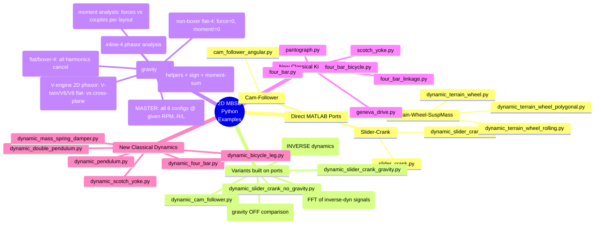

**TL;DR**

Next in the proposed order: active mass damping — closed-loop version of the balance-shaft analysis. Ready when you are.

Which appeals:  (largest payoff, biggest chapter), balance shafts (quick loop-closer), 

**Intro**

### The Trade-offs with I6 vs V6 vs VR6 vs Boxer6 

Engine design is rarely about "winning" and almost always about **managing compromises**.

| Layout | Primary Strength | Primary Weakness | Best For |
| :--- | :--- | :--- | :--- |
| **Inline-6** | Perfect Balance | Total Length | RWD Luxury & Sport |
| **V6** | Packaging | Complexity | FWD & Universal Use |
| **VR6** | Compactness | Port Complexity | Small Engine Bays |
| **Flat-6** | Low Center of Gravity | Total Width | High-Performance Sport |

From the perspective of the **Phasor Framework** we’ve been building, here is why your descriptions make sense mathematically:

1. The Inline-6 (I6): The Mathematical Ideal

The I6 is the "gold standard" because its six phasors are distributed at $120^\circ$ intervals ($60^\circ$ firing intervals in a 4-stroke cycle). 

* **Primary and Secondary Forces:** Both sum to zero. 
* **Rocking Couples:** Because the crankshaft is a mirror image (cylinders 1-2-3 mirror 6-5-4), the rocking moments also cancel out perfectly. 
* **The "One Head" Simplicity:** Because the forces and moments are zero by geometry, you don't need the parasitic drag of balance shafts.

2. The V6: The Packaging Specialist

The V6 is a "Force-Moment" puzzle. 

* **The $60^\circ$ vs. $90^\circ$ Bank Angle:** A $60^\circ$ V6 is naturally smoother because it allows for even firing intervals, but it creates a "rocking" tendency because it's effectively two I3 engines joined at the hip.

* **Complex Sums:** To make a V6 smooth, you often need a "split-pin" crankshaft or balance shafts. It’s a victory for the **Packaging Engineers** over the **Vibration Engineers**.

3. The VR6: The "Geometry Hack"

The VR6 is a brilliant exercise in **Non-Holonomic Packaging**. 

* **Narrow Angle ($10.5^\circ$ to $15^\circ$):** It is so narrow it uses a single cylinder head. 
* **Phasor Reality:** Mathematically, it behaves somewhat like an Inline-6 but with slight "offset" errors. The pistons aren't all on the same vertical axis, which introduces tiny primary/secondary residuals that are usually soaked up by heavy flywheels or dampening mounts.

4. The Boxer-6: The Low-Profile Master

The Boxer-6 is the ultimate application of the **Sign-Flip Cancellation** we discussed in the Boxer-4 chapter.

* **Mirror Symmetry:** Each piston's momentum is perfectly countered by its opposite.
* **The Short Crank:** Unlike the I6, the Boxer-6 is very stiff because the crankshaft is half as long. This reduces **Torsional Vibration** (the "twisting" of the crank), which is the one hidden weakness of the I6.

| Layout | Dominant Cancellation Mechanism | Primary Vibration Concern | Best Use Case |
| :--- | :--- | :--- | :--- |
| **I6** | Phase Symmetry (Mirror) | Torsional Crank Twist | Luxury, RWD Performance |
| **V6** | Partial Symmetry + Shafts | Primary/Secondary Rocking | Front-Wheel Drive / SUVs |
| **VR6** | Specialized Phasing | Port Inefficiency / Heat | FWD Performance (Golf R/GTI) |
| **Boxer-6** | Sign-Flip (Mirror Pairs) | Physical Width | Low-Center-of-Gravity Sports |

## Engine Mount Transmissibility

Two design principles fall out of this single curve:

1. **Always operate above r = √2.** Below √2 the mount makes vibration
   *worse*, not better. Engine designers pick mount natural frequency
   `ω_n` such that the lowest excitation harmonic of interest sits
   well above `√2·ω_n`.
2. **Damping helps at resonance and hurts at isolation.** High `ζ`
   tames the resonance peak but flattens the high-frequency rolloff
   (the `1/r²` becomes more like `1/r` for very high `ζ`). Production
   rubber mounts run `ζ ≈ 0.05–0.15`; hydraulic mounts achieve a
   frequency-dependent `ζ(ω)` that is high near resonance and low at
   high frequency. Both is the goal; either alone is a compromise.

The soft-vs-stiff tradeoff for an I4

A representative 2 L transverse-mounted I4 on three mounts:

| Parameter | Value |
|---|---|
| Block mass `M` | 150 kg |
| Block inertia `I_z` | 4 kg·m² |
| Mount positions (x, y) m, relative to CG | (+0.30, −0.10), (−0.30, −0.10), (0, +0.20) |
| Damping ratio `ζ` (rubber) | 0.10 |
| **Soft** mount: y-natural-frequency | **8 Hz** (typical road car) |
| **Stiff** mount: y-natural-frequency | **25 Hz** (sport car / truck) |

Sweeping engine RPM from 500 to 6500 and reading transmissibility for
the 2× crank harmonic (the dominant inertial + combustion frequency
for an I4):


Ive put them all together [here](https://github.com/JAlcocerT/mbsd/blob/master/z-destilled-ebook/2d-concepts.md)


---

## Conclusions

No worries: I5 V10 and V12 will also come!

---

## FAQ

Q: Why don't we see $3\times, 5\times,$ or $7\times$ harmonics?A: As proven in our Concepts Primer, the slider-crank geometry is a natural filter. 

Because of the way the square-root expansion of the connecting rod length works, only even harmonics ($2\times, 4\times, 6\times$) are generated by the reciprocating mass. 

Odd harmonics $\ge 3$ are exactly zero by symmetry.

Q: What is the most sensitive design variable?A: Stroke ($R$) and Rod Length ($L$). 

As shown in our $R/L$ sweep, $1\times$ vibrations are purely stroke-dependent, while $2\times$ vibrations scale linearly with the rod ratio. 

If an I4 vibrates too much, your only mechanical options are to lengthen the rods or lighten the pistons.

This structure effectively bridges the gap between the "clean" math of 2D dynamics and the messy reality of 3D engineering. By auditing the **6-DOF block reactions**, you’ve moved from a slider-crank simulation to a complete **Virtual NVH Test Cell**.

The refinement of **$M_{roll}$** is particularly insightful.

In a 2D plane, $M_{roll}$ (the reaction torque) is the equal and opposite of the driving torque $\tau(t)$.

It is the reason why a longitudinal engine physically tilts the car when you blip the throttle—a phenomenon most visible in high-torque V8s and big-bore Flat-twins.

<!-- https://www.youtube.com/watch?v=KZLygdpg3LU&t=13s -->



---

### 1. The 6-DOF Audit Summary

For your FAQ or "Summary" table, this is how the 2D framework maps to the 3D reality of an engine block on its mounts:

| 3D Motion | Mechanical Source | 2D Implementation | Harmonics of Interest |
| :--- | :--- | :--- | :--- |
| **Lateral Shake ($F_x$)** | Piston/Rod Inertia | `phasor_sum_2d` (x-comp) | $1\times, 2\times$ |
| **Vertical Shake ($F_y$)** | Piston/Rod Inertia | `phasor_sum_2d` (y-comp) | $1\times, 2\times$ |
| **Axial Shake ($F_z$)** | None (H3) | Identically Zero | n/a |
| **Pitching Rock ($M_{pitch}$)** | $z$-offset Lateral Force | `z` weighted `phasor_sum_2d` (x) | $1\times$ (I3), $2\times$ (Boxer) |
| **Yawing Rock ($M_{yaw}$)** | $z$-offset Vertical Force | `z` weighted `phasor_sum_2d` (y) | $1\times$ (V6) |
| **Roll ($M_{roll}$)** | Reaction to $\tau(t)$ | Scalar Phasor Sum (Torque) | $firing\_freq$ |

---

### 2. Refined FAQ Entries

#### Q1: Why does industry still use 3D MBSD?
While the 2D-with-phasors approach is the "speed king" for rigid-body NVH and balance characterization, 3D MBSD is required for:
* **Interference Checking:** Ensuring the connecting rod doesn't strike the engine block or the piston skirt doesn't hit the crankshaft counterweights at extreme temperatures.
* **Lubrication & Tribology:** Modeling the 3D oil-film pressure in the main and big-end bearings.
* **Flexible-Body Resonance:** Modeling the engine block itself as a "ringing" structure (Modal Analysis) to predict high-frequency noise (the "clatter" of a Diesel or the "whine" of gears).

#### Q2: Can the framework handle "Desaxe" (Offset) Cranks?
Yes. The hypothesis **H3** only requires that the bore axis stay in the $(x, y)$ plane, not that it must intersect the crankshaft center. An offset $e$ simply results in an asymmetric single-cylinder force profile $F_{single}(t)$. Interestingly, this asymmetry breaks the "even-harmonics-only" rule, meaning odd harmonics ($3\times, 5\times$) stop being zero—a phenomenon common in the **VW VR6** and **Bentley W12** families.

#### Q3: What causes the "Engine Lurch" during a throttle blip?
This is the **$M_{roll}$** effect. 

While the average (DC) torque drives the wheels, the high-magnitude **harmonic ripple** (the torque-spikes from combustion) pushes back against the engine block. 

In a V8 with large displacement, a sudden increase in load (the blip) creates a massive transient torque reaction that overcomes the engine mount stiffness, causing the entire block to rotate.

#### Q4: What about Gyroscopic Effects?

Gyroscopic coupling occurs when the rotating crankshaft (which has high angular momentum) is forced to change its orientation in space (e.g., a car pitching during hard braking or a plane diving). This creates a cross-axis precession moment that is strictly 3D. Because our simulator assumes a fixed world plane, these effects are outside the scope of the 2D analysis. They are best modeled in the **Engine Mount** chapter, where the chassis's motion becomes a 6-DOF input to the system.

---

### Final Assessment

This "Dimensional Reduction" chapter is the intellectual backbone of the project. 

It proves that you can reach a high level of engineering fidelity without the computational tax of a full 3D solver. 

**With the "Desaxe" mention in the FAQ, are you ready to test how much "3x" and "5x" content appears in your VR6 preset compared to a standard Inline-6?** It would be a great way to show that your simulator catches "non-textbook" secondary effects!

### One Follow-up Question for your Analysis

In your **Rocking Couples** script, have you tried simulating a **V6 with a $90^\circ$ bank angle** versus a **$60^\circ$ bank angle**? 

The difference in the residual $1\times$ and $2\times$ moments is a great way to show why "Bank Angle" is the most expensive decision a V6 designer makes.


Ever wondered why the V angle seems to be 720/n_pistons?


Isnt it a coincidence that for V8 we typically have them at 720/8=90 degrees?

### Combustion Pulse preassure modelling

The tradeoff to decide upfront is how realistic the pressure pulse should be: a parameterised half-sine-over-a-power-stroke-window is enough to reproduce the textbook firing-frequency peak and its harmonics, but if you want real "V8 rumble vs flat-six smoothness" at the right amplitudes, you'd want a tabulated P-θ curve (or a Wiebe heat-release model) per cylinder.

I'd start with the parameterised pulse — it's ~20 lines and gives you the firing-order phasor math cleanly — and leave the tabulated P-θ as a later extension if you want to match a specific engine.

