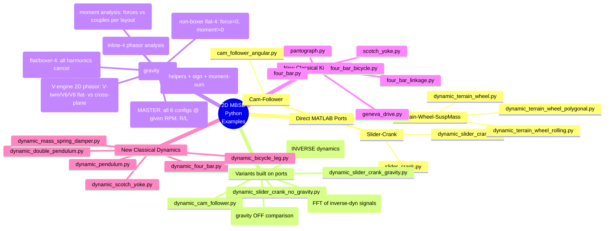

**TL;DR**

What's next — V-engines, combustion modelling, mounted-engine 3D response, active mass damping. Each is "one chapter + one or two scripts" of clean extension.

**Intro**

### The Trade-offs with I6 vs V6 vs VR6 vs Boxer6 

Engine design is rarely about "winning" and almost always about **managing compromises**.

| Layout | Primary Strength | Primary Weakness | Best For |
| :--- | :--- | :--- | :--- |
| **Inline-6** | Perfect Balance | Total Length | RWD Luxury & Sport |
| **V6** | Packaging | Complexity | FWD & Universal Use |
| **VR6** | Compactness | Port Complexity | Small Engine Bays |
| **Flat-6** | Low Center of Gravity | Total Width | High-Performance Sport |

From the perspective of the **Phasor Framework** we’ve been building, here is why your descriptions make sense mathematically:

1. The Inline-6 (I6): The Mathematical Ideal

The I6 is the "gold standard" because its six phasors are distributed at $120^\circ$ intervals ($60^\circ$ firing intervals in a 4-stroke cycle). 

* **Primary and Secondary Forces:** Both sum to zero. 
* **Rocking Couples:** Because the crankshaft is a mirror image (cylinders 1-2-3 mirror 6-5-4), the rocking moments also cancel out perfectly. 
* **The "One Head" Simplicity:** Because the forces and moments are zero by geometry, you don't need the parasitic drag of balance shafts.

2. The V6: The Packaging Specialist

The V6 is a "Force-Moment" puzzle. 

* **The $60^\circ$ vs. $90^\circ$ Bank Angle:** A $60^\circ$ V6 is naturally smoother because it allows for even firing intervals, but it creates a "rocking" tendency because it's effectively two I3 engines joined at the hip.

* **Complex Sums:** To make a V6 smooth, you often need a "split-pin" crankshaft or balance shafts. It’s a victory for the **Packaging Engineers** over the **Vibration Engineers**.

3. The VR6: The "Geometry Hack"

The VR6 is a brilliant exercise in **Non-Holonomic Packaging**. 

* **Narrow Angle ($10.5^\circ$ to $15^\circ$):** It is so narrow it uses a single cylinder head. 
* **Phasor Reality:** Mathematically, it behaves somewhat like an Inline-6 but with slight "offset" errors. The pistons aren't all on the same vertical axis, which introduces tiny primary/secondary residuals that are usually soaked up by heavy flywheels or dampening mounts.

4. The Boxer-6: The Low-Profile Master

The Boxer-6 is the ultimate application of the **Sign-Flip Cancellation** we discussed in the Boxer-4 chapter.

* **Mirror Symmetry:** Each piston's momentum is perfectly countered by its opposite.
* **The Short Crank:** Unlike the I6, the Boxer-6 is very stiff because the crankshaft is half as long. This reduces **Torsional Vibration** (the "twisting" of the crank), which is the one hidden weakness of the I6.

| Layout | Dominant Cancellation Mechanism | Primary Vibration Concern | Best Use Case |
| :--- | :--- | :--- | :--- |
| **I6** | Phase Symmetry (Mirror) | Torsional Crank Twist | Luxury, RWD Performance |
| **V6** | Partial Symmetry + Shafts | Primary/Secondary Rocking | Front-Wheel Drive / SUVs |
| **VR6** | Specialized Phasing | Port Inefficiency / Heat | FWD Performance (Golf R/GTI) |
| **Boxer-6** | Sign-Flip (Mirror Pairs) | Physical Width | Low-Center-of-Gravity Sports |

---

## Conclusions

No worries: I5 V10 and V12 will also come!

---

## FAQ

Q: Why don't we see $3\times, 5\times,$ or $7\times$ harmonics?A: As proven in our Concepts Primer, the slider-crank geometry is a natural filter. 

Because of the way the square-root expansion of the connecting rod length works, only even harmonics ($2\times, 4\times, 6\times$) are generated by the reciprocating mass. 

Odd harmonics $\ge 3$ are exactly zero by symmetry.

Q: What is the most sensitive design variable?A: Stroke ($R$) and Rod Length ($L$). 

As shown in our $R/L$ sweep, $1\times$ vibrations are purely stroke-dependent, while $2\times$ vibrations scale linearly with the rod ratio. 

If an I4 vibrates too much, your only mechanical options are to lengthen the rods or lighten the pistons.

### One Follow-up Question for your Analysis

In your **Rocking Couples** script, have you tried simulating a **V6 with a $90^\circ$ bank angle** versus a **$60^\circ$ bank angle**? The difference in the residual $1\times$ and $2\times$ moments is a great way to show why "Bank Angle" is the most expensive decision a V6 designer makes.

### Combustion Pulse preassure modelling

The tradeoff to decide upfront is how realistic the pressure pulse should be: a parameterised half-sine-over-a-power-stroke-window is enough to reproduce the textbook firing-frequency peak and its harmonics, but if you want real "V8 rumble vs flat-six smoothness" at the right amplitudes, you'd want a tabulated P-θ curve (or a Wiebe heat-release model) per cylinder.

I'd start with the parameterised pulse — it's ~20 lines and gives you the firing-order phasor math cleanly — and leave the tabulated P-θ as a later extension if you want to match a specific engine.
