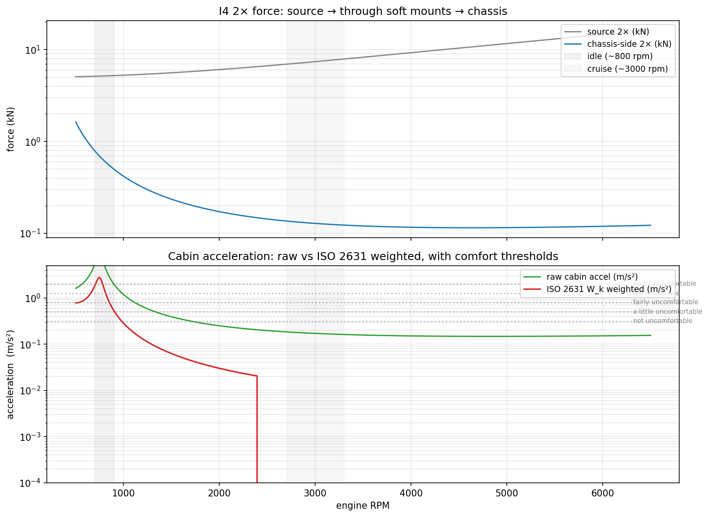
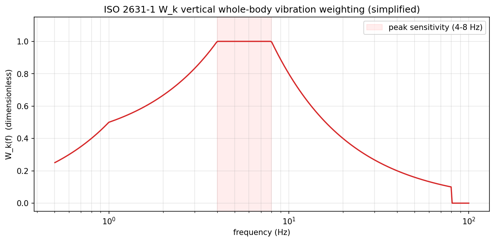
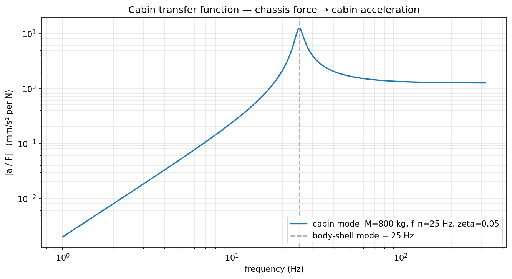

**Tl;DR**

**Intro**

## 

 

 




## 2D mbsd x 3D art

This architectural note is a definitive stake in the ground. 

It successfully distinguishes between **Simulation Fidelity** and **Visual Fidelity**, saving the project from the "3D Tax" while leaving the door open for genuinely non-planar physics in the future.

By identifying the **"Third Path" (2D Physics + 3D Render)**, you’ve provided a high-efficiency solution for the "Blender/Cinematic" requirement. 

This is how the professional industry often operates: solve the core physics in a specialized, fast environment, and then export the results to a high-end visualization engine.

1. The Strategy: 2D-Math + 3D-Art

This is the most critical takeaway. You aren't "faking" the 3D engine; you are **projecting** the exact 2D solution into 3D space using the **Dimensional Reduction Lemma**. 

* **The Phasor Advantage:** You can generate a full 3D V8 animation from a *single* 2D piston simulation just by applying the correct `z_offset` and `phase_shift` in the export script.
* **The Asset Pipeline:** Using **CADquery** to generate parametric parts (pistons, rods) and **Blender** to handle the light and materials creates a professional-grade output that a "homegrown" 3D viewer could never match.


2. The 3D "Kill" Criteria (When to Port)

Your list of "When 3D becomes necessary" is technically rigorous.
* **Gyroscopics:** This is the hard boundary. Once you have a spinning mass (Crank/Propeller) that is being rotated by a second body (Fuselage), the angular momentum vector $\mathbf{L} = \mathbf{I}\boldsymbol{\omega}$ must be modeled in 3D to capture the precession moments.
* **Single-Track Stability:** A bicycle's stability is a 3D phenomenon. You cannot model the "weave" or "wobble" modes of a motorcycle in a plane because they rely on the interaction between leaning and steering.


3. Technical Sanity Checks

1. **Euler Parameters ($e_0, e_1, e_2, e_3$):** Using the 4-element quaternion is the gold standard for 3D MBSD. It avoids the "Gimbal Lock" of Euler angles and makes the kinematic primitives ($PosicionPunto\_3D$) mathematically robust.
2. **The $H$ Matrix:** In your Stage 2 porting plan, the $H$ matrix (mapping quaternion rates to angular velocity) is the "Brain" of the 3D kinematics. It is significantly more complex than the 2D $\dot{\theta}$ term, but it allows for consistent angular momentum calculations.
3. **The Triciclo Flagship:** Porting the **Triciclo_3D** example from Simulon is the perfect "Boss Fight" for the 3D port. It exercises 3D contact, steering kinematics, and 6-DOF stability in one mechanism.

So, [similarly](https://github.com/JAlcocerT/3Design/tree/main/mbsd-to-render/four-bar) as I made here [with blender](https://jalcocert.github.io/JAlcocerT/using-blender-with-ai/) while [bringing mechanism to life](https://jalcocert.github.io/JAlcocerT/cad-design-mbsd/):

```sh
#git clone https://github.com/JAlcocerT/3Design
#cd ./3Design/mbsd-to-render/four-bar
choco install blender --version=4.2.2 -y
```


---

## Conclusions



  
  



---

## FAQ
