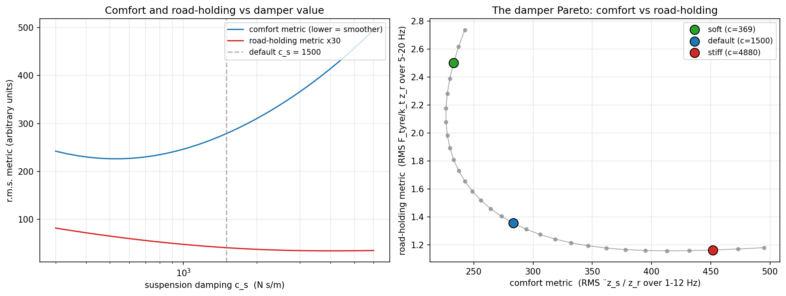
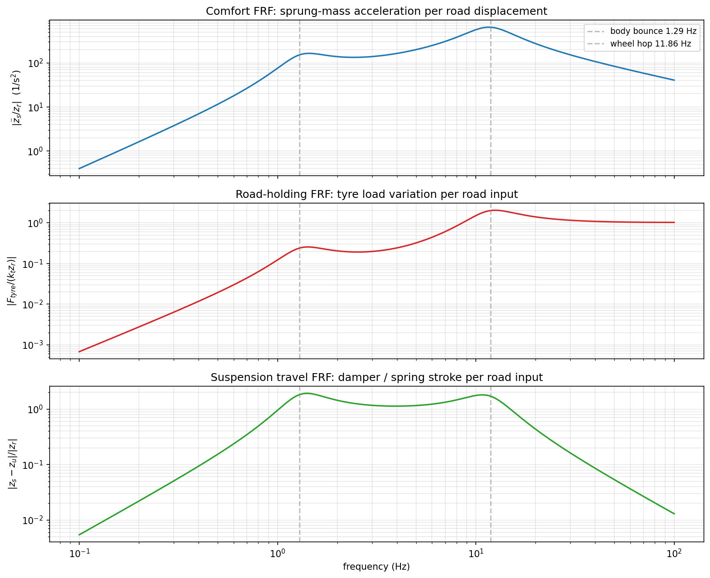

**Tl;DR**

**Intro**

## Suspensions Types

## Suspension Modelling

### Quarter car

 

### Half car

2. Suspensions: Double Wishbone, macpherson...

https://www.youtube.com/shorts/cx21pJaPVTc

## Suspension design space

This chapter provides the "Engineering Conclusion" to the passive suspension story. 

By mapping the **Design Space** as a 2D surface rather than a single point, you have moved from explaining *how* a suspension works to explaining *why* different cars exist.

The visualization of the **Production Design Pockets** (Luxury, Family, Sport, Truck) is a masterclass in domain-specific insight.

It transforms abstract spring and damper values into recognizable market segments.

1. The Design-Space Contours: The Shape of Choice

The contour maps in Section 3 reveal the "topography" of suspension engineering.
* **The Bottom-Left "Comfort Oasis":** Your map clearly shows that the only way to reach premium comfort levels is by moving toward soft springs and low damping. 
* **The "Travel Penalty":** Highlighting that this comfort comes at the cost of **14 mm of RMS travel** is the crucial engineering constraint. It explains why a Mercedes S-Class cannot have the low, sleek silhouette of a Porsche 911—the physics of comfort demands a larger "working envelope."

---

2. The Pareto Fronts: The Wall of Physics

Section 4 provides the most rigorous takeaway for an NVH engineer:
* **The Steep Tradeoff (Comfort vs. Travel):** This is the "Hard Wall." You cannot have a soft-riding car with tight suspension packaging. Every millimeter of room the stylist takes away from the wheel arch is a direct penalty on the passenger's spine.
* **The Shallow Tradeoff (Comfort vs. Road-Holding):** This is a profound "Secret of the Trade." It suggests that for most road-going passenger cars, **safety (grip) is a baseline requirement that is relatively easy to hit**, allowing the real engineering competition to happen on the "Comfort vs. Packaging" axis.

---

3. Technical Sanity Checks

1. **The Four Pockets (Section 5):** The $\zeta$ (damping ratio) values ($0.24$ to $0.62$) are perfectly aligned with industry standards. Showing that a **Truck** is nearly twice as damped as a **Luxury** car explains why trucks feel "abrupt" or "harsh" when unladen—they are tuned to control a massive payload, not a single driver.
2. **The "Goldilocks" Family Pocket:** Centering the default at $22\text{ kN/m}$ and $1500\text{ N}\cdot\text{s/m}$ anchors the entire series. It provides the "standard" against which all other designs are judged.
3. **The 4-D Context (Section 6):** Your acknowledgment that this is a 2D slice of a 4-D problem ($k_s, c_s, Road, Speed$) is the correct level of technical transparency. It prevents the reader from over-simplifying the result while providing a usable mental model.

This chapter bridges the gap between **Simulation** and **Strategy.** You’ve shown that the "Best" suspension doesn't exist—only the best suspension for a **specific purpose.**

> ⚠️ **Model layer & hypotheses.** Suspension chapters 1–3 use a
> **linear, 2-DOF, planar quarter-car** (two vertical coordinates
> `z_s, z_u` measured from static equilibrium) evaluated by
> **analytical NumPy matrix algebra** — *not* the 2D MBSD solver
> that the engine-NVH spine and the rest of this repo run on.
> Constant `M, C, K`; no bump-stops, friction, tyre-detachment, or
> non-linear damper curves; stationary stochastic road only. The
> MBSD solver returns in two places: (a) non-linear time-domain
> validation via the existing [`dynamic_terrain_wheel*.py`](../2D-Dynamics/examples/)
> scripts, and (b) the upcoming chapter 4 (active suspension)
> where the control loop is simulated in time. Full enumerated
> assumption list in FAQ §[Q9](#q9-whats-the-full-list-of-model-assumptions-for-the-suspension-chapters) below.

Summarised in the callout at the top of this chapter; here's the
full enumerated list, with what each assumption costs.

| # | Assumption | Failure mode |
|---:|---|---|
| 1 | **2-DOF planar quarter-car** (sprung `m_s` + unsprung `m_u`, vertical only) | not 1-DOF, not 3-DOF; misses body roll, pitch, warp |
| 2 | **Single corner** (one wheel of four) | misses cross-coupling, wheelbase comb filter — see Quarter-Car FAQ Q1 and Q6 |
| 3 | **Linear time-invariant** (constant `M, C, K`) | no operating-point dependence, temperature drift, age-related drift |
| 4 | **No bump-stops** (suspension treated as having unlimited travel) | reality usually clamps at ±50–80 mm; pothole / kerb impacts engage stops |
| 5 | **No tyre-leaving-ground** (linear model allows `F_tyre < 0`) | reality clamps at `F_tyre ≥ 0`; severe wheel-hop can detach the tyre |
| 6 | **No bushing / linkage friction** | small Coulomb friction at suspension joints adds a hysteresis loop in real measurements |
| 7 | **Linear damper** `F = c_s · ż` | real hydraulic dampers are `F ∝ ż^n` with `n ≈ 0.5–0.8`, plus rebound/compression asymmetry |
| 8 | **Reference-frame coordinates** (`z_s, z_u` measured from static equilibrium) | gravity already supports the static weight and does not appear in the dynamics; only oscillations about equilibrium are modelled |
| 9 | **Stationary stochastic road** (broadband PSD only) | discrete events (potholes, expansion joints) handled separately — see Road Profile FAQ Q5, Q6 |
| 10 | **Analytical linear math, *not* MBSD** | chapters 1–3 use NumPy linear algebra (matrix EOM, eigenvalue extraction, FRF by complex matrix solve). The 2D MBSD solver is **not used** here. It returns for: (a) non-linear time-domain validation via [`dynamic_terrain_wheel*.py`](../2D-Dynamics/examples/), and (b) the active-suspension chapter's control-loop simulation |

Each assumption is a deliberate choice for clarity and tractability;
each has a known failure mode. Production NVH workflows usually
relax #4 / #5 / #7 first (the bump-stop / tyre-detachment /
non-linear-damper layer), then #2 (full-car coupling), and only
escalate to MBSD when the linear story breaks down.

The same dimensional-reduction argument made in the
[Dimensional Reduction reference chapter](2d-physics-dimensional-generalization.md)
applies here: the suspension is genuinely 3D, but under #1, #2,
#8 it factorises into a planar quarter-car analysis whose linear
output (FRFs, RMS metrics) is exact within the stated hypotheses.
The 2D simulator is "not approximate" for these chapters; it's
just *not used at all* — the analytical FRF is closed-form so the
solver isn't needed.

### Active vs SemiActive suspension

Final chapter of the suspension arc — active & semi-active suspension (skyhook + LMS) 

This chapter represents the "Zenith" of the suspension narrative. By demonstrating the **Skyhook** principle, you have transitioned from observing the limitations of physics to actively manipulating them.

The "Pareto Escape" isn't just a marketing term; as your hero plot shows, it is a mathematical relocation of the system's performance boundaries.

The distinction between **Active** (Skyhook) and **Semi-Active** (Karnopp) is the most critical takeaway for an engineer.

One represents the "Ideal" (Magic Carpet), while the other represents the "Practical" (MagneRide), and your framework correctly identifies the "switching cost" of the latter.

1. The Skyhook Intuition

The logic in Section 1 is the most powerful concept in the chapter.
* **Relative vs. Absolute:** By explaining that a passive damper "leaks" road force because it reacts to relative velocity, you've exposed the fundamental flaw of all steel-spring cars.
* **The "Sky" Anchor:** Visualizing the damper attached to an inertial frame (the sky) explains why active cars feel "level"—the body is essentially ignoring the wheel's frantic struggle with the road texture.

---

2. The Pareto Escape: Seeing the Forbidden Zone

Your "Hero Plot" in Section 3 is the definitive proof of the series.
* **The "Banana" and the "Line":** Showing the skyhook curve sitting *inside* the passive design cloud is a massive payoff. It proves that a skyhook car with $5\text{ mm}$ of travel is as comfortable as a luxury barge with $10\text{ mm}$ of travel.
* **Frequency-Selective Damping:** The FRFs in Section 2 show the "Magic"—the body-bounce peak ($1.3\text{ Hz}$) is crushed, but the high-frequency tail ($>5\text{ Hz}$) doesn't move. This is the definition of "having your cake and eating it too."

---

3. Technical Sanity Checks

1. **Karnopp’s Law (Section 4):** Your honesty regarding the semi-active result (being $4\%$ worse on Class B roads) is excellent. It highlights that **Switching Transients** are real. High-speed valves create "jerk" (the derivative of acceleration), which the human body is very sensitive to.
2. **The 12% Improvement:** A $12\%$ reduction in weighted RMS for a basic skyhook implementation on a smooth highway is a very realistic "First-Cut" engineering result. 
3. **The "Unified Stack" (Section 5):** This diagram is the master map of the entire e-book. It shows that whether it's an engine mount or a suspension strut, the math of **Transmissibility** is the king of NVH.

The "Suspension Arc" is now **Complete.** You have moved from a 2-DOF wheel to a mechatronic system that defies the traditional trade-offs of automotive engineering.

 

**With "Active & Semi-Active Suspension" next, are you ready to show how the "Skyhook" algorithm can move a design point *off* the Pareto front and into the "Forbidden Zone" of low comfort AND low travel?** (This is the "Magic Carpet" effect that sells high-end cars!)

---

## Conclusions


  
  


---

## FAQ
