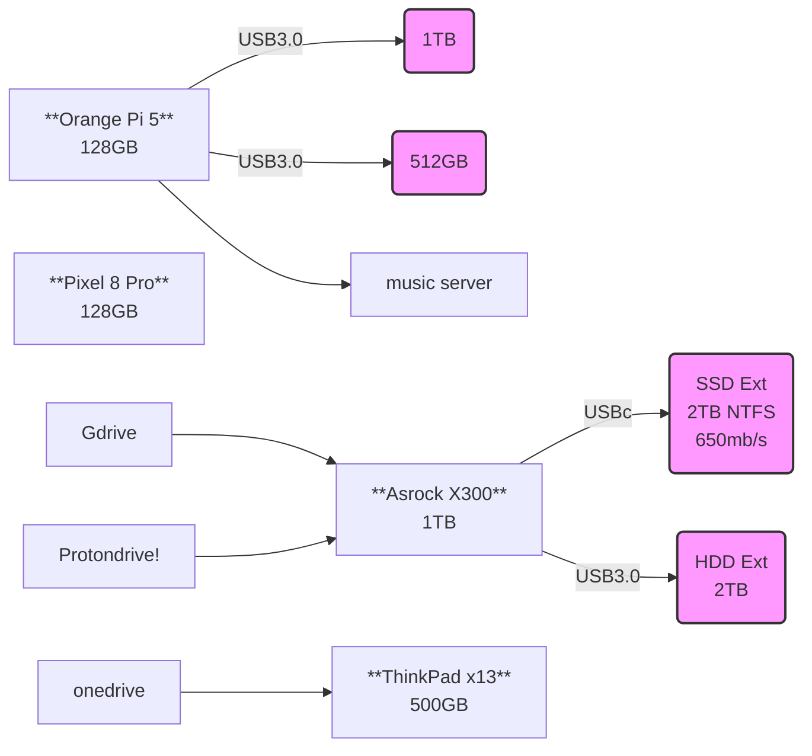

Ive been pretty much **comfortable with these OS's**:

1. **Ubuntu LTS**
2. if you come from Windows: **Zorin OS**, Linux Mint,...
3. [Garuda](https://sourceforge.net/projects/garuda-linux/) Linux 
4. If you miss XP, see https://xpq4.sourceforge.io/
5. For apple users: ElementaryOS, Deepin or [PearOS](https://pearos.xyz/)
6. SelfHosting / **network attached storage** Focused: CasaOS, OpenMediaVault (OMV), Synology,...




* Whonix / Tails  - Debian based
* Qubes - Fedora based

```sh
#sudo apt update & sudo apt upgrade -y
sudo apt install flatpak
flatpak remote-add --if-not-exists flathub https://flathub.org/repo/flathub.flatpakrepo

#flatpak install flathub io.gitlab.librewolf-community
#flatpak install flathub org.videolan.VLC
#flatpak install flathub com.brave.Browser
```






I love to start with the **Garuda default wallpaper**.




> With Garuda, you unlock the superpower of saying: *I use Arch, btw*

Time to try something new?

But...Too many OS's? 


Have a look to [Ventoy](https://github.com/ventoy/Ventoy) to create **ISO Multi-Boots**


### VPN

Its not the first time we talk about VPNs around here.


  
    


* https://speed.cloudflare.com/
* https://www.cloudflare.com/ssl/encrypted-sni/

```sh
ip addr show | grep inet6 | grep -v ::1
```

1. Pritunl - Enterprise Distributed OpenVPN and IPsec Server.

2. Ex-gravitl: <https://github.com/netbirdio/netbird>

> BSD-3

based on wireguard

<https://netbird.io/>

<https://www.youtube.com/watch?v=_-vfSgqmOUI>


Install a self-hosted VPN platform // Netbird with zitadel
https://www.youtube.com/watch?v=_Fgwap-sl3A

* Tailscale - wireguard based
  * Headscale - for selfhosted server
* NetBird - wireguard based
* Netmaker  - https://www.netmaker.io

#### Wireguard

https://blog.frehi.be/2022/06/11/setting-up-wireguard-vpn-with-ipv6/
https://www.reddit.com/r/WireGuard/comments/178uolr/guide_how_to_set_up_wireguard_with_ipv6_in_docker/

#### Tailscale

```sh
tailscale status

#tailscale up --exit-node=jalcocert-x300
#tailscale up --exit-node=jalcocert-x300 --exit-node-allow-lan-access #--exit-node=<ip|name>

#tailscale down
```


### Benchmarks



```sh
curl -O https://raw.githubusercontent.com/JAlcocerT/Linux/main/Z_Linux_Installations_101/Benchmark101.sh
chmod +x Benchmark101.sh & ./Benchmark101.sh
```




  


```sh
sudo apt install hardinfo
lscpu
```

**Testing the Memory**

```sh
sudo apt install hwinfo
hwinfo --memory

sudo apt install sysbench
sysbench memory run
```

> The **[x13](https://jalcocert.github.io/JAlcocerT/laptop-lenovo-thinkpad-x13-benchmark/)** got **~8164 MiB/sec** and the Pi 4 4GB ~175MiB/sec (x86)

Your server *most likely* will be in between.


See my [general web docs](https://jalcocert.github.io/JAlcocerT/create-your-website/)



### My Home Lab Setup

Whenever I start a fresh installation I make sure to follow my scripts:

```sh
git clone /Linux

cd Z_Linux_Installations_101
sudo bash Linux_Setup_101.sh #this will get you containers, browser and vscode
```

[As of today](https://mermaid.live/edit#pako:eNqdklFvmzAUhf-K675kiKRgIIA7VQpJl6WNtmikUjfogwsmoACOjOnIovz3OZSkWZ-m-sG6vud859qSdzBiMYUYrjjZpGD-IyyBXKNAUb5zUq4oWGTAUhTw-Zlf3QAdOVPvCfT7D75nDDRZ3ACvpy-9T9cdeNIO0rhn6Wh6Em9l6iJraA4csODsXWpnmknTqOIsWoNHQ9PeTEsPdJOjQ_Zdz_cn4LYRrzqS8rflF79zDy2teL6qjpNn_1zrvvd1coaCA3t0zuX4ZZqV6wWJQaMbitJ6LE17u-KofffPoKirLAIV5S-Un7RRMI159kKfWtPs2PYC-WLByla7eCeOA1bSM2reCa97JbY5BR5IsjzHl4mbqJXgbE3xpWEYXd3_ncUixWjTnDPjDzB3H2Du_5uBKiwoL0gWyz-3O2SEUKS0oCHEsoxpQupchDAs99JKasH8bRlBLHhNVchZvUohTkheyVO9iYmgk4zIv1ucuhtS_mKsOCLyCPEONhDrJhpYLjId20IuMgzbUeEWYgsNnOHQRKbrGrZra_pehX_aAG1gI9u0ZV93HdO2bGf_F6Cr6wI), this is **my homelab setup**.




> Which is connected to my family servers as well with Tailscale or Rustdesk if required

**Networking for Home Lab**

```sh
ifconfig
#ip a show wlp3s0 | grep "inet\b" | awk '{print $2}' | cut -d/ -f1
##ip a show eth0 | grep "inet\b" | awk '{print $2}' | cut -d/ -f1
###ip a show enp2s0 | grep "inet\b" | awk '{print $2}' | cut -d/ -f1
```

1. Pi4 192.168.0.155 (4GB) and 192.168.0.232 (2GB) both via ethernet
2. x300 Ethernet: 192.168.0.12
3. x13 wifi 192.168.0.124

**Containers**


  



<!-- 
https://www.youtube.com/watch?v=Z5uBcczJxUY -->



One of my favourite containers, are **Cloudflared** and FileBrowser

```yml
services:
  filebrowser:
    image: filebrowser/filebrowser
    container_name: filebrowser
    ports:
      - 8080:80
    volumes:
      - /mnt/crucial500/Docker/FileBrowser/config:/config
      - /mnt/crucial500/Docker/FileBrowser/data:/srv #same as Syncthing!
    restart: unless-stopped    

# networks:
#   nginx_nginx_default:
#     external: true
```

To use **Cloudflare tunnels**, you will need:

```yml
services:
  cloudflared:
    image: cloudflare/cloudflared:latest
    container_name: cloudflared
    command: tunnel --no-autoupdate run --token yourtokenhere
    networks:
      - tunnel
    restart: always

networks:
  tunnel:
```




### Maintainance in Linux

1. https://github.com/oguzhaninan/Stacer

> GPL 3.0 |  Linux System Optimizer and Monitoring - https://oguzhaninan.github.io/Stacer-Web 


> Remember that with **[Ventoy](https://github.com/ventoy/Ventoy)**, you can have them all in one usb drive


#### Better PKG management in Debian

From time to time you will need to make some clean up to keep things perfect.

Are you getting some error when doing `apt update`?

Then, just...


#### Linux BackUps

Proton Drive is cool...but it does not work out of the box for Linux.

Unless... you find this [awsome Otterlord's post](https://blog.otterlord.dev/posts/proton-drive-rclone/)

Recently when installing [Gyroflow for better video edition](https://jalcocert.github.io/JAlcocerT/my-action-cam-video-workflow/) the ubuntu on my [x13](https://jalcocert.github.io/JAlcocerT/laptop-lenovo-thinkpad-x13-benchmark/) could not access the files.

And after reboot I could not access the system at all.

Thankfully, I got **proper backup** implemented!

or at least, one that worked.

You can try with: Syncthing, Nextcloud, WebDav...

> But try something!

---

## Conclusions

Its always great to take some time and make some *home cleaning*.

Maybe time to cancel some subscription tat you are not really using after you got a proper backup in place?

You can still use cloud VPS as complementary backup, or s3 buckets...

Where to get [a VPS](https://jalcocert.github.io/Linux/docs/linux__cloud/cloud/#other-clouds)?

* Hetzner, Hostinger ...
* https://lowendstock.com/
* Some would say to [Oracle](https://www.oracle.com/cloud/sign-in.html)

> I got my account shut down without a reason (nothing like selfhosting P2P programs...which was interesting and customer service did not came back with a solution)

* GCP: https://console.cloud.google.com/

### Other 

You can check from time to time: https://haveibeenpwned.com/

They also provide an [API](https://haveibeenpwned.com/API/Key), which you would have to pay for.

### Photo Video Management in a Server


  


1. https://github.com/KDE/digikam

```sh
flatpak install flathub org.kde.digikam
```

2. PhotoQT


3. dupeGuru

```sh
sudo add-apt-repository universe
sudo apt install dupeguru-se
```


### Cool Blogs Ive found recently

1. https://selfhosted.show/
2. https://selfh.st/
3. https://theselfhostingblog.com/
4. https://howitlooks.dev/
5. https://www.reddit.com/r/selfhosted/?rdt=43112
6. https://www.reddit.com/r/SelfHosting/
7. https://akashrajpurohit.com/blogs/?ref=nav
8. https://alternateoss.com/
9. https://star-history.com/blog/knowledge-management

* Sources:
    * https://www.producthunt.com/topics/open-source
    * https://www.opensourcealternative.to/
    * https://trendshift.io/

### Interesting Software for Servers

1. https://github.com/moghtech/komodo

> 🦎 a tool to build and deploy software on many servers 🦎

<!-- https://www.youtube.com/watch?v=acDVwwLklas -->



2. https://github.com/safing/portmaster

> 🏔 Love Freedom - ❌ Block Mass Surveillance

You can also have a look to: ModSecurity, Naxsi, Open AppSec, SafeLine,...

---

## FAQ

1. https://gitlab.com/leinardi/gwe

> System utility designed to provide information, control the fans and overclock your NVIDIA card

2. https://github.com/libratbag/piper

> GTK application to configure gaming devices (Like a logitech mouse!)

3. https://gitlab.com/corectrl/corectrl

> Profile based **system control utility**

```sh
sudo apt install corectrl
```


{}

```sh
sudo apt install dupeguru
```

{} 

{}


```sh
curl -O https://raw.githubusercontent.com/JAlcocerT/Linux/main/Z_Linux_Installations_101/Selfhosting_101.sh 
chmod +x Selfhosting_101.sh & sudo ./Selfhosting_101.sh
```

1. [Nextcloud Docker Compose](https://github.com/JAlcocerT/Docker/blob/main/Backups/NextCloud/NextCloud_RPi_Stack.yaml)

```sh
sudo flatpak install flathub com.nextcloud.desktopclient.nextcloud -y
```

See how quick you are transfering data:

```sh
#sudo apt install nload
nload
```
2. [Photo Tools](https://jalcocert.github.io/JAlcocerT/photo-management-tools/)


{} 

See how each Docker Service is **consuming resources**:

```sh
#htop
sudo docker stats nextcloud
#sudo docker prune
```

### What do I look in a MiniPC?

1. Removable RAM

2. Removable SSD (nmve 2280 drive) and 2.5 expandable bay

3. Low energy consumption, which can be measured [with a smart plug](https://jalcocert.github.io/JAlcocerT/tapo-p110-review/)

```sh
dpkg --print-architecture #ARM will tend to be more power efficient than x86
```

> At the time of writing, my **energy costs** are ~0.28$/Kwh

4. At least, 1 usb-c and >4 usb 3.0

5. Wake on LAN capability (WOL)


  
  


### Decentralized Storage

* Centralization: Simplicity and Single Point of Failure

* Some alternatives:
  * [IPFS](https://ipfs.tech/) -  an open system to manage data without a central server
  * [Filecoin](https://filecoin.io/) - an open-source cloud storage marketplace, protocol, and incentive layer.

> Great intro video from [Naomi on Decentralized Storage](https://www.youtube.com/watch?v=rOtMGJVp2MU)