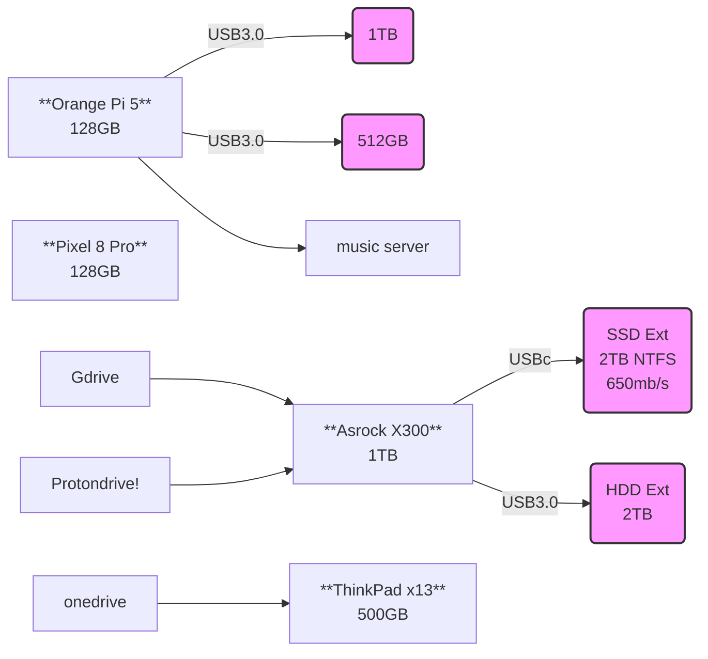

Ive been pretty much **comfortable with these OS's**:

1. Ubuntu
2. Zorin OS (Great if you come from Windows)
3. Garuda Linux 
4. If you miss XP, see https://xpq4.sourceforge.io/
5. For apple users: ElementaryOS or [PearOS](https://pearos.xyz/)



* Whonix / Tails  - Debian based
* Qubes - Fedora based






I love to start with the **Garuda default wallpaper**.




> With Garuda, you unlock the superpower of saying: *I use Arch, btw*


Time to try something new, getting ready for a **network attached storage**:

* OpenMediaVault (OMV)
* Synology
* CasaOS

### Tailscale

```sh
tailscale status
#tailscale up --exit-node=jalcocert-x300
#tailscale down
```



TBD



### Benchmarks

```sh
sudo apt install hardinfo
lscpu
```

**Testing the Memory**

```sh
sudo apt install hwinfo
hwinfo --memory

sudo apt install sysbench
sysbench memory run
```

> The **[x13](https://jalcocert.github.io/JAlcocerT/laptop-lenovo-thinkpad-x13-benchmark/)** got **~8164 MiB/sec** and the Pi 4 4GB ~175MiB/sec (x86)

Your server *most likely* will be in between.


See my [general web docs](https://jalcocert.github.io/JAlcocerT/create-your-website/)



### My Home Lab Setup

[As of today](https://mermaid.live/edit#pako:eNqdklFvmzAUhf-K675kiKRgIIA7VQpJl6WNtmikUjfogwsmoACOjOnIovz3OZSkWZ-m-sG6vud859qSdzBiMYUYrjjZpGD-IyyBXKNAUb5zUq4oWGTAUhTw-Zlf3QAdOVPvCfT7D75nDDRZ3ACvpy-9T9cdeNIO0rhn6Wh6Em9l6iJraA4csODsXWpnmknTqOIsWoNHQ9PeTEsPdJOjQ_Zdz_cn4LYRrzqS8rflF79zDy2teL6qjpNn_1zrvvd1coaCA3t0zuX4ZZqV6wWJQaMbitJ6LE17u-KofffPoKirLAIV5S-Un7RRMI159kKfWtPs2PYC-WLByla7eCeOA1bSM2reCa97JbY5BR5IsjzHl4mbqJXgbE3xpWEYXd3_ncUixWjTnDPjDzB3H2Du_5uBKiwoL0gWyz-3O2SEUKS0oCHEsoxpQupchDAs99JKasH8bRlBLHhNVchZvUohTkheyVO9iYmgk4zIv1ucuhtS_mKsOCLyCPEONhDrJhpYLjId20IuMgzbUeEWYgsNnOHQRKbrGrZra_pehX_aAG1gI9u0ZV93HdO2bGf_F6Cr6wI), this is **my homelab setup**.




> Which is connected to my family servers as well with Tailscale or Rustdesk if required

**Networking for Home Lab**

```sh
ifconfig
#ip a show wlp3s0 | grep "inet\b" | awk '{print $2}' | cut -d/ -f1
##ip a show eth0 | grep "inet\b" | awk '{print $2}' | cut -d/ -f1
###ip a show enp2s0 | grep "inet\b" | awk '{print $2}' | cut -d/ -f1
```

1. Pi4 192.168.0.155 (4GB) and 192.168.0.232 (2GB) both via ethernet
2. x300 Ethernet: 192.168.0.12
3. x13 wifi 192.168.0.124

**Containers**
<!-- 
https://www.youtube.com/watch?v=Z5uBcczJxUY -->



One of my favourite containers, are **Cloudflared** and FileBrowser

```yml
services:
  filebrowser:
    image: filebrowser/filebrowser
    container_name: filebrowser
    ports:
      - 8080:80
    volumes:
      - /mnt/crucial500/Docker/FileBrowser/config:/config
      - /mnt/crucial500/Docker/FileBrowser/data:/srv #same as Syncthing!
    restart: unless-stopped    

# networks:
#   nginx_nginx_default:
#     external: true
```

To use **Cloudflare tunnels**, you will need:

```yml
services:
  cloudflared:
    image: cloudflare/cloudflared:latest
    container_name: cloudflared
    command: tunnel --no-autoupdate run --token yourtokenhere
    networks:
      - tunnel
    restart: always

networks:
  tunnel:
```




### Better PKG management in Debian

From time to time you will need to make some clean up to keep things perfect.

Are you getting some error when doing `apt update`?

Then, just...

#### Maintainance in Linux

1. https://github.com/oguzhaninan/Stacer

> GPL 3.0 |  Linux System Optimizer and Monitoring - https://oguzhaninan.github.io/Stacer-Web 


---

## Other 

You can check from time to time: https://haveibeenpwned.com/.

They also provide an [API](https://haveibeenpwned.com/API/Key), which you would have to pay for.

### Photo Video Management in a Server

1. https://github.com/KDE/digikam

```sh
flatpak install flathub org.kde.digikam
```

2. PhotoQT

### Cool Blogs Ive found recently

1. https://selfhosted.show/
2. https://selfh.st/
3. https://theselfhostingblog.com/
4. https://howitlooks.dev/
5. https://www.reddit.com/r/selfhosted/?rdt=43112
6. https://www.reddit.com/r/SelfHosting/
7. https://akashrajpurohit.com/blogs/?ref=nav
8. https://alternateoss.com/
9. https://star-history.com/blog/knowledge-management

### Interesting Software for Servers

1. https://github.com/moghtech/komodo

> 🦎 a tool to build and deploy software on many servers 🦎

<!-- https://www.youtube.com/watch?v=acDVwwLklas -->


2. https://github.com/safing/portmaster

> 🏔 Love Freedom - ❌ Block Mass Surveillance

You can also have a look to: ModSecurity, Naxsi, Open AppSec, SafeLine,...

---

## FAQ

{}

```sh

```

{} 

### What do I look in a MiniPC?

1. Removable RAM
2. Removable SSD (nmve 2280 drive) and 2.5 expandable bay

3. Low energy consumption, which can be measured [with a smart plug](https://jalcocert.github.io/JAlcocerT/tapo-p110-review/)

At the time of writing, my **energy costs** are ~0.28$/Kwh


  
  
