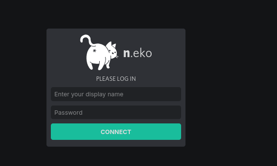

How cool is to use perplexity and have a reference to your own website:




<!-- 
## AgencySwarm

Web Browsing like human. With GPT4.


* https://github.com/VRSEN/agency-swarm - FOSS, but using GPT4
* Embedding customs GPT - https://www.oai-widget.com/


### a browsing agent, fully in Py and GPT4 under the hood

* Selenium
* Scroll...


* https://github.com/unconv/gpt4v-browsing -->


* https://console.groq.com/docs/browser-automation

## Browsers Ive tried

Even a CLI browser called Lynx:


https://jalcocert.github.io/JAlcocerT/scrapping-with-llms/#faq

```sh
sudo apt install lynx
lynx duckduckgo.com
```


Lately I tried Zen browser.

Which *we could say* is a modern UI version of firefox.


https://www.youtube.com/watch?v=799uhYUxtvA

https://browser.networkchuck.com/

## Automating your Browser

Playwright is an open-source browser automation library developed by Microsoft. It is primarily used for fast, reliable, and cross-browser end-to-end testing of web applications. 

Playwright allows developers to programmatically control browsers such as Chromium, Firefox, and WebKit through a unified API, supporting automation of user interactions, UI testing, and even web scraping.

Yes, Playwright is open source, available under the MIT license, and supports multiple programming languages including JavaScript, Python, C#, and Java. It relates to web scraping because it can automate browser actions including navigation, interaction with page elements, and data extraction, thus enabling scraping of dynamically rendered web pages that simpler HTTP request libraries cannot handle effectively.

In summary:
- Playwright is a web automation tool focused on end-to-end testing.
- It is open source.
- It can be used for web scraping as well as testing, especially for sites with complex, dynamic, or JavaScript-rendered content.[2][3][4][7][10]

[1](https://playwright.dev)
[8](https://playwright.dev/agents/playwright-mcp-browser-automation)
[10](https://github.com/microsoft/playwright)

### Playwright vs Pupeteer

Puppeteer and Playwright are both web automation tools that allow programmatic control of web browsers to automate tasks like testing, scraping, and interaction.

Puppeteer

- Puppeteer is a Node.js library developed by Google to control Chrome and Firefox via DevTools Protocol.
- It enables high-level browser automation: navigation, clicking, typing, taking screenshots, generating PDFs.
- Mainly focused on Chromium-based browsers with growing Firefox support.
- Pros: Simple API, great for Chrome automation, headless or headed modes, widely used for testing and scraping.
- Limitations: Primarily Chromium-focused (though Firefox is supported), limited cross-browser support, JavaScript/Node.js only.

Playwright

- Playwright is an open-source automation framework by Microsoft supporting Chromium, Firefox, and WebKit (Safari) with one API.
- Supports multiple languages: JavaScript, Python, C#, and Java.
- Advanced features include multi-browser, multiple contexts, network interception, automatic waiting, mobile/device emulation, and visual testing.
- Pros: True cross-browser support, multi-language, built-in test runner (@playwright/test), robust automation for modern web apps.
- Limitations: Slightly more complex API, heavier dependency compared to Puppeteer but offers much broader capabilities.

### Other notable web automation tools

| Tool         | Pros                                          | Limitations                            |
|--------------|-----------------------------------------------|---------------------------------------|
| Selenium     | Supports many languages and browsers, huge community, strong integration with CI/CD | Complex setup, slower, maintenance overhead, mobile testing limited |
| Cypress      | Fast, developer-friendly, built-in waiting, real-time reloads | JavaScript only, limited browser support mainly Chromium, no multi-tabs or cross-domain |
| TestCafe     | Easy setup, no browser drivers needed, supports parallel tests | JavaScript only, less flexible API, no XPath selectors |
| WebDriverIO  | Modern JS API on Selenium, parallel tests, extensive plugins | Complex setup, depends on drivers, slower than direct browser APIs |

 Summary
- Puppeteer: Great for Chrome-focused automation and quick JavaScript-based tasks.
- Playwright: More comprehensive, cross-browser, multi-language automation framework suitable for complex, cross-platform testing.
- Selenium: Most established with broad language and browser support but heavier setup.
- Others like Cypress, TestCafe offer specialized approaches with their own trade-offs.

These tools differ in browser support, language support, ease of setup, and test stability, so the choice depends on project needs and tech stack.

[1](https://developer.chrome.com/docs/puppeteer)
[6](https://playwright.dev)
[7](https://github.com/microsoft/playwright)
[8](https://pptr.dev)


---

## Conclusions


Last time i was scrapping with the [job-trends on this post](https://jalcocert.github.io/JAlcocerT/playwright-101/) I got limitation on how to capture the amount of offers automatically based on bs4.

Yes, exactly. Puppeteer and Playwright can help extract data from websites where BeautifulSoup (bs4) is not sufficient.

- BeautifulSoup is purely an HTML parser and works well for static HTML content that can be directly fetched via HTTP requests.
- However, many modern websites use JavaScript to render content dynamically (SSR or CSR—Client Side Rendering). BeautifulSoup cannot execute JavaScript or interact with the page.
- Puppeteer and Playwright automate real browsers, allowing them to fully render pages, execute JavaScript, and simulate human interactions like clicking buttons, filling forms, or scrolling.
- This makes them ideal for scraping dynamic or interactive web content that BeautifulSoup alone cannot access.

So, when JavaScript rendering or complex interactions are required to get the data, these browser automation tools are the better choice compared to just static HTML parsers like BeautifulSoup.


For web scraping SSR (Server-Side Rendered) content that requires human interaction, the best tools among those discussed are Puppeteer and Playwright.

Puppeteer
- Puppeteer can control a headless or headed Chromium browser, allowing automation of complex user interactions like clicks, form inputs, and navigation.
- It executes JavaScript on the page, enabling scraping SSR content which is fully rendered by the browser.
- Puppeteer can handle authentication, captchas (with external help), dynamic content loading, and user gestures.

Playwright
- Playwright offers all the capabilities of Puppeteer but extends support to multiple browsers (Chromium, Firefox, WebKit).
- It handles complex user interactions smoothly, including clicks, scrolls, drag-drop, and multi-page workflows.
- Playwright also supports features like network interception (to block or modify requests), multiple browser contexts, and better handling of modern web apps.
- Its robust auto-waiting reduces flakiness when scraping SSR content that changes dynamically based on user actions.

Why these two?
- Both run full browsers that can execute JavaScript, essential for SSR content.
- Support simulating realistic human interactions needed for scraping content behind logins, forms, or buttons.
- Can wait for elements and page states after interaction, ensuring correct data is captured.
  
Selenium and others
- Selenium supports human interaction and SSR as it drives real browsers but is more complex and slower.
- Cypress and TestCafe are mainly for testing and have limitations with multi-tab, cross-domain, or complex user simulators that web scraping might need.

- **Playwright** is generally preferred for modern, complex scraping needing robust multi-browser support and advanced features.
- **Puppeteer** is excellent for Chromium-focused projects with straightforward automation needs.
- Both provide the necessary capabilities to scrape SSR sites with human interaction simulation efficiently and reliably.[1][2][3][4]

### MCP x PlayWright

https://jalcocert.github.io/JAlcocerT/playwright-101/

* https://github.com/microsoft/playwright-mcp

```json
{
  "mcpServers": {
    "playwright": {
      "command": "npx",
      "args": [
        "@playwright/mcp@latest"
      ]
    }
  }
}
```

### Self-hostable browsers

Several self-hostable browsers running via containers are available, including:

- **Neko**: A self-hosted virtual browser running in Docker containers using WebRTC technology for streaming. It supports multiple browsers like Firefox, Chromium, and Brave and focuses on privacy, multi-user collaboration, and lightweight browser isolation.[1][2][3][4]


```sh
sudo chown -R 1000:1000 /home/docker/neko
#docker compose up -d
```


  


> Remember to do `ctrl+c` to copy from neko to your main desktop


- **Kasm Workspaces**: A container streaming platform that can spin up various browsers or full desktops in ephemeral Docker containers accessible via the web browser. It’s designed for enterprise use, secure browser isolation, and remote workspace management.[5][6][7]

- **Browserless**: An open-source Docker container allowing deployment of headless Chrome browsers for remote web automation, scraping, and testing. It supports Puppeteer and Playwright libraries and offers robust API access for automation tasks.[8][9][10]

- **linuxserver/firefox**: A Firefox browser Docker image maintained by LinuxServer which can be run as a container, offering a self-hosted Firefox instance though without the streaming or remote interactive features of Kasm or Neko.[11]

These options differ in focus from lightweight isolated self-hosted browsers (Neko), full containerized workspaces/desktops with browser support (Kasm), to headless browser automation and scraping (Browserless), and a simple containerized Firefox for local or network access.[2][1][8][11]

[2](https://fossengineer.com/selfhosting-neko-browser/)
[7](https://www.reddit.com/r/selfhosted/comments/1isc94o/kasm_open_source_self_hosted_disposable_browsing/)
[8](https://github.com/browserless/browserless)


## Conclusions


| Feature / Aspect             | Kasm                                | Virtual Machines (VMs)                | Webtop via Docker Containers           | Neko Browser Container                 | Typical Desktop Browser (Firefox)      |
|-----------------------------|-----------------------------------|-------------------------------------|---------------------------------------|---------------------------------------|---------------------------------------|
| **Technology Base**          | Docker containers with streaming  | Full hardware virtualization        | Docker containers                     | Docker containers                     | Native application on OS              |
| **Isolation**                | Container-level, app & desktop    | Full OS-level hardware isolation    | Container-level Linux desktop         | Container-level browser isolation    | None (runs on host OS)                |
| **Resource Efficiency**      | Lightweight, low overhead         | Heavy, requires CPU, RAM, storage   | Lightweight, low overhead             | Lightweight                          | Depends on host system (moderate)     |
| **Startup Time**             | Fast (seconds)                    | Slow (minutes depending on setup)  | Fast                                 | Fast                                 | Instant to few seconds                |
| **Access Method**            | Web browser                       | Various (RDP, VNC, etc.)            | Web browser                          | Web browser                          | Direct on host OS                     |
| **Workspace Types**          | Full desktops, apps, browsers     | Full OS desktop                     | Linux desktop                        | Browser session only                  | Browser only                         |
| **Persistence**              | Ephemeral, stateless workspaces  | Persistent state                    | Mutable Linux desktop                | Usually ephemeral browser sessions   | Persistent user data and history     |
| **Security**                 | High, container isolated + controls | Very high, full VM isolation       | Moderate, container isolated          | Moderate, browser container isolation| Depends on OS security, browser sandbox |
| **Scalability**              | High, easy to spin up/down        | Limited by heavy resources          | High, container based                | High, container based                | Limited to device                     |
| **Use Case Focus**           | Secure workspace access & collaboration | Full virtualization for diverse workloads | Linux desktop in browser            | Secure containerized browser         | General web browsing on local machine|
| **Additional Features**      | Workspace lifecycle, collaboration, user management | Full OS control and customizability | Basic desktop with browser access   | Browser automation, multi-user control| Extensions, bookmarks, plugins        |
| **Typical Users**            | Enterprises, remote workers       | Enterprises, developers, testers    | Developers, Linux users              | Security-conscious browser users     | Everyday web users                   |

This puts the typical desktop Firefox browser in context with containerized and virtualized environments, showing it lacks isolation compared to container or VM solutions but provides instant local access and persistent user state on the host OS.[1][2][3][4][5][6][7][8][9]

[1](https://kasmweb.com)
[2](https://docs.linuxserver.io/images/docker-kasm/)
[3](https://ambientnode.uk/kasm-immutable-apps-vms/)
[4](https://www.aiknow.io/en/what-is-kasm-a-browser-based-workspace-platform/)
[5](https://www.liquidweb.com/blog/virtual-desktop-environment-configuring-kasm-workspaces/)
[6](https://www.reddit.com/r/selfhosted/comments/16cdppe/kasm_vs_webtop_20/)
[7](https://www.reddit.com/r/selfhosted/comments/x4r6si/browser_in_a_browser/)
[8](https://news.ycombinator.com/item?id=42690983)
[9](https://www.libhunt.com/compare-neko-vs-KasmVNC)


---

## FAQ

### What it is Puppeteer?


<!-- 
Puppeteer what?
-->


- **Puppeteer** is a **Node.js library** developed by Google, used for **automating and interacting with web pages** using a headless Chrome or Chromium browser.
- **Key functionalities** include:
  - **Headless Browsing**: Operates Chrome or Chromium without a graphical user interface, ideal for background automation tasks.
  - **Web Scraping**: Enables data extraction from websites through navigation and interaction with page elements.
  - **Automated Testing**: Useful for testing web applications by simulating user actions like clicks and form submissions.
  - **Screenshots and PDF Generation**: Captures screenshots and generates PDFs from web content, beneficial for reports or documentation.
  - **Performance Monitoring**: Measures web page performance metrics such as load times and resource usage.
  - **Accessibility Testing**: Incorporates tools to ensure web pages are accessible to users with disabilities.
- **Popularity**: Favored for web scraping and automated testing due to its ease of use and Chrome integration.
- **Getting Started**: Install via npm or yarn, then write scripts to automate browser interactions and perform tasks on web pages. 

### What is KASM?

Kasm is a container streaming platform that delivers browser-based access to secure, isolated workspaces such as desktops, applications, and web browsers via Docker containers. It essentially provides containerized virtual desktops or browser sessions accessible through a web browser, designed for security, scalability, and ease of access without heavy traditional VM overhead. Kasm workspaces are ephemeral, isolated, and can run full desktops or just apps within containers, allowing quick spin-up and destruction with robust access control and security features.

#### How Kasm compares with a Virtual Machine (VM)

- Kasm uses lightweight Docker containers instead of full virtual machines, resulting in much lower resource overhead, faster startup times, and easier scalability.
- VMs emulate complete hardware environments running full OS installations, which provide thorough isolation but require more CPU, memory, and storage.
- Kasm workspaces are immutable and disposable like lightweight virtual machines but lack some deep system-level isolation VMs provide.
- Kasm is designed for web-browser access and rapid ephemeral usage rather than persistent state typical for VMs.

#### How Kasm compares with a Webtop via Docker containers
- Webtop is also a Docker-based Linux desktop inside a container accessible via a browser or web interface.
- Kasm offers a full platform around container orchestration, access control, workspace management, session isolation, and security with features like chat, collaboration, and automated container lifecycle.
- Webtop focuses on providing a Linux desktop container image and environment, which can integrate with Kasm, but lacks Kasm’s broader workspace management and multi-user features.
- Kasm is more of an enterprise-grade container desktop delivery platform, whereas Webtop is more minimalist for running individual GUI desktops inside containers.

#### How Kasm compares with Neko (a browser running in a container)
- Neko is a self-hosted virtual browser in a container, primarily focused on secure, containerized browser sessions streamed via WebRTC.
- Kasm can run full desktops, multiple applications, or browsers inside containers, providing more versatility beyond just browsers.
- Both aim to isolate browsing or apps in containers for security, but Neko focuses on browser isolation and features like session broadcasting, multi-user control, and automation.
- Kasm offers a broader platform for workspace provisioning, workspace types, user management, and collaboration, whereas Neko targets secure browser use cases specifically.

In summary, Kasm can be seen as a comprehensive container desktop/workspace platform optimized for secure, scalable browser access to virtualized desktops and apps. It is more lightweight and scalable than traditional VMs, more fully featured than minimal container desktop solutions like Webtop, and more versatile than single-browser container solutions like Neko.[1][2][3][4][5][6][7][8][9]

[1](https://kasmweb.com)

[12](https://github.com/kasmtech)

[15](https://www.linuxserver.io/blog/webtop-2-0-the-year-of-the-linux-desktop)
