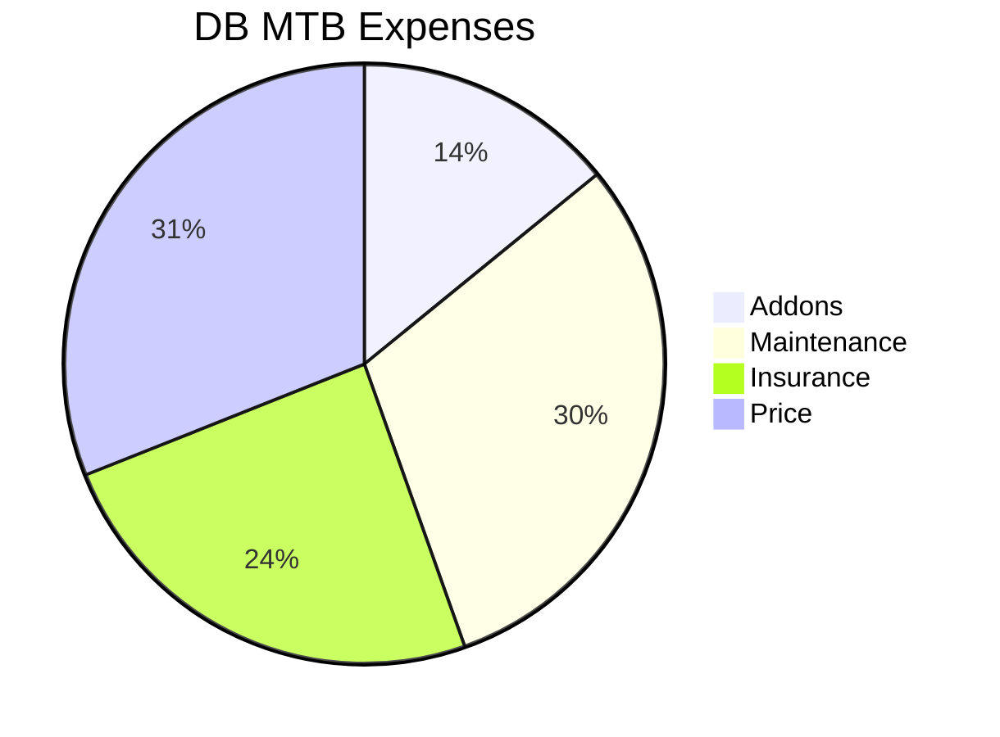
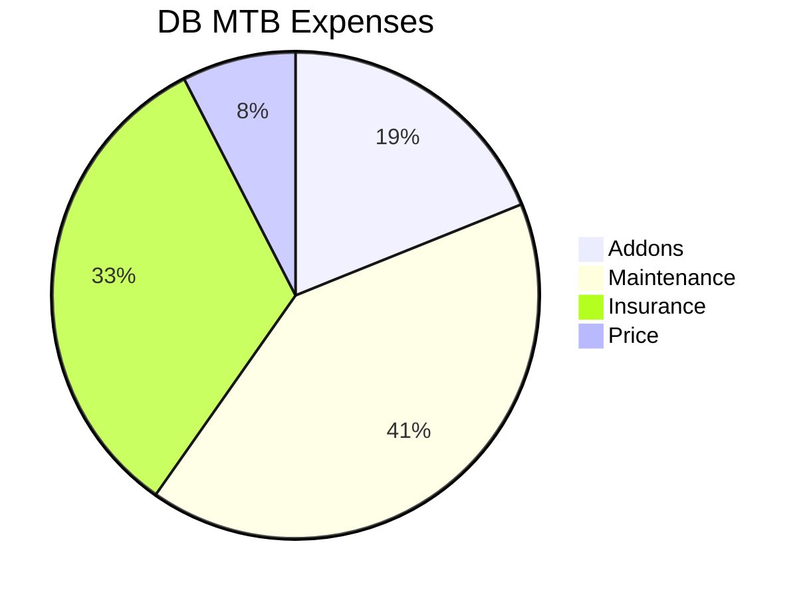
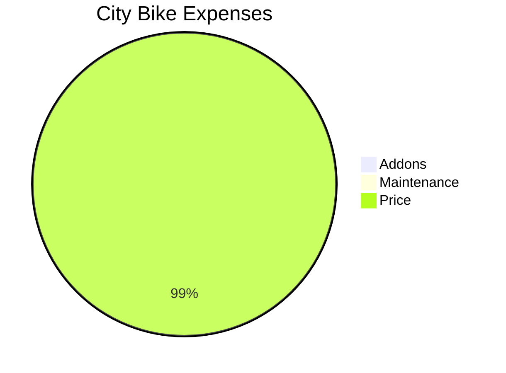

## Bike Costs Analytics

### Second Hand MTB

<!-- https://cyclingthere.com/_astro/PXL_20241008_144149173.Cj1pqXWc_1oH9Mo.webp -->

1. **DiamonDBack Sync 2.0** - 27.5" and 3x8 Speeds


  


With this one I made ~7300km in 3 years (3000, 3300, 1000).

> That makes ~0.08$ per km, from which 0,06$ per km where *operating costs*

Discounting the sale price (1000 PLN), drops to 0,05$ per km.

### Almost new MTB

2. **BH** SPIKE 29" DEORE 10V XCM REMOTE


  


### Vintage City Bike

3. **KTM** Libero 28" 5V


  


### Value for Money City Bike

4. 


  


<iframe src="https://www.komoot.com/es-es/tour/1237537825/embed?share_token=apX7DITeUFj6jtaqdn10djPBxES2hIHhpN5nM7uUpE7xlbNmuw&profile=1" width="100%" height="700" frameborder="0" scrolling="no"></iframe>

<!-- 

https://youtu.be/cqs4MkJ_4M4
 -->



---

## Outro

**With add-ons**:

* Shimano SH-M089L ~75$
* SHIMANO SPD PD-EH500 (Hibryd pedals) ~60$