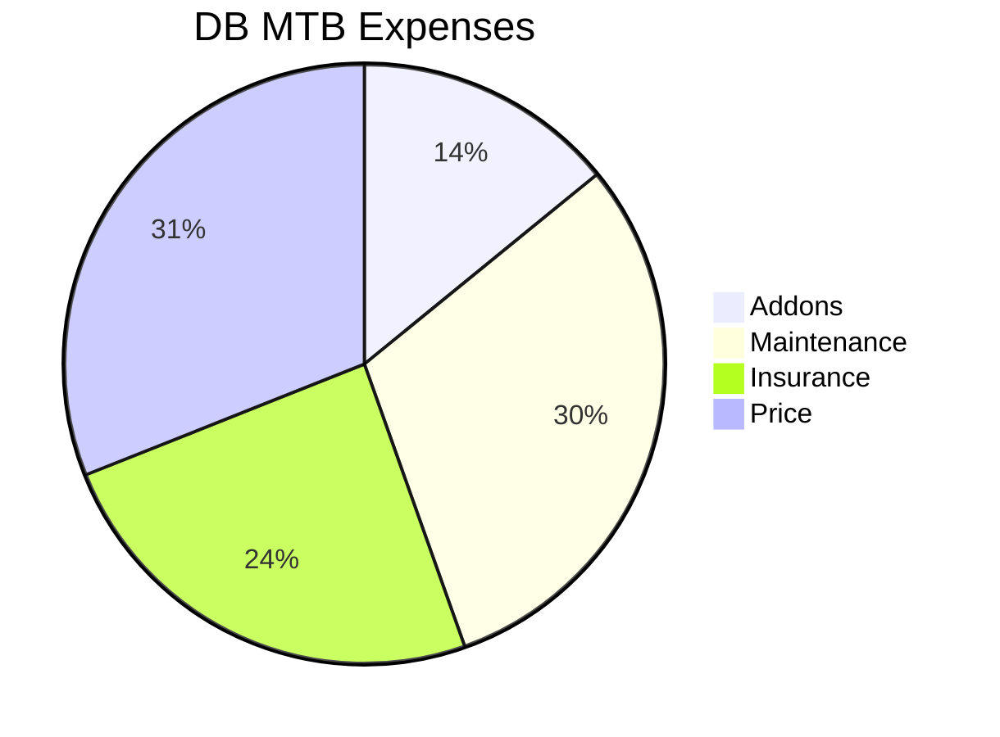
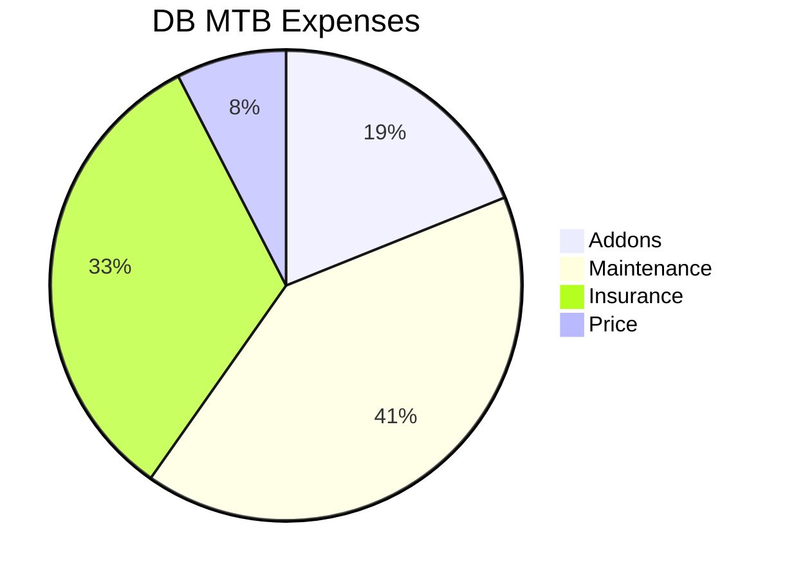
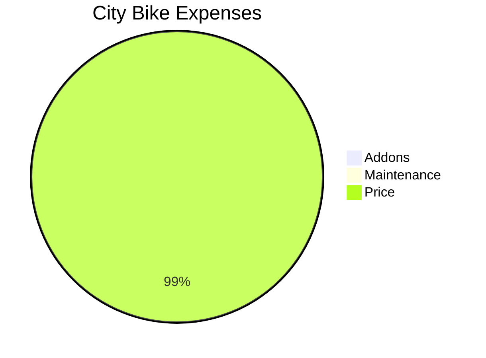

## Bike Costs Analytics

### Second Hand MTB

<!-- https://cyclingthere.com/_astro/PXL_20241008_144149173.Cj1pqXWc_1oH9Mo.webp -->

1. **DiamonDBack Sync 2.0** - 27.5" and 3x8 Speeds


  


With this one I made ~7300km in 3 years (3000, 3300, 1000).

> That makes ~0.08$ per km, from which 0,06$ per km where *operating costs*

Discounting the sale price (1000 PLN), drops to 0,05$ per km.

<iframe src="https://www.komoot.com/es-es/tour/1237537825/embed?share_token=apX7DITeUFj6jtaqdn10djPBxES2hIHhpN5nM7uUpE7xlbNmuw&profile=1" width="100%" height="700" frameborder="0" scrolling="no"></iframe>

<!-- 

https://youtu.be/cqs4MkJ_4M4
 -->




I recorded this one with the [Oa5Pro](https://jalcocert.github.io/JAlcocerT/dji-oa5pro-firmware-updates/)


### Almost new MTB

2. **BH** SPIKE 29" DEORE 10V XCM REMOTE


  




### Vintage City Bike

3. **KTM** Libero 28" 5V


  


### Value for Money City Bike

4. A second hand bike that came from germany:

<!-- 

  


 -->

---

## Outro

**With add-ons**:

* Shimano SH-M089L ~75$
* SHIMANO SPD PD-EH500 (Hibryd pedals) ~60$


{
  "type": "bar",
  "data": {
    "labels": ["Category A", "Category B", "Category C", "Category D", "Category E"],
    "datasets": [{
      "label": "Sales Figures",
      "data": [45, 62, 38, 75, 51],
      "backgroundColor": [
        "rgba(255, 99, 132, 0.8)",
        "rgba(54, 162, 235, 0.8)",
        "rgba(255, 206, 86, 0.8)",
        "rgba(75, 192, 192, 0.8)",
        "rgba(153, 102, 255, 0.8)"
      ],
      "borderColor": [
        "rgba(255, 99, 132, 1)",
        "rgba(54, 162, 235, 1)",
        "rgba(255, 206, 86, 1)",
        "rgba(75, 192, 192, 1)",
        "rgba(153, 102, 255, 1)"
      ],
      "borderWidth": 1
    }]
  },
  "options": {
    "scales": {
      "y": {
        "beginAtZero": true
      }
    },
    "plugins": {
      "title": {
        "display": true,
        "text": "Sample Bar Chart"
      },
      "legend": {
        "display": true
      }
    }
  }
}

