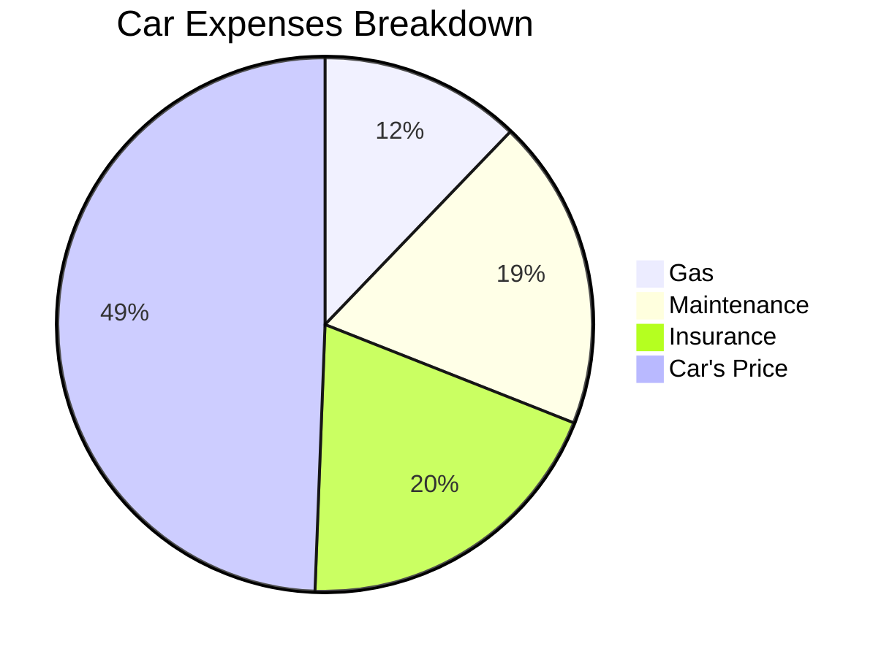
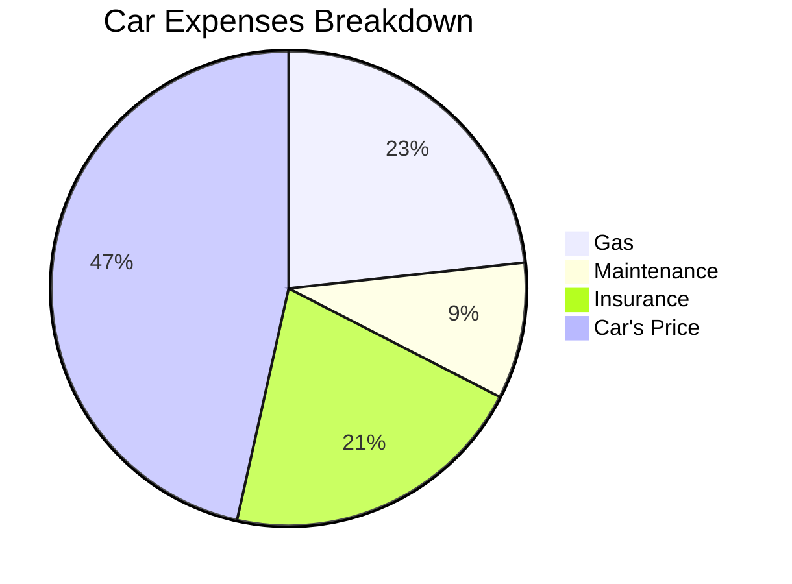

It was a **Honda Civic 6**, born on 1997 (1995-2000).

> NA / In Line 4 cilinders / 1.4L

<!-- 

 -->


  






D14A3 1.4 i (vs D14A4 1.4iS 90cv)

* **Cilindrada:** 1,396 cc (85.2 cu in)
* **Diámetro y carrera:** 75 mm (295 pulgadas) × 79 mm (311 pulgadas)
* **Compresión:** 9.1:1
* **Código ECU:** P3X
* **Potencia:** 75 CV (55 kilovatios) a 6,000 rpm
* **Torque/Par:** 109 Nm (11.1 kgm; 80 lb-ft) a 3,000 rpm
* **Tren de válvulas:** SOHC, cuatro válvulas por cilindro, sin VTEC
* **Línea roja:** 6,800 rpm
* **Corte de inyección:** 7,200 rpm
* **Control de combustible:** OBD2-A, DPFI (SFi – Simplified Fuel injection), Los inyectores abastecen por parejas (1+3 y 2+4)
* **Transmisión:** S40
* **Neumáticos:**
    * 175/65 R14
    * 175/70 R13
* **Torque máximo:** @ 108Nm
* **Depósito:** 45l
* **Maletero:** 225 a 600 litros
* **Peso:** 1030 a 1500kg

**Diferencias entre D14A3 y D14A4:**

* Los motores D14A3 y D14A4 son idénticos, la única diferencia es una pequeña junta bajo el acelerador en el D14A3 que restringe la toma de aire del motor (esto ocurre solo en algunos países europeos).
* También varía la relación de compresión y algunos componentes montados son diferentes.
```




## Car Costs Analytics

So far, this is the **split of the costs**:


When sold:



> Making **0,5$ per km**


<!--
  
 -->

**New Car vs Used Car** How about a Mondeo mk3?



> Making **~0,25$ per km**


**Renting?**

It of course depends, I have observed them to be from 0,38$/km to...1.54$/km.

> On average, when renting **~0,68$/km**.


## The costs of a Car

As mentioned, from my experience, this is what I got:


---

## How to buy a Car...

I mean an **used car**.

### What to Look when buying a second hand car

1. No water in the space where there should be oil (and biceversa)
2. Tires Equally used across the contact patch

<!-- 
https://www.youtube.com/watch?v=UINEmTO0LCY
 -->



Having a look to the spark plugs after changing them can tell you a lot of the engine status:


---

## FAQ

https://www.spritmonitor.de/de/suche.html


### In Germany

Steps for **buying a car in Germany**.

* [Importar coche de alemania a nivel particular](https://forocoches.com/foro/showthread.php?t=7264922).

* Find one:
  * [Mobile.de](https://suchen.mobile.de/fahrzeuge/search.html?cn=DE&isSearchRequest=true&ms=9000%3B%3B39%3B&od=up&pageNumber=4&ref=srpNextPage&refId=f5035f63-2646-3531-69d5-c28f462839dd&s=Car&sb=p&vc=Car)

* https://forocoches.com/foro/showthread.php?t=6139690&highlight=alemania


### In Netherlands

* [IMPORTACION Vehículos HOLANDA](https://forocoches.com/foro//showthread.php?p=439130711)

* [MarktPlaats](https://www.marktplaats.nl/l/auto-s/#q:vito)
* [IMPORTACION Vehículos HOLANDA](https://forocoches.com/foro/showthread.php?t=4950996)
* https://forocoches.com/foro/showthread.php?t=3791337
* https://forocoches.com/foro/showthread.php?t=1098678

> https://www.hypotheekrente.nl/

### In Spain

* https://www.carfax.eu/es
  * [Example](https://www.carfax.eu/es/vhr?reportId=11bd37fd-859c-45f4-9d7b-e30a53704bf1)

* [DGT Info about a car](https://sede.dgt.gob.es/es/vehiculos/informacion-de-vehiculos/informe-de-un-vehiculo/#:~:text=Para%20obtener%20el%20informe%20de,directamente%20desde%20la%20propia%20app.)

### In Poland

* https://www.otomoto.pl/osobowe/oferta

https://www.autocentrum.pl/fiat/ducato/ii/silnik-diesla-2.8-td-122km-1998-2003/

https://en.wikipedia.org/wiki/Fiat_Ducato

### How about Campers?

* [Camper Contact](https://www.campercontact.com/en/search?name=Amsterdam&lat=52.37403&lon=4.88969&zoom=12.5&names=AMS,Aemstelredamme,Aemsterdam,Amestelledamme,Amesterda,Amesterdam,Amesterdao,Amesterd%C3%A3,Amesterd%C3%A3o,Amistardam)

* [Park4Night](https://park4night.com/en/search?lat=52.372756486328726&lng=4.893615245819092&z=15)

* [Trick1](https://www.kartamultisport.pl/en/multisport/search-for-facilities/#/@51.8283438,19.7351276,10z?cards=1&categories=3)