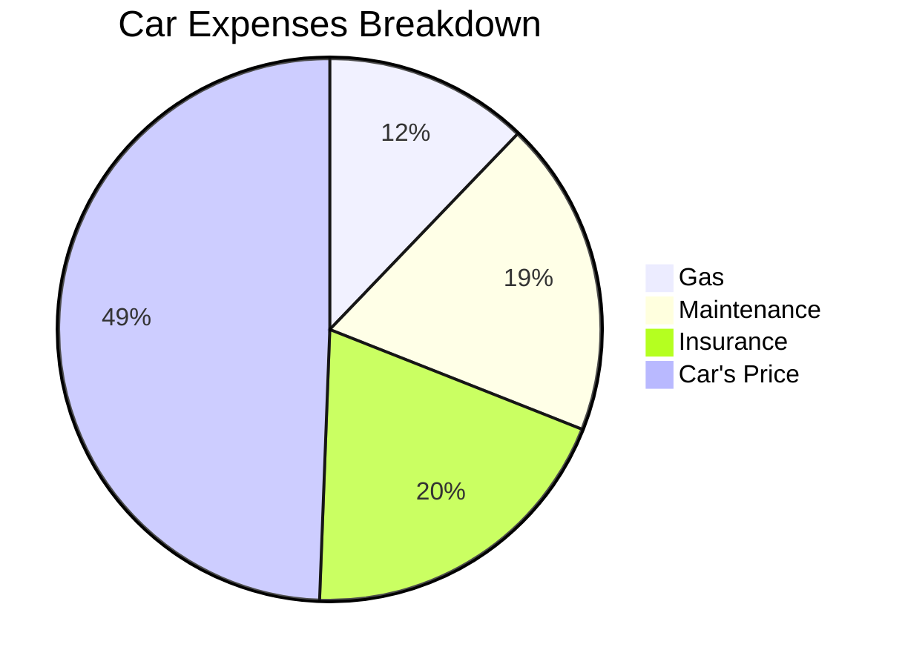
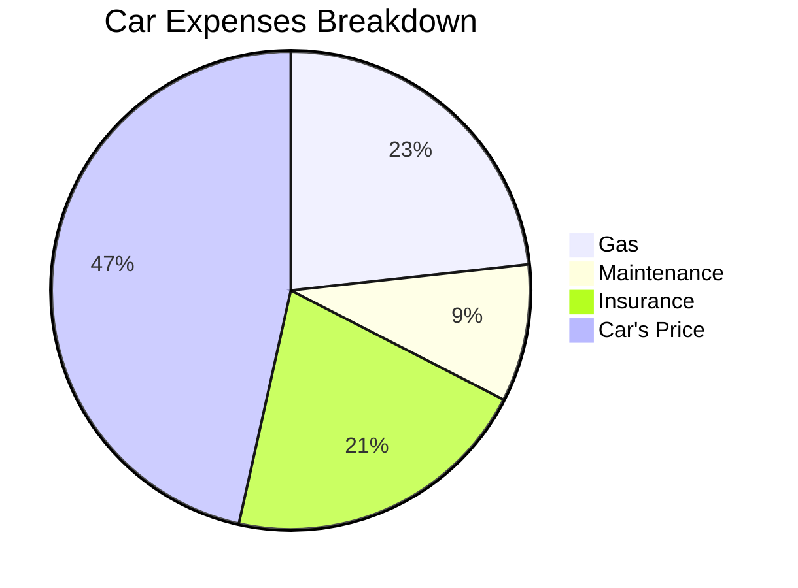

It was a **Honda Civic 6**, *born* on 1997 (1995-2000).

> NA / In Line 4 cilinders / 1.4L

<!-- 

 -->


  






D14A3 1.4 i (vs D14A4 1.4iS 90cv)

* **Cilindrada:** 1,396 cc (85.2 cu in)
* **Diámetro y carrera:** 75 mm (295 pulgadas) × 79 mm (311 pulgadas)
* **Compresión:** 9.1:1
* **Código ECU:** P3X
* **Potencia:** 75 CV (55 kilovatios) a 6,000 rpm
* **Torque/Par:** 109 Nm (11.1 kgm; 80 lb-ft) a 3,000 rpm
* **Tren de válvulas:** SOHC, cuatro válvulas por cilindro, sin VTEC
* **Línea roja:** 6,800 rpm
* **Corte de inyección:** 7,200 rpm
* **Control de combustible:** OBD2-A, DPFI (SFi – Simplified Fuel injection), Los inyectores abastecen por parejas (1+3 y 2+4)
* **Transmisión:** S40
* **Neumáticos:**
    * 175/65 R14
    * 175/70 R13
* **Torque máximo:** @ 108Nm
* **Depósito:** 45l
* **Maletero:** 225 a 600 litros
* **Peso:** 1030 a 1500kg

**Diferencias entre D14A3 y D14A4:**

* Los motores D14A3 y D14A4 son idénticos, la única diferencia es una pequeña junta bajo el acelerador en el D14A3 que restringe la toma de aire del motor (esto ocurre solo en algunos países europeos).
* También varía la relación de compresión y algunos componentes montados son diferentes.
```




## Car Costs Analytics

So far, this is the **split of the costs**:


When sold, the car expenses looked like:



> Making **0,5$ per km**


<!--
  
 -->

**New Car vs Used Car** How about a Mondeo mk3?



> Making **~0,25$ per km**


**Renting?**

It of course depends, I have observed them to be from 0,38$/km to...1.54$/km.

> On average, when renting **~0,68$/km**.


The energy costs, you can say it depends on the car.

Or throw a 10% number



In norway, you can find charging station around 4.4 ~ 5.5 NOK / Kwh

In a regular route, say that a electrical car would require ~15kwh to drive 100km

Some chargers are slow and will give you 3.3 KW, others, can give you 22/50 or even 150KW.

---

```txt

Rozmowa z Gemini
ive rented an electric car and we have done:


I got the car initially with31999 and 92% battery

The first day I used it to 42% finishing with 32200km

Then, loading to 90% whih was 31.02kwh and 133 NOK

Next, we drive to 32300, dropping to 75%

Then, we loaded to 100% which was 15,81 kwh and 67,83 NOK

Then, we made up to 32447 km dropping to 73%

Then, we made up to 32571 from that 73% to 45%

We charged again from 45% to 100% which was 150 NOK

Then, we drove to 32757 , staying the battery at 64%

We loaded from 64% to 100% which were 21.58kwh and 114 NOK

Then, it dropped to 34%, when it was showing us 33057 km

We charged up to 57%

Then we used it up to 33200, battery was showing 27%

Then we loaded up to 90% for 186 NOK and up to 100% for free

Then we made up to 33324, staying at 76% and loaded it again for free to 100%

Then we made up to 33403 staying at 84% and then 33604 staying at 43%

Then, we loaded up to 100% (at 4.5 NOK each Kwh), made 25km more and returned it at 94% battery


can you think step by step, what is the battery capacity in kwh?

how many kwh were spent to made the total km we ve done?

what was the total energetic cost in nok of the trip?
```

I can certainly provide a summary of how I inferred the total energy spent, its costs, and the kilometers driven for your electric car rental.

First, I'll use the search tool to quickly re-verify some of the base facts if there are any that I might have missed during my last step.

To determine the total energy spent, its costs, and the kilometers driven for your electric car rental, I followed a structured, step-by-step approach:

1.  **Extracting Raw Data:** I first meticulously went through your provided log of events, pulling out all numerical data points:
    * Initial and final odometer readings (kilometers).
    * Initial and final battery percentages.
    * All instances of charging, noting the starting and ending battery percentages, the kWh charged (if explicitly stated), and the cost in NOK (if explicitly stated).
    * Any specific cost rates (like $4.5 \text{ NOK/kWh}$).

2.  **Calculating Total Kilometers Driven:** This was the most straightforward. I simply subtracted the initial odometer reading from the final odometer reading (including the final $25 \text{ km}$ segment).
    * Initial km: $31999 \text{ km}$
    * Final km: $33604 \text{ km} + 25 \text{ km} = 33629 \text{ km}$
    * Total km driven: $33629 \text{ km} - 31999 \text{ km} = 1630 \text{ km}$

3.  **Estimating Battery Capacity (in kWh):** This was crucial as it allowed me to convert battery percentage changes into kWh. I used the charging events where both the kWh added *and* the percentage change were known. By dividing the kWh added by the percentage change (as a decimal), I could infer the full battery capacity. I performed this calculation for multiple such instances and then averaged them to get a more robust estimate.
    * Charge 1: $31.02 \text{ kWh}$ for a $48\%$ ($90\% - 42\%$) increase $\implies 31.02 / 0.48 \approx 64.62 \text{ kWh}$
    * Charge 2: $15.81 \text{ kWh}$ for a $25\%$ ($100\% - 75\%$) increase $\implies 15.81 / 0.25 \approx 63.24 \text{ kWh}$
    * Charge 4: $21.58 \text{ kWh}$ for a $36\%$ ($100\% - 64\%$) increase $\implies 21.58 / 0.36 \approx 59.94 \text{ kWh}$
    * **Average Estimated Battery Capacity:** $(64.62 + 63.24 + 59.94) / 3 \approx 62.60 \text{ kWh}$

4.  **Calculating Total Energy Spent (in kWh):** To determine the total energy consumed by the car over the entire trip, I used the principle of energy conservation:
    $\text{Total kWh Spent} = (\text{Initial Battery kWh}) + (\text{Total kWh Charged}) - (\text{Final Battery kWh})$
    * I converted the initial battery percentage ($92\%$) and final battery percentage ($94\%$) into kWh using the calculated battery capacity.
    * I then summed up all the kWh values from each charging event. For charges where kWh was not explicitly stated but the percentage change was known, I calculated the kWh using the estimated battery capacity.
        * Initial kWh: $0.92 * 62.60 \text{ kWh}$
        * All explicitly stated kWh charged were added.
        * For charges without explicit kWh, like "charged from $45\%$ to $100\%$, $150 \text{ NOK}$", I calculated the kWh as $(1.00 - 0.45) * 62.60 \text{ kWh}$.
        * Final kWh: $0.94 * 62.60 \text{ kWh}$
    * By summing all inputs and subtracting the final stored energy, I arrived at the total energy spent.

5.  **Calculating Total Energetic Cost (in NOK):** I meticulously summed all the monetary costs associated with charging the car throughout the trip.
    * For charges where a specific NOK amount was given, I directly added that amount.
    * For charges where a cost per kWh was specified (e.g., $4.5 \text{ NOK/kWh}$), I multiplied this rate by the calculated kWh for that specific charge (derived from percentage change and battery capacity).
    * Free charges were counted as $0 \text{ NOK}$.

By systematically applying these steps, I was able to infer the detailed energy consumption and cost figures for your electric car rental.

---

**When Does an EV's Higher Upfront Cost Pay Off?**

While electric vehicles often come with a higher initial purchase price, their significantly lower running costs can quickly bridge that gap.

Let's crunch the numbers to see when an EV becomes the more economical choice in the long run, using our calculated running costs and your provided vehicle prices.

**Assumptions:**
* **Electric Vehicle (EV) Purchase Price:** $40,000 \text{ USD}$
* **Diesel Equivalent Purchase Price:** $25,000 \text{ USD}$
* **Currency Conversion:** $1 \text{ USD} = 10 \text{ NOK}$

**Our Calculated Running Costs (converted to USD per 100 km):**
* **EV Running Cost per $100 \text{ km}$:** $4.98 \text{ USD}$
* **Diesel Running Cost per $100 \text{ km}$:** $12.00 \text{ USD}$

**The Calculation:**

1.  **Upfront Cost Difference:**
    The electric vehicle has an initial premium:
    $40,000 \text{ USD (EV)} - 25,000 \text{ USD (Diesel)} = \mathbf{15,000 \text{ USD}}$

2.  **Running Cost Savings per $100 \text{ km}$ (EV vs. Diesel):**
    The EV is cheaper to operate, saving you:
    $12.00 \text{ USD (Diesel)} - 4.98 \text{ USD (EV)} = \mathbf{7.02 \text{ USD}}$ saved per $100 \text{ km}$ driven.

3.  **Kilometers to Equalize Total Cost:**
    To find out how many kilometers you need to drive for these savings to offset the higher purchase price, we divide the upfront difference by the per-kilometer savings: *When are the 15k usd consumed at a 7 usd per 100 km difference rate in operation?*

**Conclusion of this example:**

Despite the initial $15,000 higher price tag (25 vs 40k), the electric vehicle's lower running costs mean that the total cost of ownership becomes equal to that of the diesel car after approximately **$213,675 km** of driving.

This is a significant distance, highlighting that while EVs offer long-term savings, the payback period depends heavily on the difference in both purchase price and daily running expenses.

Beyond this mileage, the electric vehicle will continue to accrue savings, making it the more economically advantageous choice over its lifespan.




| Category          | Electric Car (per 100 km) | Diesel Car (per 100 km) |
| :---------------- | :------------------------ | :---------------------- |
| **Energy Consumption** |                           |                         |
| In kWh            | 13.03 kWh       | 60.00 kWh (chemical energy in fuel per L) |
| In Volume/Mass    | N/A                       | 6 liters      |
| **Energetic Cost**|                           |                         |
| In USD            | ~5$ \text{ NOK}$       | ~ $12   |

Remember that not everywhere you can rent without a credit card!

> For me, it worked with sixt, budget and avis. Also in hertz.

>> To charge you can try elton or eviny via bilkraft app.

## The costs of a Car

As mentioned, from my experience, this is the **cost split that I got:**


{
  "type": "bar",
  "data": {
    "labels": ["Category A", "Category B", "Category C", "Category D", "Category E"],
    "datasets": [{
      "label": "Sales Figures",
      "data": [45, 62, 38, 75, 51],
      "backgroundColor": [
        "rgba(255, 99, 132, 0.8)",
        "rgba(54, 162, 235, 0.8)",
        "rgba(255, 206, 86, 0.8)",
        "rgba(75, 192, 192, 0.8)",
        "rgba(153, 102, 255, 0.8)"
      ],
      "borderColor": [
        "rgba(255, 99, 132, 1)",
        "rgba(54, 162, 235, 1)",
        "rgba(255, 206, 86, 1)",
        "rgba(75, 192, 192, 1)",
        "rgba(153, 102, 255, 1)"
      ],
      "borderWidth": 1
    }]
  },
  "options": {
    "scales": {
      "y": {
        "beginAtZero": true
      }
    },
    "plugins": {
      "title": {
        "display": true,
        "text": "Sample Bar Chart"
      },
      "legend": {
        "display": true
      }
    }
  }
}



---

## How to buy a Car...

I mean an **used car**.

### What to Look when buying a second hand car

1. No water in the space where there should be oil (and biceversa)
2. Tires Equally used across the contact patch

I kind of had a file with these...


But saved into some private sheet gives nothing!


<!-- 
https://www.youtube.com/watch?v=UINEmTO0LCY
 -->

Thats why I put together this *how to* video for changing the **Civic 6 spark plugs**:



Having a look to the spark plugs after changing them can tell you a lot of the engine status.

See a sample old Civic 6 spark plugs:


## Conclusions

This project started as a test to see the costs of owning a car.

And in the meantime I saw an interesting post: https://forocoches.com/foro/showthread.php?t=9203326&highlight=

> Some people are doing cool adventures with old card *Salgo para Dakar para intentar vender un Mercedes viejo. Haremos seguimiento*

---

## FAQ

If you are wondering how efficient you are driving, you can compare your fuel consumption with people using the same car: https://www.spritmonitor.de/de/suche.html

> Notice the difference in summer vs winter months!

### In Germany

Steps for **buying a car in Germany**.

* [Importar coche de alemania a nivel particular](https://forocoches.com/foro/showthread.php?t=7264922).

* Find one:
  * [Mobile.de](https://suchen.mobile.de/fahrzeuge/search.html?cn=DE&isSearchRequest=true&ms=9000%3B%3B39%3B&od=up&pageNumber=4&ref=srpNextPage&refId=f5035f63-2646-3531-69d5-c28f462839dd&s=Car&sb=p&vc=Car)
  * https://forocoches.com/foro/showthread.php?t=6139690&highlight=alemania


### In Netherlands

If you live in NL and want to buy a car instead of minding your [pension](https://www.mijnpensioenoverzicht.nl/en). Then see:

* [IMPORTACION Vehículos HOLANDA](https://forocoches.com/foro//showthread.php?p=439130711)

* [MarktPlaats](https://www.marktplaats.nl/l/auto-s/#q:vito)
* [IMPORTACION Vehículos HOLANDA](https://forocoches.com/foro/showthread.php?t=4950996)
* https://forocoches.com/foro/showthread.php?t=3791337
* https://forocoches.com/foro/showthread.php?t=1098678

> https://www.hypotheekrente.nl/

### In Spain

* https://www.historialvehiculo.com/
* https://www.carfax.eu/es
  * [Example](https://www.carfax.eu/es/vhr?reportId=11bd37fd-859c-45f4-9d7b-e30a53704bf1)

* [DGT Info about a car](https://sede.dgt.gob.es/es/vehiculos/informacion-de-vehiculos/informe-de-un-vehiculo/#:~:text=Para%20obtener%20el%20informe%20de,directamente%20desde%20la%20propia%20app.)

* furgoneta
    * https://forocoches.com/foro/showthread.php?t=7244645 - Quiero Vivir en una Furgoneta +Proyecto+Consejos
    * https://forocoches.com/foro/showthread.php?t=6536967&highlight=vivo+autocaravana - Vivo en una autocaravana y respondo preguntas +HD




Comprar un vehículo de segunda mano en España implica una serie de pasos y consideraciones importantes para garantizar una transacción segura y sin contratiempos. Aquí te presento una guía detallada:

**1. Verificación del estado del vehículo:**

* **Inspección mecánica:**
    * Es fundamental revisar el estado general del vehículo, incluyendo motor, frenos, neumáticos, luces y otros componentes.
    * Considera llevar el coche a un taller de confianza para una revisión profesional.
* **Historial del vehículo:**
    * Solicita un informe de historial en la Dirección General de Tráfico (DGT) para verificar la titularidad, historial de inspecciones técnicas (ITV), posibles cargas o embargos, y otros datos relevantes.
    * También puedes obtener informes de empresas especializadas que ofrecen datos adicionales sobre el vehículo.

**2. Documentación necesaria:**

* **Contrato de compraventa:**
    * Elabora un contrato de compraventa que incluya los datos del comprador y vendedor, la descripción del vehículo (marca, modelo, matrícula), el precio de venta, la fecha y hora de la transacción, y las condiciones de la venta.
* **Permiso de circulación y ficha técnica:**
    * Asegúrate de que el vendedor te entregue el permiso de circulación y la ficha técnica del vehículo.
* **Justificante del pago del Impuesto sobre Vehículos de Tracción Mecánica (IVTM):**
    * Verifica que el vendedor esté al corriente de pago de este impuesto.

**3. Trámites administrativos:**

* **Cambio de titularidad:**
    * Debes realizar el cambio de titularidad del vehículo en la DGT en un plazo de 30 días desde la firma del contrato de compraventa.
    * Puedes realizar este trámite de forma presencial en las oficinas de la DGT o de forma telemática a través de su sede electrónica.
* **Pago del Impuesto de Transmisiones Patrimoniales (ITP):**
    * Este impuesto se paga en la comunidad autónoma donde resides y varía según la comunidad.
    * El importe se calcula aplicando un porcentaje sobre el valor del vehículo según tablas oficiales.

**4. Impuestos:**

* **Impuesto de Transmisiones Patrimoniales (ITP):**
    * Este es el principal impuesto a pagar al comprar un vehículo de segunda mano.
    * El porcentaje varía según la comunidad autónoma, generalmente entre el 4% y el 8% del valor del vehículo.
* **Impuesto sobre Vehículos de Tracción Mecánica (IVTM):**
    * Este impuesto, también conocido como impuesto de circulación, se paga anualmente al ayuntamiento donde resides.
    * El importe varía según la potencia fiscal del vehículo y el municipio.

**Recomendaciones adicionales:**

* Asegúrate de que el vendedor esté al corriente de pago de multas y sanciones.
* Verifica que el vehículo tenga la ITV en vigor.
* Considera contratar un seguro de automóvil antes de utilizar el vehículo.
* Comprueba que el vehiculo esta libre de cargas, embargos o precintos.




### In Poland

* https://www.otomoto.pl/osobowe/oferta

https://www.autocentrum.pl/fiat/ducato/ii/silnik-diesla-2.8-td-122km-1998-2003/

https://en.wikipedia.org/wiki/Fiat_Ducato

### How about Campers?

* [Camper Contact](https://www.campercontact.com/en/search?name=Amsterdam&lat=52.37403&lon=4.88969&zoom=12.5&names=AMS,Aemstelredamme,Aemsterdam,Amestelledamme,Amesterda,Amesterdam,Amesterdao,Amesterd%C3%A3,Amesterd%C3%A3o,Amistardam)

* [Park4Night](https://park4night.com/en/search?lat=52.372756486328726&lng=4.893615245819092&z=15)

* [Trick1](https://www.kartamultisport.pl/en/multisport/search-for-facilities/#/@51.8283438,19.7351276,10z?cards=1&categories=3)

You might want to have [a look to portable batteries](https://www.reddit.com/r/camping/comments/rujbie/portable_power_station/)