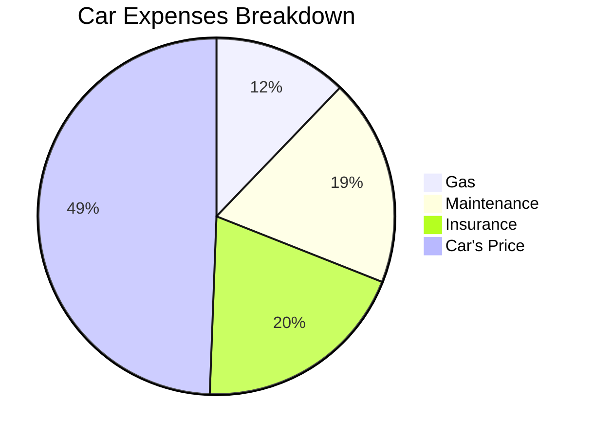

It was a **Honda Civic 6**, born on 1997 (1995-2000).

> NA / In Line 4 cilinders / 1.4L

## Car Costs Analytics

### New Car vs Used Car

---

## How to buy a Car...

I mean an **used car**.

### What to Look when buying a second hand car

1. No water in the space where there should be oil (and biceversa)
2. Tires Equally used across the contact patch

<!-- 
https://www.youtube.com/watch?v=UINEmTO0LCY
 -->



### In Germany

Steps...

### In Netherlands

### In Spain