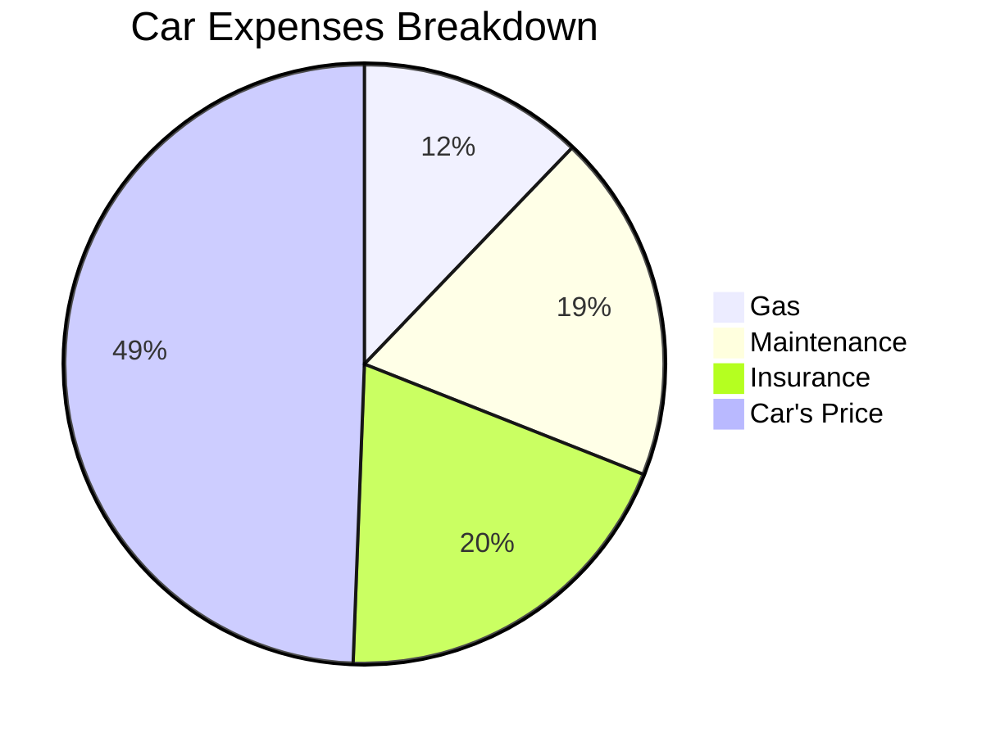
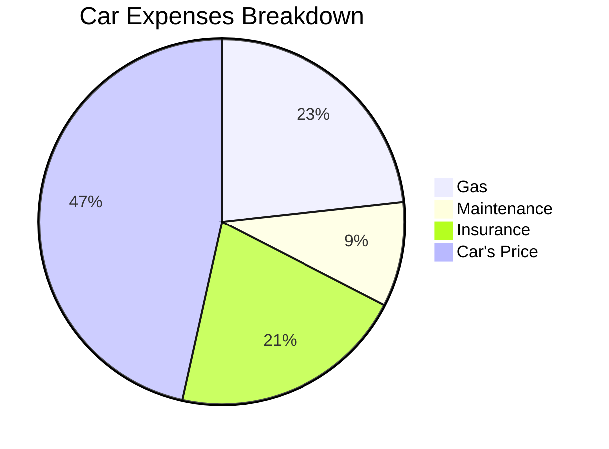

It was a **Honda Civic 6**, born on 1997 (1995-2000).

> NA / In Line 4 cilinders / 1.4L

<!-- 

 -->


  


## Car Costs Analytics

So far, this is the **split of the costs**:

When sold:

> Making **0,5$ per km**

<!--
  
 -->

**New Car vs Used Car** How about a Mondeo mk3?

> Making **~0,25$ per km**

**Renting?**

It of course depends, I have observed them to be from 0,38$/km to...1.54$/km.

> On average, when renting **~0,68$/km**.

---

## How to buy a Car...

I mean an **used car**.

### What to Look when buying a second hand car

1. No water in the space where there should be oil (and biceversa)
2. Tires Equally used across the contact patch

<!-- 
https://www.youtube.com/watch?v=UINEmTO0LCY
 -->



Having a look to the spark plugs after changing them can tell you a lot of the engine status:

### In Germany

Steps for **buying a car in Germany**.

* [Importar coche de alemania a nivel particular](https://forocoches.com/foro/showthread.php?t=7264922).

### In Netherlands

* [IMPORTACION Vehículos HOLANDA](https://forocoches.com/foro//showthread.php?p=439130711)

* [MarktPlaats](https://www.marktplaats.nl/l/auto-s/#q:vito)
* [IMPORTACION Vehículos HOLANDA](https://forocoches.com/foro/showthread.php?t=4950996)
* https://forocoches.com/foro/showthread.php?t=3791337
* https://forocoches.com/foro/showthread.php?t=1098678

> https://www.hypotheekrente.nl/

### In Spain

* https://www.carfax.eu/es

* [DGT Info about a car](https://sede.dgt.gob.es/es/vehiculos/informacion-de-vehiculos/informe-de-un-vehiculo/#:~:text=Para%20obtener%20el%20informe%20de,directamente%20desde%20la%20propia%20app.)

### How about Campers?

* [Camper Contact](https://www.campercontact.com/en/search?name=Amsterdam&lat=52.37403&lon=4.88969&zoom=12.5&names=AMS,Aemstelredamme,Aemsterdam,Amestelledamme,Amesterda,Amesterdam,Amesterdao,Amesterd%C3%A3,Amesterd%C3%A3o,Amistardam)

* [Park4Night](https://park4night.com/en/search?lat=52.372756486328726&lng=4.893615245819092&z=15)

* [Trick1](https://www.kartamultisport.pl/en/multisport/search-for-facilities/#/@51.8283438,19.7351276,10z?cards=1&categories=3)