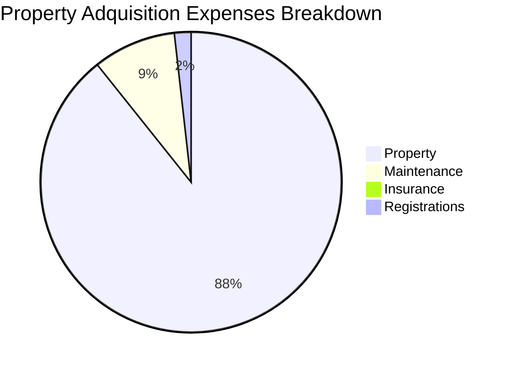

**Intro**

If you are getting a credit...

Before anything, understand how [French Amortization](https://jalcocert.github.io/JAlcocerT/python-real-estate-mortage-calculator/) works.

And maybe have a look to the properties around with some [RE AIgent](https://jalcocert.github.io/JAlcocerT/streamlit-is-cool/).


Make sure you understand also monetary aggregates. While taking a credit, you will be involved on new M1 creation


+++ How to estimate [painting costs](#estimating-painting-costs-with-ai)?

## Property Costs Analytics

A **gantt chart** is worth a zillion words:

### Spain

In Spain you could expect:

* 6% taxes + 3-5k notario + 0.5 to 1k/m2 repairs/setup

<!--  -->

---

## Conclusions

This project started as a test to see the costs of owning a house.

I got to know how quickly furniture costs can escalate: whats x1 can be x4

Id say you have to stay open for ideas: not only IKEA, but maybe sklum or others...

And in the meantime I thought on how to estimate the **painting cost, given a house plan**.

You can find sample house plans at:

* https://www.funda.nl/detail/koop/vijfhuizen/huis-jack-sharp-park-29/43919214/
* https://www.funda.nl/detail/koop/heerhugowaard/huis-steigerdijk-41/43938874/
* https://www.funda.nl/detail/koop/vijfhuizen/huis-jack-sharp-park-13/43843421/


Whatever you will do...


...make sure you understand:

1. Market volatility
2. What is debt (and money)
3. If a mortage is complex, is even more when you *play* between currencies
4. Math CAGR Formula: See how much nominal values Changed. Understand [inflation](https://inflationchart.com/home-in-m3) and how [wages](https://en.wikipedia.org/wiki/Minimum_wage_in_Poland) are affected.

* https://fred.stlouisfed.org/series/WM2NS
* https://inflationchart.com/home-in-m3

* **For a value that has gone up 4 times over 20 years, the CAGR is 7.18%.** This means that, on average, the value grew by approximately 7.18% each year.

* **For a value that has gone up 2 times over 5 years, the CAGR is 14.87%.** This means that, on average, the value grew by approximately 14.87% each year.

$$CAGR = (\frac{Ending\ Value}{Beginning\ Value})^{\frac{1}{Years}} - 1$$

{}

An operation to take out a mortgage in Swiss francs (CHF) for a house in Poland using Polish zloty (PLN) from the bank is now effectively impossible and would be **extremely complex and risky** if it were.

This is due to a series of legal and market developments that have made this type of loan a historical and controversial issue in Poland.

The Historical Context: The "Frankowicz" Problem

The kind of operation you're describing was common in Poland between 2004 and 2008. At the time, Swiss franc mortgages were popular because the interest rates were significantly lower than those for PLN loans. However, the borrowers received their loan in PLN, while the loan's value and repayment schedule were tied to the CHF exchange rate. 

After the 2008 financial crisis, the Swiss franc appreciated dramatically against the Polish zloty. This caused the total debt and monthly installments for these borrowers to skyrocket, often to an amount far exceeding the value of their homes and what they had originally borrowed. These borrowers, known as "Frankowicze," have been in a protracted legal battle with Polish banks ever since.

***

Current Legal and Market Situation

Due to the massive legal and financial issues this has created, Polish banks are no longer offering these kinds of foreign currency-indexed mortgages. The Polish Financial Supervision Authority (KNF) has also implemented regulations that make offering such loans unfeasible.

A new operation would be:

* **Legally Unlikely:** Polish courts have consistently ruled in favor of borrowers, declaring the clauses in these loan agreements as "abusive" and in many cases invalidating the entire contract. This has forced banks to take massive financial losses, making them highly averse to issuing any new foreign currency loans.
* **Volatile and Risky:** Even if a bank were to offer such a product, the operation would carry an immense exchange rate risk for the borrower. The value of your debt could fluctuate wildly, making it impossible to predict your future payments or the total cost of the loan. This is the primary reason why tens of thousands of Poles sued their banks.
* **Costly and Complex:** The legal and financial mess of the past makes it clear that such a loan is not a simple transaction. It would be subject to extreme scrutiny, and you would likely need to engage in complex legal proceedings if currency rates were to move against you.

In short, while technically a "debt in Swiss franc" could be arranged, it would not be a standard, safe, or even available product from a Polish bank today. The market and legal system have moved away from this type of transaction due to the immense risks it created for consumers. The only existing CHF mortgages are those taken out years ago, and even they are being converted to PLN through court-mandated settlements.

{}

* https://www.global-rates.com/en/interest-rates/libor/
* https://www.global-rates.com/en/interest-rates/sofr/

{}

Financial institutions tied interest rates to the **LIBOR (London Interbank Offered Rate)** because it was a widely accepted and transparent benchmark that reflected the cost of borrowing between major banks.

This created a standardized way to price various financial products, from mortgages to corporate loans, for a few key reasons:

1. Market-Based and Standardized

LIBOR was seen as the most accurate reflection of the prevailing cost of money for banks. By using it as a benchmark, a bank could offer a loan with an interest rate of, for example, "LIBOR + 3%." This meant the borrower's interest rate would automatically adjust in sync with the global financial market, making the loan transparent and fair for both the lender and the borrower. It was a standardized and efficient way to price loans, as everyone knew what the "base" rate was.

***

2. Risk Management

Tying a loan to a variable benchmark like LIBOR was an essential tool for banks to manage **interest rate risk**. When a bank issued a loan with a fixed interest rate, it was exposed to the risk of its own borrowing costs rising, which would cut into its profit margin. By linking a loan to a floating rate, the bank's income from the loan would rise or fall in line with its own funding costs, thereby protecting its profit.

***

3. Hedging Financial Instruments

LIBOR was not just for loans; it was a critical component of the global derivatives market. Instruments like **interest rate swaps** were used by institutions to hedge their exposure to changing interest rates. 

The value of these swaps was often tied to LIBOR, making it a cornerstone for a wide range of financial contracts. This provided a liquid and predictable market for hedging complex risks.

For decades, LIBOR served as the foundation for setting rates on trillions of dollars in financial products worldwide.

 However, its reliance on a "poll" of banks rather than actual transactions led to a manipulation scandal, which ultimately resulted in its discontinuation and replacement with more robust, transaction-based rates like SOFR.

---

LIBOR (London Interbank Offered Rate) was a globally recognized benchmark interest rate, but it wasn't a single rate for all currencies. Instead, it was a family of rates, with a separate LIBOR for each major currency and for different loan durations.

LIBOR and Different Currencies 💱

LIBOR was initially created to serve the short-term borrowing needs of international banks in London. Because these banks dealt in various global currencies, separate LIBOR rates were calculated for each one. At its peak, LIBOR was calculated for ten different currencies. However, due to market consolidation and reforms, this number was reduced to five major currencies before its eventual discontinuation:

* **U.S. Dollar (USD)**
* **British Pound Sterling (GBP)**
* **Euro (EUR)**
* **Japanese Yen (JPY)**
* **Swiss Franc (CHF)**

For each of these currencies, there were also different rates for various maturities, or "tenors," ranging from overnight to one year. This gave financial institutions a wide range of options to price a vast number of products, from short-term corporate loans to long-term mortgages. 

***

Why It Was Discontinued 📉

The entire LIBOR system was phased out due to its fundamental flaws and a major manipulation scandal that came to light in 2012.

* **Reliance on Estimates:** The most significant flaw was that LIBOR was not based on actual transactions. Instead, it was based on **estimates** from a small panel of banks in London. Each bank would report what it believed it would be charged to borrow from other banks.
* **Manipulation:** This "honor system" led to widespread manipulation. Traders at some banks intentionally submitted false, low estimates to make their bank appear healthier than it was during the 2008 financial crisis, or to profit from positions in financial derivatives. This lack of integrity and transparency was the primary reason for its demise.

The final USD LIBOR rate was published on June 30, 2023, marking the end of its use as a benchmark. It has been replaced by more robust, transaction-based rates like the **Secured Overnight Financing Rate (SOFR)** in the United States.

{}

### Estimating painting costs with AI

Those are **gross yields**, remember that there are many costs, amortizations,... related that you will have to plug for your specific case.

> See [home decorating](https://www.reddit.com/r/HomeDecorating/top/) ideas

Lets say that it cost **~65eur afor 15kg of paint.**

With that one, you can paint ~100m2 *-in theory*.



How to estimate the wall size in your flat based on the floor plan and the total area.

**Understanding the Challenge**

We only have the area of each room, not the exact dimensions (length and width). To estimate wall length, we'll need to make some assumptions about the shape of the rooms.

**Assumptions**

1. **Rectangular Rooms:** We'll assume all rooms are roughly rectangular. This is a common assumption for floor plans.
2. **Simplified Shapes:** We'll treat the overall shape of the flat as a rectangle for easier calculation.

**Estimation Process**

1. **Calculate the Perimeter of Each Room:**
   * For a rectangle, the perimeter is 2 * (length + width).
   * Since we only have the area, we'll need to estimate the length and width. We can do this by assuming the rooms are close to square for an initial estimate.
   * For example, for a room with 26.4 m², assuming it's square, each side would be approximately √26.4 ≈ 5.14 meters. The perimeter would be roughly 4 * 5.14 ≈ 20.56 meters.

2. **Sum the Perimeters:** Add up the estimated perimeters of all the rooms.

3. **Adjust for Shared Walls:** The sum of the perimeters will overcount the walls because it counts each wall twice (once for each room it borders). We need to subtract the length of the shared walls.

4. **Estimate Shared Walls:**
   * Look at the floor plan and estimate which walls are shared between rooms.
   * Make reasonable estimations of the length of these shared walls.

5. **Subtract Shared Wall Lengths:** Subtract the estimated total length of shared walls from the sum of the perimeters.

**Let's Do the Calculations (Rough Estimate)**

1. **Room Perimeters (Approximations):**
   * Pokój dzienny (26.4 m²): ≈ 20.56 m
   * Pokój (9.2 m²): ≈ 12.12 m
   * Łazienka (4.4 m²): ≈ 8.37 m
   * Kuchnia (6.4 m²): ≈ 10.12 m
   * Przedpokój (7 m²): ≈ 10.58 m
   * Loggia (2.6 m²): ≈ 6.44 m

2. **Sum of Perimeters:** 20.56 + 12.12 + 8.37 + 10.12 + 10.58 + 6.44 ≈ 68.19 meters

3. **Estimate Shared Walls:**
   * Looking at the floor plan, there are several shared walls. We need to estimate their lengths.
   * This is where it gets tricky without exact dimensions. Let's make a rough guess that the total length of shared walls is about 20 meters (this is just an estimation).

4. **Subtract Shared Walls:** 68.19 - 20 ≈ 48.19 meters

**Important Note:** This is a rough estimation. Without precise dimensions, it's impossible to get an exact wall length.

**Refining the Estimate**

To improve the estimate, you would need:

* **More Detailed Dimensions:** If you have the length and width of each room, the calculations would be much more accurate.
* **Wall Thickness:** We haven't accounted for wall thickness, which would add to the overall length.

---

Be knowing the area (55m2 for example), you already know the **ceiling paint**.

Or you can just estimate the internal walls with sqrt(area=55) = 7.7

So that would be 15m, times the height of the walls (say 2m), which would be 30 m2.

But you are missing all internal walls which make the rooms, say thats 100% more.



First estimation ~ 55+30*2 = 115m2, which for **2 layers** would be ~30kg

After finishing a full flat, **these are my learnings of having painted**

1. Depending on surface complexity + counting all the layers (2 and sometimes 3): **~2-3 hours / person x m2**

*2 person would do it in 1-/1.5h that same m2* 

2. Count material costs around **~1.5$/m2** - *Squared m2 of surface to be painted, which with a flat layout+math you can figure out*

> This counts all layers of paint and with a current cost of **~10$/l**.

The world of home paints can be a bit overwhelming with different types and terminologies.



Synthetic Paints

"Synthetic" is a broad term that essentially means the paint is made from artificially created materials, often derived from petrochemicals. Many modern paints fall under this category. 

Within synthetic paints, you'll find various binders (the substance that holds the pigment together and adheres to the surface), each with its own characteristics.

**Pros:**

* **Durability and Resistance:** Generally offer good resistance to wear, tear, moisture, and UV light, leading to a longer-lasting finish.
* **Wide Range of Colors:** Synthetic pigments often provide more vibrant and long-lasting colors.
* **Good Coverage:** Many synthetic paints offer excellent opacity, requiring fewer coats.
* **Versatility:** Can be formulated for various surfaces like wood, metal, and walls.
* **Affordability:** Often more cost-effective than natural paints.

**Cons:**

* **VOCs (Volatile Organic Compounds):** Can release higher levels of VOCs, which can negatively impact indoor air quality and pose health risks. Water-based synthetic paints generally have lower VOCs than solvent-based ones.
* **Environmental Impact:** Production often relies on non-renewable resources and energy-intensive processes.
* **Breathability:** May not allow walls to "breathe" as much as some natural paints, potentially trapping moisture.
* **Strong Odor:** Solvent-based synthetic paints can have a strong and lingering odor.
* **Cleaning:** Often require solvents like mineral spirits for cleaning brushes and spills.

Acrylic Paints

Acrylic paints are a type of synthetic paint where the binder is an acrylic resin. They are water-based.

**Pros:**

* **Quick Drying Time:** Dries relatively fast, allowing for quicker recoating.
* **Water-Based:** Easier to clean up with soap and water while wet. Lower odor and VOCs compared to oil-based paints.
* **Good Adhesion:** Adheres well to various surfaces, including walls, ceilings, furniture, and even some exterior applications.
* **Durability and Flexibility:** Once dry, they are water-resistant and flexible, making them less prone to cracking and peeling, especially on surfaces that might expand or contract.
* **Color Retention:** Colors tend to remain vibrant after drying.
* **Versatility:** Can be mixed with various mediums to achieve different textures and effects.
* **Affordability:** Generally more budget-friendly than oil-based paints.

**Cons:**

* **Fast Drying Can Be a Drawback:** Requires working quickly to avoid brush strokes and issues with blending.
* **Color Shift:** May slightly darken as it dries, which can be a consideration for color matching.
* **Can Be Difficult to Remove When Dry:** Once acrylic paint dries, it becomes water-resistant and can be challenging to remove from surfaces and brushes.
* **May Require Priming:** Some surfaces may need a primer for optimal adhesion.

### Latex Paints

"Latex" paint is a bit of a misnomer because most modern latex paints do not actually contain natural rubber latex.

They are also water-based and use synthetic polymers like acrylic, vinyl acrylic, or a combination as binders. 

For practical purposes in the home painting context, **latex paints are often considered a subset of acrylic or vinyl-acrylic water-based paints.**

**Pros:**

* **Easy Application:** Generally easy to apply with brushes, rollers, or sprayers.
* **Quick Drying Time:** Dries relatively quickly.
* **Water-Based:** Easy cleanup with soap and water. Low odor and VOCs compared to oil-based paints.
* **Good Flexibility:** Offers good flexibility, resisting cracking and peeling, especially on walls and ceilings.
* **Breathability:** Allows better breathability compared to some oil-based or high-gloss paints.
* **Wide Availability and Affordability:** Widely available and generally more cost-effective than oil-based or some specialized acrylic paints.
* **Good for Interior Walls and Ceilings:** Well-suited for most interior painting projects.
* **Non-Yellowing:** Resists yellowing over time, especially in areas not exposed to direct sunlight.

**Cons:**

* **Can Show Brush Strokes:** Some formulations or application techniques may result in visible brush strokes.
* **Less Durable Than Some Acrylics:** May not be as durable or scrub-resistant as high-quality 100% acrylic paints, especially in high-traffic areas or bathrooms.
* **Not Ideal for All Surfaces:** May not adhere well to glossy surfaces or metal without proper priming.
* **Can Swell Wood Grain:** Water-based nature can cause wood grain to swell if not properly sealed.
* **Less Suitable for Exterior:** Generally not as durable as exterior-grade acrylic paints for outdoor use due to less resistance to weather elements.

**In summary:**

* For most **interior walls and ceilings**, **latex (water-based acrylic or vinyl-acrylic)** paints are a popular and practical choice due to their ease of use, cleanup, low odor, and affordability.

* For **high-moisture areas like bathrooms and kitchens**, or for **exterior projects**, **100% acrylic paints** are often preferred for their better durability, adhesion, and resistance to moisture and mildew.

* **Synthetic paints** encompass a broad category, and understanding the specific binder (like acrylic) will give you a better idea of the paint's properties. 

Oil-based synthetic paints are less common for general home use now due to VOCs and cleanup requirements but still have specific applications (e.g., durable finishes on trim or metal).

When choosing paint, consider the surface you're painting, the desired finish (matte, satin, semi-gloss, gloss), the level of durability needed, and your preference regarding VOCs and ease of cleanup.



### Cool Stuff

Some people are building their custom and **modular houses**.

And there are others, which are shipping their concepts to others.

> Delivering a home...like a container? With all the features agreed upon? Interesting!

I can imagine DIY home owners have a sense of priorities like any other.

Like...should you get those **adidas GN3530** you like?
<!-- 
https://modivo.pl/p/nike-spodnie-dresowe-park-20-cw6907-szary-regular-fit?snrai_campaign=LCFgc0mr3lDv&snrai_id=5dcd438a-658e-4c80-bbef-beda953933d5 -->

Or are you fine with the ones you were so excited to buy few months ago?

---

## FAQ

There are interesting **pre-made** solutions: zrobim,... or the ones mentioned on [this forum](https://forocoches.com/foro/showthread.php?t=6810398&page=12)