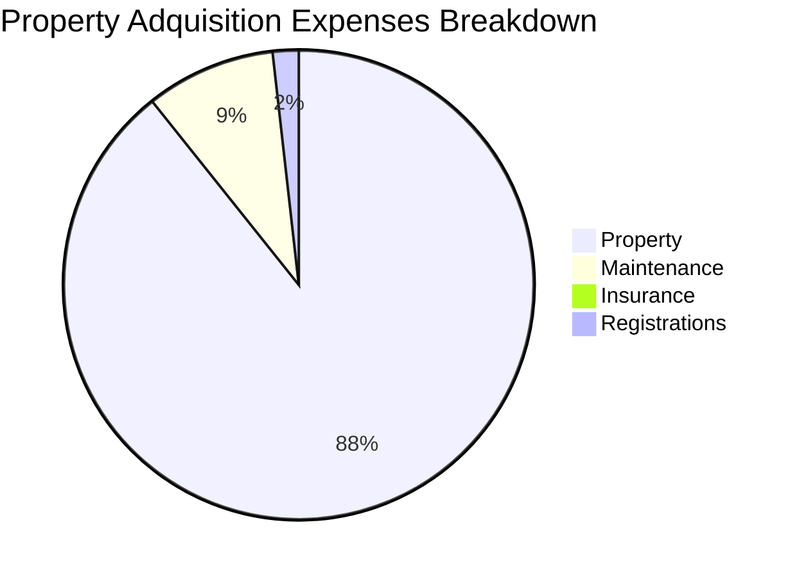

If you are getting a credit...

Before anything, understand how [French Amortization](https://jalcocert.github.io/JAlcocerT/python-real-estate-mortage-calculator/) works.

And maybe have a look to the properties around with some [RE AIgent](https://jalcocert.github.io/JAlcocerT/streamlit-is-cool/).

## Property Costs Analytics

A **gantt chart** is worth a zillion words:

### Spain

In Spain you could expect:

* 6% taxes + 3-5k notario + 0.5 to 1k/m2 repairs/setup

<!--  -->

---

## Conclusions

This project started as a test to see the costs of owning a house.

I got to know how quickly furniture costs can escalate: whats x1 can be x4

Id say you have to stay open for ideas: not only IKEA, but maybe sklum or others...

And in the meantime I thought on how to estimate the painting cost, given a house plan.

### Estimating painting costs with AI

Those are **gross yields**, remember that there are many costs, amortizations,... related that you will have to plug for your specific case.

Lets say that it cost **~65eur afor 15kg of paint.**

With that one, you can paint ~100m2.



How to estimate the wall size in your flat based on the floor plan and the total area.

**Understanding the Challenge**

We only have the area of each room, not the exact dimensions (length and width). To estimate wall length, we'll need to make some assumptions about the shape of the rooms.

**Assumptions**

1. **Rectangular Rooms:** We'll assume all rooms are roughly rectangular. This is a common assumption for floor plans.
2. **Simplified Shapes:** We'll treat the overall shape of the flat as a rectangle for easier calculation.

**Estimation Process**

1. **Calculate the Perimeter of Each Room:**
   * For a rectangle, the perimeter is 2 * (length + width).
   * Since we only have the area, we'll need to estimate the length and width. We can do this by assuming the rooms are close to square for an initial estimate.
   * For example, for a room with 26.4 m², assuming it's square, each side would be approximately √26.4 ≈ 5.14 meters. The perimeter would be roughly 4 * 5.14 ≈ 20.56 meters.

2. **Sum the Perimeters:** Add up the estimated perimeters of all the rooms.

3. **Adjust for Shared Walls:** The sum of the perimeters will overcount the walls because it counts each wall twice (once for each room it borders). We need to subtract the length of the shared walls.

4. **Estimate Shared Walls:**
   * Look at the floor plan and estimate which walls are shared between rooms.
   * Make reasonable estimations of the length of these shared walls.

5. **Subtract Shared Wall Lengths:** Subtract the estimated total length of shared walls from the sum of the perimeters.

**Let's Do the Calculations (Rough Estimate)**

1. **Room Perimeters (Approximations):**
   * Pokój dzienny (26.4 m²): ≈ 20.56 m
   * Pokój (9.2 m²): ≈ 12.12 m
   * Łazienka (4.4 m²): ≈ 8.37 m
   * Kuchnia (6.4 m²): ≈ 10.12 m
   * Przedpokój (7 m²): ≈ 10.58 m
   * Loggia (2.6 m²): ≈ 6.44 m

2. **Sum of Perimeters:** 20.56 + 12.12 + 8.37 + 10.12 + 10.58 + 6.44 ≈ 68.19 meters

3. **Estimate Shared Walls:**
   * Looking at the floor plan, there are several shared walls. We need to estimate their lengths.
   * This is where it gets tricky without exact dimensions. Let's make a rough guess that the total length of shared walls is about 20 meters (this is just an estimation).

4. **Subtract Shared Walls:** 68.19 - 20 ≈ 48.19 meters

**Important Note:** This is a rough estimation. Without precise dimensions, it's impossible to get an exact wall length.

**Refining the Estimate**

To improve the estimate, you would need:

* **More Detailed Dimensions:** If you have the length and width of each room, the calculations would be much more accurate.
* **Wall Thickness:** We haven't accounted for wall thickness, which would add to the overall length.

---

Be knowing the area (55m2 for example), you already know the **ceiling paint**.

Or you can just estimate the internal walls with sqrt(area=55) = 7.7

So that would be 15m, times the height of the walls (say 2m), which would be 30 m2.

But you are missing all internal walls which make the rooms, say thats 100% more.



> First estimation ~ 55+30*2 = 115m2, which for **2 layers** would be ~30kg

### Cool Stuff

Some people are building their custom and modular houses.

And there are others, which are shipping their concepts to others.

> Delivering a home...like a container? With all the features agreed upon? Interesting!

I can imagine DIY home owners have a sense of priorities like any other.

Like...should you get those **adidas GN3530** you like?

Or are you fine with the ones you were so excited to buy few months ago?

---

## FAQ

There are interesting **pre-made** solutions: zrobim,...

* https://forocoches.com/foro/showthread.php?t=6810398&page=12