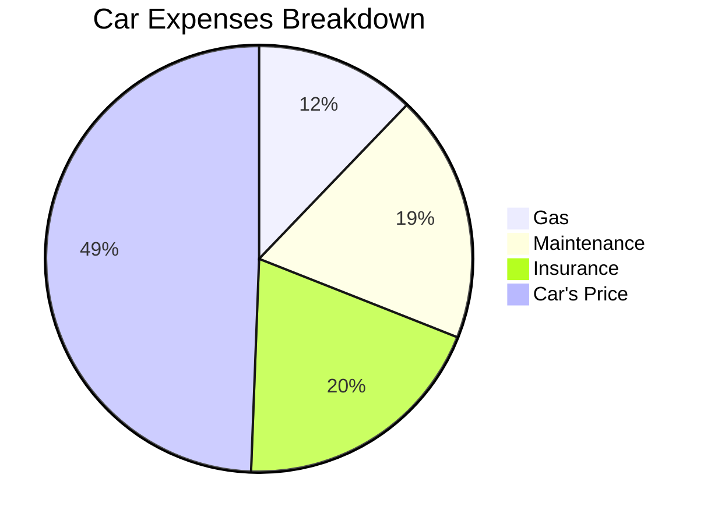

If you are getting a credit...

Before anything, understand how [French Amortization](https://jalcocert.github.io/JAlcocerT/python-real-estate-mortage-calculator/) works.

And maybe have a look to the properties around with some [RE AIgent](https://jalcocert.github.io/JAlcocerT/streamlit-is-cool/).

## Property Costs Analytics

### Spain

In Spain you could expect:

* 6% taxes + 3-5k notario + 0.5 to 1k/m2 repairs/setup

---

## Cool Stuff

Some people are building their custom and modular houses.

And there are others, which are shipping their concepts to others.

> Delivering a home...like a container? With all the features agreed upon? Interesting!

I can imagine DIY home owners have a sense of priorities like any other.

Like...should you get those **adidas GN3530** you like?

Or are you fine with the ones you were so excited to buy few months ago?

---

## FAQ

There are interesting **pre-made** solutions: zrobim,...

* https://forocoches.com/foro/showthread.php?t=6810398&page=12