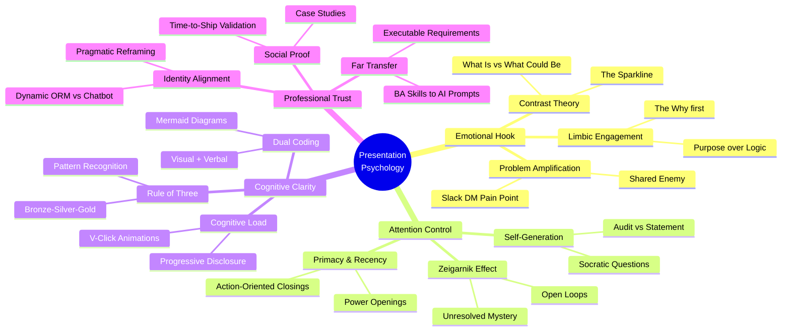
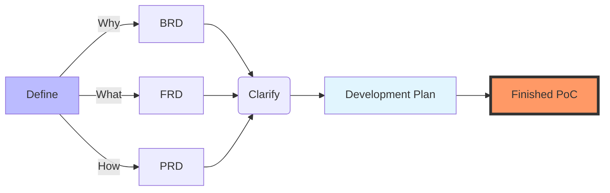

**Tl;DR**

Thoughts after this theo video, shipping a micro-saas in front of people and doing some tech talks.

**Intro**

Everything can be done with code and llms/agents are pretty good with that.

So...why arent we.

Product, how's and features matter.

But so that's the packaging.

The UI/X, the presentation, the how easily is to understand what you do or you dont do.

Lets get better and close the gap.

## Some Context

One more time, a series of ~~un~~connected ~~chaotic~~ events.

And some questions: *that thing that happens when you create*

1. What are my products missing?
2. *If the features are so great*, why dont people want them?
3. How could my tech talk generate more engagement?


  
  


{}

### Tech Stack is Clear

This simply works.

Try and see.

A recommendation after vibe coding few *sample projects*.

Follow the approach: `brd.md` - clarifications - dev plan *with out of scope features*

Core Framework: Astro 5.0 as the foundational engine for this project.

- **Why?** It follows a "Zero JS by default" philosophy, shipping the absolute minimum amount of JavaScript to the browser.
- **Islands Architecture:** Interactive components (like the qualification modal) are "islands" of React that load only when needed, while the rest of the page remains static HTML.
- **Vite-Powered:** Lightning-fast development and build times.

Styling: Tailwind CSS v4

**Tailwind CSS** provides a utility-first approach to styling.
- **Modern Engine:** Version 4 uses a CSS-first configuration, making it faster and more predictable.
- **Glassmorphism:** Custom utilities in `global.css` enable the premium "glass" effects used throughout the UI.
- **Dark Theme:** Configured with `oklch` color tokens for consistent, vibrant colors across the dark spectrum.

UI Logic: React & Framer Motion

While the page is static, the complex logic and animations use React.

- **Framer Motion:** Used for the staggered entrance animations and smooth transitions between qualification steps.
- **Spring Physics:** Animations use spring-based transitions (stiffness/damping) instead of linear durations to feel more organic and "premium."

| Requirement | Specification | Clarification / Decision |
| :--- | :--- | :--- |
| **Frontend Framework** | React (Astro/Vite) | Chosen for low latency and modern "Island" architecture. |
| **Styling/UI Library** | Tailwind CSS v4 + Framer Motion | Custom "Deep Night" glassmorphism theme for a premium look. |
| **Deployment** | Docker | Containerized deployment for easy scaling and isolation. |


### After Shipping

The tech stack just works.

But does somebody even care?

When you bring [eyes to your saas](https://jalcocert.github.io/JAlcocerT/bring-eyes-to-your-saas/)

You might realize that [it needs *some* improvements](https://jalcocert.github.io/JAlcocerT/iterating-and-improving-a-micro-saas/).

### Psyco

If you have ever [wondered about psychology](https://jalcocert.github.io/JAlcocerT/psychology-skills-data-analytics/).

{}

So...wait.

To improve all that, I need to get **the psychologycal stack** at the same level than the technical one.

From the example of one of my last tech talks, here is what it came out: *mermaidjs powered [here](https://mermaid.live/edit#pako:eNpdVF1v20YQ_CuLeygS1HIVWR-xUBRQJDc1YMOs5TpAoJcTuaQWOt6ye0cnjOH_3qUcmVTfqNnb2bmZPT2blDM0c1OSz0pbbTyAMMd37xLBgD7aSOx_38pvfyShSXfsuGjev2-PAVyV3Fatg7-Y968YQCK8dVjCoqwc5ZQeGI5FgPXOCmZw5bFseqiz6R5Wt5BY8pAw-Xgs3lC5pVQbCltgiV0B4GGH8GXXQE4SenBSS8UBgZ9Q4IYLSo-1JfsoNsS2k6U5ZVpXVvaOPHbwl52NcB3gKbx-Lrl2GXz6eWIRo8rR273ysjs2fkUqrHjaw1WeY9qTdlehV0lchQ77x6vV7J7UldsmROx0rdHlg8_oUf5vIqctlMLfNYa21KNb1BnFVvFawzsxLBEqbdrAL3CPKfq0d_-Ev6lXrTryRZ8sbdkHd0LKowKXjkN3YsmFp0hPqLgVim-Eq1qXYsmZHu24Him08K_wiLK1rivcopSWMliRLcSWb-Pva6ch5hqOYC-UxKrv4ttLvM7vO_NJ2P_AwZrUTxl8Zpd12R_F3rDNenTChQYQ2sqKQqo3rKU37nGwdKTLufDqXs9r7cvbtsMDeJC628DrrF2L2MDCUeFPVzYRW5SH6O4x18ueOLRqvCIp3N3ftgEudeW2_NasoZOO0rmcdz1Lq5u-jho69nJ7oBIHkQfrHVXwaB1lJxv0pxWVbH3IUXreLWC9J-cCRIbFdTuprGKP9eo7pnW0-rxV_b81yWG9gjkzhVBm5lFqPDPla5z6p_Lctm5M3Om5jZnrZ4a5rV3cmI1_0bbK-q_M5bFTuC52Zp5bF_RXXalo_LkUb6igz1D0Ifpo5pPJ9EBi5s_mu5kPRqPx-XA6m8wuL6bD4WQ2mp2Zxsw_jCbnF5ez8XSildlw-vHi5cz8OAz-cD7-eDkejRSbDkfj8eXFy38FxZK0)*

As you can imagine, this goes as: `can we now have a community chat slack alert the date before alert and the 1h before?`





## Whats the catch?

You are missing parts.

### Improving your Presentations

0. Tinker & be willing to share
1. Mind the brand
2. Prepare the `slides.md`
3. Make a ppt-review
4. Prepare a mail communication
5. Prepare engaging slack/follow ups notifications

Why to do so?

because you improve your brand: *specially if you have the same repo for your consulting landing, that where you store the ppts*

```sh
#npx slidev build --base /presentations/ba-brd/ --out dist-ba-brd
npm run build
mkdir -p public/presentations && cp -r y2026-tech-talks/2-ba-brd-development/dist public/presentations/ba-brd
```


#### Improving your emails

Wondering why not many people are going to your tech talks?

You might need to improve how you coomunicate its value via email.

Get better at conveying what you will do via mail. Like [this](https://github.com/JAlcocerT/selfhosted-landing/blob/master/y2026-tech-talks/2-ba-brd-development/email.md).

#### Improving Slack Engagement

Got a centralized repo with your presentations as text?

There is no excuse not to write a psycologycal engaging email and/or [slack alert messages](https://github.com/JAlcocerT/selfhosted-landing/blob/master/y2026-tech-talks/langchain-postgres/z-tech-talk-advert.md) to get more people flowing to your funnel.

I mean: assisting to your tech talk.


### Improving your Products

Leave them be for a while to get volume/repetitions on their current state.

Done?

Ok, now lets tweak with some sense that it sgoing to move into a better direction.



#### The Copy

If you have be smart and make so that your full micro-SaaS copy is in one file, like: `copy.md`

You can have inmediate feedback from any LLM, like gemini on how **and why** you can tweak a certain title/cta/whatever.

#### Product emails

Want to increase LTV?

Make sure that your potential client remembers that you are there to help them.


---

## Conclusion

Im preparing an agentic workflow for those who are interested to close their gap ando **get their ideas succed**.

In the meantime, you can:


  
  


### Have you Plugged PostHog?

See how people really interact *and what they want* from you.


What they do.

Not what they say.

Now what you think.

---

## FAQ

