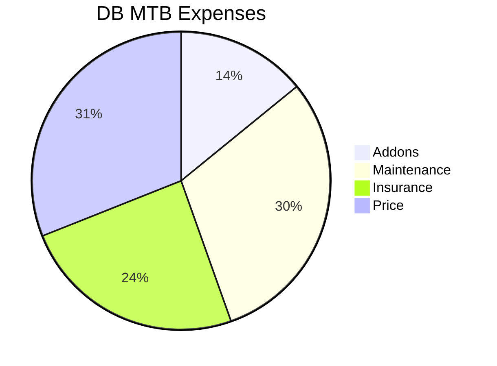

* https://github.com/atuinsh/atuin

> MIT | ✨ Magical shell history


**Cloudflare alternatives?**

* https://github.com/rapiz1/rathole

> A lightweight and high-performance reverse proxy for NAT traversal, written in Rust. An alternative to frp and ngrok.

* https://noted.lol/cgnat-and-rathole/

### SelfHosting Best Practices

* https://www.reddit.com/r/selfhosted/comments/1beoi4l/best_practices_for_selfhosted_services/
* https://www.reddit.com/r/homelab/wiki/index/

### What about NIX?

Recently I heard about Flox and NIX...

Are they the best alternative for a homelab OS?

Backend was hard.

In theory, it can be simplified with PB or with https://github.com/MotiaDev/motia

> MIT | Multi-Language Backend Framework that unifies APIs, background jobs, workflows, and AI Agents into a single core primitive with built-in observability and state management.


Serverless is the way.

And CF workers and pages  use cases are so cool: https://github.com/4ev-link/4ev.link

> If you want short custom urls, like url shortening to a custom slug

Same, we can also have monitor running in gihub https://github.com/upptime/upptime

> ⬆️ GitHub Actions uptime monitor & status page by @AnandChowdhary

> > You could also try with uptime kuma or kener


* https://tailscale.com/kb/1282/docker

Perplexity browser with agents

> This made me summarize my *old me* from <2023 posts. And those are pretty nice notes for thought.

* https://github.com/leoneljdias/tempo

> MIT |  Self-hosted weather API based on ECMWF data, serving colorized WebP maps and GeoJSON contours for easy integration with MapLibre, Leaflet, OpenLayers, and other GIS platforms 

software product development, digital platform engineering,

https://nav.al/feedback


https://free-for.dev/#/

https://freestuff.dev/alternative/clerk/


**Intro**

This year is been like a lot of [do](https://nav.al/do)


It looks so long back when I used `you.com` to help me with work.

And with no doubt, 2025 has been the year of agents. I mean...

Comercial ones like: `https://www.lindy.ai/pricing`

* https://github.com/browser-use/browser-use

>  🌐 Make websites accessible for AI agents. Automate tasks online with ease. 

See also:

1. LangChain Web Scrapping

2. Browserless

* https://github.com/browserless/browserless

>  Deploy headless browsers in Docker. Run on our cloud or bring your own. Free for non-commercial uses. 

summary: 'Crawl4AI is an open-source web crawler and scrapper tailored for LLMs and AI applications. It offers asynchronous crawling, data extraction, and various features for enhanced performance and scalability.'

* https://github.com/saifyxpro/HeadlessX

> MIT |  A lightweight, self-hosted headless browser automation platform. Designed as an alternative to Browserless, built for speed, privacy, and scalability. 

https://www.youtube.com/watch?v=L2Ya9PYNns8



After [Weather Planning](https://jalcocert.github.io/JAlcocerT/trip-planner-with-weather/), there are also the **financial aspects of travelling**


* https://echarts.apache.org/en/index.html


https://astro.build/themes/details/photography-portfolio-template/


* https://github.com/OpenInterpreter/open-interpreter

> A natural language interface for computers 




**From last year...**

1. Get few more websites going for close people ✅ 
2. Leveraging on AI ✅ *Using Windsurf and Cursor*
3. Doing less in total and more of what has a real impact


Reading: *excuse alert, this is beeen a year mor of creating than consuming*

And that makes...xyz/12 books.


And im able to create a serverless landing ebook page and podcast.

The lean startup
Company of one!





## Better Tech Stack

Because Im still in D&A and trying to blend with AI powered development for my personal projects.


1. [uv](https://jalcocert.github.io/JAlcocerT/fast-api/#proper-py-and-uv) package manager ❤️ Makefiles >>> Readme's & pip! 

2. Pocketbase for BaaS, and a much better understanding of authentication/authorization.



The key difference between PocketBase and a framework like FastAPI is the level of abstraction and the amount of manual coding required. 

PocketBase is a backend-as-a-service that handles the entire process for you, whereas FastAPI requires you to code each step.

Here is the combined explanation, comparing the authentication flow for both platforms, assuming your frontend is built with Astro.

1. Client Sends Credentials

The user enters their credentials on your login page. The Astro frontend sends a request to your backend.

  * **PocketBase**: The Astro frontend, using the PocketBase JavaScript SDK, makes a single, simple API call. The SDK abstracts the underlying `fetch` request, handling the correct endpoint and request body.
    ```javascript
    // Astro component with JS
    await pb.collection('users').authWithPassword(email, password);
    ```
  * **FastAPI**: Your Astro frontend must manually make a `fetch` request to your custom login endpoint. You are responsible for constructing the URL, body, and headers.
    ```javascript
    // Astro component with JS
    await fetch('http://127.0.0.1:8000/token', {
      method: 'POST',
      body: `username=${username}&password=${password}`
    });
    ```

2. Server Validates Credentials

The backend receives the request and verifies the credentials.

  * **PocketBase**: This step is entirely handled by PocketBase's core logic. The server automatically hashes the provided password and compares it to the hash stored in the `users` collection.
  * **FastAPI**: You must write the code to handle this logic. Using libraries like `passlib` for password hashing and an ORM like `SQLAlchemy` to query your SQLite database, your FastAPI endpoint would:
      * Query the database for the user by username.
      * Retrieve the stored hashed password.
      * Compare the user-provided password with the stored hash.


3. Server Issues the JWT

If the credentials are valid, the server creates and sends a **JWT bearer token** to the client.

  * **PocketBase**: PocketBase automatically generates a **JWT bearer token** with the user's information and a default expiration time. It returns this token in the API response without any manual coding.
  * **FastAPI**: You must manually generate the JWT. Using a library like `python-jose`, your endpoint would:
      * Create a payload with the user's ID and an expiration time.
      * Sign the payload with a secret key using an algorithm like **HS256**.
      * Return the generated token in the JSON response.

4. Client Stores and Uses the Token

The client-side code receives the token and uses it for future requests to protected endpoints.

  * **PocketBase**: The PocketBase SDK automatically stores the received token for you in local storage. For all subsequent requests, the SDK automatically includes the token in the `Authorization` header.
  * **FastAPI**: Your frontend code must manually parse the JSON response, save the token to local storage, and then retrieve it for every `fetch` request to a protected endpoint, manually adding it to the `Authorization` header.

5. Server Validates the Token and Authorizes Access

The backend validates the token and decides whether to grant access to the protected content.

  * **PocketBase**: This is handled automatically. When a request with a bearer token hits a protected collection endpoint, PocketBase automatically validates the token's signature, checks its expiration, and authorizes access based on the **API rules** you've set up in the admin dashboard.
  * **FastAPI**: You must write a **dependency** function that extracts the token from the header, validates it, and handles errors. You then add this dependency to every protected route.

In summary, PocketBase provides a high-level SDK that abstracts the entire process, making it a fast and convenient backend solution.

FastAPI gives you complete control and flexibility but requires you to build the authentication system yourself using third-party libraries and custom code.



> Its all about [encryption and SHA256](https://jalcocert.github.io/JAlcocerT/encryption-101/#bearer-vs-jwt) under the hood!



You can use Cloudflare Workers to act as a **reverse proxy** or a **smart router** that forwards requests to your PocketBase home server.

This is a common and highly effective pattern for self-hosting applications.

**The Role of Cloudflare Workers**

A Cloudflare Worker is a serverless function that runs on Cloudflare's global network, very close to your users.

It can intercept incoming traffic and perform logic on it before forwarding the request to your actual server.

When a user tries to access your app's domain, the request goes to the Cloudflare network first, not directly to your home server.

**The Authentication Flow with Workers**

1.  **Client Sends Credentials**: Your Astro frontend sends a request to your custom domain (e.g., `api.yourdomain.com`). This request hits the Cloudflare network.

2.  **Worker Intercepts Request**: Your Cloudflare Worker intercepts the request. Its code's primary job is to act as a **proxy**. It takes the incoming request and forwards it to your PocketBase server running on your home network. It adds the necessary headers and makes sure the connection is secure.

3.  **PocketBase Handles Authentication**: The request reaches your home server. PocketBase handles all the authentication logic as described previously: it validates the credentials, generates the JWT, and sends it back to the Worker.

4.  **Worker Forwards Response**: The Worker receives the response from your PocketBase server and sends it back to the client.

By using Cloudflare Workers and a service like **Cloudflare Tunnel**, you can expose your local PocketBase server to the internet without opening any ports on your home router.

Cloudflare Tunnel creates a secure outbound connection from your home server to the Cloudflare network, making your server accessible without exposing its IP address or creating security risks.

This is the **best practice** for self-hosting applications.



3. Understanding that [with CSR we can](https://jalcocert.github.io/JAlcocerT/csr-and-js/) keep WebApps simple, yet providing interactivity via API where needed




Cloudflare Workers are **not a must**, but they are a very popular and recommended option for this setup. 

Your Astro site, once deployed to Cloudflare Pages, will be able to directly make API calls to your self-hosted PocketBase server.

Here's how this works and what changes in different scenarios.

**Cloudflare Pages and a Self-Hosted PocketBase**

When you deploy your Astro site to Cloudflare Pages, the static files are served globally from Cloudflare's CDN.

 However, your PocketBase server is still running on your home machine.

The key to connecting them is to make your PocketBase server accessible via a public URL. 

The easiest and most secure way to do this without a Worker is using **Cloudflare Tunnel**.

1.  **Cloudflare Tunnel**: You install the `cloudflared` daemon on your home server. This creates a secure, outbound connection (a "tunnel") to the Cloudflare network.
2.  **Public URL**: You configure the tunnel to route requests from a public domain (e.g., `api.yourdomain.com`) to your PocketBase server (e.g., `localhost:8090`).
3.  **Direct API Calls**: Your Astro site, deployed on Cloudflare Pages, will then make direct API calls to `https://api.yourdomain.com`. These requests travel securely through the Cloudflare network to your home server.

> In this scenario, Cloudflare Workers are not necessary for the authentication flow itself, as the requests are just being routed.

**If You're Self-Hosting the Astro Static Site**

If you self-host both the Astro static site and the PocketBase server, the process becomes even simpler.

Both services are running on the same machine, so you don't need a public tunnel or a Worker. The Astro frontend can make API calls to PocketBase using a **local URL** like `http://localhost:8090` or `http://127.0.0.1:8090`.

You would then use a web server like **Caddy** or **Nginx** to act as a reverse proxy. This single server would:

* Serve the Astro static files to the public.
* Proxy API requests from your Astro site to the PocketBase backend, all on the same machine.
* Handle HTTPS and other security concerns for both services.

This setup is the most straightforward for self-hosting but lacks the global performance benefits and DDoS protection that Cloudflare's network provides.

**Why You Might Still Use a Cloudflare Worker**

Even with Cloudflare Tunnel, you might still want to use a Cloudflare Worker for more advanced scenarios, such as:

* **Caching**: To cache API responses from your PocketBase server to improve performance and reduce the load on your home server.
* **Security**: To add an extra layer of security, like rate-limiting API requests or adding custom authentication checks before requests even reach your server.
* **Request Manipulation**: To modify incoming or outgoing requests and responses, for example, to hide your PocketBase URL or transform data.



4. I even got time to clean the IoT/MQTT with micro-controllers :)



  


5. And tinker a bit with [Crypto](https://jalcocert.github.io/JAlcocerT/understading-crypto-with-ai) and data via [stonks](https://jalcocert.github.io/JAlcocerT/stonks/) / [stocks with python](https://jalcocert.github.io/JAlcocerT/python-stocks-webapp/).



> A recap on [BlockChain](https://simplyexplained.com/videos/how-does-a-blockchain-work/)

With KYC both: Binance and Kraken worked fine to me.

> > No keys, no coins - Make sure you understand how wallets work. 

```sh
flatpak install flathub org.electrum.electrum #BTC

flatpak install flathub org.featherwallet.Feather #Monero
#flatpak install flathub org.getmonero.Monero
```

In case you didnt know - If you get a Metamask wallet for Ethereum, you can make [a Web3](https://jalcocert.github.io/JAlcocerT/guide-web3/) and publish via [ENS (what) instead of the DNS (where)](https://jalcocert.github.io/JAlcocerT/guide-web3/#ens-vs-unstoppable-domains).

Also, DeFi and protocols like UniSwap (v4) gave me a lot to think about:




If the drawdown if the [~20/30% MDD volatility](https://jalcocert.github.io/JAlcocerT/stonks/#what-is-maximum-drawdown-mdd) for stocks and tradfi, you better get away of the crypto space.

6. On the server/homelab side of the things...






7. Im still in [D&A](#da-tech-stack) and have take time to sharpen my big data knowledge.

8. Better git *patterns and branching strategies*. Bc the current (and only) reality is main.

9. CLI Agents ftw. Codex CLI was huge. But I also tried claude and geminiCLI. Together with BAML bringing type safe LLM calls.

10. Thanks to authentication I got to know the difference between: WHO someone is and what someone can DO 🤯


> Getting to work Traefik+Tiny Auth has been amazing, and social auth for SaaS is quick and great


{}

Both a JWT bearer token and an API key can be used to authenticate against APIs and other services, but they work differently and offer varying security and flexibility. 

OAuth is a broader protocol for secure, delegated access and is often paired with JWT as the format for its access tokens.

- **API Key**:  
  - Simple method; a unique key is sent in requests to identify and authenticate the client.
  - Good for basic server-to-server scenarios, but offers limited security and control.[1][5]

- **JWT (JSON Web Token) Bearer Token**:  
  - A signed, encoded token conveying user identity and claims.
  - Used for stateless authentication; APIs verify the token’s signature without needing to consult a centralized database every time.
  - Efficient for distributed systems and microservices; commonly used in modern APIs.[5][1]

- **OAuth 2.0**:  
  - An authorization protocol that allows users to grant third-party applications delegated access to their data.
  - Handles complex permission scopes, third-party integrations, and user consent.
  - Often uses JWT tokens as the format for access tokens.
  - Strong security and control, but more complex to set up and manage, and better for scenarios requiring delegated access or SSO.[4][1][5]

Which Is Better?

- **API Key**: Best for simple authentication between trusted services, low-security or internal APIs.[1]
- **JWT**: Excellent for stateless authentication in scalable microservices; fast and efficient but lacks revocation and fine-grained permissions.[5][1]
- **OAuth (with JWT tokens)**: Ideal for complex scenarios requiring delegated authorization, third-party integrations, and robust security. Preferred for external/public APIs, especially those involving user data or multi-step permissions.[4][1][5]

**OAuth2.0 often uses JWT tokens as part of its workflow**, leveraging the strengths of both approaches for secure, scalable authentication and authorization.

For APIs exposed to external clients, OAuth is generally considered more secure and flexible. For internal use or single-service authentication, JWT and API keys are simpler.


{}


> Notice also (as per **ENS** and DNS), that **what something is** has nothing to do with where something is.

> > And BRD PRD FRD are the why what how

11. From SliDevJS for ppts, to realize that pandoc, latex or Typst allow us to create pixel perfect ebooks, newsletters... 

12. Astro Themes never stop surprising me. Embed ppts inside of them, get n8n chatbots or cal/whatsap boubles...


## Entrepreneuring

I feel (literally) like in the backstraight of a circuit after having couple of laps to recognize my breaking/aceleration points.

And...



| Feature | **Large Corporation ** | **Indie Hacker / Small Team** |
| :--- | :--- | :--- |
| **Primary Business Model** | High Volume, Low Margin | High Margin, Low Volume / Niche Focus |
| **Typical Annual Revenue** | Billions of dollars | Thousands to millions of dollars |
| **Typical Net Profit Margin** | Very low (e.g., 2-3%) | Very high (e.g., 60-90%) |
| **Total Net Profit** | Billions of dollars (small % of a massive number) | Thousands to millions of dollars (large % of a small number) |
| **Primary Driver of Revenue** | Economies of scale, supply chain efficiency, mass-market appeal | Solving a niche problem, specialized product/service |
| **Role of Meetings** | High volume of meetings, often unproductive and a major source of inefficiency | Minimal or no meetings; communication is lean and asynchronous |
| **Impact on Operations** | Bureaucracy, slow decision-making, siloed departments, high overhead | Agile, direct feedback loops, flat structure, low overhead |
| **Time-to-Market** | Slow, due to multiple approval layers and corporate red tape | Fast and agile, able to pivot and iterate quickly |
| **Competition Strategy** | Compete on price, leverage scale and brand recognition | Compete on quality, specialization, and customer intimacy |
| **Core Advantage** | The ability to execute on a massive scale with immense resources | The ability to move fast, stay lean, and achieve high profitability per unit of work |
| **Related Tags** | **Bureaucracy**, **Wasted Time**, **Decision-Making Bottlenecks**, Silos, High Overhead | **Lean**, **Direct Feedback**, **Deep Work**, High Profitability, Low Overhead |

> Non biased table ofc... Lets give a point: *Large corporations can assemble huge, specialized teams to address highly complex, multi-faceted problems. For example, building a new semiconductor factory*

> > But, just multiply the person*hour*100$/h of all the [meetings](https://jalcocert.github.io/JAlcocerT/effective-meetings-data-analytics/) you've been this year. Crazy.



I mean...*Im almost there*

Now im aware of the **,business / product management trilema'**: *price vs customization vs performance/looks*




The trade-off you've described—Price vs. Customization vs. Performance/Looks—is a classic business and product management trilemma.

While it's not a formally named "entrepreneur's trilemma" in the same way as the "Project Management Triangle" (Time, Cost, Scope), it's a very real and fundamental set of choices that every entrepreneur and business owner has to make.

1. **You can't have it all.** The core idea of a trilemma is that you can't simultaneously maximize all three points of the triangle. To excel in one area, you will almost certainly have to compromise on one or both of the others.

2. **It defines your market position.** The way you prioritize these three factors determines your business model, target audience, and competitive strategy.
  
* **High Performance/Looks + High Customization + High Price:** This is the strategy for a luxury brand. Think of a custom-built sports car, bespoke clothing, or a high-end designer. You offer the best in quality and exclusivity, but it comes at a premium.

* **High Performance/Looks + Low Price + Low Customization:** This is the strategy of a mass-market, high-quality brand. Think of a popular smartphone manufacturer or a successful fashion brand. You offer a great-looking product that performs well, but you have to standardize it to keep costs down and sell at a lower price.

* **High Customization + Low Price + Lower Performance/Looks:** This is the strategy for businesses that cater to specific needs at an affordable price. Think of a local, family-run business that builds furniture to a customer's exact specifications, but might not have the high-tech machinery of a large factory. The product is unique and affordable, but perhaps not the sleekest or most durable on the market.

> This concept is closely related to the well-known "Good, Fast, Cheap" trilemma in [project management](https://jalcocert.github.io/JAlcocerT/selfhosting-pm-tools-docker/).

In that model, "Good" aligns with performance/looks and quality, "Fast" aligns with time to market, and "Cheap" aligns with price/cost.

The product-focused trade-offs you've outlined are an excellent way for an entrepreneur to **think about value proposition** and what they are truly offering to customers. 

It helps clarify what to build, who to sell it to, and what compromises are acceptable to achieve their vision.




And as the start is been a very hard part, Ive been trying to motivate people around me to jumpstart with their ideas.

That's why I concluded, that to make the world better, I could help individual people get started easier/quicker with their own projects.

What do we need to get started?

1. An idea: *each will have their vision and own execution plan*
2. A way to [make invoices with F/OSS](https://fossengineer.com/open-source-invoice-creator/): thanks to [FE/CSR](https://jalcocert.github.io/JAlcocerT/front-end-and-auth/#fe-can-do-a-lot) and the static beauty of [serverless-invoices](https://github.com/JAlcocerT/Home-Lab/tree/main/serverless-invoices)
3. A way for people to know about their services: *Contact forms (QR), waiting lists (like the one of astro-nomy theme) and business cards...*

Thats why I thought and do alot around [this web platform for creators](#launching-webifyer).


### Shipping Products


This year, It's been more building than shipping.

If you are successful, you will need to know [how to use Stripe API](https://jalcocert.github.io/JAlcocerT/using-stripe-with-flask/#stripe) and any form of invoicing customers:

#### Launching Webifyer

One of the skills I enjoy learning more is about photography.

And one of the of the best decisions I ever had, was to have a [Photo Blog](https://jalcocert.github.io/JAlcocerT/websites-themes-2024/).

> Now, you can also tell your story

Check how, *if you are passionate about Photography*

What is this all about?

Web templates (SSG'ed) connected to CMS's.

Because Selfhosting Static Generated Sites, is not a secret anymore:


  
  



But, time is money.

And you are loosing both without a proper website.

#### Leads and Offers

Linktree does things very well, yet cant compete with:

1. Domain 1sty free with CC required (This is a potential CAC)
2. abcd

Some people have been contacting me via EE registry `https://ariregister.rik.ee/eng/company/`

> Was wondering how were some EE business owner able to get my email?

> > They are getting kind of qualified leads (from users like me, who never actually subscribed...GDPR anyone?)

## Interesting Concepts

Concepts / ideas that I found during this year.

1. CYA (cover your ***) was always a thing. 

But [BRD/PRD/FRD](https://jalcocert.github.io/JAlcocerT/brd-vs-frd-for-data-analytics/) just takes it to the next level if you in PM/BA roles.

2. Its 2025 and now everyones says that it wants AI / [AI|BI](https://jalcocert.github.io/JAlcocerT/ai-bi-tools/) / AIOps / whatever. When it really needs [good'old ML](https://jalcocert.github.io/JAlcocerT/machine-learning-data-analytics/)

3. Declarative vs Procedural

* **Declarative Knowledge (Knowing *What*):** This is factual knowledge. It's about concepts, theories, principles, facts, definitions, and data. It's the "what" and "why" behind things.
    * *Examples:* Knowing the syntax of a programming language, understanding the principles of agile methodology, knowing the capital of France, recalling historical dates, understanding different economic theories.
* **Procedural Knowledge (Knowing *How*):** This is knowledge of how to perform a task or sequence of actions. It's the "how-to." It often involves skills, techniques, processes, and strategies.
    * *Examples:* Writing code in a programming language, facilitating a Scrum meeting, riding a bicycle, cooking a recipe, debugging software, performing a surgical procedure.

4. The woman in the red dress - Matrix

<!-- https://www.youtube.com/watch?v=YgJ5ZEn67tk -->


An example? 

Could [the aissistant](https://github.com/JAlcocerT/Streamlit-AIssistant/tree/main) *from autumn 2024* have any additional feature?

Just not to *leave money on the table*?

> A person cant solve all problems (even less at the same time).

5. System > Goals

Which for me relates with: *More important than the willingness to win, is the willingnes to prepare.*

How would we reach our goals if we do nothing the move our current state closer to it? ah?

Kind of resonates with [process](#processes) > result.

> Systems *(designed for the worst days)* do not really on willpower / motivation

5. Quotes

> One place, not all over the place.

> *What are you afraid of loosing if you wont take any with you?*

> What worries you, **masters you**

> *Punishment fades but reward stayes*

> Freedom of the press is guaranteed only to those who own one. [From Ghost CEO](https://john.onolan.org/12/), who [launched 12y ago](https://www.kickstarter.com/projects/johnonolan/ghost-just-a-blogging-platform?ref=john.onolan.org).

> Data will say everything if we torture it long Enough. ~ [ML](https://jalcocert.github.io/JAlcocerT/machine-learning-data-analytics/) and Overfitting

> More important of the willingness to succeed is the willingness to prepare. ~ Do, do do, results *might* go later.

6. Guesstimates and [PostMortems](https://fernandocejas.com/blog/culture/2020-06-21-learn-out-of-mistakes-postmortems/)

7. Business/SaaS KPIs: CAC, EBITDA, LTV, NRR, MRR/ARR...

8. Mental **Obesity**. Which relates with bikeshedding and the [enless student syndrome](https://youtu.be/QFH-_exyNoo?si=yToM8KSBbT0V5xG3)

> Mental obesity (information vs execution) ig post

From the podcast: How to grow from doing hard things ( Huberman Lab x  Michael Easter) https://open.spotify.com/episode/6EDcPmRd6HHh2zdDnapEFS

9. Time is the currency of life

10. Authenticity is how you behave when you have no risk of punishment

11. Some *unrelated* blog & posts:

* https://kerkour.com/writing-against-the-global-lobotomy
* https://levels.io/happiness/
* https://nav.al/existence
* Are we living in auto-pilot? On a [passive live](https://quiethabits.net/stop-living-a-passive-life) topic https://quiethabits.net/year-of-change-2020-a-year-of-maintenance

12. Cool tinkering / tech posts

13. The difference between doing nothing with **intent** to do nothing

14. People call now *moonlighting* to the classical side-hustles. Or so [it seems](https://engagedly.com/blog/moonlighting-and-how-to-deal-with-moonlighting-employees/).



* https://blog.cavelab.dev/2021/11/wifi-relays-for-ventilation/




## Processes

From Last [year 2024](https://jalcocert.github.io/JAlcocerT/this-year-was-crazy/#next-year)...


  
  


- [x] [Better Webs](#more-websites)
- [x] Better AI APIs Usage: APIFY, ElevenLabs, scrapping APIs...
- [ ] Review all previous posts and see that are no commented / incomplete sections


  


- [x] [x24 Tech Videos](#creating-tech-videos)

I also tried [this](https://www.youtube.com/@UnfoldingData/shorts) and [this](https://www.youtube.com/@BeyondAJourney)

### Creating Tech Videos

Last year I set this as a goal.

What exactly were those **x24 tech videos** to make AI, automation and D&A more accesible: [x]

Along the way, Ive made my life easier by based the video content on a **simpler NEW repo**: https://github.com/JAlcocerT/Home-Lab 

1. [Cloudflare Tunnels](https://www.youtube.com/watch?v=k75PviBQeA0)
2. [OpenAI API Tricks](https://www.youtube.com/watch?v=Yihsci3QcfI)
3. [Redash](https://www.youtube.com/watch?v=_0_Qk0Oleeo) (BI)
4. Apache [Superset](https://www.youtube.com/watch?v=4HUqYbknTOM) (BI)
5. [MinIO](https://www.youtube.com/watch?v=KzZ2zCvHhl0) object storage
6. [JHub](https://youtu.be/VEOyKhgat2Q)
7. [Metabase](https://youtu.be/eCplQYrvabk) (BI)
8. [Grafana](https://youtu.be/Uq5tZv6T3ko) (BI)
9. [N8N](https://youtu.be/v-gCNTI5kzE)
10. [SelfHosted Streamlit Apps](https://youtu.be/p7U24YSFrW4) *together with Pocketbase for auth with [such script](https://github.com/JAlcocerT/py-stonks/blob/main/hardcoded-auth-streamlit/st_auth_pb.py)*
11. SFTPGo vs FileBrowser
12. [FastAPI](https://youtu.be/YcCR8JUlhMo) + OpenAI Audio
13. Photoview
14. Immich
15. RGallery vs PiGallery
16. [Uptime Kuma](https://youtu.be/fxVNTffZC2U) for status pages
17. [selfhosted ebook landing](https://youtu.be/XEFpzEIEDFc) page with astro
18. Umami  for web analytics
19. [Home Assistant](https://youtu.be/8XUydWbwBjk)
20. [n8n + CF tunnels](https://youtu.be/v-gCNTI5kzE)
21. [Selfhosting FreshRSS](https://youtu.be/mDMGtMOx-Fk) + astro podcast website
22. [MQTT and DHT22 + Home Assistant](https://youtu.be/8XUydWbwBjk)
23. [Nextcloud and a Pi](https://youtu.be/x2eFFeRIyXg)
24. Ventoy. [Linux Lite vs Garuda RAM consumption](https://youtu.be/hTw9DBEksx4)
25. Bonus: [FreshRSS + AstroPod](https://youtu.be/mDMGtMOx-Fk)

> I had to make sure to create proper thumbnails to get some views

> > Canva and https://selfh.st/icons/ helped a lot [see repo](https://github.com/selfhst/icons?ref=selfh.st)

I need to think whats next, bc fast fast fast content seem to rule: https://www.youtube.com/watch?v=9yb4o2IwkqM

If this was too much content, you can always use a LLMs to summarize the YT Videos.

Like these ones: *or just use perplexity*

{}

* https://github.com/jkawamoto/mcp-youtube-transcript

* https://github.com/DevRico003/youtube_summarizer

> MIT | A modern Next.js-based tool for AI-powered YouTube video summarization. This application allows you to generate concise summaries of YouTube videos using different AI models, with support for multiple languages and summary styles.

* https://github.com/Milkshiift/YouTubeTLDR

> MIT | ⚡ A lightweight, self-hosted YouTube video summarizer with Gemini AI

{}

It was a year of a lot of applied AI...

and understanding many concepts, like langflow, [langgraph](https://github.com/von-development/awesome-LangGraph)


* https://platform.openai.com/docs/models
    * https://platform.openai.com/chat/edit?models=o1

The CLI agents have been a great part of this 2025:


  


> Additionally, I participated in *few* tech Talks

1. Using LangChain to chat with a DB
2. Real Estate RAG
3. Vibe Coding a WebApp to make SliDev PPTs BA friendly

#### Other Videos

1. AI Powered [shorts](https://jalcocert.github.io/JAlcocerT/photo-video-tinkering/#ai-powered-shorts)

The TTS capabilities from these were also useful:

* https://aistudio.google.com/generate-speech
* https://platform.openai.com/audio/realtime

> I also came to know: https://github.com/speaches-ai/speaches which is *the ollama for TTS*

2. [ChartJS](https://www.chartjs.org/docs/latest/charts/line.html) Powered Shorts

I also got to know about: https://echarts.apache.org/en/index.html

3. Python powered YT Shorts - `@UnfoldingData` (PyFinance related via Matplotlib Animations)
3. RemotionJS / Animation powered

### Travel

Combining Tech and Travel to get the most out of them:

* https://jalcocert.github.io/JAlcocerT/tech-for-a-trip/

### Note Taking

Is note taking a waste of time?

The time that you are writing notes / making your KB, you are not doing new things...

Is note taking just bike-shedding?

> I got to know about the concept during 2024

The power of notes. Without bikeshedding!


#### Dev Smart not Hard

Using AI to create more and better, in less time.

The so called, [vibe coding](https://jalcocert.github.io/JAlcocerT/vide-coding/).

With too many options: Repliit lovable [windsurf](https://windsurf.com/account/login) cursor bolt...

Even with: https://github.com/settings/copilot/features

> *El relato mata al dato* - Thats also true when looking for new project opportunities

1. Discovering uv as package manager and the power of makefile >>> readme.md code snippets was huge to me.
2. Git power: one action -> one commit + one branch -> one feature + main is the current AND ONLY reality

* See this for branching strategies: https://learn.microsoft.com/en-us/azure/devops/repos/git/git-branching-guidance?view=azure-devops

3. No Nested if's, try -> Error exit with message



  



https://jalcocert.github.io/JAlcocerT/nextjs-toast-ui-editor/


  



https://jalcocert.github.io/JAlcocerT/astro-journal-theme/



  



https://jalcocert.github.io/JAlcocerT/firebase-auth-101/


https://jalcocert.github.io/JAlcocerT/audio-recap/



  



https://jalcocert.github.io/JAlcocerT/making-flask-cms-for-ssg/#flask-x-pocketbase
https://jalcocert.github.io/JAlcocerT/making-flask-cms-for-ssg/#flaskcms-x-quick-auth


  
  



```sh
git clone git@github.com:JAlcocerT/real-estate-moi.git
cd real-estate-moi

make flaskcms-build
docker inspect moirealestate-flaskcms --format '{{json .NetworkSettings.Networks}}' | jq
```


https://jalcocert.github.io/JAlcocerT/cool-hugo-themes/



  



From a quick waiting list that can be swapped to a landing page, covered [here](https://jalcocert.github.io/JAlcocerT/how-to-create-a-waiting-list/)

* https://github.com/JAlcocerT/waiting-to-landing

```sh
git clone git@github.com:JAlcocerT/waiting-to-landing.git
cd waiting-to-landing

#make run-dev #will spin a waiting list connected to formbricks (see the .env vars)
MODE=LANDING make run-dev
```



  



From Streamlit PoCs, I mean streamlit financial MVP to Flask with ChartJS:



  
  



https://jalcocert.github.io/JAlcocerT/playwright-101/



  
  



https://jalcocert.github.io/JAlcocerT/web-apps-with-python/#streamlit


 


  



https://jalcocert.github.io/JAlcocerT/python-stocks-webapp/#the-charts


  
  




  
  



https://jalcocert.github.io/JAlcocerT/tinkering-with-reflex/
https://github.com/JAlcocerT/reflex-templates


The FlaskCMs / NextJS CMS i tried to built were similar to these OSS for Selfhosted Blogs

* https://github.com/ddoemonn/next-blog

> **MIT** | self-hosted blog platform built with next.js 


From all CMS that I tried on [this post](https://jalcocert.github.io/JAlcocerT/cms-for-static-websites/#frontmatter-cms), just frontmatter kept the simplicity I wanted.

But it does not bring the for all public admin UI.


Followed very closely by [Keystatic](https://jalcocert.github.io/JAlcocerT/cms-for-static-websites/#keystatic-cms)

When you deploy the static site, the `whateverdomain.com/keystatic` path will still be there:


> But you wont be able to make any changes, as the server (Typescrypt API) is NOT running.


##### AI Stuff

https://aistudio.google.com/prompts/new_chat

* https://github.com/browser-use/browser-use

> MIT |  🌐 Make websites accessible for AI agents. Automate tasks online with ease. 

**More Agents**

* https://github.com/agno-agi/agno

> MPL2 | Full-stack framework for building Multi-Agent Systems with memory, knowledge and reasoning.

* https://github.com/bytebot-ai/bytebot

>  Bytebot is a self-hosted AI desktop agent that automates computer tasks through natural language commands, operating within a containerized Linux desktop environment. 

You can make interesting conditional logic, like: *If scrap fails, send msg to telegram bot*

#### More Websites!

Other Websites Ive worked

**07/25 version**

* https://github.com/majesticooss/astros
  * https://github.com/majesticooss/astros/discussions/56
  * https://ioracing-iotechcrafts.web.app/blog/unleashing-the-power-of-tailwind-css/

But for the ones who actually see value on them.


Btw, the **pages speed insights**, can be done via **API**: *see [this .md](https://github.com/JAlcocerT/morita-web/blob/main/z-pagespeedinsight-101.md)*


Given the opportunity costs, something like: one time setup + pay less each consecutive year *if you stay quiet* could be interesting to improve client retention.

**From:**

* https://whilecyclingthere.web.app/
* https://cyclingthere.pages.dev/


  
  
  


Better photo galleries, specially thanks to these components/shortcodes recap.

Still, far from: https://antfu.me/posts/photos-page, speciially: https://antfu.me/photos

Logto had a cool post about how to vibe code a photo gallery app with built in auth:

* https://blog.logto.io/cursor-logto-auth/

And DO a way to deploy static sites: https://www.digitalocean.com/community/tutorials/ 
and how-to-deploy-a-static-website-to-the-cloud-with-digitalocean-app-platform


**To:**

* https://beyondajourney.pages.dev/


* https://financemotion.pages.dev/ 

I even created skeleton (and videos) for web oriented to podcasts and ebooks.

> Maybe you can become some with a very personal blog, like [Sivers](https://sive.rs/about)

Still im far from this one: https://newsletter.marclou.com/p/my-solopreneur-story-0-to-65k-month-in-2-years or https://mfyz.com/moved-blog-from-wordpress-to-astro/

And having nice astro directory pages would be amazing. Sth like: https://github.com/masterkram/minted-directory-astro, where you can easily plug some kind of DB/Sheet/Github repo readme's with particular front matter and get a website going.


#### Better Social Media

With better video workflow and Postiz for sharing.

### Improving the HomeLab

Ive had time to write few posts about making your selfhosting better.

Together with a better and more organized repository:


  
  

  
That one I want to keep it minimalistic and very simple to replicate.

* https://jalcocert.github.io/JAlcocerT/selfhosted-apps-06-2025/
* https://jalcocert.github.io/JAlcocerT/selfhosted-apps-spring-2025/

Ive been taking **inspiration from**:

Thanks to this sites, I get to know more cool apps:

1. https://openalternative.co/self-hosted

* https://github.com/piotrkulpinski/openalternative

> Which can be seen also as an **awsome Astro [project](https://github.com/piotrkulpinski/openalternative)!**

2. https://alternateoss.com/

3. https://youmightnotneed.co/

4. selfhst.st


---

## Conclusions

There was even time to make **[Data Analytics](#da-tech-stack) recaps** and create (not that much ship) [***better* SaaS products**](#shipping-products).




I havent measure these blog posts time creation.

But it must have been sth like:



  



### D&A Tech Stack

I needed to improve my data analytics stack.

Because agents are coming for [*our* jobs](https://jalcocert.github.io/JAlcocerT/when-to-apply-for-a-job/): `https://jobforagent.com/`. *The 1st job board for autonomous AI agents* 

Normally withing D&A, you will have a rol to understand `the what` and figure our `the how` to get there.

The closer you are to the product/leadership team, the closer you will/should see `the why`.


  
  





1. Data Storage 🗄️

This category compares the foundational storage layers of each stack. It's about where your raw data physically resides.

| Criterion | **HDFS** | **S3 / GCS** | **MinIO** |
| :--- | :--- | :--- | :--- |
| **Type** | Distributed File System | Cloud Object Store | Self-hosted Object Store |
| **Architecture** | Coupled Storage & Compute. Data is stored on the same nodes that process it. | Decoupled Storage & Compute. Storage and processing scale independently. | Decoupled Storage & Compute. Runs on your infrastructure but separates the two functions. |
| **Deployment** | On-premise or in the cloud (IaaS) requiring manual management. | Fully managed cloud service. | Self-hosted on-premise or in any cloud (IaaS). |
| **Scalability** | Scales horizontally by adding more servers to the cluster. | Virtually infinite scalability. You simply use as much as you need. | Horizontally scalable by adding more hardware to your cluster. |
| **Cost** | High initial hardware cost and ongoing operational overhead. | Pay-as-you-go based on storage volume and data access. | Low hardware cost (commodity servers) but high management overhead. |
| **Primary Use Case**| Legacy on-premise batch processing and big data analytics. | Modern cloud data lakes and object-based storage for any data type. | Building a private cloud data lake or avoiding cloud vendor lock-in. |


2. Data Transformation & Orchestration ⚙️

This table compares the tools that handle the "T" (transformation) and "E" (orchestration) parts of the ELT/ETL process.

| Criterion | **Dataform** | **dbt** | **PySpark** | **ADF** |
| :--- | :--- | :--- | :--- | :--- |
| **Core Function** | SQL-based transformation for BigQuery. | SQL-based transformation for any cloud warehouse. | Code-based (Python) distributed data processing. | Visual ETL/Orchestration. |
| **Orchestration** | Basic built-in scheduler. Best used with Cloud Composer. | Basic built-in scheduler. Best used with Airflow. | Requires a separate orchestrator like Airflow or a managed service like Dataproc. | Has a robust, built-in orchestrator with a GUI. |
| **Primary Language**| SQLX (Superset of SQL). | SQL (with Jinja). | Python (with Spark SQL). | Visual GUI (with some SQL/code). |
| **Flexibility** | Limited to BigQuery and SQL-based transformations. | Highly flexible; works with most modern data warehouses. | Highly flexible; can handle complex logic and ML pipelines. | Highly integrated with Azure. Can connect to many sources. |
| **User** | Data Analysts & Analytics Engineers on GCP. | Analytics Engineers & Data Analysts. | Data Engineers & Data Scientists. | Data Engineers & Business Users. |


3. Query Engines & Data Warehouses 📦

This compares the tools that serve as the compute and storage layers for analytics.

| Criterion | **BigQuery** | **Snowflake** | **Trino** | **Spark** |
| :--- | :--- | :--- | :--- | :--- |
| **Type** | Serverless Data Warehouse | Cloud Data Warehouse | SQL Query Engine | General-Purpose Analytics Engine |
| **Architecture** | Separated storage and compute, managed by Google. | Separated storage and compute, managed by Snowflake. | Separate compute layer that queries multiple data sources. | Separate compute layer for distributed processing. |
| **Deployment** | Fully managed service on GCP. | Fully managed service (multi-cloud). | Self-hosted on-premise or in the cloud. | Self-hosted on a cluster or via managed service (e.g., GCP Dataproc). |
| **Primary Use Case**| Scalable, serverless analytics on a massive scale. | Enterprise-grade data warehousing for structured data. | Federated queries across diverse data sources. | ETL, machine learning, and complex transformations. |


4. BI & Visualization 📈

This category compares the tools used by end-users to create dashboards and reports.

| Criterion | **Looker** | **Superset / Redash** | **Grafana** |
| :--- | :--- | :--- | :--- |
| **Core Function** | Semantic Modeling & Visualization. | Visualization & Ad-hoc Querying. | Time-series Monitoring & Visualization. |
| **Data Philosophy**| **Code-first semantic layer**. Data is modeled in LookML for consistency. | **SQL-based visualization**. Users often write their own queries or work from a pre-defined set of queries. | **Monitoring-focused**. Optimized for time-series data from a variety of data sources. |
| **User** | Data Analysts & Business Users. | Data Analysts & SQL-savvy users. | DevOps & Engineers (for system metrics). |
| **Collaboration** | Highly collaborative via Git integration. | Collaborative dashboards via sharing. | Collaborative dashboards and alerting. |
| **Ecosystem** | Google Cloud's official BI tool. | Open-source, flexible, and database-agnostic. | Open-source, widely used for observability and metrics. |

5. Table Format & Catalog 📋

Apache Iceberg and Project Nessie are key components of a modern, open-source data lakehouse architecture. They don't fit neatly into the previously defined categories because they represent a different layer of the stack: **the table format and the catalog**.

See the tools that bring structure, transactions, and version control to a data lake.

| Criterion | **Apache Iceberg** | **Project Nessie** |
| :--- | :--- | :--- |
| **Type** | Open-source **Table Format** | Open-source **Data Catalog** |
| **Core Function** | Defines how data files in a data lake are organized to act as a database-like table. | A Git-like central registry for managing metadata and versions for all your tables. |
| **Primary Use Case**| Enables ACID transactions, time travel, and schema evolution on a single table in a data lake. | Manages multi-table transactions, data branching, and version control for the entire data lake. |
| **Data Philosophy**| Brings database-like reliability and performance to data lakes. | Brings software development best practices (Git) to data management and governance. |
| **Relationship** | **A table format.** It's the "engine" that enables a single table to have ACID properties and time travel. | **A catalog.** It's the "control plane" that manages the state of many Iceberg tables using branches, commits, and tags. |
| **Deployment** | Not a service. It's a library or a specification used by engines like Spark, Flink, and Trino. | Can be run as a Docker container, on Kubernetes, or as a managed service. |
| **Who Uses It** | Data Engineers & Analytics Engineers. | Data Engineers, Analytics Engineers, & Data Scientists (for branching). |






Project Nessie and Apache Iceberg are designed to work very well together, and Nessie can indeed be used on top of Iceberg. 

* **Apache Iceberg:**
    * This is a table format for massive analytic datasets. It brings table-like capabilities to data lakes, enabling features like ACID transactions, schema evolution, and time travel.
    * Essentially, Iceberg helps organize your data lake into tables that behave more like traditional database tables.

* **Project Nessie:**
    * Nessie provides Git-like version control for your data lake. It allows you to create branches, commits, and tags for your data, making it easier to manage changes and collaborate.
    * In the context of Iceberg, Nessie acts as a catalog that tracks the metadata of your Iceberg tables. This allows you to version the state of your tables, not just the underlying data files.

**How They Work Together:**

* Nessie enhances Iceberg by providing a way to manage the metadata of Iceberg tables. This means you can:
    * Create branches to experiment with data transformations without affecting the production data.
    * Roll back to previous versions of your tables if needed.
    * Collaborate with others by merging changes from different branches.

> In essence, Iceberg provides the table format, and Nessie provides the version control layer on top of those tables. 

> > This combination creates a powerful and flexible **data lakehouse architecture**.






Project Nessie and Apache Iceberg are designed to work very well together, and Nessie can indeed be used on top of Iceberg. 

* **Apache Iceberg:**
    * This is a table format for massive analytic datasets. It brings table-like capabilities to data lakes, enabling features like ACID transactions, schema evolution, and time travel.
    * Essentially, Iceberg helps organize your data lake into tables that behave more like traditional database tables.
* **Project Nessie:**
    * Nessie provides Git-like version control for your data lake. It allows you to create branches, commits, and tags for your data, making it easier to manage changes and collaborate.
    * In the context of Iceberg, Nessie acts as a catalog that tracks the metadata of your Iceberg tables. This allows you to version the state of your tables, not just the underlying data files.

**How They Work Together:**

* Nessie enhances Iceberg by providing a way to manage the metadata of Iceberg tables. This means you can:
    * Create branches to experiment with data transformations without affecting the production data.
    * Roll back to previous versions of your tables if needed.
    * Collaborate with others by merging changes from different branches.

> In essence, Iceberg provides the table format, and Nessie provides the version control layer on top of those tables. 

> > This combination creates a powerful and flexible **data lakehouse architecture**.

* **HDFS + PySpark:**
    * This is a more traditional big data stack, often used in on-premises deployments. HDFS stores the data, and PySpark allows for Python-based data processing.

* **Databricks + S3:**
    * This is a common cloud-based stack. Databricks provides the processing power (Spark), and S3 serves as the scalable data lake.

* **MinIO + Apache Iceberg + Nessie:**
    * This stack focuses on open-source technologies. MinIO provides object storage, Iceberg enables efficient data lake management, and Nessie adds version control (and time travel)






* **Data Storage:**: This is where the raw and processed data resides. Common options include:
    * **Cloud Storage:** Amazon S3, Google Cloud Storage (GCS), Azure Blob Storage.
        *  These are highly scalable and cost-effective **object stores** that serve as the foundation of cloud-native **data lakes**.
        * **Object Storage:** MinIO, which is an open source object storage solution that is S3 API compatible.
    * **Data Lakes:** HDFS (Hadoop Distributed File System), which is often used in on-premises or hybrid environments.
        * You will find format like: `avro`, `parquet` and `delta`.
    * **Data Warehouses:** Snowflake, Google BigQuery, Amazon Redshift or Azure Synapse. These are optimized for analytical queries.

* **Data Processing:**  These tools transform and prepare data for analysis:
    * **Apache Spark:** A powerful distributed processing engine used for large-scale data transformation and analysis. It includes modules like **Spark SQL** for structured data, **Spark Streaming** for real-time data, and **MLlib** for machine learning.
    * **Databricks:** A cloud-based platform built on Apache Spark, providing a collaborative environment for data engineering, data science, and machine learning. 
        * It also offers features like **Delta Lake** for data reliability and **MLflow** for managing the machine learning lifecycle.
    * **SQL-based tools:** These are essential for querying and manipulating data in data warehouses. This category includes modern tools that use SQL for transformations:
        * **dbt (data build tool):** A transformation tool that enables data analysts and engineers to transform data in their data warehouses more effectively. It allows for modular SQL code and follows software engineering best practices.
            * Dbt wont move the data for you, so you need an orchestration tool like ADF or TalenD
        * **Dataform:** Google's equivalent of dbt, used for transforming data in BigQuery using **SQLX**.

* **Data Orchestration:**
    * These tools manage the flow of data through the pipeline:
        * **Apache Airflow:** A platform for programmatically authoring, scheduling, and monitoring workflows.
            * It defines pipelines as **Directed Acyclic Graphs (DAGs)**.
        * **Cloud Composer:** Google Cloud's fully managed version of Apache Airflow, which simplifies its deployment and management.
        * **Azure Data Factory (ADF):** Microsoft's visual ETL and orchestration service, offering a code-free approach to building data pipelines within the Azure ecosystem.

* **Data Catalog and Governance:** These tools help manage and govern data assets:
    * **Apache Iceberg:** An open table format for large analytic datasets. It provides features like **ACID transactions**, schema evolution, and time travel.
        * See also Delta Lake Format: https://delta.io/ which is some kind of .parquet with enhance time travel capabilities
    * **Project Nessie:** Provides **Git-like capabilities** (branches, commits, tags) for data lakes, working in conjunction with table formats like Apache Iceberg to provide full data versioning and governance.
    * **Apache Hive Metastore:** A central repository for metadata, primarily used in the Hadoop ecosystem. It stores schema and location information for Hive tables.

```py
df = spark.read 
    .format("delta")
    .option("timestampAsOf", "2025-12-01") 
    .load("/path/to/my/table") 
```

* **Data Visualization and Business Intelligence (BI):**
    * These tools allow users to explore and visualize data:
        * **Tableau, Power BI, Looker:** Popular BI platforms for creating dashboards and reports.

**Key Considerations:**

* The choice of tech stack depends on factors such as:
    * The volume and velocity of data.
    * The specific analytical needs of the organization.
    * Budget constraints.
    * Whether the deployment is on-premises, cloud-based, or hybrid.





You can plug to those stacks interesting tools like superset or ([Open Data Hub](https://datahubproject.io/docs/docker/))




The data modeling approach is a primary differentiator between the two systems: DB vs DWH.

A data warehouse can be thought of as a specialized database with its tables designed in a way that prioritizes analytical performance over transactional efficiency.

You can turn a PostgreSQL database into a data warehouse with proper data modeling and optimization, especially for small to medium-sized data volumes. While it wasn't designed for this purpose, its flexibility and extensibility make it a viable option for many use cases.

The key is to change how you approach the database from a **transactional (OLTP)** mindset to an **analytical (OLAP)** one.

**Data Modeling and Schema**

The most critical step is to use an analytical data model.

* **Star Schema**: Instead of the highly normalized schema used for OLTP, you would model your data using a star schema. This design separates data into a central **fact table** (which contains measurements like sales or transactions) and multiple, smaller **dimension tables** (which contain context like product, customer, or time). This structure makes analytical queries much more efficient. 

* **Denormalization**: You would also intentionally denormalize your data. This means duplicating some data to avoid complex joins, which are performance-killers in an analytical context.


**Facts vs. Dimensions**

The core of data warehousing is separating data into **facts** and **dimensions**. 

Think of it as answering the questions "What happened?" and "In what context did it happen?".

* **Facts** are the **measurable events** or metrics of a business process. They are the **"what happened"** of your data. Facts are typically numerical values that can be counted, summed, or averaged. They are stored in a **fact table**, which is often very large and contains a row for every single event or transaction.

    * **Example**: In a retail company, a fact would be a **sale**. The fact table would store the **sales amount**, `quantity sold`, or `profit` for each transaction.

* **Dimensions** provide the **context** for the facts. They are the **"who, what, where, when, and how"** of your data. Dimensions contain descriptive attributes that you use to filter, group, and analyze your facts. They are stored in **dimension tables**, which are usually much smaller than fact tables.

    * **Example**: For that same retail sale, the dimensions would be the `Product` (what was sold), `Customer` (who bought it), `Store` (where it was sold), and `Date` (when it was sold). The dimension tables would contain descriptive information like the `product_name`, `customer_name`, `store_location`, and `date_of_week`.

The fact table's rows link to the dimension tables using foreign keys. This allows you to answer analytical questions like, "What was the total sales amount (`fact`) for Nike brand products (`dimension`) in the last quarter (`dimension`)?" 


**Optimizations and Extensions**

In addition to data modeling, you would need to implement several optimizations and use extensions to overcome PostgreSQL's native limitations for large-scale analytics:

* **Partitioning**: For very large tables, you would use **table partitioning** to split data into smaller, more manageable pieces based on criteria like date or region. This allows queries to scan only the relevant partitions, drastically improving performance.
* **Materialized Views**: You can create **materialized views** to pre-compute and store the results of complex queries. This is perfect for dashboards and reports that are run frequently, as users can query the pre-calculated view instead of the raw data.
* **Parallelism**: Since PostgreSQL v10, it has supported parallel query execution. You can tune settings to allow the database to use multiple CPU cores to process large, complex queries faster.
* **Extensions**: PostgreSQL's power lies in its extensions. Extensions like **Citus** can turn a single PostgreSQL instance into a distributed database cluster, allowing it to scale horizontally for massive datasets. Other extensions, like `cstore_fdw`, can provide **columnar storage**, which is natively optimized for analytical workloads by allowing queries to read only the specific columns they need.



Its just... (OLAP ~ D&A) vs (OLTP ~ CRUD).

> Didnt your head just exploted 🤯? Same tools, different way to use them

When building Saas, you wear this kind of cap and go for the typical OLTP DB design for writes:



When doing D&A, you go for the opposite, quick read speeds.



Ralph Kimball and the Kimball Methodology

**Ralph Kimball** is a giant in the data warehousing world. 

He is one of the two main pioneers, along with Bill Inmon, who shaped the field.

The "Kimball" you're referring to is his **methodology for designing data warehouses**. His approach is often called the **bottom-up approach** and is centered around **dimensional modeling**.

The core ideas of the Kimball methodology are:

1.  **Start with the business process.** You identify a specific business process (like sales, inventory, or billing) and build a data mart around it.
2.  **Use dimensional models.** The data is organized into a **star schema** or **snowflake schema**. This involves a central **fact table** (containing quantitative measures like sales amount) surrounded by **dimension tables** (containing descriptive attributes like product name, customer demographics, and date).
3.  **Use conformed dimensions.** This is a key concept. Kimball advocated for creating "conformed dimensions," which are master dimension tables (e.g., a single "Product" dimension or "Customer" dimension) that are shared across multiple data marts. This ensures consistency and allows analysts to "drill across" different business processes.

The Kimball approach is known for being agile and delivering business value quickly because it focuses on building out specific data marts iteratively.

**DWH Layers and Medallion Architecture**

Yes, data warehouses and data lakes often have layers, but the "medallion architecture" is a more recent pattern, primarily associated with **data lakes** and **data lakehouses**.

Traditional data warehouses have a layered architecture, which typically includes:

* **Staging Layer**: A temporary area where raw data is landed before it is cleaned and transformed.
* **Data Warehouse Core**: The central repository where the cleaned, integrated data is stored, often in a normalized form (Inmon's approach) or in a dimensional model (Kimball's approach).
* **Data Marts**: Subsets of the data warehouse core that are designed for specific departments or business functions, often using a dimensional model to support fast reporting.

The **Medallion Architecture** is a modern, three-tiered data design pattern for data lakehouses, with a clear focus on data quality and governance.

It's often implemented using technologies like Delta Lake on platforms like Databricks. The three layers are:

1.  **Bronze (Raw) Layer**: This is the landing zone. Data is ingested from source systems and stored in its original format with no transformations. The purpose of this layer is to have a complete and immutable copy of the source data, which is great for auditing and reprocessing.

2.  **Silver (Cleaned/Enriched) Layer**: Data from the Bronze layer is cleansed, validated, and often integrated. This is where you might apply data quality rules, deduplicate records, and join data from different sources to create an "enterprise view" of key entities (like customers or products).

3.  **Gold (Curated) Layer**: This is the final, business-ready layer. Data from the Silver layer is aggregated and modeled into consumption-friendly formats, often using a dimensional model (like a star schema). This layer is optimized for fast queries and is where business analysts and data scientists would build their reports and dashboards.


The connection between these concepts is that they are both **architectural patterns** for building data systems.

* **Kimball** is a **methodology for modeling the data** that goes *into* a data warehouse, especially for the final, user-facing layers (the data marts). His focus is on the star schema and making data understandable for business users.

* **The Medallion Architecture** is a **pattern for structuring a data pipeline** and a data lake/lakehouse. It's a way of thinking about the flow of data and its progressive refinement. The Gold layer in the Medallion architecture is where you would typically apply the Kimball-style dimensional modeling to make the data usable for analytics.

So, you could build a data lakehouse with a Medallion architecture, and then, in the Gold layer, you would use Ralph Kimball's dimensional modeling techniques to organize your data into star schemas.






**Data Modeling: 3NF vs. Star/Snowflake**

* **Third Normal Form (3NF)**: This is the standard for **OLTP databases**. The goal of normalization is to minimize data redundancy by splitting data into many related tables. This makes write operations (`INSERT`, `UPDATE`, `DELETE`) very fast and efficient because you only have to modify data in one place. However, to retrieve data for a report, you often need to perform many complex joins across numerous tables, which can be slow. 

* **Star and Snowflake Schemas**: These are the standard for **OLAP databases** and data warehouses. Their goal is the opposite of 3NF: to optimize for **fast reads** and analytical queries by reducing the number of joins. They do this by **denormalizing** data. The star schema is the simplest form, with a central **fact table** surrounded by dimension tables. The snowflake schema is a more normalized version of the star, with dimensions that are themselves normalized. While this design introduces some data redundancy, it makes it much faster to run complex queries for reporting and business intelligence. 


| Feature | Databases (Transactional) | Data Warehouses (Analytical) |
| :--- | :--- | :--- |
| **Purpose** | **Online Transaction Processing (OLTP)** for daily operations and transactions. | **Online Analytical Processing (OLAP)** for business intelligence and reporting. |
| **Data Type** | Real-time, current data. | Historical, aggregated data. |
| **Data Model** | **Normalized** schema to reduce redundancy. | **Denormalized** schema (e.g., Star/Snowflake) for fast querying. |
| **Operations** | Frequent **writes, updates, and deletes**. | Primarily **reads**. Data is loaded in large batches (ETL/ELT). |
| **Performance** | Optimized for fast, specific transactions. | Optimized for complex, long-running queries on large datasets. |
| **Users** | Many concurrent users, typically employees or customers. | Fewer users, typically analysts, and business professionals. |


**Transactional Database**

* **OLTP**: Online Transaction Processing.
* **Normalized**: Data is structured to eliminate redundancy.
* **Reads/Writes**: Frequent and balanced operations.
* **Current State**: Focused on the present data.
* **Atomicity**: Transactions are either fully completed or not at all.
* **Entity-Relationship Model**: Common data modeling approach.
* **Third Normal Form**: A database design standard to reduce data redundancy. ~ Wide Table.

**Data Warehouse**

* **OLAP**: Online Analytical Processing.
* **Denormalized**: Data is structured for efficient querying.
* **Reads**: Read-heavy operations.
* **Historical Data**: Data is stored over time.
* **ETL/ELT**: The process of loading data from source systems.
* **Star Schema**: A dimensional data model with a central fact table.
* **Aggregate**: Summary data created from detailed data.

PostgreSQL as a Hybrid System

Yes, you can use PostgreSQL for both purposes. 

PostgreSQL is a powerful and flexible relational database that can be configured to serve as a **hybrid transactional/analytical processing (HTAP)** system.

For a long time, the traditional approach was to keep OLTP and OLAP systems completely separate due to their conflicting needs. 

You would use a system like PostgreSQL for your operational data and then periodically move that data into a specialized data warehouse (like Teradata or a cloud-based one like Snowflake or BigQuery) for analysis.

However, modern PostgreSQL, with features like **partitioning, materialized views, parallel query execution, and extensions (e.g., Citus)**, can handle analytical workloads on a single instance.

While it may not be as performant as a massively parallel processing (MPP) data warehouse for petabyte-scale data, it is a very cost-effective and flexible solution for many use cases.

By creating a separate schema with a star or snowflake model, you can effectively run an analytical layer on the same database that handles your operational transactions, especially for small to medium-sized businesses.





{}

Star and snowflake schemas are both popular dimensional modeling techniques for data warehouses, but they differ in how they structure and normalize their dimension tables.

The choice between them is a trade-off between query performance, storage efficiency, and data maintenance.

**Star Schema ⭐**

The **star schema** is the simplest and most widely used dimensional model. It consists of a single, central **fact table** directly connected to multiple **denormalized** dimension tables. The structure resembles a star, with the fact table at the center and the dimensions radiating outwards.

* **Denormalization**: Dimension tables are flat and contain all descriptive attributes. For example, a `Product` dimension table might have columns for `product_id`, `product_name`, `category`, and `brand` all in one table. This leads to **data redundancy**, as the `category` name would be repeated for every product in that category.
* **Performance**: Queries are very fast because they require only a single join between the fact table and the dimension tables. This simplicity is ideal for reporting tools and ad-hoc analysis.

**Example: A Retail Sales Data Mart**

The `Sales Fact` table records each transaction and contains foreign keys to the dimension tables, plus numerical measures. The dimension tables are a single, flat table for each entity.

* `Sales Fact` table: `transaction_id`, `date_key`, `product_key`, `customer_key`, `store_key`, `quantity_sold`, `total_sales`.
* `Date Dimension` table: `date_key`, `date`, `month`, `year`, `quarter`.
* `Product Dimension` table: `product_key`, `product_name`, `category`, `brand`.
* `Customer Dimension` table: `customer_key`, `customer_name`, `city`, `state`, `country`.

**Snowflake Schema ❄️**

The **snowflake schema** is a more complex variation of the star schema. It is a more **normalized** model where the dimension tables themselves are broken down into sub-dimensions. 

This reduces data redundancy and storage space but increases the number of joins required for queries. 

The structure resembles a snowflake due to the branching of dimension tables.

* **Normalization**: Dimension tables are organized hierarchically. For example, instead of a single `Product` dimension, you might have a `Product` table that links to a separate `Category` table and a `Brand` table.
* **Performance**: Queries are generally slower because they require more joins to traverse the different dimension tables to get all the descriptive data.

**Example: A Retail Sales Data Mart (Snowflake)**

The fact table remains the same, but the dimension tables are now normalized.

* `Sales Fact` table: `transaction_id`, `date_key`, `product_key`, `customer_key`, `store_key`, `quantity_sold`, `total_sales`.
* `Date Dimension` table: `date_key`, `date`, `month_key`.
* `Month Dimension` table: `month_key`, `month`, `year`.
* `Product Dimension` table: `product_key`, `product_name`, `category_key`, `brand_key`.
* `Category Dimension` table: `category_key`, `category_name`.
* `Brand Dimension` table: `brand_key`, `brand_name`.

**Key Differences at a Glance**

| Feature | Star Schema ⭐ | Snowflake Schema ❄️ |
| :--- | :--- | :--- |
| **Structure** | A central fact table with a single layer of denormalized dimensions. | A central fact table with normalized dimensions that have sub-dimensions. |
| **Normalization** | Denormalized. | Normalized. |
| **Data Redundancy** | High, as data in dimension tables can be repeated. | Low, as data is stored only once. |
| **Query Performance** | Faster, as it requires fewer joins. | Slower, as it requires more joins. |
| **Storage** | Uses more storage space due to redundancy. | Uses less storage space. |
| **Complexity** | Simple to design, implement, and understand. | More complex to design and maintain. |

Normalization and the number of tables can be tricky.

In the context of **transactional databases (OLTP)**, normalization breaks a single, wide table into multiple smaller tables to reduce redundancy.

However, the opposite is true for star and snowflake schemas in a data warehouse context.

The difference lies in what they are normalizing.

**Normalization and Number of Tables**

* **OLTP Normalization (e.g., to 3NF)**: The goal is to reduce data redundancy within a single business domain. You start with a wide, redundant table and break it down into multiple, more focused tables. This **increases the number of tables**.

* **Star Schema (Denormalization)**: The goal is to flatten a potentially complex, multi-table structure into a single **denormalized** dimension table. This process **reduces the number of tables** for a specific dimension. The star schema is a highly denormalized version of a normalized schema.

* **Snowflake Schema (Normalization)**: The snowflake schema takes the star schema's denormalized dimension tables and **re-normalizes them**. This breaks the single dimension table into multiple, smaller sub-dimension tables. This process **increases the number of tables** and introduces more joins.

**Why Snowflake Requires More Joins 🔗**

The reason a snowflake schema requires more joins is because of its **normalized dimension tables**.

A star schema's dimension tables are flat. 

For example, a single `Product` dimension table might contain `product_key`, `product_name`, `category_name`, and `brand_name`. 

To run a report on sales by category, you just join the `Sales Fact` table to the `Product` dimension table—one join.

A snowflake schema, however, breaks that single `Product` dimension table into multiple tables to reduce redundancy. For example:

* A `Product` table with `product_key`, `product_name`, `category_key`, and `brand_key`.
* A separate `Category` table with `category_key` and `category_name`.
* A separate `Brand` table with `brand_key` and `brand_name`.

To run the same report on sales by category, you now need to join the `Sales Fact` table to the `Product` table, then join the `Product` table to the `Category` table.

That's at least two joins. 

As the dimensions become more complex and are broken down further, the number of joins can increase significantly, which can slow down query performance.

The data redundancy you avoid in a snowflake schema is the **repetition of descriptive attributes** within a dimension table.

In our retail example, a **star schema's** `Product Dimension` table would store the `brand` and `category` name repeatedly for every single product in that brand or category.

If a brand like "Nike" has 10,000 products, the text string "Nike" would be duplicated 10,000 times in that single dimension table.

A **snowflake schema** avoids this by creating a separate `Brand` table and `Category` table.

The `Product` table would then just store a foreign key to the `brand_key` and `category_key`.

This means the text string "Nike" is only stored **once** in the `Brand` table, and all 10,000 Nike products point to it. 

This reduces storage space and ensures data integrity, as a change to the brand name only needs to be made in one place.

While a snowflake schema reduces the redundancy of text-based attributes (like a category or brand name), it introduces a new kind of overhead: **storing foreign keys**. This is the core trade-off.

The Trade-off: Storing Keys vs. Repeating Strings

You're right, the key itself takes up space. A foreign key (typically an integer or a small string) is stored in the dimension table for every record.

However, the space saved by avoiding the repetition of long strings is usually much greater than the space taken by storing the integer keys.

Let's use a simple example to illustrate this:

| Star Schema | Snowflake Schema |
| :--- | :--- |
| **`Product` Dimension Table** | **`Product` Dimension Table** |
| `product_id` (int) | `product_id` (int) |
| `product_name` (varchar) | `product_name` (varchar) |
| `brand_name` (varchar, e.g., "Nike") | `brand_key` (int) |
| `category_name` (varchar, e.g., "Footwear") | `category_key` (int) |

Let's say a brand name is an average of 10 characters, and a category name is an average of 10 characters. A product dimension table with 100,000 products would have to store `brand_name` and `category_name` 100,000 times, a total of 2 million characters of redundant data.

In a snowflake schema, you'd store the brand and category names just **once** in their own tables. The 100,000 products would each store a small integer key (4 bytes) for the brand and category, which totals 800,000 bytes. This is a significant reduction in storage.

The Star Schema's Argument

Despite the storage trade-off, the **star schema is often preferred** for its superior query performance. 

In a star schema, you only need one join to get all the descriptive information for a fact. 

In a snowflake schema, you might need two, three, or even more joins to get the same information, which can slow down query execution, especially on very large fact tables.

For data warehouses, where the primary use case is reading and analyzing vast amounts of data, the performance benefit of fewer joins often outweighs the small savings in storage and the minor improvement in data integrity that a snowflake schema offers.

>  This is why the star schema is considered the standard for dimensional modeling.

{}


So...this is everything I could tell right now about Data Modeling for Databases and Data Warehouses.

**OLTP vs. OLAP Schemas......**

**3NF for OLTP**

**3NF is the standard for transactional (OLTP) databases.** Its primary goal is to **reduce data redundancy** by decomposing data into many normalized tables. This design is optimized for fast, reliable **write** operations (CRUD) and is essential for maintaining data integrity in real-time, high-volume transactional systems.

**Star vs. Snowflake for OLAP**

For analytical (OLAP) workloads, the priority shifts from writes to **reads**. The goal is to make it easy and fast to query large volumes of historical data.

* **Star Schema is the preferred choice for OLAP.** It prioritizes **read performance** by using a simple, denormalized structure with a central fact table and flat dimension tables. The result is fewer joins, which significantly speeds up complex analytical queries. While this design introduces data redundancy, the benefit of faster query execution almost always outweighs the extra storage space in a data warehouse context.
* **Snowflake Schema is a compromise.** It is a more normalized version of the star schema, which **reduces data redundancy** and therefore **lowers storage space**. However, this comes at the cost of **increased complexity** and **poorer read performance** because analytical queries require more joins to connect the fragmented dimension tables. An organization might choose a snowflake schema if storage costs are a major concern or if they need to enforce a higher level of data integrity in their dimensions.


**Data Formats for Different Workloads**

Generally speaking, Avro (row-oriented) is better for **writes**, and Parquet (columnar) is better for **reads**.

This is the fundamental trade-off between the two formats and is directly tied to their internal data organization.

**Avro (Row-Oriented)**

Avro stores data records row by row. This structure is ideal for **fast writes** and data serialization because it allows you to write an entire record to a file in a single operation. 

Avro is typically used in scenarios where writes are frequent and real-time, and data needs to be easily and reliably exchanged between different systems. This makes it a great fit for a data lake's **ingestion or raw layer**, especially in streaming and messaging pipelines.

Here are the primary use cases for Avro:

* **Streaming and Messaging Systems**: Avro is the preferred format for platforms like **Apache Kafka, Apache Flink, and Apache Spark Streaming**. Its row-oriented nature allows it to efficiently serialize and deserialize data records as they arrive in a continuous stream. Unlike columnar formats, Avro doesn't need to buffer a large block of records to arrange them by column, making it ideal for the low-latency requirements of streaming applications.

* **Data Ingestion and ETL/ELT**: In a modern data architecture, Avro is often used in the **initial stages of a data pipeline**. Data is ingested from various sources (like application logs or APIs) and stored in a raw layer in Avro format. This raw data is then cleaned and transformed into a columnar format like Parquet for analytical purposes. This is because Avro's rich schema and strong support for schema evolution make it robust for handling the messy, raw data that can change over time.

* **Schema Evolution**: Avro has a robust system for **schema evolution**, which is a key advantage. This means you can add new fields or remove old ones from your data schema without breaking existing data pipelines or applications. When a reader processes an Avro file, it uses the writer's schema and the reader's schema to resolve any differences, ensuring backward and forward compatibility. This is crucial for systems that evolve frequently.

**Parquet (Column-Oriented)**

Parquet is the go-to format for the analytical layers of a data lake, specifically the **Silver** and **Gold layers**.

* **Bronze Layer (Raw Data)**: This is the landing zone where raw data is often stored in its original format. As discussed, **Avro** is a common choice here, especially for streaming data, because it's optimized for fast writes and provides strong schema evolution support.
* **Silver Layer (Cleaned & Enriched Data)**: Once data is cleaned and validated, it's typically converted into **Parquet**. This layer is where you start to prepare data for analysis. The columnar nature of Parquet makes it perfect for the subsequent transformation and enrichment steps, as you can efficiently read specific columns to join and filter data.
* **Gold Layer (Curated & Business-Ready Data)**: This is the final layer where data is modeled into star or snowflake schemas. **Parquet** is the ideal format for this layer because it's designed for the type of large-scale, complex analytical queries that business intelligence tools run. The columnar storage allows query engines to read only the necessary columns from these fact and dimension tables, dramatically speeding up reporting and dashboarding.

The flow from Avro to Parquet is a common pattern in data lake architecture:

1.  **Ingestion**: Raw data lands in the Bronze layer, often as Avro files.
2.  **Transformation**: The raw data is processed, cleaned, and converted into Parquet files in the Silver layer.
3.  **Consumption**: The prepared Parquet data is then used in the Gold layer for fast, optimized analytics.

This layered approach, often called the Medallion Architecture, leverages the strengths of each format: Avro for robust data ingestion and Parquet for efficient data analysis.

### For Next year...

#### Keep Doing

1. Vibe Coding and BiP *using what I already know is enought to build a lot of projects*
2. Sharing what I know with people around me. In person.
3. Shipping more Serverless / CSR / Static
4. Slowly getting better at action cam videos and ffmpeg / kdenlive. Just for fun.

5. Reading from time to time, people that inspires

https://www.randomgarage.com

* https://www.nickgracilla.com/posts/year-in-review-template/
* https://blog.cavelab.dev/2022/01/a-person-that-writes/


* <https://Selfhosted.show>
* <https://selfh.st/>

6. Keep writting, but less and more quality


#### Stop Doing

1. Opening more and more a shallow tech stack. *12/24 <<<150+ yearly posts on this blog should be more than enough*
2. Keeping 50+ tabs on chrome. *Not watching content on the phone and commet for summaries should help*.


#### Start Doing

1. Promoting what I do via youtube/jalcocertech.com/fossengineer. *Curated niche posts, expanding knowledge I already gained here*
2. Share interesting animations as a code on reddit/twitter/whatever forums. Its not ycombinator, nor producthunt but its sth
2. x30 youtube videos, more elaborated, probably without AI
3. Go all-in to find new clients


**Maybe's**

Write an ebook?


#### Discovery of the Years

2020 - R *together with sql*
2021 - Containers *with the Pi*
2022 - PySpark *and big data*
2023 - SSGs *and static hosting*
2024 - LLMs *and API calls*
2025 - BiP *and social sign in/up*