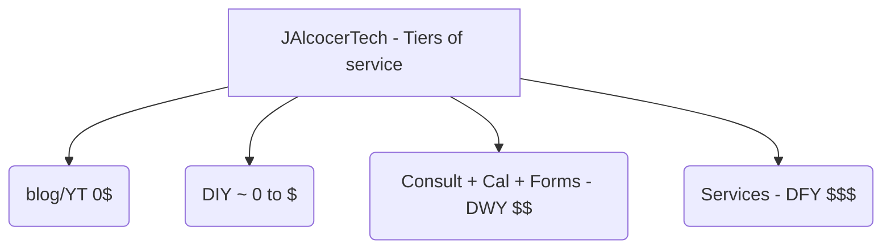
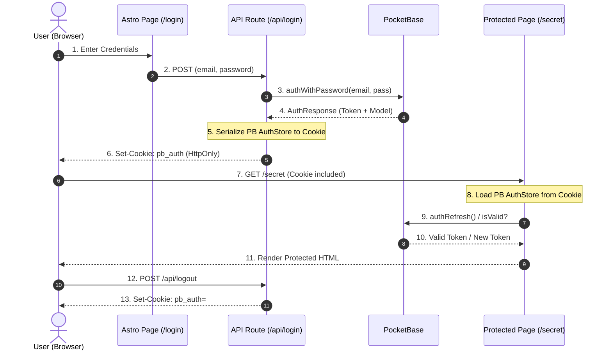
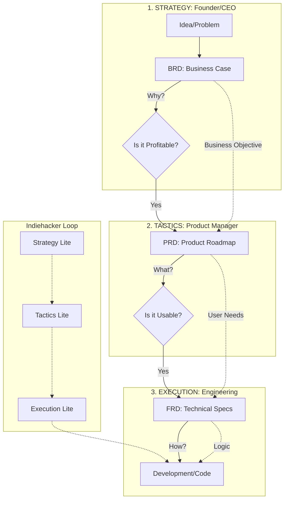

**Tl;DR**

I dared to call [2024 crazy](https://jalcocert.github.io/JAlcocerT/this-year-was-crazy/).

Then 2025 happened.


Where 900 min of LISTENING to a podcast makes you be the top...5%?

Really?

Have you tried more tools than actually shipped projects?

This year yes, but I have changed the tendency.

I believe the ratio can be... ~100 posts with new tools : 10 gh repos with sample projects

Not all the content is indexed in the same way across engines and you can miss valuable info.


**Thanks to Ecosia** I could find how to add Web Analytics to the [Jekyll Chirpy Theme](https://jalcocert.github.io/JAlcocerT/raspberrypi-starting-guide/)!


<!-- 
https://www.gowork.pl/carlos-diaz-gonzalez-digital-media,27067068/dane-kontaktowe-firmy -->

[Computer consultancy activities](https://ariregister.rik.ee/eng/company/16864984/iotechcrafts-O%C3%9C?lang=en)


Even Reqable has one: Tools -> More QR-Code

[](https://colab.research.google.com/github/JAlcocerT/JAlcocerT/blob/main/Z_TestingLanguages/Z_Python/QR_generation.ipynb)


Even with a [SliDev VUE Components like this one](https://github.com/JAlcocerT/slidev-editor/blob/logtojseauth/slidev/slidev-ba-tech-talk-mermaid-exadel/components/QRCode.vue) you can generate QRs!



  



<!-- https://github.com/JAlcocerT/Home-Lab/blob/main/py-static/qr-pdf/qr-sample.png -->

This year, Ive abused again of my *unfair advantage*.


If I was pushing from the [start of 2023](https://jalcocert.github.io/JAlcocerT/blog/summary22/), So ive done this year.


Building a brand is not easy.

But I have **a plan**: *starting with defining an offer and associated tiers of service*



I am really commited to make the world a better place.

So I am (and will be) spending time on making tech concepts accesible to more: *before moving forward, understand [this](https://mermaid.live/edit#pako:eNp9lNtOGzEQhl9lsETVSiQNmxDCIiGRcygnEVpEu70wu5PE1a69tb2oKeHdO_aSA-WQm8Tx_L9nPs_4gcUqQRYymGqez-D0KpJAn-1t6OJESAQ7Q0iEsULGFvIZN2igAuPirhSk_A5TA78LZTGBidJg-ATtvLQxy7CIXTop7IZwilxLIafwAbrKfX_sjm7JsqtgZOFWFdpgOvkUsdLCfY5_RGxsubah2yfJZ2jjVEiJOmI_oVI5gjaFkE9INtVqdXxx1rsejs4HW7R_uDZq-9jOQ8T6XKRwDlZkaCL2uBHT8TGLc2VhqlQCKFUxnS2g_X_MYuC2e0_bXUrAl2Ypu47KcrQo7fp4lEkkV3BLGkEIl1rdi8RhGKO-FzESjn6Jg-D3iSdV_OkNmqRfqki0Sazri-g5KH0PZW3mbq8UPWfTK-tuFyJN6Kg4RmPAWKUFmgX0idnIouYW6eJGWU55I5y9BrDvjQbubMy4TOCI2iXP0zmBGYrpDK4wLyy3Qsn38dRDH1_5xtMCYVCIhEsP6GYF6EbY2XuEyGKlI9kmooFPc-jSvFkiWtqRfUdJU6RW-G7rKB7P6OdzYkPvMHpG5qqcmvMXZF4rsBHCVzoic9JxzGmWRCrsvJwI6oykiO3LytyIPIWnuAzbrGzk8zqhysrLXMVu2FJR10qlzws68cIvJBxJkwuNcEHjrw1YRZ1A8-deA6HhF2Ugcb711vUdJ4lw18tTh1Fi7BbGvw60JqaFKsyyiTI3JnLdOL0ny7KK4SHbYVMtEhZaXeAOy1Bn3C3Zg4uLGKWUUSuH9DPBCac7cyweSZZz-V2pbKnUblBZOOGpoVWRJ4S9KzhhzVb_aioEdYceGcvC3Vpjz7uw8IH9YWElqNWqwcF-0GrtNQ_qzUadtucsrO8F1WarttvabwatGq0ajzvsrz85qAb1VrO2W9tvNfeC2kEj2GFIcJQ-K99d__w-_gN0-KsS)*

```mermaid
 graph LR
    %% Define the distinct phases - Subgraph labels quoted for safety
    subgraph "Phase 1: Learning & Doing (DIY - Do It Yourself)"
        A["Start: Young / Beginner"] --> B["DIY: Do...SOMETHING!"];
        B --> C{"Fail N times"};
        C --> |Not good enough| B;
        C -->|Good Enough| D["Learnt / Competent"];
    end

    %% Phase 2: Providing Service (DFY - Done For You)
    subgraph "Phase 2: Service DFY"
        D --> E["DFY: Done For You - Service"];
        E --> |Build success stories| F{"Iterate & Improve M times"};
        F --> G["Demand > Supply / High Reputation"];
    end

    %% Phase 3: High-Value Guidance (DWY - Done With You)
    subgraph "Phase 3: Guidance DWY"
        G --> H["DWY: Done With You - Consulting / Coaching"];
        H --> I{"Iterate & Refine NM times"};
    end

    %% Phase 4: Ultimate Scalability (DIY Product)
    subgraph "Your Scalable Product"
        I --> J["Build Scalable DIY Product / Tool"];
        J --> K["Inspire Others to start their journey!"];
    end

    %% Additional Connections for Continuous Improvement
    F --> E;
    I --> H;
```




But the DWY/DFY model, means that **I choose what's my focus**.

*Hey, wait but thats unfair i have rights over your tim....*

Do you?

Or have I earned the right to not give a fuck of what others opinions are about how I choose to spend my time?

> The kind of rights you get from understanding [loans](https://jalcocert.github.io/JAlcocerT/python-real-estate-mortage-calculator/#french-amortization-101), the [costs of real estate](https://jalcocert.github.io/JAlcocerT/buying-house-data-analytics/) *including the [painting](https://jalcocert.github.io/JAlcocerT/buying-house-data-analytics/#estimating-painting-costs-with-ai) one*, [stocks](https://jalcocert.github.io/JAlcocerT/py-stonks/), [crypto](https://jalcocert.github.io/JAlcocerT/understading-crypto-with-ai/), having a high [active income](https://jalcocert.github.io/JAlcocerT/career/) AND having a very high saving rate *(yea, im saying no to 50%+++ of what I could spend...after taxes)*

Anyways, not everything is lost!

Have some great idea and want my time to execute it better/faster/higher quality?

I can do so, but there is an opportunity cost for me to switch 

and do...what I want to do and go do your thing :)


  
  

 
**Intro**

The question today is: **Can i use Logto JS SDK + SSG Themes + CF Workers** to get a blueprint/skeleton/template for my SaaS?

> And who knows, maybe one day sell a book or courses?

> > Just like cool kids do here and [there](https://marclou.com/)

Fake it until you make it idea is great.

People seems to have bring it to the next trolling level: https://play.google.com/store/apps/details?id=com.fiuymi.app


### What about OS?

Recently I heard about Flox and NIX...

Are they the best alternative for a homelab OS?

* https://tailscale.com/kb/1282/docker

Perplexity browser with agents

* https://notebooklm.google.com/

> This made me summarize my *old me* from <2023 posts. And those are pretty nice notes for thought.


**Intro**

This year is been like a lot of [do](https://nav.al/do)


It looks so long back when I used `you.com` to help me with work.

And with no doubt, 2025 has been the year of agents. I mean...yea, AI stuff



After [Weather Planning](https://jalcocert.github.io/JAlcocerT/trip-planner-with-weather/), there are also the **financial aspects of travelling**


* https://echarts.apache.org/en/index.html


* https://github.com/OpenInterpreter/open-interpreter

> A natural language interface for computers 


And im able to create a serverless landing ebook page and podcast.

Cool ppl like have their own podcast, like https://37signals.com/podcast/



**From last year...**

1. Get few more websites going for close people ✅ 
2. Leveraging on AI ✅ *Using Windsurf and Cursor*
3. Doing less in total and more of what has a real impact


Reading: *excuse alert, this is beeen a year more of creating than consuming*

And that makes...xyz/12 books.

The lean startup

Company of one!

Open question for reading moving forward: If learning is




## Better Tech Stack

Because Im still in D&A and trying to blend with AI powered development for my personal projects.


  
  


Helium or [zen](https://jalcocert.github.io/JAlcocerT/selfhosted-apps-sept-2025/#new-software) as browsers?

1. [uv](https://jalcocert.github.io/JAlcocerT/fast-api/#proper-py-and-uv) package manager ❤️ Makefiles >>> Readme's & pip! 

2. Pocketbase for BaaS, and a much better understanding of authentication (you are you!) / authorization (you are allowed to do that *or not*).



The key difference between PocketBase and a framework like FastAPI is the level of abstraction and the amount of manual coding required. 

PocketBase is a backend-as-a-service that handles the entire process for you, whereas FastAPI requires you to code each step.

Here is the combined explanation, comparing the authentication flow for both platforms, assuming your frontend is built with Astro.

1. Client Sends Credentials

The user enters their credentials on your login page. The Astro frontend sends a request to your backend.

* **PocketBase**: The Astro frontend, using the PocketBase JavaScript SDK, makes a single, simple API call. The SDK abstracts the underlying `fetch` request, handling the correct endpoint and request body.

```javascript
// Astro component with JS
await pb.collection('users').authWithPassword(email, password);
```
  
* **FastAPI**: Your Astro frontend must manually make a `fetch` request to your custom login endpoint. You are responsible for constructing the URL, body, and headers.

```javascript
// Astro component with JS
await fetch('http://127.0.0.1:8000/token', {
  method: 'POST',
  body: `username=${username}&password=${password}`
});
```

2. Server Validates Credentials

The backend receives the request and verifies the credentials.

* **PocketBase**: This step is entirely handled by PocketBase's core logic. The server automatically hashes the provided password and compares it to the hash stored in the `users` collection.
* **FastAPI**: You must write the code to handle this logic. Using libraries like `passlib` for password hashing and an ORM like `SQLAlchemy` to query your SQLite database, your FastAPI endpoint would:
    * Query the database for the user by username.
    * Retrieve the stored hashed password.
    * Compare the user-provided password with the stored hash.


3. Server Issues the JWT

If the credentials are valid, the server creates and sends a **JWT bearer token** to the client.

* **PocketBase**: PocketBase automatically generates a **JWT bearer token** with the user's information and a default expiration time. It returns this token in the API response without any manual coding.

* **FastAPI**: You must manually generate the JWT. Using a library like `python-jose`, your endpoint would:
    * Create a payload with the user's ID and an expiration time.
    * Sign the payload with a secret key using an algorithm like **HS256**.
    * Return the generated token in the JSON response.

4. Client Stores and Uses the Token

The client-side code receives the token and uses it for future requests to protected endpoints.

* **PocketBase**: The PocketBase SDK automatically stores the received token for you in local storage. For all subsequent requests, the SDK automatically includes the token in the `Authorization` header.
* **FastAPI**: Your frontend code must manually parse the JSON response, save the token to local storage, and then retrieve it for every `fetch` request to a protected endpoint, manually adding it to the `Authorization` header.

5. Server Validates the Token and Authorizes Access

The backend validates the token and decides whether to grant access to the protected content.

* **PocketBase**: This is handled automatically. When a request with a bearer token hits a protected collection endpoint, PocketBase automatically validates the token's signature, checks its expiration, and authorizes access based on the **API rules** you've set up in the admin dashboard.
* **FastAPI**: You must write a **dependency** function that extracts the token from the header, validates it, and handles errors. You then add this dependency to every protected route.

In summary, PocketBase provides a high-level SDK that abstracts the entire process, making it a fast and convenient backend solution.

FastAPI gives you complete control and flexibility but requires you to build the authentication system yourself using third-party libraries and custom code.



> Its all about [encryption and SHA256](https://jalcocert.github.io/JAlcocerT/encryption-101/#bearer-vs-jwt) under the hood!

Backend was hard.

In theory, it can be simplified with tools like [PB](https://jalcocert.github.io/JAlcocerT/pocketbase/), [Manifests admin panels](https://jalcocert.github.io/JAlcocerT/admin-panels-for-websites/) or with https://github.com/MotiaDev/motia

> MIT | Multi-Language Backend Framework that unifies APIs, background jobs, workflows, and AI Agents into a single core primitive with built-in observability and state management.


  
  


Serverless is other of the ways you could build upon.

But the important part...just build with some common sense.


  
  


<!--  

-->



You can use Cloudflare Workers to act as a **reverse proxy** or a **smart router** that forwards requests to your PocketBase home server.

This is a common and highly effective pattern for self-hosting applications.

**The Role of Cloudflare Workers**

A Cloudflare Worker is a serverless function that runs on Cloudflare's global network, very close to your users.

It can intercept incoming traffic and perform logic on it before forwarding the request to your actual server.

When a user tries to access your app's domain, the request goes to the Cloudflare network first, not directly to your home server.

**The Authentication Flow with Workers**

1.  **Client Sends Credentials**: Your Astro frontend sends a request to your custom domain (e.g., `api.yourdomain.com`). This request hits the Cloudflare network.

2.  **Worker Intercepts Request**: Your Cloudflare Worker intercepts the request. Its code's primary job is to act as a **proxy**. It takes the incoming request and forwards it to your PocketBase server running on your home network. It adds the necessary headers and makes sure the connection is secure.

3.  **PocketBase Handles Authentication**: The request reaches your home server. PocketBase handles all the authentication logic as described previously: it validates the credentials, generates the JWT, and sends it back to the Worker.

4.  **Worker Forwards Response**: The Worker receives the response from your PocketBase server and sends it back to the client.

By using Cloudflare Workers and a service like **Cloudflare Tunnel**, you can expose your local PocketBase server to the internet without opening any ports on your home router.

Cloudflare Tunnel creates a secure outbound connection from your home server to the Cloudflare network, making your server accessible without exposing its IP address or creating security risks.

This is the **best practice** for self-hosting applications.




  




3. Understanding that [with CSR we can](https://jalcocert.github.io/JAlcocerT/csr-and-js/) keep WebApps simple, yet providing interactivity via API where needed




Cloudflare Workers are **not a must**, but they are a very popular and recommended option for this setup. 

Your Astro site, once deployed to Cloudflare Pages, will be able to directly make API calls to your self-hosted PocketBase server.

Here's how this works and what changes in different scenarios.

**Cloudflare Pages and a Self-Hosted PocketBase**

When you deploy your Astro site to Cloudflare Pages, the static files are served globally from Cloudflare's CDN.

 However, your PocketBase server is still running on your home machine.

The key to connecting them is to make your PocketBase server accessible via a public URL. 

The easiest and most secure way to do this without a Worker is using **Cloudflare Tunnel**.

1.  **Cloudflare Tunnel**: You install the `cloudflared` daemon on your home server. This creates a secure, outbound connection (a "tunnel") to the Cloudflare network.
2.  **Public URL**: You configure the tunnel to route requests from a public domain (e.g., `api.yourdomain.com`) to your PocketBase server (e.g., `localhost:8090`).
3.  **Direct API Calls**: Your Astro site, deployed on Cloudflare Pages, will then make direct API calls to `https://api.yourdomain.com`. These requests travel securely through the Cloudflare network to your home server.

> In this scenario, Cloudflare Workers are not necessary for the authentication flow itself, as the requests are just being routed.

**If You're Self-Hosting the Astro Static Site**

If you self-host both the Astro static site and the PocketBase server, the process becomes even simpler.

Both services are running on the same machine, so you don't need a public tunnel or a Worker. The Astro frontend can make API calls to PocketBase using a **local URL** like `http://localhost:8090` or `http://127.0.0.1:8090`.

You would then use a web server like **Caddy** or **Nginx** to act as a reverse proxy. This single server would:

* Serve the Astro static files to the public.
* Proxy API requests from your Astro site to the PocketBase backend, all on the same machine.
* Handle HTTPS and other security concerns for both services.

This setup is the most straightforward for self-hosting but lacks the global performance benefits and DDoS protection that Cloudflare's network provides.

**Why You Might Still Use a Cloudflare Worker**

Even with Cloudflare Tunnel, you might still want to use a Cloudflare Worker for more advanced scenarios, such as:

* **Caching**: To cache API responses from your PocketBase server to improve performance and reduce the load on your home server.
* **Security**: To add an extra layer of security, like rate-limiting API requests or adding custom authentication checks before requests even reach your server.
* **Request Manipulation**: To modify incoming or outgoing requests and responses, for example, to hide your PocketBase URL or transform data.




  
  


4. I even got time to clean the **IoT/MQTT** with micro-controllers :)

<!--  -->


  
  


<!--  -->

Ive put together some IoT docs and the scripts I was using:


  
  



5. And tinker a bit with [Crypto](https://jalcocert.github.io/JAlcocerT/understading-crypto-with-ai) and data via [stonks](https://jalcocert.github.io/JAlcocerT/stonks/) / [stocks with python](https://jalcocert.github.io/JAlcocerT/python-stocks-webapp/).



> A recap on [BlockChain](https://simplyexplained.com/videos/how-does-a-blockchain-work/)

With KYC both: Binance and Kraken worked fine to me.

> > No keys, no coins - Make sure you understand how wallets work. 

```sh
flatpak install flathub org.electrum.electrum #BTC

flatpak install flathub org.featherwallet.Feather #Monero
#flatpak install flathub org.getmonero.Monero
```

In case you didnt know - If you get a Metamask wallet for Ethereum, you can make [a Web3](https://jalcocert.github.io/JAlcocerT/guide-web3/) and publish via [ENS (what) instead of the DNS (where)](https://jalcocert.github.io/JAlcocerT/guide-web3/#ens-vs-unstoppable-domains).

Anyways, most of the time we are just tinkering with [regular DNS networking](https://jalcocert.github.io/JAlcocerT/web-domain-basics/#conclusions)

Also, DeFi and protocols like UniSwap (v4) gave me a lot to think about:




If the drawdown if the [~20/30% MDD volatility](https://jalcocert.github.io/JAlcocerT/stonks/#what-is-maximum-drawdown-mdd) for stocks and tradfi, you better get away of the crypto space.

6. On the server/homelab side of the things...



Ive written more here about slfhosting.



7. Im still in [D&A](#da-tech-stack) and have take time to sharpen my big data knowledge.

8. Better git *patterns and branching strategies*. Bc the current (and only) reality is main.

9. CLI Agents ftw. Codex CLI was huge.

I also tried claude and [geminiCLI](http://localhost:1313/ai-tools-for-cli/#gemini-cli).

Together with [BAML](https://jalcocert.github.io/JAlcocerT/ai-tools-for-cli/#baml) bringing type safe LLM calls.

10. Thanks to authentication I got to know the difference between: WHO someone is and WHAT someone can DO 🤯


> Getting to work [Traefik+Tiny Auth](https://jalcocert.github.io/JAlcocerT/testing-tinyauth/#tinyauth) has been amazing, and social auth for SaaS is quick and great for SaaS!


  
  



{}

Both a JWT bearer token and an API key can be used to authenticate against APIs and other services, but they work differently and offer varying security and flexibility. 

OAuth is a broader protocol for secure, delegated access and is often paired with JWT as the format for its access tokens.

- **API Key**:  
  - Simple method; a unique key is sent in requests to identify and authenticate the client.
  - Good for basic server-to-server scenarios, but offers limited security and control.[1][5]

- **JWT (JSON Web Token) Bearer Token**:  
  - A signed, encoded token conveying user identity and claims.
  - Used for stateless authentication; APIs verify the token’s signature without needing to consult a centralized database every time.
  - Efficient for distributed systems and microservices; commonly used in modern APIs.[5][1]

- **OAuth 2.0**:  
  - An authorization protocol that allows users to grant third-party applications delegated access to their data.
  - Handles complex permission scopes, third-party integrations, and user consent.
  - Often uses JWT tokens as the format for access tokens.
  - Strong security and control, but more complex to set up and manage, and better for scenarios requiring delegated access or SSO.[4][1][5]

Which Is Better?

- **API Key**: Best for simple authentication between trusted services, low-security or internal APIs.[1]
- **JWT**: Excellent for stateless authentication in scalable microservices; fast and efficient but lacks revocation and fine-grained permissions.[5][1]
- **OAuth (with JWT tokens)**: Ideal for complex scenarios requiring delegated authorization, third-party integrations, and robust security. Preferred for external/public APIs, especially those involving user data or multi-step permissions.[4][1][5]

**OAuth2.0 often uses JWT tokens as part of its workflow**, leveraging the strengths of both approaches for secure, scalable authentication and authorization.

For APIs exposed to external clients, OAuth is generally considered more secure and flexible.

For internal use or single-service authentication, JWT and API keys are simpler.

{}


Notice also that **WHAT something is** has nothing to do with WHERRE something is. 

*As [per **ENS** and DNS](https://jalcocert.github.io/JAlcocerT/web-domain-basics/#conclusions)*

And that [BRD PRD FRD](https://jalcocert.github.io/JAlcocerT/brd-vs-frd-for-data-analytics/) are the WHY / what / how of a product you are building.

11. From SliDevJS for ppts, to realize that pandoc or latex allow us to create pixel perfect ebooks, newsletters... 


  
    


12. Astro Themes never stop surprising me. Embed ppts inside of them, get n8n chatbots or cal/whatsap boubles...


  
  



13. The difference between helping and serving 🤯

14. The difference between something CAN happen and WILL happen 🤯

15. Compras y esperas vs esperas y compras for stocks compared to wait 7 days for consumption

16. About been unhappy but certain vs uncertain and happy

> Risk aversion is a thing...

## Entrepreneuring

I feel (literally) like in the **back straight of a circuit** after having couple of laps to recognize my breaking/aceleration points.


  
    



  
  


And...



| Feature | **Large Corporation ** | **Indie Hacker / Small Team** |
| :--- | :--- | :--- |
| **Primary Business Model** | High Volume, Low Margin | High Margin, Low Volume / Niche Focus |
| **Typical Annual Revenue** | Billions of dollars | Thousands to millions of dollars |
| **Typical Net Profit Margin** | Very low (e.g., 2-3%) | Very high (e.g., 60-90%) |
| **Total Net Profit** | Billions of dollars (small % of a massive number) | Thousands to millions of dollars (large % of a small number) |
| **Primary Driver of Revenue** | Economies of scale, supply chain efficiency, mass-market appeal | Solving a niche problem, specialized product/service |
| **Role of Meetings** | High volume of meetings, often unproductive and a major source of inefficiency | Minimal or no meetings; communication is lean and asynchronous |
| **Impact on Operations** | Bureaucracy, slow decision-making, siloed departments, high overhead | Agile, direct feedback loops, flat structure, low overhead |
| **Time-to-Market** | Slow, due to multiple approval layers and corporate red tape | Fast and agile, able to pivot and iterate quickly |
| **Competition Strategy** | Compete on price, leverage scale and brand recognition | Compete on quality, specialization, and customer intimacy |
| **Core Advantage** | The ability to execute on a massive scale with immense resources | The ability to move fast, stay lean, and achieve high profitability per unit of work |
| **Related Tags** | **Bureaucracy**, **Wasted Time**, **Decision-Making Bottlenecks**, Silos, High Overhead | **Lean**, **Direct Feedback**, **Deep Work**, High Profitability, Low Overhead |

> Non biased table ofc... Lets give a point: *Large corporations can assemble huge, specialized teams to address highly complex, multi-faceted problems. For example, building a new semiconductor factory*

> > But, just multiply the person*hour*100$/h of all the [meetings](https://jalcocert.github.io/JAlcocerT/effective-meetings-data-analytics/) you've been this year. Crazy.



I mean...*Im almost there*

Now im aware of the **,business / product management trilema'**: *price vs customization vs performance/looks*




The trade-off you've described—Price vs. Customization vs. Performance/Looks—is a classic business and product management trilemma.

While it's not a formally named "entrepreneur's trilemma" in the same way as the "Project Management Triangle" (Time, Cost, Scope), it's a very real and fundamental set of choices that every entrepreneur and business owner has to make.

1. **You can't have it all.** The core idea of a trilemma is that you can't simultaneously maximize all three points of the triangle. To excel in one area, you will almost certainly have to compromise on one or both of the others.

2. **It defines your market position.** The way you prioritize these three factors determines your business model, target audience, and competitive strategy.
  
* **High Performance/Looks + High Customization + High Price:** This is the strategy for a luxury brand. Think of a custom-built sports car, bespoke clothing, or a high-end designer. You offer the best in quality and exclusivity, but it comes at a premium.

* **High Performance/Looks + Low Price + Low Customization:** This is the strategy of a mass-market, high-quality brand. Think of a popular smartphone manufacturer or a successful fashion brand. You offer a great-looking product that performs well, but you have to standardize it to keep costs down and sell at a lower price.

* **High Customization + Low Price + Lower Performance/Looks:** This is the strategy for businesses that cater to specific needs at an affordable price. Think of a local, family-run business that builds furniture to a customer's exact specifications, but might not have the high-tech machinery of a large factory. The product is unique and affordable, but perhaps not the sleekest or most durable on the market.

> This concept is closely related to the well-known "Good, Fast, Cheap" trilemma in [project management](https://jalcocert.github.io/JAlcocerT/selfhosting-pm-tools-docker/).

In that model, "Good" aligns with performance/looks and quality, "Fast" aligns with time to market, and "Cheap" aligns with price/cost.

The product-focused trade-offs you've outlined are an excellent way for an entrepreneur to **think about value proposition** and what they are truly offering to customers. 

It helps clarify what to build, who to sell it to, and what compromises are acceptable to achieve their vision.




And as the start is been a very hard part, Ive been trying to motivate people around me to jumpstart with their ideas.

That's why I concluded, that to make the world better, I could help individual people get started easier/quicker with their own projects.

What do we need to get started?

1. An idea: *each will have their vision and own execution plan*
2. A way to [make invoices with F/OSS](https://fossengineer.com/open-source-invoice-creator/): thanks to [FE/CSR](https://jalcocert.github.io/JAlcocerT/front-end-and-auth/#fe-can-do-a-lot) and the static beauty of [serverless-invoices](https://github.com/JAlcocerT/Home-Lab/tree/main/serverless-invoices)
3. A way for people to know about their services: *Contact forms (QR), waiting lists (like the one of astro-nomy theme) and business cards...*

Thats why I thought and do alot around [this web platform for creators](#launching-webifyer).


### Shipping Products


This year, It's been more building than shipping.

And I want to change that [next year](#for-next-year).

If you are successful, you will need to know [how to use Stripe API](https://jalcocert.github.io/JAlcocerT/using-stripe-with-flask/#stripe) and any form of invoicing customers:

#### About Webifyer

One of those micro SaaS with custom CMS that I was building back in summer.


  
  


Even with Porkbun you can get a quick website now: https://porkbun.com/products/webhosting/articulation?mc_cid=adf0b2f297

And pretty affordable at ~60$/year.

For retail/B2C, having a way to do proper user onboarding / user tours / user guides is key.

I was lucky to find some [tools for Admin Panels](https://jalcocert.github.io/JAlcocerT/admin-panels-for-websites/) and others for user on boarding.

One of the skills I enjoy learning more is about photography.

And one of the of the best decisions I ever had, was to have a [Photo Blog](https://jalcocert.github.io/JAlcocerT/websites-themes-2024/).

> Now, you can also tell your story

Check how, *if you are passionate about Photography*

What is this all about?

Web templates (SSG'ed) connected to CMS's.

And been able to **create CTA's** and clear value proposition statements.

Because, time is money.

And you are loosing both without a proper website.

Because Selfhosting Static Generated Sites, is not a secret anymore for me and for [ricsanfre](https://github.com/ricsanfre/public-websites-docker)


  
  



#### Better Social Media

I improved the video workflow and tried superfially Postiz for sharing.

Also with some AI help, I vibed coded a webapp to help me with the youtube tech scripts content and audio.

And...well, some Flask automatic and high SNR content creation for twitter/X


No post = no impressions.

The difference between a week hitting hard and not doing it is to reach 24k vs 5k impressions.

> Thats why some social media post automation is beneficial https://github.com/JAlcocerT/DataInMotion --> https://github.com/JAlcocerT/LibrePortfolio-X

And in the beginning you will gain the most by replying to people with an audience built already.


#### Leads and Offers

Linktree does things very well, yet cant compete with:

1. Domain 1st y free with CC required (This is a potential CAC)
2. Name a Million more goodies that wont be good enough and still will lower your LTV

But when you consider the resources required to make a linktree like so scalable, that is worth [to get paid...not so much....](https://jalcocert.github.io/JAlcocerT/stripe-for-saas/)

You might rethink that.


  
  


And maybe focusing on getting better clients - I mean, that would value more your active engagement on deliver to them value.

Leaving the automatic mode for B2C, for which [stripe and software](https://jalcocert.github.io/JAlcocerT/stripe-for-saas/) is there to help decoupling your time.

Some people have been contacting me via EE registry `https://ariregister.rik.ee/eng/company/`

> Was wondering how were some EE business owner able to get my email?

> > They are getting kind of qualified leads (from users like me, who never actually subscribed...GDPR anyone?)

Does that mean that...I ve part of someone else's [sales pipeline](https://jalcocert.github.io/JAlcocerT/apify/)?


## Interesting Concepts

Concepts / ideas that I found during this year.

0. Active income > > > Passive income *like the one you can get from [dividends](https://jalcocert.github.io/JAlcocerT/python-financial-data-with-yfinance/#dividend-data---dgi-vs-yield)*


1. CYA (cover your ***) was always a thing. 

But [**BRD**/PRD/FRD](https://jalcocert.github.io/JAlcocerT/brd-vs-frd-for-data-analytics/) just takes it to the next level if you in PM/BA roles.


  


2. Its 2025 and now everyones says that it wants AI / [AI|BI](https://jalcocert.github.io/JAlcocerT/ai-bi-tools/) / AIOps / whatever. When it really needs [good'old ML](https://jalcocert.github.io/JAlcocerT/machine-learning-data-analytics/)

3. Declarative vs Procedural

* **Declarative Knowledge (Knowing *What*):** This is factual knowledge. It's about concepts, theories, principles, facts, definitions, and data. It's the "what" and "why" behind things.
    * *Examples:* Knowing the syntax of a programming language, understanding the principles of agile methodology, knowing the capital of France, recalling historical dates, understanding different economic theories.
* **Procedural Knowledge (Knowing *How*):** This is knowledge of how to perform a task or sequence of actions. It's the "how-to." It often involves skills, techniques, processes, and strategies.
    * *Examples:* Writing code in a programming language, facilitating a Scrum meeting, riding a bicycle, cooking a recipe, debugging software, performing a surgical procedure.

4. The woman in the red dress - Matrix

<!-- https://www.youtube.com/watch?v=YgJ5ZEn67tk -->


An example? 

Could [the aissistant](https://github.com/JAlcocerT/Streamlit-AIssistant/tree/main) *from autumn 2024* have any additional feature?

Just not to *leave money on the table*?

> A person cant solve all problems *(even less at the same time)*

5. System > Goals

Which for me relates with: *More important than the willingness to win, is the willingnes to prepare.*

How would we reach our goals if we do nothing the move our current state closer to it? ah?

Kind of resonates with [process](#processes) > > > result.

> Systems *(designed for the worst days)* do not really on willpower / motivation

6. Expect very low conversions: *from 1/1000 social media conversions, to 1/10 ,121 initial talks' on your funnels,...*

5. Quotes (a)

> Achievement comes from actions not aspirations

> One place, not all over the place.

> *What are you afraid of loosing if you wont take any with you?*

> What worries you, **masters you**

> *Punishment fades but reward stayes*

> Freedom of the press is guaranteed only to those who own one. [From Ghost CEO](https://john.onolan.org/12/), who [launched 12y ago](https://www.kickstarter.com/projects/johnonolan/ghost-just-a-blogging-platform?ref=john.onolan.org).

> Data will say everything if we torture it long Enough. ~ [ML](https://jalcocert.github.io/JAlcocerT/machine-learning-data-analytics/) and Overfitting

> More important of the willingness to succeed is the willingness to prepare. ~ Do, do do, results *might* go later.

> Follow your dream/passion - if they are hiring

> A very cool *pay yourself first*, but not the money view, but the prorities and intellectual boxes - from [DHH](https://world.hey.com/dhh/pay-yourself-first-e86f8147)

5. Questions w/o answer (b)

* How can be money: invested (providing interest), always available and risk free at the same time

6. Guesstimates and [PostMortems](https://fernandocejas.com/blog/culture/2020-06-21-learn-out-of-mistakes-postmortems/)

7. Business/SaaS KPIs: CAC, EBITDA, LTV, NRR, MRR/ARR...


  


8. Mental **Obesity**. Which relates with bikeshedding and the [enless student syndrome](https://youtu.be/QFH-_exyNoo?si=yToM8KSBbT0V5xG3)

> Mental obesity (information vs execution) ig post

From the podcast: How to grow from doing hard things ( Huberman Lab x  Michael Easter) https://open.spotify.com/episode/6EDcPmRd6HHh2zdDnapEFS

9. Time is the currency of life

> And we pay with the currency we value the least

10. Authenticity is how you behave when you have no risk of punishment

11. Some *unrelated* blog & posts:

* https://kerkour.com/writing-against-the-global-lobotomy
* https://levels.io/happiness/
* https://nav.al/existence
* Are we living in auto-pilot? On a [passive live](https://quiethabits.net/stop-living-a-passive-life) topic https://quiethabits.net/year-of-change-2020-a-year-of-maintenance

12. Cool tinkering / tech posts

13. The difference between doing nothing with **intent** to do nothing

14. People call now *moonlighting* to the classical side-hustles. Or so [it seems](https://engagedly.com/blog/moonlighting-and-how-to-deal-with-moonlighting-employees/).

Just make sure you take care of your diet/stress levels.

15. Doing is faster than watching: *if you were doing certifications instead of building, im sure you can relate*



* https://blog.cavelab.dev/2021/11/wifi-relays-for-ventilation/



16. Helping versus serving - *and how Tiers of Service / [pricing](https://jalcocert.github.io/JAlcocerT/docs/entrepreneur/#pricing) helps differenciate that*


  


## Processes

From Last [year 2024](https://jalcocert.github.io/JAlcocerT/this-year-was-crazy/#next-year)...


  
  


- [x] [Better Webs](#more-websites)
- [x] Better AI APIs Usage: APIFY, ElevenLabs, scrapping APIs...
- [x] Review all previous posts and see that are no commented / `WIP` /  incomplete sections


  


- [x] [x24 Tech Videos](#creating-tech-videos)

I also tried [this](https://www.youtube.com/@UnfoldingData/shorts) and [this](https://www.youtube.com/@BeyondAJourney)


  


<!--  -->

> And as videos are just graphs places together, also this: *100+ data driven tweets*



<!-- https://x.com/LibrePortfolio/status/1980278163155333315 -->


### Creating Tech Videos

Last year I set this as a goal.

What exactly were those **x24 tech videos** to make AI, automation and D&A more accesible: [x]

Along the way, Ive made my life easier by based the video content on a **simpler NEW repo**: https://github.com/JAlcocerT/Home-Lab 

1. [Cloudflare Tunnels](https://www.youtube.com/watch?v=k75PviBQeA0)
2. [OpenAI API Tricks](https://www.youtube.com/watch?v=Yihsci3QcfI)
3. [Redash](https://www.youtube.com/watch?v=_0_Qk0Oleeo) (BI)
4. Apache [Superset](https://www.youtube.com/watch?v=4HUqYbknTOM) (BI)
5. [MinIO](https://www.youtube.com/watch?v=KzZ2zCvHhl0) object storage
6. [JHub](https://youtu.be/VEOyKhgat2Q)
7. [Metabase](https://youtu.be/eCplQYrvabk) (BI)
8. [Grafana](https://youtu.be/Uq5tZv6T3ko) (BI)
9. [N8N](https://youtu.be/v-gCNTI5kzE)
10. [SelfHosted Streamlit Apps](https://youtu.be/p7U24YSFrW4) *together with Pocketbase for auth with [such script](https://github.com/JAlcocerT/py-stonks/blob/main/hardcoded-auth-streamlit/st_auth_pb.py)*
11. SFTPGo vs FileBrowser
12. [FastAPI](https://youtu.be/YcCR8JUlhMo) + OpenAI Audio
13. Photoview or Immich 
14. https://github.com/block/goose
15. RGallery vs PiGallery
15. Peekaping
16. [Uptime Kuma](https://youtu.be/fxVNTffZC2U) for status pages
17. [selfhosted ebook landing](https://youtu.be/XEFpzEIEDFc) page with astro
18. Umami for web analytics (with a slidev ppt exported to pngs on kdenlive explaining features for the video) or GL INET?
19. [Home Assistant](https://youtu.be/8XUydWbwBjk)
20. [n8n + CF tunnels](https://youtu.be/v-gCNTI5kzE)
21. [Selfhosting FreshRSS](https://youtu.be/mDMGtMOx-Fk) + astro podcast website
22. [MQTT and DHT22 + Home Assistant](https://youtu.be/8XUydWbwBjk)
23. [Nextcloud and a Pi](https://youtu.be/x2eFFeRIyXg)
24. Ventoy. [Linux Lite vs Garuda RAM consumption](https://youtu.be/hTw9DBEksx4)
25. Bonus: [FreshRSS + AstroPod](https://youtu.be/mDMGtMOx-Fk)

> I had to make sure to create **better thumbnails** to get some views

> > Canva and https://selfh.st/icons/ helped a lot [see repo](https://github.com/selfhst/icons?ref=selfh.st)

I need to think whats next, bc fast fast fast content seem to rule: https://www.youtube.com/watch?v=9yb4o2IwkqM

If this was too much content, you can always use a LLMs to summarize the YT Videos.

Like these ones: *or just use perplexity*

{}

* https://github.com/jkawamoto/mcp-youtube-transcript

* https://github.com/DevRico003/youtube_summarizer

> MIT | A modern Next.js-based tool for AI-powered YouTube video summarization. This application allows you to generate concise summaries of YouTube videos using different AI models, with support for multiple languages and summary styles.

* https://github.com/Milkshiift/YouTubeTLDR

> MIT | ⚡ A lightweight, self-hosted YouTube video summarizer with Gemini AI

{}

It was a year of a lot of applied AI

and understanding many concepts, like langflow, [langgraph](https://github.com/von-development/awesome-LangGraph)..


The **CLI AI agents** have been a great part of this 2025:


  


Some of those CLI tools, like goose, provide also desktop app: *with linux version available!*


  
  


Some tools were CLI only, then released **desktop version**:


Plug any model to Goose:


But hey Ollama has now a Desktop UI mode as well!

> Additionally, I was a speaker in ***few* [tech Talks](http://localhost:1313/ai-driven-diagrams/#mermaid-x-tech-talk)**:

1. Using LangChain to chat with a DB
2. Real Estate RAG 
3. Vibe Coding a WebApp to make SliDev PPTs BA friendly
4. A master class about MermaidJS x Excalidraw with...AI and...a NextJS App on top of it

> Has this be one year, for real?

> > Knowing that a brand is influence + reach - *Why should I keep collaborating with Free tech talks that nobody watches instead of doing videos directly on my tech channel?*

Anyways...my intention is to keep track of my tech talks within this slidev related repo from now on.

<!-- 
https://www.linkedin.com/posts/exadel-people_aimeetup-knowledgesharing-engineeringcommunity-activity-7311382203731525632-FDJg -->

And extracted cool video metadata (gps / geolocation) from GoPros:


  


#### Other Videos

1. AI Powered [shorts](https://jalcocert.github.io/JAlcocerT/photo-video-tinkering/#ai-powered-shorts)

The TTS capabilities from these were also useful:

* https://aistudio.google.com/generate-speech
* https://platform.openai.com/audio/realtime

> I also came to know: https://github.com/speaches-ai/speaches which is *the ollama for TTS*

2. [ChartJS](https://www.chartjs.org/docs/latest/charts/line.html) Powered Shorts

https://jalcocert.github.io/JAlcocerT/web-apps-with-flask/#about-chartjs

I also got to know about: https://echarts.apache.org/en/index.html

3. Python powered YT Shorts - `@UnfoldingData` (PyFinance related via Matplotlib Animations)
3. RemotionJS / Animation powered

### Travel

Combining [Tech and Travel](https://jalcocert.github.io/JAlcocerT/tech-for-a-trip/) to get the most out of them: *I think that hould be around ~30 imaginary borders crossed so far*

<iframe src="https://visitedplaces.com/embed/?map=world&projection=geoNaturalEarth1&position=3.7_34.3_51_-12.4_0&theme=dark-green&water=1&graticule=0&names=1&duration=2000&placeduration=100&slider=0&autoplay=0&autozoom=none&autostep=0&home=PL&places=lie~DE_ES_PT_MX_FR_GB_IT_BE_NL_DK_SE_LT_LV_UA_HU_AT_CZ_SK_BG_GR_TR_MT_PL.daaa44_CH_NO_AL_EE_TH_LI" style="width: 100%; height: 600px;"></iframe>

### Note Taking

Is note taking a waste of time?

The time that you are writing notes / making [your KB](https://jalcocert.github.io/JAlcocerT/knowledge-management/), you are not doing new things...

Is note taking just bike-shedding?

> I got to know about the concept [during 2024](https://jalcocert.github.io/JAlcocerT/this-year-was-crazy/)

Embrace The power of notes.

Without bikeshedding, but unloading your brain and sharing with others!


#### Dev Smart not Hard

Using AI to create more and better, in less time.

The so called, [vibe coding](https://jalcocert.github.io/JAlcocerT/vide-coding/).

With too many options: Repliit, lovable, [windsurf](https://windsurf.com/account/login), cursor, bolt...anti-gravity...


Even with: https://github.com/settings/copilot/features

> *El relato mata al dato* - Thats also true when looking for new project opportunities

1. Discovering uv as [python package manager](https://nielscautaerts.xyz/python-dependency-management-is-a-dumpster-fire.html) and the power of makefile >>> readme.md code snippets was huge to me.

```sh
#uv init
make help #the 2 most powerful CLIs ive learnt this year
```

2. Git power: one action -> one commit + one branch -> one feature + main is the current AND ONLY reality of a project

* See this for branching strategies: https://learn.microsoft.com/en-us/azure/devops/repos/git/git-branching-guidance?view=azure-devops

3. No Nested if's in the logic, try -> Error exit with message is a much better approach

4. I can call this section: my [**vibe coding journey of web/apps** up to this year](https://jalcocert.github.io/JAlcocerT/selfhosted-server-paas/#using-paas-to-host-vibe-coded-webapps)

The good thing?

That Im confortable with FastAPI/NextJS enough to get things going my way, when streamlit is not enough.



  



https://jalcocert.github.io/JAlcocerT/nextjs-toast-ui-editor/


  



I also enjoyed journaling via [astro](https://jalcocert.github.io/JAlcocerT/astro-journal-theme/) and WYSIWYG editors:



  



Getting to work [firebase auth](https://jalcocert.github.io/JAlcocerT/firebase-auth-101/) and get social sign ins working was amazing:


There was time for [audio](https://jalcocert.github.io/JAlcocerT/audio-recap/):



  



I also delivered:


https://jalcocert.github.io/JAlcocerT/making-flask-cms-for-ssg/#flask-x-pocketbase
https://jalcocert.github.io/JAlcocerT/making-flask-cms-for-ssg/#flaskcms-x-quick-auth


  
  



```sh
git clone git@github.com:JAlcocerT/real-estate-moi.git
cd real-estate-moi

make flaskcms-build
docker inspect moirealestate-flaskcms --format '{{json .NetworkSettings.Networks}}' | jq
```
* https://jalcocert.github.io/JAlcocerT/cool-hugo-themes/



  



From a quick waiting list that can be swapped to a landing page, covered [here](https://jalcocert.github.io/JAlcocerT/how-to-create-a-waiting-list/)

* https://github.com/JAlcocerT/waiting-to-landing

```sh
git clone git@github.com:JAlcocerT/waiting-to-landing.git
cd waiting-to-landing

#make run-dev #will spin a waiting list connected to formbricks (see the .env vars)
MODE=LANDING make run-dev
```



  



From Streamlit PoCs, I mean streamlit financial MVP to Flask with ChartJS:


*The MDD concept was pretty cool too*:



  
  



**ChartJS and ApexCharts** have been great revelations this year.


For custom BI, but also to tinker with webapps:


Scrapping, browser automation and [playwright](https://jalcocert.github.io/JAlcocerT/playwright-101/) was also a thing:



  
  



https://jalcocert.github.io/JAlcocerT/web-apps-with-python/#streamlit


 

 




https://jalcocert.github.io/JAlcocerT/python-real-estate-mortage-calculator/#rent-price-vs-property-price
 



  


Use Vision Tools, like RoomGPT + Vision Models to Tweak your Room and do that interior design / home styling:
https://jalcocert.github.io/JAlcocerT/ai-vision-models/#roomgpt-for-real-estate


https://jalcocert.github.io/JAlcocerT/python-stocks-webapp/#the-charts


  
  




  
  



https://jalcocert.github.io/JAlcocerT/tinkering-with-reflex/
https://github.com/JAlcocerT/reflex-templates


From all CMS that I tried on [this post](https://jalcocert.github.io/JAlcocerT/cms-for-static-websites/#frontmatter-cms), just frontmatter kept the simplicity I wanted.

But it does not bring the for all public admin UI.


Followed very closely by [Keystatic](https://jalcocert.github.io/JAlcocerT/cms-for-static-websites/#keystatic-cms).

But I needed [this first run](https://jalcocert.github.io/JAlcocerT/understanding-keystatic-cms/), then the second one [here](https://jalcocert.github.io/JAlcocerT/cms-for-static-websites/#keystatic-cms).

The themes [landingpad](https://github.com/JAlcocerT/landingpad) and mizar with its CMS integrated (keystaticCMS) helped a lot.

When you deploy the static site, the `whateverdomain.com/keystatic` path will still be there:


https://github.com/JAlcocerT/landingpad
https://jalcocert.github.io/JAlcocerT/understanding-keystatic-cms/


> But you wont be able to make any changes, as the server (Typescrypt API) is NOT running.


I also had the chance to work on D&A Prototypes, where I chose Streamlit as the way to present the PoC.


That cool geomap was not included in the **S**cope **o**f **W**ork and a great surprise.

It was ofc properly documented on [a KB](https://jalcocert.github.io/JAlcocerT/knowledge-management/) during the transition phase.

> You could always use some [static layout or wireframe](https://jalcocert.github.io/JAlcocerT/docs/coolresources/diagrams_ppts/) before going to streamlit as PoC!


  
  



##### AI Stuff

https://aistudio.google.com/prompts/new_chat

* https://github.com/browser-use/browser-use

> MIT |  🌐 Make websites accessible for AI agents. Automate tasks online with ease. 

**More Agents**

* https://github.com/agno-agi/agno

> MPL2 | Full-stack framework for building Multi-Agent Systems with memory, knowledge and reasoning.

* https://github.com/bytebot-ai/bytebot

>  Bytebot is a self-hosted AI desktop agent that automates computer tasks through natural language commands, operating within a containerized Linux desktop environment. 

You can make interesting conditional logic, like: *If scrap fails, send msg to telegram bot*

#### More Websites!

Other Websites Ive worked

**07/25 version**

* https://github.com/majesticooss/astros
  * https://github.com/majesticooss/astros/discussions/56
  * https://ioracing-iotechcrafts.web.app/blog/unleashing-the-power-of-tailwind-css/

But for the ones who actually see value on them.


Btw, the **pages speed insights**, can be done via **API**: *see [this .md](https://github.com/JAlcocerT/morita-web/blob/main/z-pagespeedinsight-101.md)*


Given the opportunity costs, something like: one time setup + pay less each consecutive year *if you stay quiet* could be interesting to improve client retention.

Or just [get the **web/ssg related ebook**](https://github.com/JAlcocerT/JAlcocerT/raw/main/Z_ebooks/web-ebook.pdf) if you are on a low budget and simply DIY.

```sh
#If you read me for long, you can simply generate it, its just consolidated notes knowledge :)
# From the repo root or from Z_ebooks/
Rscript Z_ebooks/render.R \
  --input Z_ebooks/web-ebook.md \
  --output Z_ebooks/web-ebook.pdf \
  --cover Z_ebooks/sample-cover.png
```



<!-- 
from static/ebooks/web-ebooks.pdf
http://localhost:1313/ebooks/web-ebook.pdf
-->

Questions? 

There is a [DWY consulting model](https://consulting.jalcocertech.com), based on [cal](https://cal.com/jalcocertech/consulting)

Lazy? [DFY model](https://www.jalcocertech.com/)


**From:**

* https://whilecyclingthere.web.app/
* https://cyclingthere.pages.dev/


  
  
  


Better photo galleries, specially thanks to these components/shortcodes recap.

Still, far from: https://antfu.me/posts/photos-page, speciially: https://antfu.me/photos

Logto had a cool post about how to vibe code a photo gallery app with built in auth:

* https://blog.logto.io/cursor-logto-auth/

And DO a way to deploy static sites: https://www.digitalocean.com/community/tutorials/ 
and how-to-deploy-a-static-website-to-the-cloud-with-digitalocean-app-platform


**To:**

* https://beyondajourney.pages.dev/


* https://financemotion.pages.dev/ 

I even created skeleton (and videos) for web oriented to podcasts and ebooks.

> Maybe you can become some with a very personal blog, like [Sivers](https://sive.rs/about)

Still im far from this one: https://newsletter.marclou.com/p/my-solopreneur-story-0-to-65k-month-in-2-years or https://mfyz.com/moved-blog-from-wordpress-to-astro/

And having nice **hugo/astro directory pages** would be amazing.

Sth like: https://github.com/masterkram/minted-directory-astro, where you can easily plug some kind of DB/Sheet/Github repo readme's with particular front matter and get a website going.

### Improving the HomeLab

There were some recents downtime status on popular services:


Also, mandatory services :)


I am very happy to have discovered AppImageLauncher.

Thanks to it I got HTTPie Desktop, Cursor and marktext desktop apps working very quickly.


Ive had time to write few posts about **making selfhosting better**.

Together with a better, NEW and more organized repository:


  
  

  
That one I want to keep the configurations minimalistic and very simple to replicate.

* https://jalcocert.github.io/JAlcocerT/selfhosted-apps-06-2025/
* https://jalcocert.github.io/JAlcocerT/selfhosted-apps-spring-2025/

Ive been taking **inspiration from**:

https://jalcocert.github.io/JAlcocerT/docs/selfhosting/#inspiration-for-a-homelab

Thanks to this sites, I get to know more cool apps:

1. https://openalternative.co/self-hosted

* https://github.com/piotrkulpinski/openalternative

> Which can be seen also as an **awsome Astro [project](https://github.com/piotrkulpinski/openalternative)!**

2. https://alternateoss.com/

3. https://youmightnotneed.co/

4. selfhst.st

### New Tech Im using

AI... ofc


Despite popularity has...decreased recently?

Im including here: **MCP**, which it was all hyped around spring and non used today due to high token consumption

* https://github.com/mcp-use/mcp-use
* https://github.com/punkpeye/awesome-mcp-servers

And...**BAML**, which was a very interesting setup.

Perplexity and Gemini are my go to now, instead of ChatGPT.

---

## Conclusions

There was even time to make **Data Analytics recaps** and create (not that much ship) [***better* SaaS products**](#shipping-products).

Imagine that after all of this, you do couple Tech interviews and someone from HR asks you what are your plans for self-development.

Tell me its not laughable :)


  
  


I havent measure these blog posts time creation.

But it must have been sth like:


### For Next year...

Enough new ideas to kill the good one?

Create a Roadmap!



1. Weddings serverless + ads
2. Real Estate Custom RAG and WebApp via DecapCMS
3. AIoT *end to end flow from solar panels to dashboarding & langchain*
4. Custom Marketing analytics *from custom high signal content creation to funnels*
5. Books *from D&A to web and concepts from kindle notes*
6. Scaling PRO Webs creation via PaaS - A better DIY website with free (programmatic) audit

7. Prepare the DIY/DWY/DFY based on the ebooks and blog content ~ *Wiki efforts*

8. Get back to simulations - *for fun :)*



Build.

And to do NOT derail.

I will be Aiming for aggressively packaging knowledge into **high-leverage products and services**.

But if you are one, doing ONLY what people wants is not optional.



You have limited time resources, combined with low capital.

Fortunately, you have [tools to know what your clients want](https://jalcocert.github.io/JAlcocerT/how-to-record-web-sessions/) and double down in that direction.


The services is a matter of what to build.

So to validate i built the simple waiting list concept that superseeds the waiting list v1 before ever going to prod.

* Waiting list to services
* Automation to services
* Web spins to services, maybe via paas coolify/dokploy



As I want to focus more on doing than entertainment.

1. Unscripted
2. Hyper focus fro, Crhsi Bailey
3. Gonzo Capitalism (?)



And...to create N ebooks :)

#### Keep Doing

1. Vibe Coding and BiP *using what I already know is enought to build a lot of projects*
2. Sharing what I know with people around me. In person.
3. Shipping more Serverless / CSR / Static
4. Slowly getting better at action cam videos and ffmpeg / kdenlive. *Just for fun.*

5. Reading from time to time, people that inspires

* https://www.randomgarage.com
* https://www.nickgracilla.com/posts/year-in-review-template/
* https://blog.cavelab.dev/2022/01/a-person-that-writes/

* https://selfhosted.show
* https://selfh.st/

6. Keep writting, but less and MORE QUALITY: < 2/week **AND <60/year**

7. Get better at Writting (N) ebooks

#### Stop Doing

1. Opening more and more a shallow tech stack. *12/24 <<<170+ yearly posts on this blog should be more than enough*
2. Keeping 50+ tabs on chrome. *Not watching content on the phone and commet for summaries should help*.
3. For the hard to sell, it needs to be fully scalable or nothing - accounting for my opportunity cost. 
4. Stop building w/o a focus strategy, like with **random avatars** - Like I did In the AIssistant example

#### Start Doing

1. Promoting what I do via youtube/jalcocertech.com/fossengineer. *Curated niche posts, expanding knowledge I already gained here*
2. Share interesting animations as a code on reddit/twitter/whatever forums. Its not ycombinator, nor producthunt but its sth
2. x30>x24 youtube tech videos, more elaborated, *probably without AI voice*
3. Go all-in to find new clients
4. Not scalable but clients want it? Sell w high gross margin to the ones who can benefit
5. Collect **case studies** / success stories: Flask web app https on a server for SMB / real estate DFY w custom chatbot / hospital D&A CI/CD radiophysics / from zero to astro web hero for a mechanical engineer...and add them to the `consulting.jalcocer` and/or as article on the main www site.
6. Put together the captured knowledge on these posts into ebooks anyone can use for quick DIY

**Maybe's**

Get in shape: *there are few projects available, so no excuse this time*

1. https://github.com/vanalmsick/workout_challenge

2. https://github.com/Snouzy/workout-cool?

> MIT |  🏋 Modern open-source fitness coaching platform. Create workout plans, track progress, and access a comprehensive exercise database. 

### Outro / Random

I cycled with 2 bikes at the same time.

Also, I cycled with a MTB and 3 pizzas on my steering.

Both for 5+ km

<!-- 


Oh, and I climbed (again) to the top of a country.

<!-- https://youtu.be/xggBx1rD_r0 -->




#### Discovery of the Years

[2020](https://jalcocert.github.io/JAlcocerT/blog/summary20/) - R *together with sql*

[2021](https://jalcocert.github.io/JAlcocerT/blog/summary21/) - Containers *with the Pi*

[2022](https://jalcocert.github.io/JAlcocerT/blog/summary22/) - PySpark *and big data*

[2023](https://jalcocert.github.io/JAlcocerT/blog/summary23/) - SSGs *and static hosting*

[2024](https://jalcocert.github.io/JAlcocerT/this-year-was-crazy/) - LLMs *and API calls*

2025 - BiP *and social sign in/up*


I know that this is like... 0+0=0

But...how could we expect to be closer to excellent w/ot even trying?


Enjoy.