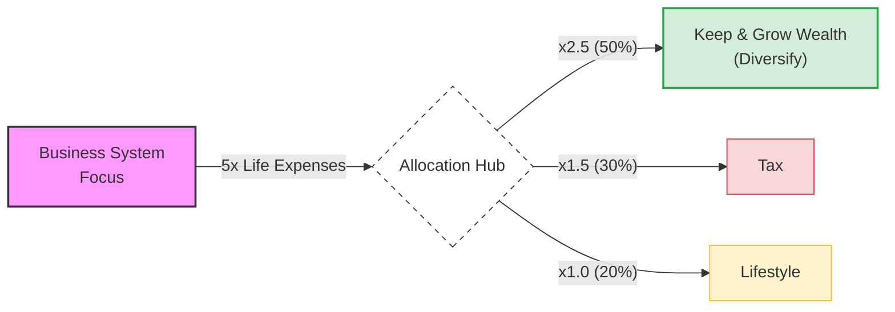
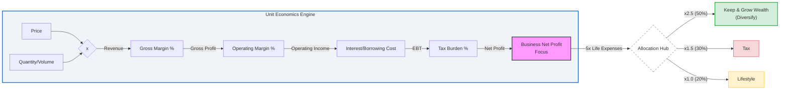
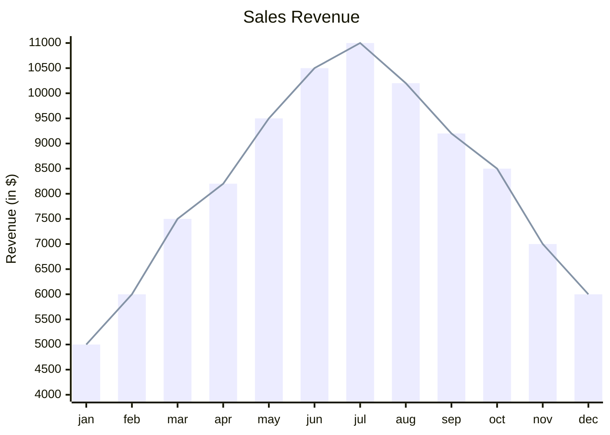

**TL;DR**


<!-- 
https://www.gowork.pl/carlos-diaz-gonzalez-digital-media,27067068/dane-kontaktowe-firmy -->


**Intro**


  
  



## Inspiring Apps

Inspiring apps: all those pwa like that just...work

* https://bentopdf.com/index.html
* Docuseal
* it-tools
* Vert - https://jalcocert.github.io/JAlcocerT/wasm/
* Pairdrop...


* https://github.com/scio-labs/inkathon
 
Full-Stack DApp Boilerplate for Substrate and ink! Smart Contracts 


How about building like they've done?


  
  



### Curated Posts / Videos

AI...employees?

Comercial ones like: `https://www.lindy.ai/pricing`

Maybe, try to build a brand *before its too late*.

0. Android

PrimeOS was nice

0. Interesting Recipes

How could I not offer something very special to entreagujaypunto: *to capture all those recipes*

```sh

```

With


**Side Quests**

0. About Type safe

From JS we evolved to TS

From regular openAI API calls, to do it via BAML

and from SQL, to malloy: https://github.com/malloydata/malloy

https://docs.malloydata.dev/documentation/user_guides/sql_experts1


0. For social media outreach, `https://www.growchief.com/` was an inspiration.

But also their discord bouble on the web for any BiP Project.

> As the alternative i knew about `heyreach.io` for Linkedin

0. When finding leads...

This was an awsome example of data analytics.

Specially after having some thoughts about analytical reflections of OLTP tables.

For the ones that want to break the silos

get proper data lineage trazability to see what worked (what are the *features* of a prospect that actually bought from you)

and feedback to the lead engine.

0. Web CMS stuff: *Strapi directus...*

This was [how i Tinkered](https://youtu.be/UFxlU9gMp_A) last year actually.

But I said no more to custom CMS integrations.

Actually: Not doing more (DFY) websites for others.


  


0. Audio TTS

https://www.youtube.com/watch?v=dQ841Pd6YvQ


0. Delivery Analytics


0. Promote in subreddit to get feedback?


0. D&A Recap + OLTP Post (ERPs) and OLAP Post -> Docs -> ebook


* https://www.ohansemmanuel.com/books/understanding-astro
* https://github.com/understanding-astro/understanding-astro-book/tree/master?tab=readme-ov-file
* https://understanding-astro-webook.vercel.app/



  
  


I thought that Id do for this year a separated `blog.jalc...` based on this [canvas repo](https://github.com/JAlcocerT/canvas).

But I Just continued here.

The same blog as last year, public and even clonable :)

0. For the ones that dont want to read an ebook neither to pay consulting or the DFY...

I offered a *1 to many* free session, aka Webinar.

At my schedule convenience, ofc.

People are using these platforms to do so: *and you have to place your email for later use*

* `https://webinarjam.com/`

0. Improved FOSS from blog to doc like.

Multilanguage and all that stuff. 

Still as HUGO.

```sh
dig fossengineer.com any
#ping fossengineer.com
```

Not [with codex cli](https://github.com/JAlcocerT/docs-testing/tree/master) this time, but directly with IDE:

```sh
git init && git add . && git commit -m "Initial commit: better ai docs" && gh repo create fossengineer-hugo --private --source=. --remote=origin --push
```


  
  


HUGO Vibe Coded Re-build

To offer this via fossengineer, I can try: *these are next steps*

1. As is (later removing adsense)
2. The local KB offer
3. The webpage offer
4. Finally remodel the webpage to avoid the shape of a blog, as is more a news/docs one - vibe coding ofc.

With that remota data (yaml) fetching from the home-lab repo.

0. Talking about Home-Lab and selfhosting: I keep admiring the work that selfh.st puts weekly

I have done a ~monthly series on stuff Ive tried or actively used.

Also, have upgraded the x300 and x13 OS'es with a better backup strategy.

Oh, and Im quite happy with proton mail and custom domains.

Cloudflare tunnels keep been great, but I was surprised by tailscale funnels for those very quick PoC that might require exposing some we/app or webhooks.

<!-- 
https://x.com/tom_doerr/status/1979894065400263086 
-->





  


0. Create individual pages on `jalcocertech.com` with stripe plugged.

Share on social media / ads and do `draft:true` when old, but history will be kept on code `.mdx`

0. BiP user flows around newsletter layers

0. Creating D&A Reports with AI

Because power BI and looker might not be enough


0. IoDoctor reloaded

* A second opinion
* No kyc, no receta

* with v3 -  Astro + Alpine + Tailwind Starter - as per https://github.com/cssninjaStudio/dokto
can find out existing interface

0. Blogspot vs Wordpress Migrations *with Free web Audits plugged in*

The free web audit is a thing: <https://webaudit.jalcocertech.com/>

Which I put together [here](https://github.com/JAlcocerT/poc_webs_magnet).


  
  


Which got enhanced: *after I focused on it*


  
  



0. DIY website enhancements: *around a PaaS Website Hosting.*


  
  


0. Restaurant SaaS: *aka Multi tenant Astro Apps with protected routes*


  
  



0. Embeded Chatbots for a business website x [Business Knowledge Base setup](https://jalcocert.github.io/JAlcocerT/custom-bots-kb/)!.

This is going to hit hard in the upcoming years.

Account for the bast amount of silos that there are in every industry that can be improved.


  
  


0. Creating a [Custom **Real Estate Agency** with RAG ChatBoT](https://jalcocert.github.io/JAlcocerT/custom-re-rag/). A Success Story!.

Another example of why you need to know the business game you are playing.

Build what it makes sense to build.

Consider if you are supply or demand constrain!

Then prospect your clients and create a proper offer:


  
  


No effort to get the right clients = dont complain and learn.

0. I did not know that **creating an/N ebook/s** was that simple.

The captured knowledge on these [blog posts](https://jalcocert.github.io/JAlcocerT/blog/) and [docs](https://jalcocert.github.io/JAlcocerT/docs/) into ebooks *markdown driven* anyone can use for quick DIY.

One of the start doing goals from last year. And that I quickly put together [here](https://jalcocert.github.io/JAlcocerT/interesting-books-and-diy-offer/#building-n-ebooks-for-a-webook).


  
  


0. Publishing ebooks be like: `https://www.amazon.es/sendtokindle`

> Want a website? DIY your own with this free ebook when subscribed / DWY with consulting / contact for a DFY.

> > That's how ive done the ebook

> Create ebooks be like: upload .md + upload image done via canva = download pdf/epub thanks to pandoc

> > Similar to ~tiiny.host

Again: if you dont have a distribution, expect that nobody will care.

0. A better CV: *because being a [pro D&A professional](https://jalcocert.github.io/JAlcocerT/excel-data-analytics-interviews/) is a little bit harder nowadays*


  


Ive also added some D&A industry use cases: https://www.jalcocertech.com/support/articles/


  
  



<!-- 
deeper Power BI expertise, particularly in BI semantic model design and self-service analytics. 

consumer analytics - fmcg - consumer insights
-->

Forget about MMM marketing analytics, personalized outreach is the next big thing.

If you are a data engineer with some imagination: *become a GTM engineer*.

0. ecommerce

Selfhost it, provide an AI driven COO or do D&A to cluster users for proper recommendation and revenue optimization

0. Tinkered with **new APIs**

* https://github.com/agustinusnathaniel/pub-apis
* https://publicapis.sznm.dev/

0. Data driven stories

* https://viborc.com/

0. About Posthog: *I used it for the wedding thingy*

Another idea was: Post an ebook page post on IG, then, the web session will be recorded and a YT video can be made out of that


  
  


0. How to create a **waiting list** to test your ideas + ListMonk + SMTP - Share on ig too.

0. Web Analytics x Link Analytics: *GDPR compliant*

I still go fo Umami for Web Analytics.

But in case you need the link analytics:


* https://jalcocert.github.io/JAlcocerT/t3-like-chat/#selfhosted-webanalytics

* https://github.com/idhamsy/openshortlink

> OpenShort.link is the all-in-one, open-source, serverless URL shortener. It runs 100% on Cloudflare and offers one-click installation.

1. Weddings and ads 101: *a micro-SaaS ,game' has great GM, it just needs OpEx to get rolling!*


1. Landing Page essentials *a DIY boilerplate way with most sections you might need*

It was a continuation of [this section for artists](https://jalcocert.github.io/JAlcocerT/link-artists/#waiting-list-for-products) 


  
  


A nice landing is a matter of: a cool responsive UI with a demo video, a form and a calendar.

This is awsome to validate ideas: *a part of which dis-qualifying prospects is key.*

4. Status Pages for services: Kener / UptimeKuma. 

SLA matters and [some people need that status pages](https://jalcocert.github.io/JAlcocerT/link-artists/#status-pages) or the information that it exists.


  
  


They wont probably want to pay for it.

But you can do some quick scripts around uptime kuma to get started quicker.

```sh
git clone https://github.com/JAlcocerT/Home-Lab
#git pull
cd Home-Lab/uptime-kuma
#sudo docker compose up -d
#docker ps -a --filter "name=uptimekuma"
uv run scripts/bulk_add_monitors.py #tweak the json and the .env to add your monitors
```


  


6. Client adquisition data pipeline: *APIFY to rule them all*

I thought that this is a: To be tested with *,artists,designers and wannabe's'* from social media.

But before you even try.

Consider that: If someone [has a linktree free](https://jalcocert.github.io/JAlcocerT/websites-themes-2024/#scaling-ideas), is a potential candidate.

> But if someone is not paying 10$/m to a company, guess how much is willing to pay you :)

So actually, I skipped that one.

And use APIFY x FireCrawl to find B2B clients at scale:


  
  


7. Boiler plate / **blueprint for vibe coders**: WebApps with proper auth flows with NextJS, like this the Slidev+LogTo setup

I also **launched my boilerplate**: https://boilerplate.jalcocertech.com

> It has the look and feel of my latest [diy landing boilerplate](https://github.com/JAlcocerT/diy-landing-boilerplate) for a reason :)


  
  




  
  



8. Proper CI/CD for (streamlit) Web Apps. [Success Story 1 + Hospital D&A](https://jalcocert.github.io/JAlcocerT/improving-healthcare-analytics). There is a session recorded and shared [here](https://youtu.be/3lcywTUeP5k) *and [here](https://youtu.be/eFS7crQpm_s)*



  



9. Authentication Post: *flowing directly to BiP*

Because [social sign](https://jalcocert.github.io/JAlcocerT/social-signin-101/#conclusions) is not only cool, but useful for your SaaS.


  
  



  
  


10. Data driven agentic COO: *or should i call this [plug and play D&A](https://jalcocert.github.io/JAlcocerT/plug-and-play-data-analytics)?*

Initially, I thought about to write about Analytics with Graphic Walker.

Then, this happened: *actually, a series of posts*


  
  


Which I used for the first **tech [talk](#tech-talks)** of this year.


  
  


10. Thanks to those series of doing things: the D&A / Agentic COO / for Shopify came into my mind.



  
  



10. IoT: *From sensors, to databases and QnA*

Should I call this Embeded analytics?

11. Mechanisms reloaded. *With [algebra](https://jalcocert.github.io/JAlcocerT/algebra-101/) and [calculus](https://jalcocert.github.io/JAlcocerT/calculus-101/) back in place*

Simulations are back.

But not in [matlab, nor octave](https://jalcocert.github.io/JAlcocerT/matlab-vs-octave/).

For racers, see how to estimate the [**optimum circuit path** based with a simple model](https://jalcocert.github.io/JAlcocerT/kart-optimum-path/) based on a go pro data and gradient descent.


  


And not only for mechanism.

12. Geolocation - Geospatial data recap [for racing](https://jalcocert.github.io/JAlcocerT/blog/tinker-racing/) and HUD video overlays.

This was huge.

From the initial public repo, I created another one:


  
  


I made some **HUD overlays for GoPro videos** to have their telemetry in place, without having to use closed sourced apps that in most cases dont work on Linux.


  
  



14. Racing *best lap* optimizer / simulator.

It all started with the *Optimum Path* Idea.

Then I put together a repo that leveraged the existing Go Pro extraction / overlays to get the circuit path.

And tinkered with few algorithms to optimize the path: minimum curvature (obviously not the fastest), a [GD with a mass point model](https://jalcocert.github.io/JAlcocerT/kart-optimum-path/) that brought very interesting results, plus the [Genetic Algorithm](https://jalcocert.github.io/JAlcocerT/genetic-algorithm-for-racing/) and [Reinforced Learning](https://jalcocert.github.io/JAlcocerT/reinforce-learning-racing-simulator/) (for fun!).


  



  
  


Surprise, surprise: simple mode + realistic assumptions wins the day




14. Twitter / X powered by pystocks / stonks / libreportfolio.

The continuation of the [programmatic Twitter API interaction](https://jalcocert.github.io/JAlcocerT/interesting-apis/#twitter): `http://x-api-tweet-creator:5000`, graficas...Data In Motion etc

Or like the `https://fastapi.jalcocertech.com/`


  
  


```sh
git clone https://github.com/JAlcocerT/DataInMotion.git
cd DataInMotion && branch libreportfolio
#uv run tests/plot_historical_yield.py CAT --start 2005-01-01 --brand "@LibrePortfolio" --monthly
uv run tests/plot_historical_gweiss.py CAT --start 2005-01-01 --brand "@LibrePortfolio" --warmup-days 400
```



  


Because the datainmotion libreportfolio branch with gweiss method and so on was cool

```sh
uv run tests/plot_historical_gweiss.py TROW --start 2005-01-01 --brand "@LibrePortfolio" --warmup-days 400
```

efecto cantillon for inflation and entrepreneur mindset

Cantillon defined the entrepreneur as someone who buys at a certain price and sells at an uncertain price.

To him, the entrepreneur is the "risk-bearer" who stabilizes the market by taking on the gamble of the future.


> Fundamental, Fun, Future [the 3 f's :)](#open-questions)


  


Talking about trends, what happened with crypto?

The sha256 still holds strong, it was all about hashing https://www.devtoolbox.co/tools/hash-generator

16. Tech videos were not a priority this year.

Basically: Im not focusing on building a B2C tech audience.

I finally uploaded some from last year, just with youtube music:

* [Goose Desktop](https://youtu.be/ZW5eEocyrTU) 
* [GrowChief](https://youtu.be/in8uTdLhFqI)

Others, from the vibe coding sessions: helped to bring quick demos to their related product landing.


17. I made **some animations** instead.


### Serverless

1. Ive enjoyed using **Cloudflare R2** for s3 compatible object storage.


  
  


2. Combined with **firebase authentication + FireStore** for my first ever public launch.

> Pulling registered users from those tables and setting automatic emails campaigns *(lean DRIP)* [with Mailtrap and GHA](https://jalcocert.github.io/JAlcocerT/iterating-and-improving-a-micro-saas/#mailtrap-orchestrated-via-gha) was so cool

> > The magic happens at [this gha workflow](https://github.com/JAlcocerT/slubne-chwile-y26/actions/workflows/drip.yml)


Plus a cool example of lean engineering. 

No need for glue when there are no data silos by design.


  


So there we have also the...

3. Serverless **Lean DRIP email** sequences

Who would have thought that you can use GHA to send automatical emails for people who opt-in into your micro-SaaS.

With a cool template and API based.

4. Creating invoices with `.json` via the serverless SPA: https://github.com/JAlcocerT/serverless-invoices

Which I deployed last year to `https://serverless-invoices.pages.dev/invoices?lang=en` 

At this [post](https://jalcocert.github.io/JAlcocerT/csr-and-js/#csr-examples).

It just keeps working with the power of CSR behind.


1. https://github.com/neondatabase/neon

> Apache v2 | Neon: Serverless Postgres. We separated storage and compute to offer autoscaling, code-like database branching, and scale to zero.

2. Cloudflare D1: *An interesting companion for CF R2*

https://blog.cloudflare.com/serverless-matrix-homeserver-workers/?ref=selfh.st/


  
  


### Tech Talks

1. About langchain connected to a database...v2. [Post](https://jalcocert.github.io/JAlcocerT/plug-and-play-data-analytics/). [Video](https://youtu.be/XS0vLK9x9nc).

2. 

99. Duckdb x motherduck

DuckDB as been very interesting. And gen bi tools like Rill rely on it.

https://ducklake.select/manifesto/

which relates to rill gen bi andduckdb

https://www.youtube.com/watch?v=dJMqeKEtW6w

https://www.youtube.com/watch?v=dJMqeKEtW6w

https://www.youtube.com/watch?v=hrTjvvwhHEQ

https://www.youtube.com/watch?v=-PYLFx3FRfQ


https://motherduck.com/docs/getting-started/

Infrastructure for Answers

The data warehouse built for answers, in SQL or natural language.

I focused on [articulating better](https://github.com/JAlcocerT/selfhosted-landing/blob/master/y2026-tech-talks/articulated-vs-authorit.md) my ideas, creating [engaging presentations](https://github.com/JAlcocerT/selfhosted-landing/blob/master/y2026-tech-talks/authoritative-content.md) and [authorated](https://github.com/JAlcocerT/selfhosted-landing/blob/master/y2026-tech-talks/authoritative-content.md) content.

Its all about nurturing the [psyc aspect](https://jalcocert.github.io/JAlcocerT/how-is-for-agents-what-and-why-for-you/#psyco).


~33...now 46...60 and 16post/22 days january

```sh
#du -sh .
#find ./content/blog -maxdepth 1 -type f -name "*.md" | wc -l #posts count

find content/blog -name '*.md' -print0 |
xargs -0 awk '
  FNR==1 { 
    post_date=""; 
    printed=0 
  }

  /^date:/ && !printed {
    gsub(/^date:[[:space:]]*/, "", $0)
    post_date = substr($0, 1, 10)
    if (post_date >= "2026-02-01" && post_date <= "2026-12-31") {
      print FILENAME ": " post_date
      printed=1
      count++
    }
  }

  END {
    print "TOTAL:", count+0
  }'
```


### Quotes

Every business is a game and you can see how many of them play: `https://wyszukiwarka-krs.ms.gov.pl/`

`https://rar.ms.gov.pl/rar/dane-podmiotu/0000053665?strona=1`

1. Choose your hard
2. What a priviledge is to choose what challenge make you struggle
3. Attention is all you need
4. Intelligence and risk tolerance are 2 different skills and favoured in different environments

5. Doing something for an extended period of time without guarantees of success is what makes the difference

> And i could not agree more - that Y axis es left blank, because it applies to several concepts in life: from cash flows to body transformations...

See these as your time vs your money Your time vs your money

A certain Negative cash flow year one then...uncertainty


6. You dont judge a system by its process but by its result

7. Diminishing returns are still returns
8. You just loose if you dont try
9. Complexity is a good excuse / shelter - that gives the sensation that nobody will copy you, that you are working...

10. First you focus and create. Then you diversify to maintain.

11. How good are your idea? How good are you at describe them? `/JAlcocerT/a-diy-boilerplate-to-ship`

12. Saas is built to optimize for retention, locking and expansion.

13. Cuando buscas la perfection antes de ship, buscas q los demas no t critiquen

14. Las personas q tienen un estilo de vida feugal disfrutan de una libertad que los que estan ocupados para mantener su lofestyle se pueden inaginar

15. Can we all be a hunter aka entrepreneur? Or Que nivel the comodidad atrofia tu ambicion?

16. How long can you continue moving towards your goals without a possitive feedback?

17. Kaczka kura aby dzura

18. Riesgos del juego o mediocrity garantizada?

19. Consistency beats talent

20. Time is most scarce resource. And more important the younger you are. Would you loose it?

21. Everything is priced in: `https://www.reddit.com/r/wallstreetbets/comments/eberem/everything_is_priced_in/`


#### Open Questions

* Whats freedom?: Possibility of acting or the absence of obstacles?
* Will we ever get to value the spark more than the shadow it casts?
* is blockchain the ultimate database?
* Is some official/certified the prohibition of any other alternative?
* How hard is to increase income? how hard is to *,save'* ~70% after taxes?
  * In other words: how hard is to change your lifesetyle ( fundamenta and fun) and your income (monetary system) so that your needs move from 50 / wants 30 / savings 20 to that proposed?
* How many times have you been a buyer this year? and a seller? Have you tried Rejection therapy?



* Are all valuation methods like the multiples just different abstractions of the cash flow one?
* Is doing x6 in something the last 2 years a matter of: luck, effort, merit? a combination of those? none of those?
  * And x4 in 3 years?

#### Interesting Concepts

1. Nonchalant

* Options -> Things and not controlable
* Choices -> Actions and are controlable

2. Again: active >>>>> passive


#### Interesting Posts

* https://nav.al/feedback

And podcasts:

* MongeMalo
* [DanKoeTalks](https://www.youtube.com/@DanKoeTalks)
* [DanielPriestley](https://www.youtube.com/@DanielPriestley)


### For Next year...

The fwk: keep / stop / start.

#### Keep Doing

1. Vibe Coding and BiP
2. Sharing what I know with people around me. In person.
3. Slowly getting better at action cam videos and ffmpeg / kdenlive. *Just for fun.*

5. Reading from time to time, people that inspires

* https://www.randomgarage.com
* https://www.nickgracilla.com/posts/year-in-review-template/
* https://blog.cavelab.dev/2022/01/a-person-that-writes/

* https://selfhosted.show
* https://selfh.st/

6. Keep writting, but less and MORE QUALITY.

I said: < 2/week **AND <60/year** <<< 170

Which has not happened at all.

7. Keep far (far away), from people that: *say that want X, do Z instead*.

Special mention to the ones that pay more in car insurance that what they spend in finding new clients.

Yes, those also state that have a business about to be started. Always.

For the ones who say that will do things, but the thing they do post 9-5 is nothing.

For the very alergic to the risk...well...keep your ~0% at the bank. 

Its very safe there.

8. Order/clean papers / old tech. Donate. ✅ 

9. Collecting case studies / success stories ✅

10. Reading books - To act *not just archive knowledge, but learn, which means different behaviour to same inputs*

Like around marketing and sales: Cashvertising, ...

11. Review these tech notes monthly ✅


#### Stop Doing

1. Opening more and more a shallow tech stack. 
2. Keeping 50+ tabs on chrome. *Not watching content on the phone and commet for summaries should help*.
3. Stop building w/o a focus strategy.

Like with **random avatars** - Like I did In the AIssistant example

Or been supply constrained and offer below market quotes for DFY products/services.

Been there. Done that.


#### Start Doing

1. Promoting what I do via youtube/jalcocertech.com/fossengineer. *Curated niche posts, expanding knowledge I already gained here*

Like these articles: 

2. Share interesting animations as a code on reddit/twitter/youtube/whatever forums. Its not ycombinator, nor producthunt but its sth
2. x30>x24 youtube tech videos, more elaborated, *probably without AI voice*
3. Go all-in to find new clients
4. Not scalable but clients want it? Sell w high gross margin to the ones who can benefit


#### Discovery of the Years

Wait...how many years already?!

[2020](https://jalcocert.github.io/JAlcocerT/blog/summary20/) - R *together with sql*

[2021](https://jalcocert.github.io/JAlcocerT/blog/summary21/) - Containers *with the Pi*

[2022](https://jalcocert.github.io/JAlcocerT/blog/summary22/) - PySpark *and big data*

[2023](https://jalcocert.github.io/JAlcocerT/blog/summary23/) - SSGs *and static hosting*

[2024](https://jalcocert.github.io/JAlcocerT/this-year-was-crazy/) - LLMs *and API calls*

[2025](https://jalcocert.github.io/JAlcocerT/tech-recap-and-more-2025) - BiP *and social sign in/up*

2026 - 

##### Closed Projects

Aka ~~,failed apps'~~: *projects where i just learnt*

1. ~~ CyClingThere~~
2. ~~btcmeet~~
3. ~~Trip-Planner~~ - Yes, the one created [here](https://github.com/JAlcocerT/Py_Trip_Planner/) that you can SelfHost and use!
4. ~~financeinmotion.fyi~~
5. ~~EntrepreAI~~, with all those: CV CreAItor,Speech RAIter,AIssistant - PPT, ...
6. ~~Webifyer / Web CreAItor~~ : DFY/DWY websites for those with the right signal. Else, use a PaaS or watch a yt tutorial to setup wordpress.

The good thing about closing projects, is that you realise that they were not ment to be from its conception.

Maybe you were trying to jump with a not so efficient method: See https://en.wikipedia.org/wiki/Dick_Fosbury for inspiration

Portfolio CreAItor

YT Tech Videos - JAlcocerTech
YT Shorts/Videos 4K: Ufolding Data / IoTrack
YT Videos with Streamlit // FinanceInMotion // visualAIzed
Finance in Motion / Unfolding Data (YT + ChartJS / Matplotlib / Remotion)
YT - GoPro/DJI Telemtry Overlay Python
PyStocks - Publish it on X/Reddit (?) ? RStocks Re-Bump?
LibrePortfolio.fyi (ES)
PyVacAItions // TripAdvAIsor
PyInsightChAIn (Understand crypto with AI)
Real Estate Inv Calculator (Streamlit & Reflex)
Real Estate Paint Estimaitor with AI
app lista negra (orlandos)
Wordpress MigrAItions

			
		AI Powered shorts ~ PyStocks	
			
Calculators (CSR based)			
AI powered podcast (?)	Get a Libertarian Blog (or how to ebook)	ES/EN finance blog ~ PyStocks | LiberoCompass/LiberoPortfolio - Web	Twitter/X
	E-Comerce CozyKnittingClub		travelmap
	knitting app para medidas - vs excel based		polar steps
			countries been app / find penguins
	Daily Stoic - AI Powered Web Podcast (Text2Audio + YT?)		
	openengineer.ing		


				
Bodas - SlubneChwile				
Portfolio CreAItor	Wordpress MigrAItion			
CV CreAItor,Speech RAIter,AIssistant - PPT, ...				

YT Tech Videos - JAlcocerTech		https://www.vrsen.ai/		
YT Shorts/Videos 4K: BeyondaJourney / IoTrack				
YT Videos with Streamlit // FinanceInMotion // visualAIzed				
Finance in Motion / Unfolding Data (YT + ChartJS / Matplotlib / Remotion)			AI Powered shorts ~ PyStocks	
YT - GoPro/DJI Telemtry Overlay Python				
PyStocks - Publish it on Reddit (?) ? RStocks Re-Bump?				
LibrePortfolio.fyi (ES)	AI powered podcast (?)	Get a Libertarian Blog (or how to ebook)	ES/EN finance blog ~ PyStocks | LiberoCompass/LiberoPortfolio - Web	
PyVacAItions // TripAdvAIsor		E-Comerce CozyKnittingClub		travelmap
PyInsightChAIn (Understand crypto with AI)		knitting app para medidas - vs excel based		polar steps
Real Estate Inv Calculator (Streamlit & Reflex)				countries been app / find penguins
Real Estate Paint Estimaitor with AI		Daily Stoic - AI Powered Web Podcast (Text2Audio + YT?)		
app lista negra (orlandos)		openengineer.ing		
Automations n8n chatbots etc				

> Options to take into consideration when creating: brand colors, seo, check links, no 404

That moment when you realized that you have been doing service all the time.

And that R&D was your skills upgrades.

Marketing with `cold emails` where the applications you sent to companies with BANT.

And doing interviews? You guessed it: sales.



Mermaid...

