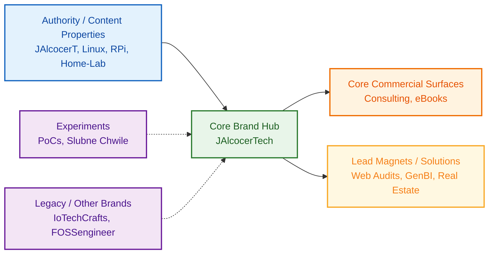

**TL;DR**

Ways to Ship

+++ [formbricks API](#programmatic-formbricks-via-api)

**Intro**

Over time, ive been doing quite a lot of tinkering.

After that, ive materialized the learnings for me and for others in different places.

From those [streamlit/pygwalker](https://jalcocert.github.io/JAlcocerT/ai-bi-tools/#pygwalker) web/apps [as pocs](https://github.com/JAlcocerT/Streamlit_PoC) that exceeded grafana expectations.

Because [using ChartJS](https://jalcocert.github.io/JAlcocerT/web-apps-with-flask/), [ApexChartsJs](https://jalcocert.github.io/JAlcocerT/keystaticcms-astrodb/#embedded-analytics) or [Shadcn charts](https://ui.shadcn.com/charts/pie#charts) is a quick option nowadays.

## PoC as a Service

What a catchy name, I wonder from where i took it from.

Anyways, I hope that your are not doing [PoCs around powerbi](https://jalcocert.github.io/JAlcocerT/about-powerbi-and-fabric/) or [looker](https://jalcocert.github.io/JAlcocerT/using-baml-to-query-a-database/#a-recap-on-da-for-interviews) at this point of time.

Why should you be limited to certain UIs?

Drag'n drops UIs are for humans who know about data, but not so much about dev.

Havent you ever laugh on those people using excel?

Well...

The idea is that when you've done so [many PoCs from scratch](https://jalcocert.github.io/JAlcocerT/learnt-while-building-web-apps/#creating-pocs-as-of-2026), there are certain patterns that can be operationalized and improved to the max.

All thanks to procedural knowledge, that can be stored as `.md` files.

In this one im assuming that you know how to [create and how to deliver effectively](#about-pro-delivery).

From [financial pocs](#are-you-free) to big data pocs: *it doesnt really matter*

```sh
git clone https://github.com/JAlcocerT/poc
#cd ./poc/aegis-freedom #https://aegis-freedom.pages.dev/
```

Does it look like `https://btc-powerlaw.pages.dev`?

Pure coincidence, nothing to do with the UI prompt around [power law](https://jalcocert.github.io/JAlcocerT/powerlaw-and-series-with-python/) :p

A `html` can do what?

Yea, [CSR](https://jalcocert.github.io/JAlcocerT/csr-and-js/) mortage calculations: *just in case you find REAL real estate clients for your [white labeled solutions](https://jalcocert.github.io/JAlcocerT/white-label-real-estate-solution/)*

```sh
cd ./real-estate-calculator #
```


[Telco](https://jalcocert.github.io/JAlcocerT/telecom-concepts-101/) and [speed tests](https://jalcocert.github.io/JAlcocerT/private-dns-with-docker/#speed-tests)? 

no problem:

```sh
cd ./poc/iperf
```


Oh, you were a BA/PM/PDM? 

Then [create like one](https://jalcocert.github.io/JAlcocerT/a-diy-boilerplate-to-ship/#why-creating-like-a-ba).

| Requirement | Specification | Clarification / Decision |
| :--- | :--- | :--- |
| **Frontend Framework** | | |
| **Styling/UI Library** | | |
| **[Backend](https://jalcocert.github.io/JAlcocerT/docs/dev/fe-vs-be/)/Database** | | |
| **[Authentication](https://jalcocert.github.io/JAlcocerT/docs/dev/authentication/)** | | |
| Others | Web Analytics / ads / Cal / Formbricks / ESP |  |

> The [human psyc](https://jalcocert.github.io/JAlcocerT/how-is-for-agents-what-and-why-for-you/) considered to bundle everything.

> > MoSCoW (Must have, Should have, Could have, Won’t have *aka Out of scope* )


## Presenting Ideas

Provide proper context: topic, UI/X, branding, audience, psyc factors...

* https://skills.sh/?q=presentation

I said this million times: slidevJS is great

just that probably between the moment I explained how to use it until now, you havent done so

so...you can skip it and go to **html**

agents are good enough to live them loose for ppt generation already

```sh
codex #npm install @openai/codex

#see the .md of this repo and the .png would you be able to create a presentation that a SMD would do to sell this idea to a big corp big data company?
```


If you work with people that are still [trapped at excel](https://jalcocert.github.io/JAlcocerT/blog/biz-grist/) for some strange reason

chances are that you will need **pptx** exports:

```sh
#slidev can also export pdfs
```

If thats the case, you can also consider `python-pptx` as seen [here](https://jalcocert.github.io/JAlcocerT/the-ideas-bucket-can-be-empty/#still-doing-ppts).

### More Tech Talks

It was about time to present [this GenBi solution](https://jalcocert.github.io/JAlcocerT/shopify-business-data-analytics/)

> I did not expected to make the [IoT x Big Data talk first](https://jalcocert.github.io/JAlcocerT/plants-102-and-iot/#big-data-tech-talk)

The one including [BAML](https://jalcocert.github.io/JAlcocerT/using-baml-to-query-a-database/#using-baml) and all the [Vite goodies](https://jalcocert.github.io/JAlcocerT/creating-a-generative-bi-solution/#baml-x-pgsql-x-vite-x-automatic-charts):



Actually it was a long route, also [here](https://jalcocert.github.io/JAlcocerT/custom-analytics-for-shopify/) and [ with Vite](https://jalcocert.github.io/JAlcocerT/creating-a-generative-bi-solution/#baml-x-pgsql-x-vite-x-automatic-charts)

```sh
git clone https://github.com/JAlcocerT/langchain-db-ui
cd langchain-db-ui/Z_PGSQL-GenBI
###make help
#git clone https://github.com/JAlcocerT/selfhosted-landing
#cd y2026-tech-talks/3-genbi-langchain
#npm run dev 
```

Slidev?

Why not just a **full powered html presentation** that I can bring later on at my web as branded asset?

```sh

```

Come on, with html we are able to do even videos [thx to hyperframes](https://jalcocert.github.io/JAlcocerT/about-motion-graphics/) :)


The learnings are stored...



### From HTML to Promo Video

Why not...(?)

yep, remotionJS/hyperframes again.

This is going to be similar to the repo-2-doc-2-video that I [show case here](https://jalcocert.github.io/JAlcocerT/oss-automatic-docs-and-tech-video/).

Because if we can generate pptx/html...why not a remotion video that explains it?

```sh

```

---

## Conclusions

For me, this has been a process of **PoC 2 brand** destillation.

Only to find that if you want to sell, your [offer must point toward outcomes](https://github.com/JAlcocerT/jalcocertech-services/tree/master/content/offers).


And have put together a HUB for my brand assets (finally):

```sh
git clone /jalcocertech-services
```

### Outro

People will never stop surprising us, and we got this interesting webapp CSR

That is also a bit trol: `https://lacharocracia.pages.dev/`

Remove creativity for llms/ agents when they are not so good yet at a task

let them be to surprise you when they are ready to roll :)

And most definitely, we once and for all outside excel... despite [having cc integration](https://marketplace.microsoft.com/en-us/product/saas/wa200009404?tab=overview), you can do quicker green fields full stack apps

### Better Weddings

I was making some upgrades to this one too...

But not the old-fashion way you think.

Recently I was writing that 'agents' being aware of proper price signals from the blockchain will be deciding which value is needed and delivering it.

As agents: those LLMs (text to text models) with proper harness so that they are self-prompted

Now, we have few projects that are aiming for the **zero-human enterprises**:

* https://github.com/paperclipai/paperclip
  * https://docs.paperclip.ing/start/what-is-paperclip
* https://companies.sh/docs
  * https://agentcompanies.io/

Whats the goal?

Manage business goals, not pull requests.

```sh
#git clone

```

### Who you gonna call

It was time to make a **consistent branding** for my main services, isnt it?

This inventory is the **Hardware Specification** of my brand. 

1. The Revenue Engine: "The High-Ticket Tier"

These are the properties that justify your $500/hr or $3,500/mo retainer. 

They solve "Expensive Problems."

| Property | Brand Role | The "B2B" Hook |
| :--- | :--- | :--- |
| **JAlcocerTech** | The "Office" | "I don't build features; I build predictable business outcomes via data architecture." |
| **GenBI Solution** | The "Lead Magnet" | **High Intent:** Targeting Shopify stores >$10k/mo. "Success-fee" model removes the risk for the CEO. |
| **Consulting** | The "Closer" | The $250/hr "Firewall" that filters for serious intent and high opportunity cost. |


2. The Authority Moat: "The Proof-of-Work Tier"

This is what makes you "Un-replaceable." You aren't just saying you know tech; you have 5 years of public timestamps proving it.

* **Home-Lab & Linux:** Your "Infrastructure Integrity." It proves you understand the "bare metal" and self-hosting, which is critical for privacy-conscious B2B clients (e.g., local AI/Ollama).
* **JAlcocerT:** The "Narrative Glue." This is your resume in motion.
* **FOSSengineer:** Your "Passive Authority." Even at $100/year, it’s a self-sustaining asset. 
    * **Repurpose Strategy:** Use the **Remotion/Video-as-Code** pipeline here to turn your GitHub repos into a YouTube "Broadcast Station" for Open Source. This feeds your top-of-funnel discovery.

3. The "Productization" Lab: "The SaaS/B2C Tier"

These are your experiments in **Unit Economics** and **Acquisition.**

* **Slubne Chwile:** This is your "Business Masterclass." You are learning Google Ads, Stripe, and B2B outbound (photographers). 
    * **The Real Asset:** The **Slubne Leads** pipeline. This is your "Infinite Lead Machine." As you noted, the moment you swap "Photographers" for "Shopify Store Owners" or "VP of RevOps," you have a high-ticket consulting engine.
* **Real Estate Whitelabel:** Treat this as a **"Parked Asset."** It proves you can ship a full-stack, AI-integrated product. It’s a portfolio piece, not a daily grind.


6. The "Non-Urgency" Audit

You mentioned being "tired of giving tech knowledge." This is a sign that you are ready to move from **Stage 2 (Optimization)** to **Stage 3 (Sovereignty).**

* **Action:** Stop adding "How-to" posts to Linux/RPi. 
* **Pivot:** Start adding "Why-to" and "ROI-of" posts to **Substack** and **JAlcocerTech**. 

The Final Peer-to-Peer Verdict

You have more "shipped" infrastructure than 95% of Senior Devs. 

You have a B2B outbound engine, a working Gen-BI AI tool, a live SaaS, and a 300-post library. 

**The only "Wall" left is your own belief that you are still the guy from 2014.** 

You have the framework to scrape companies hiring for $150k RevOps roles and offer them a $42k/year ($3.5k/mo) automated solution.

That’s a 70% discount for them and a high-margin, low-hour win for you.


```sh
#git clone /jalcocertech
git init && git add . && git commit -m "Initial commit: JAlcocerTech Services" && gh repo create jalcocertech-services --private --source=. --remote=origin --push

#this is the trick
git submodule add https://github.com/JAlcocerT/JAlcocerT.git external/JAlcocerT
git commit -m "Add JAlcocerT repo as submodule"
git clone --recurse-submodules https://github.com/JAlcocerT/jalcocertech-services.git

#git submodule add https://github.com/JAlcocerT/RPi.git external/RPi
# external/Linux
```

Guess what, im adding many things ive built [for reference as submodule](https://github.com/JAlcocerT/jalcocertech-services/tree/master/external)

```sh
#https://skills.sh/anthropics/skills/frontend-design

git clone https://github.com/JAlcocerT/jalcocertech

#tech talks 26 #jalcocertech-consulting.pages.dev
git clone https://github.com/JAlcocerT/selfhosted-landing #consulting.
#docker ps -a --filter "name=selfhosted-landing-prod"
npx wrangler pages deploy dist --project-name jalcocertech-consulting
#npm run build && npx wrangler pages deploy dist
#npx wrangler pages project delete your_project_name
```


There is been some [crq for re-designs](https://github.com/JAlcocerT/1ton-ebooks/blob/master/crq-redesign.md):

```sh
#jalcocertech-ebooks.pages.dev
git clone https://github.com/JAlcocerT/1ton-ebooks #ebooks.
#docker ps -a --filter "name=ebook"
#docker compose -f docker-compose.prod.yml up -d --build #via termix
#git clone https://github.com/JAlcocerT/obfuscate #diy.
```

Ive [reference quite a few of them](https://github.com/JAlcocerT/jalcocertech-services/blob/master/ops/repo-inventory.md), as you can imagine they matter for context:

1. https://webaudit.jalcocertech.com/ yea, the one to [show a problem](https://jalcocert.github.io/JAlcocerT/how-to-perform-free-web-audit/#programmatic-free-audits-for-websites) based on [this repo](https://github.com/JAlcocerT/poc_webs_magnet)




2. https://genbi.jalcocertech.com/ which I made [at this repo](https://github.com/JAlcocerT/poc_shopify)

```sh
#git clone https://github.com/JAlcocerT/poc_shopify
#git clone https://github.com/JAlcocerT/langchain-db-ui
```



3. https://realestate.jalcocertech.com/ the one a [whitelabeled here](https://jalcocert.github.io/JAlcocerT/white-label-real-estate-solution/)



4. RevOps

[A look back to your story](https://github.com/JAlcocerT/jalcocertech-services/blob/master/content/bios/z-my-story-gemini.md) is always a good way to spend time.


Nobody cares if you are using: windsurf, cursor, zed, gram, antigravity, kilo code, roo code, claude, codex, gemini cli, Goose Desktop....

Everyone just care about its own

and here is where the people go to reach their desired state:


  
  


From [value ladder](https://jalcocert.github.io/JAlcocerT/quick-weddings-poc/#my-current-value-ladder) to hub:



The “One Product / One Channel / Lead Magnet” assumes commercial intent and audience acquisition mechanics. 

Some repos are [authority assets, not direct offers](https://github.com/JAlcocerT/jalcocertech-services/blob/master/docs/go-to-market-templates.md). 
                                                                                    
For commercial properties, use:                                                   
| Element | Decision |                                                            
| :--- | :--- |                                                                   
| One Avatar | |                                                                  
| One Product | |                                                                 
| One Channel | Warm Outreach / Free Content / Cold Outreach / Paid Ads |         
| Lead Magnet | Strategy Type: , Delivery Method: |                               

```md
 amazing, could we now proceed with /external/Home-Lab and create the repos/       
  homelab.md and update the repo-inventory.md?
```

For authority/content repos, use:                                                 
| Element | Decision |                                                            
| :--- | :--- |                                                                   
| Primary Audience | |                                                            
| Core Topic | |                                                                  
| Primary Discovery Channel | Search / Social / Internal Linking / YouTube |      
| Business Role | Authority / Trust / Proof / Nurture |                           
                                                                                  
That way you keep the spirit without forcing a sales schema onto technical        
libraries.                                                                        
                                                                                  
So the answer is: yes, but this is not only for products, and it should be split  
into two templates:                                                               
                                                         
- commercial/offer template
- authority/content template

For ebooks the question is to[ gate or not to gate](https://www.cognism.com/blog/gated-vs-ungated-content-marketing)

This was a very interesting [repo distillation exercise](https://github.com/JAlcocerT/jalcocertech-services/tree/master/repos) to do with codex: *using `5.4` and all the weekly tokens :)*

```sh
#codex #/status
```

### About Pro Delivery

First thing first: know the context and where are you at these

P*V

are you part of the GM that delivers?

some R&D? marketing to attract/convert?

value eq ofc

Then...you are well aware of the context and can formulate it


---

## FAQ

1. If you are deploying via cloudflare tunnels, you can restrict the access of your web/apps to certain countries only.

> See how ive done so for some selfhosted services

2. From Engineering metrics to behavioral patterns (DORA!)

> because writting code is no longer the bottleneck

One thing is a vibe coder, another an engineering doing agentic driven SD

Human and Organization change management will definitely be a thing

similarly as introducing agile or devops was a thing

It'd help for you to be prepare with nice questions and write proper docs

3. Have you finally added business knowledge to the ebooks?

Yep, with help of

```sh
#uv add kreuzberg

foreach ($f in Get-ChildItem *.pdf) {
    uvx kreuzberg extract "$f" > "$($f.BaseName).txt"
}
```

* https://skills.sh/ratacat/claude-skills/annas-archive-ebooks


### Programmatic Formbricks via API

There is no good landing without a place for people to say sth.

Like opinions or provide their contact.

Going to formbricks UI is nice and you can do that.

Or ~~you~~ your agent can make surveys programmatically with the context of the full service.

```sh
#git clone /jalcocertech-services
#cd jalcocertech-services/forms
#uv init
```

Not convinced?

Well...then it seems that you dont have [a sistematic way to validate ideas](https://jalcocert.github.io/JAlcocerT/the-ideas-bucket-can-be-empty/#ideas-checklist) and prospects.

### Interesting Articles

* https://factory.ai/news/agent-readiness - teams that are already good at devops, ci/cd have a better foundation for the ai driven sdlc

### Are you Free?

We can derive a **Pure Ratio Formula** that ignores currency and absolute numbers entirely. 

How about abstracting life into percentages?

```sh
git clone /poc
cd poc/aegis-freedom/web && npm run dev
#npm run build && npx wrangler pages deploy out --project-name aegis-freedom
#make deploy
```


> See `https://aegis-freedom.pages.dev/`, the kpis are already added

yea, lets avoid hurting anyone :)

We can determine your "Financial Independence Factor" ($FI_f$)

To know if you are FIRE, we just need to see if your **Stock-to-Expense Ratio** is $\ge 25$ (the inverse of the 4% rule).

Let:

* $S_r = \text{Savings Rate}$ (The $\%$ of net income you save)
* $E_r = \text{Expense Rate}$ (The $\%$ of net income you spend, which is $1 - S_r$)
* $F_s = \text{Flow-to-Stock Ratio}$ (The ratio of your annual savings to your total assets)

We want to find the **Multiple of Expenses** ($M$) currently held in your "Stock."

The formula is:

$$M = \frac{S_r}{F_s \times E_r}$$

For example: 

$$M = \frac{0.90}{0.06 \times 0.10}$$
$$M = \frac{0.90}{0.006}$$
$$M = 150$$

In the world of FIRE, the "Safe" number is usually **25** (the 4% rule) or **33** (the 3% rule for ultra-safety). 

* **$M = 25$**: You are Independent *Standard FIRE- You have a 95% statistical chance of your money lasting 30 years.*
* **$M = 150$**: You are "Post-Economic." 

The "Universal Fire Formula"

If you want a single equation to test anyone (or yourself in the future), you are FIRE if:
$$\frac{S_r}{F_s \times E_r} \ge 25$$

If you spent 50% of your income ($E_r = 0.50$), that same 6% flow-to-stock would only give you a multiplier of **3**—meaning you’d only have 3 years of life saved.

### Where are you going?

This time, not the strategic life decisition

but the body traslation in the ~~[plane](https://jalcocert.github.io/JAlcocerT/2d-mbsd/)~~ space :p

because if you are free, how come you are not [in a trip](https://jalcocert.github.io/JAlcocerT/tech-for-a-trip/) (?)


  
  


How could i guessed that the v3 would be done just asking: https://github.com/JAlcocerT/Py_Trip_Planner/tree/main/poc-vibe-weather


Who knows

maybe you even get surprised with few [more libraries for charts](#charts-for-data-products), like shadcn charts or [RechartsJS](https://recharts.github.io/)

```sh
git clone https://github.com/JAlcocerT/Py_Trip_Planner
cd ./Py_Trip_Planner/poc-vibe-weather
#docker compose up --build

tmux new-session -d -s trip -n backend  -c "$(pwd)/backend"  "uv sync && uv run uvicorn app.main:app --reload --port 8000" \; \
  new-window          -n frontend -c "$(pwd)/frontend" "npm install --legacy-peer-deps && npm run dev" \; \
  attach
```


<!-- 
https://github.com/JAlcocerT/Py_Trip_Planner/blob/main/poc-vibe-weather/new-uix.png -->

### Charts for Data Products

Where are you in the plot ladder?

1. Matplotlib vs Plotly
2. PyGWalker with Streamlit
3. Chartjs vs ApexCharts
4. RechartsJS vs Shadcn Charts

What will you tell me next, that the [plots are rendered automatically](https://github.com/JAlcocerT/poc_shopify) as per your questions?