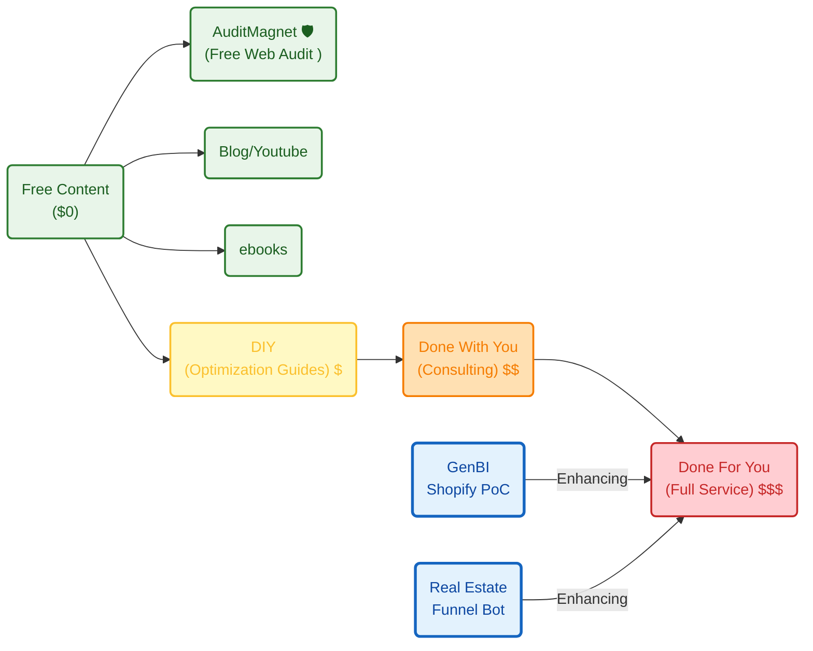

**TL;DR**





**Intro**

When was the last time you saw the fight club, matrix or Mr robot?

> a copy of a copy of a copy of a copy

single serving things


Within the x300:

```sh
# cd ./Home-Lab/forgejo
gh status #make sure to where you are logged (to bring github goodies to forgejo you will need this)
#http://192.168.1.2:3034/jalcocert/optimum-path
#make migrate-repo REPO_OWNER=JAlcocerT REPO_NAME=optimum-path
#make add-collaborator NEW_USER=hermesagent REPO_OWNER=JAlcocerT REPO_NAME=optimum-path
# 
make migrate-repo REPO_OWNER=JAlcocerT REPO_NAME=leads-slubnechwile
make add-collaborator NEW_USER=hermesagent REPO_OWNER=JAlcocerT REPO_NAME=leads-slubnechwile #this will require apify/firecrawl keys later on
#make list-user-repos NEW_USER=hermesagent #now showing x5!
```

Then in the Pi with Forgejo connected:

```sh
git clone http://192.168.1.2:3034/JAlcocerT/leads-slubnechwile #hermesagent changeme123
tmux ls
#tmux new -s claude-leads
#mkdir leads
cd ./leads
#claude --dangerously-skip-permissions
```

Then:

```sh
make fetch #make help
make enrich
make export #nano ./data/
make sample
```

This remind me [about TooN](https://jalcocert.github.io/JAlcocerT/ideas-to-execution/#json-to-toon) for prompts.

```sh
#git clone forgejo-home:jalcocert/eda-f1.git
```

Let the magic start:

```sh
claude #/web-setup #https://claude.ai/code/onboarding
```


## The service to rule them all

It was just about bringing these learnings to `jalcocertech-services`:

* https://github.com/JAlcocerT/leads-slubnechwile
* https://github.com/JAlcocerT/make-landing

```md
i want the alex hormozi skill to rate whats useful from this repo    
as a personal lead getter and enrich, is this all fluff? or can sth
be use to create a blueprint?
```

> Yea, ive destilled Hormozi videos recently via `./poc/yt-distill` ;)

> > Founders write strategy decks, ship nothing. Dont be a founder.

---

## Conclusions

Recently ive seen...

...85 people in a call celebrating shipping a POC in 2 weeks.

Outside this room, single developers with personal agent setups are shipping equivalent work in **2 days**.

The internal velocity feels fast *relative to before*, not relative to what's actually possible.

The gap isn't the tooling. The gap is the corporate substrate.

**Now → 6 months (mid 2026)**

- Junior dev / data-analyst hiring freezes deepen. Big 4 analyst intakes already cut.
- Personal-velocity gap widens — solo devs with multi-agent setups ship 10x while enterprise still gates tools.
- Internal POCs proliferate.

**24 → 36 months (2028)**

- Enterprise products from creative spike deployed at scale → **clear-I/O white-collar cull broadens**: accountants, ops, admin, mid-analytics, customer service. The "fluff jobs not worried today" wake up.
- Services firms compress to a needle: partners + AI-tool resellers + regulatory work survive, the rest gone.
- Munich Re-style protected industries show first PM compression (still slower than IT services).
- AI literacy becomes universal → **creative-dev moat erodes**. The buffer phase ends.

Expert consulting — for those who value getting outcomes right the first time *and before the tsunami arrives* 👇


  
  


1. Two windows to capitalise (2026 → mid-2028) — champion role + brand/ship as complementary plays with shared closing date.

2. Macro hedge (the third failure mode) — currency-debasement risk, policy playbook, asset implications, and the three-hedge framing (employer / career / currency).

Closer: "Most people hedge zero of three. Hedging one is good. Hedging all three is the actual position."

### The only way Im shipping now

This is beyond [a good UI prompt](https://jalcocert.github.io/JAlcocerT/ideas-to-execution-with-dao/#for-vibe-coders).

Also more than a [good initial skeleton](https://jalcocert.github.io/JAlcocerT/how-to-perform-free-web-audit/#programmatic-free-audits-for-websites) with docker, make and [whatever atf goodies](https://jalcocert.github.io/JAlcocerT/diy-landing-boilerplate/#what-should-a-landing-have) you listed.

Must have [esp connected to pb ](https://jalcocert.github.io/JAlcocerT/diy-landing-boilerplate/#tested-few-esp)or just bring your own DRIP

> yea, [pocketbase](https://github.com/JAlcocerT/poc_webs_magnet/blob/master/.env.sample) does the lead trick

```sh
#git clone /jalcocertech-services
cd ./jalcocertech-services/z-shipping-blueprint
```

Layer 0: Capture infra          ← YOU HAVE THIS
Layer 1: ICP (who)              ← MISSING
Layer 2: Offer (Tier 1/2/3)     ← MISSING
Layer 3: Lead magnet + VSL      ← MISSING
Layer 4: Enrichment + nurture   ← MISSING
Layer 5: Sales process / book   ← MISSING

Hormozi rigor now: Shape ✓ MAGIC ✓ Value Eq ✓ Without-pattern ✓ Damaging admissions ✓ 

Value Stack:  ✓ Guarantee typed ✓ VSL ✓ Lead magnet ✓ Risk-reversal ✓.

0. Define a product/service
1. Get a Landing: cal+forms
2. Outreach...

Its not just to get the leads

```sh

```

But to understand the different treat on [how to cold vs warm](https://github.com/JAlcocerT/make-landing/tree/master/z-hormozi-actions), after [getting feedback](https://github.com/JAlcocerT/make-landing/blob/master/z-hormozi-feedback.md).

Just [start today](https://github.com/JAlcocerT/make-landing/blob/master/z-starting-emails.md) sending mails:

```sh
#https://github.com/JAlcocerT/make-landing/tree/master/z-hormozi-actions
#https://github.com/JAlcocerT/make-landing/blob/master/mjml-email/send_mjml_api_email.py
```

Dont get [overwhelmed](https://github.com/JAlcocerT/leads-slubnechwile/blob/main/zzz-hormozi-actionplan-leadarchitect.md#q-im-overwhelmed-where-do-i-start-today)

This is [the action plan](https://github.com/JAlcocerT/leads-slubnechwile/blob/main/zzz-hormozi-actionplan-leadarchitect.md#phase-1--start-the-14-day-clock-day-1-90-min)



1. Get a domain
2. Get a workspace `https://workspace.google.com/`

* `https://admin.google.com/`

Dont forget to add these DNS:

```md
SPF:    Host: @            TXT  "v=spf1 include:_spf.google.com ~all"
DMARC:  Host: _dmarc       TXT  "v=DMARC1; p=quarantine; rua=mailto:dmarc@DOMAIN; pct=100; adkim=s; aspf=s"
```



> `https://mxtoolbox.com/`


### Destilling read books

I got the most accurate diagnostic: Stage 1 reading on a Stage 4 shelf = procrastination via knowledge accumulation.

> "Some of the best money is deciding to stop spending bad money." — same with reading time.

- **Premature pivot** — every new book seems like the missing piece. 


The missing piece is usually applying the previous book harder



| Model | Source | Where it bites in YOUR biz |
|-------|--------|----------------------------|
| Reciprocity / Scarcity / Authority / Social Proof / Commitment / Liking / Unity | Cialdini | Every cold email, every offer page |
| Calibrated questions ("How am I supposed to do that?") | Voss | Every sales call objection |
| Loss aversion (2× pain of equal gain) | Kahneman | Pricing / guarantee design |
| 80/20 → 64/4 → 51.2/0.8 | Koch | Customer / channel / SKU pruning |
| Skin in the game | Taleb | Performance pricing, founder-led sales |
| Convex bets (asymmetric upside, capped downside) | Taleb / Duke | Offer testing, channel testing |
| Survivorship bias / halo effect | Rosenzweig | Don't copy founder stories blindly |
| Default effect / nudge | Thaler | Onboarding flow, default tier |
| Memento mori / amor fati | Stoics | Operator psychology when revenue dips |
| Scale + control = wealth | DeMarco | Filter on every new biz idea |

**10 models. That's the operating playbook from 100 books.**


To destill operator knowledge for actions, ive [put this together](https://github.com/JAlcocerT/jalcocertech-services/blob/master/docs/destilled-ebooks/z-read-books-notes/z-hormozi-curated.md)


- **Offers** — make it so good they feel stupid saying no. Value Equation: (Dream × Likelihood) ÷ (Time × Effort).
- **Leads** — Core Four (warm, content, cold, paid) + Lead Getters (referrals, employees, agencies, affiliates). Pick one, commit 12-24 mo.
- **Money Models** — sequence offers (attraction → upsell → downsell → continuity) so 30-day profit ≥ CAC.

---

## FAQ

### What PoCs have you done YTD?

Not counting small things like: `https://aegis-freedom.pages.dev/` nor `https://the-poincare-lab.pages.dev/` nor `https://btc-powerlaw.pages.dev/`

Nor the services organization.

1. Telecom PoCs - RDKb & iperf3

```sh
cd ./poc/iperf
```

Thethings you learn when tinkering with DNS:https://jalcocert.github.io/JAlcocerT/private-dns-with-docker/#speed-tests


2. GenBi solutions

3. Make PM/Pdm's life harder: *a [PoC concept](https://jalcocert.github.io/JAlcocerT/poc-103/#helping-pms-and-pdms) to help them*


4. Farm Analytics `iotsolutions`: PicoW/ESP32 with DHT11/22 to MQTT

5. Go solar and Aerotermia: `energysolutions`

One [done here](https://jalcocert.github.io/JAlcocerT/heat-transfer-ice/#solar-thermal-power) that you can try anytime: `https://go-solar.pages.dev/`


* Other that you can get some of my time:


6. Electronics and...MBSD too

```sh
#tmux new -s claude-mbsd
#tmux attach -t claude-electronics #http://192.168.1.2:3034/hermesagent/electronics-101
claude --dangerously-skip-permissions
```


> You bet I did `https://multibodysystemsdynamics.com/`

7. Coming up: Telecom PoC - AD

```sh
cd ./poc/telco-geo-anomaly-detection
#npx wrangler pages deploy dist --project-name=telco
#make deploy PROJECT=my-name
```

> Surprise, this was taken by...a game (?) `https://telco.pages.dev/`

> > So i just got <https://telco-geo-anomaly.pages.dev/>


### Which Tech Talks have you done YTD?

The last one, [around iot x big data](https://jalcocert.github.io/JAlcocerT/plants-102-and-iot/#big-data-tech-talk) with the dht22

In total I think its around 4 so far.


### Keep Stop Start - Doing

More real engineering *with agents*


 

 


 What you can do with the Makefile


```sh
cd trajectory-optimization

make help              # list all targets  make pending           # animation + setup study (the in-flight pair)
make animation         # just the Phase-4 lap MP4  make setup-study       # just the brake/mass/CoG sweep
make practice-plan     # the actual deliverable — corner targets
make phase4            # just the OCP at user-match calibration  make all               # everything (4-6 hours)
```

### Whats it is ACV 

ACV = Annual Contract Value.

Money one customer pays per year.

Example:
- Client pays $500/mo → ACV = $6,000
- Client pays $2k one-time + $300/mo retainer → ACV = $5,600
- Wedding photographer charges €1,500 bundle once → ACV = €1,500

Why it matters in playbook:

"ACV >$3k" rule = your target client's CUSTOMERS must pay them >$3k/yr each.

Reason: if their customer = $500/yr, they can't afford to pay you $3.5k/mo for outbound.

Math breaks.

┌──────────────┬────────────────────────────────────┐
│ Client's ACV │       Can pay you $3.5k/mo?        │
├──────────────┼────────────────────────────────────┤
│ <$3k         │ No. 1 deal barely covers your fee. │
├──────────────┼────────────────────────────────────┤
│ $3-10k       │ Maybe. Need 5+ closes/yr to ROI.   │
├──────────────┼────────────────────────────────────┤
│ >$10k        │ Yes. 1-2 closes = 3-10x ROI.       │
  └──────────────┴────────────────────────────────────┘

Hormozi version: "Their unit economics need to support your fee."

Related terms you'll see:

- MRR = Monthly Recurring Revenue (your $3.5k/mo retainer × clients)
- LTV = Lifetime Value (ACV × years they stay)
- CAC = Customer Acquisition Cost (what it costs you to close 1 client)

### Eat your own dog food

Eat your own dog food = use your own product/service as a customer.

Origin: 1980s tech — Microsoft VP forced engineers to run their own software internally before shipping. 

If it's not good enough for you, not good enough to sell.

Hormozi version: "your outbound IS your demo."

If you sell outbound to B2B SaaS, your own outbound campaigns = the proof. Prospects see your
cold email, hire you because the email worked on them.

If you sell consulting, your own biz growth = the case study.

If you sell weight-loss coaching, your body = the billboard.

Why it matters for biz:

1. Skin in the game (Taleb link) — you eat the same risk you sell
2. Free case study — your own metrics = the testimonial
3. Credibility moat — competitors selling "outbound for SaaS" who don't run outbound = exposed   
instantly
4. Product feedback loop — you find bugs/gaps before customers do
5. Damaging admissions earned — you can say "I tried this exact thing, here's where it broke"    
because you actually did

The anti-pattern Hormozi attacks:

> "The curse of modernity is people better at explaining than doing." — Taleb

Coaches who don't run businesses. 

Marketing agencies whose own marketing is broken.

Sales trainers who haven't sold in 10 years.

Course-sellers whose only revenue is the course.

Test for your biz: name your top 3 services.

For each, are YOU your own customer?

If no, either start using it or shut up about it.

For your TSL Poland Agentic RevOps idea (per your agentic-revops-tls.md): you should be using your own agentic outbound to acquire your first 5 TSL clients. 

Those agents = your demo.

Their booking calendars = your case study.

> "If you wouldn't pay for it, why should they?"