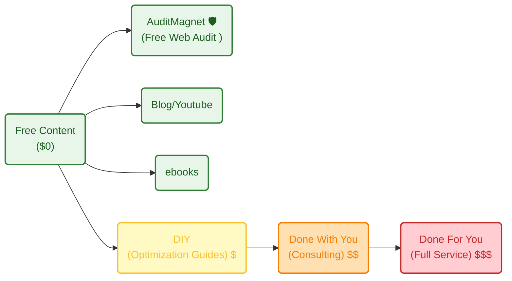

**Tl;DR**

Hora de mercantilizar mi vida otra vez :(

+++ [Inspiring Apps](#apps-that-inspire)

**Intro**

A quick rewrite and improvements of the previous slubnychwile *for B2B*.

Because Ive been writting about multi-body mechanism lately

And surprise: those niche posts/ideas dont get as much traction as posts as this one, where I solve a need that people have

Surprising


  
  



```sh
git clone https://github.com/JAlcocerT/slubne-chwile-y26
```

You can build around what you have already create with: https://buildermethods.com/agent-os

* https://github.com/buildermethods/agent-os

> MIT | Agent OS is a system for injecting your codebase standards and writing better specs for spec-driven development.

```sh
#git clone https://github.com/JAlcocerT/slubnechwile-chwile-y26
#https://github.com/JAlcocerT/slubnechwile
#https://github.com/JAlcocerT/Flask_SlubnyChwile
git init && git add . && git commit -m "Initial commit: Starting slubnechwile with claude" && gh repo create slubnechwile-chwile-y26-claude --private --source=. --remote=origin --push
```



  



## Rewritting SlubneChwile

Because for the initial version I used an astro theme and made it a web app.

I mean here and here

But...[claude code](https://code.claude.com/docs/en/cli-reference) (Opus 4.6) has 1M tokens.

What if i tell it to understand the logic...

and re-implement it with a cool **modern Vite UI**?


  
  


```sh

git clone https://github.com/JAlcocerT/slubne-chwile-y26 #https://www.slubnechwile.com/
#git pull
#cd slubne-chwile-y26/slubnechwile
```

And now: *time to do more calls to B2B :)*

> Just sell to survive (Grant Cardone)

You just need [eyes](https://jalcocert.github.io/JAlcocerT/bring-eyes-to-your-saas/) and be clear that [the why and what are your responsability](https://jalcocert.github.io/JAlcocerT/how-is-for-agents-what-and-why-for-you/) for now.


Things are moving into a direction where human are the blockers:

* https://github.com/HKUDS/CLI-Anything

> CLI-Anything: Making ALL Software Agent-Native

* https://github.com/agentscope-ai/CoPaw

> Your Personal AI Assistant; easy to install, deploy on your own machine or on the cloud; supports multiple chat apps with easily extensible capabilities.

* https://github.com/openai/symphony

> Symphony turns project work into isolated, autonomous implementation runs, allowing teams to manage work instead of supervising coding agents.


### The prompts side


### The business side

As seen with the COO self-diagnostic, the execution/delivery was fully already, so I can spend all the time on the **[GROWTH BET]**.

https://jalcocert.github.io/JAlcocerT/custom-marketing-analytics/#2-three-strategic-paths-forward

So was the [units economics of the QR web/app storage](https://jalcocert.github.io/JAlcocerT/custom-marketing-analytics/#1-the-unit-economics-of-qr-guest-photos)


### The Agentic Operations

This is a growth experiment.

The delivery is clear, lets just focus on ATTRACTION & CONVERSION.


For that, I chose google


For that, uptime, logs analysis, even individual sessions...can improve the app

But I dont want to do it, I want the agents to do this.

---

## Conclusions



  
  



```sh
git clone
#make help
```

### Everything Required

1. The product - A nice webapp *vibe coded with Claude + Stitch this time*
2. The contact list for B2B - Say thanks to APIFY and this post + setup
3. A telephone
4. Time / energy / willingness to call

---

## FAQ

### What about B2C?

Its a different story and you have to configure the offer accordingly.

Account for the price and risk sensitivity.

Dont waste add money, get emails and people to try, then...DRIP.

> The magic happens at [this gha workflow](https://github.com/JAlcocerT/slubne-chwile-y26/actions/workflows/drip.yml)

### My Current Value Ladder

The take it or leave it form is looking nice:



```sh
whois leadarchitect.org| grep -i -E "(creation|created|registered)"
#nslookup realestate.jalcocertech.com
dig slubnechwile.com
```

### Apps that Inspire

1. ~~DocuSign~~ DocuSeal
2. Tiinyhost

Whats interesting?

That you can get inspired by these webs UI/X with google stitch nowadays.

Inspiring apps: all those `pwa` like that just...work

* https://bentopdf.com/index.html
* Docuseal
* it-tools
* Vert - https://jalcocert.github.io/JAlcocerT/wasm/
* Pairdrop...


* https://github.com/scio-labs/inkathon
 
Full-Stack DApp Boilerplate for Substrate and ink! Smart Contracts 


How about building like they've done?