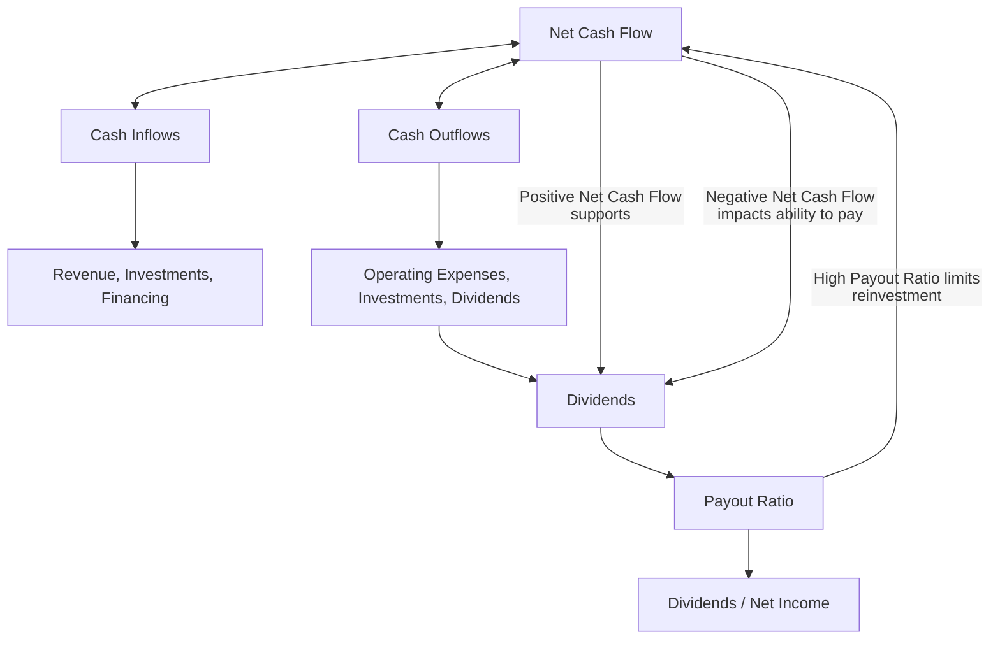
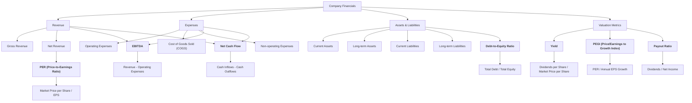

**TradFi** - Or Traditional Finances, as I saw recently on redit.

Wouldnt it be great to go out the *typical google sheet* and have a great UI/X when looking at your finances?



The project initially, [**source code**](https://gitlab.com/fossengineer1/py_stocks) - PyStocks.
But then vibe coded it [here](https://github.com/JAlcocerT/Py_Stocks) 💻 


If all of these sounds familiar...


  
  



It is because it is actually familiar.

Sometime ago I was doing similar Project in **R Shiny** 💻


  
  



And it was not all about yahoo finance back then...



* [PriceR](https://jalcocert.github.io/JAlcocerT/r-priceR-package-guide/#what-is-pricer-about)
* [QuantDL](https://jalcocert.github.io/JAlcocerT/r-quandl-package-guide/#how-to-use-the-quandl-package) - [API](https://docs.data.nasdaq.com/v1.0/docs/getting-started) required
* [QuantMod](https://jalcocert.github.io/JAlcocerT/r-Quantmod-package-guide/#how-to-use-the-quantmod-package)
* [yfR - yahoo finance in R](https://jalcocert.github.io/JAlcocerT/r-yfR-package-guide/#the-yfr-package)



But this time, I thought to keep a **simpler data architecture** and *just* rely on [yfinance queries](#the-data-source).

From [google sheets](https://jalcocert.github.io/JAlcocerT/R-Stocks/#google-sheets-tricks) we have the possibility to query, very simply the price/PER/EPS of a stock:

```sh
=SPARKLINE(GoogleFinance("NYSE:KO"; "price"; HOY()-60; HOY()))
=GoogleFinance("NYSE:KO")
=SI.ERROR(GoogleFinance("NYSE:KO";"pe");999)
=GoogleFinance("NYSE:KO";"eps")
```

**The Idea:**

Business Side:
- To feed a portfolio
- To see consolidated information
- To see value and dividend % CAGR for a past period
- To let the user play with future what if scenarios (given just percentages of growth for those parameters)
- Reply to typical [questions](#stock-questions---answered)

Tech Side:

To see whats the best way for me to authencate users: clear/supabase/logto...

* https://clerk.com/docs
* https://github.com/clerk/clerk-sdk-python/blob/main/README.md

* https://www.reddit.com/r/Supabase/comments/1dvabn6/what_is_the_best_solution_to_use_supabase_auth/
* https://www.reddit.com/r/nextjs/comments/1bvda9r/officially_hate_supabase_auth/?rdt=40537
* https://www.reddit.com/r/Supabase/comments/xaxecr/authentication_with_supabase_is_easy_almost/


## PyStocks

There are cool apps outthere: https://openalternative.co/maybe

But I wanted to build mine and learn something more along the way.

The structure looks like:


  
    
    
      
      
      
        
        
      
    
    
      
      
    
  


From the MultiChat and Aissistant Ive tried to bundle streamlit features on different pages.

So that the main `app.py` can be very simple/modular and clean.

### The Data Source

This time is going to be [yfinance](https://jalcocert.github.io/JAlcocerT/r-yfR-package-guide/) based. 

Im aware that there are many APIs around: https://github.com/public-apis/public-apis

https://www.youtube.com/watch?v=aUtFn-qS7Xk

But...That's it!

> Less is more

Or so some say.

Anyways, we will need this package: https://pypi.org/project/yfinance/

```sh
pip install yfinance==0.2.61
```

And as I dont really like building stuff on data source I dont control: I added the possibility to saved into sqlite the pulled data.

> You just pull once *philosophy*

### User Interaction

The user will potentially be curious about that 'what if' for its assets.

So why not giving the possibility to feed a sample Google Sheet with its sharable link to the app?

### The Charts


I wanted to have a simple growth comparison (and actually the vibez added this cool normalized view)


#### PyGWalker

How about giving the possibility to *build your own visuals*?

That's where the pygwalker use case comes in to any streamlit app.

### AI Features for PyStocks

This is very yolo mode.

Do you really want to make these decions based on a LLM?

**Nooot the best idea.**

But since grok allows for real time information retrieval since not long ago, that can be very interesting to see.

> We could also chat with the pulled financial data thanks to [LangChain](https://jalcocert.github.io/JAlcocerT/how-to-use-rags-with-python/#exploring-langchain)

>> Chat with a DB applied for finance - <https://github.com/JAlcocerT/Data-Chat/tree/main/LangChain/PyStocksDB>



I was exploring on [this post](https://jalcocert.github.io/JAlcocerT/how-to-chat-with-your-data/#chat-with-a-db-with-langchain) and [related repo](https://github.com/JAlcocerT/Data-Chat/tree/main/LangChain), how to use **LangChain as RAG with OpenAI API so that given a DB**, we can use Natural Language to interact with it.



---

## Conclusions

This goes few steps further than the previous [project RStocks](https://jalcocert.github.io/JAlcocerT/R-Stocks/).


  
  


And definitely much more than [FlexDashboards](https://jalcocert.github.io/JAlcocerT/guide-r-flexdashboards-in-github-pages/) in R.

Wouldnt this be a cool companion for a website, as a lead magnet?

Even as a subscription based model, say [7$/month](https://www.cazadividendos.com/recursos/indice/) to have access to such tool and historical info?

People are on *money making mode* on amazon ebooks with much simpler concepts.

And with webapps like: 

* https://www.simplysafedividends.com/
* https://www.dividenddata.com/ This one uses Shiny!
  * You can also see historical dividends for companies at [nasdaq](https://www.nasdaq.com/market-activity/stocks/pep/dividend-history)


---

## FAQ 

ETF vs Dividends?

> Why not both with DGRW?


### Selfhostable Apps

1. https://github.com/maybe-finance/maybe

>  The personal finance app for everyone 

2. https://github.com/firefly-iii/firefly-iii

>  Firefly III: a personal finances manager 

3. https://github.com/actualbudget/actual

> MIT |  A local-first personal finance app 

### Stock Questions - Answered

* Stocks overperforming SP500 in xyz period / last xyz months

* YoC when I stopped investing at a certain point of time (Dave van Knapp made a all in approach, but it can serve to see what happens after a DCA strategy)

In the meantime, I got to understand [how **French amortization** works](https://jalcocert.github.io/JAlcocerT/python-real-estate-mortage-calculator/#french-amortization-101) (typical for mortage payments).

See, the **French amortization** formula: $A = P \times \frac{r(1 + r)^n}{(1 + r)^n - 1}$.

I also got time to compare **different SP500 ETFS performance**:

* `LON:SPY5` ([SPY5.L](https://finance.yahoo.com/quote/SPY5.L/)) dist usd 0.09% IE00B6YX5C33 [Link to JustETF profile](https://www.justetf.com/es/etf-profile.html?isin=IE00B6YX5C33#dividendos)
* `LON:VUAA`, acc usd 0.07% IE00BFMXXD54 [Link to JustETF profile](https://www.justetf.com/es/etf-profile.html?isin=IE00BFMXXD54#bolsa-de-valores)
* In GSheets, you have the SP500 index under the name `INDEXSP:.INX`


### Interesting Pkgs I got to learn

* Data Load Tool - https://github.com/dlt-hub/dlt

> the open-source Python library for data loading

* How to inspect a SQL DB with AI (without knowing much about it...)
  * https://github.com/alex-wolf-ps/dbchatpro/tree/main
  * https://www.youtube.com/watch?v=REw3y_Jv3Ig&t=0s
  * Paid alternative - https://www.outerbase.com/




Revenue:

- **Gross Revenue**: Total income from sales.
- **Net Revenue**: Gross revenue minus returns and discounts.

Expenses:

- **Operating Expenses**: Costs incurred during normal business operations.
- **COGS (Cost of Goods Sold)**: Direct costs of producing goods.
- **Non-operating Expenses**: Costs not related to core operations (e.g., interest payments).

Assets & Liabilities:

- **Current Assets**: Cash or items convertible to cash within a year.
- **Long-term Assets**: Assets held for more than a year (e.g., machinery).
- **Current Liabilities**: Debts due within a year.
- **Long-term Liabilities**: Debts payable over a longer period.

Valuation Metrics:

- **EBITDA (Earnings Before Interest, Taxes, Depreciation, and Amortization)**: Indicates operational profitability.
- **Net Cash Flow**: Difference between cash inflows and outflows.
- **Debt-to-Equity Ratio**: Indicates the level of financial leverage.

- **Yield**: Dividend return relative to share price; calculated as `Dividends per Share / Market Price per Share`.
- **Payout Ratio**: Proportion of earnings paid out as dividends; calculated as `Dividends / Net Income`.

- **PER (Price-to-Earnings Ratio)**: A valuation measure comparing share price to earnings per share.
- **PEGI (Price/Earnings to Growth Index)**: PER adjusted for expected earnings growth; calculated as `PER / Annual EPS Growth`.
- **PEGY (Price/Earnings to Growth and Yield)**: PER adjusted for both expected earnings growth and dividend yield; calculated as `PER / (Annual EPS Growth + Dividend Yield)`.

**Financial Terminology Explained**

* **P/E Ratio (PER):** The P/E Ratio indicates how much investors are willing to pay for each dollar of a company's earnings.
* **Forward P/E Ratio (Forward PER):** The Forward P/E Ratio is an estimate of a company's P/E ratio using forecasted future earnings, offering a forward-looking valuation.
* **Forward Yield (Forward Yield PER):** Forward Yield estimates the expected dividend yield of a stock over the next year based on projected future dividends.
* **P/E Last 5Y Percentile:** This metric shows where a company's current P/E ratio stands relative to its P/E ratios over the past five years, helping assess if it's trading high or low historically.
* **5Y Avg P/E:** The 5-year Average P/E is the average of a company's P/E ratio over the last five years, providing a benchmark for its typical valuation.
* **Yield Growth 1Y/5Y/10Y:** This term measures the percentage increase in a company's dividend yield over one, five, or ten years, showing its history of growing payouts.
* **Payout Ratio:** The Payout Ratio indicates the percentage of a company's earnings paid out to shareholders as dividends, reflecting how much profit is returned versus reinvested.
* **PEG Ratio (PEG):** The PEG Ratio compares a company's P/E ratio to its expected earnings growth rate, used to determine if a stock's price is reasonable relative to its growth potential.
* **PEGI:** PEGI (Price/Earnings Growth Index) is a less common variation of the PEG ratio, sometimes incorporating additional factors beyond just earnings growth.









**Net Income** is not the same as **Net Cash Flow**.

They are related but measure different aspects of a company's financial health:

**Net Income**:
- Represents a company's **profit or loss** during a specific period.
- Found on the **income statement**.
- Includes both **cash and non-cash items**:
  - Revenues minus all expenses, including non-cash expenses like depreciation and amortization.
  - Accrual-based (recognizes income/expenses when they are earned/incurred, not when cash changes hands).

**Net Cash Flow**:
- Measures the **actual cash movement** into and out of the company during a specific period.
- Found on the **cash flow statement**.
- Focuses on **cash inflows and outflows**, ignoring non-cash items!.
- Composed of three parts:
  1. **Operating Cash Flow**: Cash generated from core business activities.
  2. **Investing Cash Flow**: Cash used in or generated by investments in assets.
  3. **Financing Cash Flow**: Cash used for or received from debt, equity, and dividends.


| **Aspect**          | **Net Income**                                   | **Net Cash Flow**                                |
|----------------------|--------------------------------------------------|-------------------------------------------------|
| **Definition**       | Profit or loss from operations (accounting basis)| Actual cash generated or used (cash basis)      |
| **Non-cash items**   | Includes non-cash items (e.g., depreciation)     | Excludes non-cash items, tracks cash only       |
| **Timing**           | Accrual-based accounting                        | Tracks when cash is received or spent           |
| **Use**              | Measures profitability                          | Measures liquidity and financial flexibility    |

---

**Relationship**:
Net Income is often the starting point for calculating **Operating Cash Flow**.

Adjustments are made to add back non-cash expenses and account for changes in working capital. 


Both metrics are important:
- **Net Income**: Indicates profitability.
- **Net Cash Flow**: Shows the company's ability to generate cash and stay solvent. 



A [diagram](https://jalcocert.github.io/JAlcocerT/docs/coolresources/diagrams_ppts/) is worth more than xyz words, right?



### How to use AI LLM Agents to get posts with this program as Source


I was testing Automatic [Posts creation with AIssistant here](https://jalcocert.github.io/JAlcocerT/scrap-and-chat-with-the-web/#summarize-github-readmes) and with this related repo.


### Interesting Software for Finances


`Financial Freedom` is an open-source financial management tool.

* https://github.com/serversideup/financial-freedom
* It serves as an alternative to commercial apps like Mint and YNAB.



This project addresses privacy concerns by allowing users to **self-host their financial data**.

Users can run the application on any device with Docker support, enhancing control over their financial information.

Key features:

- **Supports any bank**: Integrate with various banking institutions.
- **Private synchronization**: Ensures data privacy during synchronization.
- **Self-hosting**: Run on AWS, Digital Ocean, or even Raspberry Pi.
- **Budgeting tools**: Helps in managing cash flow and setting budgets.
- **Global currency support**: Manages finances in multiple currencies.

The project is actively being developed, inviting community involvement through contributions.

> `Financial Freedom` empowers users to manage finances privately and securely.




Similar projects include **Firefly III** and **GnuCash**.

* https://github.com/CodeWithCJ/SparkyBudget

> Simple Budgeting, Powerful Results 

### Interesting Financial Stories

These are a collection of **finance related posts/sites** that have been somehow interesting for me to read:

* https://dividendsandincome.com/author/dave-van-knapp/ - Interesting story about someone who made a one time investment 15y+ ago
* https://dividendsandincome.com/2024/04/08/how-my-dividend-growth-portfolios-income-keeps-expanding/

* https://engineeredportfolio.com/

* https://wtfhappenedin1971.com/
* https://whycryptocurrencies.com/
* https://libreportfolio.fyi/

* https://curvo.eu/


You can create an [ebook like this](https://www.amazon.es/stores/Marco-Garrido/author/B0BW46JD83?ref=ap_rdr&isDramIntegrated=true&shoppingPortalEnabled=true) one with AI.


How exactly?

With an [**AIssistant**](https://jalcocert.github.io/JAlcocerT/ai-useful-yet-simple/) or with [agents](https://jalcocert.github.io/JAlcocerT/ai-multi-agents-frameworks/) / [MCP](https://jalcocert.github.io/JAlcocerT/ai-understanding-mcp-framework/) 

* https://www.visualcapitalist.com/top-sp-500-stocks-return/

### Interesting Financial Data WebSites

* https://tecalculo.com/en/compound-interest-calculator

* https://www.multpl.com/- It has Sp500 PE Ratios, 10y treausry rates...

* https://www.wallstreetmojo.com/trailing-pe-vs-forward-pe/

* https://uk.finance.yahoo.com/quote/RIO.L/
  * https://finance.yahoo.com/sectors/basic-materials/
  * https://es.finance.yahoo.com/quote/0P00012PP6.F

* https://www.digrin.com/stocks/detail/IDUS.L/

- https://stockanalysis.com/ esta es buena para stocks, etfs no
  - https://stockanalysis.com/stocks/rio/dividend/

- https://www.justetf.com/uk/ esta es un screener de ETFs muy bueno, además están todas las variantes monetarias de cada ETF

- https://www.digrin.com/stocks/detail/IDUS.L/
  - Interesting payout ratio, dgr,...

- https://divvydiary.com/en/?via=elisa&gad_source=1&gclid=Cj0KCQiA0fu5BhDQARIsAMXUBOIN8XXGkoEZZbfhufMr55Y2kSIuAGXDP4Lb1LYgLlRMnezpTUl2tkAaAp2kEALw_wcB esta la encontré el otro día, ofrece datos históricos de stocks y algún ETF (FUSD te lo da pero IDUS no), pero mola que me da el ISIN rápido, entonces veo rápidamente en qué país cotiza
- https://tools.mhinvest.com/mhichart una web app que tiene una idea muy parecida a la que pensamos en su momento, pero no considera seguir metiendo gasolina, parte de una cantidad inicial y listo.

* https://www.marketbeat.com/
  * https://www.marketbeat.com/stocks/NYSE/CVX/dividend/

* https://www.nasdaq.com/market-activity/stocks/mcd/price-earnings-peg-ratios

* https://observationsandnotes.blogspot.com/2009/01/impact-of-price-to-earnings-ratios.html
* https://observationsandnotes.blogspot.com/2013/03/what-will-my-bond-cd-be-worth-in-years.html
* PE vs 1year returns, very interesting thought which reminds us about regression to the mean https://observationsandnotes.blogspot.com/2012/03/scatter-diagram-pe-stock-market-return.html
* https://observationsandnotes.blogspot.com/2011/03/stock-market-100-year-inflation-history.html

* https://www.cazadividendos.com/

* https://www.suredividend.com/dividend-kings/

* https://www.gurufocus.com/
* https://www.morningstar.com/stocks/xnys/pg/quote

* https://ycharts.com/companies/
  * https://ycharts.com/companies/INTC/profit_margin
  
* https://www.investopedia.com/terms/p/pegyratio.asp

* https://es.tradingeconomics.com/poland/interest-rate

#### Financial Data Apps

* https://stockevents.app/en
* https://stockle.app/


---

## Outro

### Thanks to

* Hugo Hextra [Latex/Katex Syntax](https://imfing.github.io/hextra/docs/guide/latex/)
* Thanks to Streamlit/Flask for the foundations for the web/app.

### VBA vs OpenPyxl

And all of this could have just been done in **plain excel**...

**What is openpyxl?**

* **Python Library:**
    * openpyxl is a Python library used to read and write Excel .xlsx files. This means you can use Python code to interact with Excel spreadsheets.
    * It allows you to automate tasks like:
        * Reading data from Excel files.
        * Writing data to Excel files.
        * Modifying existing Excel files (formatting, adding/removing sheets, etc.).
* **Purpose:**
    * It's designed to work with the Office Open XML format, which is the underlying structure of modern Excel files (.xlsx).

**openpyxl vs. Excel Macros (VBA)**

* **Macros (VBA):**
    * Excel macros are created using Visual Basic for Applications (VBA), a programming language built into Excel.
    * They are used to automate tasks within Excel itself.
    * Macros are stored within the Excel file.
* **openpyxl (Python):**
    * openpyxl is a Python library that operates externally to Excel.
    * It allows you to manipulate Excel files from your Python scripts.
    * Python code is separate from the Excel file.
* **Key Differences:**
    * **Location:** Macros live inside the Excel file; openpyxl scripts are external.
    * **Language:** Macros use VBA; openpyxl uses Python.
    * **Functionality:**
        * openpyxl excels at data manipulation, formatting, and file structure changes.
        * Macros are often used for automating repetitive tasks within the Excel user interface (e.g., button clicks, custom functions).
    * **Macros and openpyxl interaction:**
        * openpyxl itself does not execute VBA macros.
        * It also does not fully preserve all aspects of macro enabled excel files(.xlsm). There are limitations when attempting to save .xlsm files after they have been worked on by openpyxl.
        * However, you can use Python libraries like `win32com` to interact with Excel's application object and potentially run macros. But this is a different method than openpyxl's native functionality.
* **Can you do similar things?**
    * In many cases, yes, you can achieve similar automation results with openpyxl as you would with macros.
    * For data-centric tasks, openpyxl is often more powerful and flexible due to Python's extensive libraries.
    * For tasks that require direct interaction with the Excel user interface, macros might be more suitable.

**In summary:**

* openpyxl is a powerful tool for working with Excel files programmatically.
* While it doesn't directly replace VBA macros, it provides a robust alternative for many automation needs.