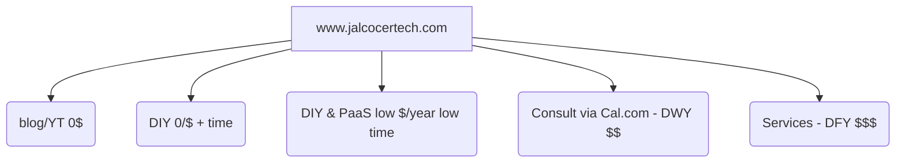

**Tl;DR**

Ive recently heard that buying a NAS seems to make things much easier/better/faster than a MiniPC + Docker.

Time to prove that's not always true, especially with these [PaaS Tools](#paas-tools) available.

> Consider this a PaaS 101 if you dont know what im talking about.

**Intro**

So you've been around even [when ATI](https://jalcocert.github.io/JAlcocerT/firebat-ak2-plus-minipc-review/#throwback-on-hardware) was still a thing.


  


You were using [Linux OS's](https://jalcocert.github.io/JAlcocerT/os-for-nas/) when nobody was.

And now apple ecosystem is so confortable that makes anything else scary?

Pleeeeeease...

Few months ago, I wrote about [different **PaaS** Tools](https://jalcocert.github.io/JAlcocerT/deploying-software-with-paas-to-servers/)

And more recently, I made a [**VPS recap** on where to deploy](https://jalcocert.github.io/JAlcocerT/where-to-deploy/#among-all-paas---what-to-choose) your SaaS/apps.

Playing with other dev's apps baremetal, without containers is a no go and everytime I vibe code sth I dont consider it finished until it works within Make and a container.

Next level goes if you are confortable with Selfhosting via container `ymls` within a HomeLab:

<!--  -->


  
  


And...last level: **The builder:**


  
  


UmbrelOS, Cosmos Server or tools like Coolify, [Dokploy](https://jalcocert.github.io/JAlcocerT/selfhosted-paas/)....and [many others](https://jalcocert.github.io/JAlcocerT/deploying-software-with-paas-to-servers/#paas-what) are great.


  


This feels like time for a **PaaS recap**: focusing on how to deploy your SaaS/apps and/or create a platform for users to self-service from OSS projects.

## Intro

If you are also new to HomeLabs and/or Linux. 

These are some reasons for you to stay:

<!--  -->
<!--  -->


  


You can even run a Jellyfin Media server with a Opi SBC!

> And forget about mandatory cloud subscriptions to get a notepad running

I want to make a recap of PaaS Tools available.

Its been a while since I started [selfhosting with the Pi](https://jalcocert.github.io/RPi/tags/self-hosting/), so hopefully this will come handy to people getting started.

## PaaS Tools

I was collecting the configurations for these tools before: 


  


With this post, Ive made sure they are on the new repo and working:


  


Today, we are going to see:

1. LocalStack
2. RuntiPi
3. [UmbrelOS](https://jalcocert.github.io/JAlcocerT/selfhosted-apps-nov-2025/#selfhosted-adventures) - Not a PaaS, but having a OS inside a docker container and just click to deploy apps is fantastic
4. Coolify and Dokploy

### Others First

#### LocalStack

LocalStack is a tool designed for developers who want to test **AWS functionalities locally**. 

It provides an **emulated environment of AWS services**, solving issues related to unpredictable billing and resource management during development. 

<!-- https://www.youtube.com/watch?v=ZpMXW_beUuA -->



- **Purpose**: LocalStack emulates AWS API functionality.
- **Problem Solved**: Allows local testing without involving AWS services directly.
- **Installation**: 
  - Sign up with a GitHub account.
  - Use `brew install localstack/tap/localstack-cli` for installation on macOS.
  - Requires Docker to function as a local “mini-cloud” operating system.
- **Basic Use**: 
  - Set environment variables for AWS access.
  - Create services like S3 buckets using standard AWS commands.
  - Offers a Community Image for free usage.
- **Limitations**:
  - Not all AWS services are fully emulated; some are available only in the Pro version.
  - Works with a single API endpoint unlike AWS's regional separation.
- **Key Features**: 
  - Supports essential services like EC2.
  - Allows basic CRUD operations.
  - Requires understanding of feature coverage before use.

#### Runtipi

* https://github.com/runtipi/runtipi with AGPL-v3!

> [Runtipi](https://runtipi.io/) is a homeserver for everyone!

One command setup, one click installs for your favorites self-hosted apps. ✨

> Got to know this one thanks to [awsomedockercompose](https://awesome-docker-compose.com)

### DokPloy vs Coolify

Like the well known Coolify and Dokploy:


  
  


<!-- https://youtu.be/RoANBROvUeE?si=eoFnH_LBgEBj7j9q -->



> Wait: Coolify is [PHP](https://jalcocert.github.io/JAlcocerT/backend-alternatives/) based vs Dokploy that is NextJS based

But for pragmatic users, who want to build on top of such tools:

#### Dokploy on a VPS

I wrote about Dokploy [here](https://jalcocert.github.io/JAlcocerT/selfhosted-paas/#dokploy)


  
  


#### Setting up Coolify on a Pi

Because why not.


  


<!--  -->

### OSS OS inside containers

How could we think that running windows inside a container is the only possible OS that allow it.

Remember, we even had web tops!


  
  


And one of my recent learnings: UmbrelOS and Cosmos Server, both allow one click deployment of apps


  
  


#### Cosmos Server vs UmbrelOS

<!--  -->

Im still hyped with Umbrel os and their tons of Apps, available at one click via UI.

If you need nextcloud or want to practice [D&A on crypto](https://apps.umbrel.com/app/bitcoin) - [btc node](https://forocoches.com/foro/showthread.php?t=8706177), you are covered: https://apps.umbrel.com/app/


  
  


And with a https://github.com/azukaar/Cosmos-Server you can literally: ,*Escape the cloud'*

<!--  -->

---

## Conclusions

There will be more and more tools coming to the PaaS Space.

Because is not just about creating, but [deploying](https://jalcocert.github.io/JAlcocerT/where-to-deploy/) the applications so that they are available to the users.

But as of today, [having a cloud at home](https://nielscautaerts.xyz/we-have-cloud-at-home.html) is not that hard.

Like as I [read on reddit](https://www.reddit.com/r/selfhosted/comments/1ol1v34/nixopus_oneclick_app_hosting_on_your_own_server/): 

* https://github.com/raghavyuva/nixopus

>  Open Source Alternative to vercel, heroku, netlify with simplified workflows 

> > They are working towards a v1 as of now!

### A Brand around PaaS and OSS Software

Thinking about the **DIY/DWY/DFY framework**: I thought that a kind of advance DIY is when someone is able to select the software that they want, via UI and it gets deployed seemlessly.


  
  


That's what PaaS are for: *help you scale the software that you ship*

Bc the software...you can vibe coded it, send it to git and prepare a bundle via containers. 

Or just use permissive OSS only.

And for cases like the weddings in the beginning of this year, it could get the job done and fast.


  
  


> That could be a thing going forward for `paas.jalcocertech.com`

> > I guess I will need a linkprofile to avoid loosing my mind with all the options.

Then some cool Landing should be placed at `consult.jalcocertech.com` with calcom+stripe


  


Whatever I was doing before this year...

Yea, with 'Webify' I intended to do all from scratch: from infra to web/services

To...maybe get paid 100$/year? 

No thanks! There is a better way:

- OSS PaaS will do the infra - For 100$ you bring your own OSS app like /WP/Ghost and forget about servers

.........

https://www.youtube.com/watch?v=hl8ebudhqZU

To build an e-commerce system around Coolify that can spin up WordPress or Ghost sites for users on demand, you would need several components working together to automate deployment, user management, and payments:

1. **Coolify as Deployment Backend**  
   Use Coolify’s API or CLI to automate deployment of WordPress or Ghost instances.
   Coolify can deploy Dockerized or containerized apps from templates or Git repos: so the astro ebooks, linktree etc could also be deployed.

2. **E-Commerce Platform / Storefront**  
   - A web frontend where users can browse WordPress or Ghost site templates, choose options, and pay.
   - Could be a custom React/Vue app or integration with existing e-commerce platforms like Shopify, WooCommerce, or headless commerce solutions.
   - Supports payment gateways (Stripe, PayPal, etc.).

3. **User & Site Management System**  
   - Backend that manages user accounts and tracks purchased subscriptions or sites.
   - Upon purchase, triggers creation of new WordPress/Ghost site deployment via Coolify API.
   - Maintains credentials and site URLs for users.

4. **Automation/orchestration Layer**  
   - Service or serverless function listening for new orders.
   - Interacts with Coolify API to spin up new containers with WordPress or Ghost.
   - Configures environment variables (database credentials, admin user info) and DNS routing.

5. **Database & Persistent Storage**  
   - Since WordPress and Ghost require databases, you need persistent database instances (MySQL/MariaDB for WordPress, SQLite/MySQL or PostgreSQL for Ghost) managed either by Coolify or externally.
   - Persistent volumes for user content.

6. **Domain & SSL Management**  
   - Automated DNS provisioning or user prompts to configure domains.
   - Automated SSL certificate provisioning via Let’s Encrypt or similar integrated into Coolify or custom layer.

7. **Scaling & Monitoring**  
   - Infrastructure monitoring with alerts.
   - User limits or scaling policies as site numbers grow.

Integration Example Flow

- User visits e-commerce site → selects WordPress/Ghost plan or template → pays → backend service calls Coolify API → deploys new instance with site setup → user receives site access info.

- Coolify can handle container deployment and app lifecycle.
- You need to build or integrate a payment-enabled storefront and user management system.
- Automate deployment triggers via Coolify’s API.
- Ensure persistent database and storage solutions.
- Automate domain and SSL handling for user convenience.

This architecture turns Coolify into a deployment engine behind a full multi-tenant hosted WordPress/Ghost e-commerce platform. It requires significant development beyond Coolify itself but is fully achievable with Coolify as the core deployment layer.[1][2]

[1](https://coolify.io/docs/)
[2](https://coolify.io/docs/get-started/contribute/service)

#### TinyAuth x PaaS ? 

#### IAM x PaaS ?

#### Outro

Ive seen quite big organizations building their D&A pipelines on top of OSS like Grafana, superset, minio, Apache Iceberg or...HDFS to name a few.

So, if you are good with servers / homelabs, there is nothign stopping you to go there and provide similar offerings.

> Would you become...the next cool platform owner?

> > Dont believe me? `https://autoize.ch/managed-open-source-apps/` There areManaged hosting for open-source applications 

* https://www.solarpace.io/ <!-- Solarpace: Managed hosting platform -->
* https://www.cloudron.io/store/io.hackmd.cloudronapp.html <!-- Cloudron: Self-hosted app platform with HackMD -->
    * https://www.cloudron.io/pricing.html

I see those different to Elestio and company.

More like a: come here, I will tell you which OSS you need to unstuck your business and will set it up for you.

---

## FAQ

* https://www.youtube.com/@elestio/videos

* https://www.youtube.com/@webnestify

* https://www.linode.com/marketplace/apps/linode/saltcorn/ <!-- Saltcorn: Open-source low-code platform for building web applications -->

* https://www.trydome.io/ <!-- Dome: Self-hosted application platform -->

https://www.youtube.com/watch?v=zhK0sARGhYc

* https://railway.app/template/LO03gz?referralCode=uch-he <!-- Railway: Cloud platform for deploying applications -->
* https://railway.app/pricing

* https://render.com/pricing <!-- Render: Cloud platform for hosting web services -->

* https://elest.io/open-source/rallly <!-- Rallly: Open-source scheduling/polling application -->

* https://www.pikapods.com/apps <!-- PikaPods: Managed open-source application hosting -->

### What exactly do you need?

Let's test these PaaS with some of the selfhostable WebApps I have tried at some point.

#### Time Management via PaaS

Time Management?

Yes! Because its all about [time](https://jalcocert.github.io/JAlcocerT/time-management-data-analytics/) and [focus](https://jalcocert.github.io/JAlcocerT/tools-to-improve-focus/).

Specially if you are a [PM](https://jalcocert.github.io/JAlcocerT/selfhosting-pm-tools-docker/) on your agency.


  
  




* Improved Productivity: Tracking the time of your tasks can help you identify how much time you spend on each task, and where you may be losing time or getting distracted. This information can help you make adjustments to your workflow to become more productive and efficient.
    * For example, you may realize that you spend too much time on low-priority tasks, or that you get distracted by social media or email notifications. By identifying these areas for improvement, you can adjust your habits and become more productive.

* Better Planning and Prioritization: Tracking the time of your tasks can also help you better plan and prioritize your work. By understanding how long it takes you to complete certain tasks, you can create more realistic timelines and set achievable goals. 
    * This can help you avoid overcommitting or underestimating the time needed for a project, which can lead to stress and missed deadlines.

* Increased Focus and Accountability: Tracking the time of your tasks can also increase your focus and accountability. When you know that you are tracking your time, you are more likely to stay focused on the task at hand and avoid distractions. Additionally, tracking your time can help you hold yourself accountable for meeting your goals and deadlines.

* Data-Driven Insights: Tracking the time of your tasks can provide you with data-driven insights into your work habits and productivity. By analyzing this data, you can **identify patterns and trends in your work**, and make adjustments to improve your workflow. 
    * For example, you may realize that you are most productive during certain times of day, or that you work best in short bursts with frequent breaks.



#### Business Chat via PaaS

A [chat for your business](https://jalcocert.github.io/JAlcocerT/communication-management/)?

Look no further than Matrix: synapse / dendrite / conduit available as flavours of the same.


  
  


#### OSS HelpDesk

* https://github.com/frappe/helpdesk

> agpl 3.0 | Modern, Streamlined, Free and Open Source Customer Service Software

With more and more vibe coding tools, you can even offer shift planners for...gyms?

* https://github.com/panteLx/BetterShift

> MIT |  A modern shift management application built with Next.js and SQLite. BetterShift helps you organize and manage work shifts across multiple calendars with customizable presets, color coding, password protection and external calendar sync. 


  


##### Other OSS Tools for a Small Business

* https://github.com/snipe/snipe-it

Snipe-IT: Open-source asset management system
